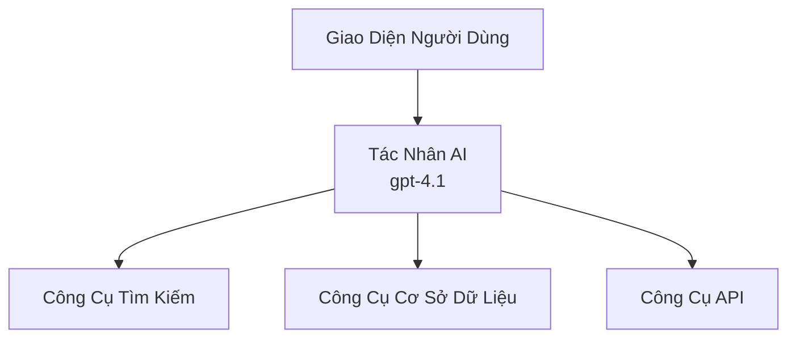
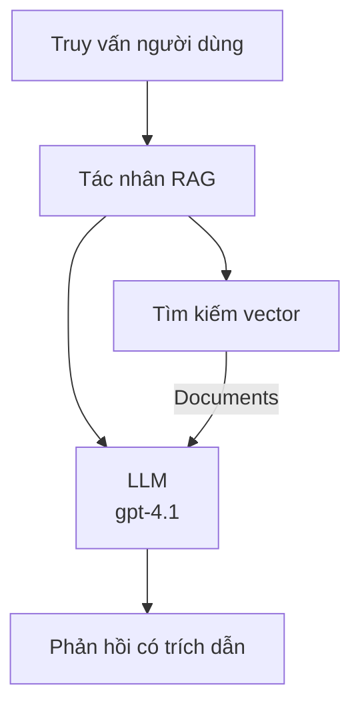
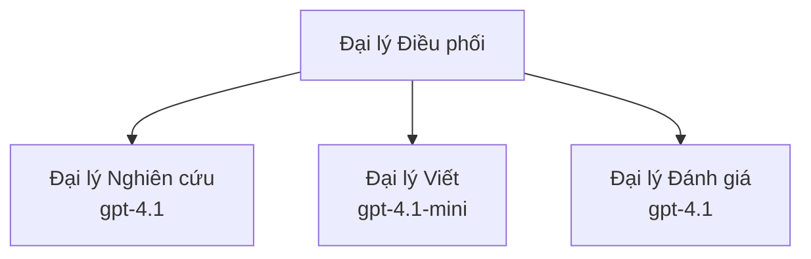

# Đại lý AI với Azure Developer CLI

**Điều hướng Chương:**
- **📚 Trang Khóa Học**: [AZD Dành Cho Người Mới](../../README.md)
- **📖 Chương Hiện Tại**: Chương 2 - Phát Triển Ưu Tiên AI
- **⬅️ Trước**: [Tích hợp Microsoft Foundry](microsoft-foundry-integration.md)
- **➡️ Tiếp Theo**: [Triển Khai Mô Hình AI](ai-model-deployment.md)
- **🚀 Nâng Cao**: [Giải Pháp Đa Đại Lý](../../examples/retail-scenario.md)

---

## Giới thiệu

Đại lý AI là các chương trình tự động có thể nhận biết môi trường, đưa ra quyết định và thực hiện hành động để đạt được các mục tiêu cụ thể. Khác với các chatbot đơn giản chỉ trả lời theo yêu cầu, đại lý có thể:

- **Sử dụng công cụ** - Gọi API, tìm kiếm cơ sở dữ liệu, thực thi mã
- **Lập kế hoạch và suy luận** - Phân chia các nhiệm vụ phức tạp thành các bước
- **Học từ ngữ cảnh** - Giữ bộ nhớ và thích nghi hành vi
- **Hợp tác** - Làm việc với các đại lý khác (hệ thống đa đại lý)

Hướng dẫn này sẽ chỉ bạn cách triển khai đại lý AI lên Azure sử dụng Azure Developer CLI (azd).

> **Lưu ý xác nhận (2026-07-13):** Hướng dẫn này được kiểm tra với `azd` `1.27.1` và `azure.ai.agents` `1.0.0-beta.5`. Trải nghiệm `azd ai` vẫn đang ở giai đoạn xem trước nên hãy kiểm tra trợ giúp mở rộng nếu các cờ cài đặt của bạn khác biệt.

## Mục tiêu học tập

Bằng cách hoàn thành hướng dẫn này, bạn sẽ:
- Hiểu đại lý AI là gì và khác biệt với chatbot như thế nào
- Triển khai các mẫu đại lý AI có sẵn sử dụng AZD
- Cấu hình Foundry Agents cho đại lý tùy chỉnh
- Triển khai các mẫu đại lý cơ bản (sử dụng công cụ, RAG, đa đại lý)
- Theo dõi và gỡ lỗi đại lý đã triển khai

## Kết quả học tập

Sau khi hoàn thành, bạn sẽ có khả năng:
- Triển khai ứng dụng đại lý AI lên Azure chỉ với một lệnh
- Cấu hình công cụ và khả năng của đại lý
- Triển khai tạo văn bản hỗ trợ truy xuất (RAG) với đại lý
- Thiết kế kiến trúc đa đại lý cho quy trình phức tạp
- Khắc phục sự cố phổ biến khi triển khai đại lý

---

## 🤖 Điều Gì Làm Đại Lý Khác Biệt Với Chatbot?

| Tính năng | Chatbot | Đại Lý AI |
|---------|---------|----------|
| **Hành vi** | Trả lời theo lời nhắc | Thực hiện hành động tự chủ |
| **Công cụ** | Không có | Có thể gọi API, tìm kiếm, thực thi mã |
| **Bộ nhớ** | Chỉ theo phiên | Bộ nhớ lưu trữ liên tục qua các phiên |
| **Lập kế hoạch** | Trả lời đơn lẻ | Suy luận đa bước |
| **Hợp tác** | Thực thể đơn | Có thể làm việc với các đại lý khác |

### Minh họa đơn giản

- **Chatbot** = Một người hỗ trợ trả lời câu hỏi tại quầy thông tin
- **Đại Lý AI** = Một trợ lý cá nhân có thể gọi điện, đặt lịch và hoàn thành các nhiệm vụ cho bạn

---

## 🚀 Bắt đầu Nhanh: Triển khai Đại Lý Đầu Tiên của Bạn

### Lựa chọn 1: Mẫu Foundry Agents (Khuyến nghị)

```bash
# Khởi tạo mẫu đại lý AI
azd init --template get-started-with-ai-agents

# Triển khai lên Azure
azd up
```

**Những gì được triển khai:**
- ✅ Foundry Agents
- ✅ Mô hình Microsoft Foundry (gpt-4.1)
- ✅ Azure AI Search (cho RAG)
- ✅ Azure Container Apps (giao diện web)
- ✅ Application Insights (giám sát)

**Thời gian:** ~15-20 phút
**Chi phí:** ~$100-150/tháng (phát triển)

### Lựa chọn 2: Đại lý OpenAI với Prompty

```bash
# Khởi tạo mẫu đại lý dựa trên Prompty
azd init --template agent-openai-python-prompty

# Triển khai lên Azure
azd up
```

**Những gì được triển khai:**
- ✅ Azure Functions (thực thi đại lý không máy chủ)
- ✅ Mô hình Microsoft Foundry
- ✅ Tệp cấu hình Prompty
- ✅ Triển khai mẫu đại lý

**Thời gian:** ~10-15 phút
**Chi phí:** ~$50-100/tháng (phát triển)

### Lựa chọn 3: Đại lý RAG Chat

```bash
# Khởi tạo mẫu trò chuyện RAG
azd init --template azure-search-openai-demo

# Triển khai lên Azure
azd up
```

**Những gì được triển khai:**
- ✅ Mô hình Microsoft Foundry
- ✅ Azure AI Search với dữ liệu mẫu
- ✅ Quy trình xử lý tài liệu
- ✅ Giao diện chat có trích dẫn

**Thời gian:** ~15-25 phút
**Chi phí:** ~$80-150/tháng (phát triển)

### Lựa chọn 4: AZD AI Agent Init (Xem trước dựa trên manifest hoặc mẫu)

Nếu bạn có tệp manifest đại lý, có thể sử dụng lệnh `azd ai` để tạo dự án dịch vụ Foundry Agent trực tiếp. Các bản xem trước gần đây cũng đã thêm hỗ trợ khởi tạo theo mẫu, nên quy trình nhắc có thể hơi khác tùy phiên bản mở rộng cài đặt của bạn.

```bash
# Cài đặt tiện ích mở rộng tác nhân AI
azd extension install azure.ai.agents

# Tùy chọn: xác minh phiên bản xem trước đã cài đặt
azd extension show azure.ai.agents

# Khởi tạo từ một tập tin mô tả tác nhân
azd ai agent init -m agent-manifest.yaml

# Triển khai lên Azure
azd up

# Kiểm tra tác nhân đã triển khai (hiển thị độ trễ + thời gian đến byte đầu tiên)
azd ai agent invoke
```

**Khi nào dùng `azd ai agent init` so với `azd init --template`:**

| Cách tiếp cận | Phù hợp cho | Cách hoạt động |
|----------|----------|------|
| `azd init --template` | Bắt đầu từ ứng dụng mẫu đã chạy được | Sao chép toàn bộ kho mẫu gồm mã và hạ tầng |
| `azd ai agent init -m` | Xây dựng từ manifest đại lý của bạn | Tạo cấu trúc dự án dựa trên định nghĩa đại lý |

> **Mẹo:** Dùng `azd init --template` khi học (Các lựa chọn 1-3 ở trên). Dùng `azd ai agent init` khi xây dựng đại lý sản xuất với manifest riêng.

Sau `azd up`, cùng một tiện ích mở rộng sẽ hỗ trợ bạn qua toàn bộ vòng đời đại lý: `azd ai agent invoke` để thử nghiệm, `azd ai agent eval generate` và `azd ai agent optimize` để đo lường và cải thiện chất lượng, và `azd ai agent delete` để dọn dẹp. Xem [Lệnh CLI AI AZD](../chapter-08-production/production-ai-practices.md#azd-ai-cli-commands-and-extensions) để tham khảo đầy đủ.

---

## 🏗️ Mẫu Kiến Trúc Đại Lý

### Mẫu 1: Đại Lý Đơn Với Công Cụ

Mẫu đại lý đơn giản nhất - một đại lý có thể dùng nhiều công cụ.



**Phù hợp cho:**
- Bot hỗ trợ khách hàng
- Trợ lý nghiên cứu
- Đại lý phân tích dữ liệu

**Mẫu AZD:** `azure-search-openai-demo`

### Mẫu 2: Đại lý RAG (Tạo văn bản hỗ trợ truy xuất)

Đại lý truy xuất tài liệu liên quan trước khi tạo câu trả lời.



**Phù hợp cho:**
- Cơ sở tri thức doanh nghiệp
- Hệ thống hỏi đáp tài liệu
- Nghiên cứu tuân thủ và pháp lý

**Mẫu AZD:** `azure-search-openai-demo`

### Mẫu 3: Hệ Thống Đa Đại Lý

Nhiều đại lý chuyên biệt làm việc cùng nhau trên các nhiệm vụ phức tạp.



**Phù hợp cho:**
- Tạo nội dung phức tạp
- Quy trình đa bước
- Nhiệm vụ yêu cầu chuyên môn khác nhau

**Tìm hiểu thêm:** [Mẫu Điều phối Đa Đại Lý](../chapter-06-pre-deployment/coordination-patterns.md)

---

## ⚙️ Cấu Hình Công Cụ Cho Đại Lý

Đại lý trở nên mạnh mẽ khi có thể dùng công cụ. Dưới đây là cách cấu hình các công cụ phổ biến:

### Cấu hình công cụ trong Foundry Agents

```python
# agent_config.py
from azure.ai.projects import AIProjectClient
from azure.ai.projects.models import FunctionTool, CodeInterpreterTool

# Định nghĩa công cụ tùy chỉnh
search_tool = FunctionTool(
    name="search_knowledge_base",
    description="Search the company knowledge base for relevant documents",
    parameters={
        "type": "object",
        "properties": {
            "query": {
                "type": "string",
                "description": "The search query"
            }
        },
        "required": ["query"]
    }
)

# Tạo tác nhân với các công cụ
agent = project_client.agents.create_agent(
    model="gpt-4.1",
    name="Support Agent",
    instructions="You are a helpful support agent. Use the search tool to find relevant information.",
    tools=[search_tool, CodeInterpreterTool()]
)
```

### Cấu hình môi trường

```bash
# Thiết lập biến môi trường riêng cho đại lý
azd env set AZURE_OPENAI_MODEL "gpt-4.1"
azd env set AGENT_INSTRUCTIONS "You are a helpful assistant..."
azd env set ENABLE_CODE_INTERPRETER "true"
azd env set ENABLE_FILE_SEARCH "true"

# Triển khai với cấu hình đã cập nhật
azd deploy
```

---

## 📊 Giám sát Đại Lý

### Tích hợp Application Insights

Tất cả các mẫu đại lý AZD đều bao gồm Application Insights để giám sát:

```bash
# Mở bảng điều khiển giám sát
azd monitor --overview

# Xem nhật ký trực tiếp
azd monitor --logs

# Xem số liệu trực tiếp
azd monitor --live
```

### Các chỉ số chính cần theo dõi

| Chỉ số | Mô tả | Mục tiêu |
|--------|-------------|--------|
| Độ trễ phản hồi | Thời gian tạo phản hồi | < 5 giây |
| Sử dụng token | Token mỗi yêu cầu | Giám sát chi phí |
| Tỷ lệ gọi công cụ thành công | % thực thi công cụ thành công | > 95% |
| Tỷ lệ lỗi | Yêu cầu đại lý thất bại | < 1% |
| Mức độ hài lòng người dùng | Điểm phản hồi | > 4.0/5.0 |

### Ghi nhật ký tùy chỉnh cho đại lý

```python
import os
from azure.monitor.opentelemetry import configure_azure_monitor
from opentelemetry import trace

# Cấu hình Azure Monitor với OpenTelemetry
configure_azure_monitor(
    connection_string=os.environ["APPLICATIONINSIGHTS_CONNECTION_STRING"]
)

tracer = trace.get_tracer(__name__)

def log_agent_interaction(user_query, agent_response, tools_used, latency_ms):
    with tracer.start_as_current_span("agent_interaction") as span:
        span.set_attributes({
            "user_query": user_query,
            "response_length": len(agent_response),
            "tools_used": tools_used,
            "latency_ms": latency_ms
        })
```

> **Lưu ý:** Cài đặt các gói cần thiết: `pip install azure-monitor-opentelemetry opentelemetry`

---

## 💰 Cân nhắc chi phí

### Ước tính chi phí hàng tháng theo mẫu

| Mẫu | Môi trường phát triển | Sản xuất |
|---------|-----------------|------------|
| Đại lý đơn | $50-100 | $200-500 |
| Đại lý RAG | $80-150 | $300-800 |
| Đa đại lý (2-3 đại lý) | $150-300 | $500-1,500 |
| Đa đại lý doanh nghiệp | $300-500 | $1,500-5,000+ |

### Mẹo tối ưu chi phí

1. **Dùng gpt-4.1-mini cho nhiệm vụ đơn giản**
   ```bash
   azd env set AZURE_OPENAI_MODEL "gpt-4.1-mini"
   ```

2. **Triển khai bộ nhớ đệm cho các truy vấn lặp lại**
   ```python
   from functools import lru_cache
   
   @lru_cache(maxsize=1000)
   def get_cached_response(query_hash):
       return agent.run(query_hash)
   ```

3. **Đặt giới hạn token cho mỗi lần chạy**
   ```python
   # Đặt max_completion_tokens khi chạy tác nhân, không phải trong quá trình tạo
   run = project_client.agents.create_run(
       thread_id=thread.id,
       agent_id=agent.id,
       max_completion_tokens=1000  # Giới hạn độ dài phản hồi
   )
   ```

4. **Thu nhỏ về zero khi không sử dụng**
   ```bash
   # Ứng dụng Container tự động mở rộng về không
   azd env set MIN_REPLICAS "0"
   ```

---

## 🔧 Xử lý sự cố đại lý

### Vấn đề thường gặp và giải pháp

<details>
<summary><strong>❌ Đại lý không phản hồi khi gọi công cụ</strong></summary>

```bash
# Kiểm tra xem các công cụ đã được đăng ký đúng cách chưa
azd show

# Xác minh triển khai OpenAI
az cognitiveservices account deployment list \
  --name $AZURE_OPENAI_NAME \
  --resource-group $RG_NAME

# Kiểm tra nhật ký đại lý
azd monitor --logs
```

**Nguyên nhân phổ biến:**
- Sai chữ ký hàm công cụ
- Thiếu quyền cần thiết
- API endpoint không truy cập được
</details>

<details>
<summary><strong>❌ Độ trễ cao trong phản hồi đại lý</strong></summary>

```bash
# Kiểm tra Application Insights để tìm các điểm nghẽn
azd monitor --live

# Cân nhắc sử dụng mô hình nhanh hơn
azd env set AZURE_OPENAI_MODEL "gpt-4.1-mini"
azd deploy
```

**Mẹo tối ưu:**
- Sử dụng phản hồi streaming
- Triển khai bộ nhớ đệm phản hồi
- Giảm kích thước cửa sổ ngữ cảnh
</details>

<details>
<summary><strong>❌ Đại lý trả về thông tin sai hoặc ảo tưởng</strong></summary>

```python
# Cải thiện với các lệnh hệ thống tốt hơn
instructions = """
You are a helpful assistant. IMPORTANT:
- Only answer based on provided context
- If you don't know, say "I don't know"
- Always cite your sources
- Never make up information
"""

# Thêm khả năng truy xuất để làm cơ sở
agent = project_client.agents.create_agent(
    model="gpt-4.1",
    instructions=instructions,
    tools=[FileSearchTool()]  # Căn cứ câu trả lời vào tài liệu
)
```
</details>

<details>
<summary><strong>❌ Lỗi vượt quá giới hạn token</strong></summary>

```python
# Triển khai quản lý cửa sổ ngữ cảnh
def truncate_context(messages, max_tokens=8000, model="gpt-4.1"):
    """Keep only recent messages within token limit."""
    import tiktoken
    encoding = tiktoken.encoding_for_model(model)
    total_tokens = 0
    truncated = []
    
    for msg in reversed(messages):
        msg_tokens = len(encoding.encode(msg.content))
        if total_tokens + msg_tokens > max_tokens:
            break
        truncated.insert(0, msg)
        total_tokens += msg_tokens
    
    return truncated
```
</details>

---

## 🎓 Bài tập Thực hành

### Bài tập 1: Triển khai Đại lý Cơ bản (20 phút)

**Mục tiêu:** Triển khai đại lý AI đầu tiên của bạn bằng AZD

```bash
# Bước 1: Khởi tạo mẫu
azd init --template get-started-with-ai-agents

# Bước 2: Đăng nhập vào Azure
azd auth login
# Nếu bạn làm việc qua các khách hàng thuê, thêm --tenant-id <tenant-id>

# Bước 3: Triển khai
azd up

# Bước 4: Kiểm tra tác nhân
# Kết quả mong đợi sau khi triển khai:
#   Triển khai hoàn thành!
#   Điểm cuối: https://<app-name>.<region>.azurecontainerapps.io
# Mở URL hiển thị trong kết quả và thử hỏi một câu hỏi

# Bước 5: Xem giám sát
azd monitor --overview

# Bước 6: Dọn dẹp
azd down --force --purge
```

**Tiêu chí thành công:**
- [ ] Đại lý phản hồi câu hỏi
- [ ] Có thể truy cập bảng điều khiển giám sát qua `azd monitor`
- [ ] Tài nguyên được dọn dẹp thành công

### Bài tập 2: Thêm Công Cụ Tùy Chỉnh (30 phút)

**Mục tiêu:** Mở rộng đại lý bằng công cụ tùy chỉnh

1. Triển khai mẫu đại lý:
   ```bash
   azd init --template get-started-with-ai-agents
   azd up
   ```
2. Tạo hàm công cụ mới trong mã đại lý:
   ```python
   def get_weather(location: str) -> str:
       """Get current weather for a location."""
       # Gọi API tới dịch vụ thời tiết
       return f"Weather in {location}: Sunny, 72°F"
   ```
3. Đăng ký công cụ với đại lý:
   ```python
   from azure.ai.projects.models import FunctionTool

   weather_tool = FunctionTool(
       name="get_weather",
       description="Get current weather for a location",
       parameters={
           "type": "object",
           "properties": {
               "location": {"type": "string", "description": "City name"}
           },
           "required": ["location"]
       }
   )

   agent = project_client.agents.create_agent(
       model="gpt-4.1",
       name="Weather Agent",
       tools=[weather_tool]
   )
   ```
4. Triển khai lại và thử nghiệm:
   ```bash
   azd deploy
   # Hỏi: "Thời tiết ở Seattle như thế nào?"
   # Mong đợi: Đại lý gọi get_weather("Seattle") và trả về thông tin thời tiết
   ```

**Tiêu chí thành công:**
- [ ] Đại lý nhận diện truy vấn liên quan đến thời tiết
- [ ] Công cụ được gọi đúng
- [ ] Phản hồi bao gồm thông tin thời tiết

### Bài tập 3: Xây dựng Đại lý RAG (45 phút)

**Mục tiêu:** Tạo đại lý trả lời câu hỏi dựa trên tài liệu của bạn

```bash
# Bước 1: Triển khai mẫu RAG
azd init --template azure-search-openai-demo
azd up

# Bước 2: Tải lên tài liệu của bạn
# Đặt các tệp PDF/TXT vào thư mục data/, sau đó chạy:
python scripts/prepdocs.py

# Bước 3: Kiểm tra với các câu hỏi chuyên ngành
# Mở URL ứng dụng web từ đầu ra azd up
# Đặt câu hỏi về các tài liệu bạn đã tải lên
# Các phản hồi nên bao gồm các tham chiếu trích dẫn như [doc.pdf]
```

**Tiêu chí thành công:**
- [ ] Đại lý trả lời dựa trên tài liệu đã tải lên
- [ ] Phản hồi có trích dẫn
- [ ] Không có ảo tưởng với câu hỏi ngoài phạm vi

---

## 📚 Bước Tiếp Theo

Bây giờ bạn đã hiểu đại lý AI, hãy khám phá các chủ đề nâng cao sau:

| Chủ đề | Mô tả | Liên kết |
|-------|-------------|------|
| **Hệ thống Đa Đại Lý** | Xây dựng hệ thống với nhiều đại lý hợp tác | [Ví dụ Đa Đại Lý Bán Lẻ](../../examples/retail-scenario.md) |
| **Mẫu Điều phối** | Học mẫu điều phối và giao tiếp | [Mẫu Điều phối](../chapter-06-pre-deployment/coordination-patterns.md) |
| **Triển khai Sản xuất** | Triển khai đại lý doanh nghiệp sẵn sàng | [Thực hành AI Sản xuất](../chapter-08-production/production-ai-practices.md) |
| **Đánh giá Đại lý** | Kiểm thử và đánh giá hiệu năng đại lý | [Khắc phục sự cố AI](../chapter-07-troubleshooting/ai-troubleshooting.md) |
| **Phòng Thí nghiệm AI** | Thực hành: Làm giải pháp AI sẵn sàng AZD | [Phòng Thí nghiệm AI](ai-workshop-lab.md) |

---

## 📖 Tài nguyên Bổ sung

### Tài liệu Chính thức
- [Dịch vụ Đại lý Microsoft Foundry](https://learn.microsoft.com/azure/ai-services/agents/)
- [Bắt đầu nhanh Dịch vụ Đại lý Microsoft Foundry](https://learn.microsoft.com/azure/ai-services/agents/quickstart)
- [Khung Đại lý Semantic Kernel](https://learn.microsoft.com/semantic-kernel/)

### Mẫu AZD dành cho đại lý
- [Bắt đầu với Đại lý AI](https://github.com/Azure-Samples/get-started-with-ai-agents)
- [Đại lý OpenAI Python Prompty](https://github.com/Azure-Samples/agent-openai-python-prompty)
- [Trình diễn Azure Search OpenAI](https://github.com/Azure-Samples/azure-search-openai-demo)

### Tài nguyên cộng đồng
- [Awesome AZD - Mẫu đại lý](https://azure.github.io/awesome-azd/?tags=ai-agents)
- [Discord Azure AI](https://discord.gg/microsoft-azure)
- [Discord Microsoft Foundry](https://discord.gg/nTYy5BXMWG)

### Kỹ năng Đại lý cho Trình soạn thảo của bạn
- [**Kỹ năng Đại lý Microsoft Azure**](https://skills.sh/microsoft/github-copilot-for-azure) - Cài đặt kỹ năng đại lý AI tái sử dụng cho phát triển Azure trong GitHub Copilot, Cursor hoặc bất kỳ đại lý nào được hỗ trợ. Bao gồm kỹ năng cho [Azure AI](https://skills.sh/microsoft/github-copilot-for-azure/azure-ai), [Microsoft Foundry](https://skills.sh/microsoft/github-copilot-for-azure/microsoft-foundry), [triển khai](https://skills.sh/microsoft/github-copilot-for-azure/azure-deploy), và [chẩn đoán](https://skills.sh/microsoft/github-copilot-for-azure/azure-diagnostics):
  ```bash
  npx skills add microsoft/github-copilot-for-azure
  ```

---

**Điều hướng**
- **Bài học Trước**: [Tích hợp Microsoft Foundry](microsoft-foundry-integration.md)
- **Bài học Tiếp theo**: [Triển khai Mô hình AI](ai-model-deployment.md)

---

<!-- CO-OP TRANSLATOR DISCLAIMER START -->
**Tuyên bố miễn trừ trách nhiệm**:
Tài liệu này đã được dịch bằng dịch vụ dịch thuật AI [Co-op Translator](https://github.com/Azure/co-op-translator). Mặc dù chúng tôi cố gắng đảm bảo độ chính xác, xin lưu ý rằng bản dịch tự động có thể chứa lỗi hoặc sai sót. Tài liệu gốc bằng ngôn ngữ gốc nên được coi là nguồn tin chính thức. Đối với thông tin quan trọng, nên sử dụng dịch vụ dịch thuật chuyên nghiệp bởi con người. Chúng tôi không chịu trách nhiệm về bất kỳ hiểu lầm hoặc giải thích sai nào phát sinh từ việc sử dụng bản dịch này.
<!-- CO-OP TRANSLATOR DISCLAIMER END -->