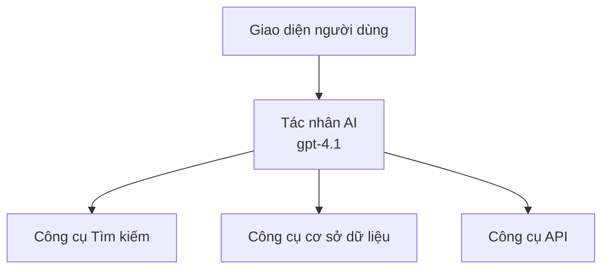
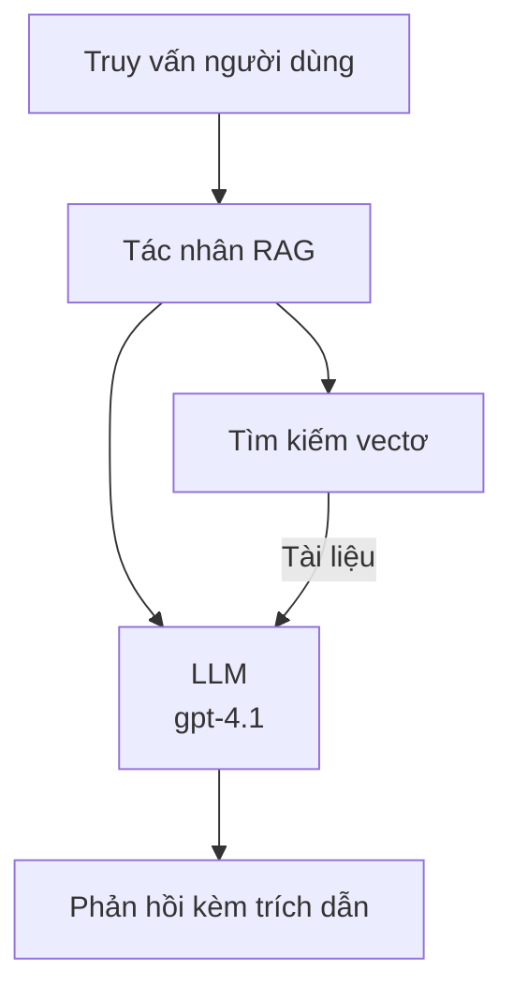
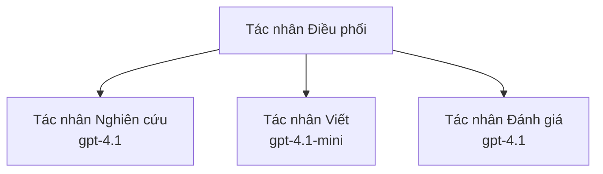

# Các tác nhân AI với Azure Developer CLI

**Điều hướng chương:**
- **📚 Trang chính Khóa học**: [AZD For Beginners](../../README.md)
- **📖 Chương hiện tại**: Chương 2 - Phát triển Ưu tiên AI
- **⬅️ Trước**: [Microsoft Foundry Integration](microsoft-foundry-integration.md)
- **➡️ Tiếp theo**: [AI Model Deployment](ai-model-deployment.md)
- **🚀 Nâng cao**: [Multi-Agent Solutions](../../examples/retail-scenario.md)

---

## Giới thiệu

Các tác nhân AI là các chương trình tự hành có khả năng cảm nhận môi trường, đưa ra quyết định và thực hiện hành động để đạt được các mục tiêu cụ thể. Khác với các chatbot đơn giản chỉ trả lời theo lời nhắc, các tác nhân có thể:

- **Sử dụng công cụ** - Gọi API, tìm kiếm cơ sở dữ liệu, thực thi mã
- **Lập kế hoạch và suy luận** - Chia các nhiệm vụ phức tạp thành các bước
- **Học từ ngữ cảnh** - Duy trì bộ nhớ và điều chỉnh hành vi
- **Hợp tác** - Làm việc với các tác nhân khác (hệ thống đa-tác nhân)

Hướng dẫn này chỉ cho bạn cách triển khai các tác nhân AI lên Azure bằng Azure Developer CLI (azd).

## Mục tiêu học tập

Khi hoàn thành hướng dẫn này, bạn sẽ:
- Hiểu các tác nhân AI là gì và khác biệt so với chatbot như thế nào
- Triển khai mẫu tác nhân AI có sẵn bằng AZD
- Cấu hình Foundry Agents cho các tác nhân tùy chỉnh
- Triển khai các mẫu tác nhân cơ bản (sử dụng công cụ, RAG, đa-tác nhân)
- Giám sát và gỡ lỗi các tác nhân đã triển khai

## Kết quả học tập

Sau khi hoàn thành, bạn sẽ có thể:
- Triển khai ứng dụng tác nhân AI lên Azure chỉ với một lệnh
- Cấu hình công cụ và khả năng cho tác nhân
- Triển khai retrieval-augmented generation (RAG) với tác nhân
- Thiết kế kiến trúc đa-tác nhân cho các luồng công việc phức tạp
- Khắc phục sự cố triển khai tác nhân thường gặp

---

## 🤖 Điều gì khiến một tác nhân khác biệt so với một chatbot?

| Tính năng | Chatbot | Tác nhân AI |
|---------|---------|----------|
| **Hành vi** | Trả lời theo lời nhắc | Thực hiện hành động tự động |
| **Công cụ** | Không có | Có thể gọi API, tìm kiếm, thực thi mã |
| **Bộ nhớ** | Chỉ theo phiên | Bộ nhớ tồn tại giữa các phiên |
| **Lập kế hoạch** | Phản hồi đơn | Suy luận đa bước |
| **Hợp tác** | Thực thể đơn | Có thể làm việc với các tác nhân khác |

### Tương tự đơn giản

- **Chatbot** = Một người hữu ích trả lời câu hỏi tại quầy thông tin
- **Tác nhân AI** = Một trợ lý cá nhân có thể gọi điện, đặt lịch và hoàn thành nhiệm vụ cho bạn

---

## 🚀 Bắt đầu nhanh: Triển khai Tác nhân đầu tiên của bạn

### Tùy chọn 1: Mẫu Foundry Agents (Khuyến nghị)

```bash
# Khởi tạo mẫu các tác nhân AI
azd init --template get-started-with-ai-agents

# Triển khai lên Azure
azd up
```

**Những gì được triển khai:**
- ✅ Foundry Agents
- ✅ Mô hình Microsoft Foundry (gpt-4.1)
- ✅ Azure AI Search (cho RAG)
- ✅ Azure Container Apps (giao diện web)
- ✅ Application Insights (giám sát)

**Thời gian:** ~15-20 phút
**Chi phí:** ~$100-150/tháng (phát triển)

### Tùy chọn 2: Tác nhân OpenAI với Prompty

```bash
# Khởi tạo mẫu tác nhân dựa trên Prompty
azd init --template agent-openai-python-prompty

# Triển khai lên Azure
azd up
```

**Những gì được triển khai:**
- ✅ Azure Functions (thực thi tác nhân không máy chủ)
- ✅ Mô hình Microsoft Foundry
- ✅ Tệp cấu hình Prompty
- ✅ Triển khai mẫu tác nhân

**Thời gian:** ~10-15 phút
**Chi phí:** ~$50-100/tháng (phát triển)

### Tùy chọn 3: Tác nhân Chat RAG

```bash
# Khởi tạo mẫu chat RAG
azd init --template azure-search-openai-demo

# Triển khai lên Azure
azd up
```

**Những gì được triển khai:**
- ✅ Mô hình Microsoft Foundry
- ✅ Azure AI Search với dữ liệu mẫu
- ✅ Quy trình xử lý tài liệu
- ✅ Giao diện chat với trích dẫn

**Thời gian:** ~15-25 phút
**Chi phí:** ~$80-150/tháng (phát triển)

### Tùy chọn 4: AZD AI Agent Init (Dựa trên Manifest)

Nếu bạn có tệp manifest tác nhân, bạn có thể sử dụng lệnh `azd ai` để tạo khung một dự án Foundry Agent Service trực tiếp:

```bash
# Cài đặt phần mở rộng tác nhân AI
azd extension install azure.ai.agents

# Khởi tạo từ tệp manifest của tác nhân
azd ai agent init -m agent-manifest.yaml

# Triển khai lên Azure
azd up
```

**Khi nào dùng `azd ai agent init` so với `azd init --template`:**

| Cách tiếp cận | Phù hợp nhất cho | Cách hoạt động |
|----------|----------|------|
| `azd init --template` | Bắt đầu từ một ứng dụng mẫu hoạt động | Sao chép một kho mẫu đầy đủ với mã + hạ tầng |
| `azd ai agent init -m` | Xây dựng từ manifest tác nhân của riêng bạn | Tạo cấu trúc dự án từ định nghĩa tác nhân của bạn |

> **Mẹo:** Sử dụng `azd init --template` khi học (Các Tùy chọn 1-3 ở trên). Sử dụng `azd ai agent init` khi xây dựng tác nhân cho môi trường production với manifest của riêng bạn. Xem [AZD AI CLI Commands](../chapter-08-production/production-ai-practices.md#azd-ai-cli-commands-and-extensions) để tham khảo đầy đủ.

---

## 🏗️ Mẫu Kiến trúc Tác nhân

### Mẫu 1: Tác nhân đơn với Công cụ

Mẫu tác nhân đơn giản nhất - một tác nhân có thể sử dụng nhiều công cụ.


**Phù hợp cho:**
- Bot hỗ trợ khách hàng
- Trợ lý nghiên cứu
- Tác nhân phân tích dữ liệu

**AZD Template:** `azure-search-openai-demo`

### Mẫu 2: Tác nhân RAG (Retrieval-Augmented Generation)

Một tác nhân truy xuất các tài liệu liên quan trước khi tạo phản hồi.


**Phù hợp cho:**
- Cơ sở tri thức doanh nghiệp
- Hệ thống Hỏi đáp tài liệu
- Nghiên cứu tuân thủ và pháp lý

**AZD Template:** `azure-search-openai-demo`

### Mẫu 3: Hệ thống Đa-tác nhân

Nhiều tác nhân chuyên biệt phối hợp cùng nhau để xử lý các nhiệm vụ phức tạp.


**Phù hợp cho:**
- Tạo nội dung phức tạp
- Luồng công việc đa bước
- Nhiệm vụ yêu cầu các chuyên môn khác nhau

**Tìm hiểu thêm:** [Multi-Agent Coordination Patterns](../chapter-06-pre-deployment/coordination-patterns.md)

---

## ⚙️ Cấu hình Công cụ cho Tác nhân

Tác nhân trở nên mạnh mẽ khi có thể sử dụng công cụ. Dưới đây là cách cấu hình các công cụ phổ biến:

### Cấu hình Công cụ trong Foundry Agents

```python
# agent_config.py
from azure.ai.projects import AIProjectClient
from azure.ai.projects.models import FunctionTool, CodeInterpreterTool

# Định nghĩa các công cụ tùy chỉnh
search_tool = FunctionTool(
    name="search_knowledge_base",
    description="Search the company knowledge base for relevant documents",
    parameters={
        "type": "object",
        "properties": {
            "query": {
                "type": "string",
                "description": "The search query"
            }
        },
        "required": ["query"]
    }
)

# Tạo tác nhân với các công cụ
agent = project_client.agents.create_agent(
    model="gpt-4.1",
    name="Support Agent",
    instructions="You are a helpful support agent. Use the search tool to find relevant information.",
    tools=[search_tool, CodeInterpreterTool()]
)
```

### Cấu hình Môi trường

```bash
# Thiết lập các biến môi trường dành riêng cho tác nhân
azd env set AZURE_OPENAI_MODEL "gpt-4.1"
azd env set AGENT_INSTRUCTIONS "You are a helpful assistant..."
azd env set ENABLE_CODE_INTERPRETER "true"
azd env set ENABLE_FILE_SEARCH "true"

# Triển khai với cấu hình đã cập nhật
azd deploy
```

---

## 📊 Giám sát Tác nhân

### Tích hợp Application Insights

Tất cả các mẫu tác nhân AZD bao gồm Application Insights để giám sát:

```bash
# Mở bảng điều khiển giám sát
azd monitor --overview

# Xem nhật ký theo thời gian thực
azd monitor --logs

# Xem số liệu theo thời gian thực
azd monitor --live
```

### Các chỉ số chính cần theo dõi

| Chỉ số | Mô tả | Mục tiêu |
|--------|-------------|--------|
| Độ trễ phản hồi | Thời gian tạo phản hồi | < 5 giây |
| Mức sử dụng token | Token mỗi yêu cầu | Theo dõi để kiểm soát chi phí |
| Tỷ lệ thành công gọi công cụ | % các lần thực thi công cụ thành công | > 95% |
| Tỷ lệ lỗi | Yêu cầu tác nhân thất bại | < 1% |
| Sự hài lòng của người dùng | Điểm phản hồi | > 4.0/5.0 |

### Ghi nhật ký tùy chỉnh cho Tác nhân

```python
import os
from azure.monitor.opentelemetry import configure_azure_monitor
from opentelemetry import trace

# Cấu hình Azure Monitor với OpenTelemetry
configure_azure_monitor(
    connection_string=os.environ["APPLICATIONINSIGHTS_CONNECTION_STRING"]
)

tracer = trace.get_tracer(__name__)

def log_agent_interaction(user_query, agent_response, tools_used, latency_ms):
    with tracer.start_as_current_span("agent_interaction") as span:
        span.set_attributes({
            "user_query": user_query,
            "response_length": len(agent_response),
            "tools_used": tools_used,
            "latency_ms": latency_ms
        })
```

> **Lưu ý:** Cài đặt các gói cần thiết: `pip install azure-monitor-opentelemetry opentelemetry`

---

## 💰 Cân nhắc Chi phí

### Ước tính Chi phí Hàng tháng theo Mẫu

| Mẫu | Môi trường Dev | Sản xuất |
|---------|-----------------|------------|
| Tác nhân đơn | $50-100 | $200-500 |
| Tác nhân RAG | $80-150 | $300-800 |
| Đa-tác nhân (2-3 tác nhân) | $150-300 | $500-1,500 |
| Đa-tác nhân doanh nghiệp | $300-500 | $1,500-5,000+ |

### Mẹo Tối ưu Chi phí

1. **Sử dụng gpt-4.1-mini cho các tác vụ đơn giản**
   ```bash
   azd env set AZURE_OPENAI_MODEL "gpt-4.1-mini"
   ```

2. **Triển khai bộ nhớ đệm cho các truy vấn lặp lại**
   ```python
   from functools import lru_cache
   
   @lru_cache(maxsize=1000)
   def get_cached_response(query_hash):
       return agent.run(query_hash)
   ```

3. **Đặt giới hạn token cho mỗi lần chạy**
   ```python
   # Đặt max_completion_tokens khi chạy agent, không phải khi tạo
   run = project_client.agents.create_run(
       thread_id=thread.id,
       agent_id=agent.id,
       max_completion_tokens=1000  # Giới hạn độ dài phản hồi
   )
   ```

4. **Tự động scale về 0 khi không sử dụng**
   ```bash
   # Container Apps tự động co về 0
   azd env set MIN_REPLICAS "0"
   ```

---

## 🔧 Khắc phục sự cố Tác nhân

### Các vấn đề phổ biến và giải pháp

<details>
<summary><strong>❌ Tác nhân không phản hồi khi gọi công cụ</strong></summary>

```bash
# Kiểm tra xem các công cụ đã được đăng ký đúng cách hay chưa
azd show

# Xác minh việc triển khai OpenAI
az cognitiveservices account deployment list \
  --name $AZURE_OPENAI_NAME \
  --resource-group $RG_NAME

# Kiểm tra nhật ký tác nhân
azd monitor --logs
```

**Nguyên nhân phổ biến:**
- Sai chữ ký hàm công cụ
- Thiếu quyền cần thiết
- Điểm cuối API không truy cập được
</details>

<details>
<summary><strong>❌ Độ trễ cao trong phản hồi của tác nhân</strong></summary>

```bash
# Kiểm tra Application Insights để tìm điểm nghẽn
azd monitor --live

# Cân nhắc sử dụng mô hình nhanh hơn
azd env set AZURE_OPENAI_MODEL "gpt-4.1-mini"
azd deploy
```

**Mẹo tối ưu hóa:**
- Sử dụng phản hồi streaming
- Triển khai bộ nhớ đệm phản hồi
- Giảm kích thước cửa sổ ngữ cảnh
</details>

<details>
<summary><strong>❌ Tác nhân trả về thông tin không chính xác hoặc ảo tưởng</strong></summary>

```python
# Cải thiện bằng các lời nhắc hệ thống tốt hơn
instructions = """
You are a helpful assistant. IMPORTANT:
- Only answer based on provided context
- If you don't know, say "I don't know"
- Always cite your sources
- Never make up information
"""

# Thêm chức năng truy xuất để làm nền tảng
agent = project_client.agents.create_agent(
    model="gpt-4.1",
    instructions=instructions,
    tools=[FileSearchTool()]  # Căn cứ phản hồi vào tài liệu
)
```
</details>

<details>
<summary><strong>❌ Lỗi vượt quá giới hạn token</strong></summary>

```python
# Triển khai quản lý cửa sổ ngữ cảnh
def truncate_context(messages, max_tokens=8000, model="gpt-4.1"):
    """Keep only recent messages within token limit."""
    import tiktoken
    encoding = tiktoken.encoding_for_model(model)
    total_tokens = 0
    truncated = []
    
    for msg in reversed(messages):
        msg_tokens = len(encoding.encode(msg.content))
        if total_tokens + msg_tokens > max_tokens:
            break
        truncated.insert(0, msg)
        total_tokens += msg_tokens
    
    return truncated
```
</details>

---

## 🎓 Bài tập Thực hành

### Bài tập 1: Triển khai Tác nhân Cơ bản (20 phút)

**Mục tiêu:** Triển khai tác nhân AI đầu tiên của bạn bằng AZD

```bash
# Bước 1: Khởi tạo mẫu
azd init --template get-started-with-ai-agents

# Bước 2: Đăng nhập vào Azure
azd auth login

# Bước 3: Triển khai
azd up

# Bước 4: Kiểm tra agent
# Đầu ra mong đợi sau khi triển khai:
#   Triển khai hoàn tất!
#   Điểm cuối: https://<app-name>.<region>.azurecontainerapps.io
# Mở URL hiển thị trong đầu ra và thử đặt câu hỏi

# Bước 5: Xem giám sát
azd monitor --overview

# Bước 6: Dọn dẹp
azd down --force --purge
```

**Tiêu chí thành công:**
- [ ] Tác nhân trả lời các câu hỏi
- [ ] Có thể truy cập bảng điều khiển giám sát bằng `azd monitor`
- [ ] Tài nguyên được dọn dẹp thành công

### Bài tập 2: Thêm Công cụ Tùy chỉnh (30 phút)

**Mục tiêu:** Mở rộng tác nhân với một công cụ tùy chỉnh

1. Triển khai mẫu tác nhân:
   ```bash
   azd init --template get-started-with-ai-agents
   azd up
   ```
2. Tạo một hàm công cụ mới trong mã tác nhân của bạn:
   ```python
   def get_weather(location: str) -> str:
       """Get current weather for a location."""
       # Gọi API tới dịch vụ thời tiết
       return f"Weather in {location}: Sunny, 72°F"
   ```
3. Đăng ký công cụ với tác nhân:
   ```python
   from azure.ai.projects.models import FunctionTool

   weather_tool = FunctionTool(
       name="get_weather",
       description="Get current weather for a location",
       parameters={
           "type": "object",
           "properties": {
               "location": {"type": "string", "description": "City name"}
           },
           "required": ["location"]
       }
   )

   agent = project_client.agents.create_agent(
       model="gpt-4.1",
       name="Weather Agent",
       tools=[weather_tool]
   )
   ```
4. Triển khai lại và kiểm tra:
   ```bash
   azd deploy
   # Hỏi: "Thời tiết ở Seattle như thế nào?"
   # Mong đợi: Tác nhân gọi get_weather("Seattle") và trả về thông tin thời tiết
   ```

**Tiêu chí thành công:**
- [ ] Tác nhân nhận diện được các truy vấn liên quan đến thời tiết
- [ ] Công cụ được gọi đúng
- [ ] Phản hồi bao gồm thông tin thời tiết

### Bài tập 3: Xây dựng Tác nhân RAG (45 phút)

**Mục tiêu:** Tạo tác nhân trả lời câu hỏi từ các tài liệu của bạn

```bash
# Bước 1: Triển khai mẫu RAG
azd init --template azure-search-openai-demo
azd up

# Bước 2: Tải lên tài liệu của bạn
# Đặt các tệp PDF/TXT vào thư mục data/, sau đó chạy:
python scripts/prepdocs.py

# Bước 3: Kiểm tra với các câu hỏi chuyên ngành
# Mở URL ứng dụng web từ đầu ra của lệnh azd up
# Đặt câu hỏi về các tài liệu bạn đã tải lên
# Các phản hồi nên bao gồm tham chiếu trích dẫn như [doc.pdf]
```

**Tiêu chí thành công:**
- [ ] Tác nhân trả lời từ các tài liệu đã tải lên
- [ ] Phản hồi bao gồm trích dẫn
- [ ] Không có ảo tưởng về các câu hỏi ngoài phạm vi

---

## 📚 Bước tiếp theo

Bây giờ bạn đã hiểu về tác nhân AI, hãy khám phá các chủ đề nâng cao sau:

| Chủ đề | Mô tả | Liên kết |
|-------|-------------|------|
| **Hệ thống Đa-tác nhân** | Xây dựng hệ thống với nhiều tác nhân phối hợp | [Retail Multi-Agent Example](../../examples/retail-scenario.md) |
| **Mẫu điều phối** | Tìm hiểu mô hình điều phối và giao tiếp | [Coordination Patterns](../chapter-06-pre-deployment/coordination-patterns.md) |
| **Triển khai Production** | Triển khai tác nhân sẵn sàng cho doanh nghiệp | [Production AI Practices](../chapter-08-production/production-ai-practices.md) |
| **Đánh giá Tác nhân** | Kiểm thử và đánh giá hiệu suất tác nhân | [AI Troubleshooting](../chapter-07-troubleshooting/ai-troubleshooting.md) |
| **Phòng thí nghiệm Workshop AI** | Thực hành: Chuẩn bị giải pháp AI của bạn sẵn sàng cho AZD | [AI Workshop Lab](ai-workshop-lab.md) |

---

## 📖 Tài nguyên bổ sung

### Tài liệu chính thức
- [Azure AI Agent Service](https://learn.microsoft.com/azure/ai-services/agents/)
- [Azure AI Foundry Agent Service Quickstart](https://learn.microsoft.com/azure/ai-services/agents/quickstart)
- [Semantic Kernel Agent Framework](https://learn.microsoft.com/semantic-kernel/)

### Mẫu AZD cho Tác nhân
- [Get Started with AI Agents](https://github.com/Azure-Samples/get-started-with-ai-agents)
- [Agent OpenAI Python Prompty](https://github.com/Azure-Samples/agent-openai-python-prompty)
- [Azure Search OpenAI Demo](https://github.com/Azure-Samples/azure-search-openai-demo)

### Tài nguyên Cộng đồng
- [Awesome AZD - Agent Templates](https://azure.github.io/awesome-azd/?tags=ai-agents)
- [Azure AI Discord](https://discord.gg/microsoft-azure)
- [Microsoft Foundry Discord](https://discord.gg/nTYy5BXMWG)

### Kỹ năng Tác nhân cho Trình soạn thảo của bạn
- [**Microsoft Azure Agent Skills**](https://skills.sh/microsoft/github-copilot-for-azure) - Cài đặt các kỹ năng tác nhân AI có thể tái sử dụng cho phát triển Azure trong GitHub Copilot, Cursor, hoặc bất kỳ tác nhân được hỗ trợ nào. Bao gồm kỹ năng cho [Azure AI](https://skills.sh/microsoft/github-copilot-for-azure/azure-ai), [Microsoft Foundry](https://skills.sh/microsoft/github-copilot-for-azure/microsoft-foundry), [deployment](https://skills.sh/microsoft/github-copilot-for-azure/azure-deploy), và [diagnostics](https://skills.sh/microsoft/github-copilot-for-azure/azure-diagnostics):
  ```bash
  npx skills add microsoft/github-copilot-for-azure
  ```

---

**Điều hướng**
- **Bài học trước**: [Microsoft Foundry Integration](microsoft-foundry-integration.md)
- **Bài học tiếp theo**: [AI Model Deployment](ai-model-deployment.md)

---

<!-- CO-OP TRANSLATOR DISCLAIMER START -->
**Miễn trừ trách nhiệm**:
Tài liệu này đã được dịch bằng dịch vụ dịch thuật AI [Co-op Translator](https://github.com/Azure/co-op-translator). Mặc dù chúng tôi cố gắng đảm bảo độ chính xác, xin lưu ý rằng bản dịch tự động có thể chứa lỗi hoặc không chính xác. Văn bản gốc bằng ngôn ngữ ban đầu nên được coi là nguồn chính thức. Đối với thông tin quan trọng, nên sử dụng dịch vụ dịch thuật chuyên nghiệp do con người thực hiện. Chúng tôi không chịu trách nhiệm đối với bất kỳ hiểu lầm hoặc giải thích sai nào phát sinh từ việc sử dụng bản dịch này.
<!-- CO-OP TRANSLATOR DISCLAIMER END -->