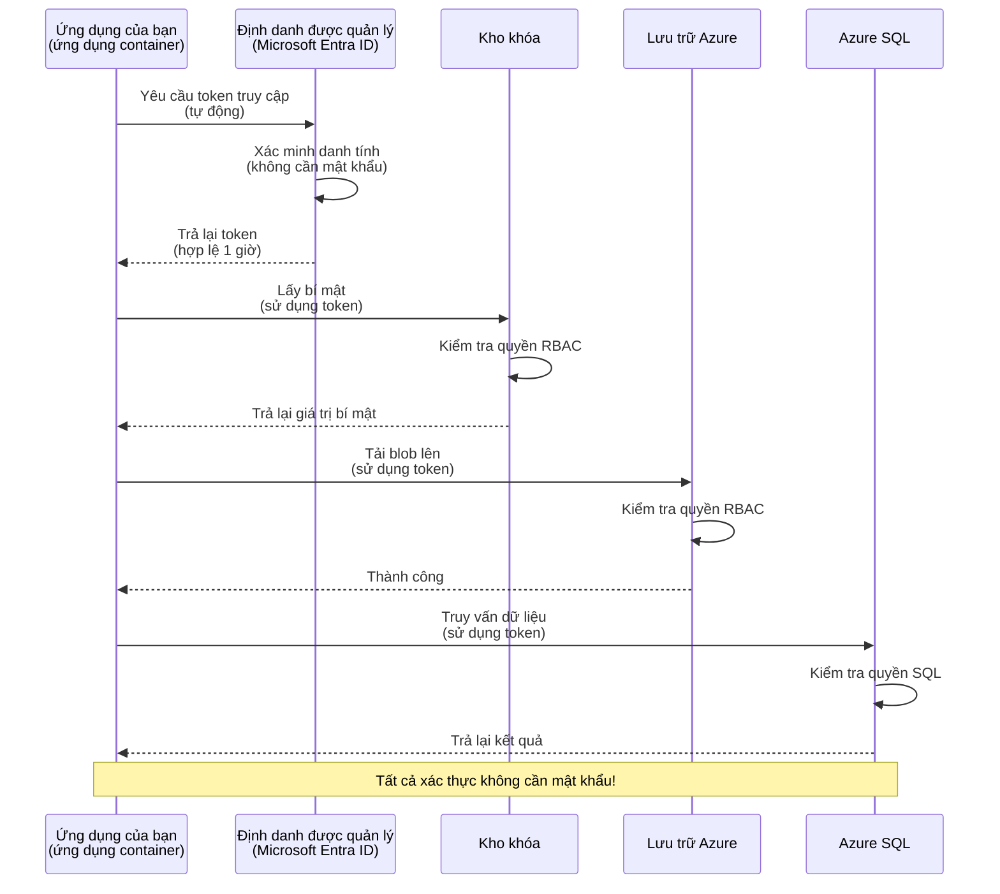
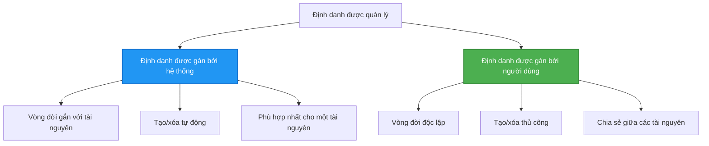

# Authentication Patterns and Managed Identity

⏱️ **Estimated Time**: 45-60 minutes | 💰 **Cost Impact**: Free (no additional charges) | ⭐ **Complexity**: Intermediate

**📚 Learning Path:**
- ← Previous: [Quản lý Cấu hình](configuration.md) - Quản lý biến môi trường và bí mật
- 🎯 **You Are Here**: Xác thực & Bảo mật (Managed Identity, Key Vault, các mẫu bảo mật)
- → Next: [First Project](first-project.md) - Xây dựng ứng dụng AZD đầu tiên của bạn
- 🏠 [Course Home](../../README.md)

---

## What You'll Learn

By completing this lesson, you will:
- Understand Azure authentication patterns (keys, connection strings, managed identity)
- Implement **Managed Identity** for passwordless authentication
- Secure secrets with **Azure Key Vault** integration
- Configure **role-based access control (RBAC)** for AZD deployments
- Apply security best practices in Container Apps and Azure services
- Migrate from key-based to identity-based authentication

## Why Managed Identity Matters

### The Problem: Traditional Authentication

**Before Managed Identity:**
```javascript
// ❌ RỦI RO BẢO MẬT: Bí mật được ghi cứng trong mã
const connectionString = "Server=mydb.database.windows.net;User=admin;Password=P@ssw0rd123";
const storageKey = "xK7mN9pQ2wR5tY8uI0oP3aS6dF1gH4jK...";
const cosmosKey = "C2x7B9n4M1p8Q5w3E6r0T2y5U8i1O4p7...";
```

**Problems:**
- 🔴 **Exposed secrets** in code, config files, environment variables
- 🔴 **Credential rotation** requires code changes and redeployment
- 🔴 **Audit nightmares** - who accessed what, when?
- 🔴 **Sprawl** - secrets scattered across multiple systems
- 🔴 **Compliance risks** - fails security audits

### The Solution: Managed Identity

**After Managed Identity:**
```javascript
// ✅ AN TOÀN: Không có bí mật trong mã nguồn
const credential = new DefaultAzureCredential();
const client = new BlobServiceClient(
  "https://mystorageaccount.blob.core.windows.net",
  credential  // Azure tự động xử lý xác thực
);
```

**Benefits:**
- ✅ **Zero secrets** in code or configuration
- ✅ **Automatic rotation** - Azure handles it
- ✅ **Full audit trail** in Microsoft Entra ID logs
- ✅ **Centralized security** - manage in Azure Portal
- ✅ **Compliance ready** - meets security standards

**Analogy**: Traditional authentication is like carrying multiple physical keys for different doors. Managed Identity is like having a security badge that automatically grants access based on who you are—no keys to lose, copy, or rotate.

---

## Architecture Overview

### Authentication Flow with Managed Identity



### Types of Managed Identities



| Tính năng | System-Assigned | User-Assigned |
|---------|----------------|---------------|
| **Lifecycle** | Tied to resource | Independent |
| **Creation** | Automatic with resource | Manual creation |
| **Deletion** | Deleted with resource | Persists after resource deletion |
| **Sharing** | One resource only | Multiple resources |
| **Use Case** | Simple scenarios | Complex multi-resource scenarios |
| **AZD Default** | ✅ Recommended | Optional |

---

## Prerequisites

### Required Tools

You should already have these installed from previous lessons:

```bash
# Xác minh Azure Developer CLI
azd version
# ✅ Yêu cầu: azd phiên bản 1.0.0 trở lên

# Xác minh Azure CLI
az --version
# ✅ Yêu cầu: azure-cli phiên bản 2.50.0 trở lên
```

### Azure Requirements

- Active Azure subscription
- Permissions to:
  - Create managed identities
  - Assign RBAC roles
  - Create Key Vault resources
  - Deploy Container Apps

### Knowledge Prerequisites

You should have completed:
- [Installation Guide](installation.md) - AZD setup
- [AZD Basics](azd-basics.md) - Core concepts
- [Configuration Management](configuration.md) - Environment variables

---

## Lesson 1: Understanding Authentication Patterns

### Pattern 1: Connection Strings (Legacy - Avoid)

**How it works:**
```bash
# Chuỗi kết nối chứa thông tin đăng nhập
STORAGE_CONNECTION_STRING="DefaultEndpointsProtocol=https;AccountName=myaccount;AccountKey=xK7mN9pQ2wR5..."
COSMOS_CONNECTION_STRING="AccountEndpoint=https://myaccount.documents.azure.com:443/;AccountKey=C2x7..."
SQL_CONNECTION_STRING="Server=myserver.database.windows.net;User=admin;Password=P@ssw0rd..."
```

**Problems:**
- ❌ Secrets visible in environment variables
- ❌ Logged in deployment systems
- ❌ Difficult to rotate
- ❌ No audit trail of access

**When to use:** Only for local development, never production.

---

### Pattern 2: Key Vault References (Better)

**How it works:**
```bicep
// Store secret in Key Vault
resource keyVault 'Microsoft.KeyVault/vaults@2023-02-01' = {
  name: 'mykv'
  properties: {
    enableRbacAuthorization: true
  }
}

// Reference in Container App
env: [
  {
    name: 'STORAGE_KEY'
    secretRef: 'storage-key'  // References Key Vault
  }
]
```

**Benefits:**
- ✅ Secrets stored securely in Key Vault
- ✅ Centralized secret management
- ✅ Rotation without code changes

**Limitations:**
- ⚠️ Still using keys/passwords
- ⚠️ Need to manage Key Vault access

**When to use:** Transition step from connection strings to managed identity.

---

### Pattern 3: Managed Identity (Best Practice)

**How it works:**
```bicep
// Enable managed identity
resource containerApp 'Microsoft.App/containerApps@2023-05-01' = {
  name: 'myapp'
  identity: {
    type: 'SystemAssigned'  // Automatically creates identity
  }
}

// Grant permissions
resource roleAssignment 'Microsoft.Authorization/roleAssignments@2022-04-01' = {
  scope: storageAccount
  properties: {
    roleDefinitionId: storageBlobDataContributorRole
    principalId: containerApp.identity.principalId
  }
}
```

**Application code:**
```javascript
// Không cần bí mật!
const { DefaultAzureCredential } = require('@azure/identity');
const { BlobServiceClient } = require('@azure/storage-blob');

const credential = new DefaultAzureCredential();
const blobServiceClient = new BlobServiceClient(
  'https://mystorageaccount.blob.core.windows.net',
  credential
);
```

**Benefits:**
- ✅ Zero secrets in code/config
- ✅ Automatic credential rotation
- ✅ Full audit trail
- ✅ RBAC-based permissions
- ✅ Compliance ready

**When to use:** Always, for production applications.

---

### Pattern 4: Service Principals (CI/CD & Automation)

Managed identity is the gold standard *for resources running inside Azure*. But what about things running **outside** Azure—like a CI/CD pipeline on a build agent, or a script on your laptop that can't use your interactive login? That's where a **service principal** comes in: a non-human identity with its own credentials that an automated process can sign in as.

**How it works:**

Create a service principal scoped to a resource group (least privilege):

```bash
az ad sp create-for-rbac \
  --name "myapp-cicd" \
  --role contributor \
  --scopes /subscriptions/<sub-id>/resourceGroups/<rg-name>
```

This prints a client ID, client secret, and tenant ID. azd can sign in with them non-interactively:

```bash
azd auth login \
  --client-id "<appId>" \
  --client-secret "<password>" \
  --tenant-id "<tenant>"
```

**Prefer federated credentials (OIDC) over secrets.** Instead of a long-lived client secret, configure a federated credential so the pipeline exchanges a short-lived token—no secret to leak or rotate:

```bash
azd auth login \
  --client-id "<appId>" \
  --federated-credential-provider "github" \
  --tenant-id "<tenant>"
```

> `azd pipeline config` sets this up for you automatically. See the CI/CD walkthroughs in [Chương 8](../chapter-08-production/production-ai-practices.md).

**Benefits:**
- ✅ Works outside Azure (build agents, on-prem, other clouds)
- ✅ Can be scoped to a single resource group with one role
- ✅ Federated (OIDC) variant uses no stored secret

**Trade-offs:**
- ⚠️ Secret-based variant requires careful storage and rotation
- ⚠️ A leaked secret grants whatever the SP can do—keep scopes tight

**When to use:** CI/CD pipelines and automation that can't use managed identity. Always prefer the **federated/OIDC** variant over a client secret, and prefer managed identity whenever the workload runs inside Azure.

**Storing credentials safely:**
- Never commit secrets—use your pipeline's secret store (GitHub Actions secrets, Azure DevOps variable groups / Key Vault).
- Scope the SP to the smallest role and resource group it needs.
- Set an expiry and rotate, or eliminate the secret entirely with OIDC.

---

## Lesson 2: Implementing Managed Identity with AZD

### Step-by-Step Implementation

Let's build a secure Container App that uses managed identity to access Azure Storage and Key Vault.

### Project Structure

```
secure-app/
├── azure.yaml                 # AZD configuration
├── infra/
│   ├── main.bicep            # Main infrastructure
│   ├── core/
│   │   ├── identity.bicep    # Managed identity setup
│   │   ├── keyvault.bicep    # Key Vault configuration
│   │   └── storage.bicep     # Storage with RBAC
│   └── app/
│       └── container-app.bicep
└── src/
    ├── app.js                # Application code
    ├── package.json
    └── Dockerfile
```

### 1. Configure AZD (azure.yaml)

```yaml
name: secure-app
metadata:
  template: secure-app@1.0.0

services:
  api:
    project: ./src
    language: js
    host: containerapp

# Enable managed identity (AZD handles this automatically)
```

### 2. Infrastructure: Enable Managed Identity

**File: `infra/main.bicep`**

```bicep
targetScope = 'subscription'

param environmentName string
param location string = 'eastus'

var tags = { 'azd-env-name': environmentName }

// Resource group
resource rg 'Microsoft.Resources/resourceGroups@2021-04-01' = {
  name: 'rg-${environmentName}'
  location: location
  tags: tags
}

// Storage Account
module storage './core/storage.bicep' = {
  name: 'storage'
  scope: rg
  params: {
    name: 'st${uniqueString(rg.id)}'
    location: location
    tags: tags
  }
}

// Key Vault
module keyVault './core/keyvault.bicep' = {
  name: 'keyvault'
  scope: rg
  params: {
    name: 'kv-${uniqueString(rg.id)}'
    location: location
    tags: tags
  }
}

// Container App with Managed Identity
module containerApp './app/container-app.bicep' = {
  name: 'container-app'
  scope: rg
  params: {
    name: 'ca-${environmentName}'
    location: location
    tags: tags
    storageAccountName: storage.outputs.name
    keyVaultName: keyVault.outputs.name
  }
}

// Grant Container App access to Storage
module storageRoleAssignment './core/role-assignment.bicep' = {
  name: 'storage-role'
  scope: rg
  params: {
    principalId: containerApp.outputs.identityPrincipalId
    roleDefinitionId: 'ba92f5b4-2d11-453d-a403-e96b0029c9fe'  // Storage Blob Data Contributor
    targetResourceId: storage.outputs.id
  }
}

// Grant Container App access to Key Vault
module kvRoleAssignment './core/role-assignment.bicep' = {
  name: 'kv-role'
  scope: rg
  params: {
    principalId: containerApp.outputs.identityPrincipalId
    roleDefinitionId: '4633458b-17de-408a-b874-0445c86b69e6'  // Key Vault Secrets User
    targetResourceId: keyVault.outputs.id
  }
}

// Outputs
output AZURE_STORAGE_ACCOUNT_NAME string = storage.outputs.name
output AZURE_KEY_VAULT_NAME string = keyVault.outputs.name
output APP_URL string = containerApp.outputs.url
```

### 3. Container App with System-Assigned Identity

**File: `infra/app/container-app.bicep`**

```bicep
param name string
param location string
param tags object = {}
param storageAccountName string
param keyVaultName string

resource containerApp 'Microsoft.App/containerApps@2023-05-01' = {
  name: name
  location: location
  tags: tags
  identity: {
    type: 'SystemAssigned'  // 🔑 Enable managed identity
  }
  properties: {
    configuration: {
      ingress: {
        external: true
        targetPort: 3000
      }
    }
    template: {
      containers: [
        {
          name: 'api'
          image: 'myregistry.azurecr.io/api:latest'
          resources: {
            cpu: json('0.5')
            memory: '1Gi'
          }
          env: [
            {
              name: 'AZURE_STORAGE_ACCOUNT_NAME'
              value: storageAccountName
            }
            {
              name: 'AZURE_KEY_VAULT_NAME'
              value: keyVaultName
            }
            // 🔑 No secrets - managed identity handles authentication!
          ]
        }
      ]
    }
  }
}

// Output the identity for RBAC assignments
output identityPrincipalId string = containerApp.identity.principalId
output id string = containerApp.id
output url string = 'https://${containerApp.properties.configuration.ingress.fqdn}'
```

### 4. RBAC Role Assignment Module

**File: `infra/core/role-assignment.bicep`**

```bicep
param principalId string
param roleDefinitionId string  // Azure built-in role ID
param targetResourceId string

resource roleAssignment 'Microsoft.Authorization/roleAssignments@2022-04-01' = {
  name: guid(principalId, roleDefinitionId, targetResourceId)
  scope: resourceId('Microsoft.Resources/resourceGroups', resourceGroup().name)
  properties: {
    roleDefinitionId: subscriptionResourceId('Microsoft.Authorization/roleDefinitions', roleDefinitionId)
    principalId: principalId
    principalType: 'ServicePrincipal'
  }
}

output id string = roleAssignment.id
```

### 5. Application Code with Managed Identity

**File: `src/app.js`**

```javascript
const express = require('express');
const { DefaultAzureCredential } = require('@azure/identity');
const { BlobServiceClient } = require('@azure/storage-blob');
const { SecretClient } = require('@azure/keyvault-secrets');

const app = express();
const PORT = process.env.PORT || 3000;

// 🔑 Khởi tạo thông tin xác thực (hoạt động tự động với định danh được quản lý)
const credential = new DefaultAzureCredential();

// Thiết lập Azure Storage
const storageAccountName = process.env.AZURE_STORAGE_ACCOUNT_NAME;
const blobServiceClient = new BlobServiceClient(
  `https://${storageAccountName}.blob.core.windows.net`,
  credential  // Không cần khóa!
);

// Thiết lập Key Vault
const keyVaultName = process.env.AZURE_KEY_VAULT_NAME;
const secretClient = new SecretClient(
  `https://${keyVaultName}.vault.azure.net`,
  credential  // Không cần khóa!
);

// Kiểm tra sức khỏe
app.get('/health', (req, res) => {
  res.json({ status: 'healthy', authentication: 'managed-identity' });
});

// Tải tệp lên Blob Storage
app.post('/upload', async (req, res) => {
  try {
    const containerClient = blobServiceClient.getContainerClient('uploads');
    await containerClient.createIfNotExists();
    
    const blobName = `file-${Date.now()}.txt`;
    const blockBlobClient = containerClient.getBlockBlobClient(blobName);
    
    await blockBlobClient.upload('Hello from managed identity!', 30);
    
    res.json({
      success: true,
      blobName: blobName,
      message: 'File uploaded using managed identity!'
    });
  } catch (error) {
    console.error('Upload error:', error);
    res.status(500).json({ error: error.message });
  }
});

// Lấy bí mật từ Key Vault
app.get('/secret/:name', async (req, res) => {
  try {
    const secretName = req.params.name;
    const secret = await secretClient.getSecret(secretName);
    
    res.json({
      name: secretName,
      value: secret.value,
      message: 'Secret retrieved using managed identity!'
    });
  } catch (error) {
    console.error('Secret error:', error);
    res.status(500).json({ error: error.message });
  }
});

// Liệt kê các container Blob (minh họa quyền truy cập đọc)
app.get('/containers', async (req, res) => {
  try {
    const containers = [];
    for await (const container of blobServiceClient.listContainers()) {
      containers.push(container.name);
    }
    
    res.json({
      containers: containers,
      count: containers.length,
      message: 'Containers listed using managed identity!'
    });
  } catch (error) {
    console.error('List error:', error);
    res.status(500).json({ error: error.message });
  }
});

app.listen(PORT, () => {
  console.log(`Secure API listening on port ${PORT}`);
  console.log('Authentication: Managed Identity (passwordless)');
});
```

**File: `src/package.json`**

```json
{
  "name": "secure-app",
  "version": "1.0.0",
  "dependencies": {
    "express": "^4.18.2",
    "@azure/identity": "^4.0.0",
    "@azure/storage-blob": "^12.17.0",
    "@azure/keyvault-secrets": "^4.7.0"
  },
  "scripts": {
    "start": "node app.js"
  }
}
```

### 6. Deploy and Test

```bash
# Khởi tạo môi trường AZD
azd init

# Triển khai hạ tầng và ứng dụng
azd up

# Lấy URL ứng dụng
APP_URL=$(azd env get-values | grep APP_URL | cut -d '=' -f2 | tr -d '"')

# Kiểm tra tình trạng hoạt động
curl $APP_URL/health
```

**✅ Expected output:**
```json
{
  "status": "healthy",
  "authentication": "managed-identity"
}
```

**Test blob upload:**
```bash
curl -X POST $APP_URL/upload
```

**✅ Expected output:**
```json
{
  "success": true,
  "blobName": "file-1700404800000.txt",
  "message": "File uploaded using managed identity!"
}
```

**Test container listing:**
```bash
curl $APP_URL/containers
```

**✅ Expected output:**
```json
{
  "containers": ["uploads"],
  "count": 1,
  "message": "Containers listed using managed identity!"
}
```

---

## Common Azure RBAC Roles

### Built-in Role IDs for Managed Identity

| Dịch vụ | Role Name | Role ID | Permissions |
|---------|-----------|---------|-------------|
| **Storage** | Storage Blob Data Reader | `2a2b9908-6b94-4a3d-8e5a-a7d8f8cc8a12` | Đọc blobs và containers |
| **Storage** | Storage Blob Data Contributor | `ba92f5b4-2d11-453d-a403-e96b0029c9fe` | Đọc, ghi, xóa blobs |
| **Storage** | Storage Queue Data Contributor | `974c5e8b-45b9-4653-ba55-5f855dd0fb88` | Đọc, ghi, xóa tin nhắn hàng đợi |
| **Key Vault** | Key Vault Secrets User | `4633458b-17de-408a-b874-0445c86b69e6` | Đọc secrets |
| **Key Vault** | Key Vault Secrets Officer | `b86a8fe4-44ce-4948-aee5-eccb2c155cd7` | Đọc, ghi, xóa secrets |
| **Cosmos DB** | Cosmos DB Built-in Data Reader | `00000000-0000-0000-0000-000000000001` | Đọc dữ liệu Cosmos DB |
| **Cosmos DB** | Cosmos DB Built-in Data Contributor | `00000000-0000-0000-0000-000000000002` | Đọc, ghi dữ liệu Cosmos DB |
| **SQL Database** | SQL DB Contributor | `9b7fa17d-e63e-47b0-bb0a-15c516ac86ec` | Quản lý cơ sở dữ liệu SQL |
| **Service Bus** | Azure Service Bus Data Owner | `090c5cfd-751d-490a-894a-3ce6f1109419` | Gửi, nhận, quản lý tin nhắn |

### How to Find Role IDs

```bash
# Liệt kê tất cả các vai trò tích hợp sẵn
az role definition list --query "[].{Name:roleName, ID:name}" --output table

# Tìm kiếm vai trò cụ thể
az role definition list --query "[?contains(roleName, 'Storage Blob')].{Name:roleName, ID:name}" --output table

# Lấy chi tiết vai trò
az role definition list --name "Storage Blob Data Contributor"
```

---

## Practical Exercises

### Exercise 1: Enable Managed Identity for Existing App ⭐⭐ (Medium)

**Goal**: Add managed identity to an existing Container App deployment

**Scenario**: You have a Container App using connection strings. Convert it to managed identity.

**Starting Point**: Container App with this configuration:

```bicep
// ❌ Current: Using connection string
env: [
  {
    name: 'STORAGE_CONNECTION_STRING'
    secretRef: 'storage-connection'
  }
]
```

**Steps**:

1. **Enable managed identity in Bicep:**

```bicep
resource containerApp 'Microsoft.App/containerApps@2023-05-01' = {
  name: 'myapp'
  identity: {
    type: 'SystemAssigned'  // Add this
  }
  // ... rest of configuration
}
```

2. **Grant Storage access:**

```bicep
// Get storage account reference
resource storageAccount 'Microsoft.Storage/storageAccounts@2023-01-01' existing = {
  name: storageAccountName
}

// Assign role
resource roleAssignment 'Microsoft.Authorization/roleAssignments@2022-04-01' = {
  name: guid(containerApp.id, 'ba92f5b4-2d11-453d-a403-e96b0029c9fe', storageAccount.id)
  scope: storageAccount
  properties: {
    roleDefinitionId: subscriptionResourceId('Microsoft.Authorization/roleDefinitions', 'ba92f5b4-2d11-453d-a403-e96b0029c9fe')
    principalId: containerApp.identity.principalId
    principalType: 'ServicePrincipal'
  }
}
```

3. **Update application code:**

**Before (connection string):**
```javascript
const { BlobServiceClient } = require('@azure/storage-blob');

const blobServiceClient = BlobServiceClient.fromConnectionString(
  process.env.STORAGE_CONNECTION_STRING
);
```

**After (managed identity):**
```javascript
const { DefaultAzureCredential } = require('@azure/identity');
const { BlobServiceClient } = require('@azure/storage-blob');

const credential = new DefaultAzureCredential();
const blobServiceClient = new BlobServiceClient(
  `https://${process.env.STORAGE_ACCOUNT_NAME}.blob.core.windows.net`,
  credential
);
```

4. **Update environment variables:**

```bicep
env: [
  {
    name: 'STORAGE_ACCOUNT_NAME'
    value: storageAccountName  // Just the name, no secrets!
  }
  // Remove STORAGE_CONNECTION_STRING
]
```

5. **Deploy and test:**

```bash
# Triển khai lại
azd up

# Kiểm tra xem nó vẫn hoạt động
curl https://myapp.azurecontainerapps.io/upload
```

**✅ Success Criteria:**
- ✅ Application deploys without errors
- ✅ Storage operations work (upload, list, download)
- ✅ No connection strings in environment variables
- ✅ Identity visible in Azure Portal under "Identity" blade

**Verification:**

```bash
# Kiểm tra managed identity đã được bật
az containerapp show \
  --name myapp \
  --resource-group rg-myapp \
  --query "identity.type"
# ✅ Dự kiến: "SystemAssigned"

# Kiểm tra gán vai trò
az role assignment list \
  --assignee $(az containerapp show --name myapp --resource-group rg-myapp --query "identity.principalId" -o tsv) \
  --scope /subscriptions/{sub-id}/resourceGroups/rg-myapp/providers/Microsoft.Storage/storageAccounts/mystorageaccount
# ✅ Dự kiến: Hiển thị vai trò "Storage Blob Data Contributor"
```

**Time**: 20-30 minutes

---

### Exercise 2: Multi-Service Access with User-Assigned Identity ⭐⭐⭐ (Advanced)

**Goal**: Create a user-assigned identity shared across multiple Container Apps

**Scenario**: You have 3 microservices that all need access to the same Storage account and Key Vault.

**Steps**:

1. **Create user-assigned identity:**

**File: `infra/core/identity.bicep`**

```bicep
param name string
param location string
param tags object = {}

resource userAssignedIdentity 'Microsoft.ManagedIdentity/userAssignedIdentities@2023-01-31' = {
  name: name
  location: location
  tags: tags
}

output id string = userAssignedIdentity.id
output principalId string = userAssignedIdentity.properties.principalId
output clientId string = userAssignedIdentity.properties.clientId
```

2. **Assign roles to user-assigned identity:**

```bicep
// In main.bicep
module userIdentity './core/identity.bicep' = {
  name: 'user-identity'
  scope: rg
  params: {
    name: 'id-${environmentName}'
    location: location
    tags: tags
  }
}

// Grant Storage access
resource storageRoleAssignment 'Microsoft.Authorization/roleAssignments@2022-04-01' = {
  name: guid(userIdentity.outputs.principalId, 'storage-contributor')
  scope: storageAccount
  properties: {
    roleDefinitionId: subscriptionResourceId('Microsoft.Authorization/roleDefinitions', 'ba92f5b4-2d11-453d-a403-e96b0029c9fe')
    principalId: userIdentity.outputs.principalId
    principalType: 'ServicePrincipal'
  }
}

// Grant Key Vault access
resource kvRoleAssignment 'Microsoft.Authorization/roleAssignments@2022-04-01' = {
  name: guid(userIdentity.outputs.principalId, 'kv-secrets-user')
  scope: keyVault
  properties: {
    roleDefinitionId: subscriptionResourceId('Microsoft.Authorization/roleDefinitions', '4633458b-17de-408a-b874-0445c86b69e6')
    principalId: userIdentity.outputs.principalId
    principalType: 'ServicePrincipal'
  }
}
```

3. **Assign identity to multiple Container Apps:**

```bicep
resource apiGateway 'Microsoft.App/containerApps@2023-05-01' = {
  name: 'api-gateway'
  identity: {
    type: 'UserAssigned'
    userAssignedIdentities: {
      '${userIdentity.outputs.id}': {}
    }
  }
  // ... rest of config
}

resource productService 'Microsoft.App/containerApps@2023-05-01' = {
  name: 'product-service'
  identity: {
    type: 'UserAssigned'
    userAssignedIdentities: {
      '${userIdentity.outputs.id}': {}
    }
  }
  // ... rest of config
}

resource orderService 'Microsoft.App/containerApps@2023-05-01' = {
  name: 'order-service'
  identity: {
    type: 'UserAssigned'
    userAssignedIdentities: {
      '${userIdentity.outputs.id}': {}
    }
  }
  // ... rest of config
}
```

4. **Application code (all services use same pattern):**

```javascript
const { DefaultAzureCredential, ManagedIdentityCredential } = require('@azure/identity');

// Đối với Managed Identity được gán bởi người dùng, hãy chỉ định client ID
const credential = new ManagedIdentityCredential(
  process.env.AZURE_CLIENT_ID  // Client ID của Managed Identity được gán bởi người dùng
);

// Hoặc sử dụng DefaultAzureCredential (tự động phát hiện)
const credential = new DefaultAzureCredential();

const blobServiceClient = new BlobServiceClient(
  `https://${process.env.STORAGE_ACCOUNT_NAME}.blob.core.windows.net`,
  credential
);
```

5. **Deploy and verify:**

```bash
azd up

# Kiểm tra tất cả các dịch vụ có thể truy cập lưu trữ
curl https://api-gateway.azurecontainerapps.io/upload
curl https://product-service.azurecontainerapps.io/upload
curl https://order-service.azurecontainerapps.io/upload
```

**✅ Success Criteria:**
- ✅ One identity shared across 3 services
- ✅ All services can access Storage and Key Vault
- ✅ Identity persists if you delete one service
- ✅ Centralized permission management

**Benefits of User-Assigned Identity:**
- Single identity to manage
- Consistent permissions across services
- Survives service deletion
- Better for complex architectures

**Time**: 30-40 minutes

---

### Exercise 3: Implement Key Vault Secret Rotation ⭐⭐⭐ (Advanced)

**Goal**: Store third-party API keys in Key Vault and access them using managed identity

**Scenario**: Your app needs to call an external API (OpenAI, Stripe, SendGrid) that requires API keys.

**Steps**:

1. **Create Key Vault with RBAC:**

**File: `infra/core/keyvault.bicep`**

```bicep
param name string
param location string
param tags object = {}

resource keyVault 'Microsoft.KeyVault/vaults@2023-02-01' = {
  name: name
  location: location
  tags: tags
  properties: {
    enableRbacAuthorization: true  // Use RBAC instead of access policies
    sku: {
      family: 'A'
      name: 'standard'
    }
    tenantId: subscription().tenantId
    enableSoftDelete: true
    softDeleteRetentionInDays: 90
  }
}

// Allow Container App to read secrets
output id string = keyVault.id
output name string = keyVault.name
output uri string = keyVault.properties.vaultUri
```

2. **Store secrets in Key Vault:**

```bash
# Lấy tên Key Vault
KV_NAME=$(azd env get-values | grep AZURE_KEY_VAULT_NAME | cut -d '=' -f2 | tr -d '"')

# Lưu các khóa API của bên thứ ba
az keyvault secret set \
  --vault-name $KV_NAME \
  --name "OpenAI-ApiKey" \
  --value "sk-proj-xxxxxxxxxxxxx"

az keyvault secret set \
  --vault-name $KV_NAME \
  --name "Stripe-ApiKey" \
  --value "sk_live_xxxxxxxxxxxxx"

az keyvault secret set \
  --vault-name $KV_NAME \
  --name "SendGrid-ApiKey" \
  --value "SG.xxxxxxxxxxxxx"
```

3. **Application code to retrieve secrets:**

**File: `src/config.js`**

```javascript
const { DefaultAzureCredential } = require('@azure/identity');
const { SecretClient } = require('@azure/keyvault-secrets');

class Config {
  constructor() {
    this.credential = new DefaultAzureCredential();
    this.secretClient = new SecretClient(
      `https://${process.env.AZURE_KEY_VAULT_NAME}.vault.azure.net`,
      this.credential
    );
    this.cache = {};
  }

  async getSecret(secretName) {
    // Kiểm tra bộ nhớ đệm trước
    if (this.cache[secretName]) {
      return this.cache[secretName];
    }

    try {
      const secret = await this.secretClient.getSecret(secretName);
      this.cache[secretName] = secret.value;
      console.log(`✅ Retrieved secret: ${secretName}`);
      return secret.value;
    } catch (error) {
      console.error(`❌ Failed to get secret ${secretName}:`, error.message);
      throw error;
    }
  }

  async getOpenAIKey() {
    return this.getSecret('OpenAI-ApiKey');
  }

  async getStripeKey() {
    return this.getSecret('Stripe-ApiKey');
  }

  async getSendGridKey() {
    return this.getSecret('SendGrid-ApiKey');
  }
}

module.exports = new Config();
```

4. **Use secrets in application:**

**File: `src/app.js`**

```javascript
const express = require('express');
const config = require('./config');
const { OpenAI } = require('openai');

const app = express();

// Khởi tạo OpenAI với khóa từ Key Vault
let openaiClient;

async function initializeServices() {
  const openaiKey = await config.getOpenAIKey();
  openaiClient = new OpenAI({ apiKey: openaiKey });
  console.log('✅ Services initialized with secrets from Key Vault');
}

// Gọi khi khởi động
initializeServices().catch(console.error);

app.post('/chat', async (req, res) => {
  try {
    const completion = await openaiClient.chat.completions.create({
      model: 'gpt-4.1',
      messages: [{ role: 'user', content: 'Hello!' }]
    });
    
    res.json({
      response: completion.choices[0].message.content,
      authentication: 'Key from Key Vault via Managed Identity'
    });
  } catch (error) {
    res.status(500).json({ error: error.message });
  }
});

app.listen(3000, () => {
  console.log('Secure API with Key Vault integration running');
});
```

5. **Deploy and test:**

```bash
azd up

# Kiểm tra rằng các khóa API hoạt động
curl -X POST https://myapp.azurecontainerapps.io/chat \
  -H "Content-Type: application/json" \
  -d '{"message":"Hello AI"}'
```

**✅ Success Criteria:**
- ✅ Không có khóa API trong mã hoặc biến môi trường
- ✅ Ứng dụng lấy khóa từ Key Vault
- ✅ Các API bên thứ ba hoạt động đúng
- ✅ Có thể xoay khóa mà không thay đổi mã

**Xoay một secret:**

```bash
# Cập nhật bí mật trong Key Vault
az keyvault secret set \
  --vault-name $KV_NAME \
  --name "OpenAI-ApiKey" \
  --value "sk-proj-NEW_KEY_HERE"

# Khởi động lại ứng dụng để sử dụng khóa mới
az containerapp revision restart \
  --name myapp \
  --resource-group rg-myapp
```

**Thời gian**: 25-35 phút

---

## Điểm kiểm tra kiến thức

### 1. Mẫu xác thực ✓

Kiểm tra sự hiểu biết của bạn:

- [ ] **Q1**: Ba mẫu xác thực chính là gì? 
  - **A**: Connection strings (cũ), Tham chiếu Key Vault (chuyển tiếp), Managed Identity (tốt nhất)

- [ ] **Q2**: Tại sao managed identity tốt hơn connection strings?
  - **A**: Không có bí mật trong mã, xoay tự động, theo dõi kiểm toán đầy đủ, quyền RBAC

- [ ] **Q3**: Khi nào bạn sẽ sử dụng user-assigned identity thay vì system-assigned?
  - **A**: Khi chia sẻ định danh giữa nhiều tài nguyên hoặc khi vòng đời định danh độc lập với vòng đời tài nguyên

**Xác minh thực hành:**
```bash
# Kiểm tra loại danh tính mà ứng dụng của bạn sử dụng
az containerapp show \
  --name myapp \
  --resource-group rg-myapp \
  --query "identity.type"

# Liệt kê tất cả các phân công vai trò cho danh tính
az role assignment list \
  --assignee $(az containerapp show --name myapp --resource-group rg-myapp --query "identity.principalId" -o tsv)
```

---

### 2. RBAC và Quyền hạn ✓

Kiểm tra sự hiểu biết của bạn:

- [ ] **Q1**: ID vai trò của "Storage Blob Data Contributor" là gì?
  - **A**: `ba92f5b4-2d11-453d-a403-e96b0029c9fe`

- [ ] **Q2**: Vai trò "Key Vault Secrets User" cung cấp quyền gì?
  - **A**: Truy cập chỉ đọc tới bí mật (không thể tạo, cập nhật hoặc xóa)

- [ ] **Q3**: Làm thế nào để cấp cho Container App quyền truy cập Azure SQL?
  - **A**: Gán vai trò "SQL DB Contributor" hoặc cấu hình xác thực Microsoft Entra ID cho SQL

**Xác minh thực hành:**
```bash
# Tìm vai trò cụ thể
az role definition list --name "Storage Blob Data Contributor"

# Kiểm tra các vai trò được gán cho danh tính của bạn
PRINCIPAL_ID=$(az containerapp show --name myapp --resource-group rg-myapp --query "identity.principalId" -o tsv)
az role assignment list --assignee $PRINCIPAL_ID --output table
```

---

### 3. Tích hợp Key Vault ✓

Kiểm tra sự hiểu biết của bạn:

- [ ] **Q1**: Làm thế nào để bật RBAC cho Key Vault thay vì access policies?
  - **A**: Thiết lập `enableRbacAuthorization: true` trong Bicep

- [ ] **Q2**: Thư viện Azure SDK nào xử lý xác thực managed identity?
  - **A**: `@azure/identity` với lớp `DefaultAzureCredential`

- [ ] **Q3**: Bí mật trong Key Vault được lưu trong bộ nhớ đệm bao lâu?
  - **A**: Phụ thuộc vào ứng dụng; triển khai chiến lược bộ nhớ đệm của riêng bạn

**Xác minh thực hành:**
```bash
# Kiểm tra truy cập Key Vault
az keyvault secret show \
  --vault-name $KV_NAME \
  --name "OpenAI-ApiKey" \
  --query "value"

# Kiểm tra RBAC đã được bật
az keyvault show \
  --name $KV_NAME \
  --query "properties.enableRbacAuthorization"
# ✅ Kết quả mong đợi: true
```

---

## Thực hành bảo mật tốt nhất

### ✅ NÊN LÀM:

1. **Luôn sử dụng managed identity trong môi trường sản xuất**
   ```bicep
   identity: {
     type: 'SystemAssigned'
   }
   ```

2. **Sử dụng vai trò RBAC ít đặc quyền nhất**
   - Sử dụng vai trò "Reader" khi có thể
   - Tránh "Owner" hoặc "Contributor" trừ khi cần thiết

3. **Lưu khóa bên thứ ba trong Key Vault**
   ```javascript
   const apiKey = await secretClient.getSecret('ThirdPartyApiKey');
   ```

4. **Bật ghi nhật ký kiểm toán**
   ```bicep
   diagnosticSettings: {
     logs: [{ category: 'AuditEvent', enabled: true }]
   }
   ```

5. **Sử dụng định danh khác nhau cho phát triển/kiểm thử/sản xuất**
   ```bash
   azd env new dev
   azd env new staging
   azd env new prod
   ```

6. **Xoay bí mật định kỳ**
   - Đặt ngày hết hạn cho bí mật trong Key Vault
   - Tự động xoay bằng Azure Functions

### ❌ KHÔNG NÊN:

1. **Không bao giờ ghi cứng (hardcode) bí mật trong mã**
   ```javascript
   // ❌ XẤU
   const apiKey = "sk-proj-xxxxxxxxxxxxx";
   ```

2. **Không sử dụng chuỗi kết nối trong môi trường sản xuất**
   ```javascript
   // ❌ XẤU
   BlobServiceClient.fromConnectionString(process.env.STORAGE_CONNECTION_STRING)
   ```

3. **Không cấp quyền quá mức**
   ```bicep
   // ❌ BAD - too much access
   roleDefinitionId: 'Owner'
   
   // ✅ GOOD - least privilege
   roleDefinitionId: 'Storage Blob Data Reader'
   ```

4. **Không ghi nhật ký bí mật**
   ```javascript
   // ❌ XẤU
   console.log('API Key:', apiKey);
   
   // ✅ TỐT
   console.log('API Key retrieved successfully');
   ```

5. **Không chia sẻ định danh sản xuất giữa các môi trường**
   ```bicep
   // ❌ BAD - same identity for dev and prod
   // ✅ GOOD - separate identities per environment
   ```

---

## Hướng dẫn khắc phục sự cố

### Vấn đề: "Unauthorized" khi truy cập Azure Storage

**Triệu chứng:**
```
Error: Unauthorized (403)
AuthorizationPermissionMismatch: This request is not authorized to perform this operation
```

**Chẩn đoán:**

```bash
# Kiểm tra xem định danh được quản lý có được bật hay không
az containerapp show \
  --name myapp \
  --resource-group rg-myapp \
  --query "identity.type"
# ✅ Dự kiến: "SystemAssigned" hoặc "UserAssigned"

# Kiểm tra phân công vai trò
PRINCIPAL_ID=$(az containerapp show --name myapp --resource-group rg-myapp --query "identity.principalId" -o tsv)
az role assignment list --assignee $PRINCIPAL_ID

# Dự kiến: Nên thấy "Storage Blob Data Contributor" hoặc vai trò tương tự
```

**Giải pháp:**

1. **Cấp vai trò RBAC đúng:**
```bash
STORAGE_ID=$(az storage account show --name mystorageaccount --resource-group rg-myapp --query "id" -o tsv)
az role assignment create \
  --assignee $PRINCIPAL_ID \
  --role "Storage Blob Data Contributor" \
  --scope $STORAGE_ID
```

2. **Chờ việc lan truyền (có thể mất 5-10 phút):**
```bash
# Kiểm tra trạng thái gán vai trò
az role assignment list --assignee $PRINCIPAL_ID --scope $STORAGE_ID
```

3. **Xác minh mã ứng dụng sử dụng thông tin xác thực đúng:**
```javascript
// Hãy đảm bảo bạn đang sử dụng DefaultAzureCredential
const credential = new DefaultAzureCredential();
```

---

### Vấn đề: Truy cập Key Vault bị từ chối

**Triệu chứng:**
```
Error: Forbidden (403)
The user, group or application does not have secrets get permission
```

**Chẩn đoán:**

```bash
# Kiểm tra RBAC của Key Vault đã được bật
az keyvault show \
  --name $KV_NAME \
  --query "properties.enableRbacAuthorization"
# ✅ Mong đợi: true

# Kiểm tra phân công vai trò
az role assignment list \
  --assignee $PRINCIPAL_ID \
  --scope /subscriptions/{sub-id}/resourceGroups/rg-myapp/providers/Microsoft.KeyVault/vaults/$KV_NAME
```

**Giải pháp:**

1. **Bật RBAC trên Key Vault:**
```bash
az keyvault update \
  --name $KV_NAME \
  --enable-rbac-authorization true
```

2. **Gán vai trò Key Vault Secrets User:**
```bash
KV_ID=$(az keyvault show --name $KV_NAME --query "id" -o tsv)
az role assignment create \
  --assignee $PRINCIPAL_ID \
  --role "Key Vault Secrets User" \
  --scope $KV_ID
```

---

### Vấn đề: DefaultAzureCredential thất bại khi chạy cục bộ

**Triệu chứng:**
```
Error: DefaultAzureCredential failed to retrieve a token
CredentialUnavailableError: No credential available
```

**Chẩn đoán:**
```bash
# Kiểm tra xem bạn đã đăng nhập hay chưa
az account show

# Kiểm tra xác thực Azure CLI
az ad signed-in-user show
```

**Giải pháp:**

1. **Đăng nhập vào Azure CLI:**
```bash
az login
```

2. **Thiết lập subscription Azure:**
```bash
az account set --subscription "Your Subscription Name"
```

3. **Đối với phát triển cục bộ, sử dụng biến môi trường:**
```bash
export AZURE_TENANT_ID="your-tenant-id"
export AZURE_CLIENT_ID="your-client-id"
export AZURE_CLIENT_SECRET="your-client-secret"
```

4. **Hoặc sử dụng thông tin xác thực khác khi chạy cục bộ:**
```javascript
const { DefaultAzureCredential, AzureCliCredential } = require('@azure/identity');

// Sử dụng AzureCliCredential cho phát triển cục bộ
const credential = process.env.NODE_ENV === 'production' 
  ? new DefaultAzureCredential()
  : new AzureCliCredential();
```

---

### Vấn đề: Việc gán vai trò mất quá nhiều thời gian để lan truyền

**Triệu chứng:**
- Vai trò được gán thành công
- Vẫn nhận lỗi 403
- Truy cập gián đoạn (đôi khi hoạt động, đôi khi không)

**Giải thích:**
Các thay đổi RBAC của Azure có thể mất 5-10 phút để lan truyền toàn cầu.

**Giải pháp:**

```bash
# Chờ và thử lại
echo "Waiting for RBAC propagation..."
sleep 300  # Chờ 5 phút

# Kiểm tra truy cập
curl https://myapp.azurecontainerapps.io/upload

# Nếu vẫn thất bại, khởi động lại ứng dụng
az containerapp revision restart \
  --name myapp \
  --resource-group rg-myapp
```

---

## Cân nhắc về chi phí

### Chi phí Managed Identity

| Tài nguyên | Chi phí |
|----------|------|
| **Managed Identity** | 🆓 **MIỄN PHÍ** - Không tính phí |
| **Gán vai trò RBAC** | 🆓 **MIỄN PHÍ** - Không tính phí |
| **Yêu cầu token Microsoft Entra ID** | 🆓 **MIỄN PHÍ** - Bao gồm |
| **Hoạt động Key Vault** | $0.03 per 10,000 operations |
| **Lưu trữ Key Vault** | $0.024 cho mỗi bí mật mỗi tháng |

**Managed identity tiết kiệm chi phí bằng cách:**
- ✅ Loại bỏ các hoạt động Key Vault cho xác thực dịch vụ-đến-dịch vụ
- ✅ Giảm các sự cố bảo mật (không có thông tin xác thực bị rò rỉ)
- ✅ Giảm công việc vận hành (không cần xoay thủ công)

**Ví dụ so sánh chi phí (hàng tháng):**

| Kịch bản | Chuỗi kết nối | Managed Identity | Tiết kiệm |
|----------|-------------------|-----------------|---------|
| Ứng dụng nhỏ (1M yêu cầu) | ~$50 (Key Vault + hoạt động) | ~$0 | $50/tháng |
| Ứng dụng trung bình (10M yêu cầu) | ~$200 | ~$0 | $200/tháng |
| Ứng dụng lớn (100M yêu cầu) | ~$1,500 | ~$0 | $1,500/tháng |

---

## Tìm hiểu thêm

### Tài liệu chính thức
- [Managed Identity của Azure](https://learn.microsoft.com/entra/identity/managed-identities-azure-resources/overview)
- [Azure RBAC](https://learn.microsoft.com/azure/role-based-access-control/overview)
- [Azure Key Vault](https://learn.microsoft.com/azure/key-vault/general/overview)
- [DefaultAzureCredential](https://learn.microsoft.com/dotnet/api/azure.identity.defaultazurecredential)

### Tài liệu SDK
- [@azure/identity (Node.js)](https://www.npmjs.com/package/@azure/identity)
- [Azure.Identity (C#)](https://www.nuget.org/packages/Azure.Identity/)
- [azure-identity (Python)](https://pypi.org/project/azure-identity/)

### Bước tiếp theo trong khóa học này
- ← Trước: [Quản lý cấu hình](configuration.md)
- → Tiếp theo: [Dự án đầu tiên](first-project.md)
- 🏠 [Trang chủ khóa học](../../README.md)

### Ví dụ liên quan
- [Ví dụ chat Microsoft Foundry Models](../../../../examples/azure-openai-chat) - Sử dụng managed identity cho Microsoft Foundry Models
- [Ví dụ Microservices](../../../../examples/microservices) - Các mẫu xác thực đa dịch vụ

---

## Tóm tắt

**Bạn đã học:**
- ✅ Ba mẫu xác thực (chuỗi kết nối, Key Vault, managed identity)
- ✅ Cách bật và cấu hình managed identity trong AZD
- ✅ Gán vai trò RBAC cho các dịch vụ Azure
- ✅ Tích hợp Key Vault cho bí mật bên thứ ba
- ✅ Định danh gán cho người dùng so với định danh gán cho hệ thống
- ✅ Thực hành bảo mật tốt nhất và khắc phục sự cố

**Những điểm chính:**
1. **Luôn sử dụng managed identity trong môi trường sản xuất** - Không có bí mật, xoay tự động
2. **Sử dụng vai trò RBAC ít đặc quyền nhất** - Chỉ cấp các quyền cần thiết
3. **Lưu khóa bên thứ ba trong Key Vault** - Quản lý bí mật tập trung
4. **Tách biệt định danh theo môi trường** - Tách biệt dev, staging, prod
5. **Bật ghi nhật ký kiểm toán** - Theo dõi ai đã truy cập gì

**Bước tiếp theo:**
1. Hoàn thành các bài thực hành ở trên
2. Di chuyển một ứng dụng hiện có từ chuỗi kết nối sang managed identity
3. Xây dựng dự án AZD đầu tiên của bạn với bảo mật ngay từ đầu: [Dự án đầu tiên](first-project.md)

---

<!-- CO-OP TRANSLATOR DISCLAIMER START -->
**Tuyên bố miễn trừ trách nhiệm**:
Tài liệu này đã được dịch bằng dịch vụ dịch thuật AI [Co-op Translator](https://github.com/Azure/co-op-translator). Mặc dù chúng tôi cố gắng đảm bảo độ chính xác, xin lưu ý rằng bản dịch tự động có thể chứa lỗi hoặc sai sót. Tài liệu gốc bằng ngôn ngữ gốc nên được coi là nguồn tin chính thức. Đối với thông tin quan trọng, nên sử dụng dịch vụ dịch thuật chuyên nghiệp bởi con người. Chúng tôi không chịu trách nhiệm về bất kỳ hiểu lầm hoặc giải thích sai nào phát sinh từ việc sử dụng bản dịch này.
<!-- CO-OP TRANSLATOR DISCLAIMER END -->