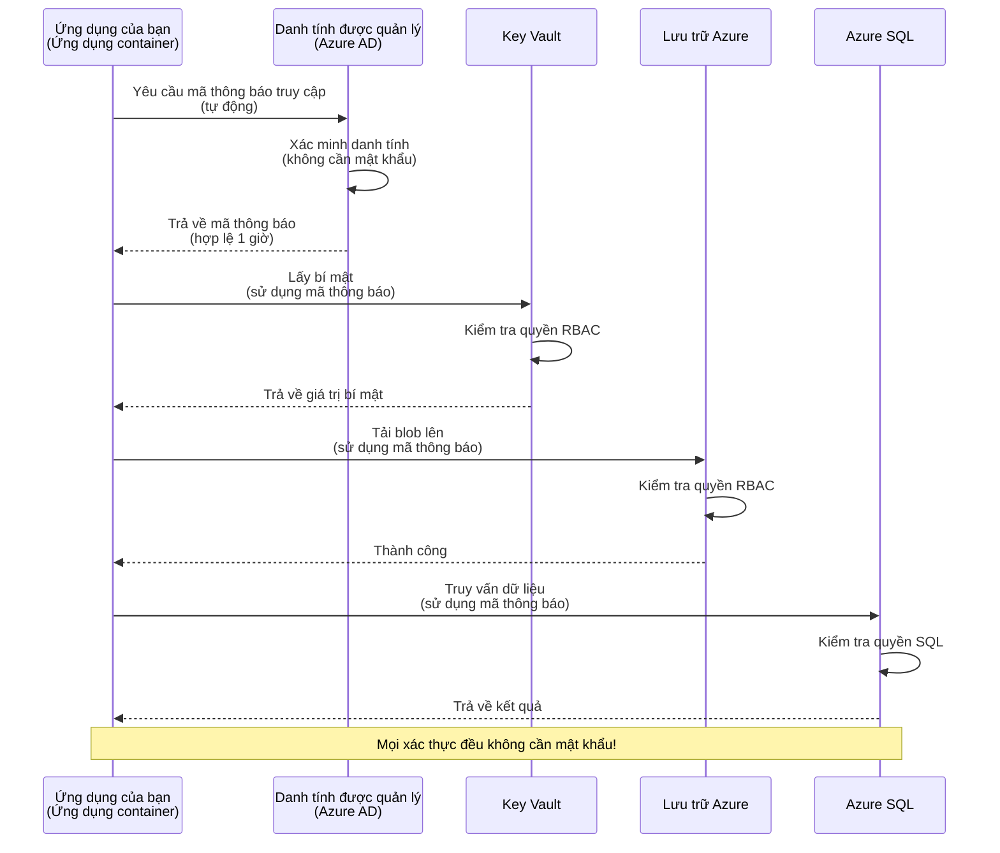
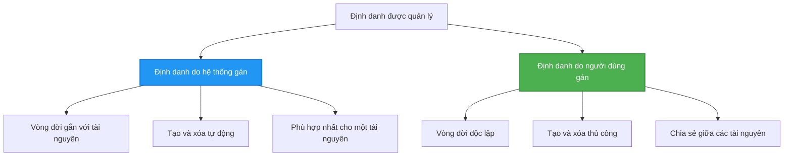

# Mẫu Xác thực và Managed Identity

⏱️ **Thời gian ước tính**: 45-60 phút | 💰 **Chi phí**: Miễn phí (không tính phí bổ sung) | ⭐ **Độ phức tạp**: Trung bình

**📚 Lộ trình học:**
- ← Trước: [Quản lý Cấu hình](configuration.md) - Quản lý biến môi trường và bí mật
- 🎯 **Bạn đang ở đây**: Xác thực & Bảo mật (Managed Identity, Key Vault, các mẫu an toàn)
- → Kế tiếp: [Dự án đầu tiên](first-project.md) - Xây dựng ứng dụng AZD đầu tiên của bạn
- 🏠 [Trang khóa học](../../README.md)

---

## Những gì bạn sẽ học

Bằng cách hoàn thành bài học này, bạn sẽ:
- Hiểu các mẫu xác thực của Azure (khóa, connection strings, managed identity)
- Triển khai **Managed Identity** để xác thực không cần mật khẩu
- Bảo mật bí mật bằng tích hợp **Azure Key Vault**
- Cấu hình **điều khiển truy cập theo vai trò (RBAC)** cho các triển khai AZD
- Áp dụng thực hành bảo mật tốt nhất trong Container Apps và các dịch vụ Azure
- Di chuyển từ xác thực dựa trên khóa sang xác thực dựa trên định danh

## Tại sao Managed Identity lại quan trọng

### Vấn đề: Xác thực truyền thống

**Trước Managed Identity:**
```javascript
// ❌ NGUY CƠ BẢO MẬT: Bí mật được nhúng cứng trong mã
const connectionString = "Server=mydb.database.windows.net;User=admin;Password=P@ssw0rd123";
const storageKey = "xK7mN9pQ2wR5tY8uI0oP3aS6dF1gH4jK...";
const cosmosKey = "C2x7B9n4M1p8Q5w3E6r0T2y5U8i1O4p7...";
```

**Vấn đề:**
- 🔴 **Bí mật bị lộ** trong mã, tệp cấu hình, biến môi trường
- 🔴 **Xoay vòng thông tin xác thực** yêu cầu thay đổi mã và triển khai lại
- 🔴 **Ác mộng kiểm toán** - ai đã truy cập gì, khi nào?
- 🔴 **Rải rác** - bí mật phân tán trên nhiều hệ thống
- 🔴 **Rủi ro tuân thủ** - không vượt qua kiểm toán bảo mật

### Giải pháp: Managed Identity

**Sau Managed Identity:**
```javascript
// ✅ AN TOÀN: Không có bí mật trong mã nguồn
const credential = new DefaultAzureCredential();
const client = new BlobServiceClient(
  "https://mystorageaccount.blob.core.windows.net",
  credential  // Azure tự động xử lý xác thực
);
```

**Lợi ích:**
- ✅ **Không có bí mật** trong mã hoặc cấu hình
- ✅ **Xoay vòng tự động** - Azure sẽ xử lý
- ✅ **Lưu vết kiểm toán đầy đủ** trong nhật ký Azure AD
- ✅ **Bảo mật tập trung** - quản lý trong Azure Portal
- ✅ **Sẵn sàng tuân thủ** - đáp ứng tiêu chuẩn bảo mật

**Tương tự**: Xác thực truyền thống giống như mang nhiều chìa khóa vật lý cho các cửa khác nhau. Managed Identity giống như có một thẻ an ninh tự động cấp quyền dựa trên danh tính của bạn—không có chìa khóa để làm mất, sao chép hoặc xoay vòng.

---

## Tổng quan kiến trúc

### Luồng xác thực với Managed Identity


### Các loại Managed Identities


| Tính năng | Gán theo hệ thống | Gán theo người dùng |
|---------|----------------|---------------|
| **Vòng đời** | Gắn với tài nguyên | Độc lập |
| **Tạo** | Tự động cùng tài nguyên | Tạo thủ công |
| **Xóa** | Bị xóa cùng tài nguyên | Tồn tại sau khi xóa tài nguyên |
| **Chia sẻ** | Chỉ một tài nguyên | Nhiều tài nguyên |
| **Trường hợp sử dụng** | Kịch bản đơn giản | Kịch bản phức tạp nhiều tài nguyên |
| **Mặc định AZD** | ✅ Được khuyến nghị | Tùy chọn |

---

## Yêu cầu tiên quyết

### Công cụ cần thiết

Bạn nên đã cài các công cụ sau từ các bài học trước:

```bash
# Kiểm tra Azure Developer CLI
azd version
# ✅ Yêu cầu: azd phiên bản 1.0.0 hoặc cao hơn

# Kiểm tra Azure CLI
az --version
# ✅ Yêu cầu: azure-cli 2.50.0 hoặc cao hơn
```

### Yêu cầu Azure

- Có đăng ký Azure đang hoạt động
- Quyền để:
  - Tạo Managed Identity
  - Gán vai trò RBAC
  - Tạo tài nguyên Key Vault
  - Triển khai Container Apps

### Kiến thức tiên quyết

Bạn nên đã hoàn thành:
- [Hướng dẫn Cài đặt](installation.md) - Thiết lập AZD
- [Cơ bản về AZD](azd-basics.md) - Các khái niệm cốt lõi
- [Quản lý Cấu hình](configuration.md) - Biến môi trường

---

## Bài học 1: Hiểu các mẫu xác thực

### Mẫu 1: Connection Strings (Cũ - Tránh dùng)

**Cách hoạt động:**
```bash
# Chuỗi kết nối chứa thông tin xác thực
STORAGE_CONNECTION_STRING="DefaultEndpointsProtocol=https;AccountName=myaccount;AccountKey=xK7mN9pQ2wR5..."
COSMOS_CONNECTION_STRING="AccountEndpoint=https://myaccount.documents.azure.com:443/;AccountKey=C2x7..."
SQL_CONNECTION_STRING="Server=myserver.database.windows.net;User=admin;Password=P@ssw0rd..."
```

**Vấn đề:**
- ❌ Bí mật hiển thị trong biến môi trường
- ❌ Được ghi lại trong hệ thống triển khai
- ❌ Khó để xoay vòng
- ❌ Không có lưu vết kiểm toán về truy cập

**Khi nào sử dụng:** Chỉ cho phát triển cục bộ, không bao giờ dùng trong production.

---

### Mẫu 2: Tham chiếu Key Vault (Tốt hơn)

**Cách hoạt động:**
```bicep
// Store secret in Key Vault
resource keyVault 'Microsoft.KeyVault/vaults@2023-02-01' = {
  name: 'mykv'
  properties: {
    enableRbacAuthorization: true
  }
}

// Reference in Container App
env: [
  {
    name: 'STORAGE_KEY'
    secretRef: 'storage-key'  // References Key Vault
  }
]
```

**Lợi ích:**
- ✅ Bí mật được lưu trữ an toàn trong Key Vault
- ✅ Quản lý bí mật tập trung
- ✅ Xoay vòng mà không cần thay đổi mã

**Hạn chế:**
- ⚠️ Vẫn sử dụng khóa/mật khẩu
- ⚠️ Cần quản lý quyền truy cập Key Vault

**Khi nào sử dụng:** Bước chuyển tiếp từ connection strings sang managed identity.

---

### Mẫu 3: Managed Identity (Thực hành tốt nhất)

**Cách hoạt động:**
```bicep
// Enable managed identity
resource containerApp 'Microsoft.App/containerApps@2023-05-01' = {
  name: 'myapp'
  identity: {
    type: 'SystemAssigned'  // Automatically creates identity
  }
}

// Grant permissions
resource roleAssignment 'Microsoft.Authorization/roleAssignments@2022-04-01' = {
  scope: storageAccount
  properties: {
    roleDefinitionId: storageBlobDataContributorRole
    principalId: containerApp.identity.principalId
  }
}
```

**Mã ứng dụng:**
```javascript
// Không cần bí mật!
const { DefaultAzureCredential } = require('@azure/identity');
const { BlobServiceClient } = require('@azure/storage-blob');

const credential = new DefaultAzureCredential();
const blobServiceClient = new BlobServiceClient(
  'https://mystorageaccount.blob.core.windows.net',
  credential
);
```

**Lợi ích:**
- ✅ Không có bí mật trong mã/cấu hình
- ✅ Xoay vòng thông tin xác thực tự động
- ✅ Lưu vết kiểm toán đầy đủ
- ✅ Quyền dựa trên RBAC
- ✅ Sẵn sàng tuân thủ

**Khi nào sử dụng:** Luôn luôn, cho ứng dụng production.

---

## Bài học 2: Triển khai Managed Identity với AZD

### Triển khai từng bước

Hãy xây dựng một Container App an toàn sử dụng managed identity để truy cập Azure Storage và Key Vault.

### Cấu trúc dự án

```
secure-app/
├── azure.yaml                 # AZD configuration
├── infra/
│   ├── main.bicep            # Main infrastructure
│   ├── core/
│   │   ├── identity.bicep    # Managed identity setup
│   │   ├── keyvault.bicep    # Key Vault configuration
│   │   └── storage.bicep     # Storage with RBAC
│   └── app/
│       └── container-app.bicep
└── src/
    ├── app.js                # Application code
    ├── package.json
    └── Dockerfile
```

### 1. Cấu hình AZD (azure.yaml)

```yaml
name: secure-app
metadata:
  template: secure-app@1.0.0

services:
  api:
    project: ./src
    language: js
    host: containerapp

# Enable managed identity (AZD handles this automatically)
```

### 2. Hạ tầng: Bật Managed Identity

**Tệp: `infra/main.bicep`**

```bicep
targetScope = 'subscription'

param environmentName string
param location string = 'eastus'

var tags = { 'azd-env-name': environmentName }

// Resource group
resource rg 'Microsoft.Resources/resourceGroups@2021-04-01' = {
  name: 'rg-${environmentName}'
  location: location
  tags: tags
}

// Storage Account
module storage './core/storage.bicep' = {
  name: 'storage'
  scope: rg
  params: {
    name: 'st${uniqueString(rg.id)}'
    location: location
    tags: tags
  }
}

// Key Vault
module keyVault './core/keyvault.bicep' = {
  name: 'keyvault'
  scope: rg
  params: {
    name: 'kv-${uniqueString(rg.id)}'
    location: location
    tags: tags
  }
}

// Container App with Managed Identity
module containerApp './app/container-app.bicep' = {
  name: 'container-app'
  scope: rg
  params: {
    name: 'ca-${environmentName}'
    location: location
    tags: tags
    storageAccountName: storage.outputs.name
    keyVaultName: keyVault.outputs.name
  }
}

// Grant Container App access to Storage
module storageRoleAssignment './core/role-assignment.bicep' = {
  name: 'storage-role'
  scope: rg
  params: {
    principalId: containerApp.outputs.identityPrincipalId
    roleDefinitionId: 'ba92f5b4-2d11-453d-a403-e96b0029c9fe'  // Storage Blob Data Contributor
    targetResourceId: storage.outputs.id
  }
}

// Grant Container App access to Key Vault
module kvRoleAssignment './core/role-assignment.bicep' = {
  name: 'kv-role'
  scope: rg
  params: {
    principalId: containerApp.outputs.identityPrincipalId
    roleDefinitionId: '4633458b-17de-408a-b874-0445c86b69e6'  // Key Vault Secrets User
    targetResourceId: keyVault.outputs.id
  }
}

// Outputs
output AZURE_STORAGE_ACCOUNT_NAME string = storage.outputs.name
output AZURE_KEY_VAULT_NAME string = keyVault.outputs.name
output APP_URL string = containerApp.outputs.url
```

### 3. Container App với System-Assigned Identity

**Tệp: `infra/app/container-app.bicep`**

```bicep
param name string
param location string
param tags object = {}
param storageAccountName string
param keyVaultName string

resource containerApp 'Microsoft.App/containerApps@2023-05-01' = {
  name: name
  location: location
  tags: tags
  identity: {
    type: 'SystemAssigned'  // 🔑 Enable managed identity
  }
  properties: {
    configuration: {
      ingress: {
        external: true
        targetPort: 3000
      }
    }
    template: {
      containers: [
        {
          name: 'api'
          image: 'myregistry.azurecr.io/api:latest'
          resources: {
            cpu: json('0.5')
            memory: '1Gi'
          }
          env: [
            {
              name: 'AZURE_STORAGE_ACCOUNT_NAME'
              value: storageAccountName
            }
            {
              name: 'AZURE_KEY_VAULT_NAME'
              value: keyVaultName
            }
            // 🔑 No secrets - managed identity handles authentication!
          ]
        }
      ]
    }
  }
}

// Output the identity for RBAC assignments
output identityPrincipalId string = containerApp.identity.principalId
output id string = containerApp.id
output url string = 'https://${containerApp.properties.configuration.ingress.fqdn}'
```

### 4. Module gán vai trò RBAC

**Tệp: `infra/core/role-assignment.bicep`**

```bicep
param principalId string
param roleDefinitionId string  // Azure built-in role ID
param targetResourceId string

resource roleAssignment 'Microsoft.Authorization/roleAssignments@2022-04-01' = {
  name: guid(principalId, roleDefinitionId, targetResourceId)
  scope: resourceId('Microsoft.Resources/resourceGroups', resourceGroup().name)
  properties: {
    roleDefinitionId: subscriptionResourceId('Microsoft.Authorization/roleDefinitions', roleDefinitionId)
    principalId: principalId
    principalType: 'ServicePrincipal'
  }
}

output id string = roleAssignment.id
```

### 5. Mã ứng dụng với Managed Identity

**Tệp: `src/app.js`**

```javascript
const express = require('express');
const { DefaultAzureCredential } = require('@azure/identity');
const { BlobServiceClient } = require('@azure/storage-blob');
const { SecretClient } = require('@azure/keyvault-secrets');

const app = express();
const PORT = process.env.PORT || 3000;

// 🔑 Khởi tạo thông tin xác thực (hoạt động tự động với định danh được quản lý)
const credential = new DefaultAzureCredential();

// Thiết lập Azure Storage
const storageAccountName = process.env.AZURE_STORAGE_ACCOUNT_NAME;
const blobServiceClient = new BlobServiceClient(
  `https://${storageAccountName}.blob.core.windows.net`,
  credential  // Không cần khóa!
);

// Thiết lập Key Vault
const keyVaultName = process.env.AZURE_KEY_VAULT_NAME;
const secretClient = new SecretClient(
  `https://${keyVaultName}.vault.azure.net`,
  credential  // Không cần khóa!
);

// Kiểm tra sức khỏe
app.get('/health', (req, res) => {
  res.json({ status: 'healthy', authentication: 'managed-identity' });
});

// Tải tệp lên Blob Storage
app.post('/upload', async (req, res) => {
  try {
    const containerClient = blobServiceClient.getContainerClient('uploads');
    await containerClient.createIfNotExists();
    
    const blobName = `file-${Date.now()}.txt`;
    const blockBlobClient = containerClient.getBlockBlobClient(blobName);
    
    await blockBlobClient.upload('Hello from managed identity!', 30);
    
    res.json({
      success: true,
      blobName: blobName,
      message: 'File uploaded using managed identity!'
    });
  } catch (error) {
    console.error('Upload error:', error);
    res.status(500).json({ error: error.message });
  }
});

// Lấy bí mật từ Key Vault
app.get('/secret/:name', async (req, res) => {
  try {
    const secretName = req.params.name;
    const secret = await secretClient.getSecret(secretName);
    
    res.json({
      name: secretName,
      value: secret.value,
      message: 'Secret retrieved using managed identity!'
    });
  } catch (error) {
    console.error('Secret error:', error);
    res.status(500).json({ error: error.message });
  }
});

// Liệt kê các container blob (minh họa quyền truy cập đọc)
app.get('/containers', async (req, res) => {
  try {
    const containers = [];
    for await (const container of blobServiceClient.listContainers()) {
      containers.push(container.name);
    }
    
    res.json({
      containers: containers,
      count: containers.length,
      message: 'Containers listed using managed identity!'
    });
  } catch (error) {
    console.error('List error:', error);
    res.status(500).json({ error: error.message });
  }
});

app.listen(PORT, () => {
  console.log(`Secure API listening on port ${PORT}`);
  console.log('Authentication: Managed Identity (passwordless)');
});
```

**Tệp: `src/package.json`**

```json
{
  "name": "secure-app",
  "version": "1.0.0",
  "dependencies": {
    "express": "^4.18.2",
    "@azure/identity": "^4.0.0",
    "@azure/storage-blob": "^12.17.0",
    "@azure/keyvault-secrets": "^4.7.0"
  },
  "scripts": {
    "start": "node app.js"
  }
}
```

### 6. Triển khai và kiểm thử

```bash
# Khởi tạo môi trường AZD
azd init

# Triển khai hạ tầng và ứng dụng
azd up

# Lấy URL ứng dụng
APP_URL=$(azd env get-values | grep APP_URL | cut -d '=' -f2 | tr -d '"')

# Kiểm tra sức khỏe
curl $APP_URL/health
```

**✅ Kết quả mong đợi:**
```json
{
  "status": "healthy",
  "authentication": "managed-identity"
}
```

**Kiểm thử tải blob lên:**
```bash
curl -X POST $APP_URL/upload
```

**✅ Kết quả mong đợi:**
```json
{
  "success": true,
  "blobName": "file-1700404800000.txt",
  "message": "File uploaded using managed identity!"
}
```

**Kiểm thử liệt kê container:**
```bash
curl $APP_URL/containers
```

**✅ Kết quả mong đợi:**
```json
{
  "containers": ["uploads"],
  "count": 1,
  "message": "Containers listed using managed identity!"
}
```

---

## Các vai trò RBAC Azure phổ biến

### ID vai trò tích hợp cho Managed Identity

| Dịch vụ | Role Name | Role ID | Quyền |
|---------|-----------|---------|-------------|
| **Storage** | Storage Blob Data Reader | `2a2b9908-6b94-4a3d-8e5a-a7d8f8cc8a12` | Đọc blobs và containers |
| **Storage** | Storage Blob Data Contributor | `ba92f5b4-2d11-453d-a403-e96b0029c9fe` | Đọc, ghi, xóa blobs |
| **Storage** | Storage Queue Data Contributor | `974c5e8b-45b9-4653-ba55-5f855dd0fb88` | Đọc, ghi, xóa tin nhắn hàng đợi |
| **Key Vault** | Key Vault Secrets User | `4633458b-17de-408a-b874-0445c86b69e6` | Đọc bí mật |
| **Key Vault** | Key Vault Secrets Officer | `b86a8fe4-44ce-4948-aee5-eccb2c155cd7` | Đọc, ghi, xóa bí mật |
| **Cosmos DB** | Cosmos DB Built-in Data Reader | `00000000-0000-0000-0000-000000000001` | Đọc dữ liệu Cosmos DB |
| **Cosmos DB** | Cosmos DB Built-in Data Contributor | `00000000-0000-0000-0000-000000000002` | Đọc, ghi dữ liệu Cosmos DB |
| **SQL Database** | SQL DB Contributor | `9b7fa17d-e63e-47b0-bb0a-15c516ac86ec` | Quản lý cơ sở dữ liệu SQL |
| **Service Bus** | Azure Service Bus Data Owner | `090c5cfd-751d-490a-894a-3ce6f1109419` | Gửi, nhận, quản lý tin nhắn |

### Cách tìm ID vai trò

```bash
# Liệt kê tất cả các vai trò tích hợp sẵn
az role definition list --query "[].{Name:roleName, ID:name}" --output table

# Tìm kiếm vai trò cụ thể
az role definition list --query "[?contains(roleName, 'Storage Blob')].{Name:roleName, ID:name}" --output table

# Lấy chi tiết vai trò
az role definition list --name "Storage Blob Data Contributor"
```

---

## Bài tập thực hành

### Bài tập 1: Bật Managed Identity cho Ứng dụng hiện có ⭐⭐ (Trung bình)

**Mục tiêu**: Thêm managed identity vào triển khai Container App hiện có

**Kịch bản**: Bạn có một Container App đang sử dụng connection strings. Chuyển nó sang managed identity.

**Điểm khởi điểm**: Container App với cấu hình này:

```bicep
// ❌ Current: Using connection string
env: [
  {
    name: 'STORAGE_CONNECTION_STRING'
    secretRef: 'storage-connection'
  }
]
```

**Bước thực hiện**:

1. **Bật managed identity trong Bicep:**

```bicep
resource containerApp 'Microsoft.App/containerApps@2023-05-01' = {
  name: 'myapp'
  identity: {
    type: 'SystemAssigned'  // Add this
  }
  // ... rest of configuration
}
```

2. **Cấp quyền truy cập Storage:**

```bicep
// Get storage account reference
resource storageAccount 'Microsoft.Storage/storageAccounts@2023-01-01' existing = {
  name: storageAccountName
}

// Assign role
resource roleAssignment 'Microsoft.Authorization/roleAssignments@2022-04-01' = {
  name: guid(containerApp.id, 'ba92f5b4-2d11-453d-a403-e96b0029c9fe', storageAccount.id)
  scope: storageAccount
  properties: {
    roleDefinitionId: subscriptionResourceId('Microsoft.Authorization/roleDefinitions', 'ba92f5b4-2d11-453d-a403-e96b0029c9fe')
    principalId: containerApp.identity.principalId
    principalType: 'ServicePrincipal'
  }
}
```

3. **Cập nhật mã ứng dụng:**

**Trước (connection string):**
```javascript
const { BlobServiceClient } = require('@azure/storage-blob');

const blobServiceClient = BlobServiceClient.fromConnectionString(
  process.env.STORAGE_CONNECTION_STRING
);
```

**Sau (managed identity):**
```javascript
const { DefaultAzureCredential } = require('@azure/identity');
const { BlobServiceClient } = require('@azure/storage-blob');

const credential = new DefaultAzureCredential();
const blobServiceClient = new BlobServiceClient(
  `https://${process.env.STORAGE_ACCOUNT_NAME}.blob.core.windows.net`,
  credential
);
```

4. **Cập nhật biến môi trường:**

```bicep
env: [
  {
    name: 'STORAGE_ACCOUNT_NAME'
    value: storageAccountName  // Just the name, no secrets!
  }
  // Remove STORAGE_CONNECTION_STRING
]
```

5. **Triển khai và kiểm thử:**

```bash
# Triển khai lại
azd up

# Kiểm tra xem nó vẫn hoạt động
curl https://myapp.azurecontainerapps.io/upload
```

**✅ Tiêu chí thành công:**
- ✅ Ứng dụng triển khai không lỗi
- ✅ Các thao tác Storage hoạt động (tải lên, liệt kê, tải xuống)
- ✅ Không có connection strings trong biến môi trường
- ✅ Identity hiển thị trong Azure Portal dưới "Identity" blade

**Xác minh:**

```bash
# Kiểm tra định danh được quản lý đã được bật
az containerapp show \
  --name myapp \
  --resource-group rg-myapp \
  --query "identity.type"
# ✅ Mong đợi: "SystemAssigned"

# Kiểm tra gán vai trò
az role assignment list \
  --assignee $(az containerapp show --name myapp --resource-group rg-myapp --query "identity.principalId" -o tsv) \
  --scope /subscriptions/{sub-id}/resourceGroups/rg-myapp/providers/Microsoft.Storage/storageAccounts/mystorageaccount
# ✅ Mong đợi: Hiển thị vai trò "Storage Blob Data Contributor"
```

**Thời gian**: 20-30 phút

---

### Bài tập 2: Truy cập đa dịch vụ với User-Assigned Identity ⭐⭐⭐ (Nâng cao)

**Mục tiêu**: Tạo user-assigned identity được chia sẻ giữa nhiều Container Apps

**Kịch bản**: Bạn có 3 microservice đều cần truy cập cùng một tài khoản Storage và Key Vault.

**Bước thực hiện**:

1. **Tạo user-assigned identity:**

**Tệp: `infra/core/identity.bicep`**

```bicep
param name string
param location string
param tags object = {}

resource userAssignedIdentity 'Microsoft.ManagedIdentity/userAssignedIdentities@2023-01-31' = {
  name: name
  location: location
  tags: tags
}

output id string = userAssignedIdentity.id
output principalId string = userAssignedIdentity.properties.principalId
output clientId string = userAssignedIdentity.properties.clientId
```

2. **Gán vai trò cho user-assigned identity:**

```bicep
// In main.bicep
module userIdentity './core/identity.bicep' = {
  name: 'user-identity'
  scope: rg
  params: {
    name: 'id-${environmentName}'
    location: location
    tags: tags
  }
}

// Grant Storage access
resource storageRoleAssignment 'Microsoft.Authorization/roleAssignments@2022-04-01' = {
  name: guid(userIdentity.outputs.principalId, 'storage-contributor')
  scope: storageAccount
  properties: {
    roleDefinitionId: subscriptionResourceId('Microsoft.Authorization/roleDefinitions', 'ba92f5b4-2d11-453d-a403-e96b0029c9fe')
    principalId: userIdentity.outputs.principalId
    principalType: 'ServicePrincipal'
  }
}

// Grant Key Vault access
resource kvRoleAssignment 'Microsoft.Authorization/roleAssignments@2022-04-01' = {
  name: guid(userIdentity.outputs.principalId, 'kv-secrets-user')
  scope: keyVault
  properties: {
    roleDefinitionId: subscriptionResourceId('Microsoft.Authorization/roleDefinitions', '4633458b-17de-408a-b874-0445c86b69e6')
    principalId: userIdentity.outputs.principalId
    principalType: 'ServicePrincipal'
  }
}
```

3. **Gán identity cho nhiều Container App:**

```bicep
resource apiGateway 'Microsoft.App/containerApps@2023-05-01' = {
  name: 'api-gateway'
  identity: {
    type: 'UserAssigned'
    userAssignedIdentities: {
      '${userIdentity.outputs.id}': {}
    }
  }
  // ... rest of config
}

resource productService 'Microsoft.App/containerApps@2023-05-01' = {
  name: 'product-service'
  identity: {
    type: 'UserAssigned'
    userAssignedIdentities: {
      '${userIdentity.outputs.id}': {}
    }
  }
  // ... rest of config
}

resource orderService 'Microsoft.App/containerApps@2023-05-01' = {
  name: 'order-service'
  identity: {
    type: 'UserAssigned'
    userAssignedIdentities: {
      '${userIdentity.outputs.id}': {}
    }
  }
  // ... rest of config
}
```

4. **Mã ứng dụng (tất cả dịch vụ dùng cùng mẫu):**

```javascript
const { DefaultAzureCredential, ManagedIdentityCredential } = require('@azure/identity');

// Đối với danh tính do người dùng gán, hãy chỉ định client ID
const credential = new ManagedIdentityCredential(
  process.env.AZURE_CLIENT_ID  // Client ID của danh tính do người dùng gán
);

// Hoặc sử dụng DefaultAzureCredential (tự động phát hiện)
const credential = new DefaultAzureCredential();

const blobServiceClient = new BlobServiceClient(
  `https://${process.env.STORAGE_ACCOUNT_NAME}.blob.core.windows.net`,
  credential
);
```

5. **Triển khai và xác minh:**

```bash
azd up

# Kiểm tra tất cả dịch vụ có thể truy cập vào lưu trữ
curl https://api-gateway.azurecontainerapps.io/upload
curl https://product-service.azurecontainerapps.io/upload
curl https://order-service.azurecontainerapps.io/upload
```

**✅ Tiêu chí thành công:**
- ✅ Một identity được chia sẻ giữa 3 dịch vụ
- ✅ Tất cả dịch vụ có thể truy cập Storage và Key Vault
- ✅ Identity tồn tại nếu bạn xóa một dịch vụ
- ✅ Quản lý quyền tập trung

**Lợi ích của User-Assigned Identity:**
- Một identity duy nhất để quản lý
- Quyền nhất quán giữa các dịch vụ
- Tồn tại khi xóa dịch vụ
- Tốt hơn cho kiến trúc phức tạp

**Thời gian**: 30-40 phút

---

### Bài tập 3: Triển khai xoay vòng bí mật trong Key Vault ⭐⭐⭐ (Nâng cao)

**Mục tiêu**: Lưu khóa API bên thứ ba trong Key Vault và truy cập chúng bằng managed identity

**Kịch bản**: Ứng dụng của bạn cần gọi API bên ngoài (OpenAI, Stripe, SendGrid) yêu cầu khóa API.

**Bước thực hiện**:

1. **Tạo Key Vault với RBAC:**

**Tệp: `infra/core/keyvault.bicep`**

```bicep
param name string
param location string
param tags object = {}

resource keyVault 'Microsoft.KeyVault/vaults@2023-02-01' = {
  name: name
  location: location
  tags: tags
  properties: {
    enableRbacAuthorization: true  // Use RBAC instead of access policies
    sku: {
      family: 'A'
      name: 'standard'
    }
    tenantId: subscription().tenantId
    enableSoftDelete: true
    softDeleteRetentionInDays: 90
  }
}

// Allow Container App to read secrets
output id string = keyVault.id
output name string = keyVault.name
output uri string = keyVault.properties.vaultUri
```

2. **Lưu bí mật trong Key Vault:**

```bash
# Lấy tên Key Vault
KV_NAME=$(azd env get-values | grep AZURE_KEY_VAULT_NAME | cut -d '=' -f2 | tr -d '"')

# Lưu trữ các khóa API của bên thứ ba
az keyvault secret set \
  --vault-name $KV_NAME \
  --name "OpenAI-ApiKey" \
  --value "sk-proj-xxxxxxxxxxxxx"

az keyvault secret set \
  --vault-name $KV_NAME \
  --name "Stripe-ApiKey" \
  --value "sk_live_xxxxxxxxxxxxx"

az keyvault secret set \
  --vault-name $KV_NAME \
  --name "SendGrid-ApiKey" \
  --value "SG.xxxxxxxxxxxxx"
```

3. **Mã ứng dụng để lấy bí mật:**

**Tệp: `src/config.js`**

```javascript
const { DefaultAzureCredential } = require('@azure/identity');
const { SecretClient } = require('@azure/keyvault-secrets');

class Config {
  constructor() {
    this.credential = new DefaultAzureCredential();
    this.secretClient = new SecretClient(
      `https://${process.env.AZURE_KEY_VAULT_NAME}.vault.azure.net`,
      this.credential
    );
    this.cache = {};
  }

  async getSecret(secretName) {
    // Kiểm tra bộ nhớ đệm trước
    if (this.cache[secretName]) {
      return this.cache[secretName];
    }

    try {
      const secret = await this.secretClient.getSecret(secretName);
      this.cache[secretName] = secret.value;
      console.log(`✅ Retrieved secret: ${secretName}`);
      return secret.value;
    } catch (error) {
      console.error(`❌ Failed to get secret ${secretName}:`, error.message);
      throw error;
    }
  }

  async getOpenAIKey() {
    return this.getSecret('OpenAI-ApiKey');
  }

  async getStripeKey() {
    return this.getSecret('Stripe-ApiKey');
  }

  async getSendGridKey() {
    return this.getSecret('SendGrid-ApiKey');
  }
}

module.exports = new Config();
```

4. **Sử dụng bí mật trong ứng dụng:**

**Tệp: `src/app.js`**

```javascript
const express = require('express');
const config = require('./config');
const { OpenAI } = require('openai');

const app = express();

// Khởi tạo OpenAI với khóa từ Key Vault
let openaiClient;

async function initializeServices() {
  const openaiKey = await config.getOpenAIKey();
  openaiClient = new OpenAI({ apiKey: openaiKey });
  console.log('✅ Services initialized with secrets from Key Vault');
}

// Gọi khi khởi động
initializeServices().catch(console.error);

app.post('/chat', async (req, res) => {
  try {
    const completion = await openaiClient.chat.completions.create({
      model: 'gpt-4.1',
      messages: [{ role: 'user', content: 'Hello!' }]
    });
    
    res.json({
      response: completion.choices[0].message.content,
      authentication: 'Key from Key Vault via Managed Identity'
    });
  } catch (error) {
    res.status(500).json({ error: error.message });
  }
});

app.listen(3000, () => {
  console.log('Secure API with Key Vault integration running');
});
```

5. **Triển khai và kiểm thử:**

```bash
azd up

# Kiểm tra xem các khóa API có hoạt động hay không
curl -X POST https://myapp.azurecontainerapps.io/chat \
  -H "Content-Type: application/json" \
  -d '{"message":"Hello AI"}'
```

**✅ Tiêu chí thành công:**
- ✅ Không có khóa API trong mã hoặc biến môi trường
- ✅ Ứng dụng lấy khóa từ Key Vault
- ✅ Các API bên thứ ba hoạt động đúng
- ✅ Có thể xoay vòng khóa mà không thay đổi mã

**Xoay một bí mật:**

```bash
# Cập nhật bí mật trong Key Vault
az keyvault secret set \
  --vault-name $KV_NAME \
  --name "OpenAI-ApiKey" \
  --value "sk-proj-NEW_KEY_HERE"

# Khởi động lại ứng dụng để áp dụng khóa mới
az containerapp revision restart \
  --name myapp \
  --resource-group rg-myapp
```

**Thời gian**: 25-35 phút

---

## Kiểm tra kiến thức

### 1. Mẫu xác thực ✓

Kiểm tra hiểu biết của bạn:

- [ ] **Q1**: Ba mẫu xác thực chính là gì? 
  - **A**: Connection strings (cũ), Key Vault references (bước chuyển tiếp), Managed Identity (tốt nhất)

- [ ] **Q2**: Tại sao managed identity tốt hơn connection strings?
  - **A**: Không có bí mật trong mã, xoay vòng tự động, lưu vết kiểm toán đầy đủ, quyền theo RBAC

- [ ] **Q3**: Khi nào bạn sử dụng user-assigned identity thay vì system-assigned?
  - **A**: Khi cần chia sẻ identity giữa nhiều tài nguyên hoặc khi vòng đời identity độc lập với vòng đời tài nguyên

**Xác minh thực hành:**
```bash
# Kiểm tra loại danh tính mà ứng dụng của bạn sử dụng
az containerapp show \
  --name myapp \
  --resource-group rg-myapp \
  --query "identity.type"

# Liệt kê tất cả các phân công vai trò cho danh tính
az role assignment list \
  --assignee $(az containerapp show --name myapp --resource-group rg-myapp --query "identity.principalId" -o tsv)
```

---

### 2. RBAC và Quyền ✓

Kiểm tra hiểu biết của bạn:

- [ ] **Q1**: ID vai trò cho "Storage Blob Data Contributor" là gì?
  - **A**: `ba92f5b4-2d11-453d-a403-e96b0029c9fe`

- [ ] **Q2**: Vai trò "Key Vault Secrets User" cung cấp những quyền gì?
  - **A**: Quyền chỉ đọc đối với bí mật (không thể tạo, cập nhật hoặc xóa)

- [ ] **Q3**: Làm thế nào để cấp quyền cho Container App truy cập Azure SQL?
  - **A**: Gán vai trò "SQL DB Contributor" hoặc cấu hình xác thực Azure AD cho SQL

**Xác minh thực hành:**
```bash
# Tìm vai trò cụ thể
az role definition list --name "Storage Blob Data Contributor"

# Kiểm tra vai trò nào đang được gán cho danh tính của bạn
PRINCIPAL_ID=$(az containerapp show --name myapp --resource-group rg-myapp --query "identity.principalId" -o tsv)
az role assignment list --assignee $PRINCIPAL_ID --output table
```

---

### 3. Tích hợp Key Vault ✓

Kiểm tra hiểu biết của bạn:
- [ ] **Q1**: Làm thế nào để bật RBAC cho Key Vault thay vì sử dụng access policies?
  - **A**: Đặt `enableRbacAuthorization: true` trong Bicep

- [ ] **Q2**: Thư viện Azure SDK nào xử lý xác thực bằng định danh được quản lý?
  - **A**: `@azure/identity` with `DefaultAzureCredential` class

- [ ] **Q3**: Bí mật trong Key Vault được lưu trong bộ nhớ đệm bao lâu?
  - **A**: Tùy vào ứng dụng; triển khai chiến lược cache của riêng bạn

**Xác minh Thực hành:**
```bash
# Kiểm tra quyền truy cập Key Vault
az keyvault secret show \
  --vault-name $KV_NAME \
  --name "OpenAI-ApiKey" \
  --query "value"

# Kiểm tra RBAC đã được bật
az keyvault show \
  --name $KV_NAME \
  --query "properties.enableRbacAuthorization"
# ✅ Kết quả mong đợi: true
```

---

## Những Thực hành Tốt nhất về Bảo mật

### ✅ NÊN:

1. **Luôn sử dụng định danh được quản lý trong môi trường sản xuất**
   ```bicep
   identity: {
     type: 'SystemAssigned'
   }
   ```

2. **Sử dụng vai trò RBAC với nguyên tắc ít đặc quyền nhất**
   - Sử dụng "Reader" roles khi có thể
   - Tránh "Owner" hoặc "Contributor" trừ khi cần thiết

3. **Lưu khóa bên thứ ba trong Key Vault**
   ```javascript
   const apiKey = await secretClient.getSecret('ThirdPartyApiKey');
   ```

4. **Bật ghi nhật ký kiểm toán**
   ```bicep
   diagnosticSettings: {
     logs: [{ category: 'AuditEvent', enabled: true }]
   }
   ```

5. **Sử dụng các định danh khác nhau cho dev/staging/prod**
   ```bash
   azd env new dev
   azd env new staging
   azd env new prod
   ```

6. **Thường xuyên xoay vòng bí mật**
   - Đặt ngày hết hạn cho các bí mật trong Key Vault
   - Tự động hóa việc xoay vòng bằng Azure Functions

### ❌ KHÔNG NÊN:

1. **Không bao giờ nhúng bí mật vào mã nguồn**
   ```javascript
   // ❌ KHÔNG TỐT
   const apiKey = "sk-proj-xxxxxxxxxxxxx";
   ```

2. **Không sử dụng chuỗi kết nối trong môi trường sản xuất**
   ```javascript
   // ❌ XẤU
   BlobServiceClient.fromConnectionString(process.env.STORAGE_CONNECTION_STRING)
   ```

3. **Không cấp quyền quá mức**
   ```bicep
   // ❌ BAD - too much access
   roleDefinitionId: 'Owner'
   
   // ✅ GOOD - least privilege
   roleDefinitionId: 'Storage Blob Data Reader'
   ```

4. **Không ghi log các bí mật**
   ```javascript
   // ❌ XẤU
   console.log('API Key:', apiKey);
   
   // ✅ TỐT
   console.log('API Key retrieved successfully');
   ```

5. **Không chia sẻ định danh sản xuất giữa các môi trường**
   ```bicep
   // ❌ BAD - same identity for dev and prod
   // ✅ GOOD - separate identities per environment
   ```

---

## Hướng dẫn Khắc phục Sự cố

### Vấn đề: "Unauthorized" khi truy cập Azure Storage

**Triệu chứng:**
```
Error: Unauthorized (403)
AuthorizationPermissionMismatch: This request is not authorized to perform this operation
```

**Chẩn đoán:**

```bash
# Kiểm tra xem Managed Identity có được bật hay không
az containerapp show \
  --name myapp \
  --resource-group rg-myapp \
  --query "identity.type"
# ✅ Kỳ vọng: "SystemAssigned" hoặc "UserAssigned"

# Kiểm tra gán vai trò
PRINCIPAL_ID=$(az containerapp show --name myapp --resource-group rg-myapp --query "identity.principalId" -o tsv)
az role assignment list --assignee $PRINCIPAL_ID

# Kỳ vọng: Nên thấy "Storage Blob Data Contributor" hoặc vai trò tương tự
```

**Giải pháp:**

1. **Cấp vai trò RBAC đúng:**
```bash
STORAGE_ID=$(az storage account show --name mystorageaccount --resource-group rg-myapp --query "id" -o tsv)
az role assignment create \
  --assignee $PRINCIPAL_ID \
  --role "Storage Blob Data Contributor" \
  --scope $STORAGE_ID
```

2. **Chờ cho việc lan truyền (có thể mất 5-10 phút):**
```bash
# Kiểm tra trạng thái gán vai trò
az role assignment list --assignee $PRINCIPAL_ID --scope $STORAGE_ID
```

3. **Xác minh mã ứng dụng sử dụng credential đúng:**
```javascript
// Hãy đảm bảo bạn đang sử dụng DefaultAzureCredential
const credential = new DefaultAzureCredential();
```

---

### Vấn đề: Quyền truy cập Key Vault bị từ chối

**Triệu chứng:**
```
Error: Forbidden (403)
The user, group or application does not have secrets get permission
```

**Chẩn đoán:**

```bash
# Kiểm tra RBAC của Key Vault đã được bật
az keyvault show \
  --name $KV_NAME \
  --query "properties.enableRbacAuthorization"
# ✅ Kỳ vọng: true

# Kiểm tra phân công vai trò
az role assignment list \
  --assignee $PRINCIPAL_ID \
  --scope /subscriptions/{sub-id}/resourceGroups/rg-myapp/providers/Microsoft.KeyVault/vaults/$KV_NAME
```

**Giải pháp:**

1. **Bật RBAC trên Key Vault:**
```bash
az keyvault update \
  --name $KV_NAME \
  --enable-rbac-authorization true
```

2. **Cấp vai trò Key Vault Secrets User:**
```bash
KV_ID=$(az keyvault show --name $KV_NAME --query "id" -o tsv)
az role assignment create \
  --assignee $PRINCIPAL_ID \
  --role "Key Vault Secrets User" \
  --scope $KV_ID
```

---

### Vấn đề: DefaultAzureCredential thất bại khi chạy cục bộ

**Triệu chứng:**
```
Error: DefaultAzureCredential failed to retrieve a token
CredentialUnavailableError: No credential available
```

**Chẩn đoán:**

```bash
# Kiểm tra xem bạn đã đăng nhập chưa
az account show

# Kiểm tra xác thực Azure CLI
az ad signed-in-user show
```

**Giải pháp:**

1. **Đăng nhập vào Azure CLI:**
```bash
az login
```

2. **Thiết lập subscription Azure:**
```bash
az account set --subscription "Your Subscription Name"
```

3. **Đối với phát triển cục bộ, sử dụng biến môi trường:**
```bash
export AZURE_TENANT_ID="your-tenant-id"
export AZURE_CLIENT_ID="your-client-id"
export AZURE_CLIENT_SECRET="your-client-secret"
```

4. **Hoặc sử dụng thông tin xác thực khác khi làm việc cục bộ:**
```javascript
const { DefaultAzureCredential, AzureCliCredential } = require('@azure/identity');

// Sử dụng AzureCliCredential cho phát triển cục bộ
const credential = process.env.NODE_ENV === 'production' 
  ? new DefaultAzureCredential()
  : new AzureCliCredential();
```

---

### Vấn đề: Việc gán vai trò mất quá lâu để lan truyền

**Triệu chứng:**
- Vai trò đã được gán thành công
- Vẫn nhận lỗi 403
- Truy cập không ổn định (đôi khi được, đôi khi không)

**Giải thích:**
Azure RBAC changes can take 5-10 minutes to propagate globally.

**Giải pháp:**

```bash
# Chờ và thử lại
echo "Waiting for RBAC propagation..."
sleep 300  # Chờ 5 phút

# Kiểm tra truy cập
curl https://myapp.azurecontainerapps.io/upload

# Nếu vẫn thất bại, khởi động lại ứng dụng
az containerapp revision restart \
  --name myapp \
  --resource-group rg-myapp
```

---

## Cân nhắc về chi phí

### Chi phí Định danh được quản lý

| Resource | Cost |
|----------|------|
| **Định danh được quản lý** | 🆓 **MIỄN PHÍ** - Không tính phí |
| **Việc gán vai trò RBAC** | 🆓 **MIỄN PHÍ** - Không tính phí |
| **Yêu cầu Token Azure AD** | 🆓 **MIỄN PHÍ** - Đã bao gồm |
| **Hoạt động Key Vault** | $0.03 cho mỗi 10.000 thao tác |
| **Lưu trữ Key Vault** | $0.024 cho mỗi bí mật mỗi tháng |

**Định danh được quản lý giúp tiết kiệm chi phí bằng cách:**
- ✅ Loại bỏ các thao tác Key Vault cho xác thực dịch vụ-đến-dịch vụ
- ✅ Giảm sự cố bảo mật (không có thông tin xác thực bị rò rỉ)
- ✅ Giảm chi phí vận hành (không cần xoay vòng thủ công)

**Ví dụ so sánh chi phí (hàng tháng):**

| Scenario | Connection Strings | Managed Identity | Savings |
|----------|-------------------|-----------------|---------|
| Ứng dụng nhỏ (1M requests) | ~$50 (Key Vault + ops) | ~$0 | $50/tháng |
| Ứng dụng trung bình (10M requests) | ~$200 | ~$0 | $200/tháng |
| Ứng dụng lớn (100M requests) | ~$1,500 | ~$0 | $1,500/tháng |

---

## Tìm hiểu thêm

### Tài liệu chính thức
- [Định danh được quản lý Azure](https://learn.microsoft.com/entra/identity/managed-identities-azure-resources/overview)
- [Azure RBAC](https://learn.microsoft.com/azure/role-based-access-control/overview)
- [Azure Key Vault](https://learn.microsoft.com/azure/key-vault/general/overview)
- [DefaultAzureCredential](https://learn.microsoft.com/dotnet/api/azure.identity.defaultazurecredential)

### Tài liệu SDK
- [@azure/identity (Node.js)](https://www.npmjs.com/package/@azure/identity)
- [Azure.Identity (C#)](https://www.nuget.org/packages/Azure.Identity/)
- [azure-identity (Python)](https://pypi.org/project/azure-identity/)

### Bước tiếp theo trong Khóa học này
- ← Trước: [Quản lý cấu hình](configuration.md)
- → Tiếp: [Dự án đầu tiên](first-project.md)
- 🏠 [Trang chủ Khóa học](../../README.md)

### Ví dụ liên quan
- [Ví dụ Chat Microsoft Foundry Models](../../../../examples/azure-openai-chat) - Sử dụng định danh được quản lý cho Microsoft Foundry Models
- [Ví dụ Microservices](../../../../examples/microservices) - Mẫu xác thực đa dịch vụ

---

## Tóm tắt

**Bạn đã học:**
- ✅ Ba mô hình xác thực (chuỗi kết nối, Key Vault, định danh được quản lý)
- ✅ Cách bật và cấu hình định danh được quản lý trong AZD
- ✅ Gán vai trò RBAC cho các dịch vụ Azure
- ✅ Tích hợp Key Vault cho bí mật bên thứ ba
- ✅ Định danh do người dùng gán vs định danh do hệ thống gán
- ✅ Các thực hành bảo mật tốt nhất và khắc phục sự cố

**Những điểm chính:**
1. **Luôn sử dụng định danh được quản lý trong môi trường sản xuất** - Không có bí mật, xoay vòng tự động
2. **Sử dụng vai trò RBAC ít đặc quyền nhất** - Chỉ cấp các quyền cần thiết
3. **Lưu khóa bên thứ ba trong Key Vault** - Quản lý bí mật tập trung
4. **Tách biệt định danh theo môi trường** - Cô lập dev, staging, prod
5. **Bật ghi nhật ký kiểm toán** - Theo dõi ai đã truy cập gì

**Bước tiếp theo:**
1. Hoàn thành các bài tập thực hành ở trên
2. Di chuyển một ứng dụng hiện tại từ chuỗi kết nối sang định danh được quản lý
3. Xây dựng dự án AZD đầu tiên của bạn với bảo mật ngay từ ngày đầu: [Dự án đầu tiên](first-project.md)

---

<!-- CO-OP TRANSLATOR DISCLAIMER START -->
**Miễn trừ trách nhiệm**:
Tài liệu này đã được dịch bằng dịch vụ dịch thuật AI [Co-op Translator](https://github.com/Azure/co-op-translator). Mặc dù chúng tôi nỗ lực đảm bảo độ chính xác, xin lưu ý rằng các bản dịch tự động có thể chứa lỗi hoặc không chính xác. Tài liệu gốc bằng ngôn ngữ ban đầu nên được coi là nguồn chính thức. Đối với thông tin quan trọng, nên sử dụng bản dịch chuyên nghiệp do người dịch thực hiện. Chúng tôi không chịu trách nhiệm về bất kỳ hiểu lầm hay giải thích sai nào phát sinh từ việc sử dụng bản dịch này.
<!-- CO-OP TRANSLATOR DISCLAIMER END -->