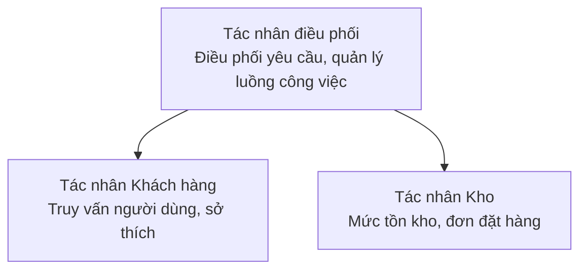

# Chương 5: Giải pháp AI đa tác nhân

**📚 Khóa học**: [AZD Dành Cho Người Mới](../../README.md) | **⏱️ Thời lượng**: 2-3 giờ | **⭐ Độ phức tạp**: Nâng cao

---

## Tổng quan

Chương này đề cập đến các mẫu kiến trúc đa tác nhân nâng cao, điều phối tác nhân và các triển khai AI sẵn sàng cho môi trường sản xuất cho các kịch bản phức tạp.

> Đã xác thực với `azd 1.25.6` vào tháng 6 năm 2026.

## Mục tiêu học tập

Khi hoàn thành chương này, bạn sẽ:
- Hiểu các mẫu kiến trúc đa tác nhân
- Triển khai hệ thống tác nhân AI được điều phối
- Triển khai giao tiếp giữa các tác nhân
- Xây dựng giải pháp đa tác nhân sẵn sàng cho môi trường sản xuất

---

## 📚 Bài học

| # | Lesson | Description | Time |
|---|--------|-------------|------|
| 1 | [Cơ bản về đa tác nhân](multi-agent-basics.md) | Thực hành: triển khai ứng dụng đa tác nhân hoạt động bằng `azd up` | 45 phút |
| 2 | [Mẫu điều phối](../chapter-06-pre-deployment/coordination-patterns.md) | Chiến lược điều phối tác nhân (tiếp tục ở Chương 6) | 30 phút |
| 3 | [Triển khai Mẫu ARM](../../examples/retail-multiagent-arm-template/README.md) | Ví dụ triển khai một lần nhấp | 30 phút |

> **Bắt đầu với Bài 1.** Đây là bài duy nhất hoàn toàn thực hành và có thể triển khai trong chương này. Bài 2 nằm ở Chương 6 (chung với lập kế hoạch trước triển khai), và [Giải pháp Bán lẻ đa tác nhân](../../examples/retail-scenario.md) là một bản thiết kế kiến trúc — một tham chiếu thiết kế, không phải là một mẫu triển khai bằng một lệnh.

---

## 🚀 Bắt đầu nhanh

```bash
# Tùy chọn 1: Triển khai từ mẫu
azd init --template agent-openai-python-prompty
azd up

# Tùy chọn 2: Triển khai từ tệp manifest của agent (yêu cầu phần mở rộng azure.ai.agents)
azd extension install azure.ai.agents
azd ai agent init -m agent-manifest.yaml
azd up
```

> **Cách tiếp cận nào?** Sử dụng `azd init --template` để bắt đầu từ một mẫu hoạt động. Sử dụng `azd ai agent init` khi bạn có manifest tác nhân riêng. Xem [Tài liệu tham khảo AZD AI CLI](../chapter-08-production/production-ai-practices.md#azd-ai-cli-commands-and-extensions) để biết chi tiết đầy đủ.

---

## 🤖 Kiến trúc đa tác nhân



---

## 🎯 Giải pháp nổi bật: Bán lẻ đa tác nhân

Giải pháp [Bán lẻ đa tác nhân](../../examples/retail-scenario.md) minh họa:

- **Tác nhân Khách hàng**: Xử lý tương tác và sở thích của người dùng
- **Tác nhân Hàng tồn kho**: Quản lý tồn kho và xử lý đơn hàng
- **Bộ điều phối**: Điều phối giữa các tác nhân
- **Bộ nhớ chia sẻ**: Quản lý ngữ cảnh giữa các tác nhân

### Dịch vụ được sử dụng

| Dịch vụ | Mục đích |
|---------|---------|
| Microsoft Foundry Models | Hiểu ngôn ngữ |
| Azure AI Search | Danh mục sản phẩm |
| Cosmos DB | Trạng thái tác nhân và bộ nhớ |
| Container Apps | Lưu trữ tác nhân |
| Application Insights | Giám sát |

---

## 🔗 Điều hướng

| Hướng | Chương |
|-----------|---------|
| **Trước** | [Chương 4: Hạ tầng](../chapter-04-infrastructure/README.md) |
| **Tiếp** | [Chương 6: Tiền triển khai](../chapter-06-pre-deployment/README.md) |

---

## 📖 Tài nguyên liên quan

- [Hướng dẫn Tác nhân AI](../chapter-02-ai-development/agents.md)
- [Thực hành AI cho môi trường sản xuất](../chapter-08-production/production-ai-practices.md)
- [Khắc phục sự cố AI](../chapter-07-troubleshooting/ai-troubleshooting.md)

---

<!-- CO-OP TRANSLATOR DISCLAIMER START -->
**Tuyên bố miễn trừ trách nhiệm**:
Tài liệu này đã được dịch bằng dịch vụ dịch thuật AI [Co-op Translator](https://github.com/Azure/co-op-translator). Mặc dù chúng tôi cố gắng đảm bảo độ chính xác, xin lưu ý rằng bản dịch tự động có thể chứa lỗi hoặc sai sót. Tài liệu gốc bằng ngôn ngữ gốc nên được coi là nguồn tin chính thức. Đối với thông tin quan trọng, nên sử dụng dịch vụ dịch thuật chuyên nghiệp bởi con người. Chúng tôi không chịu trách nhiệm về bất kỳ hiểu lầm hoặc giải thích sai nào phát sinh từ việc sử dụng bản dịch này.
<!-- CO-OP TRANSLATOR DISCLAIMER END -->