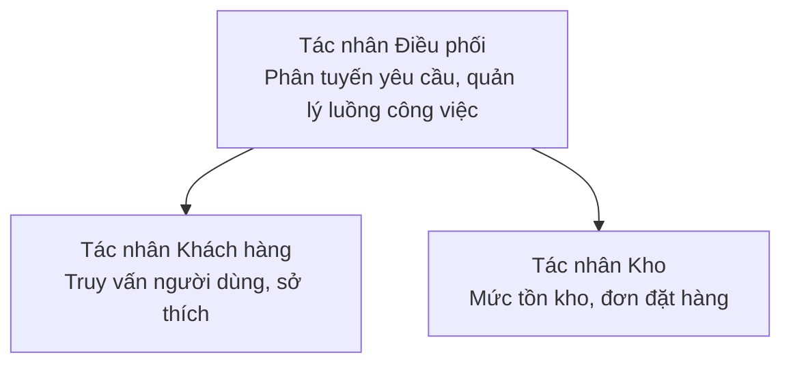

# Chương 5: Giải pháp AI Đa Tác nhân

**📚 Khóa học**: [AZD Cho Người Mới Bắt Đầu](../../README.md) | **⏱️ Thời lượng**: 2-3 giờ | **⭐ Độ khó**: Nâng cao

---

## Tổng quan

Chương này bao gồm các mẫu kiến trúc đa tác nhân nâng cao, điều phối tác nhân và triển khai AI sẵn sàng cho môi trường sản xuất cho các kịch bản phức tạp.

> Đã xác thực với `azd 1.23.12` vào tháng 3 năm 2026.

## Mục tiêu học tập

Khi hoàn thành chương này, bạn sẽ:
- Hiểu các mẫu kiến trúc đa tác nhân
- Triển khai hệ thống tác nhân AI phối hợp
- Thực hiện giao tiếp giữa các tác nhân
- Xây dựng giải pháp đa tác nhân sẵn sàng cho môi trường sản xuất

---

## 📚 Bài học

| # | Bài | Mô tả | Thời gian |
|---|--------|-------------|------|
| 1 | [Giải pháp Đa Tác nhân Bán lẻ](../../examples/retail-scenario.md) | Hướng dẫn triển khai hoàn chỉnh | 90 phút |
| 2 | [Mẫu điều phối](../chapter-06-pre-deployment/coordination-patterns.md) | Chiến lược điều phối tác nhân | 30 phút |
| 3 | [Triển khai ARM Template](../../examples/retail-multiagent-arm-template/README.md) | Triển khai một lần nhấp | 30 phút |

---

## 🚀 Bắt đầu nhanh

```bash
# Tùy chọn 1: Triển khai từ một mẫu
azd init --template agent-openai-python-prompty
azd up

# Tùy chọn 2: Triển khai từ tệp manifest của agent (yêu cầu tiện ích mở rộng azure.ai.agents)
azd extension install azure.ai.agents
azd ai agent init -m agent-manifest.yaml
azd up
```

> **Cách tiếp cận nào?** Sử dụng `azd init --template` để bắt đầu từ một mẫu hoạt động. Sử dụng `azd ai agent init` khi bạn có manifest tác nhân của riêng bạn. Xem [Tham khảo AZD AI CLI](../chapter-08-production/production-ai-practices.md#azd-ai-cli-commands-and-extensions) để biết chi tiết.

---

## 🤖 Kiến trúc Đa Tác nhân


---

## 🎯 Giải pháp tiêu biểu: Đa Tác nhân Bán lẻ

The [Giải pháp Đa Tác nhân Bán lẻ](../../examples/retail-scenario.md) minh họa:

- **Tác nhân Khách hàng**: Xử lý tương tác và sở thích người dùng
- **Tác nhân Kho**: Quản lý tồn kho và xử lý đơn hàng
- **Điều phối viên**: Điều phối giữa các tác nhân
- **Bộ nhớ chung**: Quản lý ngữ cảnh giữa các tác nhân

### Các dịch vụ được sử dụng

| Dịch vụ | Mục đích |
|---------|---------|
| Microsoft Foundry Models | Hiểu ngôn ngữ |
| Azure AI Search | Danh mục sản phẩm |
| Cosmos DB | Trạng thái và bộ nhớ của tác nhân |
| Container Apps | Lưu trữ tác nhân |
| Application Insights | Giám sát |

---

## 🔗 Điều hướng

| Hướng | Chương |
|-----------|---------|
| **Trước** | [Chương 4: Cơ sở hạ tầng](../chapter-04-infrastructure/README.md) |
| **Tiếp theo** | [Chương 6: Tiền Triển khai](../chapter-06-pre-deployment/README.md) |

---

## 📖 Tài nguyên liên quan

- [Hướng dẫn Tác nhân AI](../chapter-02-ai-development/agents.md)
- [Thực hành AI cho Sản xuất](../chapter-08-production/production-ai-practices.md)
- [Khắc phục sự cố AI](../chapter-07-troubleshooting/ai-troubleshooting.md)

---

<!-- CO-OP TRANSLATOR DISCLAIMER START -->
**Miễn trừ trách nhiệm**:
Tài liệu này đã được dịch bằng dịch vụ dịch thuật AI [Co-op Translator](https://github.com/Azure/co-op-translator). Mặc dù chúng tôi cố gắng đảm bảo độ chính xác, xin lưu ý rằng các bản dịch tự động có thể chứa lỗi hoặc không chính xác. Tài liệu gốc bằng ngôn ngữ nguyên văn nên được coi là nguồn thông tin chính thức. Đối với thông tin quan trọng, nên sử dụng bản dịch chuyên nghiệp do con người thực hiện. Chúng tôi không chịu trách nhiệm đối với bất kỳ sự hiểu lầm hoặc diễn giải sai nào phát sinh từ việc sử dụng bản dịch này.
<!-- CO-OP TRANSLATOR DISCLAIMER END -->