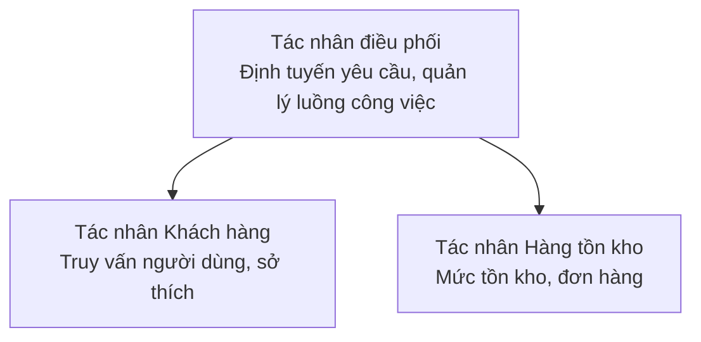

# Chương 5: Giải pháp AI nhiều tác nhân

**📚 Khóa học**: [AZD Cho Người Mới](../../README.md) | **⏱️ Thời lượng**: 2-3 giờ | **⭐ Độ phức tạp**: Nâng cao

---

## Tổng quan

Chương này trình bày các mẫu kiến trúc đa tác nhân nâng cao, điều phối tác nhân và các triển khai AI sẵn sàng cho môi trường sản xuất cho những kịch bản phức tạp.

## Mục tiêu học tập

Sau khi hoàn thành chương này, bạn sẽ:
- Hiểu các mẫu kiến trúc đa tác nhân
- Triển khai các hệ thống tác nhân AI phối hợp
- Triển khai giao tiếp giữa các tác nhân
- Xây dựng các giải pháp đa tác nhân sẵn sàng cho môi trường sản xuất

---

## 📚 Bài học

| # | Bài học | Mô tả | Thời gian |
|---|--------|-------------|------|
| 1 | [Giải pháp bán lẻ đa tác nhân](../../examples/retail-scenario.md) | Hướng dẫn triển khai hoàn chỉnh | 90 phút |
| 2 | [Mẫu phối hợp](../chapter-06-pre-deployment/coordination-patterns.md) | Chiến lược điều phối tác nhân | 30 phút |
| 3 | [Triển khai ARM Template](../../examples/retail-multiagent-arm-template/README.md) | Triển khai một lần nhấp | 30 phút |

---

## 🚀 Bắt đầu nhanh

```bash
# Tùy chọn 1: Triển khai từ mẫu
azd init --template agent-openai-python-prompty
azd up

# Tùy chọn 2: Triển khai từ một manifest tác nhân (yêu cầu phần mở rộng azure.ai.agents)
azd extension install azure.ai.agents
azd ai agent init -m agent-manifest.yaml
azd up
```

> **Chọn phương án nào?** Sử dụng `azd init --template` để bắt đầu từ một mẫu hoạt động. Sử dụng `azd ai agent init` khi bạn có manifest tác nhân riêng. Xem [Tài liệu tham khảo AZD AI CLI](../chapter-08-production/production-ai-practices.md#azd-ai-cli-commands-and-extensions) để biết chi tiết đầy đủ.

---

## 🤖 Kiến trúc đa tác nhân


---

## 🎯 Giải pháp nổi bật: Bán lẻ đa tác nhân

The [Giải pháp bán lẻ đa tác nhân](../../examples/retail-scenario.md) demonstrates:

- **Customer Agent**: Handles user interactions and preferences
- **Inventory Agent**: Manages stock and order processing
- **Orchestrator**: Coordinates between agents
- **Shared Memory**: Cross-agent context management

### Dịch vụ được sử dụng

| Dịch vụ | Mục đích |
|---------|---------|
| Microsoft Foundry Models | Hiểu ngôn ngữ |
| Azure AI Search | Danh mục sản phẩm |
| Cosmos DB | Trạng thái và bộ nhớ tác nhân |
| Container Apps | Lưu trữ tác nhân |
| Application Insights | Giám sát |

---

## 🔗 Điều hướng

| Hướng | Chương |
|-----------|---------|
| **Trước** | [Chương 4: Cơ sở hạ tầng](../chapter-04-infrastructure/README.md) |
| **Tiếp theo** | [Chương 6: Trước khi triển khai](../chapter-06-pre-deployment/README.md) |

---

## 📖 Tài nguyên liên quan

- [Hướng dẫn Tác nhân AI](../chapter-02-ai-development/agents.md)
- [Thực hành AI trong sản xuất](../chapter-08-production/production-ai-practices.md)
- [Khắc phục sự cố AI](../chapter-07-troubleshooting/ai-troubleshooting.md)

---

<!-- CO-OP TRANSLATOR DISCLAIMER START -->
**Miễn trừ trách nhiệm**:
Tài liệu này đã được dịch bằng dịch vụ dịch thuật AI [Co-op Translator](https://github.com/Azure/co-op-translator). Mặc dù chúng tôi cố gắng đảm bảo độ chính xác, xin lưu ý rằng các bản dịch tự động có thể chứa lỗi hoặc thiếu chính xác. Tài liệu gốc bằng ngôn ngữ nguyên thủy của nó nên được xem là nguồn có thẩm quyền. Đối với thông tin quan trọng, khuyến nghị sử dụng dịch vụ dịch thuật chuyên nghiệp do con người thực hiện. Chúng tôi không chịu trách nhiệm cho bất kỳ hiểu lầm hay giải thích sai nào phát sinh từ việc sử dụng bản dịch này.
<!-- CO-OP TRANSLATOR DISCLAIMER END -->