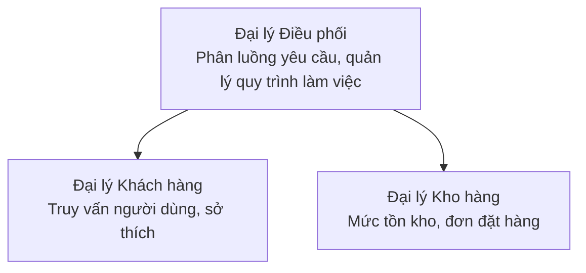

# Chương 5: Giải pháp AI đa tác nhân

**📚 Khóa học**: [AZD cho Người mới bắt đầu](../../README.md) | **⏱️ Thời lượng**: 2-3 giờ | **⭐ Độ phức tạp**: Nâng cao

---

## Tổng quan

Chương này đề cập đến các mô hình kiến trúc đa tác nhân nâng cao, sự phối hợp giữa các tác nhân, và triển khai AI sẵn sàng cho sản xuất trong các kịch bản phức tạp.

> Đã xác thực trên `azd 1.27.1` vào tháng 7 năm 2026.

## Mục tiêu học tập

Sau khi hoàn thành chương này, bạn sẽ:
- Hiểu các mô hình kiến trúc đa tác nhân
- Triển khai hệ thống các tác nhân AI phối hợp
- Thực hiện giao tiếp giữa các tác nhân
- Xây dựng các giải pháp đa tác nhân sẵn sàng cho sản xuất

---

## 📚 Các bài học

| # | Bài học | Mô tả | Thời gian |
|---|--------|-------------|------|
| 1 | [Kiến thức cơ bản về đa tác nhân](multi-agent-basics.md) | Thực hành: triển khai ứng dụng đa tác nhân hoạt động với `azd up` | 45 phút |
| 2 | [Mô hình phối hợp](../chapter-06-pre-deployment/coordination-patterns.md) | Chiến lược phối hợp giữa các tác nhân (tiếp tục trong Chương 6) | 30 phút |
| 3 | [Triển khai mẫu ARM](../../examples/retail-multiagent-arm-template/README.md) | Ví dụ triển khai chỉ với một cú nhấp | 30 phút |

> **Bắt đầu với Bài học 1.** Đây là bài duy nhất có thực hành đầy đủ, có thể triển khai trong chương này. Bài học 2 nằm trong Chương 6 (chung cho kế hoạch triển khai trước), và [Giải pháp đa tác nhân bán lẻ](../../examples/retail-scenario.md) là bản thiết kế kiến trúc — một tham chiếu thiết kế, không phải là mẫu lệnh một cú.

---

## 🚀 Bắt đầu nhanh

```bash
# Lựa chọn 1: Triển khai từ một mẫu
azd init --template agent-openai-python-prompty
azd up

# Lựa chọn 2: Triển khai từ một bản khai báo đại lý (yêu cầu phần mở rộng azure.ai.agents)
azd extension install azure.ai.agents
azd ai agent init -m agent-manifest.yaml
azd up
```

> **Phương pháp nào?** Dùng `azd init --template` để bắt đầu từ mẫu đang hoạt động. Dùng `azd ai agent init` khi bạn có manifest tác nhân của riêng mình. Xem [tham chiếu AZD AI CLI](../chapter-08-production/production-ai-practices.md#azd-ai-cli-commands-and-extensions) để biết chi tiết đầy đủ.

---

## 🤖 Kiến trúc đa tác nhân



---

## 🎯 Giải pháp nổi bật: Đa tác nhân bán lẻ

[Giải pháp đa tác nhân bán lẻ](../../examples/retail-scenario.md) trình bày:

- **Tác nhân khách hàng**: Xử lý tương tác và sở thích người dùng
- **Tác nhân kho**: Quản lý tồn kho và xử lý đơn hàng
- **Điều phối viên**: Phối hợp giữa các tác nhân
- **Bộ nhớ chia sẻ**: Quản lý ngữ cảnh giữa các tác nhân

### Dịch vụ sử dụng

| Dịch vụ | Mục đích |
|---------|---------|
| Mẫu Microsoft Foundry | Hiểu ngôn ngữ |
| Azure AI Search | Danh mục sản phẩm |
| Cosmos DB | Trạng thái và bộ nhớ tác nhân |
| Container Apps | Lưu trữ tác nhân |
| Application Insights | Giám sát |

---

## 🔗 Điều hướng

| Hướng | Chương |
|-----------|---------|
| **Trước** | [Chương 4: Hạ tầng](../chapter-04-infrastructure/README.md) |
| **Sau** | [Chương 6: Trước khi triển khai](../chapter-06-pre-deployment/README.md) |

---

## 📖 Tài nguyên liên quan

- [Hướng dẫn Tác nhân AI](../chapter-02-ai-development/agents.md)
- [Thực hành AI sản xuất](../chapter-08-production/production-ai-practices.md)
- [Khắc phục sự cố AI](../chapter-07-troubleshooting/ai-troubleshooting.md)

---

<!-- CO-OP TRANSLATOR DISCLAIMER START -->
**Tuyên bố miễn trừ trách nhiệm**:
Tài liệu này đã được dịch bằng dịch vụ dịch thuật AI [Co-op Translator](https://github.com/Azure/co-op-translator). Mặc dù chúng tôi cố gắng đảm bảo độ chính xác, xin lưu ý rằng bản dịch tự động có thể chứa lỗi hoặc sai sót. Tài liệu gốc bằng ngôn ngữ gốc nên được coi là nguồn tin chính thức. Đối với thông tin quan trọng, nên sử dụng dịch vụ dịch thuật chuyên nghiệp bởi con người. Chúng tôi không chịu trách nhiệm về bất kỳ hiểu lầm hoặc giải thích sai nào phát sinh từ việc sử dụng bản dịch này.
<!-- CO-OP TRANSLATOR DISCLAIMER END -->