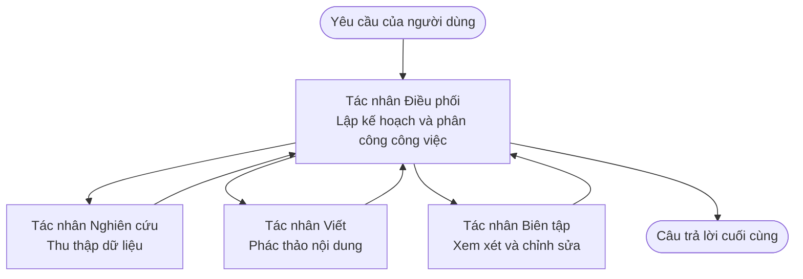

# Cơ Bản về Đa Tác Nhân - Triển Khai Hệ Thống AI Phối Hợp Đầu Tiên của Bạn

**Điều Hướng Chương:**
- **📚 Trang Khóa Học**: [AZD Cho Người Mới Bắt Đầu](../../README.md)
- **📖 Chương Hiện Tại**: Chương 5 - Giải Pháp AI Đa Tác Nhân
- **⬅️ Trước**: [Chương 4: Hạ Tầng](../chapter-04-infrastructure/README.md)
- **➡️ Tiếp Theo**: [Mẫu Phối Hợp](../chapter-06-pre-deployment/coordination-patterns.md)

> Đã xác thực với `azd 1.27.1` vào tháng 7 năm 2026.

## Giới Thiệu

Ở các chương trước, bạn đã triển khai một ứng dụng đơn lẻ—và trong Chương 2 bạn triển khai một tác nhân AI đơn lẻ. Bài học này tiến thêm một bước: triển khai một **hệ thống đa tác nhân**, nơi nhiều tác nhân chuyên môn hợp tác giải quyết một vấn đề mà một tác nhân đơn không thể xử lý tốt.

Tin tốt cho người mới: **bạn không cần lệnh mới.** Giải pháp đa tác nhân vẫn là một dự án azd. Bạn sẽ `azd init`, `azd up`, kiểm thử, và `azd down`—chính xác quy trình bạn đã biết. Thay đổi là *hình dạng* ứng dụng bên trong.

## Mục Tiêu Học Tập

Đến cuối bài học này, bạn sẽ:
- Hiểu "đa tác nhân" là gì và khi nào nó xứng đáng với sự phức tạp thêm vào
- Nhận biết các vai trò phổ biến trong hệ thống đa tác nhân (điều phối viên + chuyên gia)
- Triển khai một mẫu đa tác nhân thực tế hoạt động với `azd up`
- Hiểu các nguồn lực Azure hỗ trợ ứng dụng đa tác nhân
- Biết cách xác minh, tùy chỉnh, và dọn dẹp giải pháp an toàn

## Kết Quả Học Tập

Sau khi hoàn thành bài học này, bạn sẽ có thể:
- Giải thích sự khác biệt giữa tác nhân đơn và hệ thống đa tác nhân
- Lựa chọn giữa tác nhân đơn có công cụ và thiết kế đa tác nhân thật sự
- Triển khai và kiểm thử mẫu đa tác nhân từ đầu đến cuối bằng azd
- Xác định nơi mỗi tác nhân chạy và cách chúng giao tiếp
- Dọn dẹp tất cả tài nguyên để tránh phát sinh chi phí liên tục

---

## Hệ Thống Đa Tác Nhân Là Gì?

Một tác nhân AI đơn là một mô hình với bộ hướng dẫn và (tuỳ chọn) một số công cụ. Điều này hiệu quả cho các nhiệm vụ tập trung. Nhưng khi nhiệm vụ mở rộng—nghiên cứu, rồi viết, rồi chỉnh sửa, rồi kiểm chứng—gói tất cả vào một lời nhắc làm tác nhân chậm hơn, kém tin cậy, và khó gỡ lỗi.

Một **hệ thống đa tác nhân** phân chia công việc thành các chuyên gia mỗi người làm tốt một phần, được điều phối bởi một điều phối viên:



### Hai vai trò bạn luôn thấy

| Vai trò | Công việc | Ví dụ |
|------|-----|---------|
| **Điều phối viên** | Quyết định *việc gì xảy ra tiếp theo* và phân phối công việc giữa các tác nhân | "Trước tiên nghiên cứu, rồi viết, rồi chỉnh sửa" |
| **Chuyên gia** | Làm một việc tập trung tốt và trả về kết quả | Một "nhà nghiên cứu" chỉ thu thập dữ kiện |

### Bạn có thực sự cần nhiều tác nhân không?

Bắt đầu đơn giản. Chỉ sử dụng đa tác nhân **khi nào** một trong các điều sau đúng:

- ✅ Nhiệm vụ có **các giai đoạn riêng biệt** cần hướng dẫn khác nhau (nghiên cứu so với viết so với đánh giá)
- ✅ Bạn muốn các chuyên gia chạy **song song** để tiết kiệm thời gian
- ✅ Các bước khác nhau cần **công cụ hay nguồn dữ liệu khác nhau**
- ✅ Bạn cần mỗi bước **có thể kiểm thử và gỡ lỗi độc lập**

Nếu nhiệm vụ của bạn là hỏi đáp đơn giản hoặc gọi công cụ đơn giản, thì **tác nhân đơn với công cụ** (Chương 2) đơn giản hơn, rẻ hơn, và dễ vận hành hơn.

> **Mẹo cho người mới:** "Nhiều tác nhân hơn" không phải là "tốt hơn." Mỗi tác nhân thêm độ trễ, chi phí, và một thứ mới để giám sát. Chỉ thêm tác nhân khi vấn đề rõ ràng chia thành các phần.

---

## Hai Cách Xây Dựng Đa Tác Nhân trên Azure

| Phương pháp | Là gì | Phù hợp với |
|----------|-----------|----------|
| **Tác nhân đơn + công cụ** | Một tác nhân Foundry gọi hàm/công cụ | Quy trình đơn giản, bắt đầu dễ dàng |
| **Nhiều tác nhân phối hợp** | Nhiều tác nhân với điều phối viên | Giai đoạn riêng biệt, làm song song, chuyên môn hoá |

Bài học này tập trung vào phương pháp thứ hai dùng **mẫu có sẵn**, để bạn thấy hệ thống đa tác nhân thực chạy trước khi tự xây dựng.

---

## Thực Hành: Triển Khai Ứng Dụng Đa Tác Nhân Hoạt Động

Chúng ta sẽ triển khai **Contoso Creative Writer**, một mẫu Azure chính thức sử dụng nhiều tác nhân (nhà nghiên cứu, người viết, người chỉnh sửa) phối hợp tạo thành bài báo. Đây là app đa tác nhân đầu tiên tuyệt vời vì vai trò dễ hiểu.

### Bước 1: Khởi tạo mẫu

```bash
# Tạo một thư mục làm việc
mkdir creative-writer && cd creative-writer

# Khởi tạo từ mẫu đa tác nhân chính thức
azd init --template contoso-creative-writer
```

> Bạn có thể duyệt thêm các mẫu đa tác nhân bất kỳ lúc nào tại [Thư viện AZD AI Tuyệt vời](https://azure.github.io/awesome-azd/?tags=ai). Các lựa chọn thân thiện với người mới khác bao gồm `get-started-with-ai-agents` và `azure-ai-travel-agents`.

### Bước 2: Xác thực

```bash
# Bắt buộc cho các quy trình làm việc azd
azd auth login
```

### Bước 3: Tạo môi trường

```bash
azd env new dev
```

### Bước 4: Xem trước, sau đó triển khai

```bash
# Xem những gì sẽ được tạo trước khi chi tiêu bất kỳ thứ gì (được khuyên dùng)
azd provision --preview

# Cung cấp cơ sở hạ tầng và triển khai tất cả các tác nhân trong một bước duy nhất
azd up
```

`azd up` sẽ hỏi bạn chọn subscription và vùng, sau đó tạo các tài nguyên Azure và triển khai ứng dụng. Triển khai AI có thể mất lâu hơn ứng dụng web đơn giản—nếu bạn triển khai các mô hình lớn hơn, bạn có thể kéo dài thời gian chờ triển khai:

```bash
azd deploy --timeout 1800
```

> **Lưu ý về chi phí và công suất:** Ứng dụng đa tác nhân triển khai các mô hình AI tiêu thụ hạn mức và phát sinh chi phí. Nếu `azd up` bị lỗi giới hạn mô hình, xem [Khắc phục sự cố AI](../chapter-07-troubleshooting/ai-troubleshooting.md) để biết cách sửa vùng và hạn mức, và Chương 6 [Lập kế hoạch công suất](../chapter-06-pre-deployment/capacity-planning.md).

---

## Hiểu Việc Bạn Đã Triển Khai

Một app đa tác nhân điển hình như thế này tạo ra một bộ tài nguyên Azure tương ứng trực tiếp với các trách nhiệm trong sơ đồ phía trên:

| Tài nguyên | Tại sao nó ở đó |
|----------|----------------|
| **Microsoft Foundry / Models** | Lưu trữ các mô hình ngôn ngữ mà mỗi tác nhân sử dụng |
| **Azure AI Search** | Cung cấp dữ liệu nền cho tác nhân nghiên cứu tìm kiếm |
| **Container Apps** (hoặc App Service) | Lưu trữ mã điều phối viên và tác nhân |
| **Cosmos DB** (trong một số mẫu) | Lưu trạng thái/chung bộ nhớ được truyền giữa các tác nhân |
| **Application Insights** | Theo dõi các yêu cầu *qua* các tác nhân giúp bạn gỡ lỗi luồng |

### Cách các tác nhân giao tiếp với nhau

Trong đa số mẫu đa tác nhân azd, **điều phối viên chạy trong mã ứng dụng của bạn** (ví dụ dùng framework như Semantic Kernel hoặc Microsoft Agent Framework). Điều phối viên lần lượt gọi các tác nhân chuyên gia, truyền kết quả, và lắp ráp câu trả lời cuối cùng. Các tác nhân chia sẻ ngữ cảnh qua:

- **Gọi hàm/công cụ** — điều phối viên gọi tác nhân chuyên gia rồi nhận kết quả lại
- **Bộ nhớ chia sẻ** — một cơ sở dữ liệu (thường là Cosmos DB) giữ trạng thái mà cả hai đọc được
- **Tin nhắn/sự kiện** — để liên kết lỏng hơn, các tác nhân giao tiếp qua hàng đợi hoặc Service Bus

> **Tại sao điều này quan trọng cho gỡ lỗi:** vì mỗi bước tách biệt, Application Insights cho bạn thấy *tác nhân nào* chậm hoặc lỗi. Đó là lý do chính để chia công việc giữa các tác nhân.

---

## Xác Minh Việc Triển Khai

Xác nhận hệ thống thực sự hoạt động trước khi tiếp tục:

```bash
# Hiển thị các điểm cuối đã triển khai
azd show

# Mở bảng điều khiển giám sát của ứng dụng
azd monitor

# Theo dõi nhật ký nếu có điều gì đó không ổn
azd monitor --logs
```

Sau đó mở URL ứng dụng từ `azd show` và thử một yêu cầu tác động đến tất cả các tác nhân (với Creative Writer, yêu cầu nó viết bài ngắn về chủ đề). Trong Application Insights **tìm kiếm giao dịch**, bạn sẽ thấy yêu cầu phân tán qua các bước nhà nghiên cứu, người viết và người chỉnh sửa.

**Tiêu chí thành công:**
- ✅ `azd show` liệt kê một điểm cuối có thể truy cập
- ✅ Yêu cầu tạo ra kết quả rõ ràng đã qua nhiều giai đoạn
- ✅ Application Insights hiển thị các dấu vết từ nhiều bước tác nhân khác nhau

---

## Tùy Chỉnh: Thêm Hoặc Điều Chỉnh Tác Nhân

Vì mỗi tác nhân chỉ là hướng dẫn cộng công cụ, việc tùy chỉnh khá dễ tiếp cận:

1. **Tìm định nghĩa tác nhân** trong mẫu (thường là file trong `prompts/`, `agents/`, hoặc `*.prompty`).
2. **Điều chỉnh hướng dẫn của tác nhân** — ví dụ, bảo tác nhân chỉnh sửa tuân thủ giọng điệu hoặc số từ nhất định.
3. **Triển khai lại chỉ mã** (hạ tầng không đổi):

   ```bash
   azd deploy
   ```

Để đi xa hơn và xây tác nhân từ *manifest* riêng, dùng phần mở rộng tác nhân và toàn bộ vòng đời:

```bash
azd extension install azure.ai.agents
azd ai agent init -m agent-manifest.yaml
azd up
azd ai agent invoke      # kiểm tra, với thời gian phản hồi
```

Xem [Chương 2: Tác nhân](../chapter-02-ai-development/agents.md) và [tham khảo AZD AI CLI](../chapter-08-production/production-ai-practices.md#azd-ai-cli-commands-and-extensions) về vòng đời đầy đủ của tác nhân (`invoke`, `eval generate`, `optimize`, `delete`).

---

## Dọn Dẹp

Ứng dụng đa tác nhân chạy nhiều dịch vụ có phí. Hãy dọn sạch khi xong việc:

```bash
azd down --force --purge
```

Cờ `--purge` cũng xóa các tài nguyên AI đã bị xóa mềm (như tài khoản Foundry/Dịch vụ Azure AI) để chúng không chặn triển khai lại hoặc tiếp tục tính phí.

---

## Ghi Chú về Hệ Thống Đa Tác Nhân Sản Xuất

[Giải pháp Đa Tác Nhân Bán Lẻ](../../examples/retail-scenario.md) trong kho này là một **bản thiết kế kiến trúc**, không phải mẫu một lệnh—nó trình bày cách một hệ thống bán lẻ sản xuất *sẽ* được xây dựng (và nói rõ rằng xây dựng toàn diện là công việc lớn). Dùng nó làm tham khảo thiết kế *sau khi* bạn đã triển khai mẫu hoạt động tại đây. Về các vấn đề sản xuất (độ bền, chi phí, giám sát, quản trị), tiếp tục xem [Chương 8: Thực Hành AI Sản Xuất](../chapter-08-production/production-ai-practices.md).

---

## Tóm Tắt

- Hệ thống đa tác nhân phân chia công việc giữa các chuyên gia được điều phối bởi một điều phối viên.
- Chỉ dùng khi nhiệm vụ có các giai đoạn riêng biệt, song song, hoặc cần công cụ khác nhau cho mỗi bước—nếu không ưu tiên tác nhân đơn.
- Quy trình azd không thay đổi: `azd init` → `azd up` → kiểm thử → `azd down`.
- Mẫu thực tế như `contoso-creative-writer` cho phép bạn thấy và tùy chỉnh app đa tác nhân hoạt động ngay hôm nay.
- Theo dõi Application Insights xuyên suốt các tác nhân là một trong những lợi ích thực tiễn lớn nhất của thiết kế đa tác nhân.

---

## 🔗 Điều Hướng

| Hướng | Bài học |
|-----------|--------|
| **Trước** | [Chương 4: Hạ Tầng](../chapter-04-infrastructure/README.md) |
| **Tiếp** | [Mẫu Phối Hợp](../chapter-06-pre-deployment/coordination-patterns.md) |

## 📖 Tài Nguyên Liên Quan

- [Hướng Dẫn Tác Nhân AI](../chapter-02-ai-development/agents.md)
- [Mẫu Phối Hợp](../chapter-06-pre-deployment/coordination-patterns.md)
- [Thực Hành AI Sản Xuất](../chapter-08-production/production-ai-practices.md)
- [Khắc Phục Sự Cố AI](../chapter-07-troubleshooting/ai-troubleshooting.md)

---

<!-- CO-OP TRANSLATOR DISCLAIMER START -->
**Tuyên bố miễn trừ trách nhiệm**:
Tài liệu này đã được dịch bằng dịch vụ dịch thuật AI [Co-op Translator](https://github.com/Azure/co-op-translator). Mặc dù chúng tôi cố gắng đảm bảo độ chính xác, xin lưu ý rằng bản dịch tự động có thể chứa lỗi hoặc sai sót. Tài liệu gốc bằng ngôn ngữ gốc nên được coi là nguồn tin chính thức. Đối với thông tin quan trọng, nên sử dụng dịch vụ dịch thuật chuyên nghiệp bởi con người. Chúng tôi không chịu trách nhiệm về bất kỳ hiểu lầm hoặc giải thích sai nào phát sinh từ việc sử dụng bản dịch này.
<!-- CO-OP TRANSLATOR DISCLAIMER END -->