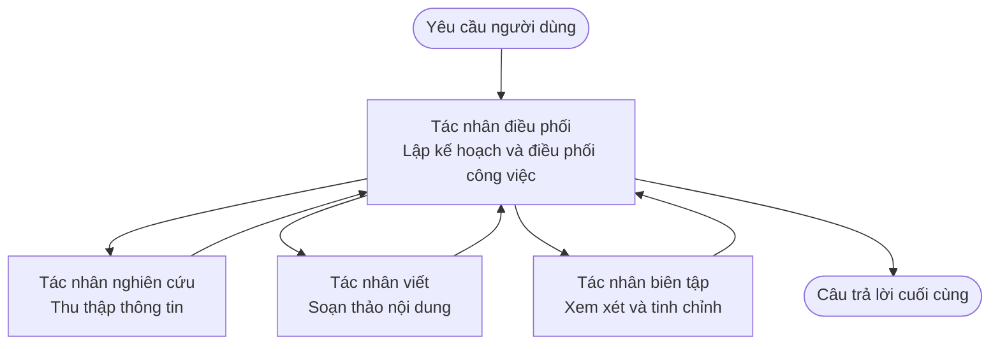

# Những Khái Niệm Cơ Bản về Hệ thống Đa Tác Nhân - Triển Khai Hệ Thống AI Phối Hợp Đầu Tiên của Bạn

**Điều Hướng Chương:**
- **📚 Trang Khóa Học**: [AZD Dành cho Người Mới](../../README.md)
- **📖 Chương Hiện Tại**: Chương 5 - Các Giải Pháp AI Đa Tác Nhân
- **⬅️ Trước**: [Chương 4: Hạ Tầng](../chapter-04-infrastructure/README.md)
- **➡️ Tiếp**: [Mẫu Phối Hợp](../chapter-06-pre-deployment/coordination-patterns.md)

> Đã xác thực với `azd 1.25.6` vào tháng 6 năm 2026.

## Giới thiệu

Trong các chương trước bạn đã triển khai một ứng dụng đơn—và trong Chương 2 bạn đã triển khai một tác nhân AI đơn lẻ. Bài học này đi bước tiếp theo: triển khai một **hệ thống đa tác nhân**, nơi nhiều tác nhân chuyên biệt làm việc cùng nhau để giải quyết một vấn đề mà một tác nhân đơn lẻ khó có thể làm tốt.

Tin tốt cho người mới: **bạn không cần lệnh mới.** Một giải pháp đa tác nhân vẫn là một dự án azd. Bạn sẽ `azd init`, `azd up`, kiểm thử, và `azd down`—chính quy trình làm việc bạn đã biết. Điều thay đổi là *hình dạng* của ứng dụng bên trong.

## Mục tiêu học tập

Kết thúc bài học này, bạn sẽ:
- Hiểu "đa tác nhân" có nghĩa là gì và khi nào việc thêm độ phức tạp là xứng đáng
- Nhận diện các vai trò phổ biến trong hệ thống đa tác nhân (người điều phối + các chuyên gia)
- Triển khai một mẫu đa tác nhân thực tế hoạt động với `azd up`
- Hiểu các tài nguyên Azure hỗ trợ một ứng dụng đa tác nhân
- Biết cách xác minh, tùy chỉnh và dọn dẹp giải pháp một cách an toàn

## Kết quả học tập

Sau khi hoàn thành bài học, bạn sẽ có khả năng:
- Giải thích sự khác biệt giữa một tác nhân đơn lẻ và một hệ thống đa tác nhân
- Lựa chọn giữa một tác nhân đơn với công cụ và một thiết kế đa tác nhân thực thụ
- Triển khai và kiểm thử một mẫu đa tác nhân end-to-end với azd
- Xác định nơi mỗi tác nhân chạy và cách chúng giao tiếp
- Dọn dẹp toàn bộ tài nguyên để tránh chi phí phát sinh

---

## Hệ thống Đa Tác Nhân là gì?

Một tác nhân AI đơn lẻ là một mô hình với một tập hướng dẫn và (tùy chọn) một số công cụ. Điều đó hoạt động tốt cho các tác vụ tập trung. Nhưng khi một tác vụ mở rộng—nghiên cứu, rồi viết, rồi chỉnh sửa, rồi kiểm chứng—nhồi nhét mọi thứ vào một prompt làm tác nhân chậm hơn, kém tin cậy hơn và khó gỡ lỗi hơn.

Một **hệ thống đa tác nhân** chia công việc thành các chuyên gia, mỗi người thực hiện tốt một nhiệm vụ, được điều phối bởi một người điều phối:



### Hai vai trò bạn luôn thấy

| Vai trò | Công việc | Ví dụ |
|------|-----|---------|
| **Người điều phối** | Quyết định *chuyện gì xảy ra tiếp theo* và điều phối công việc giữa các tác nhân | "Trước nghiên cứu, sau đó viết, rồi chỉnh sửa" |
| **Chuyên gia** | Thực hiện một công việc tập trung và trả về kết quả | Một "nhà nghiên cứu" chỉ thu thập sự thật |

### Thực sự bạn có cần nhiều tác nhân không?

Bắt đầu đơn giản. Chỉ hướng tới đa tác nhân khi một trong những điều sau là đúng:

- ✅ Nhiệm vụ có **các giai đoạn riêng biệt** mà hưởng lợi từ các hướng dẫn khác nhau (nghiên cứu vs viết vs rà soát)
- ✅ Bạn muốn các chuyên gia chạy **song song** để tiết kiệm thời gian
- ✅ Những bước khác nhau cần **công cụ hoặc nguồn dữ liệu khác nhau**
- ✅ Bạn cần mỗi bước **có thể kiểm thử và gỡ lỗi độc lập**

Nếu nhiệm vụ của bạn là một câu hỏi-trả lời đơn giản hoặc một cuộc gọi công cụ đơn giản, một **tác nhân đơn với công cụ** (Chương 2) đơn giản hơn, rẻ hơn và dễ vận hành hơn.

> **Mẹo cho người mới:** "Nhiều tác nhân hơn" không có nghĩa là "tốt hơn." Mỗi tác nhân thêm độ trễ, chi phí và một thứ cần giám sát. Thêm tác nhân chỉ khi vấn đề rõ ràng chia tách thành các phần.

---

## Hai cách để xây dựng đa tác nhân trên Azure

| Phương pháp | Đây là gì | Phù hợp cho |
|----------|-----------|----------|
| **Một tác nhân + công cụ** | Một tác nhân Foundry gọi hàm/công cụ | Luồng công việc đơn giản, bắt đầu |
| **Nhiều tác nhân phối hợp** | Nhiều tác nhân với một người điều phối | Các giai đoạn riêng biệt, công việc song song, chuyên môn hóa |

Bài học này tập trung vào cách thứ hai bằng cách sử dụng một **mẫu có sẵn**, để bạn có thể thấy một hệ thống đa tác nhân thực tế đang chạy trước khi tự xây dựng.

---

## Thực hành: Triển khai một ứng dụng đa tác nhân hoạt động

Chúng ta sẽ triển khai **Contoso Creative Writer**, một ví dụ chính thức của Azure sử dụng nhiều tác nhân (nhà nghiên cứu, người viết, biên tập viên) được điều phối để tạo một bài báo. Đây là một ứng dụng đa tác nhân đầu tiên tuyệt vời vì các vai trò dễ hiểu.

### Bước 1: Khởi tạo mẫu

```bash
# Tạo thư mục làm việc
mkdir creative-writer && cd creative-writer

# Khởi tạo từ mẫu đa tác nhân chính thức
azd init --template contoso-creative-writer
```

> Duyệt thêm các mẫu đa tác nhân bất kỳ lúc nào trong [Awesome AZD AI gallery](https://azure.github.io/awesome-azd/?tags=ai). Các lựa chọn thân thiện với người mới khác bao gồm `get-started-with-ai-agents` và `azure-ai-travel-agents`.

### Bước 2: Xác thực

```bash
# Cần thiết cho các luồng công việc azd
azd auth login
```

### Bước 3: Tạo một môi trường

```bash
azd env new dev
```

### Bước 4: Xem trước, rồi triển khai

```bash
# Xem những gì sẽ được tạo ra trước khi chi tiêu bất cứ thứ gì (khuyến nghị)
azd provision --preview

# Cung cấp hạ tầng và triển khai tất cả các agent trong một bước
azd up
```

`azd up` sẽ yêu cầu chọn subscription và khu vực, sau đó cấp phát các tài nguyên Azure và triển khai ứng dụng. Việc triển khai AI có thể mất lâu hơn so với một ứng dụng web đơn giản—nếu bạn triển khai mô hình lớn hơn, bạn có thể kéo dài thời gian chờ triển khai:

```bash
azd deploy --timeout 1800
```

> **Lưu ý về chi phí và dung lượng:** Ứng dụng đa tác nhân triển khai các mô hình AI tiêu thụ quota và phát sinh chi phí. Nếu `azd up` không thành công do quota mô hình, xem [AI Troubleshooting](../chapter-07-troubleshooting/ai-troubleshooting.md) để biết cách sửa khu vực và quota, và Chương 6 [Capacity Planning](../chapter-06-pre-deployment/capacity-planning.md).

---

## Hiểu về những gì bạn đã triển khai

Một ứng dụng đa tác nhân điển hình như thế này cấp phát một tập các tài nguyên Azure tương ứng trực tiếp với các trách nhiệm trong sơ đồ ở trên:

| Tài nguyên | Tại sao có |
|----------|----------------|
| **Microsoft Foundry / Mô hình** | Lưu trữ các mô hình ngôn ngữ mà mỗi tác nhân sử dụng |
| **Azure AI Search** | Cung cấp cho tác nhân nghiên cứu dữ liệu có cơ sở để tìm kiếm |
| **Container Apps** (hoặc App Service) | Lưu trữ mã người điều phối và mã các tác nhân |
| **Cosmos DB** (trong một số mẫu) | Lưu trữ trạng thái/bộ nhớ chia sẻ được truyền giữa các tác nhân |
| **Application Insights** | Theo dõi các yêu cầu *qua* các tác nhân để bạn có thể gỡ lỗi luồng |

### Cách các tác nhân giao tiếp với nhau

Trong hầu hết các mẫu azd đa tác nhân, **người điều phối chạy trong mã ứng dụng của bạn** (ví dụ, sử dụng một framework như Semantic Kernel hoặc Microsoft Agent Framework). Người điều phối gọi từng tác nhân chuyên môn theo thứ tự, chuyển tiếp kết quả, và lắp ráp câu trả lời cuối cùng. Các tác nhân chia sẻ ngữ cảnh thông qua:

- **Gọi hàm/công cụ** — người điều phối gọi một chuyên gia và nhận kết quả trở lại
- **Bộ nhớ chia sẻ** — một cơ sở dữ liệu (thường là Cosmos DB) lưu trạng thái mà cả các tác nhân đều có thể đọc
- **Tin nhắn/sự kiện** — để ghép lỏng hơn, các tác nhân giao tiếp qua hàng đợi hoặc Service Bus

> **Tại sao điều này quan trọng cho việc gỡ lỗi:** vì mỗi bước tách rời, Application Insights cho bạn thấy *tác nhân nào* chậm hoặc thất bại. Đó là một lý do lớn để chia công việc giữa các tác nhân ngay từ đầu.

---

## Xác minh việc triển khai

Xác nhận hệ thống thực sự hoạt động trước khi tiếp tục:

```bash
# Hiển thị các điểm cuối đã triển khai
azd show

# Mở bảng điều khiển giám sát của ứng dụng
azd monitor

# Theo dõi nhật ký (tail) nếu có vẻ có gì đó không ổn
azd monitor --logs
```

Sau đó mở URL ứng dụng từ `azd show` và thử một yêu cầu tác động tới tất cả các tác nhân (với Creative Writer, yêu cầu nó viết một bài ngắn về một chủ đề). Trong **tìm kiếm giao dịch** của Application Insights, bạn nên thấy yêu cầu phân tán qua các bước nhà nghiên cứu, người viết và biên tập viên.

**Tiêu chí thành công:**
- ✅ `azd show` liệt kê một endpoint có thể truy cập
- ✅ Một yêu cầu tạo ra kết quả rõ ràng đã trải qua nhiều giai đoạn
- ✅ Application Insights hiển thị các trace cho hơn một bước tác nhân

---

## Tùy chỉnh: Thêm hoặc Điều chỉnh một Tác Nhân

Bởi vì mỗi tác nhân chỉ là tập hợp hướng dẫn cộng với công cụ, việc tùy chỉnh trở nên dễ tiếp cận:

1. **Tìm các định nghĩa tác nhân** trong mẫu (thường là một bộ tệp `prompts/`, `agents/`, hoặc `*.prompty`).
2. **Tinh chỉnh hướng dẫn của một tác nhân** — ví dụ, yêu cầu tác nhân biên tập tuân thủ tông giọng hoặc số lượng từ cụ thể.
3. **Triển khai lại chỉ mã** (cơ sở hạ tầng không thay đổi):

   ```bash
   azd deploy
   ```

Để đi xa hơn và xây dựng tác nhân từ manifest *của bạn*, hãy sử dụng extension tác nhân và vòng đời đầy đủ của nó:

```bash
azd extension install azure.ai.agents
azd ai agent init -m agent-manifest.yaml
azd up
azd ai agent invoke      # kiểm tra, với thời gian phản hồi
```

Xem [Chương 2: Tác nhân](../chapter-02-ai-development/agents.md) và [Tham khảo AZD AI CLI](../chapter-08-production/production-ai-practices.md#azd-ai-cli-commands-and-extensions) cho vòng đời tác nhân đầy đủ (`invoke`, `eval generate`, `optimize`, `delete`).

---

## Dọn dẹp

Ứng dụng đa tác nhân chạy nhiều dịch vụ tính phí. Hủy bỏ mọi thứ khi bạn xong:

```bash
azd down --force --purge
```

Cờ `--purge` cũng xóa các tài nguyên AI bị xóa mềm (như tài khoản Foundry/Azure AI Services) để chúng không chặn việc triển khai lại trong tương lai hoặc tiếp tục phát sinh chi phí.

---

## Ghi chú về Hệ thống Đa Tác Nhân trong Môi trường Sản xuất

[Retail Multi-Agent Solution](../../examples/retail-scenario.md) trong repo này là một **bản thiết kế kiến trúc**, không phải một mẫu một lệnh—nó mô tả cách một hệ thống bán lẻ sản xuất *sẽ* được xây dựng (và nêu rõ rằng việc xây dựng đầy đủ là một nỗ lực đáng kể). Sử dụng nó như tham chiếu thiết kế *sau khi* bạn đã triển khai một mẫu hoạt động ở đây. Đối với các mối quan tâm môi trường sản xuất (khả năng chịu lỗi, chi phí, giám sát, quản trị), tiếp tục sang [Chương 8: Thực hành AI trong môi trường sản xuất](../chapter-08-production/production-ai-practices.md).

---

## Tóm tắt

- Hệ thống đa tác nhân chia công việc giữa các chuyên gia được điều phối bởi một người điều phối.
- Chỉ sử dụng khi nhiệm vụ có các giai đoạn riêng biệt, cần song song hoặc cần công cụ khác nhau—nếu không, ưu tiên một tác nhân đơn.
- Quy trình azd không thay đổi: `azd init` → `azd up` → kiểm thử → `azd down`.
- Một mẫu thực tế như `contoso-creative-writer` cho phép bạn thấy và tùy chỉnh một ứng dụng đa tác nhân hoạt động ngay hôm nay.
- Theo dõi Application Insights qua các tác nhân là một trong những lợi ích thực tiễn lớn nhất của thiết kế đa tác nhân.

---

## 🔗 Điều hướng

| Hướng | Bài học |
|-----------|--------|
| **Trước** | [Chương 4: Hạ Tầng](../chapter-04-infrastructure/README.md) |
| **Tiếp** | [Mẫu Phối Hợp](../chapter-06-pre-deployment/coordination-patterns.md) |

## 📖 Tài nguyên liên quan

- [Hướng dẫn Tác nhân AI](../chapter-02-ai-development/agents.md)
- [Mẫu Phối Hợp](../chapter-06-pre-deployment/coordination-patterns.md)
- [Thực hành AI trong môi trường sản xuất](../chapter-08-production/production-ai-practices.md)
- [Khắc phục sự cố AI](../chapter-07-troubleshooting/ai-troubleshooting.md)

---

<!-- CO-OP TRANSLATOR DISCLAIMER START -->
**Tuyên bố miễn trừ trách nhiệm**:
Tài liệu này đã được dịch bằng dịch vụ dịch thuật AI [Co-op Translator](https://github.com/Azure/co-op-translator). Mặc dù chúng tôi cố gắng đảm bảo độ chính xác, xin lưu ý rằng bản dịch tự động có thể chứa lỗi hoặc sai sót. Tài liệu gốc bằng ngôn ngữ gốc nên được coi là nguồn tin chính thức. Đối với thông tin quan trọng, nên sử dụng dịch vụ dịch thuật chuyên nghiệp bởi con người. Chúng tôi không chịu trách nhiệm về bất kỳ hiểu lầm hoặc giải thích sai nào phát sinh từ việc sử dụng bản dịch này.
<!-- CO-OP TRANSLATOR DISCLAIMER END -->