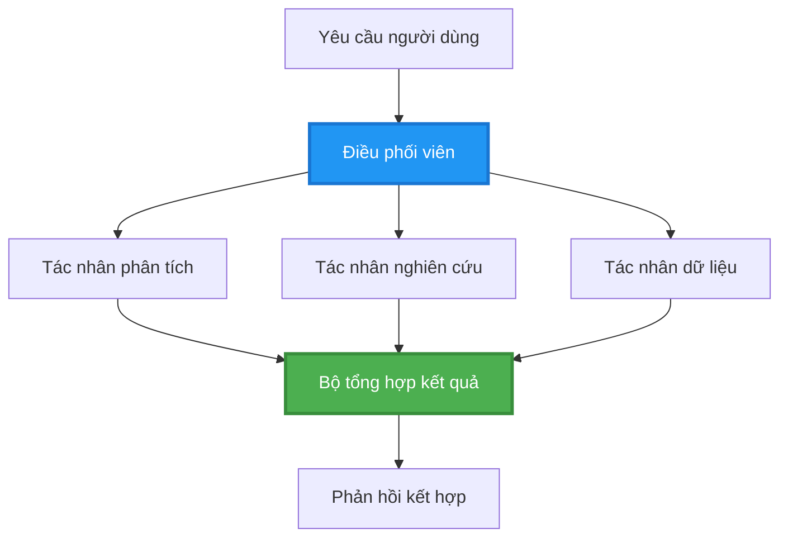
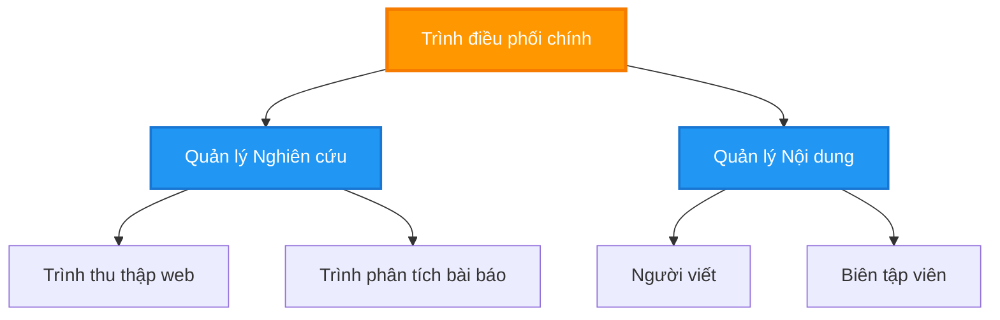
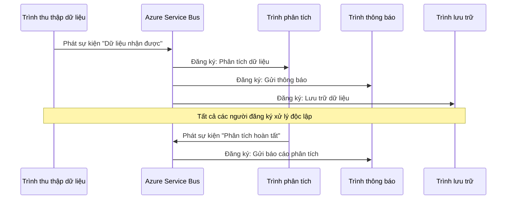
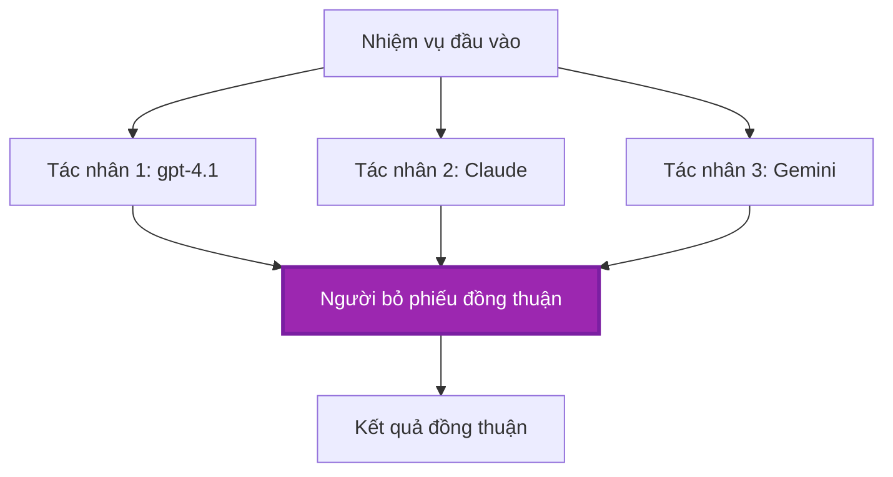
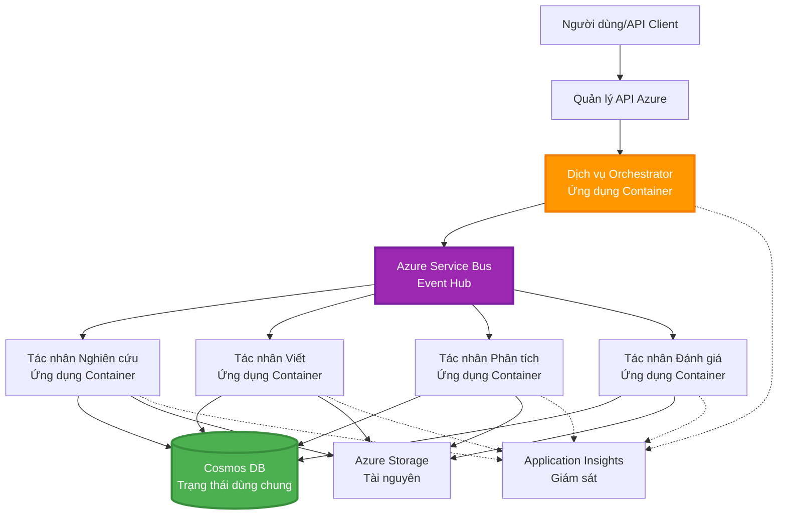

# Mẫu phối hợp đa tác nhân

⏱️ **Thời gian ước tính**: 60-75 phút | 💰 **Chi phí ước tính**: ~$100-300/tháng | ⭐ **Độ phức tạp**: Nâng cao

**📚 Lộ trình học:**
- ← Trước đó: [Lập kế hoạch công suất](capacity-planning.md) - Định cỡ tài nguyên và chiến lược mở rộng
- 🎯 **Bạn đang ở đây**: Mẫu phối hợp đa tác nhân (Điều phối, giao tiếp, quản lý trạng thái)
- → Tiếp theo: [Lựa chọn SKU](sku-selection.md) - Chọn dịch vụ Azure phù hợp
- 🏠 [Trang khóa học](../../README.md)

---

## Những gì bạn sẽ học

Hoàn thành bài học này, bạn sẽ:
- Hiểu các mẫu **kiến trúc đa tác nhân** và khi nào nên sử dụng chúng
- Triển khai **mẫu điều phối** (tập trung, phi tập trung, phân cấp)
- Thiết kế chiến lược **giao tiếp giữa các tác nhân** (đồng bộ, bất đồng bộ, dựa trên sự kiện)
- Quản lý **trạng thái chia sẻ** giữa các tác nhân phân tán
- Triển khai **hệ thống đa tác nhân** trên Azure bằng AZD
- Áp dụng **mẫu phối hợp** cho các tình huống AI thực tế
- Giám sát và gỡ lỗi hệ thống tác nhân phân tán

## Tại sao điều phối đa tác nhân quan trọng

### Sự tiến hóa: Từ tác nhân đơn đến đa tác nhân

**Tác nhân đơn (Đơn giản):**
```
User → Agent → Response
```
- ✅ Dễ hiểu và triển khai
- ✅ Nhanh cho các tác vụ đơn giản
- ❌ Bị giới hạn bởi khả năng của một mô hình duy nhất
- ❌ Không thể song song hóa các tác vụ phức tạp
- ❌ Không có sự chuyên môn hóa

**Hệ thống đa tác nhân (Nâng cao):**
```mermaid
graph TD
    Orchestrator[Điều phối viên] --> Agent1[Agent1<br/>Kế hoạch]
    Orchestrator --> Agent2[Agent2<br/>Mã]
    Orchestrator --> Agent3[Agent3<br/>Đánh giá]
```- ✅ Các tác nhân chuyên biệt cho các nhiệm vụ cụ thể
- ✅ Thực thi song song để tăng tốc
- ✅ Mô-đun và dễ bảo trì
- ✅ Tốt hơn cho các luồng công việc phức tạp
- ⚠️ Yêu cầu logic điều phối

**Tương tự**: Tác nhân đơn giống như một người làm tất cả công việc. Hệ thống đa tác nhân giống như một đội, nơi mỗi thành viên có kỹ năng chuyên môn (nhà nghiên cứu, lập trình viên, người đánh giá, người viết) làm việc cùng nhau.

---

## Các mẫu điều phối cốt lõi

### Mẫu 1: Điều phối tuần tự (Chuỗi trách nhiệm)

**Khi nên sử dụng**: Các nhiệm vụ phải hoàn thành theo thứ tự cụ thể, mỗi tác nhân xây dựng trên đầu ra trước đó.

```mermaid
sequenceDiagram
    participant User as Người dùng
    participant Orchestrator as Điều phối viên
    participant Agent1 as Tác nhân nghiên cứu
    participant Agent2 as Tác nhân viết
    participant Agent3 as Tác nhân biên tập
    
    User->>Orchestrator: "Viết bài về AI"
    Orchestrator->>Agent1: Nghiên cứu chủ đề
    Agent1-->>Orchestrator: Kết quả nghiên cứu
    Orchestrator->>Agent2: Viết bản nháp (dựa trên nghiên cứu)
    Agent2-->>Orchestrator: Bản nháp bài viết
    Orchestrator->>Agent3: Chỉnh sửa và cải thiện
    Agent3-->>Orchestrator: Bài viết hoàn chỉnh
    Orchestrator-->>User: Bài viết hoàn thiện
    
    Note over User,Agent3: Tuần tự: Mỗi bước chờ bước trước
```
**Lợi ích:**
- ✅ Dòng dữ liệu rõ ràng
- ✅ Dễ gỡ lỗi
- ✅ Thứ tự thực thi có thể dự đoán

**Hạn chế:**
- ❌ Chậm hơn (không có song song)
- ❌ Một lỗi có thể chặn toàn bộ chuỗi
- ❌ Không thể xử lý các nhiệm vụ phụ thuộc lẫn nhau

**Ví dụ áp dụng:**
- Quy trình tạo nội dung (nghiên cứu → viết → chỉnh sửa → xuất bản)
- Sinh mã (lập kế hoạch → triển khai → kiểm thử → triển khai)
- Tạo báo cáo (thu thập dữ liệu → phân tích → trực quan hóa → tóm tắt)

---

### Mẫu 2: Điều phối song song (Fan-Out/Fan-In)

**Khi nên sử dụng**: Các nhiệm vụ độc lập có thể chạy đồng thời, kết quả được kết hợp ở cuối.


**Lợi ích:**
- ✅ Nhanh (thực thi song song)
- ✅ Chịu lỗi (chấp nhận kết quả một phần)
- ✅ Mở rộng theo chiều ngang

**Hạn chế:**
- ⚠️ Kết quả có thể đến không theo thứ tự
- ⚠️ Cần logic tổng hợp
- ⚠️ Quản lý trạng thái phức tạp

**Ví dụ áp dụng:**
- Thu thập dữ liệu từ nhiều nguồn (API + cơ sở dữ liệu + thu thập web)
- Phân tích cạnh tranh (nhiều mô hình sinh giải pháp, chọn giải pháp tốt nhất)
- Dịch vụ dịch thuật (dịch sang nhiều ngôn ngữ đồng thời)

---

### Mẫu 3: Điều phối phân cấp (Quản lý-Nhân viên)

**Khi nên sử dụng**: Luồng công việc phức tạp với các nhiệm vụ con, cần phân công.


**Lợi ích:**
- ✅ Xử lý được các luồng công việc phức tạp
- ✅ Mô-đun và dễ bảo trì
- ✅ Ranh giới trách nhiệm rõ ràng

**Hạn chế:**
- ⚠️ Kiến trúc phức tạp hơn
- ⚠️ Độ trễ cao hơn (nhiều lớp điều phối)
- ⚠️ Yêu cầu điều phối tinh vi

**Ví dụ áp dụng:**
- Xử lý tài liệu doanh nghiệp (phân loại → chuyển hướng → xử lý → lưu trữ)
- Pipeline dữ liệu nhiều giai đoạn (nhập → làm sạch → biến đổi → phân tích → báo cáo)
- Luồng công việc tự động phức tạp (lập kế hoạch → phân bổ tài nguyên → thực thi → giám sát)

---

### Mẫu 4: Điều phối dựa trên sự kiện (Xuất bản-Đăng ký)

**Khi nên sử dụng**: Các tác nhân cần phản ứng với sự kiện, mong muốn liên kết lỏng.


**Lợi ích:**
- ✅ Liên kết lỏng giữa các tác nhân
- ✅ Dễ thêm tác nhân mới (chỉ cần đăng ký)
- ✅ Xử lý bất đồng bộ
- ✅ Khả năng chịu lỗi (tin nhắn được lưu trữ)

**Hạn chế:**
- ⚠️ Tính nhất quán cuối cùng
- ⚠️ Gỡ lỗi phức tạp
- ⚠️ Thách thức về thứ tự tin nhắn

**Ví dụ áp dụng:**
- Hệ thống giám sát thời gian thực (cảnh báo, bảng điều khiển, nhật ký)
- Thông báo đa kênh (email, SMS, push, Slack)
- Pipeline xử lý dữ liệu (nhiều người tiêu thụ cùng dữ liệu)

---

### Mẫu 5: Điều phối dựa trên đồng thuận (Bỏ phiếu/Quorum)

**Khi nên sử dụng**: Cần thỏa thuận từ nhiều tác nhân trước khi tiến hành.


**Lợi ích:**
- ✅ Độ chính xác cao hơn (nhiều ý kiến)
- ✅ Chịu lỗi (lỗi của thiểu số chấp nhận được)
- ✅ Đảm bảo chất lượng tích hợp sẵn

**Hạn chế:**
- ❌ Tốn kém (nhiều lần gọi mô hình)
- ❌ Chậm hơn (chờ tất cả tác nhân)
- ⚠️ Cần cơ chế giải quyết xung đột

**Ví dụ áp dụng:**
- Kiểm duyệt nội dung (nhiều mô hình xem xét nội dung)
- Đánh giá mã (nhiều linter/bộ phân tích)
- Chẩn đoán y tế (nhiều mô hình AI, xác nhận chuyên gia)

---

## Tổng quan kiến trúc

### Hệ thống đa tác nhân hoàn chỉnh trên Azure


**Các thành phần chính:**

| Thành phần | Mục đích | Dịch vụ Azure |
|-----------|---------|---------------|
| **Cổng API** | Điểm vào, giới hạn tần suất, xác thực | API Management |
| **Orchestrator** | Điều phối luồng công việc của tác nhân | Container Apps |
| **Message Queue** | Giao tiếp bất đồng bộ | Service Bus / Event Hubs |
| **Tác nhân** | Các công nhân AI chuyên biệt | Container Apps / Functions |
| **Kho trạng thái** | Trạng thái chia sẻ, theo dõi nhiệm vụ | Cosmos DB |
| **Kho lưu trữ tài liệu** | Tài liệu, kết quả, nhật ký | Blob Storage |
| **Giám sát** | Tracing phân tán, nhật ký | Application Insights |

---

## Yêu cầu tiên quyết

### Công cụ yêu cầu

```bash
# Xác minh Azure Developer CLI
azd version
# ✅ Mong đợi: azd phiên bản 1.0.0 hoặc cao hơn

# Xác minh Azure CLI
az --version
# ✅ Mong đợi: azure-cli 2.50.0 hoặc cao hơn

# Xác minh Docker (cho kiểm thử cục bộ)
docker --version
# ✅ Mong đợi: Phiên bản Docker 20.10 hoặc cao hơn
```

### Yêu cầu Azure

- Có đăng ký Azure đang hoạt động
- Quyền để tạo:
  - Container Apps
  - Service Bus namespaces
  - Cosmos DB accounts
  - Storage accounts
  - Application Insights

### Kiến thức yêu cầu trước

Bạn nên đã hoàn thành:
- [Quản lý Cấu hình](../chapter-03-configuration/configuration.md)
- [Xác thực & Bảo mật](../chapter-03-configuration/authsecurity.md)
- [Ví dụ Microservices](../../../../examples/microservices)

---

## Hướng dẫn triển khai

### Cấu trúc dự án

```
multi-agent-system/
├── azure.yaml                    # AZD configuration
├── infra/
│   ├── main.bicep               # Main infrastructure
│   ├── core/
│   │   ├── servicebus.bicep     # Message queue
│   │   ├── cosmos.bicep         # State store
│   │   ├── storage.bicep        # Artifact storage
│   │   └── monitoring.bicep     # Application Insights
│   └── app/
│       ├── orchestrator.bicep   # Orchestrator service
│       └── agent.bicep          # Agent template
└── src/
    ├── orchestrator/            # Orchestration logic
    │   ├── app.py
    │   ├── workflows.py
    │   └── Dockerfile
    ├── agents/
    │   ├── research/            # Research agent
    │   ├── writer/              # Writer agent
    │   ├── analyst/             # Analyst agent
    │   └── reviewer/            # Reviewer agent
    └── shared/
        ├── state_manager.py     # Shared state logic
        └── message_handler.py   # Message handling
```

---

## Bài học 1: Mẫu điều phối tuần tự

### Triển khai: Quy trình tạo nội dung

Hãy xây dựng một quy trình tuần tự: Nghiên cứu → Viết → Chỉnh sửa → Xuất bản

### 1. Cấu hình AZD

**Tệp: `azure.yaml`**

```yaml
name: content-pipeline
metadata:
  template: multi-agent-sequential@1.0.0

services:
  orchestrator:
    project: ./src/orchestrator
    language: python
    host: containerapp
  
  research-agent:
    project: ./src/agents/research
    language: python
    host: containerapp
  
  writer-agent:
    project: ./src/agents/writer
    language: python
    host: containerapp
  
  editor-agent:
    project: ./src/agents/editor
    language: python
    host: containerapp
```

### 2. Hạ tầng: Service Bus cho điều phối

**Tệp: `infra/core/servicebus.bicep`**

```bicep
param name string
param location string
param tags object = {}

resource serviceBusNamespace 'Microsoft.ServiceBus/namespaces@2022-10-01-preview' = {
  name: name
  location: location
  tags: tags
  sku: {
    name: 'Standard'
    tier: 'Standard'
  }
  properties: {
    minimumTlsVersion: '1.2'
  }
}

// Queue for orchestrator → research agent
resource researchQueue 'Microsoft.ServiceBus/namespaces/queues@2022-10-01-preview' = {
  parent: serviceBusNamespace
  name: 'research-tasks'
  properties: {
    maxDeliveryCount: 3
    lockDuration: 'PT5M'
    deadLetteringOnMessageExpiration: true
  }
}

// Queue for research agent → writer agent
resource writerQueue 'Microsoft.ServiceBus/namespaces/queues@2022-10-01-preview' = {
  parent: serviceBusNamespace
  name: 'writer-tasks'
  properties: {
    maxDeliveryCount: 3
    lockDuration: 'PT5M'
  }
}

// Queue for writer agent → editor agent
resource editorQueue 'Microsoft.ServiceBus/namespaces/queues@2022-10-01-preview' = {
  parent: serviceBusNamespace
  name: 'editor-tasks'
  properties: {
    maxDeliveryCount: 3
    lockDuration: 'PT5M'
  }
}

output namespace string = serviceBusNamespace.name
output connectionString string = listKeys('${serviceBusNamespace.id}/AuthorizationRules/RootManageSharedAccessKey', serviceBusNamespace.apiVersion).primaryConnectionString
```

### 3. Trình quản lý trạng thái chia sẻ

**Tệp: `src/shared/state_manager.py`**

```python
from azure.cosmos import CosmosClient, PartitionKey
from datetime import datetime
import os

class StateManager:
    """Manages shared state across agents using Cosmos DB"""
    
    def __init__(self):
        endpoint = os.environ['COSMOS_ENDPOINT']
        key = os.environ['COSMOS_KEY']
        
        self.client = CosmosClient(endpoint, key)
        self.database = self.client.get_database_client('agent-state')
        self.container = self.database.get_container_client('tasks')
    
    def create_task(self, task_id: str, task_type: str, input_data: dict):
        """Create a new task"""
        task = {
            'id': task_id,
            'type': task_type,
            'status': 'pending',
            'input': input_data,
            'created_at': datetime.utcnow().isoformat(),
            'steps': []
        }
        self.container.create_item(task)
        return task
    
    def update_task_step(self, task_id: str, step_name: str, result: dict):
        """Update task with completed step"""
        task = self.container.read_item(task_id, partition_key=task_id)
        
        task['steps'].append({
            'name': step_name,
            'completed_at': datetime.utcnow().isoformat(),
            'result': result
        })
        
        self.container.replace_item(task_id, task)
        return task
    
    def complete_task(self, task_id: str, final_result: dict):
        """Mark task as complete"""
        task = self.container.read_item(task_id, partition_key=task_id)
        task['status'] = 'completed'
        task['result'] = final_result
        task['completed_at'] = datetime.utcnow().isoformat()
        self.container.replace_item(task_id, task)
        return task
    
    def get_task(self, task_id: str):
        """Retrieve task state"""
        return self.container.read_item(task_id, partition_key=task_id)
```

### 4. Dịch vụ điều phối

**Tệp: `src/orchestrator/app.py`**

```python
from flask import Flask, request, jsonify
from azure.servicebus import ServiceBusClient, ServiceBusMessage
import json
import uuid
import os
from shared.state_manager import StateManager

app = Flask(__name__)
state_manager = StateManager()

# Kết nối Service Bus
servicebus_connection_str = os.environ['SERVICEBUS_CONNECTION_STRING']
servicebus_client = ServiceBusClient.from_connection_string(servicebus_connection_str)

@app.route('/health', methods=['GET'])
def health():
    return jsonify({'status': 'healthy', 'service': 'orchestrator'})

@app.route('/create-content', methods=['POST'])
def create_content():
    """
    Sequential workflow: Research → Write → Edit → Publish
    """
    data = request.json
    topic = data.get('topic')
    
    if not topic:
        return jsonify({'error': 'Topic required'}), 400
    
    # Tạo tác vụ trong kho trạng thái
    task_id = str(uuid.uuid4())
    task = state_manager.create_task(
        task_id=task_id,
        task_type='content_creation',
        input_data={'topic': topic}
    )
    
    # Gửi tin nhắn tới tác nhân nghiên cứu (bước đầu tiên)
    sender = servicebus_client.get_queue_sender('research-tasks')
    message = ServiceBusMessage(
        body=json.dumps({
            'task_id': task_id,
            'topic': topic,
            'next_queue': 'writer-tasks'  # Gửi kết quả tới đâu
        }),
        content_type='application/json'
    )
    
    with sender:
        sender.send_messages(message)
    
    return jsonify({
        'task_id': task_id,
        'status': 'started',
        'workflow': 'sequential',
        'steps': ['research', 'write', 'edit', 'publish'],
        'message': 'Content creation pipeline initiated'
    }), 202

@app.route('/task/<task_id>', methods=['GET'])
def get_task_status(task_id):
    """Check task status"""
    try:
        task = state_manager.get_task(task_id)
        return jsonify(task)
    except Exception as e:
        return jsonify({'error': str(e)}), 404

if __name__ == '__main__':
    app.run(host='0.0.0.0', port=8080)
```

### 5. Tác nhân Nghiên cứu

**Tệp: `src/agents/research/app.py`**

```python
from azure.servicebus import ServiceBusClient, ServiceBusMessage
from openai import AzureOpenAI
import json
import os
import time
from shared.state_manager import StateManager

# Khởi tạo các client
state_manager = StateManager()
servicebus_client = ServiceBusClient.from_connection_string(
    os.environ['SERVICEBUS_CONNECTION_STRING']
)

openai_client = AzureOpenAI(
    api_key=os.environ['AZURE_OPENAI_API_KEY'],
    api_version="2024-02-01",
    azure_endpoint=os.environ['AZURE_OPENAI_ENDPOINT']
)

def process_research_task(message_data):
    """Process research request and pass to writer"""
    task_id = message_data['task_id']
    topic = message_data['topic']
    next_queue = message_data['next_queue']
    
    print(f"🔬 Researching: {topic}")
    
    # Gọi các mô hình Microsoft Foundry cho nghiên cứu
    response = openai_client.chat.completions.create(
        model="gpt-4.1",
        messages=[
            {"role": "system", "content": "You are a research assistant. Provide comprehensive research on the given topic."},
            {"role": "user", "content": f"Research this topic thoroughly: {topic}"}
        ],
        max_tokens=1500
    )
    
    research_results = response.choices[0].message.content
    
    # Cập nhật trạng thái
    state_manager.update_task_step(
        task_id=task_id,
        step_name='research',
        result={'research': research_results}
    )
    
    # Gửi tới tác nhân tiếp theo (người viết)
    sender = servicebus_client.get_queue_sender(next_queue)
    message = ServiceBusMessage(
        body=json.dumps({
            'task_id': task_id,
            'topic': topic,
            'research': research_results,
            'next_queue': 'editor-tasks'
        }),
        content_type='application/json'
    )
    
    with sender:
        sender.send_messages(message)
    
    print(f"✅ Research complete for task {task_id}")

def main():
    """Listen to research queue"""
    receiver = servicebus_client.get_queue_receiver('research-tasks')
    
    print("🔬 Research Agent started, listening for tasks...")
    
    with receiver:
        while True:
            messages = receiver.receive_messages(max_wait_time=5)
            for message in messages:
                try:
                    message_data = json.loads(str(message))
                    process_research_task(message_data)
                    receiver.complete_message(message)
                except Exception as e:
                    print(f"❌ Error processing message: {e}")
                    receiver.abandon_message(message)

if __name__ == '__main__':
    main()
```

### 6. Tác nhân Viết

**Tệp: `src/agents/writer/app.py`**

```python
from azure.servicebus import ServiceBusClient, ServiceBusMessage
from openai import AzureOpenAI
import json
import os
from shared.state_manager import StateManager

state_manager = StateManager()
servicebus_client = ServiceBusClient.from_connection_string(
    os.environ['SERVICEBUS_CONNECTION_STRING']
)

openai_client = AzureOpenAI(
    api_key=os.environ['AZURE_OPENAI_API_KEY'],
    api_version="2024-02-01",
    azure_endpoint=os.environ['AZURE_OPENAI_ENDPOINT']
)

def process_writing_task(message_data):
    """Write article based on research"""
    task_id = message_data['task_id']
    topic = message_data['topic']
    research = message_data['research']
    next_queue = message_data['next_queue']
    
    print(f"✍️ Writing article: {topic}")
    
    # Gọi Microsoft Foundry Models để viết bài
    response = openai_client.chat.completions.create(
        model="gpt-4.1",
        messages=[
            {"role": "system", "content": "You are a professional writer. Write engaging, well-structured articles."},
            {"role": "user", "content": f"Based on this research:\n\n{research}\n\nWrite a comprehensive article about: {topic}"}
        ],
        max_tokens=2000
    )
    
    article_draft = response.choices[0].message.content
    
    # Cập nhật trạng thái
    state_manager.update_task_step(
        task_id=task_id,
        step_name='writing',
        result={'draft': article_draft}
    )
    
    # Gửi cho biên tập viên
    sender = servicebus_client.get_queue_sender(next_queue)
    message = ServiceBusMessage(
        body=json.dumps({
            'task_id': task_id,
            'topic': topic,
            'draft': article_draft
        }),
        content_type='application/json'
    )
    
    with sender:
        sender.send_messages(message)
    
    print(f"✅ Article draft complete for task {task_id}")

def main():
    """Listen to writer queue"""
    receiver = servicebus_client.get_queue_receiver('writer-tasks')
    
    print("✍️ Writer Agent started, listening for tasks...")
    
    with receiver:
        while True:
            messages = receiver.receive_messages(max_wait_time=5)
            for message in messages:
                try:
                    message_data = json.loads(str(message))
                    process_writing_task(message_data)
                    receiver.complete_message(message)
                except Exception as e:
                    print(f"❌ Error: {e}")
                    receiver.abandon_message(message)

if __name__ == '__main__':
    main()
```

### 7. Tác nhân Chỉnh sửa

**Tệp: `src/agents/editor/app.py`**

```python
from azure.servicebus import ServiceBusClient
from openai import AzureOpenAI
import json
import os
from shared.state_manager import StateManager

state_manager = StateManager()
servicebus_client = ServiceBusClient.from_connection_string(
    os.environ['SERVICEBUS_CONNECTION_STRING']
)

openai_client = AzureOpenAI(
    api_key=os.environ['AZURE_OPENAI_API_KEY'],
    api_version="2024-02-01",
    azure_endpoint=os.environ['AZURE_OPENAI_ENDPOINT']
)

def process_editing_task(message_data):
    """Edit and finalize article"""
    task_id = message_data['task_id']
    topic = message_data['topic']
    draft = message_data['draft']
    
    print(f"📝 Editing article: {topic}")
    
    # Gọi Microsoft Foundry Models để chỉnh sửa
    response = openai_client.chat.completions.create(
        model="gpt-4.1",
        messages=[
            {"role": "system", "content": "You are an expert editor. Improve grammar, clarity, and structure."},
            {"role": "user", "content": f"Edit and improve this article:\n\n{draft}"}
        ],
        max_tokens=2000
    )
    
    final_article = response.choices[0].message.content
    
    # Đánh dấu nhiệm vụ là hoàn thành
    state_manager.complete_task(
        task_id=task_id,
        final_result={
            'topic': topic,
            'final_article': final_article,
            'word_count': len(final_article.split())
        }
    )
    
    print(f"✅ Article finalized for task {task_id}")

def main():
    """Listen to editor queue"""
    receiver = servicebus_client.get_queue_receiver('editor-tasks')
    
    print("📝 Editor Agent started, listening for tasks...")
    
    with receiver:
        while True:
            messages = receiver.receive_messages(max_wait_time=5)
            for message in messages:
                try:
                    message_data = json.loads(str(message))
                    process_editing_task(message_data)
                    receiver.complete_message(message)
                except Exception as e:
                    print(f"❌ Error: {e}")
                    receiver.abandon_message(message)

if __name__ == '__main__':
    main()
```

### 8. Triển khai và Kiểm tra

```bash
# Tùy chọn A: Triển khai theo mẫu
azd init
azd up

# Tùy chọn B: Triển khai bằng manifest agent (yêu cầu phần mở rộng)
azd extension install azure.ai.agents
azd ai agent init -m agent-manifest.yaml
azd up
```

> Xem [AZD AI CLI Commands](../chapter-08-production/production-ai-practices.md#azd-ai-cli-commands-and-extensions) cho tất cả các cờ và tuỳ chọn `azd ai`.

```bash
# Lấy URL của orchestrator
ORCHESTRATOR_URL=$(azd env get-values | grep ORCHESTRATOR_URL | cut -d '=' -f2 | tr -d '"')

# Tạo nội dung
curl -X POST $ORCHESTRATOR_URL/create-content \
  -H "Content-Type: application/json" \
  -d '{"topic": "The Future of AI in Healthcare"}'
```

**✅ Kết quả mong đợi:**
```json
{
  "task_id": "a1b2c3d4-e5f6-7890-abcd-ef1234567890",
  "status": "started",
  "workflow": "sequential",
  "steps": ["research", "write", "edit", "publish"],
  "message": "Content creation pipeline initiated"
}
```

**Kiểm tra tiến trình nhiệm vụ:**
```bash
TASK_ID="a1b2c3d4-e5f6-7890-abcd-ef1234567890"
curl $ORCHESTRATOR_URL/task/$TASK_ID
```

**✅ Kết quả mong đợi (đã hoàn thành):**
```json
{
  "id": "a1b2c3d4-e5f6-7890-abcd-ef1234567890",
  "type": "content_creation",
  "status": "completed",
  "steps": [
    {
      "name": "research",
      "completed_at": "2025-11-19T10:30:00Z",
      "result": {"research": "..."}
    },
    {
      "name": "writing",
      "completed_at": "2025-11-19T10:32:00Z",
      "result": {"draft": "..."}
    }
  ],
  "result": {
    "topic": "The Future of AI in Healthcare",
    "final_article": "...",
    "word_count": 1500
  }
}
```

---

## Bài học 2: Mẫu điều phối song song

### Triển khai: Bộ tổng hợp nghiên cứu đa nguồn

Hãy xây dựng một hệ thống song song thu thập thông tin từ nhiều nguồn cùng lúc.

### Orchestrator song song

**Tệp: `src/orchestrator/parallel_workflow.py`**

```python
from flask import Flask, request, jsonify
from azure.servicebus import ServiceBusClient, ServiceBusMessage
import json
import uuid
import os
from shared.state_manager import StateManager

app = Flask(__name__)
state_manager = StateManager()

servicebus_client = ServiceBusClient.from_connection_string(
    os.environ['SERVICEBUS_CONNECTION_STRING']
)

@app.route('/research-parallel', methods=['POST'])
def research_parallel():
    """
    Parallel workflow: Multiple agents work simultaneously
    """
    data = request.json
    query = data.get('query')
    
    task_id = str(uuid.uuid4())
    task = state_manager.create_task(
        task_id=task_id,
        task_type='parallel_research',
        input_data={
            'query': query,
            'agents': ['web', 'academic', 'news', 'social']
        }
    )
    
    # Phân tán: Gửi đến tất cả các tác nhân cùng lúc
    agents = [
        ('web-research-queue', 'web'),
        ('academic-research-queue', 'academic'),
        ('news-research-queue', 'news'),
        ('social-research-queue', 'social')
    ]
    
    for queue_name, agent_type in agents:
        sender = servicebus_client.get_queue_sender(queue_name)
        message = ServiceBusMessage(
            body=json.dumps({
                'task_id': task_id,
                'query': query,
                'agent_type': agent_type,
                'result_queue': 'aggregation-queue'
            }),
            content_type='application/json'
        )
        
        with sender:
            sender.send_messages(message)
    
    return jsonify({
        'task_id': task_id,
        'status': 'started',
        'workflow': 'parallel',
        'agents_dispatched': 4,
        'message': 'Parallel research initiated'
    }), 202

if __name__ == '__main__':
    app.run(host='0.0.0.0', port=8080)
```

### Logic tổng hợp

**Tệp: `src/agents/aggregator/app.py`**

```python
from azure.servicebus import ServiceBusClient
import json
import os
from collections import defaultdict
from shared.state_manager import StateManager

state_manager = StateManager()
servicebus_client = ServiceBusClient.from_connection_string(
    os.environ['SERVICEBUS_CONNECTION_STRING']
)

# Theo dõi kết quả cho mỗi tác vụ
task_results = defaultdict(list)
expected_agents = 4  # web, học thuật, tin tức, mạng xã hội

def process_result(message_data):
    """Aggregate results from parallel agents"""
    task_id = message_data['task_id']
    agent_type = message_data['agent_type']
    result = message_data['result']
    
    # Lưu kết quả
    task_results[task_id].append({
        'agent': agent_type,
        'data': result
    })
    
    print(f"📊 Received result from {agent_type} agent ({len(task_results[task_id])}/{expected_agents})")
    
    # Kiểm tra xem tất cả các tác nhân đã hoàn thành chưa (fan-in)
    if len(task_results[task_id]) == expected_agents:
        print(f"✅ All agents completed for task {task_id}. Aggregating...")
        
        # Kết hợp kết quả
        aggregated = {
            'query': message_data['query'],
            'sources': task_results[task_id],
            'summary': generate_summary(task_results[task_id])
        }
        
        # Đánh dấu hoàn thành
        state_manager.complete_task(task_id, aggregated)
        
        # Dọn dẹp
        del task_results[task_id]
        
        print(f"✅ Aggregation complete for task {task_id}")

def generate_summary(results):
    """Generate summary from all sources"""
    summaries = [r['data'].get('summary', '') for r in results]
    return '\n\n'.join(summaries)

def main():
    """Listen to aggregation queue"""
    receiver = servicebus_client.get_queue_receiver('aggregation-queue')
    
    print("📊 Aggregator started, listening for results...")
    
    with receiver:
        while True:
            messages = receiver.receive_messages(max_wait_time=5)
            for message in messages:
                try:
                    message_data = json.loads(str(message))
                    process_result(message_data)
                    receiver.complete_message(message)
                except Exception as e:
                    print(f"❌ Error: {e}")
                    receiver.abandon_message(message)

if __name__ == '__main__':
    main()
```

**Lợi ích của Mẫu Song song:**
- ⚡ **Nhanh hơn 4x** (các tác nhân chạy đồng thời)
- 🔄 **Chịu lỗi** (chấp nhận kết quả một phần)
- 📈 **Có thể mở rộng** (dễ dàng thêm nhiều tác nhân)

---

## Bài tập thực hành

### Bài tập 1: Thêm xử lý thời gian chờ ⭐⭐ (Trung bình)

**Mục tiêu**: Triển khai logic thời gian chờ để bộ tổng hợp không chờ vô thời hạn cho các tác nhân chậm.

**Các bước**:

1. **Thêm theo dõi thời gian chờ vào bộ tổng hợp:**

```python
from datetime import datetime, timedelta

task_timeouts = {}  # task_id -> expiration_time

def process_result(message_data):
    task_id = message_data['task_id']
    
    # Đặt thời gian chờ cho kết quả đầu tiên
    if task_id not in task_timeouts:
        task_timeouts[task_id] = datetime.utcnow() + timedelta(seconds=30)
    
    task_results[task_id].append({
        'agent': message_data['agent_type'],
        'data': message_data['result']
    })
    
    # Kiểm tra xem đã hoàn thành hay đã hết thời gian chờ
    if len(task_results[task_id]) == expected_agents or \
       datetime.utcnow() > task_timeouts[task_id]:
        
        print(f"📊 Aggregating with {len(task_results[task_id])}/{expected_agents} results")
        
        aggregated = {
            'query': message_data['query'],
            'sources': task_results[task_id],
            'completed_agents': len(task_results[task_id]),
            'timed_out': len(task_results[task_id]) < expected_agents
        }
        
        state_manager.complete_task(task_id, aggregated)
        
        # Dọn dẹp
        del task_results[task_id]
        del task_timeouts[task_id]
```

2. **Kiểm tra với độ trễ giả lập:**

```python
# Trong một tác nhân, thêm độ trễ để mô phỏng xử lý chậm
import time
time.sleep(35)  # Vượt quá thời gian chờ 30 giây
```

3. **Triển khai và xác minh:**

```bash
azd deploy aggregator

# Gửi tác vụ
curl -X POST $ORCHESTRATOR_URL/research-parallel \
  -H "Content-Type: application/json" \
  -d '{"query": "AI safety research"}'

# Kiểm tra kết quả sau 30 giây
curl $ORCHESTRATOR_URL/task/$TASK_ID
```

**✅ Tiêu chí thành công:**
- ✅ Nhiệm vụ hoàn thành sau 30 giây ngay cả khi các tác nhân chưa hoàn tất
- ✅ Phản hồi chỉ ra kết quả một phần (`"timed_out": true`)
- ✅ Trả về các kết quả có sẵn (3 trong số 4 tác nhân)

**Thời gian**: 20-25 phút

---

### Bài tập 2: Triển khai logic thử lại ⭐⭐⭐ (Nâng cao)

**Mục tiêu**: Tự động thử lại các nhiệm vụ tác nhân thất bại trước khi bỏ cuộc.

**Các bước**:

1. **Thêm theo dõi thử lại vào orchestrator:**

```python
from dataclasses import dataclass
from typing import Dict

@dataclass
class RetryConfig:
    max_retries: int = 3
    backoff_seconds: int = 5

retry_counts: Dict[str, int] = {}  # message_id -> số lần thử lại

def send_with_retry(queue_name: str, message_data: dict, retry_config: RetryConfig):
    """Send message with retry metadata"""
    message_id = message_data.get('message_id', str(uuid.uuid4()))
    message_data['message_id'] = message_id
    message_data['retry_count'] = retry_counts.get(message_id, 0)
    message_data['max_retries'] = retry_config.max_retries
    
    sender = servicebus_client.get_queue_sender(queue_name)
    message = ServiceBusMessage(
        body=json.dumps(message_data),
        content_type='application/json',
        message_id=message_id
    )
    
    with sender:
        sender.send_messages(message)
```

2. **Thêm trình xử lý thử lại vào các tác nhân:**

```python
def process_with_retry(message, receiver, process_func):
    """Process message with automatic retry on failure"""
    try:
        message_data = json.loads(str(message))
        
        # Xử lý tin nhắn
        process_func(message_data)
        
        # Thành công - hoàn tất
        receiver.complete_message(message)
        
    except Exception as e:
        message_id = message.message_id
        retry_count = message_data.get('retry_count', 0)
        max_retries = message_data.get('max_retries', 3)
        
        if retry_count < max_retries:
            # Thử lại: hủy và đưa lại vào hàng đợi với số lần thử tăng lên
            print(f"⚠️ Retry {retry_count + 1}/{max_retries} for message {message_id}")
            
            message_data['retry_count'] = retry_count + 1
            
            # Gửi trả về cùng hàng đợi với độ trễ
            time.sleep(5 * (retry_count + 1))  # Tăng thời gian chờ theo hàm mũ
            send_with_retry(queue_name, message_data, RetryConfig())
            
            receiver.complete_message(message)  # Xóa bản gốc
        else:
            # Vượt quá số lần thử tối đa - chuyển đến hàng đợi thư chết
            print(f"❌ Max retries exceeded for message {message_id}")
            receiver.dead_letter_message(
                message,
                reason="MaxRetriesExceeded",
                error_description=str(e)
            )
```

3. **Giám sát hàng đợi dead letter:**

```python
def monitor_dead_letters():
    """Check dead letter queue for failed messages"""
    receiver = servicebus_client.get_queue_receiver(
        'research-queue',
        sub_queue='deadletter'
    )
    
    with receiver:
        messages = receiver.receive_messages(max_wait_time=5)
        for message in messages:
            print(f"☠️ Dead letter: {message.message_id}")
            print(f"Reason: {message.dead_letter_reason}")
            print(f"Description: {message.dead_letter_error_description}")
```

**✅ Tiêu chí thành công:**
- ✅ Các nhiệm vụ thất bại được thử lại tự động (tối đa 3 lần)
- ✅ Backoff theo cấp số nhân giữa các lần thử (5s, 10s, 15s)
- ✅ Sau tối đa lần thử, tin nhắn chuyển sang hàng đợi dead letter
- ✅ Hàng đợi dead letter có thể được giám sát và phát lại

**Thời gian**: 30-40 phút

---

### Bài tập 3: Triển khai Circuit Breaker ⭐⭐⭐ (Nâng cao)

**Mục tiêu**: Ngăn chặn sự cố lan truyền bằng cách dừng các yêu cầu tới các tác nhân đang gặp sự cố.

**Các bước**:

1. **Tạo lớp circuit breaker:**

```python
from enum import Enum
from datetime import datetime, timedelta

class CircuitState(Enum):
    CLOSED = "closed"      # Hoạt động bình thường
    OPEN = "open"          # Gặp lỗi, từ chối các yêu cầu
    HALF_OPEN = "half_open"  # Đang kiểm tra xem đã phục hồi chưa

class CircuitBreaker:
    def __init__(self, failure_threshold=5, timeout_seconds=60):
        self.failure_threshold = failure_threshold
        self.timeout_seconds = timeout_seconds
        self.failure_count = 0
        self.last_failure_time = None
        self.state = CircuitState.CLOSED
    
    def call(self, func):
        """Execute function with circuit breaker protection"""
        if self.state == CircuitState.OPEN:
            # Kiểm tra xem thời gian chờ đã hết hay chưa
            if datetime.utcnow() - self.last_failure_time > timedelta(seconds=self.timeout_seconds):
                self.state = CircuitState.HALF_OPEN
                print("🔄 Circuit breaker: HALF_OPEN (testing)")
            else:
                raise Exception(f"Circuit breaker OPEN for agent. Try again in {self.timeout_seconds}s")
        
        try:
            result = func()
            
            # Thành công
            if self.state == CircuitState.HALF_OPEN:
                self.state = CircuitState.CLOSED
                self.failure_count = 0
                print("✅ Circuit breaker: CLOSED (recovered)")
            
            return result
            
        except Exception as e:
            self.failure_count += 1
            self.last_failure_time = datetime.utcnow()
            
            if self.failure_count >= self.failure_threshold:
                self.state = CircuitState.OPEN
                print(f"🔴 Circuit breaker: OPEN (too many failures)")
            
            raise e
```

2. **Áp dụng cho các cuộc gọi tới tác nhân:**

```python
# Trong bộ điều phối
agent_circuits = {
    'web': CircuitBreaker(failure_threshold=5, timeout_seconds=60),
    'academic': CircuitBreaker(failure_threshold=5, timeout_seconds=60),
    'news': CircuitBreaker(failure_threshold=5, timeout_seconds=60),
    'social': CircuitBreaker(failure_threshold=5, timeout_seconds=60)
}

def send_to_agent(agent_type, message_data):
    """Send with circuit breaker protection"""
    circuit = agent_circuits[agent_type]
    
    try:
        circuit.call(lambda: send_message(agent_type, message_data))
    except Exception as e:
        print(f"⚠️ Skipping {agent_type} agent: {e}")
        # Tiếp tục với các tác nhân khác
```

3. **Kiểm tra circuit breaker:**

```bash
# Mô phỏng các lỗi lặp đi lặp lại (dừng một tác nhân)
az containerapp stop --name web-research-agent --resource-group rg-agents

# Gửi nhiều yêu cầu
for i in {1..10}; do
  curl -X POST $ORCHESTRATOR_URL/research-parallel \
    -H "Content-Type: application/json" \
    -d '{"query": "test query '$i'"}'
  sleep 2
done

# Kiểm tra nhật ký - nên thấy bộ ngắt mạch chuyển sang trạng thái mở sau 5 lần thất bại
# Sử dụng Azure CLI để xem nhật ký Container App:
az containerapp logs show --name orchestrator --resource-group $RG_NAME --tail 50
```

**✅ Tiêu chí thành công:**
- ✅ Sau 5 lần thất bại, mạch mở (từ chối yêu cầu)
- ✅ Sau 60 giây, mạch chuyển nửa mở (thử nghiệm phục hồi)
- ✅ Các tác nhân khác tiếp tục hoạt động bình thường
- ✅ Mạch tự đóng khi tác nhân phục hồi

**Thời gian**: 40-50 phút

---

## Giám sát và Gỡ lỗi

### Theo dõi phân tán với Application Insights

**Tệp: `src/shared/tracing.py`**

```python
from opencensus.ext.azure.log_exporter import AzureLogHandler
from opencensus.ext.azure.trace_exporter import AzureExporter
from opencensus.trace import config_integration
from opencensus.trace.tracer import Tracer
from opencensus.trace.samplers import AlwaysOnSampler
import logging
import os

# Cấu hình theo dõi
config_integration.trace_integrations(['requests', 'logging'])

connection_string = os.environ.get('APPLICATIONINSIGHTS_CONNECTION_STRING')

# Tạo bộ theo dõi
tracer = Tracer(
    exporter=AzureExporter(connection_string=connection_string),
    sampler=AlwaysOnSampler()
)

# Cấu hình ghi nhật ký
logger = logging.getLogger(__name__)
logger.addHandler(AzureLogHandler(connection_string=connection_string))
logger.setLevel(logging.INFO)

def trace_agent_call(agent_name, task_id, operation):
    """Trace agent operations"""
    with tracer.span(name=f'{agent_name}.{operation}') as span:
        span.add_attribute('agent', agent_name)
        span.add_attribute('task_id', task_id)
        span.add_attribute('operation', operation)
        
        try:
            result = operation()
            span.add_attribute('status', 'success')
            return result
        except Exception as e:
            span.add_attribute('status', 'error')
            span.add_attribute('error', str(e))
            raise
```

### Truy vấn Application Insights

**Theo dõi các luồng công việc đa tác nhân:**

```kusto
// Trace complete workflow for a task
traces
| where customDimensions.task_id == "a1b2c3d4-..."
| project timestamp, message, customDimensions.agent, customDimensions.operation
| order by timestamp asc
```

**So sánh hiệu năng tác nhân:**

```kusto
// Compare agent execution times
dependencies
| where name contains "agent"
| summarize 
    avg_duration = avg(duration),
    p95_duration = percentile(duration, 95),
    count = count()
  by agent = tostring(customDimensions.agent)
| order by avg_duration desc
```

**Phân tích lỗi:**

```kusto
// Find which agents fail most
exceptions
| where customDimensions.agent != ""
| summarize 
    failure_count = count(),
    unique_errors = dcount(outerMessage)
  by agent = tostring(customDimensions.agent)
| order by failure_count desc
```

---

## Phân tích chi phí

### Chi phí hệ thống đa tác nhân (ước tính hàng tháng)

| Thành phần | Cấu hình | Chi phí |
|-----------|--------------|------|
| **Orchestrator** | 1 Container App (1 vCPU, 2GB) | $30-50 |
| **4 Tác nhân** | 4 Container Apps (0.5 vCPU, 1GB mỗi cái) | $60-120 |
| **Service Bus** | Standard tier, 10M messages | $10-20 |
| **Cosmos DB** | Serverless, 5GB storage, 1M RUs | $25-50 |
| **Blob Storage** | 10GB storage, 100K operations | $5-10 |
| **Application Insights** | 5GB ingestion | $10-15 |
| **Microsoft Foundry Models** | gpt-4.1, 10M tokens | $100-300 |
| **Tổng cộng** | | **$240-565/month** |

### Chiến lược tối ưu hóa chi phí

1. **Sử dụng serverless khi có thể:**
   ```bicep
   // Cosmos DB serverless (no minimum cost)
   properties: {
     databaseAccountOfferType: 'Standard'
     capabilities: [{ name: 'EnableServerless' }]
   }
   ```

2. **Tự động scale về zero khi các tác nhân nhàn rỗi:**
   ```bicep
   scale: {
     minReplicas: 0  // Scale to zero when no messages
     maxReplicas: 10
   }
   ```

3. **Sử dụng batch cho Service Bus:**
   ```python
   # Gửi tin nhắn theo lô (rẻ hơn)
   sender.send_messages([message1, message2, message3])
   ```

4. **Cache các kết quả sử dụng thường xuyên:**
   ```python
   # Sử dụng Azure Cache cho Redis
   if cache.exists(query_hash):
       return cache.get(query_hash)
   ```

---

## Thực tiễn tốt nhất

### ✅ NÊN LÀM:

1. **Sử dụng các phép toán idempotent**
   ```python
   # Tác nhân có thể xử lý an toàn cùng một tin nhắn nhiều lần
   def process_task(task_id):
       if state_manager.task_exists(task_id):
           print(f"Task {task_id} already processed, skipping")
           return
       # Đang xử lý tác vụ...
   ```

2. **Triển khai logging toàn diện**
   ```python
   logger.info(f"Agent: {agent_name}, Task: {task_id}, Action: {action}")
   ```

3. **Sử dụng correlation IDs**
   ```python
   # Truyền task_id qua toàn bộ luồng công việc
   message_data = {
       'task_id': task_id,  # ID tương quan
       'timestamp': datetime.utcnow().isoformat()
   }
   ```

4. **Đặt TTL cho tin nhắn (time-to-live)**
   ```bicep
   properties: {
     defaultMessageTimeToLive: 'PT1H'  // 1 hour max
   }
   ```

5. **Giám sát hàng đợi dead letter**
   ```python
   # Theo dõi định kỳ các tin nhắn thất bại
   monitor_dead_letters()
   ```

### ❌ KHÔNG NÊN:

1. **Không tạo phụ thuộc vòng**
   ```python
   # ❌ KHÔNG TỐT: Agent A → Agent B → Agent A (vòng lặp vô hạn)
   # ✅ TỐT: Xác định rõ ràng một đồ thị có hướng vô chu trình (DAG)
   ```

2. **Không chặn các luồng của tác nhân**
   ```python
   # ❌ KHÔNG TỐT: Chờ đồng bộ
   while not task_complete:
       time.sleep(1)
   
   # ✅ TỐT: Sử dụng callback của hàng đợi tin nhắn
   ```

3. **Không bỏ qua các lỗi một phần**
   ```python
   # ❌ XẤU: Dừng toàn bộ quy trình nếu một tác nhân bị lỗi
   # ✅ TỐT: Trả về kết quả một phần kèm các chỉ báo lỗi
   ```

4. **Không sử dụng thử lại vô hạn**
   ```python
   # ❌ KHÔNG TỐT: thử lại mãi mãi
   # ✅ TỐT: max_retries = 3, sau đó chuyển vào dead letter
   ```

---

## Hướng dẫn khắc phục sự cố

### Vấn đề: Tin nhắn bị kẹt trong hàng đợi

**Triệu chứng:**
- Tin nhắn tích tụ trong hàng đợi
- Các agent không xử lý
- Trạng thái tác vụ bị kẹt ở "pending"

**Chẩn đoán:**
```bash
# Kiểm tra độ sâu hàng đợi
az servicebus queue show \
  --namespace-name mybus \
  --name research-tasks \
  --query "countDetails"

# Kiểm tra nhật ký của agent bằng Azure CLI
az containerapp logs show --name research-agent --resource-group $RG_NAME --tail 50
```

**Giải pháp:**

1. **Tăng số bản sao của agent:**
   ```bash
   az containerapp update \
     --name research-agent \
     --min-replicas 3 \
     --max-replicas 10
   ```

2. **Kiểm tra dead letter queue:**
   ```bash
   az servicebus queue show \
     --namespace-name mybus \
     --name research-tasks \
     --query "countDetails.deadLetterMessageCount"
   ```

---

### Vấn đề: Tác vụ hết thời gian/không bao giờ hoàn thành

**Triệu chứng:**
- Trạng thái tác vụ vẫn là "in_progress"
- Một số agent hoàn thành, số khác thì không
- Không có thông báo lỗi

**Chẩn đoán:**
```bash
# Kiểm tra trạng thái tác vụ
curl $ORCHESTRATOR_URL/task/$TASK_ID

# Kiểm tra Application Insights
# Chạy truy vấn: traces | where customDimensions.task_id == "..."
```

**Giải pháp:**

1. **Thực hiện timeout trong bộ tổng hợp (Bài tập 1)**

2. **Kiểm tra lỗi agent bằng Azure Monitor:**
   ```bash
   # Xem nhật ký bằng azd monitor
   azd monitor --logs
   
   # Hoặc sử dụng Azure CLI để kiểm tra nhật ký của ứng dụng container cụ thể
   az containerapp logs show --name <agent-name> --resource-group $RG_NAME --follow | grep "ERROR\|FAIL"
   ```

3. **Xác minh tất cả các agent đang chạy:**
   ```bash
   az containerapp list \
     --resource-group rg-agents \
     --query "[].{name:name, status:properties.runningStatus}"
   ```

---

## Tìm hiểu thêm

### Tài liệu chính thức
- [Azure Service Bus](https://learn.microsoft.com/azure/service-bus-messaging/service-bus-messaging-overview)
- [Cosmos DB](https://learn.microsoft.com/azure/cosmos-db/introduction)
- [Container Apps DAPR](https://learn.microsoft.com/azure/container-apps/dapr-overview)
- [Multi-Agent Design Patterns](https://learn.microsoft.com/azure/architecture/guide/ai/multi-agent-systems)

### Bước tiếp theo trong khóa học này
- ← Trước: [Capacity Planning](capacity-planning.md)
- → Tiếp theo: [Lựa chọn SKU](sku-selection.md)
- 🏠 [Trang chính khoá học](../../README.md)

### Ví dụ liên quan
- [Microservices Example](../../../../examples/microservices) - Mô hình giao tiếp giữa các dịch vụ
- [Microsoft Foundry Models Example](../../../../examples/azure-openai-chat) - Tích hợp AI

---

## Tóm tắt

**Bạn đã học:**
- ✅ Năm mô hình phối hợp (tuần tự, song song, phân cấp, hướng sự kiện, đồng thuận)
- ✅ Kiến trúc đa-agent trên Azure (Service Bus, Cosmos DB, Container Apps)
- ✅ Quản lý trạng thái giữa các agent phân tán
- ✅ Xử lý timeout, thử lại và circuit breakers
- ✅ Giám sát và gỡ lỗi hệ thống phân tán
- ✅ Chiến lược tối ưu chi phí

**Những điểm chính:**
1. **Chọn mô hình phù hợp** - Tuần tự cho luồng công việc có thứ tự, song song cho tốc độ, hướng sự kiện cho tính linh hoạt
2. **Quản lý trạng thái cẩn thận** - Sử dụng Cosmos DB hoặc tương tự cho trạng thái chia sẻ
3. **Xử lý lỗi một cách hợp lý** - Timeouts, retries, circuit breakers, dead letter queues
4. **Giám sát mọi thứ** - Truy vết phân tán là cần thiết để gỡ lỗi
5. **Tối ưu chi phí** - Thu nhỏ xuống 0, sử dụng serverless, triển khai caching

**Bước tiếp theo:**
1. Hoàn thành các bài tập thực hành
2. Xây dựng một hệ thống đa-agent cho trường hợp sử dụng của bạn
3. Nghiên cứu [Lựa chọn SKU](sku-selection.md) để tối ưu hiệu năng và chi phí

---

<!-- CO-OP TRANSLATOR DISCLAIMER START -->
**Tuyên bố miễn trừ trách nhiệm**:
Tài liệu này đã được dịch bằng dịch vụ dịch thuật AI [Co-op Translator](https://github.com/Azure/co-op-translator). Mặc dù chúng tôi nỗ lực để đạt độ chính xác, xin lưu ý rằng các bản dịch tự động có thể chứa lỗi hoặc sai sót. Văn bản gốc bằng ngôn ngữ bản địa của tài liệu nên được coi là nguồn có thẩm quyền. Đối với thông tin quan trọng, khuyến nghị sử dụng dịch vụ dịch thuật chuyên nghiệp do con người thực hiện. Chúng tôi không chịu trách nhiệm cho bất kỳ hiểu lầm hoặc giải thích sai nào phát sinh từ việc sử dụng bản dịch này.
<!-- CO-OP TRANSLATOR DISCLAIMER END -->