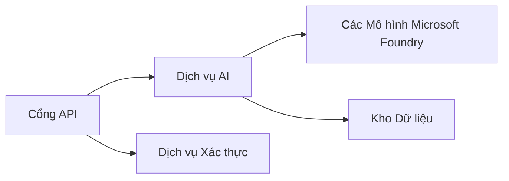
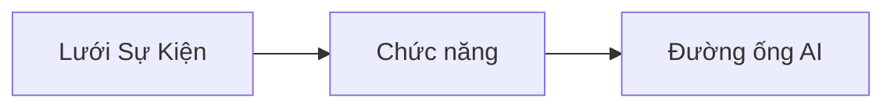

# Chương 8: Các Mẫu Triển Khai Sản Xuất & Doanh Nghiệp

**📚 Khóa học**: [AZD For Beginners](../../README.md) | **⏱️ Thời lượng**: 2-3 giờ | **⭐ Độ khó**: Nâng cao

---

## Tổng quan

Chương này bao gồm các mẫu triển khai sẵn sàng cho doanh nghiệp, gia cố bảo mật, giám sát và tối ưu hóa chi phí cho khối lượng công việc AI trong môi trường sản xuất.

> Đã xác minh với `azd 1.23.12` vào tháng 3 năm 2026.

## Mục tiêu học tập

Sau khi hoàn thành chương này, bạn sẽ:
- Triển khai ứng dụng chịu lỗi đa vùng
- Triển khai các mẫu bảo mật cho doanh nghiệp
- Cấu hình giám sát toàn diện
- Tối ưu hóa chi phí ở quy mô lớn
- Thiết lập pipeline CI/CD với AZD

---

## 📚 Bài học

| # | Bài học | Mô tả | Thời gian |
|---|--------|-------------|------|
| 1 | [Thực hành AI cho Sản xuất](production-ai-practices.md) | Các mẫu triển khai cho doanh nghiệp | 90 phút |

---

## 🚀 Danh sách kiểm tra Sản xuất

- [ ] Triển khai đa vùng để tăng khả năng chịu lỗi
- [ ] Managed identity cho xác thực (không dùng khóa)
- [ ] Application Insights để giám sát
- [ ] Cấu hình ngân sách chi phí và cảnh báo
- [ ] Bật quét bảo mật
- [ ] Tích hợp pipeline CI/CD
- [ ] Kế hoạch phục hồi thảm họa

---

## 🏗️ Mẫu Kiến trúc

### Mẫu 1: Microservices AI


### Mẫu 2: Event-Driven AI


---

## 🔐 Các Thực hành Bảo mật Tốt nhất

```bicep
// Use managed identity
identity: {
  type: 'SystemAssigned'
}

// Private endpoints for AI services
properties: {
  publicNetworkAccess: 'Disabled'
  networkAcls: {
    defaultAction: 'Deny'
  }
}
```

---

## 💰 Tối ưu hóa Chi phí

| Chiến lược | Tiết kiệm |
|----------|---------|
| Thu nhỏ về 0 (Container Apps) | 60-80% |
| Sử dụng tầng tiêu thụ cho môi trường phát triển | 50-70% |
| Tự động điều chỉnh theo lịch | 30-50% |
| Dung lượng đặt trước | 20-40% |

```bash
# Thiết lập cảnh báo ngân sách
az consumption budget create \
  --budget-name "AI-Budget" \
  --amount 500 \
  --category Cost \
  --time-grain Monthly
```

---

## 📊 Cấu hình Giám sát

```bash
# Phát trực tiếp nhật ký
azd monitor --logs

# Kiểm tra Application Insights
azd monitor --overview

# Xem số liệu
az monitor metrics list --resource <resource-id>
```

---

## 🔗 Điều hướng

| Hướng | Chương |
|-----------|---------|
| **Trước** | [Chương 7: Khắc phục sự cố](../chapter-07-troubleshooting/README.md) |
| **Hoàn thành Khóa học** | [Trang Khóa học](../../README.md) |

---

## 📖 Tài nguyên liên quan

- [Hướng dẫn AI Agents](../chapter-02-ai-development/agents.md)
- [Application Insights](../chapter-06-pre-deployment/application-insights.md)
- [Giải pháp Multi-Agent](../chapter-05-multi-agent/README.md)
- [Ví dụ Microservices](../../examples/microservices/README.md)

---

<!-- CO-OP TRANSLATOR DISCLAIMER START -->
**Miễn trừ trách nhiệm**:
Tài liệu này đã được dịch bằng dịch vụ dịch thuật AI [Co-op Translator](https://github.com/Azure/co-op-translator). Mặc dù chúng tôi cố gắng đảm bảo độ chính xác, xin lưu ý rằng các bản dịch tự động có thể chứa lỗi hoặc không chính xác. Tài liệu gốc bằng ngôn ngữ ban đầu nên được coi là nguồn chính thức. Đối với các thông tin quan trọng, khuyến nghị sử dụng bản dịch chuyên nghiệp do con người thực hiện. Chúng tôi không chịu trách nhiệm cho bất kỳ hiểu lầm hoặc diễn giải sai nào phát sinh từ việc sử dụng bản dịch này.
<!-- CO-OP TRANSLATOR DISCLAIMER END -->