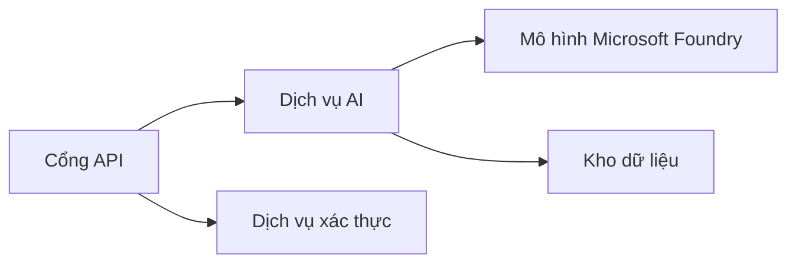
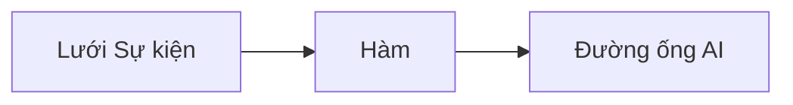

# Chương 8: Sản xuất & Mô hình Doanh nghiệp

**📚 Khóa học**: [AZD cho Người mới bắt đầu](../../README.md) | **⏱️ Thời lượng**: 2-3 giờ | **⭐ Độ phức tạp**: Nâng cao

---

## Tổng quan

Chương này trình bày các mẫu triển khai sẵn sàng cho doanh nghiệp, tăng cường bảo mật, giám sát và tối ưu chi phí cho khối lượng công việc AI trong môi trường sản xuất.

## Mục tiêu học tập

Sau khi hoàn thành chương này, bạn sẽ:
- Triển khai ứng dụng đa vùng có khả năng phục hồi
- Áp dụng các mô hình bảo mật cho doanh nghiệp
- Cấu hình giám sát toàn diện
- Tối ưu chi phí ở quy mô lớn
- Thiết lập pipeline CI/CD với AZD

---

## 📚 Bài học

| # | Bài học | Mô tả | Thời gian |
|---|--------|-------------|------|
| 1 | [Thực hành AI trong Sản xuất](production-ai-practices.md) | Mẫu triển khai cho doanh nghiệp | 90 phút |

---

## 🚀 Danh sách kiểm tra Sản xuất

- [ ] Triển khai đa vùng để đảm bảo khả năng phục hồi
- [ ] Sử dụng managed identity để xác thực (không dùng khóa)
- [ ] Application Insights để giám sát
- [ ] Đặt hạn mức chi phí và cấu hình cảnh báo
- [ ] Bật quét bảo mật
- [ ] Tích hợp pipeline CI/CD
- [ ] Kế hoạch khôi phục thảm họa

---

## 🏗️ Mẫu kiến trúc

### Mẫu 1: Microservices cho AI


### Mẫu 2: AI theo sự kiện


---

## 🔐 Các thực hành tốt nhất về Bảo mật

```bicep
// Use managed identity
identity: {
  type: 'SystemAssigned'
}

// Private endpoints for AI services
properties: {
  publicNetworkAccess: 'Disabled'
  networkAcls: {
    defaultAction: 'Deny'
  }
}
```

---

## 💰 Tối ưu hóa chi phí

| Chiến lược | Tiết kiệm |
|----------|---------|
| Thu nhỏ về 0 (Container Apps) | 60-80% |
| Sử dụng mức tiêu thụ cho môi trường dev | 50-70% |
| Tự động mở rộng theo lịch | 30-50% |
| Dung lượng đặt trước | 20-40% |

```bash
# Đặt cảnh báo ngân sách
az consumption budget create \
  --budget-name "AI-Budget" \
  --amount 500 \
  --category Cost \
  --time-grain Monthly
```

---

## 📊 Thiết lập giám sát

```bash
# Xem nhật ký theo thời gian thực
azd monitor --logs

# Kiểm tra Application Insights
azd monitor

# Xem số liệu
az monitor metrics list --resource <resource-id>
```

---

## 🔗 Điều hướng

| Hướng | Chương |
|-----------|---------|
| **Trước** | [Chương 7: Khắc phục sự cố](../chapter-07-troubleshooting/README.md) |
| **Hoàn thành Khóa học** | [Trang chính Khóa học](../../README.md) |

---

## 📖 Tài nguyên liên quan

- [Hướng dẫn Tác nhân AI](../chapter-02-ai-development/agents.md)
- [Application Insights](../chapter-06-pre-deployment/application-insights.md)
- [Giải pháp đa tác nhân](../chapter-05-multi-agent/README.md)
- [Ví dụ Microservices](../../examples/microservices/README.md)

---

<!-- CO-OP TRANSLATOR DISCLAIMER START -->
**Miễn trừ trách nhiệm**:
Tài liệu này đã được dịch bằng dịch vụ dịch thuật AI [Co-op Translator](https://github.com/Azure/co-op-translator). Mặc dù chúng tôi nỗ lực đảm bảo độ chính xác, xin lưu ý rằng bản dịch tự động có thể chứa lỗi hoặc sai sót. Tài liệu gốc bằng ngôn ngữ nguyên bản nên được coi là nguồn có thẩm quyền. Đối với các thông tin quan trọng, nên sử dụng bản dịch do người dịch chuyên nghiệp thực hiện. Chúng tôi không chịu trách nhiệm cho bất kỳ hiểu lầm hoặc diễn giải sai nào phát sinh từ việc sử dụng bản dịch này.
<!-- CO-OP TRANSLATOR DISCLAIMER END -->