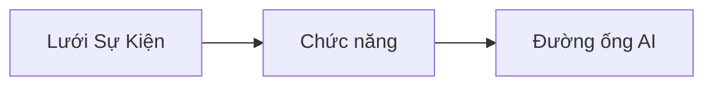

# Chương 8: Mẫu Sản xuất & Doanh nghiệp

**📚 Khóa học**: [AZD Dành cho Người Mới](../../README.md) | **⏱️ Thời lượng**: 2-3 giờ | **⭐ Độ phức tạp**: Nâng cao

---

## Tổng quan

Chương này bao gồm các mẫu triển khai sẵn sàng cho doanh nghiệp, gia cố bảo mật, giám sát và tối ưu chi phí cho khối lượng công việc AI trong môi trường sản xuất.

> Đã xác thực với `azd 1.25.6` vào tháng 6 năm 2026.

## Mục tiêu học tập

Khi hoàn thành chương này, bạn sẽ:
- Triển khai ứng dụng chịu lỗi đa vùng
- Triển khai các mẫu bảo mật cho doanh nghiệp
- Cấu hình giám sát toàn diện
- Tối ưu chi phí ở quy mô lớn
- Thiết lập pipeline CI/CD với AZD

---

## 📚 Bài học

| # | Bài học | Mô tả | Thời gian |
|---|--------|-------------|------|
| 1 | [Production AI Practices](production-ai-practices.md) | Các mẫu triển khai cho doanh nghiệp | 90 phút |

---

## 🚀 Danh sách kiểm tra Sản xuất

- [ ] Triển khai đa vùng để tăng khả năng phục hồi
- [ ] Định danh được quản lý cho xác thực (không dùng khóa)
- [ ] Application Insights để giám sát
- [ ] Cấu hình ngân sách chi phí và cảnh báo
- [ ] Bật quét bảo mật
- [ ] Tích hợp pipeline CI/CD
- [ ] Kế hoạch phục hồi sau thảm họa

---

## 🏗️ Mẫu kiến trúc

### Mẫu 1: Microservices AI


### Mẫu 2: AI hướng sự kiện



---

## 🔐 Thực hành bảo mật tốt nhất

```bicep
// Use managed identity
identity: {
  type: 'SystemAssigned'
}

// Private endpoints for AI services
properties: {
  publicNetworkAccess: 'Disabled'
  networkAcls: {
    defaultAction: 'Deny'
  }
}
```

---

## 💰 Tối ưu chi phí

| Chiến lược | Tiết kiệm |
|----------|---------|
| Tự động scale về 0 (Container Apps) | 60-80% |
| Sử dụng tầng tiêu thụ cho môi trường dev | 50-70% |
| Tự động mở rộng theo lịch | 30-50% |
| Dung lượng đặt trước | 20-40% |

```bash
# Thiết lập cảnh báo ngân sách
az consumption budget create \
  --budget-name "AI-Budget" \
  --amount 500 \
  --category Cost \
  --time-grain Monthly
```

---

## 📊 Cấu hình giám sát

```bash
# Phát trực tiếp nhật ký
azd monitor --logs

# Kiểm tra Application Insights
azd monitor --overview

# Xem số liệu
az monitor metrics list --resource <resource-id>
```

---

## 🔗 Điều hướng

| Hướng | Chương |
|-----------|---------|
| **Trước** | [Chương 7: Khắc phục sự cố](../chapter-07-troubleshooting/README.md) |
| **Hoàn thành Khóa học** | [Trang khóa học](../../README.md) |

---

## 📖 Tài nguyên liên quan

- [AI Agents Guide](../chapter-02-ai-development/agents.md)
- [Application Insights](../chapter-06-pre-deployment/application-insights.md)
- [Multi-Agent Solutions](../chapter-05-multi-agent/README.md)
- [Microservices Example](../../examples/microservices/README.md)

---

<!-- CO-OP TRANSLATOR DISCLAIMER START -->
**Tuyên bố miễn trừ trách nhiệm**:
Tài liệu này đã được dịch bằng dịch vụ dịch thuật AI [Co-op Translator](https://github.com/Azure/co-op-translator). Mặc dù chúng tôi cố gắng đảm bảo độ chính xác, xin lưu ý rằng bản dịch tự động có thể chứa lỗi hoặc sai sót. Tài liệu gốc bằng ngôn ngữ gốc nên được coi là nguồn tin chính thức. Đối với thông tin quan trọng, nên sử dụng dịch vụ dịch thuật chuyên nghiệp bởi con người. Chúng tôi không chịu trách nhiệm về bất kỳ hiểu lầm hoặc giải thích sai nào phát sinh từ việc sử dụng bản dịch này.
<!-- CO-OP TRANSLATOR DISCLAIMER END -->