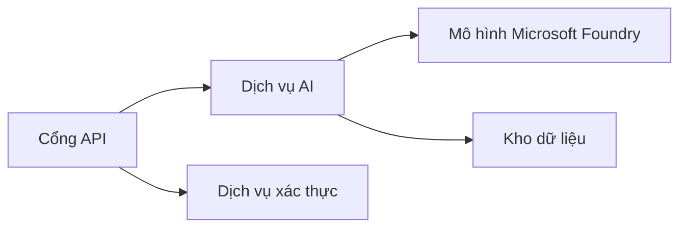
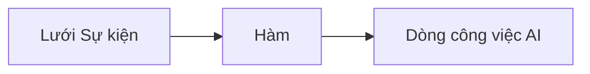

# Chương 8: Các Mô hình Sản xuất & Doanh nghiệp

**📚 Khóa học**: [AZD For Beginners](../../README.md) | **⏱️ Thời lượng**: 2-3 giờ | **⭐ Độ phức tạp**: Nâng cao

---

## Tổng quan

Chương này bao gồm các mô hình triển khai sẵn sàng cho doanh nghiệp, gia cố bảo mật, giám sát và tối ưu hóa chi phí cho khối lượng công việc AI sản xuất.

> Được xác nhận với `azd 1.27.1` vào tháng 7 năm 2026.

## Mục tiêu học tập

Sau khi hoàn thành chương này, bạn sẽ:
- Triển khai ứng dụng nhiều vùng để tăng tính chịu lỗi
- Áp dụng các mô hình bảo mật doanh nghiệp
- Cấu hình giám sát toàn diện
- Tối ưu hóa chi phí ở quy mô lớn
- Thiết lập pipeline CI/CD với AZD

---

## 📚 Bài học

| # | Bài học | Mô tả | Thời gian |
|---|--------|-------------|------|
| 1 | [Thực tiễn AI trong sản xuất](production-ai-practices.md) | Các mô hình triển khai doanh nghiệp | 90 phút |

---

## 🚀 Bảng kiểm tra Sản xuất

- [ ] Triển khai đa vùng để tăng tính chịu lỗi
- [ ] Sử dụng Managed Identity để xác thực (không dùng key)
- [ ] Sử dụng Application Insights để giám sát
- [ ] Cấu hình ngân sách và cảnh báo chi phí
- [ ] Kích hoạt quét bảo mật
- [ ] Tích hợp pipeline CI/CD
- [ ] Kế hoạch khôi phục sau thảm họa

---

## 🏗️ Các Mẫu Kiến trúc

### Mẫu 1: Microservices AI



### Mẫu 2: AI hướng sự kiện



---

## 🔐 Thực hành bảo mật tốt nhất

```bicep
// Use managed identity
identity: {
  type: 'SystemAssigned'
}

// Private endpoints for AI services
properties: {
  publicNetworkAccess: 'Disabled'
  networkAcls: {
    defaultAction: 'Deny'
  }
}
```

---

## 💰 Tối ưu hóa chi phí

| Chiến lược | Tiết kiệm |
|----------|---------|
| Thu nhỏ về 0 (Container Apps) | 60-80% |
| Sử dụng tầng theo nhu cầu cho phát triển | 50-70% |
| Điều chỉnh quy mô theo lịch trình | 30-50% |
| Dự trữ công suất | 20-40% |

```bash
# Thiết lập cảnh báo ngân sách
az consumption budget create \
  --budget-name "AI-Budget" \
  --amount 500 \
  --category Cost \
  --time-grain Monthly
```

---

## 📊 Thiết lập giám sát

```bash
# Phát trực tiếp nhật ký
azd monitor --logs

# Kiểm tra Application Insights
azd monitor --overview

# Xem các chỉ số
az monitor metrics list --resource <resource-id>
```

---

## 🔗 Điều hướng

| Hướng đi | Chương |
|-----------|---------|
| **Trước** | [Chương 7: Xử lý sự cố](../chapter-07-troubleshooting/README.md) |
| **Hoàn thành khoá học** | [Trang chủ khoá học](../../README.md) |

---

## 📖 Tài nguyên liên quan

- [Hướng dẫn AI Agents](../chapter-02-ai-development/agents.md)
- [Application Insights](../chapter-06-pre-deployment/application-insights.md)
- [Giải pháp đa agent](../chapter-05-multi-agent/README.md)
- [Ví dụ Microservices](../../examples/microservices/README.md)

---

<!-- CO-OP TRANSLATOR DISCLAIMER START -->
**Tuyên bố miễn trừ trách nhiệm**:
Tài liệu này đã được dịch bằng dịch vụ dịch thuật AI [Co-op Translator](https://github.com/Azure/co-op-translator). Mặc dù chúng tôi cố gắng đảm bảo độ chính xác, xin lưu ý rằng bản dịch tự động có thể chứa lỗi hoặc sai sót. Tài liệu gốc bằng ngôn ngữ gốc nên được coi là nguồn tin chính thức. Đối với thông tin quan trọng, nên sử dụng dịch vụ dịch thuật chuyên nghiệp bởi con người. Chúng tôi không chịu trách nhiệm về bất kỳ hiểu lầm hoặc giải thích sai nào phát sinh từ việc sử dụng bản dịch này.
<!-- CO-OP TRANSLATOR DISCLAIMER END -->