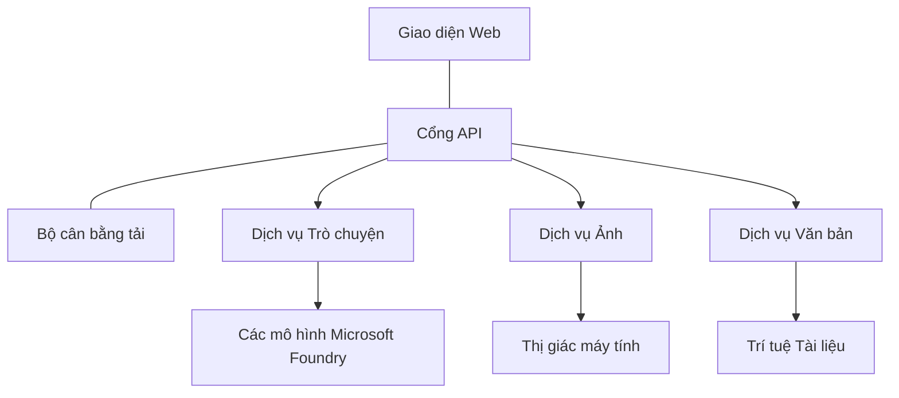

# Thực hành tốt nhất cho khối lượng công việc AI sản xuất với AZD

**Điều hướng Chương:**
- **📚 Trang Khóa học**: [AZD Dành cho Người Mới](../../README.md)
- **📖 Chương Hiện tại**: Chương 8 - Mẫu cho Sản xuất & Doanh nghiệp
- **⬅️ Chương Trước**: [Chương 7: Khắc phục sự cố](../chapter-07-troubleshooting/debugging.md)
- **⬅️ Cũng liên quan**: [Phòng thí nghiệm AI](ai-workshop-lab.md)
- **🎯 Hoàn thành Khóa học**: [AZD Dành cho Người Mới](../../README.md)

## Tổng quan

Hướng dẫn này cung cấp các thực hành tốt nhất toàn diện để triển khai khối lượng công việc AI sẵn sàng cho môi trường sản xuất bằng Azure Developer CLI (AZD). Dựa trên phản hồi từ cộng đồng Microsoft Foundry Discord và các triển khai thực tế của khách hàng, các thực hành này giải quyết những thách thức phổ biến nhất trong các hệ thống AI sản xuất.

## Những thách thức chính được giải quyết

Dựa trên kết quả khảo sát cộng đồng của chúng tôi, đây là những thách thức hàng đầu mà các nhà phát triển gặp phải:

- **45%** gặp khó khăn với triển khai AI đa dịch vụ
- **38%** gặp vấn đề với quản lý thông tin xác thực và bí mật  
- **35%** thấy việc sẵn sàng cho sản xuất và mở rộng quy mô khó khăn
- **32%** cần chiến lược tối ưu hóa chi phí tốt hơn
- **29%** yêu cầu giám sát và khắc phục sự cố được cải thiện

## Các mẫu kiến trúc cho AI sản xuất

### Mẫu 1: Kiến trúc AI Microservices

**Khi nào sử dụng**: Ứng dụng AI phức tạp với nhiều khả năng


**Triển khai AZD**:

```yaml
# azure.yaml
name: enterprise-ai-platform
services:
  web:
    project: ./web
    host: staticwebapp
  api-gateway:
    project: ./api-gateway
    host: containerapp
  chat-service:
    project: ./services/chat
    host: containerapp
  vision-service:
    project: ./services/vision
    host: containerapp
  text-service:
    project: ./services/text
    host: containerapp
```

### Mẫu 2: Xử lý AI theo sự kiện

**Khi nào sử dụng**: Xử lý theo lô, phân tích tài liệu, luồng công việc bất đồng bộ

```bicep
// Event Hub for AI processing pipeline
resource eventHub 'Microsoft.EventHub/namespaces@2023-01-01-preview' = {
  name: eventHubNamespaceName
  location: location
  sku: {
    name: 'Standard'
    tier: 'Standard'
    capacity: 1
  }
}

// Service Bus for reliable message processing
resource serviceBus 'Microsoft.ServiceBus/namespaces@2022-10-01-preview' = {
  name: serviceBusNamespaceName
  location: location
  sku: {
    name: 'Premium'
    tier: 'Premium'
    capacity: 1
  }
}

// Function App for processing
resource functionApp 'Microsoft.Web/sites@2023-01-01' = {
  name: functionAppName
  location: location
  kind: 'functionapp,linux'
  properties: {
    siteConfig: {
      appSettings: [
        {
          name: 'FUNCTIONS_EXTENSION_VERSION'
          value: '~4'
        }
        {
          name: 'AZURE_OPENAI_ENDPOINT'
          value: '@Microsoft.KeyVault(VaultName=${keyVault.name};SecretName=openai-endpoint)'
        }
      ]
    }
  }
}
```

## Cân nhắc về Sức khỏe của Agent AI

Khi một ứng dụng web truyền thống gặp sự cố, các triệu chứng là quen thuộc: một trang không tải, một API trả về lỗi, hoặc một lần triển khai thất bại. Ứng dụng tích hợp AI có thể hỏng theo tất cả các cách đó—nhưng chúng cũng có thể hoạt động sai theo những cách tinh vi hơn mà không tạo ra thông báo lỗi rõ ràng.

Phần này giúp bạn xây dựng mô hình tư duy để giám sát khối lượng công việc AI để bạn biết nên tìm gì khi mọi thứ có vẻ không ổn.

### Sức khỏe Agent khác với Ứng dụng truyền thống như thế nào

Một ứng dụng truyền thống hoặc là hoạt động hoặc không. Một tác nhân AI có thể có vẻ hoạt động nhưng tạo ra kết quả kém. Hãy nghĩ về sức khỏe của tác nhân theo hai lớp:

| Lớp | Cần theo dõi | Nên kiểm tra ở đâu |
|-------|--------------|---------------|
| **Sức khỏe hạ tầng** | Dịch vụ có đang chạy không? Tài nguyên đã được cấp phát chưa? Các điểm cuối có truy cập được không? | `azd monitor`, tình trạng tài nguyên trên Azure Portal, nhật ký container/ứng dụng |
| **Sức khỏe hành vi** | Tác nhân phản hồi chính xác không? Phản hồi có kịp thời không? Mô hình có được gọi đúng cách không? | traces của Application Insights, số liệu độ trễ gọi mô hình, nhật ký chất lượng phản hồi |

Sức khỏe hạ tầng thì quen thuộc—nó giống như đối với bất kỳ ứng dụng azd nào. Sức khỏe hành vi là lớp mới mà các khối lượng công việc AI đưa vào.

### Nên kiểm tra ở đâu khi ứng dụng AI không hoạt động như mong đợi

Nếu ứng dụng AI của bạn không tạo ra kết quả như mong đợi, đây là danh sách kiểm tra khái niệm:

1. **Bắt đầu với những điều cơ bản.** Ứng dụng có đang chạy không? Nó có thể truy cập các phụ thuộc không? Kiểm tra `azd monitor` và tình trạng tài nguyên như bạn vẫn làm với bất kỳ ứng dụng nào.
2. **Kiểm tra kết nối mô hình.** Ứng dụng của bạn có đang gọi mô hình AI thành công không? Các cuộc gọi mô hình bị lỗi hoặc hết thời gian chờ là nguyên nhân phổ biến nhất của sự cố ứng dụng AI và sẽ xuất hiện trong nhật ký ứng dụng của bạn.
3. **Xem những gì mô hình nhận được.** Phản hồi AI phụ thuộc vào đầu vào (prompt và bất kỳ ngữ cảnh được truy xuất nào). Nếu đầu ra sai, đầu vào thường là nguyên nhân. Kiểm tra xem ứng dụng của bạn có đang gửi dữ liệu đúng tới mô hình không.
4. **Xem lại độ trễ phản hồi.** Các cuộc gọi tới mô hình AI chậm hơn so với các cuộc gọi API thông thường. Nếu ứng dụng của bạn cảm thấy chậm, kiểm tra xem thời gian phản hồi của mô hình có tăng hay không—điều này có thể báo hiệu bị giới hạn băng thông, giới hạn công suất, hoặc tắc nghẽn ở cấp vùng.
5. **Theo dõi các tín hiệu chi phí.** Sự tăng đột biến bất ngờ trong việc sử dụng token hoặc cuộc gọi API có thể cho thấy vòng lặp, prompt cấu hình sai, hoặc thử lại quá nhiều lần.

Bạn không cần phải thành thạo các công cụ quan sát ngay lập tức. Điều quan trọng là các ứng dụng AI có một lớp hành vi bổ sung cần giám sát, và cơ chế giám sát tích hợp của azd (`azd monitor`) cung cấp cho bạn điểm bắt đầu để điều tra cả hai lớp.

---

## Những thực hành bảo mật tốt nhất

### 1. Mô hình Bảo mật Zero-Trust

**Chiến lược triển khai**:
- Không có giao tiếp dịch vụ-nhờ dịch vụ nếu không có xác thực
- Tất cả các cuộc gọi API sử dụng managed identities
- Cô lập mạng với private endpoints
- Kiểm soát truy cập theo nguyên tắc ít đặc quyền nhất

```bicep
// Managed Identity for each service
resource chatServiceIdentity 'Microsoft.ManagedIdentity/userAssignedIdentities@2023-01-31' = {
  name: 'chat-service-identity'
  location: location
}

// Role assignments with minimal permissions
resource openAIUserRole 'Microsoft.Authorization/roleAssignments@2022-04-01' = {
  scope: openAIAccount
  name: guid(openAIAccount.id, chatServiceIdentity.id, openAIUserRoleDefinitionId)
  properties: {
    roleDefinitionId: subscriptionResourceId('Microsoft.Authorization/roleDefinitions', '5e0bd9bd-7b93-4f28-af87-19fc36ad61bd')
    principalId: chatServiceIdentity.properties.principalId
    principalType: 'ServicePrincipal'
  }
}
```

### 2. Quản lý bí mật an toàn

**Mẫu tích hợp Key Vault**:

```bicep
// Key Vault with proper access policies
resource keyVault 'Microsoft.KeyVault/vaults@2023-02-01' = {
  name: keyVaultName
  location: location
  properties: {
    tenantId: tenant().tenantId
    sku: {
      family: 'A'
      name: 'premium'  // Use premium for production
    }
    enableRbacAuthorization: true  // Use RBAC instead of access policies
    enablePurgeProtection: true    // Prevent accidental deletion
    enableSoftDelete: true
    softDeleteRetentionInDays: 90
  }
}

// Store all AI service credentials
resource openAIKeySecret 'Microsoft.KeyVault/vaults/secrets@2023-02-01' = {
  parent: keyVault
  name: 'openai-api-key'
  properties: {
    value: openAIAccount.listKeys().key1
    attributes: {
      enabled: true
    }
  }
}
```

### 3. Bảo mật mạng

**Cấu hình Private Endpoint**:

```bicep
// Virtual Network for AI services
resource virtualNetwork 'Microsoft.Network/virtualNetworks@2023-04-01' = {
  name: vnetName
  location: location
  properties: {
    addressSpace: {
      addressPrefixes: ['10.0.0.0/16']
    }
    subnets: [
      {
        name: 'ai-services-subnet'
        properties: {
          addressPrefix: '10.0.1.0/24'
          privateEndpointNetworkPolicies: 'Disabled'
        }
      }
      {
        name: 'app-services-subnet'
        properties: {
          addressPrefix: '10.0.2.0/24'
          delegations: [
            {
              name: 'Microsoft.Web/serverFarms'
              properties: {
                serviceName: 'Microsoft.Web/serverFarms'
              }
            }
          ]
        }
      }
    ]
  }
}

// Private endpoints for all AI services
resource openAIPrivateEndpoint 'Microsoft.Network/privateEndpoints@2023-04-01' = {
  name: '${openAIAccountName}-pe'
  location: location
  properties: {
    subnet: {
      id: virtualNetwork.properties.subnets[0].id
    }
    privateLinkServiceConnections: [
      {
        name: 'openai-connection'
        properties: {
          privateLinkServiceId: openAIAccount.id
          groupIds: ['account']
        }
      }
    ]
  }
}
```

## Hiệu năng và Mở rộng

### 1. Chiến lược tự động mở rộng

**Tự động mở rộng cho Container Apps**:

```bicep
resource containerApp 'Microsoft.App/containerApps@2023-05-01' = {
  name: containerAppName
  location: location
  properties: {
    configuration: {
      ingress: {
        external: true
        targetPort: 8000
        transport: 'http'
      }
    }
    template: {
      scale: {
        minReplicas: 2  // Always have 2 instances minimum
        maxReplicas: 50 // Scale up to 50 for high load
        rules: [
          {
            name: 'http-scaling'
            http: {
              metadata: {
                concurrentRequests: '20'  // Scale when >20 concurrent requests
              }
            }
          }
          {
            name: 'cpu-scaling'
            custom: {
              type: 'cpu'
              metadata: {
                type: 'Utilization'
                value: '70'  // Scale when CPU >70%
              }
            }
          }
        ]
      }
    }
  }
}
```

### 2. Chiến lược bộ nhớ đệm

**Redis Cache cho phản hồi AI**:

```bicep
// Redis Premium for production workloads
resource redisCache 'Microsoft.Cache/redis@2023-04-01' = {
  name: redisCacheName
  location: location
  properties: {
    sku: {
      name: 'Premium'
      family: 'P'
      capacity: 1
    }
    enableNonSslPort: false
    minimumTlsVersion: '1.2'
    redisConfiguration: {
      'maxmemory-policy': 'allkeys-lru'
    }
    // Enable clustering for high availability
    redisVersion: '6.0'
    shardCount: 2
  }
}

// Cache configuration in application
var cacheConnectionString = '${redisCache.properties.hostName}:6380,password=${redisCache.listKeys().primaryKey},ssl=True,abortConnect=False'
```

### 3. Cân bằng tải và quản lý lưu lượng

**Application Gateway với WAF**:

```bicep
// Application Gateway with Web Application Firewall
resource applicationGateway 'Microsoft.Network/applicationGateways@2023-04-01' = {
  name: appGatewayName
  location: location
  properties: {
    sku: {
      name: 'WAF_v2'
      tier: 'WAF_v2'
      capacity: 2
    }
    webApplicationFirewallConfiguration: {
      enabled: true
      firewallMode: 'Prevention'
      ruleSetType: 'OWASP'
      ruleSetVersion: '3.2'
    }
    // Backend pools for AI services
    backendAddressPools: [
      {
        name: 'ai-services-pool'
        properties: {
          backendAddresses: [
            {
              fqdn: '${containerApp.properties.configuration.ingress.fqdn}'
            }
          ]
        }
      }
    ]
  }
}
```

## 💰 Tối ưu hóa chi phí

### 1. Chọn kích thước tài nguyên phù hợp

**Cấu hình theo môi trường**:

```bash
# Môi trường phát triển
azd env new development
azd env set AZURE_OPENAI_SKU "S0"
azd env set AZURE_OPENAI_CAPACITY 10
azd env set AZURE_SEARCH_SKU "basic"
azd env set CONTAINER_CPU 0.5
azd env set CONTAINER_MEMORY 1.0

# Môi trường sản xuất
azd env new production
azd env set AZURE_OPENAI_SKU "S0"
azd env set AZURE_OPENAI_CAPACITY 100
azd env set AZURE_SEARCH_SKU "standard"
azd env set CONTAINER_CPU 2.0
azd env set CONTAINER_MEMORY 4.0
```

### 2. Giám sát chi phí và ngân sách

```bicep
// Cost management and budgets
resource budget 'Microsoft.Consumption/budgets@2023-05-01' = {
  name: 'ai-workload-budget'
  properties: {
    timePeriod: {
      startDate: '2024-01-01'
      endDate: '2024-12-31'
    }
    timeGrain: 'Monthly'
    amount: 2000  // $2000 monthly budget
    category: 'Cost'
    notifications: {
      warning: {
        enabled: true
        operator: 'GreaterThan'
        threshold: 80
        contactEmails: [
          'finance@company.com'
          'engineering@company.com'
        ]
        contactRoles: [
          'Owner'
          'Contributor'
        ]
      }
      critical: {
        enabled: true
        operator: 'GreaterThan'
        threshold: 95
        contactEmails: [
          'cto@company.com'
        ]
      }
    }
  }
}
```

### 3. Tối ưu hóa sử dụng token

**Quản lý chi phí OpenAI**:

```typescript
// Tối ưu hóa token ở cấp ứng dụng
class TokenOptimizer {
  private readonly maxTokens = 4000;
  private readonly reserveTokens = 500;
  
  optimizePrompt(userInput: string, context: string): string {
    const availableTokens = this.maxTokens - this.reserveTokens;
    const estimatedTokens = this.estimateTokens(userInput + context);
    
    if (estimatedTokens > availableTokens) {
      // Cắt ngữ cảnh, không cắt đầu vào của người dùng
      context = this.truncateContext(context, availableTokens - this.estimateTokens(userInput));
    }
    
    return `${context}\n\nUser: ${userInput}`;
  }
  
  private estimateTokens(text: string): number {
    // Ước lượng sơ bộ: 1 token ≈ 4 ký tự
    return Math.ceil(text.length / 4);
  }
}
```

## Giám sát và Khả năng quan sát

### 1. Toàn diện với Application Insights

```bicep
// Application Insights with advanced features
resource applicationInsights 'Microsoft.Insights/components@2020-02-02' = {
  name: applicationInsightsName
  location: location
  kind: 'web'
  properties: {
    Application_Type: 'web'
    WorkspaceResourceId: logAnalyticsWorkspace.id
    SamplingPercentage: 100  // Full sampling for AI apps
    DisableIpMasking: false  // Enable for security
  }
}

// Custom metrics for AI operations
resource aiMetricAlerts 'Microsoft.Insights/metricAlerts@2018-03-01' = {
  name: 'ai-high-error-rate'
  location: 'global'
  properties: {
    description: 'Alert when AI service error rate is high'
    severity: 2
    enabled: true
    scopes: [
      applicationInsights.id
    ]
    evaluationFrequency: 'PT1M'
    windowSize: 'PT5M'
    criteria: {
      'odata.type': 'Microsoft.Azure.Monitor.SingleResourceMultipleMetricCriteria'
      allOf: [
        {
          name: 'high-error-rate'
          metricName: 'requests/failed'
          operator: 'GreaterThan'
          threshold: 10
          timeAggregation: 'Count'
        }
      ]
    }
  }
}
```

### 2. Giám sát đặc thù cho AI

**Bảng điều khiển tùy chỉnh cho các chỉ số AI**:

```json
// Dashboard configuration for AI workloads
{
  "dashboard": {
    "name": "AI Application Monitoring",
    "tiles": [
      {
        "name": "OpenAI Request Volume",
        "query": "requests | where name contains 'openai' | summarize count() by bin(timestamp, 5m)"
      },
      {
        "name": "AI Response Latency",
        "query": "requests | where name contains 'openai' | summarize avg(duration) by bin(timestamp, 5m)"
      },
      {
        "name": "Token Usage",
        "query": "customMetrics | where name == 'openai_tokens_used' | summarize sum(value) by bin(timestamp, 1h)"
      },
      {
        "name": "Cost per Hour",
        "query": "customMetrics | where name == 'openai_cost' | summarize sum(value) by bin(timestamp, 1h)"
      }
    ]
  }
}
```

### 3. Kiểm tra sức khỏe và giám sát thời gian hoạt động

```bicep
// Application Insights availability tests
resource availabilityTest 'Microsoft.Insights/webtests@2022-06-15' = {
  name: 'ai-app-availability-test'
  location: location
  tags: {
    'hidden-link:${applicationInsights.id}': 'Resource'
  }
  properties: {
    SyntheticMonitorId: 'ai-app-availability-test'
    Name: 'AI Application Availability Test'
    Description: 'Tests AI application endpoints'
    Enabled: true
    Frequency: 300  // 5 minutes
    Timeout: 120    // 2 minutes
    Kind: 'ping'
    Locations: [
      {
        Id: 'us-east-2-azr'
      }
      {
        Id: 'us-west-2-azr'
      }
    ]
    Configuration: {
      WebTest: '''
        <WebTest Name="AI Health Check" 
                 Id="8d2de8d2-a2b0-4c2e-9a0d-8f9c9a0b8c8d" 
                 Enabled="True" 
                 CssProjectStructure="" 
                 CssIteration="" 
                 Timeout="120" 
                 WorkItemIds="" 
                 xmlns="http://microsoft.com/schemas/VisualStudio/TeamTest/2010" 
                 Description="" 
                 CredentialUserName="" 
                 CredentialPassword="" 
                 PreAuthenticate="True" 
                 Proxy="default" 
                 StopOnError="False" 
                 RecordedResultFile="" 
                 ResultsLocale="">
          <Items>
            <Request Method="GET" 
                     Guid="a5f10126-e4cd-570d-961c-cea43999a200" 
                     Version="1.1" 
                     Url="${webApp.properties.defaultHostName}/health" 
                     ThinkTime="0" 
                     Timeout="120" 
                     ParseDependentRequests="True" 
                     FollowRedirects="True" 
                     RecordResult="True" 
                     Cache="False" 
                     ResponseTimeGoal="0" 
                     Encoding="utf-8" 
                     ExpectedHttpStatusCode="200" 
                     ExpectedResponseUrl="" 
                     ReportingName="" 
                     IgnoreHttpStatusCode="False" />
          </Items>
        </WebTest>
      '''
    }
  }
}
```

## Phục hồi thảm họa và Tính khả dụng cao

### 1. Triển khai đa khu vực

```yaml
# azure.yaml - Multi-region configuration
name: ai-app-multiregion
services:
  api-primary:
    project: ./api
    host: containerapp
    env:
      - AZURE_REGION=eastus
  api-secondary:
    project: ./api
    host: containerapp
    env:
      - AZURE_REGION=westus2
```

```bicep
// Traffic Manager for global load balancing
resource trafficManager 'Microsoft.Network/trafficManagerProfiles@2022-04-01' = {
  name: trafficManagerProfileName
  location: 'global'
  properties: {
    profileStatus: 'Enabled'
    trafficRoutingMethod: 'Priority'
    dnsConfig: {
      relativeName: trafficManagerProfileName
      ttl: 30
    }
    monitorConfig: {
      protocol: 'HTTPS'
      port: 443
      path: '/health'
      intervalInSeconds: 30
      toleratedNumberOfFailures: 3
      timeoutInSeconds: 10
    }
    endpoints: [
      {
        name: 'primary-endpoint'
        type: 'Microsoft.Network/trafficManagerProfiles/azureEndpoints'
        properties: {
          targetResourceId: primaryAppService.id
          endpointStatus: 'Enabled'
          priority: 1
        }
      }
      {
        name: 'secondary-endpoint'
        type: 'Microsoft.Network/trafficManagerProfiles/azureEndpoints'
        properties: {
          targetResourceId: secondaryAppService.id
          endpointStatus: 'Enabled'
          priority: 2
        }
      }
    ]
  }
}
```

### 2. Sao lưu và khôi phục dữ liệu

```bicep
// Backup configuration for critical data
resource backupVault 'Microsoft.DataProtection/backupVaults@2023-05-01' = {
  name: backupVaultName
  location: location
  identity: {
    type: 'SystemAssigned'
  }
  properties: {
    storageSettings: [
      {
        datastoreType: 'VaultStore'
        type: 'LocallyRedundant'
      }
    ]
  }
}

// Backup policy for AI models and data
resource backupPolicy 'Microsoft.DataProtection/backupVaults/backupPolicies@2023-05-01' = {
  parent: backupVault
  name: 'ai-data-backup-policy'
  properties: {
    policyRules: [
      {
        backupParameters: {
          backupType: 'Full'
          objectType: 'AzureBackupParams'
        }
        trigger: {
          schedule: {
            repeatingTimeIntervals: [
              'R/2024-01-01T02:00:00+00:00/P1D'  // Daily at 2 AM
            ]
          }
          objectType: 'ScheduleBasedTriggerContext'
        }
        dataStore: {
          datastoreType: 'VaultStore'
          objectType: 'DataStoreInfoBase'
        }
        name: 'BackupDaily'
        objectType: 'AzureBackupRule'
      }
    ]
  }
}
```

## Tích hợp DevOps và CI/CD

### 1. Luồng công việc GitHub Actions

```yaml
# .github/workflows/deploy-ai-app.yml
name: Deploy AI Application

on:
  push:
    branches: [main]
  pull_request:
    branches: [main]

jobs:
  test:
    runs-on: ubuntu-latest
    steps:
      - uses: actions/checkout@v4
      
      - name: Setup Python
        uses: actions/setup-python@v4
        with:
          python-version: '3.11'
          
      - name: Install dependencies
        run: |
          pip install -r requirements.txt
          pip install pytest
          
      - name: Run tests
        run: pytest tests/
        
      - name: AI Safety Tests
        run: |
          python scripts/test_ai_safety.py
          python scripts/validate_prompts.py

  deploy-staging:
    needs: test
    if: github.event_name == 'pull_request'
    runs-on: ubuntu-latest
    steps:
      - uses: actions/checkout@v4
      
      - name: Setup AZD
        uses: Azure/setup-azd@v2
        
      - name: Login to Azure
        uses: azure/login@v1
        with:
          creds: ${{ secrets.AZURE_CREDENTIALS }}
          
      - name: Deploy to Staging
        run: |
          azd env select staging
          azd deploy

  deploy-production:
    needs: test
    if: github.ref == 'refs/heads/main'
    runs-on: ubuntu-latest
    steps:
      - uses: actions/checkout@v4
      
      - name: Setup AZD
        uses: Azure/setup-azd@v2
        
      - name: Login to Azure
        uses: azure/login@v1
        with:
          creds: ${{ secrets.AZURE_CREDENTIALS }}
          
      - name: Deploy to Production
        run: |
          azd env select production
          azd deploy
          
      - name: Run Production Health Checks
        run: |
          python scripts/health_check.py --env production
```

### 2. Xác thực hạ tầng

```bash
# scripts/validate_infrastructure.sh
#!/bin/bash

echo "Validating AI infrastructure deployment..."

# Kiểm tra xem tất cả các dịch vụ cần thiết có đang chạy hay không
services=("openai" "search" "storage" "keyvault")
for service in "${services[@]}"; do
    echo "Checking $service..."
    if ! az resource list --resource-type "Microsoft.CognitiveServices/accounts" --query "[?contains(name, '$service')]" -o tsv; then
        echo "ERROR: $service not found"
        exit 1
    fi
done

# Xác thực việc triển khai mô hình OpenAI
echo "Validating OpenAI model deployments..."
models=$(az cognitiveservices account deployment list --name $AZURE_OPENAI_NAME --resource-group $AZURE_RESOURCE_GROUP --query "[].name" -o tsv)
if [[ ! $models == *"gpt-4.1-mini"* ]]; then
  echo "ERROR: Required model gpt-4.1-mini not deployed"
    exit 1
fi

# Kiểm tra kết nối dịch vụ AI
echo "Testing AI service connectivity..."
python scripts/test_connectivity.py

echo "Infrastructure validation completed successfully!"
```

## Danh sách kiểm tra sẵn sàng cho sản xuất

### Bảo mật ✅
- [ ] Tất cả dịch vụ sử dụng managed identities
- [ ] Bí mật được lưu trữ trong Key Vault
- [ ] Private endpoints đã được cấu hình
- [ ] Network security groups đã được triển khai
- [ ] RBAC với nguyên tắc ít đặc quyền nhất
- [ ] WAF được bật trên các điểm cuối công khai

### Hiệu năng ✅
- [ ] Tự động mở rộng đã cấu hình
- [ ] Bộ nhớ đệm đã triển khai
- [ ] Cân bằng tải đã thiết lập
- [ ] CDN cho nội dung tĩnh
- [ ] Pool kết nối cơ sở dữ liệu
- [ ] Tối ưu hóa sử dụng token

### Giám sát ✅
- [ ] Application Insights đã cấu hình
- [ ] Các chỉ số tùy chỉnh đã định nghĩa
- [ ] Các quy tắc cảnh báo đã thiết lập
- [ ] Bảng điều khiển đã tạo
- [ ] Kiểm tra sức khỏe đã triển khai
- [ ] Chính sách lưu trữ nhật ký

### Độ tin cậy ✅
- [ ] Triển khai đa khu vực
- [ ] Kế hoạch sao lưu và khôi phục
- [ ] Circuit breakers đã triển khai
- [ ] Chính sách thử lại đã cấu hình
- [ ] Suy thoái có kiểm soát (graceful degradation)
- [ ] Các điểm cuối kiểm tra sức khỏe

### Quản lý chi phí ✅
- [ ] Cảnh báo ngân sách đã cấu hình
- [ ] Chọn kích thước tài nguyên phù hợp
- [ ] Áp dụng chiết khấu dev/test
- [ ] Mua reserved instances
- [ ] Bảng điều khiển giám sát chi phí
- [ ] Đánh giá chi phí định kỳ

### Tuân thủ ✅
- [ ] Yêu cầu lưu trú dữ liệu được đáp ứng
- [ ] Ghi nhật ký kiểm toán đã bật
- [ ] Chính sách tuân thủ đã áp dụng
- [ ] Các chuẩn bảo mật được triển khai
- [ ] Đánh giá bảo mật định kỳ
- [ ] Kế hoạch phản ứng sự cố

## Tiêu chuẩn hiệu năng

### Các chỉ số điển hình cho môi trường sản xuất

| Chỉ số | Mục tiêu | Giám sát |
|--------|--------|------------|
| **Thời gian phản hồi** | < 2 seconds | Application Insights |
| **Khả dụng** | 99.9% | Uptime monitoring |
| **Tỷ lệ lỗi** | < 0.1% | Application logs |
| **Sử dụng token** | < $500/month | Cost management |
| **Người dùng đồng thời** | 1000+ | Load testing |
| **Thời gian khôi phục** | < 1 hour | Disaster recovery tests |

### Kiểm thử tải

```bash
# Kịch bản kiểm tra tải cho các ứng dụng AI
python scripts/load_test.py \
  --endpoint https://your-ai-app.azurewebsites.net \
  --concurrent-users 100 \
  --duration 300 \
  --ramp-up 60
```

## 🤝 Thực hành tốt nhất từ cộng đồng

Dựa trên phản hồi từ cộng đồng Microsoft Foundry Discord:

### Các khuyến nghị hàng đầu từ cộng đồng:

1. **Bắt đầu nhỏ, mở rộng dần**: Bắt đầu với SKU cơ bản và mở rộng dựa trên mức sử dụng thực tế
2. **Giám sát mọi thứ**: Thiết lập giám sát toàn diện ngay từ ngày đầu
3. **Tự động hóa bảo mật**: Sử dụng hạ tầng như mã để đảm bảo bảo mật nhất quán
4. **Kiểm thử kỹ lưỡng**: Bao gồm kiểm thử đặc thù cho AI trong pipeline của bạn
5. **Lập kế hoạch chi phí**: Giám sát sử dụng token và thiết lập cảnh báo ngân sách sớm

### Những sai lầm phổ biến cần tránh:

- ❌ Lưu cứng API key trong mã
- ❌ Không thiết lập giám sát đúng cách
- ❌ Phớt lờ tối ưu hóa chi phí
- ❌ Không kiểm thử các kịch bản lỗi
- ❌ Triển khai mà không có kiểm tra sức khỏe

## Lệnh AZD AI CLI và Tiện ích mở rộng

AZD bao gồm một tập hợp ngày càng mở rộng các lệnh và tiện ích mở rộng đặc thù cho AI giúp đơn giản hóa các luồng công việc AI trong môi trường sản xuất. Các công cụ này kết nối khoảng cách giữa phát triển cục bộ và triển khai sản xuất cho khối lượng công việc AI.

### Tiện ích mở rộng AZD cho AI

AZD sử dụng hệ thống tiện ích mở rộng để thêm các khả năng đặc thù cho AI. Cài đặt và quản lý tiện ích mở rộng với:

```bash
# Liệt kê tất cả các phần mở rộng có sẵn (bao gồm cả AI)
azd extension list

# Kiểm tra chi tiết phần mở rộng đã cài đặt
azd extension show azure.ai.agents

# Cài đặt phần mở rộng Foundry Agents
azd extension install azure.ai.agents

# Cài đặt phần mở rộng tinh chỉnh
azd extension install azure.ai.finetune

# Cài đặt phần mở rộng mô hình tùy chỉnh
azd extension install azure.ai.models

# Nâng cấp tất cả các phần mở rộng đã cài đặt
azd extension upgrade --all
```

**Các tiện ích mở rộng AI hiện có:**

| Tiện ích | Mục đích | Trạng thái |
|-----------|---------|--------|
| `azure.ai.agents` | Quản lý Foundry Agent Service | Xem trước |
| `azure.ai.finetune` | Fine-tuning mô hình Foundry | Xem trước |
| `azure.ai.models` | Mô hình tùy chỉnh Foundry | Xem trước |
| `azure.coding-agent` | Cấu hình tác nhân hỗ trợ viết mã | Sẵn có |

### Khởi tạo Dự án Agent với `azd ai agent init`

Lệnh `azd ai agent init` tạo bộ khung dự án agent sẵn sàng cho môi trường sản xuất tích hợp với Microsoft Foundry Agent Service:

```bash
# Khởi tạo một dự án agent mới từ manifest của agent
azd ai agent init -m <manifest-path-or-uri>

# Khởi tạo và nhắm tới một dự án Foundry cụ thể
azd ai agent init -m agent-manifest.yaml --project-id <foundry-project-id>

# Khởi tạo với một thư mục nguồn tùy chỉnh
azd ai agent init -m agent-manifest.yaml --src ./agents/my-agent

# Nhắm tới Container Apps làm máy chủ lưu trữ
azd ai agent init -m agent-manifest.yaml --host containerapp
```

**Các cờ chính:**

| Cờ | Mô tả |
|------|-------------|
| `-m, --manifest` | Đường dẫn hoặc URI tới manifest của agent để thêm vào dự án của bạn |
| `-p, --project-id` | ID Dự án Microsoft Foundry hiện có cho môi trường azd của bạn |
| `-s, --src` | Thư mục để tải định nghĩa agent (mặc định là `src/<agent-id>`) |
| `--host` | Ghi đè host mặc định (ví dụ: `containerapp`) |
| `-e, --environment` | Môi trường azd để sử dụng |

**Mẹo cho môi trường sản xuất**: Sử dụng `--project-id` để kết nối trực tiếp với dự án Foundry hiện có, giữ mã agent và tài nguyên đám mây của bạn liên kết ngay từ đầu.

### Giao thức Ngữ cảnh Mô hình (MCP) với `azd mcp`

AZD bao gồm hỗ trợ MCP server tích hợp (Alpha), cho phép các tác nhân AI và công cụ tương tác với tài nguyên Azure của bạn thông qua một giao thức chuẩn:

```bash
# Khởi động máy chủ MCP cho dự án của bạn
azd mcp start

# Xem lại các quy tắc đồng ý hiện tại của Copilot cho việc thực thi công cụ
azd copilot consent list
```

Máy chủ MCP phơi bày ngữ cảnh dự án azd của bạn—các môi trường, dịch vụ và tài nguyên Azure—cho các công cụ phát triển được hỗ trợ bởi AI. Điều này cho phép:

- **Triển khai được hỗ trợ bởi AI**: Cho phép các tác nhân viết mã truy vấn trạng thái dự án của bạn và kích hoạt triển khai
- **Khám phá tài nguyên**: Công cụ AI có thể phát hiện những tài nguyên Azure mà dự án của bạn sử dụng
- **Quản lý môi trường**: Các tác nhân có thể chuyển đổi giữa các môi trường dev/staging/production

### Tạo hạ tầng với `azd infra generate`

Đối với khối lượng công việc AI sản xuất, bạn có thể sinh và tùy chỉnh Infrastructure as Code thay vì dựa vào việc cấp phát tự động:

```bash
# Tạo các tệp Bicep/Terraform từ định nghĩa dự án của bạn
azd infra generate
```

Điều này ghi IaC ra đĩa để bạn có thể:
- Rà soát và kiểm toán hạ tầng trước khi triển khai
- Thêm các chính sách bảo mật tùy chỉnh (quy tắc mạng, private endpoints)
- Tích hợp với quy trình kiểm duyệt IaC hiện có
- Kiểm soát phiên bản các thay đổi hạ tầng tách biệt khỏi mã ứng dụng

### Hooks vòng đời sản xuất

Các hook AZD cho phép bạn chèn logic tùy chỉnh ở mọi giai đoạn của vòng đời triển khai—điều quan trọng cho các luồng công việc AI trong môi trường sản xuất:

```yaml
# azure.yaml - Production hooks example
name: ai-production-app
hooks:
  preprovision:
    shell: sh
    run: scripts/validate-quotas.sh    # Check AI model quota before provisioning
  postprovision:
    shell: sh
    run: scripts/configure-networking.sh  # Set up private endpoints
  predeploy:
    shell: sh
    run: scripts/run-ai-safety-tests.sh  # Run prompt safety checks
  postdeploy:
    shell: sh
    run: scripts/smoke-test.sh           # Verify agent responses post-deploy
services:
  agent-api:
    project: ./src/agent
    host: containerapp
    hooks:
      predeploy:
        shell: sh
        run: scripts/validate-model-access.sh  # Per-service hook
```

```bash
# Chạy một hook cụ thể thủ công trong quá trình phát triển
azd hooks run predeploy
```

**Các hook đề xuất cho khối lượng công việc AI trong môi trường sản xuất:**

| Hook | Trường hợp sử dụng |
|------|----------|
| `preprovision` | Xác thực hạn mức subscription cho công suất mô hình AI |
| `postprovision` | Cấu hình private endpoints, triển khai trọng số mô hình |
| `predeploy` | Chạy kiểm tra an toàn AI, xác thực mẫu lời nhắc (prompt templates) |
| `postdeploy` | Thử nghiệm khói phản hồi của agent, xác minh kết nối mô hình |

### Cấu hình đường ống CI/CD

Sử dụng `azd pipeline config` để kết nối dự án của bạn với GitHub Actions hoặc Azure Pipelines với xác thực Azure an toàn:

```bash
# Cấu hình pipeline CI/CD (tương tác)
azd pipeline config

# Cấu hình với nhà cung cấp cụ thể
azd pipeline config --provider github
```

Lệnh này:
- Tạo một service principal với quyền ít nhất cần thiết
- Cấu hình federated credentials (không lưu trữ bí mật)
- Tạo hoặc cập nhật tệp định nghĩa pipeline của bạn
- Đặt các biến môi trường cần thiết trong hệ thống CI/CD của bạn

**Luồng công việc sản xuất với cấu hình pipeline:**

```bash
# 1. Thiết lập môi trường sản xuất
azd env new production
azd env set AZURE_OPENAI_CAPACITY 100

# 2. Cấu hình pipeline
azd pipeline config --provider github

# 3. Pipeline chạy azd deploy mỗi khi có push lên nhánh main
```

### Thêm thành phần với `azd add`

Tăng dần thêm các dịch vụ Azure vào dự án hiện có:

```bash
# Thêm một thành phần dịch vụ mới một cách tương tác
azd add
```

Điều này đặc biệt hữu ích để mở rộng các ứng dụng AI cho môi trường sản xuất—ví dụ, thêm dịch vụ tìm kiếm vector, một điểm cuối agent mới, hoặc một thành phần giám sát vào triển khai hiện có.

## Tài nguyên bổ sung
- **Azure Well-Architected Framework**: [Hướng dẫn khối lượng công việc AI](https://learn.microsoft.com/azure/well-architected/ai/)
- **Microsoft Foundry Documentation**: [Tài liệu chính thức](https://learn.microsoft.com/azure/ai-studio/)
- **Mẫu cộng đồng**: [Azure Samples](https://github.com/Azure-Samples)
- **Cộng đồng Discord**: [#kênh Azure](https://discord.gg/microsoft-azure)
- **Agent Skills for Azure**: [microsoft/github-copilot-for-azure trên skills.sh](https://skills.sh/microsoft/github-copilot-for-azure) - 37 kỹ năng agent mở cho Azure AI, Foundry, triển khai, tối ưu hóa chi phí, và chẩn đoán. Cài đặt trong trình soạn thảo của bạn:
  ```bash
  npx skills add microsoft/github-copilot-for-azure
  ```

---

**Điều hướng chương:**
- **📚 Trang khóa học**: [AZD For Beginners](../../README.md)
- **📖 Chương hiện tại**: Chương 8 - Các mẫu cho Sản xuất & Doanh nghiệp
- **⬅️ Chương trước**: [Chương 7: Gỡ lỗi](../chapter-07-troubleshooting/debugging.md)
- **⬅️ Cũng liên quan**: [AI Workshop Lab](ai-workshop-lab.md)
- **� Hoàn thành khóa học**: [AZD For Beginners](../../README.md)

**Ghi nhớ**: Khối lượng công việc AI trong môi trường sản xuất đòi hỏi lập kế hoạch cẩn thận, giám sát và tối ưu hóa liên tục. Bắt đầu với các mẫu này và điều chỉnh chúng cho phù hợp với yêu cầu cụ thể của bạn.

---

<!-- CO-OP TRANSLATOR DISCLAIMER START -->
**Disclaimer**:
Tài liệu này đã được dịch bằng dịch vụ dịch thuật AI [Co-op Translator](https://github.com/Azure/co-op-translator). Mặc dù chúng tôi nỗ lực để đảm bảo độ chính xác, xin lưu ý rằng các bản dịch tự động có thể chứa lỗi hoặc không chính xác. Tài liệu gốc bằng ngôn ngữ gốc nên được coi là nguồn có thẩm quyền. Đối với thông tin quan trọng, khuyến nghị sử dụng bản dịch chuyên nghiệp do con người thực hiện. Chúng tôi không chịu trách nhiệm cho bất kỳ hiểu lầm hoặc diễn giải sai nào phát sinh từ việc sử dụng bản dịch này.
<!-- CO-OP TRANSLATOR DISCLAIMER END -->