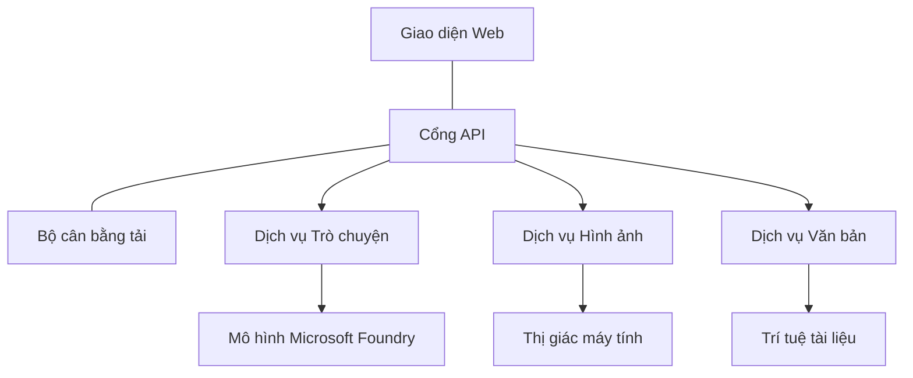

# Các Thực Hành Tốt Nhất cho Khối Lượng Công Việc AI Sản Xuất với AZD

**Chapter Navigation:**
- **📚 Trang khóa học**: [AZD cho Người Mới Bắt Đầu](../../README.md)
- **📖 Chương hiện tại**: Chương 8 - Mẫu Sản Xuất & Doanh Nghiệp
- **⬅️ Chương trước**: [Chương 7: Gỡ Lỗi](../chapter-07-troubleshooting/debugging.md)
- **⬅️ Cũng liên quan**: [Lab Thực hành AI](ai-workshop-lab.md)
- **🎯 Hoàn thành khóa học**: [AZD cho Người Mới Bắt Đầu](../../README.md)

## Tổng quan

Hướng dẫn này cung cấp các thực hành tốt nhất toàn diện để triển khai các khối lượng công việc AI sẵn sàng cho sản xuất bằng Azure Developer CLI (AZD). Dựa trên phản hồi từ cộng đồng Microsoft Foundry Discord và các triển khai thực tế của khách hàng, các thực hành này giải quyết những thách thức phổ biến nhất trong hệ thống AI ở môi trường sản xuất.

## Các Thách Thức Chính Được Giải Quyết

Dựa trên kết quả cuộc thăm dò cộng đồng của chúng tôi, đây là những thách thức hàng đầu mà các nhà phát triển phải đối mặt:

- **45%** gặp khó khăn với việc triển khai AI đa dịch vụ
- **38%** gặp vấn đề với quản lý thông tin xác thực và bí mật  
- **35%** thấy khó khăn trong việc sẵn sàng cho sản xuất và mở rộng
- **32%** cần các chiến lược tối ưu hóa chi phí tốt hơn
- **29%** yêu cầu cải thiện giám sát và khắc phục sự cố

## Mẫu Kiến Trúc cho AI Ở Môi Trường Sản Xuất

### Mẫu 1: Kiến trúc AI Microservices

**Khi sử dụng**: Các ứng dụng AI phức tạp với nhiều khả năng



**Triển khai AZD**:

```yaml
# azure.yaml
name: enterprise-ai-platform
services:
  web:
    project: ./web
    host: staticwebapp
  api-gateway:
    project: ./api-gateway
    host: containerapp
  chat-service:
    project: ./services/chat
    host: containerapp
  vision-service:
    project: ./services/vision
    host: containerapp
  text-service:
    project: ./services/text
    host: containerapp
```

### Mẫu 2: Xử lý AI theo Sự kiện

**Khi sử dụng**: Xử lý theo lô, phân tích tài liệu, luồng công việc không đồng bộ

```bicep
// Event Hub for AI processing pipeline
resource eventHub 'Microsoft.EventHub/namespaces@2023-01-01-preview' = {
  name: eventHubNamespaceName
  location: location
  sku: {
    name: 'Standard'
    tier: 'Standard'
    capacity: 1
  }
}

// Service Bus for reliable message processing
resource serviceBus 'Microsoft.ServiceBus/namespaces@2022-10-01-preview' = {
  name: serviceBusNamespaceName
  location: location
  sku: {
    name: 'Premium'
    tier: 'Premium'
    capacity: 1
  }
}

// Function App for processing
resource functionApp 'Microsoft.Web/sites@2023-01-01' = {
  name: functionAppName
  location: location
  kind: 'functionapp,linux'
  properties: {
    siteConfig: {
      appSettings: [
        {
          name: 'FUNCTIONS_EXTENSION_VERSION'
          value: '~4'
        }
        {
          name: 'AZURE_OPENAI_ENDPOINT'
          value: '@Microsoft.KeyVault(VaultName=${keyVault.name};SecretName=openai-endpoint)'
        }
      ]
    }
  }
}
```

## Nghĩ về Tình Trạng Hoạt Động của Agent AI

Khi một ứng dụng web truyền thống gặp sự cố, các triệu chứng thường quen thuộc: một trang không tải, một API trả về lỗi, hoặc một lần triển khai thất bại. Ứng dụng được hỗ trợ bởi AI có thể hỏng theo tất cả các cách đó — nhưng chúng cũng có thể hoạt động sai theo những cách tinh vi hơn mà không tạo ra thông báo lỗi rõ ràng.

Phần này giúp bạn xây dựng một mô hình tư duy để giám sát khối lượng công việc AI để bạn biết nên nhìn vào đâu khi mọi thứ có vẻ không ổn.

### Sự khác biệt giữa Tình trạng Agent và Tình trạng Ứng dụng Truyền thống

Một ứng dụng truyền thống hoặc hoạt động hoặc không hoạt động. Một agent AI có thể có vẻ hoạt động nhưng cho ra kết quả kém. Hãy nghĩ về tình trạng agent theo hai lớp:

| Lớp | Những gì cần theo dõi | Nơi tìm kiếm |
|-------|--------------|---------------|
| **Tình trạng hạ tầng** | Dịch vụ có đang chạy không? Các tài nguyên đã được cấp phát chưa? Các endpoint có thể truy cập được không? | `azd monitor`, tình trạng tài nguyên trên Azure Portal, nhật ký container/ứng dụng |
| **Tình trạng hành vi** | Agent có phản hồi chính xác không? Các phản hồi có kịp thời không? Mô hình có đang được gọi đúng cách không? | trace của Application Insights, các chỉ số độ trễ gọi mô hình, nhật ký chất lượng phản hồi |

Tình trạng hạ tầng thì quen thuộc—nó giống nhau cho bất kỳ ứng dụng azd nào. Tình trạng hành vi là lớp mới mà các khối lượng công việc AI giới thiệu.

### Nên kiểm tra ở đâu khi ứng dụng AI hoạt động không như mong đợi

Nếu ứng dụng AI của bạn không tạo ra kết quả như mong đợi, đây là một danh sách kiểm tra khái niệm:

1. **Bắt đầu với những điều cơ bản.** Ứng dụng có đang chạy không? Nó có thể truy cập các phụ thuộc không? Kiểm tra `azd monitor` và tình trạng tài nguyên như bạn sẽ làm cho bất kỳ ứng dụng nào.
2. **Kiểm tra kết nối tới mô hình.** Ứng dụng của bạn có đang gọi mô hình AI thành công không? Các cuộc gọi mô hình bị lỗi hoặc hết thời gian chờ là nguyên nhân phổ biến nhất gây ra vấn đề cho ứng dụng AI và sẽ xuất hiện trong nhật ký ứng dụng của bạn.
3. **Xem những gì mô hình nhận được.** Phản hồi AI phụ thuộc vào đầu vào (prompt và bất kỳ ngữ cảnh được truy xuất). Nếu đầu ra sai, đầu vào thường sai. Kiểm tra xem ứng dụng của bạn có đang gửi đúng dữ liệu tới mô hình hay không.
4. **Xem lại độ trễ phản hồi.** Các cuộc gọi tới mô hình AI chậm hơn so với các cuộc gọi API thông thường. Nếu ứng dụng của bạn cảm thấy chậm chạp, kiểm tra xem thời gian phản hồi của mô hình có tăng lên không—điều này có thể chỉ ra việc bị giới hạn băng thông, giới hạn năng lực, hoặc tắc nghẽn ở cấp vùng.
5. **Theo dõi các tín hiệu chi phí.** Sự tăng đột ngột bất thường trong việc sử dụng token hoặc số cuộc gọi API có thể chỉ ra một vòng lặp, một prompt cấu hình sai, hoặc các lần thử lại quá mức.

Bạn không cần phải thành thạo công cụ quan sát ngay lập tức. Điều cần nhớ là các ứng dụng AI có một lớp hành vi bổ sung để giám sát, và tính năng giám sát tích hợp của azd (`azd monitor`) cung cấp cho bạn một điểm khởi đầu để điều tra cả hai lớp.

---

## Thực hành bảo mật tốt nhất

### 1. Mô hình Bảo mật Zero-Trust

**Chiến lược triển khai**:
- Không có liên lạc dịch vụ-đến-dịch vụ mà không có xác thực
- Tất cả các cuộc gọi API sử dụng managed identities
- Cô lập mạng với private endpoints
- Kiểm soát truy cập theo nguyên tắc ít đặc quyền nhất

```bicep
// Managed Identity for each service
resource chatServiceIdentity 'Microsoft.ManagedIdentity/userAssignedIdentities@2023-01-31' = {
  name: 'chat-service-identity'
  location: location
}

// Role assignments with minimal permissions
resource openAIUserRole 'Microsoft.Authorization/roleAssignments@2022-04-01' = {
  scope: openAIAccount
  name: guid(openAIAccount.id, chatServiceIdentity.id, openAIUserRoleDefinitionId)
  properties: {
    roleDefinitionId: subscriptionResourceId('Microsoft.Authorization/roleDefinitions', '5e0bd9bd-7b93-4f28-af87-19fc36ad61bd')
    principalId: chatServiceIdentity.properties.principalId
    principalType: 'ServicePrincipal'
  }
}
```

### 2. Quản lý bí mật an toàn

**Mẫu tích hợp Key Vault**:

```bicep
// Key Vault with proper access policies
resource keyVault 'Microsoft.KeyVault/vaults@2023-02-01' = {
  name: keyVaultName
  location: location
  properties: {
    tenantId: tenant().tenantId
    sku: {
      family: 'A'
      name: 'premium'  // Use premium for production
    }
    enableRbacAuthorization: true  // Use RBAC instead of access policies
    enablePurgeProtection: true    // Prevent accidental deletion
    enableSoftDelete: true
    softDeleteRetentionInDays: 90
  }
}

// Store all AI service credentials
resource openAIKeySecret 'Microsoft.KeyVault/vaults/secrets@2023-02-01' = {
  parent: keyVault
  name: 'openai-api-key'
  properties: {
    value: openAIAccount.listKeys().key1
    attributes: {
      enabled: true
    }
  }
}
```

### 3. Bảo mật mạng

**Cấu hình Private Endpoint**:

```bicep
// Virtual Network for AI services
resource virtualNetwork 'Microsoft.Network/virtualNetworks@2023-04-01' = {
  name: vnetName
  location: location
  properties: {
    addressSpace: {
      addressPrefixes: ['10.0.0.0/16']
    }
    subnets: [
      {
        name: 'ai-services-subnet'
        properties: {
          addressPrefix: '10.0.1.0/24'
          privateEndpointNetworkPolicies: 'Disabled'
        }
      }
      {
        name: 'app-services-subnet'
        properties: {
          addressPrefix: '10.0.2.0/24'
          delegations: [
            {
              name: 'Microsoft.Web/serverFarms'
              properties: {
                serviceName: 'Microsoft.Web/serverFarms'
              }
            }
          ]
        }
      }
    ]
  }
}

// Private endpoints for all AI services
resource openAIPrivateEndpoint 'Microsoft.Network/privateEndpoints@2023-04-01' = {
  name: '${openAIAccountName}-pe'
  location: location
  properties: {
    subnet: {
      id: virtualNetwork.properties.subnets[0].id
    }
    privateLinkServiceConnections: [
      {
        name: 'openai-connection'
        properties: {
          privateLinkServiceId: openAIAccount.id
          groupIds: ['account']
        }
      }
    ]
  }
}
```

## Hiệu suất và Khả năng mở rộng

### 1. Chiến lược Tự động mở rộng

**Tự động mở rộng cho Container Apps**:

```bicep
resource containerApp 'Microsoft.App/containerApps@2023-05-01' = {
  name: containerAppName
  location: location
  properties: {
    configuration: {
      ingress: {
        external: true
        targetPort: 8000
        transport: 'http'
      }
    }
    template: {
      scale: {
        minReplicas: 2  // Always have 2 instances minimum
        maxReplicas: 50 // Scale up to 50 for high load
        rules: [
          {
            name: 'http-scaling'
            http: {
              metadata: {
                concurrentRequests: '20'  // Scale when >20 concurrent requests
              }
            }
          }
          {
            name: 'cpu-scaling'
            custom: {
              type: 'cpu'
              metadata: {
                type: 'Utilization'
                value: '70'  // Scale when CPU >70%
              }
            }
          }
        ]
      }
    }
  }
}
```

### 2. Chiến lược Cache

**Redis Cache cho phản hồi AI**:

```bicep
// Redis Premium for production workloads
resource redisCache 'Microsoft.Cache/redis@2023-04-01' = {
  name: redisCacheName
  location: location
  properties: {
    sku: {
      name: 'Premium'
      family: 'P'
      capacity: 1
    }
    enableNonSslPort: false
    minimumTlsVersion: '1.2'
    redisConfiguration: {
      'maxmemory-policy': 'allkeys-lru'
    }
    // Enable clustering for high availability
    redisVersion: '6.0'
    shardCount: 2
  }
}

// Cache configuration in application
var cacheConnectionString = '${redisCache.properties.hostName}:6380,password=${redisCache.listKeys().primaryKey},ssl=True,abortConnect=False'
```

### 3. Cân bằng tải và Quản lý lưu lượng

**Application Gateway với WAF**:

```bicep
// Application Gateway with Web Application Firewall
resource applicationGateway 'Microsoft.Network/applicationGateways@2023-04-01' = {
  name: appGatewayName
  location: location
  properties: {
    sku: {
      name: 'WAF_v2'
      tier: 'WAF_v2'
      capacity: 2
    }
    webApplicationFirewallConfiguration: {
      enabled: true
      firewallMode: 'Prevention'
      ruleSetType: 'OWASP'
      ruleSetVersion: '3.2'
    }
    // Backend pools for AI services
    backendAddressPools: [
      {
        name: 'ai-services-pool'
        properties: {
          backendAddresses: [
            {
              fqdn: '${containerApp.properties.configuration.ingress.fqdn}'
            }
          ]
        }
      }
    ]
  }
}
```

## 💰 Tối ưu hóa chi phí

### 1. Điều chỉnh kích thước tài nguyên phù hợp

**Cấu hình theo môi trường**:

```bash
# Môi trường phát triển
azd env new development
azd env set AZURE_OPENAI_SKU "S0"
azd env set AZURE_OPENAI_CAPACITY 10
azd env set AZURE_SEARCH_SKU "basic"
azd env set CONTAINER_CPU 0.5
azd env set CONTAINER_MEMORY 1.0

# Môi trường sản xuất
azd env new production
azd env set AZURE_OPENAI_SKU "S0"
azd env set AZURE_OPENAI_CAPACITY 100
azd env set AZURE_SEARCH_SKU "standard"
azd env set CONTAINER_CPU 2.0
azd env set CONTAINER_MEMORY 4.0
```

### 2. Giám sát chi phí và Ngân sách

```bicep
// Cost management and budgets
resource budget 'Microsoft.Consumption/budgets@2023-05-01' = {
  name: 'ai-workload-budget'
  properties: {
    timePeriod: {
      startDate: '2024-01-01'
      endDate: '2024-12-31'
    }
    timeGrain: 'Monthly'
    amount: 2000  // $2000 monthly budget
    category: 'Cost'
    notifications: {
      warning: {
        enabled: true
        operator: 'GreaterThan'
        threshold: 80
        contactEmails: [
          'finance@company.com'
          'engineering@company.com'
        ]
        contactRoles: [
          'Owner'
          'Contributor'
        ]
      }
      critical: {
        enabled: true
        operator: 'GreaterThan'
        threshold: 95
        contactEmails: [
          'cto@company.com'
        ]
      }
    }
  }
}
```

### 3. Tối ưu hóa sử dụng token

**Quản lý chi phí OpenAI**:

```typescript
// Tối ưu hóa token ở cấp ứng dụng
class TokenOptimizer {
  private readonly maxTokens = 4000;
  private readonly reserveTokens = 500;
  
  optimizePrompt(userInput: string, context: string): string {
    const availableTokens = this.maxTokens - this.reserveTokens;
    const estimatedTokens = this.estimateTokens(userInput + context);
    
    if (estimatedTokens > availableTokens) {
      // Cắt bớt ngữ cảnh, không phải đầu vào người dùng
      context = this.truncateContext(context, availableTokens - this.estimateTokens(userInput));
    }
    
    return `${context}\n\nUser: ${userInput}`;
  }
  
  private estimateTokens(text: string): number {
    // Ước tính sơ bộ: 1 token ≈ 4 ký tự
    return Math.ceil(text.length / 4);
  }
}
```

## Giám sát và Khả năng quan sát

### 1. Application Insights toàn diện

```bicep
// Application Insights with advanced features
resource applicationInsights 'Microsoft.Insights/components@2020-02-02' = {
  name: applicationInsightsName
  location: location
  kind: 'web'
  properties: {
    Application_Type: 'web'
    WorkspaceResourceId: logAnalyticsWorkspace.id
    SamplingPercentage: 100  // Full sampling for AI apps
    DisableIpMasking: false  // Enable for security
  }
}

// Custom metrics for AI operations
resource aiMetricAlerts 'Microsoft.Insights/metricAlerts@2018-03-01' = {
  name: 'ai-high-error-rate'
  location: 'global'
  properties: {
    description: 'Alert when AI service error rate is high'
    severity: 2
    enabled: true
    scopes: [
      applicationInsights.id
    ]
    evaluationFrequency: 'PT1M'
    windowSize: 'PT5M'
    criteria: {
      'odata.type': 'Microsoft.Azure.Monitor.SingleResourceMultipleMetricCriteria'
      allOf: [
        {
          name: 'high-error-rate'
          metricName: 'requests/failed'
          operator: 'GreaterThan'
          threshold: 10
          timeAggregation: 'Count'
        }
      ]
    }
  }
}
```

### 2. Giám sát dành riêng cho AI

**Bảng điều khiển tùy chỉnh cho các chỉ số AI**:

```json
// Dashboard configuration for AI workloads
{
  "dashboard": {
    "name": "AI Application Monitoring",
    "tiles": [
      {
        "name": "OpenAI Request Volume",
        "query": "requests | where name contains 'openai' | summarize count() by bin(timestamp, 5m)"
      },
      {
        "name": "AI Response Latency",
        "query": "requests | where name contains 'openai' | summarize avg(duration) by bin(timestamp, 5m)"
      },
      {
        "name": "Token Usage",
        "query": "customMetrics | where name == 'openai_tokens_used' | summarize sum(value) by bin(timestamp, 1h)"
      },
      {
        "name": "Cost per Hour",
        "query": "customMetrics | where name == 'openai_cost' | summarize sum(value) by bin(timestamp, 1h)"
      }
    ]
  }
}
```

### 3. Kiểm tra sức khỏe và Giám sát thời gian hoạt động

```bicep
// Application Insights availability tests
resource availabilityTest 'Microsoft.Insights/webtests@2022-06-15' = {
  name: 'ai-app-availability-test'
  location: location
  tags: {
    'hidden-link:${applicationInsights.id}': 'Resource'
  }
  properties: {
    SyntheticMonitorId: 'ai-app-availability-test'
    Name: 'AI Application Availability Test'
    Description: 'Tests AI application endpoints'
    Enabled: true
    Frequency: 300  // 5 minutes
    Timeout: 120    // 2 minutes
    Kind: 'ping'
    Locations: [
      {
        Id: 'us-east-2-azr'
      }
      {
        Id: 'us-west-2-azr'
      }
    ]
    Configuration: {
      WebTest: '''
        <WebTest Name="AI Health Check" 
                 Id="8d2de8d2-a2b0-4c2e-9a0d-8f9c9a0b8c8d" 
                 Enabled="True" 
                 CssProjectStructure="" 
                 CssIteration="" 
                 Timeout="120" 
                 WorkItemIds="" 
                 xmlns="http://microsoft.com/schemas/VisualStudio/TeamTest/2010" 
                 Description="" 
                 CredentialUserName="" 
                 CredentialPassword="" 
                 PreAuthenticate="True" 
                 Proxy="default" 
                 StopOnError="False" 
                 RecordedResultFile="" 
                 ResultsLocale="">
          <Items>
            <Request Method="GET" 
                     Guid="a5f10126-e4cd-570d-961c-cea43999a200" 
                     Version="1.1" 
                     Url="${webApp.properties.defaultHostName}/health" 
                     ThinkTime="0" 
                     Timeout="120" 
                     ParseDependentRequests="True" 
                     FollowRedirects="True" 
                     RecordResult="True" 
                     Cache="False" 
                     ResponseTimeGoal="0" 
                     Encoding="utf-8" 
                     ExpectedHttpStatusCode="200" 
                     ExpectedResponseUrl="" 
                     ReportingName="" 
                     IgnoreHttpStatusCode="False" />
          </Items>
        </WebTest>
      '''
    }
  }
}
```

## Khôi phục thảm họa và Khả năng sẵn sàng cao

### 1. Triển khai đa vùng

```yaml
# azure.yaml - Multi-region configuration
name: ai-app-multiregion
services:
  api-primary:
    project: ./api
    host: containerapp
    env:
      - AZURE_REGION=eastus
  api-secondary:
    project: ./api
    host: containerapp
    env:
      - AZURE_REGION=westus2
```

```bicep
// Traffic Manager for global load balancing
resource trafficManager 'Microsoft.Network/trafficManagerProfiles@2022-04-01' = {
  name: trafficManagerProfileName
  location: 'global'
  properties: {
    profileStatus: 'Enabled'
    trafficRoutingMethod: 'Priority'
    dnsConfig: {
      relativeName: trafficManagerProfileName
      ttl: 30
    }
    monitorConfig: {
      protocol: 'HTTPS'
      port: 443
      path: '/health'
      intervalInSeconds: 30
      toleratedNumberOfFailures: 3
      timeoutInSeconds: 10
    }
    endpoints: [
      {
        name: 'primary-endpoint'
        type: 'Microsoft.Network/trafficManagerProfiles/azureEndpoints'
        properties: {
          targetResourceId: primaryAppService.id
          endpointStatus: 'Enabled'
          priority: 1
        }
      }
      {
        name: 'secondary-endpoint'
        type: 'Microsoft.Network/trafficManagerProfiles/azureEndpoints'
        properties: {
          targetResourceId: secondaryAppService.id
          endpointStatus: 'Enabled'
          priority: 2
        }
      }
    ]
  }
}
```

### 2. Sao lưu và Khôi phục dữ liệu

```bicep
// Backup configuration for critical data
resource backupVault 'Microsoft.DataProtection/backupVaults@2023-05-01' = {
  name: backupVaultName
  location: location
  identity: {
    type: 'SystemAssigned'
  }
  properties: {
    storageSettings: [
      {
        datastoreType: 'VaultStore'
        type: 'LocallyRedundant'
      }
    ]
  }
}

// Backup policy for AI models and data
resource backupPolicy 'Microsoft.DataProtection/backupVaults/backupPolicies@2023-05-01' = {
  parent: backupVault
  name: 'ai-data-backup-policy'
  properties: {
    policyRules: [
      {
        backupParameters: {
          backupType: 'Full'
          objectType: 'AzureBackupParams'
        }
        trigger: {
          schedule: {
            repeatingTimeIntervals: [
              'R/2024-01-01T02:00:00+00:00/P1D'  // Daily at 2 AM
            ]
          }
          objectType: 'ScheduleBasedTriggerContext'
        }
        dataStore: {
          datastoreType: 'VaultStore'
          objectType: 'DataStoreInfoBase'
        }
        name: 'BackupDaily'
        objectType: 'AzureBackupRule'
      }
    ]
  }
}
```

## Tích hợp DevOps và CI/CD

### 1. Luồng công việc GitHub Actions

```yaml
# .github/workflows/deploy-ai-app.yml
name: Deploy AI Application

on:
  push:
    branches: [main]
  pull_request:
    branches: [main]

jobs:
  test:
    runs-on: ubuntu-latest
    steps:
      - uses: actions/checkout@v4
      
      - name: Setup Python
        uses: actions/setup-python@v4
        with:
          python-version: '3.11'
          
      - name: Install dependencies
        run: |
          pip install -r requirements.txt
          pip install pytest
          
      - name: Run tests
        run: pytest tests/
        
      - name: AI Safety Tests
        run: |
          python scripts/test_ai_safety.py
          python scripts/validate_prompts.py

  deploy-staging:
    needs: test
    if: github.event_name == 'pull_request'
    runs-on: ubuntu-latest
    steps:
      - uses: actions/checkout@v4
      
      - name: Setup AZD
        uses: Azure/setup-azd@v2
        
      - name: Login to Azure
        uses: azure/login@v1
        with:
          creds: ${{ secrets.AZURE_CREDENTIALS }}
          
      - name: Deploy to Staging
        run: |
          azd env select staging
          azd deploy

  deploy-production:
    needs: test
    if: github.ref == 'refs/heads/main'
    runs-on: ubuntu-latest
    steps:
      - uses: actions/checkout@v4
      
      - name: Setup AZD
        uses: Azure/setup-azd@v2
        
      - name: Login to Azure
        uses: azure/login@v1
        with:
          creds: ${{ secrets.AZURE_CREDENTIALS }}
          
      - name: Deploy to Production
        run: |
          azd env select production
          azd deploy
          
      - name: Run Production Health Checks
        run: |
          python scripts/health_check.py --env production
```

### 2. Xác thực hạ tầng

```bash
# scripts/validate_infrastructure.sh
#!/bin/bash

echo "Validating AI infrastructure deployment..."

# Kiểm tra xem tất cả các dịch vụ cần thiết có đang chạy không
services=("openai" "search" "storage" "keyvault")
for service in "${services[@]}"; do
    echo "Checking $service..."
    if ! az resource list --resource-type "Microsoft.CognitiveServices/accounts" --query "[?contains(name, '$service')]" -o tsv; then
        echo "ERROR: $service not found"
        exit 1
    fi
done

# Xác thực các triển khai mô hình OpenAI
echo "Validating OpenAI model deployments..."
models=$(az cognitiveservices account deployment list --name $AZURE_OPENAI_NAME --resource-group $AZURE_RESOURCE_GROUP --query "[].name" -o tsv)
if [[ ! $models == *"gpt-4.1-mini"* ]]; then
  echo "ERROR: Required model gpt-4.1-mini not deployed"
    exit 1
fi

# Kiểm tra kết nối dịch vụ AI
echo "Testing AI service connectivity..."
python scripts/test_connectivity.py

echo "Infrastructure validation completed successfully!"
```

## Danh sách kiểm tra sẵn sàng cho sản xuất

### Security ✅
- [ ] Tất cả dịch vụ sử dụng managed identities
- [ ] Bí mật được lưu trong Key Vault
- [ ] Private endpoints được cấu hình
- [ ] Network security groups được triển khai
- [ ] RBAC với quyền tối thiểu
- [ ] WAF được bật trên các endpoint công khai

### Performance ✅
- [ ] Tự động mở rộng được cấu hình
- [ ] Cache được triển khai
- [ ] Cân bằng tải được thiết lập
- [ ] CDN cho nội dung tĩnh
- [ ] Pooling kết nối cơ sở dữ liệu
- [ ] Tối ưu hóa sử dụng token

### Monitoring ✅
- [ ] Application Insights được cấu hình
- [ ] Các chỉ số tùy chỉnh được định nghĩa
- [ ] Các quy tắc cảnh báo được thiết lập
- [ ] Bảng điều khiển được tạo
- [ ] Kiểm tra sức khỏe được triển khai
- [ ] Chính sách lưu trữ nhật ký

### Reliability ✅
- [ ] Triển khai đa vùng
- [ ] Kế hoạch sao lưu và khôi phục
- [ ] Cơ chế circuit breaker được triển khai
- [ ] Chính sách thử lại được cấu hình
- [ ] Giảm chức năng có kiểm soát
- [ ] Các endpoint kiểm tra tình trạng

### Cost Management ✅
- [ ] Cảnh báo ngân sách được cấu hình
- [ ] Điều chỉnh kích thước tài nguyên phù hợp
- [ ] Giảm giá cho môi trường Dev/test được áp dụng
- [ ] Mua reserved instances khi phù hợp
- [ ] Bảng điều khiển giám sát chi phí
- [ ] Đánh giá chi phí định kỳ

### Compliance ✅
- [ ] Yêu cầu lưu trú dữ liệu được đáp ứng
- [ ] Ghi nhật ký kiểm toán được bật
- [ ] Chính sách tuân thủ được áp dụng
- [ ] Các tiêu chuẩn bảo mật được triển khai
- [ ] Đánh giá bảo mật định kỳ
- [ ] Kế hoạch phản ứng sự cố

## Các chỉ số hiệu suất

### Các chỉ số điển hình cho môi trường sản xuất

| Chỉ số | Mục tiêu | Giám sát |
|--------|--------|------------|
| **Thời gian phản hồi** | < 2 giây | Application Insights |
| **Độ sẵn sàng** | 99.9% | Giám sát thời gian hoạt động |
| **Tỷ lệ lỗi** | < 0.1% | Nhật ký ứng dụng |
| **Sử dụng token** | < $500/month | Quản lý chi phí |
| **Người dùng đồng thời** | 1000+ | Kiểm thử tải |
| **Thời gian phục hồi** | < 1 hour | Kiểm tra khôi phục thảm họa |

### Kiểm thử tải

```bash
# Kịch bản kiểm thử tải cho ứng dụng AI
python scripts/load_test.py \
  --endpoint https://your-ai-app.azurewebsites.net \
  --concurrent-users 100 \
  --duration 300 \
  --ramp-up 60
```

## 🤝 Các Thực hành Tốt nhất từ Cộng đồng

Dựa trên phản hồi từ cộng đồng Microsoft Foundry trên Discord:

### Những khuyến nghị hàng đầu từ cộng đồng:

1. **Bắt đầu nhỏ, mở rộng dần**: Bắt đầu với SKU cơ bản và mở rộng dựa trên mức sử dụng thực tế
2. **Giám sát mọi thứ**: Thiết lập giám sát toàn diện ngay từ ngày đầu
3. **Tự động hóa bảo mật**: Sử dụng hạ tầng như mã để đảm bảo bảo mật đồng nhất
4. **Kiểm thử kỹ lưỡng**: Bao gồm kiểm thử dành riêng cho AI trong pipeline của bạn
5. **Lên kế hoạch cho chi phí**: Giám sát việc sử dụng token và thiết lập cảnh báo ngân sách sớm

### Những cạm bẫy phổ biến cần tránh:

- ❌ Hardcoding API keys in code
- ❌ Not setting up proper monitoring
- ❌ Ignoring cost optimization
- ❌ Not testing failure scenarios
- ❌ Deploying without health checks

## Lệnh AZD AI CLI và các Extension

AZD bao gồm một bộ lệnh và extension dành riêng cho AI đang phát triển, giúp đơn giản hóa các luồng công việc AI ở môi trường sản xuất. Những công cụ này thu hẹp khoảng cách giữa phát triển cục bộ và triển khai sản xuất cho các khối lượng công việc AI.

### Các extension AZD cho AI

AZD sử dụng một hệ thống extension để thêm các khả năng dành riêng cho AI. Cài đặt và quản lý extension với:

```bash
# Liệt kê tất cả các phần mở rộng có sẵn (bao gồm cả AI)
azd extension list

# Xem chi tiết phần mở rộng đã cài đặt
azd extension show azure.ai.agents

# Cài đặt phần mở rộng Foundry agents
azd extension install azure.ai.agents

# Cài đặt phần mở rộng tinh chỉnh
azd extension install azure.ai.finetune

# Cài đặt phần mở rộng mô hình tùy chỉnh
azd extension install azure.ai.models

# Nâng cấp tất cả các phần mở rộng đã cài đặt
azd extension upgrade --all
```

**Các extension AI có sẵn:**

| Extension | Mục đích | Trạng thái |
|-----------|---------|--------|
| `azure.ai.agents` | Quản lý Foundry Agent Service | Xem trước |
| `azure.ai.skills` | Các kỹ năng agent có thể tái sử dụng | Xem trước |
| `azure.ai.connections` | Kết nối Foundry (nguồn dữ liệu, công cụ) | Xem trước |
| `azure.ai.finetune` | Fine-tuning mô hình Foundry | Xem trước |
| `azure.ai.models` | Mô hình tùy chỉnh Foundry | Xem trước |
| `azure.coding-agent` | Cấu hình coding agent | Có sẵn |

> Extension `azure.ai.agents` phát triển nhanh chóng. Khóa học này được xác thực với `0.1.40-preview`. Chạy `azd extension upgrade --all` để lấy bộ lệnh mới nhất, và `azd extension show azure.ai.agents` để xác nhận phiên bản bạn đã cài.

**Các extension `skills` và `connections` mới hơn là gì?**

Hai extension bản xem trước xuất hiện cùng với công cụ agent và đáng để hiểu ngay cả khi bạn là người mới:

- **`azure.ai.skills`** — Một **skill** là một khả năng có thể tái sử dụng (một công cụ hoặc hành vi đã đóng gói) mà bạn có thể đính kèm vào một hoặc nhiều agent thay vì triển khai lại mỗi lần. Hãy nghĩ về nó như một khối xây dựng chung: định nghĩa một kỹ năng "tìm kiếm tài liệu" hoặc "tra cứu đơn hàng" một lần, sau đó tái sử dụng nó cho các agent khác nhau. Điều này giữ cho các hệ thống đa agent (Chương 5) nhất quán và tránh việc sao chép-dán.
- **`azure.ai.connections`** — Một **connection** là một liên kết được quản lý từ dự án Foundry của bạn tới một tài nguyên bên ngoài mà các agent cần — một nguồn dữ liệu (như Azure AI Search), một endpoint công cụ, hoặc một dịch vụ khác. Connections tập trung hóa nơi và cách các agent truy cập dữ liệu, nên thông tin xác thực và các endpoint sống ở một nơi được quản trị thay vì rải rác trong mã.

Bạn không cần những thứ này để triển khai các agent đầu tiên — hãy dùng `azure.ai.agents` trong khi học. Sử dụng `skills` khi bạn thấy mình lặp lại cùng một công cụ giữa các agent, và `connections` khi nhiều agent chia sẻ cùng một nguồn dữ liệu.

### Khởi tạo dự án Agent với `azd ai agent init`

Lệnh `azd ai agent init` khởi tạo khung cho một dự án agent AI sẵn sàng cho sản xuất tích hợp với Microsoft Foundry Agent Service:

```bash
# Khởi tạo một dự án agent mới từ một manifest agent
azd ai agent init -m <manifest-path-or-uri>

# Khởi tạo và chỉ định một dự án Foundry cụ thể
azd ai agent init -m agent-manifest.yaml --project-id <foundry-project-id>

# Khởi tạo với thư mục nguồn tùy chỉnh
azd ai agent init -m agent-manifest.yaml --src ./agents/my-agent

# Chọn Container Apps làm máy chủ
azd ai agent init -m agent-manifest.yaml --host containerapp
```

**Các cờ chính:**

| Cờ | Mô tả |
|------|-------------|
| `-m, --manifest` | Đường dẫn hoặc URI tới manifest của agent để thêm vào dự án của bạn |
| `-p, --project-id` | ID Dự án Microsoft Foundry hiện có cho môi trường azd của bạn |
| `-s, --src` | Thư mục để tải định nghĩa agent về (mặc định là `src/<agent-id>`) |
| `--host` | Ghi đè host mặc định (ví dụ: `containerapp`) |
| `-e, --environment` | Môi trường azd để sử dụng |

**Mẹo triển khai**: Sử dụng `--project-id` để kết nối trực tiếp với một dự án Foundry hiện có, giữ mã agent và tài nguyên đám mây của bạn liên kết ngay từ đầu.

### Quản lý vòng đời Agent

Ngoài `init`, extension `azure.ai.agents` cung cấp các lệnh cho toàn bộ vòng đời của một agent được host — kiểm thử, đánh giá, tối ưu và ngừng sử dụng nó:

```bash
# Gọi một tác nhân đã triển khai và xem thời gian phản hồi của máy chủ
# (độ trễ tổng cộng và thời gian đến byte đầu tiên)
azd ai agent invoke

# Hiển thị cấu hình điểm cuối đang hoạt động trước khi thay đổi nó
azd ai agent endpoint show

# Tạo một tập dữ liệu đánh giá cho tác nhân
azd ai agent eval generate --dataset ./eval/dataset.jsonl

# Tối ưu hóa hướng dẫn tác nhân dựa trên dữ liệu đánh giá của bạn
# (yêu cầu một optimization_model trong dự án tác nhân)
azd ai agent optimize

# Tải xuống mã nguồn đã triển khai của tác nhân lưu trữ dựa trên mã
# (với xác minh SHA-256)
azd ai agent code download

# Xóa một tác nhân được lưu trữ và tất cả các phiên bản của nó
# (--force chấm dứt các phiên đang hoạt động)
azd ai agent delete --force
```

**Tổng quan vòng đời:**

| Giai đoạn | Lệnh | Sử dụng trong môi trường sản xuất |
|-------|---------|----------------|
| Kiểm thử | `azd ai agent invoke` | Xác thực phản hồi và đo độ trễ trước khi phát hành |
| Kiểm tra | `azd ai agent endpoint show` | Xem xét xác thực/cấu hình endpoint; phát hiện thay đổi phá vỡ sớm |
| Đo lường | `azd ai agent eval generate` | Xây dựng một bộ đánh giá có thể lặp lại từ các trace thực tế |
| Cải thiện | `azd ai agent optimize` | Tinh chỉnh hướng dẫn dựa trên chất lượng đo được |
| Phục hồi | `azd ai agent code download` | Lấy mã nguồn chính xác đã triển khai để kiểm toán/rollback |
| Ngừng hoạt động | `azd ai agent delete --force` | Hủy một agent và các phiên bản của nó một cách sạch sẽ |

> Đây là các lệnh bản xem trước và có thể thay đổi giữa các phiên bản extension. Chạy `azd ai agent --help` để xem các lệnh con chính xác có trong phiên bản bạn đã cài.

### Model Context Protocol (MCP) với `azd mcp`
AZD includes built-in MCP server support (Alpha), enabling AI agents and tools to interact with your Azure resources through a standardized protocol:

```bash
# Khởi động máy chủ MCP cho dự án của bạn
azd mcp start

# Xem xét các quy tắc đồng ý hiện tại của Copilot cho việc thực thi công cụ
azd copilot consent list
```

The MCP server exposes your azd project context—environments, services, and Azure resources—to AI-powered development tools. This enables:

- **AI-assisted deployment**: Let coding agents query your project state and trigger deployments
- **Resource discovery**: AI tools can discover what Azure resources your project uses
- **Environment management**: Agents can switch between dev/staging/production environments

### Infrastructure Generation with `azd infra generate`

For production AI workloads, you can generate and customize Infrastructure as Code rather than relying on automatic provisioning:

```bash
# Tạo các tệp Bicep/Terraform từ định nghĩa dự án của bạn
azd infra generate
```

This writes IaC to disk so you can:
- Review and audit infrastructure before deploying
- Add custom security policies (network rules, private endpoints)
- Integrate with existing IaC review processes
- Version control infrastructure changes separately from application code

### Production Lifecycle Hooks

AZD hooks let you inject custom logic at every stage of the deployment lifecycle—critical for production AI workflows:

```yaml
# azure.yaml - Production hooks example
name: ai-production-app
hooks:
  preprovision:
    shell: sh
    run: scripts/validate-quotas.sh    # Check AI model quota before provisioning
  postprovision:
    shell: sh
    run: scripts/configure-networking.sh  # Set up private endpoints
  predeploy:
    shell: sh
    run: scripts/run-ai-safety-tests.sh  # Run prompt safety checks
  postdeploy:
    shell: sh
    run: scripts/smoke-test.sh           # Verify agent responses post-deploy
services:
  agent-api:
    project: ./src/agent
    host: containerapp
    hooks:
      predeploy:
        shell: sh
        run: scripts/validate-model-access.sh  # Per-service hook
```

```bash
# Chạy một hook cụ thể thủ công trong quá trình phát triển
azd hooks run predeploy
```

**Recommended production hooks for AI workloads:**

| Hook | Use Case |
|------|----------|
| `preprovision` | Validate subscription quotas for AI model capacity |
| `postprovision` | Configure private endpoints, deploy model weights |
| `predeploy` | Run AI safety tests, validate prompt templates |
| `postdeploy` | Smoke test agent responses, verify model connectivity |

### CI/CD Pipeline Configuration

Use `azd pipeline config` to connect your project to GitHub Actions or Azure Pipelines with secure Azure authentication:

```bash
# Cấu hình pipeline CI/CD (tương tác)
azd pipeline config

# Cấu hình với một nhà cung cấp cụ thể
azd pipeline config --provider github
```

This command:
- Creates a service principal with least-privilege access
- Configures federated credentials (no stored secrets)
- Generates or updates your pipeline definition file
- Sets required environment variables in your CI/CD system

#### Step-by-step: your first GitHub Actions pipeline

Here's the full walkthrough from a working azd project to automated deployments on every push.

**1. Make sure your project is on GitHub**

```bash
git init
git add .
git commit -m "Initial azd project"
gh repo create my-ai-app --private --source=. --push
```

**2. Run pipeline config**

```bash
azd pipeline config --provider github
```

azd will, interactively:
- Ask which Azure subscription and environment to target
- Create an Entra **app registration + service principal** for the pipeline
- Set up **federated credentials (OIDC)**—so GitHub authenticates to Azure with short-lived tokens and **no secrets are stored**
- Push the required **variables** to your GitHub repo (`AZURE_CLIENT_ID`, `AZURE_TENANT_ID`, `AZURE_SUBSCRIPTION_ID`, `AZURE_ENV_NAME`, `AZURE_LOCATION`)

**3. Understand the generated workflow**

azd adds `.github/workflows/azure-dev.yml`. The key parts look like this:

```yaml
# .github/workflows/azure-dev.yml
on:
  push:
    branches: [ main ]
  workflow_dispatch:        # lets you run it manually too

permissions:
  id-token: write           # required for OIDC federated login
  contents: read

jobs:
  build:
    runs-on: ubuntu-latest
    env:
      AZURE_CLIENT_ID: ${{ vars.AZURE_CLIENT_ID }}
      AZURE_TENANT_ID: ${{ vars.AZURE_TENANT_ID }}
      AZURE_SUBSCRIPTION_ID: ${{ vars.AZURE_SUBSCRIPTION_ID }}
      AZURE_ENV_NAME: ${{ vars.AZURE_ENV_NAME }}
      AZURE_LOCATION: ${{ vars.AZURE_LOCATION }}
    steps:
      - uses: actions/checkout@v4
      - name: Install azd
        uses: Azure/setup-azd@v2
      - name: Log in with OIDC
        run: azd auth login --client-id "$AZURE_CLIENT_ID" --federated-credential-provider "github" --tenant-id "$AZURE_TENANT_ID"
      - name: Provision infrastructure
        run: azd provision --no-prompt
      - name: Deploy application
        run: azd deploy --no-prompt
```

**4. Verify it works**

```bash
# Đẩy một thay đổi để kích hoạt pipeline
git commit -am "Trigger pipeline" --allow-empty
git push
```

Open the **Actions** tab in your GitHub repo and watch the workflow run `azd provision` and `azd deploy` automatically.

> **Why federated credentials matter:** older pipelines stored a client secret in GitHub. OIDC federated credentials remove that secret entirely—GitHub requests a short-lived token at runtime, which is both more secure and nothing to rotate or leak. This is the default `azd pipeline config` sets up.

> **Secrets vs. variables:** non-sensitive identifiers (`AZURE_CLIENT_ID`, etc.) go in repo **variables**. If your app genuinely needs a secret at build time, add it as a GitHub **secret** and reference it with `${{ secrets.NAME }}`—but prefer Key Vault + managed identity at runtime (see [Chapter 3](../chapter-03-configuration/authsecurity.md)).

**Production workflow with pipeline config:**

```bash
# 1. Thiết lập môi trường sản xuất
azd env new production
azd env set AZURE_OPENAI_CAPACITY 100

# 2. Cấu hình pipeline
azd pipeline config --provider github

# 3. Pipeline chạy azd deploy trên mỗi lần push lên nhánh main
```

#### Step-by-step: Azure DevOps Pipelines

Prefer Azure DevOps over GitHub Actions? azd supports it natively with the `azdo` provider. The flow is nearly identical—azd generates the pipeline file, creates a service connection, and wires up authentication.

**1. Make sure you have an Azure DevOps project**

You need an organization and a project at `https://dev.azure.com/<your-org>`. Generate a Personal Access Token (PAT) with **Build (Read & execute)**, **Code (Read & write)**, and **Service Connections (Read, query & manage)** scopes—azd will prompt you for it.

**2. Configure the pipeline**

```bash
azd pipeline config --provider azdo
```

azd will:
- Ask for your Azure DevOps organization and project
- Create (or reuse) a **service connection** to Azure using a service principal
- Configure **workload identity federation (OIDC)** so no client secret is stored
- Commit an `azure-dev.yml` pipeline definition to your repo

**3. Review the generated `azure-dev.yml`**

azd writes a pipeline that provisions and deploys on every push to `main`:

```yaml
# azure-dev.yml
trigger:
  - main

pool:
  vmImage: ubuntu-latest

steps:
  - task: setup-azd@1
    displayName: Install azd

  - script: azd provision --no-prompt
    displayName: Provision Infrastructure
    env:
      AZURE_SUBSCRIPTION_ID: $(AZURE_SUBSCRIPTION_ID)
      AZURE_ENV_NAME: $(AZURE_ENV_NAME)
      AZURE_LOCATION: $(AZURE_LOCATION)

  - script: azd deploy --no-prompt
    displayName: Deploy Application
    env:
      AZURE_SUBSCRIPTION_ID: $(AZURE_SUBSCRIPTION_ID)
      AZURE_ENV_NAME: $(AZURE_ENV_NAME)
      AZURE_LOCATION: $(AZURE_LOCATION)
```

**4. Where the variables come from**

azd stores the environment values (`AZURE_ENV_NAME`, `AZURE_LOCATION`, `AZURE_SUBSCRIPTION_ID`) as a **variable group** in Azure DevOps so the pipeline can read them. You can view and edit them under **Pipelines → Library**.

> **Same OIDC benefit as GitHub:** the `azdo` provider also configures workload identity federation by default, so there's no client secret stored in the service connection—Azure DevOps exchanges a short-lived token at runtime. Pass `--auth-type client-credentials` only if your organization can't use OIDC yet.

**5. Run it**

```bash
git commit -am "Add Azure DevOps pipeline" --allow-empty
git push
```

Open **Pipelines** in Azure DevOps to watch `azd provision` and `azd deploy` run.

### Adding Components with `azd add`

Incrementally add Azure services to an existing project:

```bash
# Thêm một thành phần dịch vụ mới một cách tương tác
azd add
```

This is particularly useful for expanding production AI applications—for example, adding a vector search service, a new agent endpoint, or a monitoring component to an existing deployment.

## Additional Resources

- **Azure Well-Architected Framework**: [AI workload guidance](https://learn.microsoft.com/azure/well-architected/ai/)
- **Microsoft Foundry Documentation**: [Official docs](https://learn.microsoft.com/azure/ai-studio/)
- **Community Templates**: [Azure Samples](https://github.com/Azure-Samples)
- **Discord Community**: [#Azure channel](https://discord.gg/microsoft-azure)
- **Agent Skills for Azure**: [microsoft/github-copilot-for-azure on skills.sh](https://skills.sh/microsoft/github-copilot-for-azure) - 37 open agent skills for Azure AI, Foundry, deployment, cost optimization, and diagnostics. Install in your editor:
  ```bash
  npx skills add microsoft/github-copilot-for-azure
  ```

---

**Chapter Navigation:**
- **📚 Course Home**: [AZD For Beginners](../../README.md)
- **📖 Current Chapter**: Chapter 8 - Production & Enterprise Patterns
- **⬅️ Previous Chapter**: [Chapter 7: Troubleshooting](../chapter-07-troubleshooting/debugging.md)
- **⬅️ Also Related**: [AI Workshop Lab](ai-workshop-lab.md)
- **� Course Complete**: [AZD For Beginners](../../README.md)

**Remember**: Production AI workloads require careful planning, monitoring, and continuous optimization. Start with these patterns and adapt them to your specific requirements.

---

<!-- CO-OP TRANSLATOR DISCLAIMER START -->
**Tuyên bố miễn trừ trách nhiệm**:
Tài liệu này đã được dịch bằng dịch vụ dịch thuật AI [Co-op Translator](https://github.com/Azure/co-op-translator). Mặc dù chúng tôi cố gắng đảm bảo độ chính xác, xin lưu ý rằng bản dịch tự động có thể chứa lỗi hoặc sai sót. Tài liệu gốc bằng ngôn ngữ gốc nên được coi là nguồn tin chính thức. Đối với thông tin quan trọng, nên sử dụng dịch vụ dịch thuật chuyên nghiệp bởi con người. Chúng tôi không chịu trách nhiệm về bất kỳ hiểu lầm hoặc giải thích sai nào phát sinh từ việc sử dụng bản dịch này.
<!-- CO-OP TRANSLATOR DISCLAIMER END -->