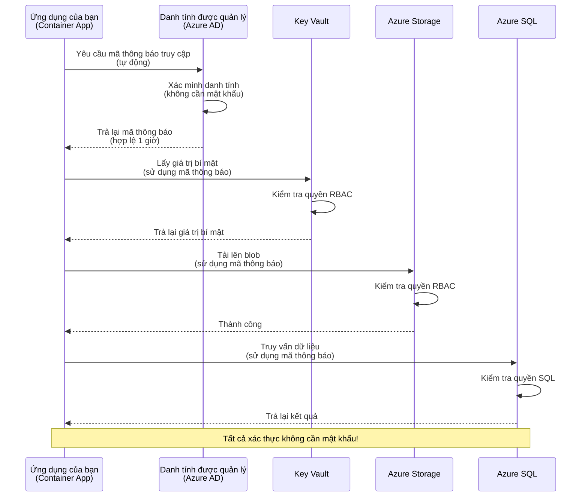
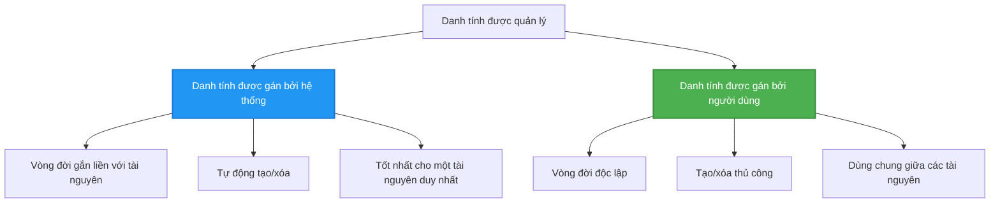

# Mẫu Xác Thực và Managed Identity

⏱️ **Thời gian ước tính**: 45-60 phút | 💰 **Chi phí**: Miễn phí (không phát sinh thêm chi phí) | ⭐ **Độ phức tạp**: Trung cấp

**📚 Lộ trình học tập:**
- ← Trước: [Quản lý cấu hình](configuration.md) - Quản lý biến môi trường và bí mật
- 🎯 **Bạn đang ở đây**: Xác thực & Bảo mật (Managed Identity, Key Vault, các mẫu bảo mật)
- → Tiếp theo: [Dự án đầu tiên](first-project.md) - Xây dựng ứng dụng AZD đầu tiên của bạn
- 🏠 [Trang chủ khóa học](../../README.md)

---

## Bạn sẽ học được gì

Khi hoàn thành bài học này, bạn sẽ:
- Hiểu các mẫu xác thực Azure (khóa, chuỗi kết nối, managed identity)
- Triển khai **Managed Identity** để xác thực không cần mật khẩu
- Bảo mật bí mật với tích hợp **Azure Key Vault**
- Cấu hình **kiểm soát truy cập dựa trên vai trò (RBAC)** cho các triển khai AZD
- Áp dụng các thực hành bảo mật tốt nhất trong Container Apps và các dịch vụ Azure
- Chuyển đổi từ xác thực dựa trên khóa sang dựa trên danh tính

## Tại sao Managed Identity quan trọng

### Vấn đề: Xác thực truyền thống

**Trước Managed Identity:**
```javascript
// ❌ RỦI RO BẢO MẬT: Bí mật được mã hóa cứng trong mã
const connectionString = "Server=mydb.database.windows.net;User=admin;Password=P@ssw0rd123";
const storageKey = "xK7mN9pQ2wR5tY8uI0oP3aS6dF1gH4jK...";
const cosmosKey = "C2x7B9n4M1p8Q5w3E6r0T2y5U8i1O4p7...";
```

**Vấn đề:**
- 🔴 **Bí mật bị lộ** trong mã, tệp cấu hình, biến môi trường
- 🔴 **Xoay vòng thông tin xác thực** yêu cầu thay đổi mã và triển khai lại
- 🔴 **Ác mộng kiểm toán** - ai đã truy cập cái gì, khi nào?
- 🔴 **Phân tán** - bí mật nằm rải rác trên nhiều hệ thống
- 🔴 **Rủi ro tuân thủ** - không đạt các cuộc kiểm toán bảo mật

### Giải pháp: Managed Identity

**Sau Managed Identity:**
```javascript
// ✅ AN TOÀN: Không có bí mật trong mã
const credential = new DefaultAzureCredential();
const client = new BlobServiceClient(
  "https://mystorageaccount.blob.core.windows.net",
  credential  // Azure tự động xử lý xác thực
);
```

**Lợi ích:**
- ✅ **Không có bí mật** trong mã hoặc cấu hình
- ✅ **Xoay vòng tự động** - Azure xử lý
- ✅ **Đầy đủ nhật ký kiểm toán** trong Azure AD
- ✅ **Bảo mật tập trung** - quản lý trong Azure Portal
- ✅ **Sẵn sàng tuân thủ** - đáp ứng các tiêu chuẩn bảo mật

**Ví dụ minh họa**: Xác thực truyền thống giống như mang theo nhiều chìa khóa vật lý cho các cửa khác nhau. Managed Identity giống như có một thẻ bảo mật tự động cấp quyền truy cập dựa trên danh tính của bạn—không có chìa khóa để mất, sao chép hoặc xoay vòng.

---

## Tổng quan kiến trúc

### Luồng xác thực với Managed Identity


### Các loại Managed Identity


| Tính năng | System-Assigned | User-Assigned |
|-----------|-----------------|---------------|
| **Vòng đời** | Gắn với tài nguyên | Độc lập |
| **Tạo** | Tự động với tài nguyên | Tạo thủ công |
| **Xóa** | Xóa cùng tài nguyên | Tồn tại sau khi tài nguyên bị xóa |
| **Chia sẻ** | Chỉ một tài nguyên | Nhiều tài nguyên |
| **Trường hợp sử dụng** | Tình huống đơn giản | Tình huống phức tạp nhiều tài nguyên |
| **Mặc định AZD** | ✅ Khuyến nghị | Tùy chọn |

---

## Yêu cầu trước

### Công cụ cần thiết

Bạn nên đã cài đặt các công cụ này từ các bài học trước:

```bash
# Xác minh Azure Developer CLI
azd version
# ✅ Mong đợi: azd phiên bản 1.0.0 hoặc cao hơn

# Xác minh Azure CLI
az --version
# ✅ Mong đợi: azure-cli 2.50.0 hoặc cao hơn
```

### Yêu cầu Azure

- Đăng ký Azure đang hoạt động
- Quyền để:
  - Tạo managed identities
  - Gán vai trò RBAC
  - Tạo tài nguyên Key Vault
  - Triển khai Container Apps

### Kiến thức cần thiết

Bạn nên đã hoàn thành:
- [Hướng dẫn cài đặt](installation.md) - Cài đặt AZD
- [Kiến thức cơ bản về AZD](azd-basics.md) - Các khái niệm cốt lõi
- [Quản lý cấu hình](configuration.md) - Biến môi trường

---

## Bài học 1: Hiểu các mẫu xác thực

### Mẫu 1: Chuỗi kết nối (Cũ - Tránh sử dụng)

**Cách hoạt động:**
```bash
# Chuỗi kết nối chứa thông tin xác thực
STORAGE_CONNECTION_STRING="DefaultEndpointsProtocol=https;AccountName=myaccount;AccountKey=xK7mN9pQ2wR5..."
COSMOS_CONNECTION_STRING="AccountEndpoint=https://myaccount.documents.azure.com:443/;AccountKey=C2x7..."
SQL_CONNECTION_STRING="Server=myserver.database.windows.net;User=admin;Password=P@ssw0rd..."
```

**Vấn đề:**
- ❌ Bí mật hiển thị trong biến môi trường
- ❌ Được ghi lại trong hệ thống triển khai
- ❌ Khó xoay vòng
- ❌ Không có nhật ký kiểm toán truy cập

**Khi nào sử dụng:** Chỉ dành cho phát triển cục bộ, không bao giờ sử dụng trong sản xuất.

---

### Mẫu 2: Tham chiếu Key Vault (Tốt hơn)

**Cách hoạt động:**
```bicep
// Store secret in Key Vault
resource keyVault 'Microsoft.KeyVault/vaults@2023-02-01' = {
  name: 'mykv'
  properties: {
    enableRbacAuthorization: true
  }
}

// Reference in Container App
env: [
  {
    name: 'STORAGE_KEY'
    secretRef: 'storage-key'  // References Key Vault
  }
]
```

**Lợi ích:**
- ✅ Bí mật được lưu trữ an toàn trong Key Vault
- ✅ Quản lý bí mật tập trung
- ✅ Xoay vòng mà không cần thay đổi mã

**Hạn chế:**
- ⚠️ Vẫn sử dụng khóa/mật khẩu
- ⚠️ Cần quản lý quyền truy cập Key Vault

**Khi nào sử dụng:** Bước chuyển tiếp từ chuỗi kết nối sang managed identity.

---

### Mẫu 3: Managed Identity (Thực hành tốt nhất)

**Cách hoạt động:**
```bicep
// Enable managed identity
resource containerApp 'Microsoft.App/containerApps@2023-05-01' = {
  name: 'myapp'
  identity: {
    type: 'SystemAssigned'  // Automatically creates identity
  }
}

// Grant permissions
resource roleAssignment 'Microsoft.Authorization/roleAssignments@2022-04-01' = {
  scope: storageAccount
  properties: {
    roleDefinitionId: storageBlobDataContributorRole
    principalId: containerApp.identity.principalId
  }
}
```

**Mã ứng dụng:**
```javascript
// Không cần bí mật!
const { DefaultAzureCredential } = require('@azure/identity');
const { BlobServiceClient } = require('@azure/storage-blob');

const credential = new DefaultAzureCredential();
const blobServiceClient = new BlobServiceClient(
  'https://mystorageaccount.blob.core.windows.net',
  credential
);
```

**Lợi ích:**
- ✅ Không có bí mật trong mã/cấu hình
- ✅ Xoay vòng thông tin xác thực tự động
- ✅ Đầy đủ nhật ký kiểm toán
- ✅ Quyền dựa trên RBAC
- ✅ Sẵn sàng tuân thủ

**Khi nào sử dụng:** Luôn luôn, cho các ứng dụng sản xuất.

---

## Bài học 2: Triển khai Managed Identity với AZD

### Các bước triển khai

Hãy xây dựng một Container App an toàn sử dụng managed identity để truy cập Azure Storage và Key Vault.

### Cấu trúc dự án

```
secure-app/
├── azure.yaml                 # AZD configuration
├── infra/
│   ├── main.bicep            # Main infrastructure
│   ├── core/
│   │   ├── identity.bicep    # Managed identity setup
│   │   ├── keyvault.bicep    # Key Vault configuration
│   │   └── storage.bicep     # Storage with RBAC
│   └── app/
│       └── container-app.bicep
└── src/
    ├── app.js                # Application code
    ├── package.json
    └── Dockerfile
```

### 1. Cấu hình AZD (azure.yaml)

```yaml
name: secure-app
metadata:
  template: secure-app@1.0.0

services:
  api:
    project: ./src
    language: js
    host: containerapp

# Enable managed identity (AZD handles this automatically)
```

### 2. Hạ tầng: Kích hoạt Managed Identity

**Tệp: `infra/main.bicep`**

```bicep
targetScope = 'subscription'

param environmentName string
param location string = 'eastus'

var tags = { 'azd-env-name': environmentName }

// Resource group
resource rg 'Microsoft.Resources/resourceGroups@2021-04-01' = {
  name: 'rg-${environmentName}'
  location: location
  tags: tags
}

// Storage Account
module storage './core/storage.bicep' = {
  name: 'storage'
  scope: rg
  params: {
    name: 'st${uniqueString(rg.id)}'
    location: location
    tags: tags
  }
}

// Key Vault
module keyVault './core/keyvault.bicep' = {
  name: 'keyvault'
  scope: rg
  params: {
    name: 'kv-${uniqueString(rg.id)}'
    location: location
    tags: tags
  }
}

// Container App with Managed Identity
module containerApp './app/container-app.bicep' = {
  name: 'container-app'
  scope: rg
  params: {
    name: 'ca-${environmentName}'
    location: location
    tags: tags
    storageAccountName: storage.outputs.name
    keyVaultName: keyVault.outputs.name
  }
}

// Grant Container App access to Storage
module storageRoleAssignment './core/role-assignment.bicep' = {
  name: 'storage-role'
  scope: rg
  params: {
    principalId: containerApp.outputs.identityPrincipalId
    roleDefinitionId: 'ba92f5b4-2d11-453d-a403-e96b0029c9fe'  // Storage Blob Data Contributor
    targetResourceId: storage.outputs.id
  }
}

// Grant Container App access to Key Vault
module kvRoleAssignment './core/role-assignment.bicep' = {
  name: 'kv-role'
  scope: rg
  params: {
    principalId: containerApp.outputs.identityPrincipalId
    roleDefinitionId: '4633458b-17de-408a-b874-0445c86b69e6'  // Key Vault Secrets User
    targetResourceId: keyVault.outputs.id
  }
}

// Outputs
output AZURE_STORAGE_ACCOUNT_NAME string = storage.outputs.name
output AZURE_KEY_VAULT_NAME string = keyVault.outputs.name
output APP_URL string = containerApp.outputs.url
```

### 3. Container App với System-Assigned Identity

**Tệp: `infra/app/container-app.bicep`**

```bicep
param name string
param location string
param tags object = {}
param storageAccountName string
param keyVaultName string

resource containerApp 'Microsoft.App/containerApps@2023-05-01' = {
  name: name
  location: location
  tags: tags
  identity: {
    type: 'SystemAssigned'  // 🔑 Enable managed identity
  }
  properties: {
    configuration: {
      ingress: {
        external: true
        targetPort: 3000
      }
    }
    template: {
      containers: [
        {
          name: 'api'
          image: 'myregistry.azurecr.io/api:latest'
          resources: {
            cpu: json('0.5')
            memory: '1Gi'
          }
          env: [
            {
              name: 'AZURE_STORAGE_ACCOUNT_NAME'
              value: storageAccountName
            }
            {
              name: 'AZURE_KEY_VAULT_NAME'
              value: keyVaultName
            }
            // 🔑 No secrets - managed identity handles authentication!
          ]
        }
      ]
    }
  }
}

// Output the identity for RBAC assignments
output identityPrincipalId string = containerApp.identity.principalId
output id string = containerApp.id
output url string = 'https://${containerApp.properties.configuration.ingress.fqdn}'
```

### 4. Mô-đun gán vai trò RBAC

**Tệp: `infra/core/role-assignment.bicep`**

```bicep
param principalId string
param roleDefinitionId string  // Azure built-in role ID
param targetResourceId string

resource roleAssignment 'Microsoft.Authorization/roleAssignments@2022-04-01' = {
  name: guid(principalId, roleDefinitionId, targetResourceId)
  scope: resourceId('Microsoft.Resources/resourceGroups', resourceGroup().name)
  properties: {
    roleDefinitionId: subscriptionResourceId('Microsoft.Authorization/roleDefinitions', roleDefinitionId)
    principalId: principalId
    principalType: 'ServicePrincipal'
  }
}

output id string = roleAssignment.id
```

### 5. Mã ứng dụng với Managed Identity

**Tệp: `src/app.js`**

```javascript
const express = require('express');
const { DefaultAzureCredential } = require('@azure/identity');
const { BlobServiceClient } = require('@azure/storage-blob');
const { SecretClient } = require('@azure/keyvault-secrets');

const app = express();
const PORT = process.env.PORT || 3000;

// 🔑 Khởi tạo thông tin xác thực (hoạt động tự động với danh tính được quản lý)
const credential = new DefaultAzureCredential();

// Cài đặt Azure Storage
const storageAccountName = process.env.AZURE_STORAGE_ACCOUNT_NAME;
const blobServiceClient = new BlobServiceClient(
  `https://${storageAccountName}.blob.core.windows.net`,
  credential  // Không cần khóa!
);

// Cài đặt Key Vault
const keyVaultName = process.env.AZURE_KEY_VAULT_NAME;
const secretClient = new SecretClient(
  `https://${keyVaultName}.vault.azure.net`,
  credential  // Không cần khóa!
);

// Kiểm tra sức khỏe
app.get('/health', (req, res) => {
  res.json({ status: 'healthy', authentication: 'managed-identity' });
});

// Tải tệp lên blob storage
app.post('/upload', async (req, res) => {
  try {
    const containerClient = blobServiceClient.getContainerClient('uploads');
    await containerClient.createIfNotExists();
    
    const blobName = `file-${Date.now()}.txt`;
    const blockBlobClient = containerClient.getBlockBlobClient(blobName);
    
    await blockBlobClient.upload('Hello from managed identity!', 30);
    
    res.json({
      success: true,
      blobName: blobName,
      message: 'File uploaded using managed identity!'
    });
  } catch (error) {
    console.error('Upload error:', error);
    res.status(500).json({ error: error.message });
  }
});

// Lấy bí mật từ Key Vault
app.get('/secret/:name', async (req, res) => {
  try {
    const secretName = req.params.name;
    const secret = await secretClient.getSecret(secretName);
    
    res.json({
      name: secretName,
      value: secret.value,
      message: 'Secret retrieved using managed identity!'
    });
  } catch (error) {
    console.error('Secret error:', error);
    res.status(500).json({ error: error.message });
  }
});

// Liệt kê các container blob (minh họa quyền truy cập đọc)
app.get('/containers', async (req, res) => {
  try {
    const containers = [];
    for await (const container of blobServiceClient.listContainers()) {
      containers.push(container.name);
    }
    
    res.json({
      containers: containers,
      count: containers.length,
      message: 'Containers listed using managed identity!'
    });
  } catch (error) {
    console.error('List error:', error);
    res.status(500).json({ error: error.message });
  }
});

app.listen(PORT, () => {
  console.log(`Secure API listening on port ${PORT}`);
  console.log('Authentication: Managed Identity (passwordless)');
});
```

**Tệp: `src/package.json`**

```json
{
  "name": "secure-app",
  "version": "1.0.0",
  "dependencies": {
    "express": "^4.18.2",
    "@azure/identity": "^4.0.0",
    "@azure/storage-blob": "^12.17.0",
    "@azure/keyvault-secrets": "^4.7.0"
  },
  "scripts": {
    "start": "node app.js"
  }
}
```

### 6. Triển khai và kiểm tra

```bash
# Khởi tạo môi trường AZD
azd init

# Triển khai cơ sở hạ tầng và ứng dụng
azd up

# Lấy URL của ứng dụng
APP_URL=$(azd env get-values | grep APP_URL | cut -d '=' -f2 | tr -d '"')

# Kiểm tra sức khỏe
curl $APP_URL/health
```

**✅ Kết quả mong đợi:**
```json
{
  "status": "healthy",
  "authentication": "managed-identity"
}
```

**Kiểm tra tải blob:**
```bash
curl -X POST $APP_URL/upload
```

**✅ Kết quả mong đợi:**
```json
{
  "success": true,
  "blobName": "file-1700404800000.txt",
  "message": "File uploaded using managed identity!"
}
```

**Kiểm tra danh sách container:**
```bash
curl $APP_URL/containers
```

**✅ Kết quả mong đợi:**
```json
{
  "containers": ["uploads"],
  "count": 1,
  "message": "Containers listed using managed identity!"
}
```

---

## Các vai trò RBAC phổ biến của Azure

### ID vai trò tích hợp sẵn cho Managed Identity

| Dịch vụ | Tên vai trò | ID vai trò | Quyền |
|---------|-------------|------------|-------|
| **Storage** | Storage Blob Data Reader | `2a2b9908-6b94-4a3d-8e5a-a7d8f8cc8a12` | Đọc blob và container |
| **Storage** | Storage Blob Data Contributor | `ba92f5b4-2d11-453d-a403-e96b0029c9fe` | Đọc, ghi, xóa blob |
| **Storage** | Storage Queue Data Contributor | `974c5e8b-45b9-4653-ba55-5f855dd0fb88` | Đọc, ghi, xóa tin nhắn hàng đợi |
| **Key Vault** | Key Vault Secrets User | `4633458b-17de-408a-b874-0445c86b69e6` | Đọc bí mật |
| **Key Vault** | Key Vault Secrets Officer | `b86a8fe4-44ce-4948-aee5-eccb2c155cd7` | Đọc, ghi, xóa bí mật |
| **Cosmos DB** | Cosmos DB Built-in Data Reader | `00000000-0000-0000-0000-000000000001` | Đọc dữ liệu Cosmos DB |
| **Cosmos DB** | Cosmos DB Built-in Data Contributor | `00000000-0000-0000-0000-000000000002` | Đọc, ghi dữ liệu Cosmos DB |
| **SQL Database** | SQL DB Contributor | `9b7fa17d-e63e-47b0-bb0a-15c516ac86ec` | Quản lý cơ sở dữ liệu SQL |
| **Service Bus** | Azure Service Bus Data Owner | `090c5cfd-751d-490a-894a-3ce6f1109419` | Gửi, nhận, quản lý tin nhắn |

### Cách tìm ID vai trò

```bash
# Liệt kê tất cả các vai trò tích hợp sẵn
az role definition list --query "[].{Name:roleName, ID:name}" --output table

# Tìm kiếm vai trò cụ thể
az role definition list --query "[?contains(roleName, 'Storage Blob')].{Name:roleName, ID:name}" --output table

# Lấy chi tiết vai trò
az role definition list --name "Storage Blob Data Contributor"
```

---

## Bài tập thực hành

### Bài tập 1: Kích hoạt Managed Identity cho ứng dụng hiện có ⭐⭐ (Trung bình)

**Mục tiêu**: Thêm managed identity vào một triển khai Container App hiện có

**Kịch bản**: Bạn có một Container App sử dụng chuỗi kết nối. Chuyển đổi nó sang managed identity.

**Điểm bắt đầu**: Container App với cấu hình sau:

```bicep
// ❌ Current: Using connection string
env: [
  {
    name: 'STORAGE_CONNECTION_STRING'
    secretRef: 'storage-connection'
  }
]
```

**Các bước:**

1. **Kích hoạt managed identity trong Bicep:**

```bicep
resource containerApp 'Microsoft.App/containerApps@2023-05-01' = {
  name: 'myapp'
  identity: {
    type: 'SystemAssigned'  // Add this
  }
  // ... rest of configuration
}
```

2. **Cấp quyền truy cập Storage:**

```bicep
// Get storage account reference
resource storageAccount 'Microsoft.Storage/storageAccounts@2023-01-01' existing = {
  name: storageAccountName
}

// Assign role
resource roleAssignment 'Microsoft.Authorization/roleAssignments@2022-04-01' = {
  name: guid(containerApp.id, 'ba92f5b4-2d11-453d-a403-e96b0029c9fe', storageAccount.id)
  scope: storageAccount
  properties: {
    roleDefinitionId: subscriptionResourceId('Microsoft.Authorization/roleDefinitions', 'ba92f5b4-2d11-453d-a403-e96b0029c9fe')
    principalId: containerApp.identity.principalId
    principalType: 'ServicePrincipal'
  }
}
```

3. **Cập nhật mã ứng dụng:**

**Trước (chuỗi kết nối):**
```javascript
const { BlobServiceClient } = require('@azure/storage-blob');

const blobServiceClient = BlobServiceClient.fromConnectionString(
  process.env.STORAGE_CONNECTION_STRING
);
```

**Sau (managed identity):**
```javascript
const { DefaultAzureCredential } = require('@azure/identity');
const { BlobServiceClient } = require('@azure/storage-blob');

const credential = new DefaultAzureCredential();
const blobServiceClient = new BlobServiceClient(
  `https://${process.env.STORAGE_ACCOUNT_NAME}.blob.core.windows.net`,
  credential
);
```

4. **Cập nhật biến môi trường:**

```bicep
env: [
  {
    name: 'STORAGE_ACCOUNT_NAME'
    value: storageAccountName  // Just the name, no secrets!
  }
  // Remove STORAGE_CONNECTION_STRING
]
```

5. **Triển khai và kiểm tra:**

```bash
# Triển khai lại
azd up

# Kiểm tra xem nó vẫn hoạt động
curl https://myapp.azurecontainerapps.io/upload
```

**✅ Tiêu chí thành công:**
- ✅ Ứng dụng triển khai không lỗi
- ✅ Các thao tác Storage hoạt động (tải lên, liệt kê, tải xuống)
- ✅ Không có chuỗi kết nối trong biến môi trường
- ✅ Danh tính hiển thị trong Azure Portal dưới tab "Identity"

**Xác minh:**

```bash
# Kiểm tra danh tính được quản lý đã được bật
az containerapp show \
  --name myapp \
  --resource-group rg-myapp \
  --query "identity.type"
# ✅ Mong đợi: "SystemAssigned"

# Kiểm tra phân công vai trò
az role assignment list \
  --assignee $(az containerapp show --name myapp --resource-group rg-myapp --query "identity.principalId" -o tsv) \
  --scope /subscriptions/{sub-id}/resourceGroups/rg-myapp/providers/Microsoft.Storage/storageAccounts/mystorageaccount
# ✅ Mong đợi: Hiển thị vai trò "Storage Blob Data Contributor"
```

**Thời gian**: 20-30 phút

---

### Bài tập 2: Truy cập đa dịch vụ với User-Assigned Identity ⭐⭐⭐ (Nâng cao)

**Mục tiêu**: Tạo một user-assigned identity được chia sẻ giữa nhiều Container Apps

**Kịch bản**: Bạn có 3 microservices cần truy cập cùng một tài khoản Storage và Key Vault.

**Các bước:**

1. **Tạo user-assigned identity:**

**Tệp: `infra/core/identity.bicep`**

```bicep
param name string
param location string
param tags object = {}

resource userAssignedIdentity 'Microsoft.ManagedIdentity/userAssignedIdentities@2023-01-31' = {
  name: name
  location: location
  tags: tags
}

output id string = userAssignedIdentity.id
output principalId string = userAssignedIdentity.properties.principalId
output clientId string = userAssignedIdentity.properties.clientId
```

2. **Gán vai trò cho user-assigned identity:**

```bicep
// In main.bicep
module userIdentity './core/identity.bicep' = {
  name: 'user-identity'
  scope: rg
  params: {
    name: 'id-${environmentName}'
    location: location
    tags: tags
  }
}

// Grant Storage access
resource storageRoleAssignment 'Microsoft.Authorization/roleAssignments@2022-04-01' = {
  name: guid(userIdentity.outputs.principalId, 'storage-contributor')
  scope: storageAccount
  properties: {
    roleDefinitionId: subscriptionResourceId('Microsoft.Authorization/roleDefinitions', 'ba92f5b4-2d11-453d-a403-e96b0029c9fe')
    principalId: userIdentity.outputs.principalId
    principalType: 'ServicePrincipal'
  }
}

// Grant Key Vault access
resource kvRoleAssignment 'Microsoft.Authorization/roleAssignments@2022-04-01' = {
  name: guid(userIdentity.outputs.principalId, 'kv-secrets-user')
  scope: keyVault
  properties: {
    roleDefinitionId: subscriptionResourceId('Microsoft.Authorization/roleDefinitions', '4633458b-17de-408a-b874-0445c86b69e6')
    principalId: userIdentity.outputs.principalId
    principalType: 'ServicePrincipal'
  }
}
```

3. **Gán danh tính cho nhiều Container Apps:**

```bicep
resource apiGateway 'Microsoft.App/containerApps@2023-05-01' = {
  name: 'api-gateway'
  identity: {
    type: 'UserAssigned'
    userAssignedIdentities: {
      '${userIdentity.outputs.id}': {}
    }
  }
  // ... rest of config
}

resource productService 'Microsoft.App/containerApps@2023-05-01' = {
  name: 'product-service'
  identity: {
    type: 'UserAssigned'
    userAssignedIdentities: {
      '${userIdentity.outputs.id}': {}
    }
  }
  // ... rest of config
}

resource orderService 'Microsoft.App/containerApps@2023-05-01' = {
  name: 'order-service'
  identity: {
    type: 'UserAssigned'
    userAssignedIdentities: {
      '${userIdentity.outputs.id}': {}
    }
  }
  // ... rest of config
}
```

4. **Mã ứng dụng (tất cả dịch vụ sử dụng cùng mẫu):**

```javascript
const { DefaultAzureCredential, ManagedIdentityCredential } = require('@azure/identity');

// Đối với danh tính do người dùng gán, chỉ định ID khách hàng
const credential = new ManagedIdentityCredential(
  process.env.AZURE_CLIENT_ID  // ID khách hàng của danh tính do người dùng gán
);

// Hoặc sử dụng DefaultAzureCredential (tự động phát hiện)
const credential = new DefaultAzureCredential();

const blobServiceClient = new BlobServiceClient(
  `https://${process.env.STORAGE_ACCOUNT_NAME}.blob.core.windows.net`,
  credential
);
```

5. **Triển khai và xác minh:**

```bash
azd up

# Kiểm tra tất cả các dịch vụ có thể truy cập vào lưu trữ
curl https://api-gateway.azurecontainerapps.io/upload
curl https://product-service.azurecontainerapps.io/upload
curl https://order-service.azurecontainerapps.io/upload
```

**✅ Tiêu chí thành công:**
- ✅ Một danh tính được chia sẻ giữa 3 dịch vụ
- ✅ Tất cả dịch vụ có thể truy cập Storage và Key Vault
- ✅ Danh tính tồn tại nếu bạn xóa một dịch vụ
- ✅ Quản lý quyền tập trung

**Lợi ích của User-Assigned Identity:**
- Một danh tính để quản lý
- Quyền nhất quán giữa các dịch vụ
- Tồn tại sau khi xóa dịch vụ
- Tốt hơn cho kiến trúc phức tạp

**Thời gian**: 30-40 phút

---

### Bài tập 3: Triển khai xoay vòng bí mật Key Vault ⭐⭐⭐ (Nâng cao)

**Mục tiêu**: Lưu trữ khóa API của bên thứ ba trong Key Vault và truy cập chúng bằng managed identity

**Kịch bản**: Ứng dụng của bạn cần gọi API bên ngoài (OpenAI, Stripe, SendGrid) yêu cầu khóa API.

**Các bước:**

1. **Tạo Key Vault với RBAC:**

**Tệp: `infra/core/keyvault.bicep`**

```bicep
param name string
param location string
param tags object = {}

resource keyVault 'Microsoft.KeyVault/vaults@2023-02-01' = {
  name: name
  location: location
  tags: tags
  properties: {
    enableRbacAuthorization: true  // Use RBAC instead of access policies
    sku: {
      family: 'A'
      name: 'standard'
    }
    tenantId: subscription().tenantId
    enableSoftDelete: true
    softDeleteRetentionInDays: 90
  }
}

// Allow Container App to read secrets
output id string = keyVault.id
output name string = keyVault.name
output uri string = keyVault.properties.vaultUri
```

2. **Lưu trữ bí mật trong Key Vault:**

```bash
# Lấy tên Key Vault
KV_NAME=$(azd env get-values | grep AZURE_KEY_VAULT_NAME | cut -d '=' -f2 | tr -d '"')

# Lưu trữ các khóa API của bên thứ ba
az keyvault secret set \
  --vault-name $KV_NAME \
  --name "OpenAI-ApiKey" \
  --value "sk-proj-xxxxxxxxxxxxx"

az keyvault secret set \
  --vault-name $KV_NAME \
  --name "Stripe-ApiKey" \
  --value "sk_live_xxxxxxxxxxxxx"

az keyvault secret set \
  --vault-name $KV_NAME \
  --name "SendGrid-ApiKey" \
  --value "SG.xxxxxxxxxxxxx"
```

3. **Mã ứng dụng để truy xuất bí mật:**

**Tệp: `src/config.js`**

```javascript
const { DefaultAzureCredential } = require('@azure/identity');
const { SecretClient } = require('@azure/keyvault-secrets');

class Config {
  constructor() {
    this.credential = new DefaultAzureCredential();
    this.secretClient = new SecretClient(
      `https://${process.env.AZURE_KEY_VAULT_NAME}.vault.azure.net`,
      this.credential
    );
    this.cache = {};
  }

  async getSecret(secretName) {
    // Kiểm tra bộ nhớ đệm trước
    if (this.cache[secretName]) {
      return this.cache[secretName];
    }

    try {
      const secret = await this.secretClient.getSecret(secretName);
      this.cache[secretName] = secret.value;
      console.log(`✅ Retrieved secret: ${secretName}`);
      return secret.value;
    } catch (error) {
      console.error(`❌ Failed to get secret ${secretName}:`, error.message);
      throw error;
    }
  }

  async getOpenAIKey() {
    return this.getSecret('OpenAI-ApiKey');
  }

  async getStripeKey() {
    return this.getSecret('Stripe-ApiKey');
  }

  async getSendGridKey() {
    return this.getSecret('SendGrid-ApiKey');
  }
}

module.exports = new Config();
```

4. **Sử dụng bí mật trong ứng dụng:**

**Tệp: `src/app.js`**

```javascript
const express = require('express');
const config = require('./config');
const { OpenAI } = require('openai');

const app = express();

// Khởi tạo OpenAI với khóa từ Key Vault
let openaiClient;

async function initializeServices() {
  const openaiKey = await config.getOpenAIKey();
  openaiClient = new OpenAI({ apiKey: openaiKey });
  console.log('✅ Services initialized with secrets from Key Vault');
}

// Gọi khi khởi động
initializeServices().catch(console.error);

app.post('/chat', async (req, res) => {
  try {
    const completion = await openaiClient.chat.completions.create({
      model: 'gpt-4',
      messages: [{ role: 'user', content: 'Hello!' }]
    });
    
    res.json({
      response: completion.choices[0].message.content,
      authentication: 'Key from Key Vault via Managed Identity'
    });
  } catch (error) {
    res.status(500).json({ error: error.message });
  }
});

app.listen(3000, () => {
  console.log('Secure API with Key Vault integration running');
});
```

5. **Triển khai và kiểm tra:**

```bash
azd up

# Kiểm tra rằng các khóa API hoạt động
curl -X POST https://myapp.azurecontainerapps.io/chat \
  -H "Content-Type: application/json" \
  -d '{"message":"Hello AI"}'
```

**✅ Tiêu chí thành công:**
- ✅ Không có khóa API trong mã hoặc biến môi trường
- ✅ Ứng dụng truy xuất khóa từ Key Vault
- ✅ API bên thứ ba hoạt động chính xác
- ✅ Có thể xoay vòng khóa mà không cần thay đổi mã

**Xoay vòng một bí mật:**

```bash
# Cập nhật bí mật trong Key Vault
az keyvault secret set \
  --vault-name $KV_NAME \
  --name "OpenAI-ApiKey" \
  --value "sk-proj-NEW_KEY_HERE"

# Khởi động lại ứng dụng để nhận khóa mới
az containerapp revision restart \
  --name myapp \
  --resource-group rg-myapp
```

**Thời gian**: 25-35 phút

---

## Điểm kiểm tra kiến thức

### 1. Các mẫu xác thực ✓

Kiểm tra hiểu biết của bạn:

- [ ] **Q1**: Ba mẫu xác thực chính là gì? 
  - **A**: Chuỗi kết nối (cũ), tham chiếu Key Vault (chuyển tiếp), Managed Identity (tốt nhất)

- [ ] **Q2**: Tại sao managed identity tốt hơn chuỗi kết nối?
  - **A**: Không có bí mật trong mã, xoay vòng tự động, đầy đủ nhật ký kiểm toán, quyền dựa trên RBAC

- [ ] **Q3**: Khi nào bạn sử dụng user-assigned identity thay vì system-assigned?
  - **A**: Khi chia sẻ danh tính giữa nhiều tài nguyên hoặc khi vòng đời danh tính độc lập với tài nguyên

**Xác minh thực hành:**
```bash
# Kiểm tra loại danh tính mà ứng dụng của bạn sử dụng
az containerapp show \
  --name myapp \
  --resource-group rg-myapp \
  --query "identity.type"

# Liệt kê tất cả các vai trò được gán cho danh tính
az role assignment list \
  --assignee $(az containerapp show --name myapp --resource-group rg-myapp --query "identity.principalId" -o tsv)
```

---

### 2. RBAC và quyền ✓

Kiểm tra hiểu biết của bạn:

- [ ] **Q1**: ID vai trò cho "Storage Blob Data Contributor" là gì?
  - **A**: `ba92f5b4-2d11-453d-a403-e96b0029c9fe`

- [ ] **Q2**: "Key Vault Secrets User" cung cấp quyền gì?
  - **A**: Quyền chỉ đọc bí mật (không thể tạo, cập nhật hoặc xóa)

- [ ] **Q3**: Làm thế nào để cấp quyền truy cập cho Container App vào Azure SQL?
  - **A**: Gán vai trò "SQL DB Contributor" hoặc cấu hình xác thực Azure AD cho SQL

**Xác minh thực hành:**
```bash
# Tìm vai trò cụ thể
az role definition list --name "Storage Blob Data Contributor"

# Kiểm tra các vai trò được gán cho danh tính của bạn
PRINCIPAL_ID=$(az containerapp show --name myapp --resource-group rg-myapp --query "identity.principalId" -o tsv)
az role assignment list --assignee $PRINCIPAL_ID --output table
```

---

### 3. Tích hợp Key Vault ✓

Kiểm tra hiểu biết của bạn:
- [ ] **Câu hỏi 1**: Làm thế nào để bật RBAC cho Key Vault thay vì sử dụng access policies?
  - **Trả lời**: Đặt `enableRbacAuthorization: true` trong Bicep

- [ ] **Câu hỏi 2**: Thư viện Azure SDK nào xử lý xác thực managed identity?
  - **Trả lời**: `@azure/identity` với lớp `DefaultAzureCredential`

- [ ] **Câu hỏi 3**: Các bí mật trong Key Vault được lưu trong bộ nhớ cache bao lâu?
  - **Trả lời**: Phụ thuộc vào ứng dụng; hãy triển khai chiến lược bộ nhớ cache của riêng bạn

**Xác minh thực hành:**
```bash
# Kiểm tra quyền truy cập Key Vault
az keyvault secret show \
  --vault-name $KV_NAME \
  --name "OpenAI-ApiKey" \
  --query "value"

# Kiểm tra RBAC đã được bật
az keyvault show \
  --name $KV_NAME \
  --query "properties.enableRbacAuthorization"
# ✅ Mong đợi: đúng
```

---

## Các thực hành tốt nhất về bảo mật

### ✅ NÊN:

1. **Luôn sử dụng managed identity trong môi trường sản xuất**
   ```bicep
   identity: {
     type: 'SystemAssigned'
   }
   ```

2. **Sử dụng các vai trò RBAC với quyền tối thiểu**
   - Sử dụng vai trò "Reader" khi có thể
   - Tránh sử dụng "Owner" hoặc "Contributor" trừ khi cần thiết

3. **Lưu trữ các khóa của bên thứ ba trong Key Vault**
   ```javascript
   const apiKey = await secretClient.getSecret('ThirdPartyApiKey');
   ```

4. **Bật ghi nhật ký kiểm tra**
   ```bicep
   diagnosticSettings: {
     logs: [{ category: 'AuditEvent', enabled: true }]
   }
   ```

5. **Sử dụng các danh tính khác nhau cho dev/staging/prod**
   ```bash
   azd env new dev
   azd env new staging
   azd env new prod
   ```

6. **Thường xuyên xoay vòng các bí mật**
   - Đặt ngày hết hạn cho các bí mật trong Key Vault
   - Tự động xoay vòng bằng Azure Functions

### ❌ KHÔNG NÊN:

1. **Không bao giờ hardcode các bí mật**
   ```javascript
   // ❌ XẤU
   const apiKey = "sk-proj-xxxxxxxxxxxxx";
   ```

2. **Không sử dụng connection strings trong môi trường sản xuất**
   ```javascript
   // ❌ XẤU
   BlobServiceClient.fromConnectionString(process.env.STORAGE_CONNECTION_STRING)
   ```

3. **Không cấp quyền quá mức**
   ```bicep
   // ❌ BAD - too much access
   roleDefinitionId: 'Owner'
   
   // ✅ GOOD - least privilege
   roleDefinitionId: 'Storage Blob Data Reader'
   ```

4. **Không ghi nhật ký các bí mật**
   ```javascript
   // ❌ XẤU
   console.log('API Key:', apiKey);
   
   // ✅ TỐT
   console.log('API Key retrieved successfully');
   ```

5. **Không chia sẻ danh tính sản xuất giữa các môi trường**
   ```bicep
   // ❌ BAD - same identity for dev and prod
   // ✅ GOOD - separate identities per environment
   ```

---

## Hướng dẫn khắc phục sự cố

### Vấn đề: "Unauthorized" khi truy cập Azure Storage

**Triệu chứng:**
```
Error: Unauthorized (403)
AuthorizationPermissionMismatch: This request is not authorized to perform this operation
```

**Chẩn đoán:**

```bash
# Kiểm tra xem danh tính được quản lý có được bật không
az containerapp show \
  --name myapp \
  --resource-group rg-myapp \
  --query "identity.type"
# ✅ Mong đợi: "SystemAssigned" hoặc "UserAssigned"

# Kiểm tra các phân công vai trò
PRINCIPAL_ID=$(az containerapp show --name myapp --resource-group rg-myapp --query "identity.principalId" -o tsv)
az role assignment list --assignee $PRINCIPAL_ID

# Mong đợi: Nên thấy vai trò "Storage Blob Data Contributor" hoặc vai trò tương tự
```

**Giải pháp:**

1. **Cấp đúng vai trò RBAC:**
```bash
STORAGE_ID=$(az storage account show --name mystorageaccount --resource-group rg-myapp --query "id" -o tsv)
az role assignment create \
  --assignee $PRINCIPAL_ID \
  --role "Storage Blob Data Contributor" \
  --scope $STORAGE_ID
```

2. **Chờ quá trình lan truyền (có thể mất 5-10 phút):**
```bash
# Kiểm tra trạng thái gán vai trò
az role assignment list --assignee $PRINCIPAL_ID --scope $STORAGE_ID
```

3. **Xác minh mã ứng dụng sử dụng đúng thông tin xác thực:**
```javascript
// Đảm bảo bạn đang sử dụng DefaultAzureCredential
const credential = new DefaultAzureCredential();
```

---

### Vấn đề: Bị từ chối truy cập Key Vault

**Triệu chứng:**
```
Error: Forbidden (403)
The user, group or application does not have secrets get permission
```

**Chẩn đoán:**

```bash
# Kiểm tra RBAC của Key Vault đã được bật
az keyvault show \
  --name $KV_NAME \
  --query "properties.enableRbacAuthorization"
# ✅ Mong đợi: đúng

# Kiểm tra các phân công vai trò
az role assignment list \
  --assignee $PRINCIPAL_ID \
  --scope /subscriptions/{sub-id}/resourceGroups/rg-myapp/providers/Microsoft.KeyVault/vaults/$KV_NAME
```

**Giải pháp:**

1. **Bật RBAC trên Key Vault:**
```bash
az keyvault update \
  --name $KV_NAME \
  --enable-rbac-authorization true
```

2. **Cấp vai trò Key Vault Secrets User:**
```bash
KV_ID=$(az keyvault show --name $KV_NAME --query "id" -o tsv)
az role assignment create \
  --assignee $PRINCIPAL_ID \
  --role "Key Vault Secrets User" \
  --scope $KV_ID
```

---

### Vấn đề: DefaultAzureCredential không hoạt động cục bộ

**Triệu chứng:**
```
Error: DefaultAzureCredential failed to retrieve a token
CredentialUnavailableError: No credential available
```

**Chẩn đoán:**

```bash
# Kiểm tra xem bạn đã đăng nhập chưa
az account show

# Kiểm tra xác thực Azure CLI
az ad signed-in-user show
```

**Giải pháp:**

1. **Đăng nhập vào Azure CLI:**
```bash
az login
```

2. **Đặt subscription Azure:**
```bash
az account set --subscription "Your Subscription Name"
```

3. **Đối với phát triển cục bộ, sử dụng biến môi trường:**
```bash
export AZURE_TENANT_ID="your-tenant-id"
export AZURE_CLIENT_ID="your-client-id"
export AZURE_CLIENT_SECRET="your-client-secret"
```

4. **Hoặc sử dụng thông tin xác thực khác cục bộ:**
```javascript
const { DefaultAzureCredential, AzureCliCredential } = require('@azure/identity');

// Sử dụng AzureCliCredential cho phát triển cục bộ
const credential = process.env.NODE_ENV === 'production' 
  ? new DefaultAzureCredential()
  : new AzureCliCredential();
```

---

### Vấn đề: Việc gán vai trò mất quá nhiều thời gian để lan truyền

**Triệu chứng:**
- Vai trò được gán thành công
- Vẫn nhận lỗi 403
- Truy cập không ổn định (thỉnh thoảng hoạt động, thỉnh thoảng không)

**Giải thích:**
Các thay đổi RBAC của Azure có thể mất 5-10 phút để lan truyền toàn cầu.

**Giải pháp:**

```bash
# Chờ và thử lại
echo "Waiting for RBAC propagation..."
sleep 300  # Chờ 5 phút

# Kiểm tra quyền truy cập
curl https://myapp.azurecontainerapps.io/upload

# Nếu vẫn thất bại, khởi động lại ứng dụng
az containerapp revision restart \
  --name myapp \
  --resource-group rg-myapp
```

---

## Cân nhắc về chi phí

### Chi phí Managed Identity

| Tài nguyên | Chi phí |
|------------|---------|
| **Managed Identity** | 🆓 **MIỄN PHÍ** - Không tính phí |
| **RBAC Role Assignments** | 🆓 **MIỄN PHÍ** - Không tính phí |
| **Azure AD Token Requests** | 🆓 **MIỄN PHÍ** - Đã bao gồm |
| **Key Vault Operations** | $0.03 cho mỗi 10,000 thao tác |
| **Key Vault Storage** | $0.024 mỗi bí mật mỗi tháng |

**Managed identity giúp tiết kiệm chi phí bằng cách:**
- ✅ Loại bỏ các thao tác Key Vault cho xác thực giữa các dịch vụ
- ✅ Giảm các sự cố bảo mật (không có thông tin xác thực bị rò rỉ)
- ✅ Giảm chi phí vận hành (không cần xoay vòng thủ công)

**So sánh chi phí ví dụ (hàng tháng):**

| Kịch bản | Connection Strings | Managed Identity | Tiết kiệm |
|----------|--------------------|------------------|-----------|
| Ứng dụng nhỏ (1M yêu cầu) | ~$50 (Key Vault + thao tác) | ~$0 | $50/tháng |
| Ứng dụng trung bình (10M yêu cầu) | ~$200 | ~$0 | $200/tháng |
| Ứng dụng lớn (100M yêu cầu) | ~$1,500 | ~$0 | $1,500/tháng |

---

## Tìm hiểu thêm

### Tài liệu chính thức
- [Azure Managed Identity](https://learn.microsoft.com/entra/identity/managed-identities-azure-resources/overview)
- [Azure RBAC](https://learn.microsoft.com/azure/role-based-access-control/overview)
- [Azure Key Vault](https://learn.microsoft.com/azure/key-vault/general/overview)
- [DefaultAzureCredential](https://learn.microsoft.com/dotnet/api/azure.identity.defaultazurecredential)

### Tài liệu SDK
- [@azure/identity (Node.js)](https://www.npmjs.com/package/@azure/identity)
- [Azure.Identity (C#)](https://www.nuget.org/packages/Azure.Identity/)
- [azure-identity (Python)](https://pypi.org/project/azure-identity/)

### Các bước tiếp theo trong khóa học này
- ← Trước: [Quản lý cấu hình](configuration.md)
- → Tiếp theo: [Dự án đầu tiên](first-project.md)
- 🏠 [Trang chủ khóa học](../../README.md)

### Ví dụ liên quan
- [Ví dụ Azure OpenAI Chat](../../../../examples/azure-openai-chat) - Sử dụng managed identity cho Azure OpenAI
- [Ví dụ Microservices](../../../../examples/microservices) - Các mẫu xác thực đa dịch vụ

---

## Tóm tắt

**Bạn đã học:**
- ✅ Ba mẫu xác thực (connection strings, Key Vault, managed identity)
- ✅ Cách bật và cấu hình managed identity trong AZD
- ✅ Gán vai trò RBAC cho các dịch vụ Azure
- ✅ Tích hợp Key Vault cho các bí mật của bên thứ ba
- ✅ Danh tính được gán bởi người dùng và hệ thống
- ✅ Các thực hành tốt nhất về bảo mật và cách khắc phục sự cố

**Điểm chính cần nhớ:**
1. **Luôn sử dụng managed identity trong môi trường sản xuất** - Không có bí mật, xoay vòng tự động
2. **Sử dụng các vai trò RBAC với quyền tối thiểu** - Chỉ cấp quyền cần thiết
3. **Lưu trữ các khóa của bên thứ ba trong Key Vault** - Quản lý bí mật tập trung
4. **Tách biệt danh tính theo môi trường** - Cách ly giữa dev, staging, prod
5. **Bật ghi nhật ký kiểm tra** - Theo dõi ai đã truy cập vào đâu

**Các bước tiếp theo:**
1. Hoàn thành các bài tập thực hành ở trên
2. Di chuyển một ứng dụng hiện có từ connection strings sang managed identity
3. Xây dựng dự án AZD đầu tiên của bạn với bảo mật ngay từ đầu: [Dự án đầu tiên](first-project.md)

---

<!-- CO-OP TRANSLATOR DISCLAIMER START -->
**Tuyên bố miễn trừ trách nhiệm**:  
Tài liệu này đã được dịch bằng dịch vụ dịch thuật AI [Co-op Translator](https://github.com/Azure/co-op-translator). Mặc dù chúng tôi cố gắng đảm bảo độ chính xác, xin lưu ý rằng các bản dịch tự động có thể chứa lỗi hoặc không chính xác. Tài liệu gốc bằng ngôn ngữ bản địa nên được coi là nguồn thông tin chính thức. Đối với thông tin quan trọng, nên sử dụng dịch vụ dịch thuật chuyên nghiệp của con người. Chúng tôi không chịu trách nhiệm cho bất kỳ sự hiểu lầm hoặc diễn giải sai nào phát sinh từ việc sử dụng bản dịch này.
<!-- CO-OP TRANSLATOR DISCLAIMER END -->