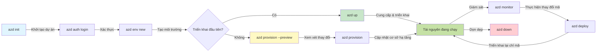
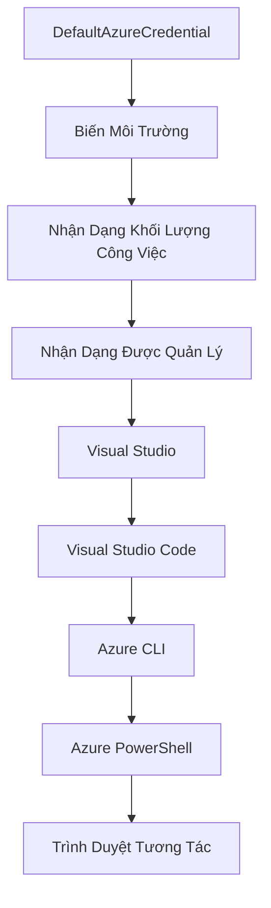

# AZD Cơ Bản - Hiểu về Azure Developer CLI

# AZD Cơ Bản - Các Khái Niệm và Nền Tảng Cốt Lõi

**Mục Lục Chương:**
- **📚 Trang Chủ Khóa Học**: [AZD Dành Cho Người Mới Bắt Đầu](../../README.md)
- **📖 Chương Hiện Tại**: Chương 1 - Nền Tảng & Bắt Đầu Nhanh
- **⬅️ Trước**: [Tổng Quan Khóa Học](../../README.md#-chapter-1-foundation--quick-start)
- **➡️ Tiếp Theo**: [Cài Đặt & Thiết Lập](installation.md)
- **🚀 Chương Tiếp Theo**: [Chương 2: Phát Triển Ưu Tiên AI](../microsoft-foundry/microsoft-foundry-integration.md)

## Giới Thiệu

Bài học này sẽ giới thiệu bạn về Azure Developer CLI (azd), một công cụ dòng lệnh mạnh mẽ giúp tăng tốc hành trình từ phát triển cục bộ đến triển khai trên Azure. Bạn sẽ học các khái niệm cơ bản, tính năng cốt lõi và hiểu cách azd đơn giản hóa việc triển khai ứng dụng cloud-native.

## Mục Tiêu Học Tập

Sau bài học này, bạn sẽ:
- Hiểu Azure Developer CLI là gì và mục đích chính của nó
- Tìm hiểu các khái niệm cốt lõi về templates, environments và services
- Khám phá các tính năng chính bao gồm phát triển dựa trên template và Infrastructure as Code
- Hiểu cấu trúc dự án và quy trình làm việc của azd
- Sẵn sàng cài đặt và cấu hình azd cho môi trường phát triển của bạn

## Kết Quả Học Tập

Sau khi hoàn thành bài học này, bạn sẽ có thể:
- Giải thích vai trò của azd trong quy trình phát triển cloud hiện đại
- Xác định các thành phần của cấu trúc dự án azd
- Mô tả cách templates, environments và services hoạt động cùng nhau
- Hiểu lợi ích của Infrastructure as Code với azd
- Nhận biết các lệnh azd khác nhau và mục đích của chúng

## Azure Developer CLI (azd) là gì?

Azure Developer CLI (azd) là một công cụ dòng lệnh được thiết kế để tăng tốc hành trình từ phát triển cục bộ đến triển khai trên Azure. Nó đơn giản hóa quy trình xây dựng, triển khai và quản lý các ứng dụng cloud-native trên Azure.

### 🎯 Tại Sao Sử Dụng AZD? So Sánh Thực Tế

Hãy so sánh việc triển khai một ứng dụng web đơn giản với cơ sở dữ liệu:

#### ❌ KHÔNG DÙNG AZD: Triển Khai Thủ Công Trên Azure (30+ phút)

```bash
# Bước 1: Tạo nhóm tài nguyên
az group create --name myapp-rg --location eastus

# Bước 2: Tạo App Service Plan
az appservice plan create --name myapp-plan \
  --resource-group myapp-rg \
  --sku B1 --is-linux

# Bước 3: Tạo Web App
az webapp create --name myapp-web-unique123 \
  --resource-group myapp-rg \
  --plan myapp-plan \
  --runtime "NODE:18-lts"

# Bước 4: Tạo tài khoản Cosmos DB (10-15 phút)
az cosmosdb create --name myapp-cosmos-unique123 \
  --resource-group myapp-rg \
  --kind MongoDB

# Bước 5: Tạo cơ sở dữ liệu
az cosmosdb mongodb database create \
  --account-name myapp-cosmos-unique123 \
  --resource-group myapp-rg \
  --name tododb

# Bước 6: Tạo bộ sưu tập
az cosmosdb mongodb collection create \
  --account-name myapp-cosmos-unique123 \
  --resource-group myapp-rg \
  --database-name tododb \
  --name todos

# Bước 7: Lấy chuỗi kết nối
CONN_STR=$(az cosmosdb keys list \
  --name myapp-cosmos-unique123 \
  --resource-group myapp-rg \
  --type connection-strings \
  --query "connectionStrings[0].connectionString" -o tsv)

# Bước 8: Cấu hình cài đặt ứng dụng
az webapp config appsettings set \
  --name myapp-web-unique123 \
  --resource-group myapp-rg \
  --settings MONGODB_URI="$CONN_STR"

# Bước 9: Bật ghi nhật ký
az webapp log config --name myapp-web-unique123 \
  --resource-group myapp-rg \
  --application-logging filesystem \
  --detailed-error-messages true

# Bước 10: Thiết lập Application Insights
az monitor app-insights component create \
  --app myapp-insights \
  --location eastus \
  --resource-group myapp-rg

# Bước 11: Liên kết App Insights với Web App
INSTRUMENTATION_KEY=$(az monitor app-insights component show \
  --app myapp-insights \
  --resource-group myapp-rg \
  --query "instrumentationKey" -o tsv)

az webapp config appsettings set \
  --name myapp-web-unique123 \
  --resource-group myapp-rg \
  --settings APPINSIGHTS_INSTRUMENTATIONKEY="$INSTRUMENTATION_KEY"

# Bước 12: Xây dựng ứng dụng cục bộ
npm install
npm run build

# Bước 13: Tạo gói triển khai
zip -r app.zip . -x "*.git*" "node_modules/*"

# Bước 14: Triển khai ứng dụng
az webapp deployment source config-zip \
  --resource-group myapp-rg \
  --name myapp-web-unique123 \
  --src app.zip

# Bước 15: Chờ đợi và cầu nguyện nó hoạt động 🙏
# (Không có xác thực tự động, cần kiểm tra thủ công)
```

**Vấn Đề:**
- ❌ 15+ lệnh cần nhớ và thực thi theo thứ tự
- ❌ 30-45 phút làm việc thủ công
- ❌ Dễ mắc lỗi (gõ sai, tham số sai)
- ❌ Chuỗi kết nối bị lộ trong lịch sử terminal
- ❌ Không có rollback tự động nếu xảy ra lỗi
- ❌ Khó tái tạo cho các thành viên trong nhóm
- ❌ Mỗi lần triển khai đều khác nhau (không nhất quán)

#### ✅ DÙNG AZD: Triển Khai Tự Động (5 lệnh, 10-15 phút)

```bash
# Bước 1: Khởi tạo từ mẫu
azd init --template todo-nodejs-mongo

# Bước 2: Xác thực
azd auth login

# Bước 3: Tạo môi trường
azd env new dev

# Bước 4: Xem trước các thay đổi (tùy chọn nhưng được khuyến nghị)
azd provision --preview

# Bước 5: Triển khai mọi thứ
azd up

# ✨ Hoàn tất! Mọi thứ đã được triển khai, cấu hình và giám sát
```

**Lợi Ích:**
- ✅ **5 lệnh** so với 15+ bước thủ công
- ✅ **10-15 phút** tổng thời gian (chủ yếu chờ Azure)
- ✅ **Không lỗi** - tự động và đã được kiểm tra
- ✅ **Quản lý bí mật an toàn** qua Key Vault
- ✅ **Rollback tự động** khi có lỗi
- ✅ **Hoàn toàn tái tạo** - kết quả giống nhau mỗi lần
- ✅ **Sẵn sàng cho nhóm** - ai cũng có thể triển khai với cùng lệnh
- ✅ **Infrastructure as Code** - template Bicep được kiểm soát phiên bản
- ✅ **Giám sát tích hợp** - Application Insights được cấu hình tự động

### 📊 Giảm Thời Gian & Lỗi

| Chỉ Số | Triển Khai Thủ Công | Triển Khai Với AZD | Cải Thiện |
|:-------|:--------------------|:-------------------|:----------|
| **Lệnh** | 15+ | 5 | Giảm 67% |
| **Thời Gian** | 30-45 phút | 10-15 phút | Nhanh hơn 60% |
| **Tỷ Lệ Lỗi** | ~40% | <5% | Giảm 88% |
| **Tính Nhất Quán** | Thấp (thủ công) | 100% (tự động) | Hoàn Hảo |
| **Onboarding Nhóm** | 2-4 giờ | 30 phút | Nhanh hơn 75% |
| **Thời Gian Rollback** | 30+ phút (thủ công) | 2 phút (tự động) | Nhanh hơn 93% |

## Các Khái Niệm Cốt Lõi

### Templates
Templates là nền tảng của azd. Chúng bao gồm:
- **Mã ứng dụng** - Mã nguồn và các phụ thuộc của bạn
- **Định nghĩa hạ tầng** - Tài nguyên Azure được định nghĩa bằng Bicep hoặc Terraform
- **Tệp cấu hình** - Cài đặt và biến môi trường
- **Script triển khai** - Quy trình triển khai tự động

### Environments
Environments đại diện cho các mục tiêu triển khai khác nhau:
- **Development** - Dành cho thử nghiệm và phát triển
- **Staging** - Môi trường tiền sản xuất
- **Production** - Môi trường sản xuất thực tế

Mỗi environment duy trì:
- Nhóm tài nguyên Azure riêng
- Cài đặt cấu hình riêng
- Trạng thái triển khai riêng

### Services
Services là các khối xây dựng của ứng dụng của bạn:
- **Frontend** - Ứng dụng web, SPAs
- **Backend** - APIs, microservices
- **Database** - Giải pháp lưu trữ dữ liệu
- **Storage** - Lưu trữ file và blob

## Các Tính Năng Chính

### 1. Phát Triển Dựa Trên Template
```bash
# Duyệt các mẫu có sẵn
azd template list

# Khởi tạo từ một mẫu
azd init --template <template-name>
```

### 2. Infrastructure as Code
- **Bicep** - Ngôn ngữ đặc thù của Azure
- **Terraform** - Công cụ hạ tầng đa đám mây
- **ARM Templates** - Template Azure Resource Manager

### 3. Quy Trình Tích Hợp
```bash
# Hoàn thành quy trình triển khai
azd up            # Cung cấp + Triển khai, đây là tự động cho lần thiết lập đầu tiên

# 🧪 MỚI: Xem trước các thay đổi cơ sở hạ tầng trước khi triển khai (AN TOÀN)
azd provision --preview    # Mô phỏng triển khai cơ sở hạ tầng mà không thực hiện thay đổi

azd provision     # Tạo tài nguyên Azure nếu bạn cập nhật cơ sở hạ tầng, sử dụng cái này
azd deploy        # Triển khai mã ứng dụng hoặc triển khai lại mã ứng dụng sau khi cập nhật
azd down          # Dọn dẹp tài nguyên
```

#### 🛡️ Lập Kế Hoạch Hạ Tầng An Toàn Với Preview
Lệnh `azd provision --preview` là một bước đột phá cho triển khai an toàn:
- **Phân tích thử nghiệm** - Hiển thị những gì sẽ được tạo, sửa đổi hoặc xóa
- **Không rủi ro** - Không có thay đổi thực tế nào được thực hiện trên môi trường Azure của bạn
- **Hợp tác nhóm** - Chia sẻ kết quả preview trước khi triển khai
- **Ước tính chi phí** - Hiểu chi phí tài nguyên trước khi cam kết

```bash
# Quy trình xem trước ví dụ
azd provision --preview           # Xem những gì sẽ thay đổi
# Xem xét đầu ra, thảo luận với nhóm
azd provision                     # Áp dụng thay đổi một cách tự tin
```

### 📊 Hình Ảnh: Quy Trình Phát Triển Với AZD


**Giải Thích Quy Trình:**
1. **Init** - Bắt đầu với template hoặc dự án mới
2. **Auth** - Xác thực với Azure
3. **Environment** - Tạo môi trường triển khai riêng biệt
4. **Preview** - 🆕 Luôn preview thay đổi hạ tầng trước (thực hành an toàn)
5. **Provision** - Tạo/cập nhật tài nguyên Azure
6. **Deploy** - Đẩy mã ứng dụng của bạn
7. **Monitor** - Theo dõi hiệu suất ứng dụng
8. **Iterate** - Thực hiện thay đổi và triển khai lại mã
9. **Cleanup** - Xóa tài nguyên khi hoàn thành

### 4. Quản Lý Environments
```bash
# Tạo và quản lý môi trường
azd env new <environment-name>
azd env select <environment-name>
azd env list
```

## 📁 Cấu Trúc Dự Án

Một cấu trúc dự án azd điển hình:
```
my-app/
├── .azd/                    # azd configuration
│   └── config.json
├── .azure/                  # Azure deployment artifacts
├── .devcontainer/          # Development container config
├── .github/workflows/      # GitHub Actions
├── .vscode/               # VS Code settings
├── infra/                 # Infrastructure code
│   ├── main.bicep        # Main infrastructure template
│   ├── main.parameters.json
│   └── modules/          # Reusable modules
├── src/                  # Application source code
│   ├── api/             # Backend services
│   └── web/             # Frontend application
├── azure.yaml           # azd project configuration
└── README.md
```

## 🔧 Tệp Cấu Hình

### azure.yaml
Tệp cấu hình chính của dự án:
```yaml
name: my-awesome-app
metadata:
  template: my-template@1.0.0

services:
  web:
    project: ./src/web
    language: js
    host: appservice
  api:
    project: ./src/api
    language: js
    host: appservice

hooks:
  preprovision:
    shell: pwsh
    run: echo "Preparing to provision..."
```

### .azure/config.json
Cấu hình dành riêng cho môi trường:
```json
{
  "version": 1,
  "defaultEnvironment": "dev",
  "environments": {
    "dev": {
      "subscriptionId": "your-subscription-id",
      "location": "eastus"
    }
  }
}
```

## 🎪 Quy Trình Thông Thường Với Bài Tập Thực Hành

> **💡 Mẹo Học Tập:** Thực hiện các bài tập này theo thứ tự để phát triển kỹ năng AZD của bạn một cách tuần tự.

### 🎯 Bài Tập 1: Khởi Tạo Dự Án Đầu Tiên

**Mục Tiêu:** Tạo một dự án AZD và khám phá cấu trúc của nó

**Các Bước:**
```bash
# Sử dụng một mẫu đã được chứng minh
azd init --template todo-nodejs-mongo

# Khám phá các tệp đã được tạo
ls -la  # Xem tất cả các tệp bao gồm cả tệp ẩn

# Các tệp chính được tạo:
# - azure.yaml (cấu hình chính)
# - infra/ (mã hạ tầng)
# - src/ (mã ứng dụng)
```

**✅ Thành Công:** Bạn có các thư mục azure.yaml, infra/, và src/

---

### 🎯 Bài Tập 2: Triển Khai Lên Azure

**Mục Tiêu:** Hoàn thành triển khai từ đầu đến cuối

**Các Bước:**
```bash
# 1. Xác thực
az login && azd auth login

# 2. Tạo môi trường
azd env new dev
azd env set AZURE_LOCATION eastus

# 3. Xem trước các thay đổi (KHUYẾN NGHỊ)
azd provision --preview

# 4. Triển khai mọi thứ
azd up

# 5. Xác minh triển khai
azd show    # Xem URL ứng dụng của bạn
```

**Thời Gian Dự Kiến:** 10-15 phút  
**✅ Thành Công:** URL ứng dụng mở trong trình duyệt

---

### 🎯 Bài Tập 3: Nhiều Environments

**Mục Tiêu:** Triển khai lên dev và staging

**Các Bước:**
```bash
# Đã có dev, tạo staging
azd env new staging
azd env set AZURE_LOCATION westus2
azd up

# Chuyển đổi giữa chúng
azd env list
azd env select dev
```

**✅ Thành Công:** Hai nhóm tài nguyên riêng biệt trong Azure Portal

---

### 🛡️ Làm Mới Hoàn Toàn: `azd down --force --purge`

Khi bạn cần đặt lại hoàn toàn:

```bash
azd down --force --purge
```

**Những gì lệnh này làm:**
- `--force`: Không có yêu cầu xác nhận
- `--purge`: Xóa toàn bộ trạng thái cục bộ và tài nguyên Azure

**Sử dụng khi:**
- Triển khai bị lỗi giữa chừng
- Chuyển đổi dự án
- Cần bắt đầu lại từ đầu

---

## 🎪 Tham Khảo Quy Trình Gốc

### Bắt Đầu Một Dự Án Mới
```bash
# Phương pháp 1: Sử dụng mẫu hiện có
azd init --template todo-nodejs-mongo

# Phương pháp 2: Bắt đầu từ đầu
azd init

# Phương pháp 3: Sử dụng thư mục hiện tại
azd init .
```

### Chu Kỳ Phát Triển
```bash
# Thiết lập môi trường phát triển
azd auth login
azd env new dev
azd env select dev

# Triển khai mọi thứ
azd up

# Thực hiện thay đổi và triển khai lại
azd deploy

# Dọn dẹp khi hoàn thành
azd down --force --purge # lệnh trong Azure Developer CLI là một **đặt lại cứng** cho môi trường của bạn—đặc biệt hữu ích khi bạn đang khắc phục sự cố triển khai thất bại, dọn dẹp tài nguyên mồ côi hoặc chuẩn bị cho một lần triển khai lại mới.
```

## Hiểu `azd down --force --purge`
Lệnh `azd down --force --purge` là cách mạnh mẽ để xóa hoàn toàn môi trường azd và tất cả các tài nguyên liên quan. Đây là phân tích chi tiết về từng tham số:
```
--force
```
- Bỏ qua các yêu cầu xác nhận.
- Hữu ích cho tự động hóa hoặc kịch bản không cần nhập liệu thủ công.
- Đảm bảo quá trình xóa diễn ra mà không bị gián đoạn, ngay cả khi CLI phát hiện sự không nhất quán.

```
--purge
```
Xóa **tất cả metadata liên quan**, bao gồm:
Trạng thái môi trường
Thư mục `.azure` cục bộ
Thông tin triển khai được lưu trữ
Ngăn azd "nhớ" các triển khai trước đó, điều này có thể gây ra các vấn đề như không khớp nhóm tài nguyên hoặc tham chiếu registry cũ.

### Tại Sao Sử Dụng Cả Hai?
Khi bạn gặp vấn đề với `azd up` do trạng thái còn sót lại hoặc triển khai không hoàn chỉnh, sự kết hợp này đảm bảo một **khởi đầu sạch sẽ**.

Điều này đặc biệt hữu ích sau khi xóa tài nguyên thủ công trong Azure Portal hoặc khi chuyển đổi template, environments hoặc quy ước đặt tên nhóm tài nguyên.

### Quản Lý Nhiều Environments
```bash
# Tạo môi trường dàn dựng
azd env new staging
azd env select staging
azd up

# Chuyển lại sang dev
azd env select dev

# So sánh các môi trường
azd env list
```

## 🔐 Xác Thực và Thông Tin Đăng Nhập

Hiểu về xác thực là rất quan trọng để triển khai azd thành công. Azure sử dụng nhiều phương pháp xác thực khác nhau, và azd tận dụng cùng một chuỗi thông tin đăng nhập được sử dụng bởi các công cụ Azure khác.

### Xác Thực Azure CLI (`az login`)

Trước khi sử dụng azd, bạn cần xác thực với Azure. Phương pháp phổ biến nhất là sử dụng Azure CLI:

```bash
# Đăng nhập tương tác (mở trình duyệt)
az login

# Đăng nhập với tenant cụ thể
az login --tenant <tenant-id>

# Đăng nhập với service principal
az login --service-principal -u <app-id> -p <password> --tenant <tenant-id>

# Kiểm tra trạng thái đăng nhập hiện tại
az account show

# Liệt kê các subscription có sẵn
az account list --output table

# Đặt subscription mặc định
az account set --subscription <subscription-id>
```

### Quy Trình Xác Thực
1. **Đăng Nhập Tương Tác**: Mở trình duyệt mặc định của bạn để xác thực
2. **Device Code Flow**: Dành cho các môi trường không có quyền truy cập trình duyệt
3. **Service Principal**: Dành cho các kịch bản tự động hóa và CI/CD
4. **Managed Identity**: Dành cho các ứng dụng được lưu trữ trên Azure

### Chuỗi DefaultAzureCredential

`DefaultAzureCredential` là một loại thông tin đăng nhập cung cấp trải nghiệm xác thực đơn giản bằng cách tự động thử nhiều nguồn thông tin đăng nhập theo một thứ tự cụ thể:

#### Thứ Tự Chuỗi Thông Tin Đăng Nhập

#### 1. Biến Môi Trường
```bash
# Đặt các biến môi trường cho dịch vụ chính
export AZURE_CLIENT_ID="<app-id>"
export AZURE_CLIENT_SECRET="<password>"
export AZURE_TENANT_ID="<tenant-id>"
```

#### 2. Workload Identity (Kubernetes/GitHub Actions)
Được sử dụng tự động trong:
- Azure Kubernetes Service (AKS) với Workload Identity
- GitHub Actions với OIDC federation
- Các kịch bản nhận dạng liên kết khác

#### 3. Managed Identity
Dành cho các tài nguyên Azure như:
- Virtual Machines
- App Service
- Azure Functions
- Container Instances

```bash
# Kiểm tra xem có đang chạy trên tài nguyên Azure với danh tính được quản lý không
az account show --query "user.type" --output tsv
# Trả về: "servicePrincipal" nếu sử dụng danh tính được quản lý
```

#### 4. Tích Hợp Công Cụ Phát Triển
- **Visual Studio**: Tự động sử dụng tài khoản đã đăng nhập
- **VS Code**: Sử dụng thông tin đăng nhập từ tiện ích Azure Account
- **Azure CLI**: Sử dụng thông tin đăng nhập từ `az login` (phổ biến nhất cho phát triển cục bộ)

### Thiết Lập Xác Thực AZD

```bash
# Phương pháp 1: Sử dụng Azure CLI (Khuyến nghị cho phát triển)
az login
azd auth login  # Sử dụng thông tin đăng nhập Azure CLI hiện có

# Phương pháp 2: Xác thực trực tiếp azd
azd auth login --use-device-code  # Dành cho môi trường không có giao diện

# Phương pháp 3: Kiểm tra trạng thái xác thực
azd auth login --check-status

# Phương pháp 4: Đăng xuất và xác thực lại
azd auth logout
azd auth login
```

### Thực Hành Tốt Nhất Về Xác Thực

#### Đối Với Phát Triển Cục Bộ
```bash
# 1. Đăng nhập với Azure CLI
az login

# 2. Xác minh đăng ký đúng
az account show
az account set --subscription "Your Subscription Name"

# 3. Sử dụng azd với thông tin đăng nhập hiện có
azd auth login
```

#### Đối Với CI/CD Pipelines
```yaml
# GitHub Actions example
- name: Azure Login
  uses: azure/login@v1
  with:
    creds: ${{ secrets.AZURE_CREDENTIALS }}

- name: Deploy with azd
  run: |
    azd auth login --client-id ${{ secrets.AZURE_CLIENT_ID }} \
                    --client-secret ${{ secrets.AZURE_CLIENT_SECRET }} \
                    --tenant-id ${{ secrets.AZURE_TENANT_ID }}
    azd up --no-prompt
```

#### Đối Với Môi Trường Sản Xuất
- Sử dụng **Managed Identity** khi chạy trên tài nguyên Azure
- Sử dụng **Service Principal** cho các kịch bản tự động hóa
- Tránh lưu trữ thông tin đăng nhập trong mã hoặc tệp cấu hình
- Sử dụng **Azure Key Vault** cho cấu hình nhạy cảm

### Các Vấn Đề Xác Thực Thường Gặp và Giải Pháp

#### Vấn Đề: "Không tìm thấy subscription"
```bash
# Giải pháp: Đặt đăng ký mặc định
az account list --output table
az account set --subscription "<subscription-id>"
azd env set AZURE_SUBSCRIPTION_ID "<subscription-id>"
```

#### Vấn Đề: "Không đủ quyền"
```bash
# Giải pháp: Kiểm tra và gán các vai trò cần thiết
az role assignment list --assignee $(az account show --query user.name --output tsv)

# Các vai trò cần thiết phổ biến:
# - Người đóng góp (để quản lý tài nguyên)
# - Quản trị viên truy cập người dùng (để gán vai trò)
```

#### Vấn Đề: "Token hết hạn"
```bash
# Giải pháp: Xác thực lại
az logout
az login
azd auth logout
azd auth login
```

### Xác Thực Trong Các Kịch Bản Khác Nhau

#### Phát Triển Cục Bộ
```bash
# Tài khoản phát triển cá nhân
az login
azd auth login
```

#### Phát Triển Nhóm
```bash
# Sử dụng người thuê cụ thể cho tổ chức
az login --tenant contoso.onmicrosoft.com
azd auth login
```

#### Kịch Bản Multi-tenant
```bash
# Chuyển đổi giữa các tenant
az login --tenant tenant1.onmicrosoft.com
# Triển khai đến tenant 1
azd up

az login --tenant tenant2.onmicrosoft.com  
# Triển khai đến tenant 2
azd up
```

### Cân Nhắc Về Bảo Mật

1. **Lưu Trữ Thông Tin Đăng Nhập**: Không bao giờ lưu thông tin đăng nhập trong mã nguồn
2. **Giới Hạn Phạm Vi**: Sử dụng nguyên tắc quyền tối thiểu cho service principals
3. **Xoay Vòng Token**: Thường xuyên thay đổi bí mật của service principal
4. **Dấu Vết Kiểm Toán**: Theo dõi các hoạt động xác thực và triển khai
5. **Bảo Mật Mạng**: Sử dụng các endpoint riêng tư khi có thể

### Khắc Phục Sự Cố Xác Thực

```bash
# Gỡ lỗi các vấn đề xác thực
azd auth login --check-status
az account show
az account get-access-token

# Các lệnh chẩn đoán phổ biến
whoami                          # Ngữ cảnh người dùng hiện tại
az ad signed-in-user show      # Chi tiết người dùng Azure AD
az group list                  # Kiểm tra quyền truy cập tài nguyên
```

## Hiểu `azd down --force --purge`

### Khám Phá
```bash
azd template list              # Duyệt mẫu
azd template show <template>   # Chi tiết mẫu
azd init --help               # Tùy chọn khởi tạo
```

### Quản Lý Dự Án
```bash
azd show                     # Tổng quan dự án
azd env show                 # Môi trường hiện tại
azd config list             # Cài đặt cấu hình
```

### Giám Sát
```bash
azd monitor                  # Mở cổng thông tin Azure
azd pipeline config          # Thiết lập CI/CD
azd logs                     # Xem nhật ký ứng dụng
```

## Thực Hành Tốt Nhất

### 1. Sử Dụng Tên Có Ý Nghĩa
```bash
# Tốt
azd env new production-east
azd init --template web-app-secure

# Tránh
azd env new env1
azd init --template template1
```

### 2. Tận Dụng Templates
- Bắt đầu với các template có sẵn
- Tùy chỉnh theo nhu cầu của bạn
- Tạo các template có thể tái sử dụng cho tổ chức của bạn

### 3. Cách Ly Environments
- Sử dụng các environments riêng biệt cho dev/staging/prod
- Không bao giờ triển khai trực tiếp lên production từ máy cục bộ
- Sử dụng CI/CD pipelines cho các triển khai production

### 4. Quản Lý Cấu Hình
- Sử dụng biến môi trường cho dữ liệu nhạy cảm
- Lưu trữ cấu hình trong hệ thống kiểm soát phiên bản
- Ghi chú các cài đặt cụ thể cho từng environment

## Lộ Trình Học Tập

### Người Mới Bắt Đầu (Tuần 1-2)
1. Cài đặt azd và xác thực
2. Triển khai một template đơn giản
3. Hiểu cấu trúc dự án
4. Học các lệnh cơ bản (up, down, deploy)

### Trung Cấp (Tuần 3-4)
1. Tùy chỉnh templates
2. Quản lý nhiều environments
3. Hiểu về mã hạ tầng
4. Thiết lập CI/CD pipelines

### Nâng Cao (Tuần 5+)
1. Tạo template tùy chỉnh
2. Các mẫu hạ tầng nâng cao
3. Triển khai đa khu vực
4. Cấu hình cấp doanh nghiệp

## Bước Tiếp Theo

**📖 Tiếp Tục Học Chương 1:**
- [Cài đặt & Thiết lập](installation.md) - Cài đặt và cấu hình azd
- [Dự án đầu tiên của bạn](first-project.md) - Hướng dẫn thực hành hoàn chỉnh
- [Hướng dẫn cấu hình](configuration.md) - Tùy chọn cấu hình nâng cao

**🎯 Sẵn sàng cho chương tiếp theo?**
- [Chương 2: Phát triển ưu tiên AI](../microsoft-foundry/microsoft-foundry-integration.md) - Bắt đầu xây dựng ứng dụng AI

## Tài nguyên bổ sung

- [Tổng quan về Azure Developer CLI](https://learn.microsoft.com/en-us/azure/developer/azure-developer-cli/)
- [Thư viện mẫu](https://azure.github.io/awesome-azd/)
- [Mẫu cộng đồng](https://github.com/Azure-Samples)

---

## 🙋 Câu hỏi thường gặp

### Câu hỏi chung

**Hỏi: Sự khác biệt giữa AZD và Azure CLI là gì?**

Đáp: Azure CLI (`az`) dùng để quản lý từng tài nguyên Azure riêng lẻ. AZD (`azd`) dùng để quản lý toàn bộ ứng dụng:

```bash
# Azure CLI - Quản lý tài nguyên cấp thấp
az webapp create --name myapp --resource-group rg
az sql server create --name myserver --resource-group rg
# ...cần nhiều lệnh hơn nữa

# AZD - Quản lý cấp ứng dụng
azd up  # Triển khai toàn bộ ứng dụng với tất cả tài nguyên
```

**Hãy nghĩ theo cách này:**
- `az` = Làm việc với từng viên gạch Lego
- `azd` = Làm việc với bộ Lego hoàn chỉnh

---

**Hỏi: Tôi có cần biết Bicep hoặc Terraform để sử dụng AZD không?**

Đáp: Không! Bắt đầu với các mẫu:
```bash
# Sử dụng mẫu hiện có - không cần kiến thức IaC
azd init --template todo-nodejs-mongo
azd up
```

Bạn có thể học Bicep sau để tùy chỉnh hạ tầng. Các mẫu cung cấp ví dụ hoạt động để bạn học hỏi.

---

**Hỏi: Chi phí để chạy các mẫu AZD là bao nhiêu?**

Đáp: Chi phí thay đổi theo từng mẫu. Hầu hết các mẫu phát triển có chi phí từ $50-150/tháng:

```bash
# Xem trước chi phí trước khi triển khai
azd provision --preview

# Luôn dọn dẹp khi không sử dụng
azd down --force --purge  # Xóa tất cả tài nguyên
```

**Mẹo chuyên nghiệp:** Sử dụng các gói miễn phí nếu có:
- App Service: Gói F1 (Miễn phí)
- Azure OpenAI: 50,000 token/tháng miễn phí
- Cosmos DB: Gói miễn phí 1000 RU/s

---

**Hỏi: Tôi có thể sử dụng AZD với các tài nguyên Azure hiện có không?**

Đáp: Có, nhưng bắt đầu mới sẽ dễ dàng hơn. AZD hoạt động tốt nhất khi quản lý toàn bộ vòng đời. Đối với các tài nguyên hiện có:

```bash
# Tùy chọn 1: Nhập tài nguyên hiện có (nâng cao)
azd init
# Sau đó sửa đổi infra/ để tham chiếu đến tài nguyên hiện có

# Tùy chọn 2: Bắt đầu mới (khuyến nghị)
azd init --template matching-your-stack
azd up  # Tạo môi trường mới
```

---

**Hỏi: Làm thế nào để tôi chia sẻ dự án của mình với đồng đội?**

Đáp: Đưa dự án AZD vào Git (nhưng KHÔNG đưa thư mục .azure):

```bash
# Đã có trong .gitignore theo mặc định
.azure/        # Chứa thông tin bí mật và dữ liệu môi trường
*.env          # Các biến môi trường

# Các thành viên trong nhóm sau đó:
git clone <your-repo>
azd auth login
azd env new <their-name>-dev
azd up
```

Mọi người sẽ nhận được hạ tầng giống hệt nhau từ các mẫu giống nhau.

---

### Câu hỏi khắc phục sự cố

**Hỏi: "azd up" bị lỗi giữa chừng. Tôi nên làm gì?**

Đáp: Kiểm tra lỗi, sửa lỗi, sau đó thử lại:

```bash
# Xem nhật ký chi tiết
azd show

# Các cách khắc phục phổ biến:

# 1. Nếu vượt quá hạn mức:
azd env set AZURE_LOCATION "westus2"  # Thử khu vực khác

# 2. Nếu xung đột tên tài nguyên:
azd down --force --purge  # Làm mới hoàn toàn
azd up  # Thử lại

# 3. Nếu xác thực hết hạn:
az login
azd auth login
azd up
```

**Vấn đề phổ biến nhất:** Chọn sai đăng ký Azure
```bash
az account list --output table
az account set --subscription "<correct-subscription>"
```

---

**Hỏi: Làm thế nào để triển khai chỉ thay đổi mã mà không cần tái cấu hình?**

Đáp: Sử dụng `azd deploy` thay vì `azd up`:

```bash
azd up          # Lần đầu tiên: cung cấp + triển khai (chậm)

# Thực hiện thay đổi mã...

azd deploy      # Các lần sau: chỉ triển khai (nhanh)
```

So sánh tốc độ:
- `azd up`: 10-15 phút (cấu hình hạ tầng)
- `azd deploy`: 2-5 phút (chỉ mã)

---

**Hỏi: Tôi có thể tùy chỉnh các mẫu hạ tầng không?**

Đáp: Có! Chỉnh sửa các tệp Bicep trong `infra/`:

```bash
# Sau khi azd init
cd infra/
code main.bicep  # Chỉnh sửa trong VS Code

# Xem trước các thay đổi
azd provision --preview

# Áp dụng các thay đổi
azd provision
```

**Mẹo:** Bắt đầu nhỏ - thay đổi các SKUs trước:
```bicep
// infra/main.bicep
sku: {
  name: 'B1'  // Change to 'P1V2' for production
}
```

---

**Hỏi: Làm thế nào để xóa mọi thứ AZD đã tạo?**

Đáp: Một lệnh sẽ xóa tất cả tài nguyên:

```bash
azd down --force --purge

# Điều này xóa:
# - Tất cả tài nguyên Azure
# - Nhóm tài nguyên
# - Trạng thái môi trường cục bộ
# - Dữ liệu triển khai được lưu trong bộ nhớ đệm
```

**Luôn chạy lệnh này khi:**
- Hoàn thành thử nghiệm một mẫu
- Chuyển sang dự án khác
- Muốn bắt đầu lại từ đầu

**Tiết kiệm chi phí:** Xóa tài nguyên không sử dụng = không có chi phí

---

**Hỏi: Nếu tôi vô tình xóa tài nguyên trong Azure Portal thì sao?**

Đáp: Trạng thái AZD có thể bị mất đồng bộ. Cách tiếp cận làm mới:

```bash
# 1. Xóa trạng thái cục bộ
azd down --force --purge

# 2. Bắt đầu lại từ đầu
azd up

# Lựa chọn thay thế: Để AZD phát hiện và sửa chữa
azd provision  # Sẽ tạo các tài nguyên bị thiếu
```

---

### Câu hỏi nâng cao

**Hỏi: Tôi có thể sử dụng AZD trong các pipeline CI/CD không?**

Đáp: Có! Ví dụ GitHub Actions:

```yaml
# .github/workflows/deploy.yml
name: Deploy with AZD

on:
  push:
    branches: [main]

jobs:
  deploy:
    runs-on: ubuntu-latest
    steps:
      - uses: actions/checkout@v2
      
      - name: Install azd
        run: curl -fsSL https://aka.ms/install-azd.sh | bash
      
      - name: Azure Login
        run: |
          azd auth login \
            --client-id ${{ secrets.AZURE_CLIENT_ID }} \
            --client-secret ${{ secrets.AZURE_CLIENT_SECRET }} \
            --tenant-id ${{ secrets.AZURE_TENANT_ID }}
      
      - name: Deploy
        run: azd up --no-prompt
```

---

**Hỏi: Làm thế nào để xử lý bí mật và dữ liệu nhạy cảm?**

Đáp: AZD tích hợp tự động với Azure Key Vault:

```bash
# Bí mật được lưu trữ trong Key Vault, không phải trong mã
azd env set DATABASE_PASSWORD "$(openssl rand -base64 32)"

# AZD tự động:
# 1. Tạo Key Vault
# 2. Lưu trữ bí mật
# 3. Cấp quyền truy cập ứng dụng thông qua Managed Identity
# 4. Tiêm vào lúc chạy
```

**Không bao giờ commit:**
- Thư mục `.azure/` (chứa dữ liệu môi trường)
- Tệp `.env` (bí mật cục bộ)
- Chuỗi kết nối

---

**Hỏi: Tôi có thể triển khai đến nhiều vùng không?**

Đáp: Có, tạo môi trường cho mỗi vùng:

```bash
# Môi trường Đông Hoa Kỳ
azd env new prod-eastus
azd env set AZURE_LOCATION eastus
azd up

# Môi trường Tây Âu
azd env new prod-westeurope
azd env set AZURE_LOCATION westeurope
azd up

# Mỗi môi trường là độc lập
azd env list
```

Đối với ứng dụng đa vùng thực sự, tùy chỉnh các mẫu Bicep để triển khai đồng thời đến nhiều vùng.

---

**Hỏi: Tôi có thể tìm sự trợ giúp ở đâu nếu gặp khó khăn?**

1. **Tài liệu AZD:** https://learn.microsoft.com/azure/developer/azure-developer-cli/
2. **GitHub Issues:** https://github.com/Azure/azure-dev/issues
3. **Discord:** [Azure Discord](https://discord.gg/microsoft-azure) - kênh #azure-developer-cli
4. **Stack Overflow:** Tag `azure-developer-cli`
5. **Khóa học này:** [Hướng dẫn khắc phục sự cố](../troubleshooting/common-issues.md)

**Mẹo chuyên nghiệp:** Trước khi hỏi, chạy:
```bash
azd show       # Hiển thị trạng thái hiện tại
azd version    # Hiển thị phiên bản của bạn
```
Bao gồm thông tin này trong câu hỏi của bạn để được hỗ trợ nhanh hơn.

---

## 🎓 Tiếp theo là gì?

Bạn đã hiểu các nguyên tắc cơ bản của AZD. Chọn con đường của bạn:

### 🎯 Dành cho người mới bắt đầu:
1. **Tiếp theo:** [Cài đặt & Thiết lập](installation.md) - Cài đặt AZD trên máy của bạn
2. **Sau đó:** [Dự án đầu tiên của bạn](first-project.md) - Triển khai ứng dụng đầu tiên của bạn
3. **Thực hành:** Hoàn thành tất cả 3 bài tập trong bài học này

### 🚀 Dành cho nhà phát triển AI:
1. **Bỏ qua đến:** [Chương 2: Phát triển ưu tiên AI](../microsoft-foundry/microsoft-foundry-integration.md)
2. **Triển khai:** Bắt đầu với `azd init --template get-started-with-ai-chat`
3. **Học hỏi:** Xây dựng trong khi triển khai

### 🏗️ Dành cho nhà phát triển có kinh nghiệm:
1. **Xem lại:** [Hướng dẫn cấu hình](configuration.md) - Cài đặt nâng cao
2. **Khám phá:** [Hạ tầng dưới dạng mã](../deployment/provisioning.md) - Tìm hiểu sâu về Bicep
3. **Xây dựng:** Tạo mẫu tùy chỉnh cho stack của bạn

---

**Điều hướng chương:**
- **📚 Trang chủ khóa học**: [AZD Dành cho Người mới bắt đầu](../../README.md)
- **📖 Chương hiện tại**: Chương 1 - Nền tảng & Bắt đầu nhanh  
- **⬅️ Trước đó**: [Tổng quan khóa học](../../README.md#-chapter-1-foundation--quick-start)
- **➡️ Tiếp theo**: [Cài đặt & Thiết lập](installation.md)
- **🚀 Chương tiếp theo**: [Chương 2: Phát triển ưu tiên AI](../microsoft-foundry/microsoft-foundry-integration.md)

---

<!-- CO-OP TRANSLATOR DISCLAIMER START -->
**Tuyên bố miễn trừ trách nhiệm**:  
Tài liệu này đã được dịch bằng dịch vụ dịch thuật AI [Co-op Translator](https://github.com/Azure/co-op-translator). Mặc dù chúng tôi cố gắng đảm bảo độ chính xác, xin lưu ý rằng các bản dịch tự động có thể chứa lỗi hoặc không chính xác. Tài liệu gốc bằng ngôn ngữ bản địa nên được coi là nguồn thông tin chính thức. Đối với thông tin quan trọng, nên sử dụng dịch vụ dịch thuật chuyên nghiệp của con người. Chúng tôi không chịu trách nhiệm cho bất kỳ sự hiểu lầm hoặc diễn giải sai nào phát sinh từ việc sử dụng bản dịch này.
<!-- CO-OP TRANSLATOR DISCLAIMER END -->