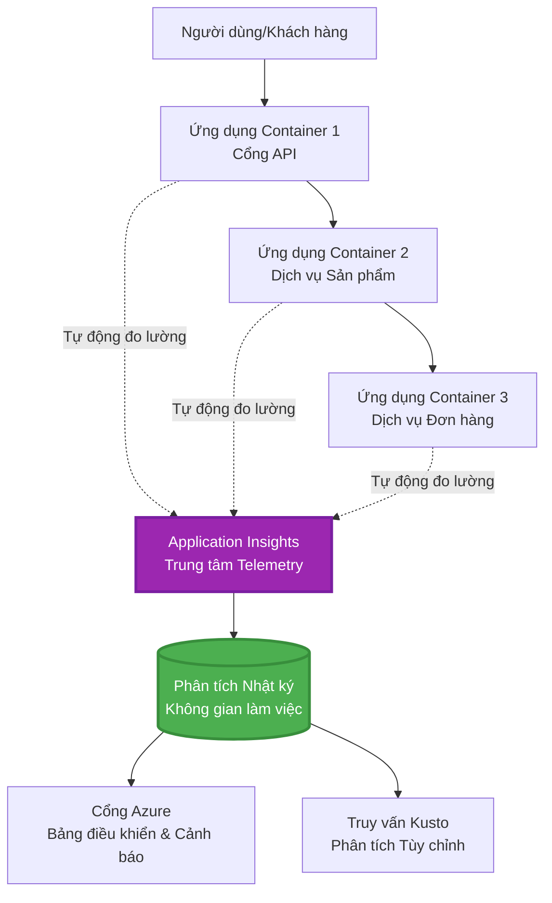
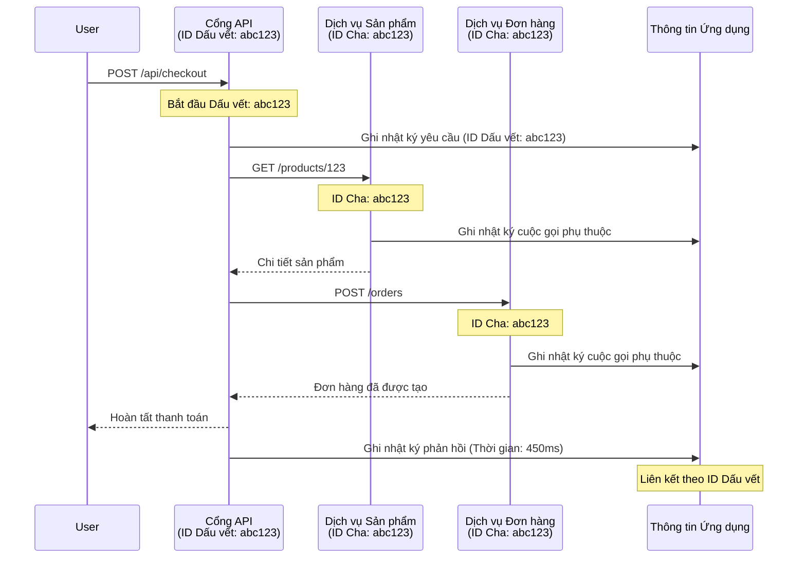

# Tích hợp Application Insights với AZD

⏱️ **Thời gian ước tính**: 40-50 phút | 💰 **Chi phí dự kiến**: ~$5-15/tháng | ⭐ **Độ phức tạp**: Trung bình

**📚 Lộ trình học:**
- ← Trước: [Kiểm tra trước khi triển khai](preflight-checks.md) - Xác thực trước khi triển khai
- 🎯 **Bạn đang ở đây**: Tích hợp Application Insights (Giám sát, telemetry, gỡ lỗi)
- → Tiếp theo: [Hướng dẫn triển khai](../deployment/deployment-guide.md) - Triển khai lên Azure
- 🏠 [Trang chủ khóa học](../../README.md)

---

## Những gì bạn sẽ học

Hoàn thành bài học này, bạn sẽ:
- Tích hợp **Application Insights** vào các dự án AZD một cách tự động
- Cấu hình **truy vết phân tán** cho các dịch vụ vi mô
- Triển khai **telemetry tùy chỉnh** (metrics, sự kiện, phụ thuộc)
- Thiết lập **live metrics** để giám sát thời gian thực
- Tạo **cảnh báo và bảng điều khiển** từ các triển khai AZD
- Gỡ lỗi các vấn đề sản xuất với **truy vấn telemetry**
- Tối ưu hóa **chi phí và chiến lược sampling**
- Giám sát **ứng dụng AI/LLM** (tokens, độ trễ, chi phí)

## Tại sao Application Insights với AZD lại quan trọng

### Thách thức: Khả năng quan sát trong sản xuất

**Không có Application Insights:**
```
❌ No visibility into production behavior
❌ Manual log aggregation across services
❌ Reactive debugging (wait for customer complaints)
❌ No performance metrics
❌ Cannot trace requests across services
❌ Unknown failure rates and bottlenecks
```

**Có Application Insights + AZD:**
```
✅ Automatic telemetry collection
✅ Centralized logs from all services
✅ Proactive issue detection
✅ End-to-end request tracing
✅ Performance metrics and insights
✅ Real-time dashboards
✅ AZD provisions everything automatically
```

**Ví dụ**: Application Insights giống như có một "hộp đen" ghi lại chuyến bay + bảng điều khiển buồng lái cho ứng dụng của bạn. Bạn có thể thấy mọi thứ đang diễn ra trong thời gian thực và phát lại bất kỳ sự cố nào.

---

## Tổng quan kiến trúc

### Application Insights trong kiến trúc AZD


### Những gì được giám sát tự động

| Loại Telemetry | Những gì nó ghi lại | Trường hợp sử dụng |
|----------------|---------------------|--------------------|
| **Requests** | Yêu cầu HTTP, mã trạng thái, thời gian | Giám sát hiệu suất API |
| **Dependencies** | Các cuộc gọi bên ngoài (DB, API, lưu trữ) | Xác định điểm nghẽn |
| **Exceptions** | Lỗi không xử lý với stack trace | Gỡ lỗi lỗi |
| **Custom Events** | Sự kiện kinh doanh (đăng ký, mua hàng) | Phân tích và phễu |
| **Metrics** | Bộ đếm hiệu suất, metrics tùy chỉnh | Lập kế hoạch năng lực |
| **Traces** | Tin nhắn log với mức độ nghiêm trọng | Gỡ lỗi và kiểm toán |
| **Availability** | Kiểm tra thời gian hoạt động và thời gian phản hồi | Giám sát SLA |

---

## Yêu cầu trước

### Công cụ cần thiết

```bash
# Xác minh Azure Developer CLI
azd version
# ✅ Mong đợi: azd phiên bản 1.0.0 hoặc cao hơn

# Xác minh Azure CLI
az --version
# ✅ Mong đợi: azure-cli 2.50.0 hoặc cao hơn
```

### Yêu cầu Azure

- Đăng ký Azure đang hoạt động
- Quyền để tạo:
  - Tài nguyên Application Insights
  - Không gian làm việc Log Analytics
  - Container Apps
  - Nhóm tài nguyên

### Kiến thức cần thiết

Bạn nên đã hoàn thành:
- [Kiến thức cơ bản về AZD](../getting-started/azd-basics.md) - Các khái niệm cốt lõi của AZD
- [Cấu hình](../getting-started/configuration.md) - Thiết lập môi trường
- [Dự án đầu tiên](../getting-started/first-project.md) - Triển khai cơ bản

---

## Bài học 1: Application Insights tự động với AZD

### Cách AZD cung cấp Application Insights

AZD tự động tạo và cấu hình Application Insights khi bạn triển khai. Hãy xem cách nó hoạt động.

### Cấu trúc dự án

```
monitored-app/
├── azure.yaml                     # AZD configuration
├── infra/
│   ├── main.bicep                # Main infrastructure
│   ├── core/
│   │   └── monitoring.bicep      # Application Insights + Log Analytics
│   └── app/
│       └── api.bicep             # Container App with monitoring
└── src/
    ├── app.py                    # Application with telemetry
    ├── requirements.txt
    └── Dockerfile
```

---

### Bước 1: Cấu hình AZD (azure.yaml)

**Tệp: `azure.yaml`**

```yaml
name: monitored-app
metadata:
  template: monitored-app@1.0.0

services:
  api:
    project: ./src
    language: python
    host: containerapp

# AZD automatically provisions monitoring!
```

**Xong rồi!** AZD sẽ tạo Application Insights theo mặc định. Không cần cấu hình thêm cho giám sát cơ bản.

---

### Bước 2: Cơ sở hạ tầng giám sát (Bicep)

**Tệp: `infra/core/monitoring.bicep`**

```bicep
param logAnalyticsName string
param applicationInsightsName string
param location string = resourceGroup().location
param tags object = {}

// Log Analytics Workspace (required for Application Insights)
resource logAnalytics 'Microsoft.OperationalInsights/workspaces@2022-10-01' = {
  name: logAnalyticsName
  location: location
  tags: tags
  properties: {
    sku: {
      name: 'PerGB2018'  // Pay-as-you-go pricing
    }
    retentionInDays: 30  // Keep logs for 30 days
    features: {
      enableLogAccessUsingOnlyResourcePermissions: true
    }
  }
}

// Application Insights
resource applicationInsights 'Microsoft.Insights/components@2020-02-02' = {
  name: applicationInsightsName
  location: location
  tags: tags
  kind: 'web'
  properties: {
    Application_Type: 'web'
    WorkspaceResourceId: logAnalytics.id
    IngestionMode: 'LogAnalytics'
    publicNetworkAccessForIngestion: 'Enabled'
    publicNetworkAccessForQuery: 'Enabled'
  }
}

// Outputs for Container Apps
output logAnalyticsWorkspaceId string = logAnalytics.id
output logAnalyticsWorkspaceName string = logAnalytics.name
output applicationInsightsConnectionString string = applicationInsights.properties.ConnectionString
output applicationInsightsInstrumentationKey string = applicationInsights.properties.InstrumentationKey
output applicationInsightsName string = applicationInsights.name
```

---

### Bước 3: Kết nối Container App với Application Insights

**Tệp: `infra/app/api.bicep`**

```bicep
param name string
param location string
param tags object = {}
param containerAppsEnvironmentName string
param applicationInsightsConnectionString string

resource containerApp 'Microsoft.App/containerApps@2023-05-01' = {
  name: name
  location: location
  tags: tags
  properties: {
    configuration: {
      ingress: {
        external: true
        targetPort: 8000
      }
      secrets: [
        {
          name: 'appinsights-connection-string'
          value: applicationInsightsConnectionString
        }
      ]
    }
    template: {
      containers: [
        {
          name: 'api'
          image: 'myregistry.azurecr.io/api:latest'
          resources: {
            cpu: json('0.5')
            memory: '1Gi'
          }
          env: [
            {
              name: 'APPLICATIONINSIGHTS_CONNECTION_STRING'
              secretRef: 'appinsights-connection-string'
            }
            {
              name: 'APPLICATIONINSIGHTS_ENABLED'
              value: 'true'
            }
          ]
        }
      ]
    }
  }
}

output uri string = 'https://${containerApp.properties.configuration.ingress.fqdn}'
```

---

### Bước 4: Mã ứng dụng với Telemetry

**Tệp: `src/app.py`**

```python
from flask import Flask, request, jsonify
from opencensus.ext.azure.log_exporter import AzureLogHandler
from opencensus.ext.azure.trace_exporter import AzureExporter
from opencensus.ext.flask.flask_middleware import FlaskMiddleware
from opencensus.trace.samplers import ProbabilitySampler
import logging
import os

app = Flask(__name__)

# Lấy chuỗi kết nối Application Insights
connection_string = os.environ.get('APPLICATIONINSIGHTS_CONNECTION_STRING')

if connection_string:
    # Cấu hình theo dõi phân tán
    middleware = FlaskMiddleware(
        app,
        exporter=AzureExporter(connection_string=connection_string),
        sampler=ProbabilitySampler(rate=1.0)  # Lấy mẫu 100% cho môi trường phát triển
    )
    
    # Cấu hình ghi log
    logger = logging.getLogger(__name__)
    logger.addHandler(AzureLogHandler(connection_string=connection_string))
    logger.setLevel(logging.INFO)
    
    print("✅ Application Insights enabled")
else:
    logger = logging.getLogger(__name__)
    logger.setLevel(logging.INFO)
    print("⚠️ Application Insights not configured")

@app.route('/health')
def health():
    logger.info('Health check endpoint called')
    return jsonify({'status': 'healthy', 'monitoring': 'enabled'})

@app.route('/api/products')
def get_products():
    logger.info('Fetching products')
    
    # Mô phỏng cuộc gọi cơ sở dữ liệu (tự động theo dõi như một phụ thuộc)
    products = [
        {'id': 1, 'name': 'Laptop', 'price': 999.99},
        {'id': 2, 'name': 'Mouse', 'price': 29.99},
        {'id': 3, 'name': 'Keyboard', 'price': 79.99}
    ]
    
    logger.info(f'Returned {len(products)} products')
    return jsonify(products)

@app.route('/api/error-test')
def error_test():
    """Test error tracking"""
    logger.error('Testing error tracking')
    try:
        raise ValueError('This is a test exception')
    except Exception as e:
        logger.exception('Exception occurred in error-test endpoint')
        return jsonify({'error': str(e)}), 500

@app.route('/api/slow')
def slow_endpoint():
    """Test performance tracking"""
    import time
    logger.info('Slow endpoint called')
    time.sleep(3)  # Mô phỏng hoạt động chậm
    logger.warning('Endpoint took 3 seconds to respond')
    return jsonify({'message': 'Slow operation completed'})

if __name__ == '__main__':
    app.run(host='0.0.0.0', port=8000)
```

**Tệp: `src/requirements.txt`**

```txt
Flask==3.0.0
opencensus-ext-azure==1.1.13
opencensus-ext-flask==0.8.1
gunicorn==21.2.0
```

---

### Bước 5: Triển khai và xác minh

```bash
# Khởi tạo AZD
azd init

# Triển khai (tự động cung cấp Application Insights)
azd up

# Lấy URL ứng dụng
APP_URL=$(azd env get-values | grep API_URL | cut -d '=' -f2 | tr -d '"')

# Tạo dữ liệu đo lường
curl $APP_URL/health
curl $APP_URL/api/products
curl $APP_URL/api/error-test
curl $APP_URL/api/slow
```

**✅ Kết quả mong đợi:**
```json
{
  "status": "healthy",
  "monitoring": "enabled"
}
```

---

### Bước 6: Xem Telemetry trong Azure Portal

```bash
# Lấy chi tiết Application Insights
azd env get-values | grep APPLICATIONINSIGHTS

# Mở trong Azure Portal
az monitor app-insights component show \
  --app $(azd env get-values | grep APPLICATIONINSIGHTS_NAME | cut -d '=' -f2 | tr -d '"') \
  --resource-group $(azd env get-values | grep AZURE_RESOURCE_GROUP | cut -d '=' -f2 | tr -d '"') \
  --query "appId" -o tsv
```

**Đi tới Azure Portal → Application Insights → Transaction Search**

Bạn sẽ thấy:
- ✅ Yêu cầu HTTP với mã trạng thái
- ✅ Thời gian yêu cầu (3+ giây cho `/api/slow`)
- ✅ Chi tiết lỗi từ `/api/error-test`
- ✅ Tin nhắn log tùy chỉnh

---

## Bài học 2: Telemetry và sự kiện tùy chỉnh

### Theo dõi sự kiện kinh doanh

Hãy thêm telemetry tùy chỉnh cho các sự kiện quan trọng trong kinh doanh.

**Tệp: `src/telemetry.py`**

```python
from opencensus.ext.azure import metrics_exporter
from opencensus.stats import aggregation as aggregation_module
from opencensus.stats import measure as measure_module
from opencensus.stats import stats as stats_module
from opencensus.stats import view as view_module
from opencensus.tags import tag_map as tag_map_module
from opencensus.ext.azure.log_exporter import AzureLogHandler
from opencensus.ext.azure.trace_exporter import AzureExporter
from opencensus.trace import tracer as tracer_module
import logging
import os

class TelemetryClient:
    """Custom telemetry client for Application Insights"""
    
    def __init__(self, connection_string=None):
        self.connection_string = connection_string or os.environ.get('APPLICATIONINSIGHTS_CONNECTION_STRING')
        
        if not self.connection_string:
            print("⚠️ Application Insights connection string not found")
            return
        
        # Thiết lập logger
        self.logger = logging.getLogger(__name__)
        self.logger.addHandler(AzureLogHandler(connection_string=self.connection_string))
        self.logger.setLevel(logging.INFO)
        
        # Thiết lập trình xuất số liệu
        self.stats = stats_module.stats
        self.view_manager = self.stats.view_manager
        self.stats_recorder = self.stats.stats_recorder
        
        exporter = metrics_exporter.new_metrics_exporter(
            connection_string=self.connection_string
        )
        self.view_manager.register_exporter(exporter)
        
        # Thiết lập trình theo dõi
        self.tracer = tracer_module.Tracer(
            exporter=AzureExporter(connection_string=self.connection_string)
        )
        
        print("✅ Custom telemetry client initialized")
    
    def track_event(self, event_name: str, properties: dict = None):
        """Track custom business event"""
        properties = properties or {}
        self.logger.info(
            f"CustomEvent: {event_name}",
            extra={
                'custom_dimensions': {
                    'event_name': event_name,
                    **properties
                }
            }
        )
    
    def track_metric(self, metric_name: str, value: float, properties: dict = None):
        """Track custom metric"""
        properties = properties or {}
        self.logger.info(
            f"CustomMetric: {metric_name} = {value}",
            extra={
                'custom_dimensions': {
                    'metric_name': metric_name,
                    'value': value,
                    **properties
                }
            }
        )
    
    def track_dependency(self, name: str, dependency_type: str, duration: float, success: bool):
        """Track external dependency call"""
        with self.tracer.span(name=name) as span:
            span.add_attribute('dependency.type', dependency_type)
            span.add_attribute('duration', duration)
            span.add_attribute('success', success)

# Khách hàng viễn thông toàn cầu
telemetry = TelemetryClient()
```

### Cập nhật ứng dụng với sự kiện tùy chỉnh

**Tệp: `src/app.py` (nâng cấp)**

```python
from flask import Flask, request, jsonify
from telemetry import telemetry
import time
import random

app = Flask(__name__)

@app.route('/api/purchase', methods=['POST'])
def purchase():
    """Track purchase event with custom telemetry"""
    data = request.json
    product_id = data.get('product_id')
    quantity = data.get('quantity', 1)
    price = data.get('price', 0)
    
    # Theo dõi sự kiện kinh doanh
    telemetry.track_event('Purchase', {
        'product_id': product_id,
        'quantity': quantity,
        'total_amount': price * quantity,
        'user_id': request.headers.get('X-User-Id', 'anonymous')
    })
    
    # Theo dõi chỉ số doanh thu
    telemetry.track_metric('Revenue', price * quantity, {
        'product_id': product_id,
        'currency': 'USD'
    })
    
    return jsonify({
        'order_id': f'ORD-{random.randint(1000, 9999)}',
        'status': 'confirmed',
        'total': price * quantity
    })

@app.route('/api/search')
def search():
    """Track search queries"""
    query = request.args.get('q', '')
    
    start_time = time.time()
    
    # Mô phỏng tìm kiếm (sẽ là truy vấn cơ sở dữ liệu thực)
    results = [{'id': 1, 'name': f'Result for {query}'}]
    
    duration = (time.time() - start_time) * 1000  # Chuyển đổi sang mili giây
    
    # Theo dõi sự kiện tìm kiếm
    telemetry.track_event('Search', {
        'query': query,
        'results_count': len(results),
        'duration_ms': duration
    })
    
    # Theo dõi chỉ số hiệu suất tìm kiếm
    telemetry.track_metric('SearchDuration', duration, {
        'query_length': len(query)
    })
    
    return jsonify({'results': results, 'count': len(results)})

@app.route('/api/external-call')
def external_call():
    """Track external API dependency"""
    import requests
    
    start_time = time.time()
    success = True
    
    try:
        # Mô phỏng cuộc gọi API bên ngoài
        response = requests.get('https://api.example.com/data', timeout=5)
        result = response.json()
    except Exception as e:
        success = False
        result = {'error': str(e)}
    
    duration = (time.time() - start_time) * 1000
    
    # Theo dõi phụ thuộc
    telemetry.track_dependency(
        name='ExternalAPI',
        dependency_type='HTTP',
        duration=duration,
        success=success
    )
    
    return jsonify(result)

if __name__ == '__main__':
    app.run(host='0.0.0.0', port=8000)
```

### Kiểm tra Telemetry tùy chỉnh

```bash
# Theo dõi sự kiện mua hàng
curl -X POST $APP_URL/api/purchase \
  -H "Content-Type: application/json" \
  -H "X-User-Id: user123" \
  -d '{"product_id": 1, "quantity": 2, "price": 29.99}'

# Theo dõi sự kiện tìm kiếm
curl "$APP_URL/api/search?q=laptop"

# Theo dõi sự phụ thuộc bên ngoài
curl $APP_URL/api/external-call
```

**Xem trong Azure Portal:**

Đi tới Application Insights → Logs, sau đó chạy:

```kusto
// View purchase events
traces
| where customDimensions.event_name == "Purchase"
| project 
    timestamp,
    product_id = tostring(customDimensions.product_id),
    total_amount = todouble(customDimensions.total_amount),
    user_id = tostring(customDimensions.user_id)
| order by timestamp desc

// View revenue metrics
traces
| where customDimensions.metric_name == "Revenue"
| summarize TotalRevenue = sum(todouble(customDimensions.value)) by bin(timestamp, 1h)
| render timechart

// View search performance
traces
| where customDimensions.event_name == "Search"
| summarize 
    AvgDuration = avg(todouble(customDimensions.duration_ms)),
    SearchCount = count()
  by bin(timestamp, 5m)
| render timechart
```

---

## Bài học 3: Truy vết phân tán cho dịch vụ vi mô

### Kích hoạt truy vết giữa các dịch vụ

Đối với dịch vụ vi mô, Application Insights tự động liên kết các yêu cầu giữa các dịch vụ.

**Tệp: `infra/main.bicep`**

```bicep
targetScope = 'subscription'

param environmentName string
param location string = 'eastus'

var tags = { 'azd-env-name': environmentName }

resource rg 'Microsoft.Resources/resourceGroups@2021-04-01' = {
  name: 'rg-${environmentName}'
  location: location
  tags: tags
}

// Monitoring (shared by all services)
module monitoring './core/monitoring.bicep' = {
  name: 'monitoring'
  scope: rg
  params: {
    logAnalyticsName: 'log-${environmentName}'
    applicationInsightsName: 'appi-${environmentName}'
    location: location
    tags: tags
  }
}

// API Gateway
module apiGateway './app/api-gateway.bicep' = {
  name: 'api-gateway'
  scope: rg
  params: {
    name: 'ca-gateway-${environmentName}'
    location: location
    tags: union(tags, { 'azd-service-name': 'gateway' })
    applicationInsightsConnectionString: monitoring.outputs.applicationInsightsConnectionString
  }
}

// Product Service
module productService './app/product-service.bicep' = {
  name: 'product-service'
  scope: rg
  params: {
    name: 'ca-products-${environmentName}'
    location: location
    tags: union(tags, { 'azd-service-name': 'products' })
    applicationInsightsConnectionString: monitoring.outputs.applicationInsightsConnectionString
  }
}

// Order Service
module orderService './app/order-service.bicep' = {
  name: 'order-service'
  scope: rg
  params: {
    name: 'ca-orders-${environmentName}'
    location: location
    tags: union(tags, { 'azd-service-name': 'orders' })
    applicationInsightsConnectionString: monitoring.outputs.applicationInsightsConnectionString
  }
}

output APPLICATIONINSIGHTS_CONNECTION_STRING string = monitoring.outputs.applicationInsightsConnectionString
output GATEWAY_URL string = apiGateway.outputs.uri
```

### Xem giao dịch từ đầu đến cuối


**Truy vấn truy vết từ đầu đến cuối:**

```kusto
// Find complete request flow
let traceId = "abc123...";  // Get from response header
dependencies
| union requests
| where operation_Id == traceId
| project 
    timestamp,
    type = itemType,
    name,
    duration,
    success,
    cloud_RoleName
| order by timestamp asc
```

---

## Bài học 4: Live Metrics và giám sát thời gian thực

### Kích hoạt Live Metrics Stream

Live Metrics cung cấp telemetry thời gian thực với độ trễ <1 giây.

**Truy cập Live Metrics:**

```bash
# Lấy tài nguyên Application Insights
APPI_NAME=$(azd env get-values | grep APPLICATIONINSIGHTS_NAME | cut -d '=' -f2 | tr -d '"')

# Lấy nhóm tài nguyên
RG_NAME=$(azd env get-values | grep AZURE_RESOURCE_GROUP | cut -d '=' -f2 | tr -d '"')

echo "Navigate to: Azure Portal → Resource Groups → $RG_NAME → $APPI_NAME → Live Metrics"
```

**Những gì bạn thấy trong thời gian thực:**
- ✅ Tỷ lệ yêu cầu đến (requests/sec)
- ✅ Cuộc gọi phụ thuộc đi
- ✅ Số lượng lỗi
- ✅ Sử dụng CPU và bộ nhớ
- ✅ Số lượng máy chủ đang hoạt động
- ✅ Telemetry mẫu

### Tạo tải để kiểm tra

```bash
# Tạo tải để xem số liệu trực tiếp
for i in {1..100}; do
  curl $APP_URL/api/products &
  curl $APP_URL/api/search?q=test$i &
done

# Xem số liệu trực tiếp trong Azure Portal
# Bạn sẽ thấy tỷ lệ yêu cầu tăng đột biến
```

---

## Bài tập thực hành

### Bài tập 1: Thiết lập cảnh báo ⭐⭐ (Trung bình)

**Mục tiêu**: Tạo cảnh báo cho tỷ lệ lỗi cao và phản hồi chậm.

**Các bước:**

1. **Tạo cảnh báo cho tỷ lệ lỗi:**

```bash
# Lấy ID tài nguyên của Application Insights
APPI_ID=$(az monitor app-insights component show \
  --app $APPI_NAME \
  --resource-group $RG_NAME \
  --query "id" -o tsv)

# Tạo cảnh báo số liệu cho các yêu cầu thất bại
az monitor metrics alert create \
  --name "High-Error-Rate" \
  --resource-group $RG_NAME \
  --scopes $APPI_ID \
  --condition "count requests/failed > 10" \
  --window-size 5m \
  --evaluation-frequency 1m \
  --description "Alert when error rate exceeds 10 per 5 minutes"
```

2. **Tạo cảnh báo cho phản hồi chậm:**

```bash
az monitor metrics alert create \
  --name "Slow-Responses" \
  --resource-group $RG_NAME \
  --scopes $APPI_ID \
  --condition "avg requests/duration > 3000" \
  --window-size 5m \
  --evaluation-frequency 1m \
  --description "Alert when average response time exceeds 3 seconds"
```

3. **Tạo cảnh báo qua Bicep (ưu tiên cho AZD):**

**Tệp: `infra/core/alerts.bicep`**

```bicep
param applicationInsightsId string
param actionGroupId string = ''
param location string = resourceGroup().location

// High error rate alert
resource errorRateAlert 'Microsoft.Insights/metricAlerts@2018-03-01' = {
  name: 'high-error-rate'
  location: 'global'
  properties: {
    description: 'Alert when error rate exceeds threshold'
    severity: 2
    enabled: true
    scopes: [
      applicationInsightsId
    ]
    evaluationFrequency: 'PT1M'
    windowSize: 'PT5M'
    criteria: {
      'odata.type': 'Microsoft.Azure.Monitor.SingleResourceMultipleMetricCriteria'
      allOf: [
        {
          name: 'Error rate'
          metricName: 'requests/failed'
          operator: 'GreaterThan'
          threshold: 10
          timeAggregation: 'Count'
        }
      ]
    }
    actions: actionGroupId != '' ? [
      {
        actionGroupId: actionGroupId
      }
    ] : []
  }
}

// Slow response alert
resource slowResponseAlert 'Microsoft.Insights/metricAlerts@2018-03-01' = {
  name: 'slow-responses'
  location: 'global'
  properties: {
    description: 'Alert when response time is too high'
    severity: 3
    enabled: true
    scopes: [
      applicationInsightsId
    ]
    evaluationFrequency: 'PT1M'
    windowSize: 'PT5M'
    criteria: {
      'odata.type': 'Microsoft.Azure.Monitor.SingleResourceMultipleMetricCriteria'
      allOf: [
        {
          name: 'Response duration'
          metricName: 'requests/duration'
          operator: 'GreaterThan'
          threshold: 3000
          timeAggregation: 'Average'
        }
      ]
    }
  }
}

output errorAlertId string = errorRateAlert.id
output slowResponseAlertId string = slowResponseAlert.id
```

4. **Kiểm tra cảnh báo:**

```bash
# Tạo lỗi
for i in {1..20}; do
  curl $APP_URL/api/error-test
done

# Tạo phản hồi chậm
for i in {1..10}; do
  curl $APP_URL/api/slow
done

# Kiểm tra trạng thái cảnh báo (chờ 5-10 phút)
az monitor metrics alert list \
  --resource-group $RG_NAME \
  --query "[].{Name:name, Enabled:enabled, State:properties.enabled}" \
  --output table
```

**✅ Tiêu chí thành công:**
- ✅ Cảnh báo được tạo thành công
- ✅ Cảnh báo kích hoạt khi vượt ngưỡng
- ✅ Có thể xem lịch sử cảnh báo trong Azure Portal
- ✅ Tích hợp với triển khai AZD

**Thời gian**: 20-25 phút

---

### Bài tập 2: Tạo bảng điều khiển tùy chỉnh ⭐⭐ (Trung bình)

**Mục tiêu**: Xây dựng bảng điều khiển hiển thị các metrics chính của ứng dụng.

**Các bước:**

1. **Tạo bảng điều khiển qua Azure Portal:**

Đi tới: Azure Portal → Dashboards → New Dashboard

2. **Thêm các ô cho các metrics chính:**

- Số lượng yêu cầu (24 giờ qua)
- Thời gian phản hồi trung bình
- Tỷ lệ lỗi
- 5 hoạt động chậm nhất
- Phân bố địa lý của người dùng

3. **Tạo bảng điều khiển qua Bicep:**

**Tệp: `infra/core/dashboard.bicep`**

```bicep
param dashboardName string
param applicationInsightsId string
param location string = resourceGroup().location

resource dashboard 'Microsoft.Portal/dashboards@2020-09-01-preview' = {
  name: dashboardName
  location: location
  properties: {
    lenses: [
      {
        order: 0
        parts: [
          // Request count
          {
            position: { x: 0, y: 0, rowSpan: 4, colSpan: 6 }
            metadata: {
              type: 'Extension/Microsoft_OperationsManagementSuite_Workspace/PartType/LogsDashboardPart'
              inputs: [
                {
                  name: 'resourceId'
                  value: applicationInsightsId
                }
                {
                  name: 'query'
                  value: '''
                    requests
                    | summarize RequestCount = count() by bin(timestamp, 1h)
                    | render timechart
                  '''
                }
              ]
            }
          }
          // Error rate
          {
            position: { x: 6, y: 0, rowSpan: 4, colSpan: 6 }
            metadata: {
              type: 'Extension/Microsoft_OperationsManagementSuite_Workspace/PartType/LogsDashboardPart'
              inputs: [
                {
                  name: 'resourceId'
                  value: applicationInsightsId
                }
                {
                  name: 'query'
                  value: '''
                    requests
                    | summarize 
                        Total = count(),
                        Failed = countif(success == false)
                    | extend ErrorRate = (Failed * 100.0) / Total
                    | project ErrorRate
                  '''
                }
              ]
            }
          }
        ]
      }
    ]
  }
}

output dashboardId string = dashboard.id
```

4. **Triển khai bảng điều khiển:**

```bash
# Thêm vào main.bicep
module dashboard './core/dashboard.bicep' = {
  name: 'dashboard'
  scope: rg
  params: {
    dashboardName: 'dashboard-${environmentName}'
    applicationInsightsId: monitoring.outputs.applicationInsightsId
    location: location
  }
}

# Triển khai
azd up
```

**✅ Tiêu chí thành công:**
- ✅ Bảng điều khiển hiển thị các metrics chính
- ✅ Có thể ghim vào trang chủ Azure Portal
- ✅ Cập nhật thời gian thực
- ✅ Có thể triển khai qua AZD

**Thời gian**: 25-30 phút

---

### Bài tập 3: Giám sát ứng dụng AI/LLM ⭐⭐⭐ (Nâng cao)

**Mục tiêu**: Theo dõi việc sử dụng Azure OpenAI (tokens, chi phí, độ trễ).

**Các bước:**

1. **Tạo wrapper giám sát AI:**

**Tệp: `src/ai_telemetry.py`**

```python
from telemetry import telemetry
from openai import AzureOpenAI
import time

class MonitoredAzureOpenAI:
    """Azure OpenAI client with automatic telemetry"""
    
    def __init__(self, api_key, endpoint, api_version="2024-02-01"):
        self.client = AzureOpenAI(
            api_key=api_key,
            api_version=api_version,
            azure_endpoint=endpoint
        )
    
    def chat_completion(self, model: str, messages: list, **kwargs):
        """Track chat completion with telemetry"""
        start_time = time.time()
        
        try:
            # Gọi Azure OpenAI
            response = self.client.chat.completions.create(
                model=model,
                messages=messages,
                **kwargs
            )
            
            duration = (time.time() - start_time) * 1000  # ms
            
            # Trích xuất sử dụng
            usage = response.usage
            prompt_tokens = usage.prompt_tokens
            completion_tokens = usage.completion_tokens
            total_tokens = usage.total_tokens
            
            # Tính toán chi phí (giá GPT-4)
            prompt_cost = (prompt_tokens / 1000) * 0.03  # $0.03 mỗi 1K token
            completion_cost = (completion_tokens / 1000) * 0.06  # $0.06 mỗi 1K token
            total_cost = prompt_cost + completion_cost
            
            # Theo dõi sự kiện tùy chỉnh
            telemetry.track_event('OpenAI_Request', {
                'model': model,
                'prompt_tokens': prompt_tokens,
                'completion_tokens': completion_tokens,
                'total_tokens': total_tokens,
                'duration_ms': duration,
                'cost_usd': total_cost,
                'success': True
            })
            
            # Theo dõi số liệu
            telemetry.track_metric('OpenAI_Tokens', total_tokens, {
                'model': model,
                'type': 'total'
            })
            
            telemetry.track_metric('OpenAI_Cost', total_cost, {
                'model': model,
                'currency': 'USD'
            })
            
            telemetry.track_metric('OpenAI_Duration', duration, {
                'model': model
            })
            
            return response
            
        except Exception as e:
            duration = (time.time() - start_time) * 1000
            
            telemetry.track_event('OpenAI_Request', {
                'model': model,
                'duration_ms': duration,
                'success': False,
                'error': str(e)
            })
            
            raise
```

2. **Sử dụng client được giám sát:**

```python
from flask import Flask, request, jsonify
from ai_telemetry import MonitoredAzureOpenAI
import os

app = Flask(__name__)

# Khởi tạo khách hàng OpenAI được giám sát
openai_client = MonitoredAzureOpenAI(
    api_key=os.environ['AZURE_OPENAI_API_KEY'],
    endpoint=os.environ['AZURE_OPENAI_ENDPOINT']
)

@app.route('/api/chat', methods=['POST'])
def chat():
    data = request.json
    user_message = data.get('message')
    
    # Gọi với giám sát tự động
    response = openai_client.chat_completion(
        model='gpt-4',
        messages=[
            {'role': 'user', 'content': user_message}
        ]
    )
    
    return jsonify({
        'response': response.choices[0].message.content,
        'tokens': response.usage.total_tokens
    })
```

3. **Truy vấn metrics AI:**

```kusto
// Total AI spend over time
traces
| where customDimensions.event_name == "OpenAI_Request"
| where customDimensions.success == "True"
| summarize TotalCost = sum(todouble(customDimensions.cost_usd)) by bin(timestamp, 1h)
| render timechart

// Token usage by model
traces
| where customDimensions.event_name == "OpenAI_Request"
| summarize 
    TotalTokens = sum(toint(customDimensions.total_tokens)),
    RequestCount = count()
  by Model = tostring(customDimensions.model)

// Average latency
traces
| where customDimensions.event_name == "OpenAI_Request"
| summarize AvgDuration = avg(todouble(customDimensions.duration_ms))
| project AvgDurationSeconds = AvgDuration / 1000

// Cost per request
traces
| where customDimensions.event_name == "OpenAI_Request"
| extend Cost = todouble(customDimensions.cost_usd)
| summarize 
    TotalCost = sum(Cost),
    RequestCount = count(),
    AvgCostPerRequest = avg(Cost)
```

**✅ Tiêu chí thành công:**
- ✅ Mọi cuộc gọi OpenAI được theo dõi tự động
- ✅ Sử dụng token và chi phí hiển thị
- ✅ Độ trễ được giám sát
- ✅ Có thể thiết lập cảnh báo ngân sách

**Thời gian**: 35-45 phút

---

## Tối ưu hóa chi phí

### Chiến lược Sampling

Kiểm soát chi phí bằng cách sampling telemetry:

```python
from opencensus.trace.samplers import ProbabilitySampler

# Phát triển: Lấy mẫu 100%
sampler = ProbabilitySampler(rate=1.0)

# Sản xuất: Lấy mẫu 10% (giảm chi phí 90%)
sampler = ProbabilitySampler(rate=0.1)

# Lấy mẫu thích nghi (tự động điều chỉnh)
from opencensus.trace.samplers import AdaptiveSampler
sampler = AdaptiveSampler()
```

**Trong Bicep:**

```bicep
resource applicationInsights 'Microsoft.Insights/components@2020-02-02' = {
  name: applicationInsightsName
  properties: {
    SamplingPercentage: 10  // 10% sampling
  }
}
```

### Lưu trữ dữ liệu

```bicep
resource logAnalytics 'Microsoft.OperationalInsights/workspaces@2022-10-01' = {
  name: logAnalyticsName
  properties: {
    retentionInDays: 30  // Minimum (cheapest)
    // Options: 30, 31, 60, 90, 120, 180, 270, 365, 550, 730
  }
}
```

### Ước tính chi phí hàng tháng

| Dung lượng dữ liệu | Thời gian lưu trữ | Chi phí hàng tháng |
|--------------------|-------------------|--------------------|
| 1 GB/tháng | 30 ngày | ~$2-5 |
| 5 GB/tháng | 30 ngày | ~$10-15 |
| 10 GB/tháng | 90 ngày | ~$25-40 |
| 50 GB/tháng | 90 ngày | ~$100-150 |

**Gói miễn phí**: Bao gồm 5 GB/tháng

---

## Kiểm tra kiến thức

### 1. Tích hợp cơ bản ✓

Kiểm tra hiểu biết của bạn:

- [ ] **Q1**: AZD cung cấp Application Insights như thế nào?
  - **A**: Tự động qua các template Bicep trong `infra/core/monitoring.bicep`

- [ ] **Q2**: Biến môi trường nào kích hoạt Application Insights?
  - **A**: `APPLICATIONINSIGHTS_CONNECTION_STRING`

- [ ] **Q3**: Ba loại telemetry chính là gì?
  - **A**: Requests (cuộc gọi HTTP), Dependencies (cuộc gọi bên ngoài), Exceptions (lỗi)

**Xác minh thực hành:**
```bash
# Kiểm tra xem Application Insights đã được cấu hình chưa
azd env get-values | grep APPLICATIONINSIGHTS

# Xác minh dữ liệu telemetry đang hoạt động
az monitor app-insights metrics show \
  --app $APPI_NAME \
  --resource-group $RG_NAME \
  --metric "requests/count"
```

---

### 2. Telemetry tùy chỉnh ✓

Kiểm tra hiểu biết của bạn:

- [ ] **Q1**: Làm thế nào để theo dõi các sự kiện kinh doanh tùy chỉnh?
  - **A**: Sử dụng logger với `custom_dimensions` hoặc `TelemetryClient.track_event()`

- [ ] **Q2**: Sự khác biệt giữa sự kiện và metrics là gì?
  - **A**: Sự kiện là các sự kiện riêng lẻ, metrics là các phép đo số liệu

- [ ] **Q3**: Làm thế nào để liên kết telemetry giữa các dịch vụ?
  - **A**: Application Insights tự động sử dụng `operation_Id` để liên kết

**Xác minh thực hành:**
```kusto
// Verify custom events
traces
| where customDimensions.event_name != ""
| summarize count() by tostring(customDimensions.event_name)
```

---

### 3. Giám sát sản xuất ✓

Kiểm tra hiểu biết của bạn:

- [ ] **Q1**: Sampling là gì và tại sao cần sử dụng nó?
  - **A**: Sampling giảm dung lượng dữ liệu (và chi phí) bằng cách chỉ ghi lại một phần trăm telemetry

- [ ] **Q2**: Làm thế nào để thiết lập cảnh báo?
  - **A**: Sử dụng cảnh báo metrics trong Bicep hoặc Azure Portal dựa trên metrics của Application Insights

- [ ] **Q3**: Sự khác biệt giữa Log Analytics và Application Insights là gì?
  - **A**: Application Insights lưu trữ dữ liệu trong không gian làm việc Log Analytics; App Insights cung cấp các chế độ xem cụ thể cho ứng dụng

**Xác minh thực hành:**
```bash
# Kiểm tra cấu hình lấy mẫu
az monitor app-insights component show \
  --app $APPI_NAME \
  --resource-group $RG_NAME \
  --query "properties.SamplingPercentage"
```

---

## Thực hành tốt nhất

### ✅ NÊN:

1. **Sử dụng ID liên kết**
   ```python
   logger.info('Processing order', extra={
       'custom_dimensions': {
           'order_id': order_id,
           'user_id': user_id
       }
   })
   ```

2. **Thiết lập cảnh báo cho các metrics quan trọng**
   ```bicep
   // Error rate, slow responses, availability
   ```

3. **Sử dụng logging có cấu trúc**
   ```python
   # ✅ TỐT: Có cấu trúc
   logger.info('User signup', extra={'custom_dimensions': {'user_id': 123}})
   
   # ❌ XẤU: Không có cấu trúc
   logger.info(f'User 123 signed up')
   ```

4. **Giám sát các phụ thuộc**
   ```python
   # Tự động theo dõi các cuộc gọi cơ sở dữ liệu, yêu cầu HTTP, v.v.
   ```

5. **Sử dụng Live Metrics trong quá trình triển khai**

### ❌ KHÔNG NÊN:

1. **Không ghi log dữ liệu nhạy cảm**
   ```python
   # ❌ XẤU
   logger.info(f'Login: {username}:{password}')
   
   # ✅ TỐT
   logger.info('Login attempt', extra={'custom_dimensions': {'username': username}})
   ```

2. **Không sử dụng sampling 100% trong sản xuất**
   ```python
   # ❌ Đắt đỏ
   sampler = ProbabilitySampler(rate=1.0)
   
   # ✅ Hiệu quả về chi phí
   sampler = ProbabilitySampler(rate=0.1)
   ```

3. **Không bỏ qua hàng đợi thư chết**

4. **Không quên thiết lập giới hạn lưu trữ dữ liệu**

---

## Xử lý sự cố

### Vấn đề: Không có telemetry xuất hiện

**Chẩn đoán:**
```bash
# Kiểm tra chuỗi kết nối đã được thiết lập
azd env get-values | grep APPLICATIONINSIGHTS

# Kiểm tra nhật ký ứng dụng
azd logs api --tail 50
```

**Giải pháp:**
```bash
# Xác minh chuỗi kết nối trong Ứng dụng Container
az containerapp show \
  --name $APP_NAME \
  --resource-group $RG_NAME \
  --query "properties.template.containers[0].env" \
  | grep -i applicationinsights
```

---

### Vấn đề: Chi phí cao

**Chẩn đoán:**
```bash
# Kiểm tra việc nhập dữ liệu
az monitor app-insights metrics show \
  --app $APPI_NAME \
  --resource-group $RG_NAME \
  --metric "availabilityResults/count"
```

**Giải pháp:**
- Giảm tỷ lệ sampling
- Giảm thời gian lưu trữ
- Loại bỏ logging chi tiết

---

## Tìm hiểu thêm

### Tài liệu chính thức
- [Tổng quan về Application Insights](https://learn.microsoft.com/azure/azure-monitor/app/app-insights-overview)
- [Application Insights cho Python](https://learn.microsoft.com/azure/azure-monitor/app/opencensus-python)
- [Ngôn ngữ truy vấn Kusto](https://learn.microsoft.com/azure/data-explorer/kusto/query/)
- [Giám sát AZD](https://learn.microsoft.com/azure/developer/azure-developer-cli/monitor-your-app)

### Bước tiếp theo trong khóa học này
- ← Trước: [Kiểm tra trước khi triển khai](preflight-checks.md)
- → Tiếp theo: [Hướng dẫn triển khai](../deployment/deployment-guide.md)
- 🏠 [Trang chủ khóa học](../../README.md)

### Ví dụ liên quan
- [Ví dụ Azure OpenAI](../../../../examples/azure-openai-chat) - Telemetry AI
- [Ví dụ dịch vụ vi mô](../../../../examples/microservices) - Truy vết phân tán

---

## Tóm tắt

**Bạn đã học:**
- ✅ Cung cấp Application Insights tự động với AZD
- ✅ Telemetry tùy chỉnh (sự kiện, metrics, phụ thuộc)
- ✅ Truy vết phân tán giữa các dịch vụ vi mô
- ✅ Live metrics và giám sát thời gian thực
- ✅ Cảnh báo và bảng điều khiển
- ✅ Giám sát ứng dụng AI/LLM  
- ✅ Chiến lược tối ưu hóa chi phí  

**Những điểm chính cần nhớ:**  
1. **AZD tự động cung cấp giám sát** - Không cần thiết lập thủ công  
2. **Sử dụng logging có cấu trúc** - Giúp việc truy vấn dễ dàng hơn  
3. **Theo dõi các sự kiện kinh doanh** - Không chỉ các chỉ số kỹ thuật  
4. **Giám sát chi phí AI** - Theo dõi token và chi tiêu  
5. **Thiết lập cảnh báo** - Chủ động thay vì bị động  
6. **Tối ưu hóa chi phí** - Sử dụng lấy mẫu và giới hạn lưu trữ  

**Các bước tiếp theo:**  
1. Hoàn thành các bài tập thực hành  
2. Thêm Application Insights vào các dự án AZD của bạn  
3. Tạo bảng điều khiển tùy chỉnh cho nhóm của bạn  
4. Tìm hiểu [Hướng dẫn Triển khai](../deployment/deployment-guide.md)  

---

<!-- CO-OP TRANSLATOR DISCLAIMER START -->
**Tuyên bố miễn trừ trách nhiệm**:  
Tài liệu này đã được dịch bằng dịch vụ dịch thuật AI [Co-op Translator](https://github.com/Azure/co-op-translator). Mặc dù chúng tôi cố gắng đảm bảo độ chính xác, xin lưu ý rằng các bản dịch tự động có thể chứa lỗi hoặc không chính xác. Tài liệu gốc bằng ngôn ngữ bản địa nên được coi là nguồn thông tin chính thức. Đối với các thông tin quan trọng, nên sử dụng dịch vụ dịch thuật chuyên nghiệp của con người. Chúng tôi không chịu trách nhiệm về bất kỳ sự hiểu lầm hoặc diễn giải sai nào phát sinh từ việc sử dụng bản dịch này.
<!-- CO-OP TRANSLATOR DISCLAIMER END -->