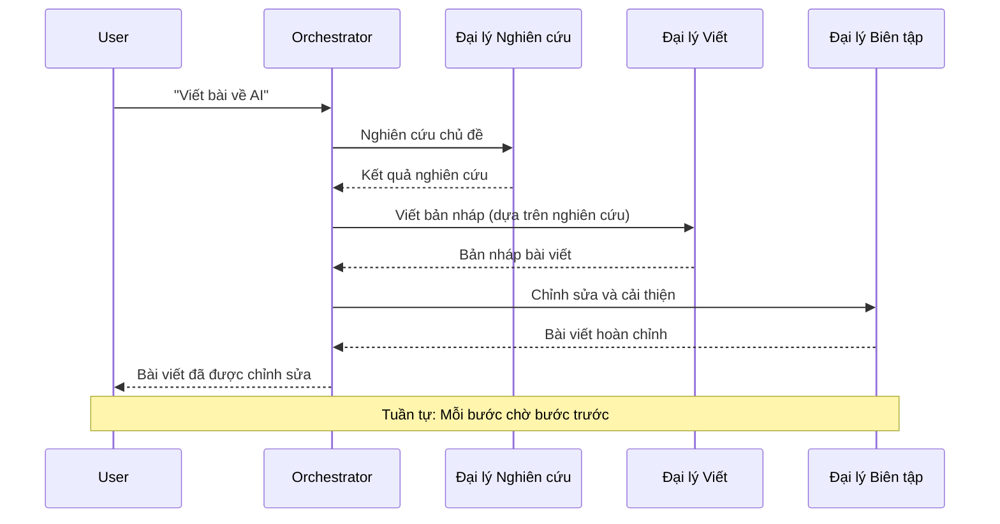
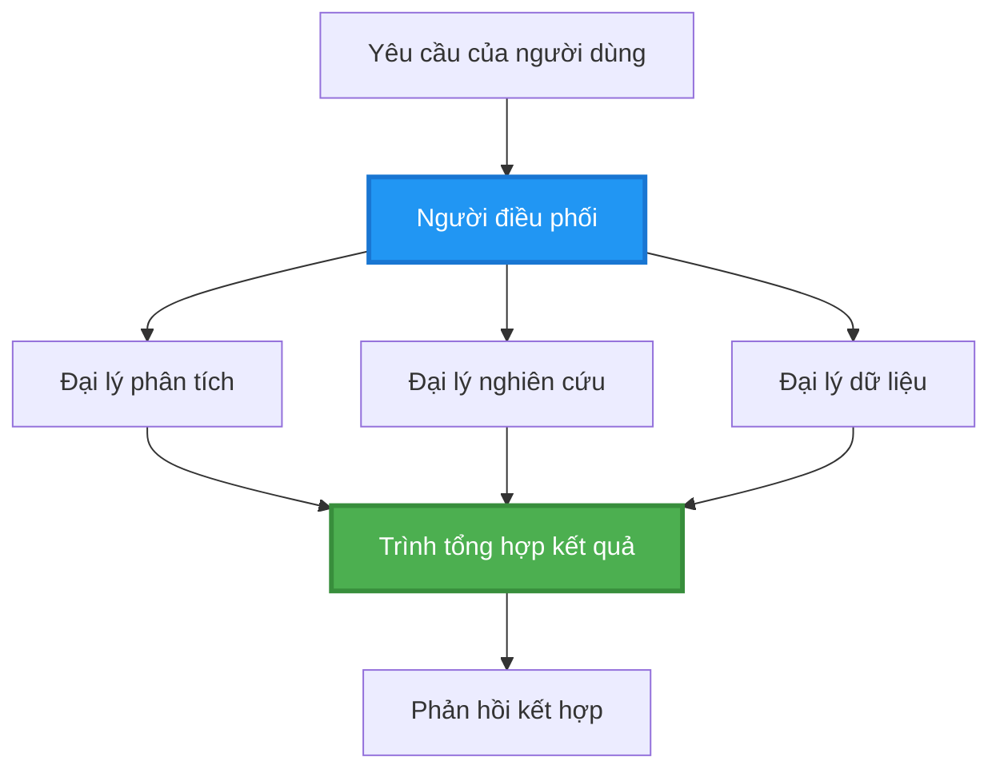
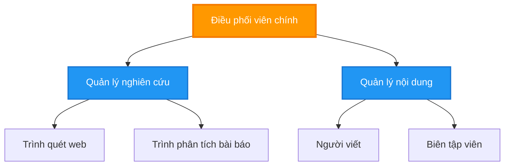
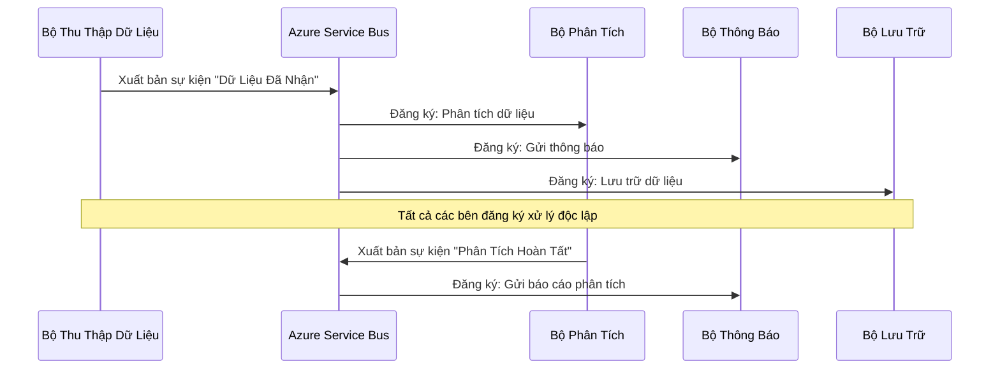
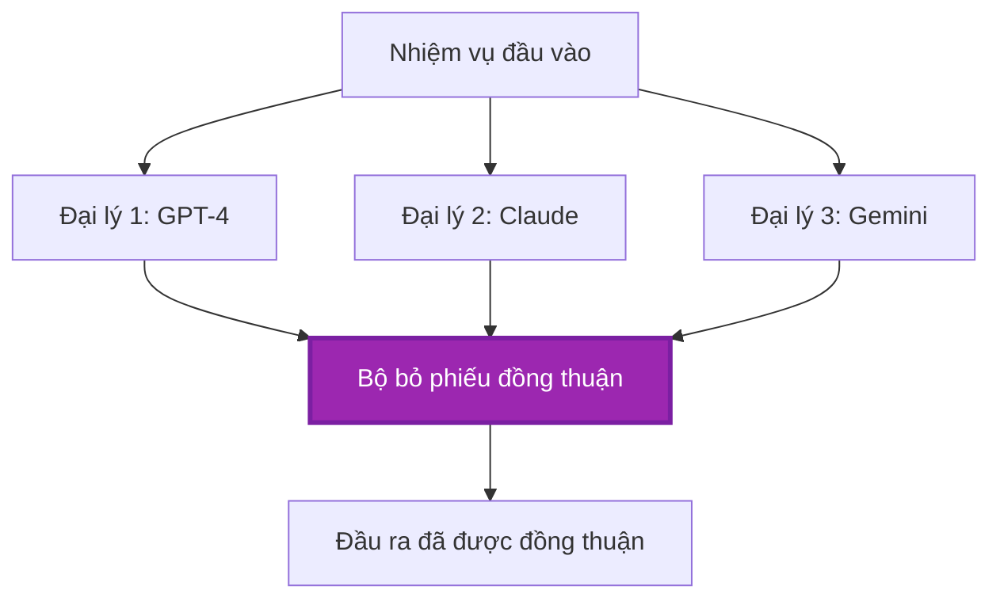
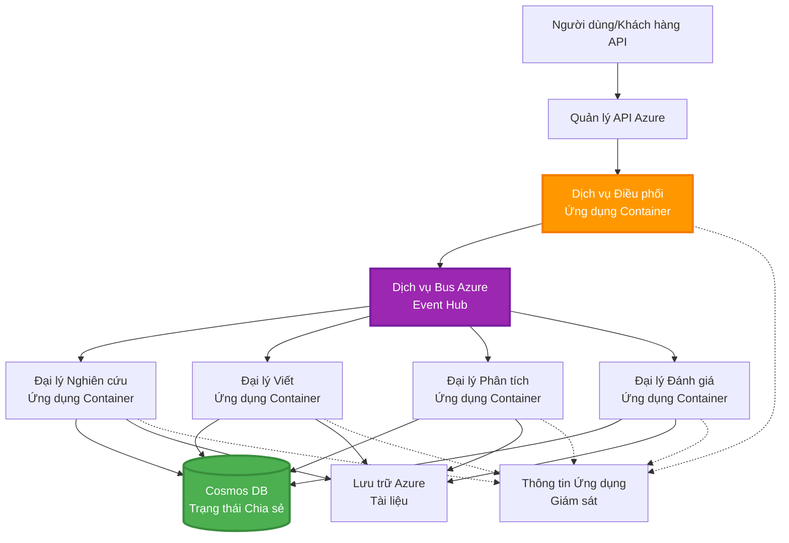

# Mẫu Điều Phối Đa Tác Nhân

⏱️ **Thời gian ước tính**: 60-75 phút | 💰 **Chi phí ước tính**: ~$100-300/tháng | ⭐ **Độ phức tạp**: Nâng cao

**📚 Lộ trình học tập:**
- ← Trước: [Lập kế hoạch năng lực](capacity-planning.md) - Chiến lược định cỡ và mở rộng tài nguyên
- 🎯 **Bạn đang ở đây**: Mẫu Điều Phối Đa Tác Nhân (Điều phối, giao tiếp, quản lý trạng thái)
- → Tiếp theo: [Lựa chọn SKU](sku-selection.md) - Chọn các dịch vụ Azure phù hợp
- 🏠 [Trang chủ khóa học](../../README.md)

---

## Bạn sẽ học được gì

Khi hoàn thành bài học này, bạn sẽ:
- Hiểu các mẫu kiến trúc **đa tác nhân** và khi nào nên sử dụng chúng
- Triển khai các mẫu **điều phối** (tập trung, phi tập trung, phân cấp)
- Thiết kế chiến lược **giao tiếp giữa các tác nhân** (đồng bộ, bất đồng bộ, dựa trên sự kiện)
- Quản lý **trạng thái chia sẻ** giữa các tác nhân phân tán
- Triển khai **hệ thống đa tác nhân** trên Azure với AZD
- Áp dụng các mẫu **điều phối** cho các kịch bản AI thực tế
- Giám sát và gỡ lỗi hệ thống tác nhân phân tán

## Tại sao Điều Phối Đa Tác Nhân Quan Trọng

### Sự Tiến Hóa: Từ Tác Nhân Đơn Lẻ đến Đa Tác Nhân

**Tác Nhân Đơn Lẻ (Đơn Giản):**
```
User → Agent → Response
```
- ✅ Dễ hiểu và triển khai
- ✅ Nhanh cho các tác vụ đơn giản
- ❌ Bị giới hạn bởi khả năng của một mô hình duy nhất
- ❌ Không thể song song hóa các tác vụ phức tạp
- ❌ Không có sự chuyên môn hóa

**Hệ Thống Đa Tác Nhân (Nâng Cao):**
```
           ┌─────────────┐
           │ Orchestrator│
           └──────┬──────┘
        ┌─────────┼─────────┐
        │         │         │
    ┌───▼──┐  ┌──▼───┐  ┌──▼────┐
    │Agent1│  │Agent2│  │Agent3 │
    │(Plan)│  │(Code)│  │(Review)│
    └──────┘  └──────┘  └───────┘
```
- ✅ Các tác nhân chuyên biệt cho các tác vụ cụ thể
- ✅ Thực thi song song để tăng tốc độ
- ✅ Tính mô-đun và dễ bảo trì
- ✅ Tốt hơn trong các quy trình làm việc phức tạp
- ⚠️ Yêu cầu logic điều phối

**Ví dụ minh họa**: Tác nhân đơn lẻ giống như một người làm tất cả các công việc. Đa tác nhân giống như một đội nhóm, nơi mỗi thành viên có kỹ năng chuyên biệt (nghiên cứu, lập trình, đánh giá, viết) làm việc cùng nhau.

---

## Các Mẫu Điều Phối Cốt Lõi

### Mẫu 1: Điều Phối Tuần Tự (Chuỗi Trách Nhiệm)

**Khi nào sử dụng**: Các tác vụ phải hoàn thành theo thứ tự cụ thể, mỗi tác nhân xây dựng dựa trên đầu ra trước đó.


**Lợi ích:**
- ✅ Luồng dữ liệu rõ ràng
- ✅ Dễ gỡ lỗi
- ✅ Thứ tự thực thi dự đoán được

**Hạn chế:**
- ❌ Chậm hơn (không có song song)
- ❌ Một lỗi làm gián đoạn toàn bộ chuỗi
- ❌ Không xử lý được các tác vụ phụ thuộc lẫn nhau

**Ví dụ sử dụng:**
- Quy trình tạo nội dung (nghiên cứu → viết → chỉnh sửa → xuất bản)
- Tạo mã (lập kế hoạch → triển khai → kiểm tra → triển khai)
- Tạo báo cáo (thu thập dữ liệu → phân tích → trực quan hóa → tóm tắt)

---

### Mẫu 2: Điều Phối Song Song (Fan-Out/Fan-In)

**Khi nào sử dụng**: Các tác vụ độc lập có thể chạy đồng thời, kết quả được kết hợp ở cuối.


**Lợi ích:**
- ✅ Nhanh (thực thi song song)
- ✅ Chịu lỗi (chấp nhận kết quả một phần)
- ✅ Mở rộng theo chiều ngang

**Hạn chế:**
- ⚠️ Kết quả có thể đến không theo thứ tự
- ⚠️ Cần logic tổng hợp
- ⚠️ Quản lý trạng thái phức tạp

**Ví dụ sử dụng:**
- Thu thập dữ liệu từ nhiều nguồn (API + cơ sở dữ liệu + web scraping)
- Phân tích cạnh tranh (nhiều mô hình tạo giải pháp, chọn giải pháp tốt nhất)
- Dịch vụ dịch thuật (dịch sang nhiều ngôn ngữ đồng thời)

---

### Mẫu 3: Điều Phối Phân Cấp (Quản Lý-Người Thực Hiện)

**Khi nào sử dụng**: Quy trình làm việc phức tạp với các tác vụ phụ, cần sự phân công.


**Lợi ích:**
- ✅ Xử lý quy trình làm việc phức tạp
- ✅ Tính mô-đun và dễ bảo trì
- ✅ Ranh giới trách nhiệm rõ ràng

**Hạn chế:**
- ⚠️ Kiến trúc phức tạp hơn
- ⚠️ Độ trễ cao hơn (nhiều lớp điều phối)
- ⚠️ Yêu cầu điều phối tinh vi

**Ví dụ sử dụng:**
- Xử lý tài liệu doanh nghiệp (phân loại → định tuyến → xử lý → lưu trữ)
- Chuỗi dữ liệu nhiều giai đoạn (nhập → làm sạch → chuyển đổi → phân tích → báo cáo)
- Quy trình tự động hóa phức tạp (lập kế hoạch → phân bổ tài nguyên → thực thi → giám sát)

---

### Mẫu 4: Điều Phối Dựa Trên Sự Kiện (Publish-Subscribe)

**Khi nào sử dụng**: Các tác nhân cần phản ứng với sự kiện, mong muốn sự kết nối lỏng lẻo.


**Lợi ích:**
- ✅ Kết nối lỏng lẻo giữa các tác nhân
- ✅ Dễ dàng thêm tác nhân mới (chỉ cần đăng ký)
- ✅ Xử lý bất đồng bộ
- ✅ Chịu lỗi (lưu trữ thông điệp)

**Hạn chế:**
- ⚠️ Tính nhất quán cuối cùng
- ⚠️ Gỡ lỗi phức tạp
- ⚠️ Thách thức trong việc sắp xếp thông điệp

**Ví dụ sử dụng:**
- Hệ thống giám sát thời gian thực (cảnh báo, bảng điều khiển, nhật ký)
- Thông báo đa kênh (email, SMS, push, Slack)
- Chuỗi xử lý dữ liệu (nhiều người tiêu thụ cùng một dữ liệu)

---

### Mẫu 5: Điều Phối Dựa Trên Đồng Thuận (Voting/Quorum)

**Khi nào sử dụng**: Cần sự đồng thuận từ nhiều tác nhân trước khi tiếp tục.


**Lợi ích:**
- ✅ Độ chính xác cao hơn (nhiều ý kiến)
- ✅ Chịu lỗi (chấp nhận lỗi thiểu số)
- ✅ Đảm bảo chất lượng tích hợp

**Hạn chế:**
- ❌ Tốn kém (nhiều lần gọi mô hình)
- ❌ Chậm hơn (chờ tất cả các tác nhân)
- ⚠️ Cần giải quyết xung đột

**Ví dụ sử dụng:**
- Kiểm duyệt nội dung (nhiều mô hình đánh giá nội dung)
- Đánh giá mã (nhiều công cụ phân tích/kiểm tra)
- Chẩn đoán y tế (nhiều mô hình AI, xác nhận của chuyên gia)

---

## Tổng Quan Kiến Trúc

### Hệ Thống Đa Tác Nhân Hoàn Chỉnh Trên Azure


**Các thành phần chính:**

| Thành phần | Mục đích | Dịch vụ Azure |
|------------|----------|---------------|
| **API Gateway** | Điểm vào, giới hạn tốc độ, xác thực | API Management |
| **Orchestrator** | Điều phối quy trình làm việc của tác nhân | Container Apps |
| **Message Queue** | Giao tiếp bất đồng bộ | Service Bus / Event Hubs |
| **Agents** | Các tác nhân AI chuyên biệt | Container Apps / Functions |
| **State Store** | Trạng thái chia sẻ, theo dõi tác vụ | Cosmos DB |
| **Artifact Storage** | Tài liệu, kết quả, nhật ký | Blob Storage |
| **Monitoring** | Theo dõi phân tán, nhật ký | Application Insights |

---

## Yêu Cầu Trước

### Công Cụ Cần Thiết

```bash
# Xác minh Azure Developer CLI
azd version
# ✅ Mong đợi: azd phiên bản 1.0.0 hoặc cao hơn

# Xác minh Azure CLI
az --version
# ✅ Mong đợi: azure-cli 2.50.0 hoặc cao hơn

# Xác minh Docker (để kiểm tra cục bộ)
docker --version
# ✅ Mong đợi: Docker phiên bản 20.10 hoặc cao hơn
```

### Yêu Cầu Azure

- Đăng ký Azure đang hoạt động
- Quyền tạo:
  - Container Apps
  - Namespace Service Bus
  - Tài khoản Cosmos DB
  - Tài khoản lưu trữ
  - Application Insights

### Kiến Thức Yêu Cầu

Bạn nên hoàn thành:
- [Quản lý cấu hình](../getting-started/configuration.md)
- [Xác thực & Bảo mật](../getting-started/authsecurity.md)
- [Ví dụ Microservices](../../../../examples/microservices)

---

## Hướng Dẫn Triển Khai

### Cấu Trúc Dự Án

```
multi-agent-system/
├── azure.yaml                    # AZD configuration
├── infra/
│   ├── main.bicep               # Main infrastructure
│   ├── core/
│   │   ├── servicebus.bicep     # Message queue
│   │   ├── cosmos.bicep         # State store
│   │   ├── storage.bicep        # Artifact storage
│   │   └── monitoring.bicep     # Application Insights
│   └── app/
│       ├── orchestrator.bicep   # Orchestrator service
│       └── agent.bicep          # Agent template
└── src/
    ├── orchestrator/            # Orchestration logic
    │   ├── app.py
    │   ├── workflows.py
    │   └── Dockerfile
    ├── agents/
    │   ├── research/            # Research agent
    │   ├── writer/              # Writer agent
    │   ├── analyst/             # Analyst agent
    │   └── reviewer/            # Reviewer agent
    └── shared/
        ├── state_manager.py     # Shared state logic
        └── message_handler.py   # Message handling
```

---

## Bài Học 1: Mẫu Điều Phối Tuần Tự

### Triển Khai: Quy Trình Tạo Nội Dung

Hãy xây dựng một quy trình tuần tự: Nghiên cứu → Viết → Chỉnh sửa → Xuất bản

### 1. Cấu Hình AZD

**Tệp: `azure.yaml`**

```yaml
name: content-pipeline
metadata:
  template: multi-agent-sequential@1.0.0

services:
  orchestrator:
    project: ./src/orchestrator
    language: python
    host: containerapp
  
  research-agent:
    project: ./src/agents/research
    language: python
    host: containerapp
  
  writer-agent:
    project: ./src/agents/writer
    language: python
    host: containerapp
  
  editor-agent:
    project: ./src/agents/editor
    language: python
    host: containerapp
```

### 2. Hạ Tầng: Service Bus cho Điều Phối

**Tệp: `infra/core/servicebus.bicep`**

```bicep
param name string
param location string
param tags object = {}

resource serviceBusNamespace 'Microsoft.ServiceBus/namespaces@2022-10-01-preview' = {
  name: name
  location: location
  tags: tags
  sku: {
    name: 'Standard'
    tier: 'Standard'
  }
  properties: {
    minimumTlsVersion: '1.2'
  }
}

// Queue for orchestrator → research agent
resource researchQueue 'Microsoft.ServiceBus/namespaces/queues@2022-10-01-preview' = {
  parent: serviceBusNamespace
  name: 'research-tasks'
  properties: {
    maxDeliveryCount: 3
    lockDuration: 'PT5M'
    deadLetteringOnMessageExpiration: true
  }
}

// Queue for research agent → writer agent
resource writerQueue 'Microsoft.ServiceBus/namespaces/queues@2022-10-01-preview' = {
  parent: serviceBusNamespace
  name: 'writer-tasks'
  properties: {
    maxDeliveryCount: 3
    lockDuration: 'PT5M'
  }
}

// Queue for writer agent → editor agent
resource editorQueue 'Microsoft.ServiceBus/namespaces/queues@2022-10-01-preview' = {
  parent: serviceBusNamespace
  name: 'editor-tasks'
  properties: {
    maxDeliveryCount: 3
    lockDuration: 'PT5M'
  }
}

output namespace string = serviceBusNamespace.name
output connectionString string = listKeys('${serviceBusNamespace.id}/AuthorizationRules/RootManageSharedAccessKey', serviceBusNamespace.apiVersion).primaryConnectionString
```

### 3. Quản Lý Trạng Thái Chia Sẻ

**Tệp: `src/shared/state_manager.py`**

```python
from azure.cosmos import CosmosClient, PartitionKey
from datetime import datetime
import os

class StateManager:
    """Manages shared state across agents using Cosmos DB"""
    
    def __init__(self):
        endpoint = os.environ['COSMOS_ENDPOINT']
        key = os.environ['COSMOS_KEY']
        
        self.client = CosmosClient(endpoint, key)
        self.database = self.client.get_database_client('agent-state')
        self.container = self.database.get_container_client('tasks')
    
    def create_task(self, task_id: str, task_type: str, input_data: dict):
        """Create a new task"""
        task = {
            'id': task_id,
            'type': task_type,
            'status': 'pending',
            'input': input_data,
            'created_at': datetime.utcnow().isoformat(),
            'steps': []
        }
        self.container.create_item(task)
        return task
    
    def update_task_step(self, task_id: str, step_name: str, result: dict):
        """Update task with completed step"""
        task = self.container.read_item(task_id, partition_key=task_id)
        
        task['steps'].append({
            'name': step_name,
            'completed_at': datetime.utcnow().isoformat(),
            'result': result
        })
        
        self.container.replace_item(task_id, task)
        return task
    
    def complete_task(self, task_id: str, final_result: dict):
        """Mark task as complete"""
        task = self.container.read_item(task_id, partition_key=task_id)
        task['status'] = 'completed'
        task['result'] = final_result
        task['completed_at'] = datetime.utcnow().isoformat()
        self.container.replace_item(task_id, task)
        return task
    
    def get_task(self, task_id: str):
        """Retrieve task state"""
        return self.container.read_item(task_id, partition_key=task_id)
```

### 4. Dịch Vụ Điều Phối

**Tệp: `src/orchestrator/app.py`**

```python
from flask import Flask, request, jsonify
from azure.servicebus import ServiceBusClient, ServiceBusMessage
import json
import uuid
import os
from shared.state_manager import StateManager

app = Flask(__name__)
state_manager = StateManager()

# Kết nối Service Bus
servicebus_connection_str = os.environ['SERVICEBUS_CONNECTION_STRING']
servicebus_client = ServiceBusClient.from_connection_string(servicebus_connection_str)

@app.route('/health', methods=['GET'])
def health():
    return jsonify({'status': 'healthy', 'service': 'orchestrator'})

@app.route('/create-content', methods=['POST'])
def create_content():
    """
    Sequential workflow: Research → Write → Edit → Publish
    """
    data = request.json
    topic = data.get('topic')
    
    if not topic:
        return jsonify({'error': 'Topic required'}), 400
    
    # Tạo tác vụ trong kho trạng thái
    task_id = str(uuid.uuid4())
    task = state_manager.create_task(
        task_id=task_id,
        task_type='content_creation',
        input_data={'topic': topic}
    )
    
    # Gửi tin nhắn đến tác nhân nghiên cứu (bước đầu tiên)
    sender = servicebus_client.get_queue_sender('research-tasks')
    message = ServiceBusMessage(
        body=json.dumps({
            'task_id': task_id,
            'topic': topic,
            'next_queue': 'writer-tasks'  # Nơi gửi kết quả
        }),
        content_type='application/json'
    )
    
    with sender:
        sender.send_messages(message)
    
    return jsonify({
        'task_id': task_id,
        'status': 'started',
        'workflow': 'sequential',
        'steps': ['research', 'write', 'edit', 'publish'],
        'message': 'Content creation pipeline initiated'
    }), 202

@app.route('/task/<task_id>', methods=['GET'])
def get_task_status(task_id):
    """Check task status"""
    try:
        task = state_manager.get_task(task_id)
        return jsonify(task)
    except Exception as e:
        return jsonify({'error': str(e)}), 404

if __name__ == '__main__':
    app.run(host='0.0.0.0', port=8080)
```

### 5. Tác Nhân Nghiên Cứu

**Tệp: `src/agents/research/app.py`**

```python
from azure.servicebus import ServiceBusClient, ServiceBusMessage
from openai import AzureOpenAI
import json
import os
import time
from shared.state_manager import StateManager

# Khởi tạo khách hàng
state_manager = StateManager()
servicebus_client = ServiceBusClient.from_connection_string(
    os.environ['SERVICEBUS_CONNECTION_STRING']
)

openai_client = AzureOpenAI(
    api_key=os.environ['AZURE_OPENAI_API_KEY'],
    api_version="2024-02-01",
    azure_endpoint=os.environ['AZURE_OPENAI_ENDPOINT']
)

def process_research_task(message_data):
    """Process research request and pass to writer"""
    task_id = message_data['task_id']
    topic = message_data['topic']
    next_queue = message_data['next_queue']
    
    print(f"🔬 Researching: {topic}")
    
    # Gọi Azure OpenAI để nghiên cứu
    response = openai_client.chat.completions.create(
        model="gpt-4",
        messages=[
            {"role": "system", "content": "You are a research assistant. Provide comprehensive research on the given topic."},
            {"role": "user", "content": f"Research this topic thoroughly: {topic}"}
        ],
        max_tokens=1500
    )
    
    research_results = response.choices[0].message.content
    
    # Cập nhật trạng thái
    state_manager.update_task_step(
        task_id=task_id,
        step_name='research',
        result={'research': research_results}
    )
    
    # Gửi đến tác nhân tiếp theo (người viết)
    sender = servicebus_client.get_queue_sender(next_queue)
    message = ServiceBusMessage(
        body=json.dumps({
            'task_id': task_id,
            'topic': topic,
            'research': research_results,
            'next_queue': 'editor-tasks'
        }),
        content_type='application/json'
    )
    
    with sender:
        sender.send_messages(message)
    
    print(f"✅ Research complete for task {task_id}")

def main():
    """Listen to research queue"""
    receiver = servicebus_client.get_queue_receiver('research-tasks')
    
    print("🔬 Research Agent started, listening for tasks...")
    
    with receiver:
        while True:
            messages = receiver.receive_messages(max_wait_time=5)
            for message in messages:
                try:
                    message_data = json.loads(str(message))
                    process_research_task(message_data)
                    receiver.complete_message(message)
                except Exception as e:
                    print(f"❌ Error processing message: {e}")
                    receiver.abandon_message(message)

if __name__ == '__main__':
    main()
```

### 6. Tác Nhân Viết

**Tệp: `src/agents/writer/app.py`**

```python
from azure.servicebus import ServiceBusClient, ServiceBusMessage
from openai import AzureOpenAI
import json
import os
from shared.state_manager import StateManager

state_manager = StateManager()
servicebus_client = ServiceBusClient.from_connection_string(
    os.environ['SERVICEBUS_CONNECTION_STRING']
)

openai_client = AzureOpenAI(
    api_key=os.environ['AZURE_OPENAI_API_KEY'],
    api_version="2024-02-01",
    azure_endpoint=os.environ['AZURE_OPENAI_ENDPOINT']
)

def process_writing_task(message_data):
    """Write article based on research"""
    task_id = message_data['task_id']
    topic = message_data['topic']
    research = message_data['research']
    next_queue = message_data['next_queue']
    
    print(f"✍️ Writing article: {topic}")
    
    # Gọi Azure OpenAI để viết bài
    response = openai_client.chat.completions.create(
        model="gpt-4",
        messages=[
            {"role": "system", "content": "You are a professional writer. Write engaging, well-structured articles."},
            {"role": "user", "content": f"Based on this research:\n\n{research}\n\nWrite a comprehensive article about: {topic}"}
        ],
        max_tokens=2000
    )
    
    article_draft = response.choices[0].message.content
    
    # Cập nhật trạng thái
    state_manager.update_task_step(
        task_id=task_id,
        step_name='writing',
        result={'draft': article_draft}
    )
    
    # Gửi đến biên tập viên
    sender = servicebus_client.get_queue_sender(next_queue)
    message = ServiceBusMessage(
        body=json.dumps({
            'task_id': task_id,
            'topic': topic,
            'draft': article_draft
        }),
        content_type='application/json'
    )
    
    with sender:
        sender.send_messages(message)
    
    print(f"✅ Article draft complete for task {task_id}")

def main():
    """Listen to writer queue"""
    receiver = servicebus_client.get_queue_receiver('writer-tasks')
    
    print("✍️ Writer Agent started, listening for tasks...")
    
    with receiver:
        while True:
            messages = receiver.receive_messages(max_wait_time=5)
            for message in messages:
                try:
                    message_data = json.loads(str(message))
                    process_writing_task(message_data)
                    receiver.complete_message(message)
                except Exception as e:
                    print(f"❌ Error: {e}")
                    receiver.abandon_message(message)

if __name__ == '__main__':
    main()
```

### 7. Tác Nhân Chỉnh Sửa

**Tệp: `src/agents/editor/app.py`**

```python
from azure.servicebus import ServiceBusClient
from openai import AzureOpenAI
import json
import os
from shared.state_manager import StateManager

state_manager = StateManager()
servicebus_client = ServiceBusClient.from_connection_string(
    os.environ['SERVICEBUS_CONNECTION_STRING']
)

openai_client = AzureOpenAI(
    api_key=os.environ['AZURE_OPENAI_API_KEY'],
    api_version="2024-02-01",
    azure_endpoint=os.environ['AZURE_OPENAI_ENDPOINT']
)

def process_editing_task(message_data):
    """Edit and finalize article"""
    task_id = message_data['task_id']
    topic = message_data['topic']
    draft = message_data['draft']
    
    print(f"📝 Editing article: {topic}")
    
    # Gọi Azure OpenAI để chỉnh sửa
    response = openai_client.chat.completions.create(
        model="gpt-4",
        messages=[
            {"role": "system", "content": "You are an expert editor. Improve grammar, clarity, and structure."},
            {"role": "user", "content": f"Edit and improve this article:\n\n{draft}"}
        ],
        max_tokens=2000
    )
    
    final_article = response.choices[0].message.content
    
    # Đánh dấu nhiệm vụ là hoàn thành
    state_manager.complete_task(
        task_id=task_id,
        final_result={
            'topic': topic,
            'final_article': final_article,
            'word_count': len(final_article.split())
        }
    )
    
    print(f"✅ Article finalized for task {task_id}")

def main():
    """Listen to editor queue"""
    receiver = servicebus_client.get_queue_receiver('editor-tasks')
    
    print("📝 Editor Agent started, listening for tasks...")
    
    with receiver:
        while True:
            messages = receiver.receive_messages(max_wait_time=5)
            for message in messages:
                try:
                    message_data = json.loads(str(message))
                    process_editing_task(message_data)
                    receiver.complete_message(message)
                except Exception as e:
                    print(f"❌ Error: {e}")
                    receiver.abandon_message(message)

if __name__ == '__main__':
    main()
```

### 8. Triển Khai và Kiểm Tra

```bash
# Khởi tạo và triển khai
azd init
azd up

# Lấy URL của bộ điều phối
ORCHESTRATOR_URL=$(azd env get-values | grep ORCHESTRATOR_URL | cut -d '=' -f2 | tr -d '"')

# Tạo nội dung
curl -X POST $ORCHESTRATOR_URL/create-content \
  -H "Content-Type: application/json" \
  -d '{"topic": "The Future of AI in Healthcare"}'
```

**✅ Kết quả mong đợi:**
```json
{
  "task_id": "a1b2c3d4-e5f6-7890-abcd-ef1234567890",
  "status": "started",
  "workflow": "sequential",
  "steps": ["research", "write", "edit", "publish"],
  "message": "Content creation pipeline initiated"
}
```

**Kiểm tra tiến độ tác vụ:**
```bash
TASK_ID="a1b2c3d4-e5f6-7890-abcd-ef1234567890"
curl $ORCHESTRATOR_URL/task/$TASK_ID
```

**✅ Kết quả mong đợi (hoàn thành):**
```json
{
  "id": "a1b2c3d4-e5f6-7890-abcd-ef1234567890",
  "type": "content_creation",
  "status": "completed",
  "steps": [
    {
      "name": "research",
      "completed_at": "2025-11-19T10:30:00Z",
      "result": {"research": "..."}
    },
    {
      "name": "writing",
      "completed_at": "2025-11-19T10:32:00Z",
      "result": {"draft": "..."}
    }
  ],
  "result": {
    "topic": "The Future of AI in Healthcare",
    "final_article": "...",
    "word_count": 1500
  }
}
```

---

## Bài Học 2: Mẫu Điều Phối Song Song

### Triển Khai: Bộ Tổng Hợp Nghiên Cứu Đa Nguồn

Hãy xây dựng một hệ thống song song thu thập thông tin từ nhiều nguồn đồng thời.

### Điều Phối Song Song

**Tệp: `src/orchestrator/parallel_workflow.py`**

```python
from flask import Flask, request, jsonify
from azure.servicebus import ServiceBusClient, ServiceBusMessage
import json
import uuid
import os
from shared.state_manager import StateManager

app = Flask(__name__)
state_manager = StateManager()

servicebus_client = ServiceBusClient.from_connection_string(
    os.environ['SERVICEBUS_CONNECTION_STRING']
)

@app.route('/research-parallel', methods=['POST'])
def research_parallel():
    """
    Parallel workflow: Multiple agents work simultaneously
    """
    data = request.json
    query = data.get('query')
    
    task_id = str(uuid.uuid4())
    task = state_manager.create_task(
        task_id=task_id,
        task_type='parallel_research',
        input_data={
            'query': query,
            'agents': ['web', 'academic', 'news', 'social']
        }
    )
    
    # Phân tán: Gửi đến tất cả các tác nhân đồng thời
    agents = [
        ('web-research-queue', 'web'),
        ('academic-research-queue', 'academic'),
        ('news-research-queue', 'news'),
        ('social-research-queue', 'social')
    ]
    
    for queue_name, agent_type in agents:
        sender = servicebus_client.get_queue_sender(queue_name)
        message = ServiceBusMessage(
            body=json.dumps({
                'task_id': task_id,
                'query': query,
                'agent_type': agent_type,
                'result_queue': 'aggregation-queue'
            }),
            content_type='application/json'
        )
        
        with sender:
            sender.send_messages(message)
    
    return jsonify({
        'task_id': task_id,
        'status': 'started',
        'workflow': 'parallel',
        'agents_dispatched': 4,
        'message': 'Parallel research initiated'
    }), 202

if __name__ == '__main__':
    app.run(host='0.0.0.0', port=8080)
```

### Logic Tổng Hợp

**Tệp: `src/agents/aggregator/app.py`**

```python
from azure.servicebus import ServiceBusClient
import json
import os
from collections import defaultdict
from shared.state_manager import StateManager

state_manager = StateManager()
servicebus_client = ServiceBusClient.from_connection_string(
    os.environ['SERVICEBUS_CONNECTION_STRING']
)

# Theo dõi kết quả theo từng nhiệm vụ
task_results = defaultdict(list)
expected_agents = 4  # web, học thuật, tin tức, xã hội

def process_result(message_data):
    """Aggregate results from parallel agents"""
    task_id = message_data['task_id']
    agent_type = message_data['agent_type']
    result = message_data['result']
    
    # Lưu trữ kết quả
    task_results[task_id].append({
        'agent': agent_type,
        'data': result
    })
    
    print(f"📊 Received result from {agent_type} agent ({len(task_results[task_id])}/{expected_agents})")
    
    # Kiểm tra nếu tất cả các tác nhân đã hoàn thành (fan-in)
    if len(task_results[task_id]) == expected_agents:
        print(f"✅ All agents completed for task {task_id}. Aggregating...")
        
        # Kết hợp kết quả
        aggregated = {
            'query': message_data['query'],
            'sources': task_results[task_id],
            'summary': generate_summary(task_results[task_id])
        }
        
        # Đánh dấu hoàn thành
        state_manager.complete_task(task_id, aggregated)
        
        # Dọn dẹp
        del task_results[task_id]
        
        print(f"✅ Aggregation complete for task {task_id}")

def generate_summary(results):
    """Generate summary from all sources"""
    summaries = [r['data'].get('summary', '') for r in results]
    return '\n\n'.join(summaries)

def main():
    """Listen to aggregation queue"""
    receiver = servicebus_client.get_queue_receiver('aggregation-queue')
    
    print("📊 Aggregator started, listening for results...")
    
    with receiver:
        while True:
            messages = receiver.receive_messages(max_wait_time=5)
            for message in messages:
                try:
                    message_data = json.loads(str(message))
                    process_result(message_data)
                    receiver.complete_message(message)
                except Exception as e:
                    print(f"❌ Error: {e}")
                    receiver.abandon_message(message)

if __name__ == '__main__':
    main()
```

**Lợi ích của Mẫu Song Song:**
- ⚡ **Nhanh hơn 4 lần** (các tác nhân chạy đồng thời)
- 🔄 **Chịu lỗi** (chấp nhận kết quả một phần)
- 📈 **Có thể mở rộng** (dễ dàng thêm tác nhân)

---

## Bài Tập Thực Hành

### Bài Tập 1: Thêm Xử Lý Hết Thời Gian Chờ ⭐⭐ (Trung Bình)

**Mục tiêu**: Triển khai logic hết thời gian chờ để bộ tổng hợp không chờ mãi mãi các tác nhân chậm.

**Các bước**:

1. **Thêm theo dõi thời gian chờ vào bộ tổng hợp:**

```python
from datetime import datetime, timedelta

task_timeouts = {}  # task_id -> thời gian hết hạn

def process_result(message_data):
    task_id = message_data['task_id']
    
    # Đặt thời gian chờ trên kết quả đầu tiên
    if task_id not in task_timeouts:
        task_timeouts[task_id] = datetime.utcnow() + timedelta(seconds=30)
    
    task_results[task_id].append({
        'agent': message_data['agent_type'],
        'data': message_data['result']
    })
    
    # Kiểm tra nếu hoàn thành HOẶC đã hết thời gian
    if len(task_results[task_id]) == expected_agents or \
       datetime.utcnow() > task_timeouts[task_id]:
        
        print(f"📊 Aggregating with {len(task_results[task_id])}/{expected_agents} results")
        
        aggregated = {
            'query': message_data['query'],
            'sources': task_results[task_id],
            'completed_agents': len(task_results[task_id]),
            'timed_out': len(task_results[task_id]) < expected_agents
        }
        
        state_manager.complete_task(task_id, aggregated)
        
        # Dọn dẹp
        del task_results[task_id]
        del task_timeouts[task_id]
```

2. **Kiểm tra với các độ trễ nhân tạo:**

```python
# Trong một tác nhân, thêm độ trễ để mô phỏng xử lý chậm
import time
time.sleep(35)  # Vượt quá thời gian chờ 30 giây
```

3. **Triển khai và xác minh:**

```bash
azd deploy aggregator

# Gửi nhiệm vụ
curl -X POST $ORCHESTRATOR_URL/research-parallel \
  -H "Content-Type: application/json" \
  -d '{"query": "AI safety research"}'

# Kiểm tra kết quả sau 30 giây
curl $ORCHESTRATOR_URL/task/$TASK_ID
```

**✅ Tiêu chí thành công:**
- ✅ Tác vụ hoàn thành sau 30 giây ngay cả khi các tác nhân chưa hoàn thành
- ✅ Phản hồi chỉ ra kết quả một phần (`"timed_out": true`)
- ✅ Các kết quả có sẵn được trả về (3 trong số 4 tác nhân)

**Thời gian**: 20-25 phút

---

### Bài Tập 2: Triển Khai Logic Thử Lại ⭐⭐⭐ (Nâng Cao)

**Mục tiêu**: Tự động thử lại các tác vụ tác nhân thất bại trước khi từ bỏ.

**Các bước**:

1. **Thêm theo dõi thử lại vào điều phối viên:**

```python
from dataclasses import dataclass
from typing import Dict

@dataclass
class RetryConfig:
    max_retries: int = 3
    backoff_seconds: int = 5

retry_counts: Dict[str, int] = {}  # message_id -> số_lần_thử_lại

def send_with_retry(queue_name: str, message_data: dict, retry_config: RetryConfig):
    """Send message with retry metadata"""
    message_id = message_data.get('message_id', str(uuid.uuid4()))
    message_data['message_id'] = message_id
    message_data['retry_count'] = retry_counts.get(message_id, 0)
    message_data['max_retries'] = retry_config.max_retries
    
    sender = servicebus_client.get_queue_sender(queue_name)
    message = ServiceBusMessage(
        body=json.dumps(message_data),
        content_type='application/json',
        message_id=message_id
    )
    
    with sender:
        sender.send_messages(message)
```

2. **Thêm trình xử lý thử lại vào các tác nhân:**

```python
def process_with_retry(message, receiver, process_func):
    """Process message with automatic retry on failure"""
    try:
        message_data = json.loads(str(message))
        
        # Xử lý tin nhắn
        process_func(message_data)
        
        # Thành công - hoàn thành
        receiver.complete_message(message)
        
    except Exception as e:
        message_id = message.message_id
        retry_count = message_data.get('retry_count', 0)
        max_retries = message_data.get('max_retries', 3)
        
        if retry_count < max_retries:
            # Thử lại: hủy bỏ và xếp hàng lại với số lần tăng lên
            print(f"⚠️ Retry {retry_count + 1}/{max_retries} for message {message_id}")
            
            message_data['retry_count'] = retry_count + 1
            
            # Gửi lại vào cùng hàng đợi với độ trễ
            time.sleep(5 * (retry_count + 1))  # Lùi lại theo cấp số nhân
            send_with_retry(queue_name, message_data, RetryConfig())
            
            receiver.complete_message(message)  # Xóa bản gốc
        else:
            # Vượt quá số lần thử lại tối đa - chuyển đến hàng đợi thư lỗi
            print(f"❌ Max retries exceeded for message {message_id}")
            receiver.dead_letter_message(
                message,
                reason="MaxRetriesExceeded",
                error_description=str(e)
            )
```

3. **Giám sát hàng đợi thư chết:**

```python
def monitor_dead_letters():
    """Check dead letter queue for failed messages"""
    receiver = servicebus_client.get_queue_receiver(
        'research-queue',
        sub_queue='deadletter'
    )
    
    with receiver:
        messages = receiver.receive_messages(max_wait_time=5)
        for message in messages:
            print(f"☠️ Dead letter: {message.message_id}")
            print(f"Reason: {message.dead_letter_reason}")
            print(f"Description: {message.dead_letter_error_description}")
```

**✅ Tiêu chí thành công:**
- ✅ Các tác vụ thất bại tự động thử lại (tối đa 3 lần)
- ✅ Tăng dần thời gian chờ giữa các lần thử lại (5s, 10s, 15s)
- ✅ Sau số lần thử lại tối đa, thông điệp được đưa vào hàng đợi thư chết
- ✅ Hàng đợi thư chết có thể được giám sát và phát lại

**Thời gian**: 30-40 phút

---

### Bài Tập 3: Triển Khai Circuit Breaker ⭐⭐⭐ (Nâng Cao)

**Mục tiêu**: Ngăn chặn lỗi lan truyền bằng cách dừng yêu cầu đến các tác nhân bị lỗi.

**Các bước**:

1. **Tạo lớp circuit breaker:**

```python
from enum import Enum
from datetime import datetime, timedelta

class CircuitState(Enum):
    CLOSED = "closed"      # Hoạt động bình thường
    OPEN = "open"          # Thất bại, từ chối yêu cầu
    HALF_OPEN = "half_open"  # Kiểm tra nếu đã phục hồi

class CircuitBreaker:
    def __init__(self, failure_threshold=5, timeout_seconds=60):
        self.failure_threshold = failure_threshold
        self.timeout_seconds = timeout_seconds
        self.failure_count = 0
        self.last_failure_time = None
        self.state = CircuitState.CLOSED
    
    def call(self, func):
        """Execute function with circuit breaker protection"""
        if self.state == CircuitState.OPEN:
            # Kiểm tra nếu thời gian chờ đã hết
            if datetime.utcnow() - self.last_failure_time > timedelta(seconds=self.timeout_seconds):
                self.state = CircuitState.HALF_OPEN
                print("🔄 Circuit breaker: HALF_OPEN (testing)")
            else:
                raise Exception(f"Circuit breaker OPEN for agent. Try again in {self.timeout_seconds}s")
        
        try:
            result = func()
            
            # Thành công
            if self.state == CircuitState.HALF_OPEN:
                self.state = CircuitState.CLOSED
                self.failure_count = 0
                print("✅ Circuit breaker: CLOSED (recovered)")
            
            return result
            
        except Exception as e:
            self.failure_count += 1
            self.last_failure_time = datetime.utcnow()
            
            if self.failure_count >= self.failure_threshold:
                self.state = CircuitState.OPEN
                print(f"🔴 Circuit breaker: OPEN (too many failures)")
            
            raise e
```

2. **Áp dụng vào các cuộc gọi tác nhân:**

```python
# Trong bộ điều phối
agent_circuits = {
    'web': CircuitBreaker(failure_threshold=5, timeout_seconds=60),
    'academic': CircuitBreaker(failure_threshold=5, timeout_seconds=60),
    'news': CircuitBreaker(failure_threshold=5, timeout_seconds=60),
    'social': CircuitBreaker(failure_threshold=5, timeout_seconds=60)
}

def send_to_agent(agent_type, message_data):
    """Send with circuit breaker protection"""
    circuit = agent_circuits[agent_type]
    
    try:
        circuit.call(lambda: send_message(agent_type, message_data))
    except Exception as e:
        print(f"⚠️ Skipping {agent_type} agent: {e}")
        # Tiếp tục với các tác nhân khác
```

3. **Kiểm tra circuit breaker:**

```bash
# Mô phỏng các lỗi lặp lại (dừng một tác nhân)
az containerapp stop --name web-research-agent --resource-group rg-agents

# Gửi nhiều yêu cầu
for i in {1..10}; do
  curl -X POST $ORCHESTRATOR_URL/research-parallel \
    -H "Content-Type: application/json" \
    -d '{"query": "test query '$i'"}'
  sleep 2
done

# Kiểm tra nhật ký - nên thấy mạch mở sau 5 lần thất bại
azd logs orchestrator --tail 50
```

**✅ Tiêu chí thành công:**
- ✅ Sau 5 lần thất bại, circuit mở (từ chối yêu cầu)
- ✅ Sau 60 giây, circuit chuyển sang trạng thái nửa mở (kiểm tra khôi phục)
- ✅ Các tác nhân khác tiếp tục hoạt động bình thường
- ✅ Circuit tự động đóng khi tác nhân khôi phục

**Thời gian**: 40-50 phút

---

## Giám Sát và Gỡ Lỗi

### Theo Dõi Phân Tán với Application Insights

**Tệp: `src/shared/tracing.py`**

```python
from opencensus.ext.azure.log_exporter import AzureLogHandler
from opencensus.ext.azure.trace_exporter import AzureExporter
from opencensus.trace import config_integration
from opencensus.trace.tracer import Tracer
from opencensus.trace.samplers import AlwaysOnSampler
import logging
import os

# Cấu hình theo dõi
config_integration.trace_integrations(['requests', 'logging'])

connection_string = os.environ.get('APPLICATIONINSIGHTS_CONNECTION_STRING')

# Tạo trình theo dõi
tracer = Tracer(
    exporter=AzureExporter(connection_string=connection_string),
    sampler=AlwaysOnSampler()
)

# Cấu hình ghi nhật ký
logger = logging.getLogger(__name__)
logger.addHandler(AzureLogHandler(connection_string=connection_string))
logger.setLevel(logging.INFO)

def trace_agent_call(agent_name, task_id, operation):
    """Trace agent operations"""
    with tracer.span(name=f'{agent_name}.{operation}') as span:
        span.add_attribute('agent', agent_name)
        span.add_attribute('task_id', task_id)
        span.add_attribute('operation', operation)
        
        try:
            result = operation()
            span.add_attribute('status', 'success')
            return result
        except Exception as e:
            span.add_attribute('status', 'error')
            span.add_attribute('error', str(e))
            raise
```

### Truy Vấn Application Insights

**Theo dõi quy trình làm việc đa tác nhân:**

```kusto
// Trace complete workflow for a task
traces
| where customDimensions.task_id == "a1b2c3d4-..."
| project timestamp, message, customDimensions.agent, customDimensions.operation
| order by timestamp asc
```

**So sánh hiệu suất tác nhân:**

```kusto
// Compare agent execution times
dependencies
| where name contains "agent"
| summarize 
    avg_duration = avg(duration),
    p95_duration = percentile(duration, 95),
    count = count()
  by agent = tostring(customDimensions.agent)
| order by avg_duration desc
```

**Phân tích lỗi:**

```kusto
// Find which agents fail most
exceptions
| where customDimensions.agent != ""
| summarize 
    failure_count = count(),
    unique_errors = dcount(outerMessage)
  by agent = tostring(customDimensions.agent)
| order by failure_count desc
```

---

## Phân Tích Chi Phí

### Chi Phí Hệ Thống Đa Tác Nhân (Ước Tính Hàng Tháng)

| Thành phần | Cấu hình | Chi phí |
|------------|----------|---------|
| **Orchestrator** | 1 Container App (1 vCPU, 2GB) | $30-50 |
| **4 Tác Nhân** | 4 Container Apps (0.5 vCPU, 1GB mỗi cái) | $60-120 |
| **Service Bus** | Standard tier, 10M thông điệp | $10-20 |
| **Cosmos DB** | Serverless, 5GB lưu trữ, 1M RUs | $25-50 |
| **Blob Storage** | 10GB lưu trữ, 100K thao tác | $5-10 |
| **Application Insights** | 5GB ingestion | $10-15 |
| **Azure OpenAI** | GPT-4, 10M tokens | $100-300 |
| **Tổng** | | **$240-565/tháng** |

### Chiến Lược Tối Ưu Hóa Chi Phí

1. **Sử dụng serverless nếu có thể:**
   ```bicep
   // Cosmos DB serverless (no minimum cost)
   properties: {
     databaseAccountOfferType: 'Standard'
     capabilities: [{ name: 'EnableServerless' }]
   }
   ```

2. **Giảm quy mô tác nhân về 0 khi không hoạt động:**
   ```bicep
   scale: {
     minReplicas: 0  // Scale to zero when no messages
     maxReplicas: 10
   }
   ```

3. **Sử dụng batching cho Service Bus:**
   ```python
   # Gửi tin nhắn theo lô (rẻ hơn)
   sender.send_messages([message1, message2, message3])
   ```

4. **Lưu trữ kết quả được sử dụng thường xuyên:**
   ```python
   # Sử dụng Azure Cache cho Redis
   if cache.exists(query_hash):
       return cache.get(query_hash)
   ```

---

## Thực Hành Tốt Nhất

### ✅ NÊN:

1. **Sử dụng các thao tác idempotent**
   ```python
   # Tác nhân có thể xử lý an toàn cùng một tin nhắn nhiều lần
   def process_task(task_id):
       if state_manager.task_exists(task_id):
           print(f"Task {task_id} already processed, skipping")
           return
       # Xử lý nhiệm vụ...
   ```

2. **Triển khai ghi nhật ký toàn diện**
   ```python
   logger.info(f"Agent: {agent_name}, Task: {task_id}, Action: {action}")
   ```

3. **Sử dụng ID tương quan**
   ```python
   # Truyền task_id qua toàn bộ quy trình làm việc
   message_data = {
       'task_id': task_id,  # ID tương quan
       'timestamp': datetime.utcnow().isoformat()
   }
   ```

4. **Đặt TTL (thời gian sống) cho thông điệp**
   ```bicep
   properties: {
     defaultMessageTimeToLive: 'PT1H'  // 1 hour max
   }
   ```

5. **Giám sát hàng đợi thư chết**
   ```python
   # Giám sát thường xuyên các tin nhắn thất bại
   monitor_dead_letters()
   ```

### ❌ KHÔNG NÊN:

1. **Không tạo các phụ thuộc vòng tròn**
   ```python
   # ❌ XẤU: Tác nhân A → Tác nhân B → Tác nhân A (vòng lặp vô hạn)
   # ✅ TỐT: Định nghĩa đồ thị có hướng không chu trình (DAG) rõ ràng
   ```

2. **Không chặn luồng tác nhân**
   ```python
   # ❌ XẤU: Chờ đồng bộ
   while not task_complete:
       time.sleep(1)
   
   # ✅ TỐT: Sử dụng các hàm gọi lại hàng đợi tin nhắn
   ```

3. **Không bỏ qua các lỗi một phần**
   ```python
   # ❌ XẤU: Thất bại toàn bộ quy trình nếu một tác nhân thất bại
   # ✅ TỐT: Trả về kết quả một phần với các chỉ báo lỗi
   ```

4. **Không sử dụng thử lại vô hạn**
   ```python
   # ❌ XẤU: thử lại mãi mãi
   # ✅ TỐT: max_retries = 3, sau đó gửi vào hàng đợi lỗi
   ```

---
## Hướng dẫn khắc phục sự cố

### Vấn đề: Tin nhắn bị kẹt trong hàng đợi

**Triệu chứng:**
- Tin nhắn tích tụ trong hàng đợi
- Các tác nhân không xử lý
- Trạng thái nhiệm vụ bị kẹt ở "đang chờ xử lý"

**Chẩn đoán:**
```bash
# Kiểm tra độ sâu hàng đợi
az servicebus queue show \
  --namespace-name mybus \
  --name research-tasks \
  --query "countDetails"

# Kiểm tra trạng thái sức khỏe của tác nhân
azd logs research-agent --tail 50
```

**Giải pháp:**

1. **Tăng số lượng bản sao của tác nhân:**
   ```bash
   az containerapp update \
     --name research-agent \
     --min-replicas 3 \
     --max-replicas 10
   ```

2. **Kiểm tra hàng đợi thư chết:**
   ```bash
   az servicebus queue show \
     --namespace-name mybus \
     --name research-tasks \
     --query "countDetails.deadLetterMessageCount"
   ```

---

### Vấn đề: Nhiệm vụ hết thời gian hoặc không bao giờ hoàn thành

**Triệu chứng:**
- Trạng thái nhiệm vụ vẫn ở "đang thực hiện"
- Một số tác nhân hoàn thành, một số không
- Không có thông báo lỗi

**Chẩn đoán:**
```bash
# Kiểm tra trạng thái tác vụ
curl $ORCHESTRATOR_URL/task/$TASK_ID

# Kiểm tra Application Insights
# Chạy truy vấn: traces | where customDimensions.task_id == "..."
```

**Giải pháp:**

1. **Thực hiện giới hạn thời gian trong bộ tổng hợp (Bài tập 1)**

2. **Kiểm tra lỗi của tác nhân:**
   ```bash
   azd logs --follow | grep "ERROR\|FAIL"
   ```

3. **Xác minh tất cả các tác nhân đang hoạt động:**
   ```bash
   az containerapp list \
     --resource-group rg-agents \
     --query "[].{name:name, status:properties.runningStatus}"
   ```

---

## Tìm hiểu thêm

### Tài liệu chính thức
- [Azure Service Bus](https://learn.microsoft.com/azure/service-bus-messaging/service-bus-messaging-overview)
- [Cosmos DB](https://learn.microsoft.com/azure/cosmos-db/introduction)
- [Container Apps DAPR](https://learn.microsoft.com/azure/container-apps/dapr-overview)
- [Mẫu thiết kế đa tác nhân](https://learn.microsoft.com/azure/architecture/guide/ai/multi-agent-systems)

### Các bước tiếp theo trong khóa học này
- ← Trước: [Lập kế hoạch dung lượng](capacity-planning.md)
- → Tiếp theo: [Lựa chọn SKU](sku-selection.md)
- 🏠 [Trang chủ khóa học](../../README.md)

### Ví dụ liên quan
- [Ví dụ Microservices](../../../../examples/microservices) - Mẫu giao tiếp dịch vụ
- [Ví dụ Azure OpenAI](../../../../examples/azure-openai-chat) - Tích hợp AI

---

## Tóm tắt

**Bạn đã học:**
- ✅ Năm mẫu phối hợp (tuần tự, song song, phân cấp, dựa trên sự kiện, đồng thuận)
- ✅ Kiến trúc đa tác nhân trên Azure (Service Bus, Cosmos DB, Container Apps)
- ✅ Quản lý trạng thái trên các tác nhân phân tán
- ✅ Xử lý giới hạn thời gian, thử lại, và ngắt mạch
- ✅ Giám sát và gỡ lỗi hệ thống phân tán
- ✅ Chiến lược tối ưu hóa chi phí

**Điểm chính cần nhớ:**
1. **Chọn mẫu phù hợp** - Tuần tự cho quy trình có thứ tự, song song để tăng tốc độ, dựa trên sự kiện để linh hoạt
2. **Quản lý trạng thái cẩn thận** - Sử dụng Cosmos DB hoặc tương tự để chia sẻ trạng thái
3. **Xử lý lỗi một cách hiệu quả** - Giới hạn thời gian, thử lại, ngắt mạch, hàng đợi thư chết
4. **Giám sát mọi thứ** - Theo dõi phân tán là rất cần thiết để gỡ lỗi
5. **Tối ưu hóa chi phí** - Tự động giảm quy mô, sử dụng serverless, thực hiện bộ nhớ đệm

**Các bước tiếp theo:**
1. Hoàn thành các bài tập thực hành
2. Xây dựng hệ thống đa tác nhân cho trường hợp sử dụng của bạn
3. Nghiên cứu [Lựa chọn SKU](sku-selection.md) để tối ưu hóa hiệu suất và chi phí

---

<!-- CO-OP TRANSLATOR DISCLAIMER START -->
**Tuyên bố miễn trừ trách nhiệm**:  
Tài liệu này đã được dịch bằng dịch vụ dịch thuật AI [Co-op Translator](https://github.com/Azure/co-op-translator). Mặc dù chúng tôi cố gắng đảm bảo độ chính xác, xin lưu ý rằng các bản dịch tự động có thể chứa lỗi hoặc không chính xác. Tài liệu gốc bằng ngôn ngữ bản địa nên được coi là nguồn thông tin chính thức. Đối với thông tin quan trọng, nên sử dụng dịch vụ dịch thuật chuyên nghiệp của con người. Chúng tôi không chịu trách nhiệm cho bất kỳ sự hiểu lầm hoặc diễn giải sai nào phát sinh từ việc sử dụng bản dịch này.
<!-- CO-OP TRANSLATOR DISCLAIMER END -->