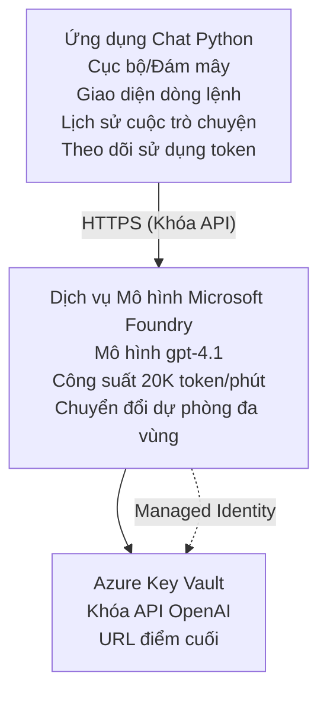

# Ứng dụng Chat Microsoft Foundry Models

**Lộ trình học:** Trung cấp ⭐⭐ | **Thời gian:** 35-45 phút | **Chi phí:** $50-200/month

Một ứng dụng chat hoàn chỉnh của Microsoft Foundry Models được triển khai bằng Azure Developer CLI (azd). Ví dụ này minh họa việc triển khai gpt-4.1, truy cập API an toàn và một giao diện chat đơn giản.

## 🎯 Những gì bạn sẽ học

- Triển khai Dịch vụ Microsoft Foundry Models với mô hình gpt-4.1
- Bảo mật khóa API OpenAI với Key Vault
- Xây dựng giao diện chat đơn giản bằng Python
- Giám sát việc sử dụng token và chi phí
- Thực hiện giới hạn tần suất và xử lý lỗi

## 📦 Những gì được bao gồm

✅ **Microsoft Foundry Models Service** - triển khai mô hình gpt-4.1  
✅ **Python Chat App** - Giao diện chat dòng lệnh đơn giản  
✅ **Tích hợp Key Vault** - Lưu trữ khóa API an toàn  
✅ **ARM Templates** - Hạ tầng dưới dạng mã hoàn chỉnh  
✅ **Giám sát chi phí** - Theo dõi sử dụng token  
✅ **Giới hạn tần suất** - Ngăn cạn kiệt hạn mức  

## Kiến trúc



## Yêu cầu

### Bắt buộc

- **Azure Developer CLI (azd)** - [Hướng dẫn cài đặt](https://learn.microsoft.com/azure/developer/azure-developer-cli/install-azd)
- **Azure subscription** with OpenAI access - [Yêu cầu quyền truy cập](https://aka.ms/oai/access)
- **Python 3.9+** - [Cài đặt Python](https://www.python.org/downloads/)

### Xác minh yêu cầu

```bash
# Kiểm tra phiên bản azd (cần 1.5.0 trở lên)
azd version

# Xác minh đăng nhập Azure
azd auth login

# Kiểm tra phiên bản Python
python --version  # hoặc python3 --version

# Xác minh quyền truy cập OpenAI (kiểm tra trong Cổng Azure)
az cognitiveservices account list-skus \
  --kind OpenAI \
  --location eastus
```

> **⚠️ Quan trọng:** Microsoft Foundry Models yêu cầu phê duyệt ứng dụng. Nếu bạn chưa nộp đơn, truy cập [aka.ms/oai/access](https://aka.ms/oai/access). Việc phê duyệt thường mất 1-2 ngày làm việc.

## ⏱️ Lịch trình triển khai

| Giai đoạn | Thời lượng | Nội dung |
|-------|----------|--------------|
| Kiểm tra yêu cầu | 2-3 minutes | Xác minh hạn ngạch OpenAI có sẵn |
| Triển khai hạ tầng | 8-12 minutes | Tạo OpenAI, Key Vault, triển khai mô hình |
| Cấu hình ứng dụng | 2-3 minutes | Thiết lập môi trường và phụ thuộc |
| **Tổng cộng** | **12-18 minutes** | Sẵn sàng chat với gpt-4.1 |

**Ghi chú:** Lần đầu triển khai OpenAI có thể mất lâu hơn do cấp phát mô hình.

## Bắt đầu nhanh

```bash
# Đi đến ví dụ
cd examples/azure-openai-chat

# Khởi tạo môi trường
azd env new myopenai

# Triển khai mọi thứ (cơ sở hạ tầng + cấu hình)
azd up
# Bạn sẽ được nhắc:
# 1. Chọn đăng ký Azure
# 2. Chọn khu vực có dịch vụ OpenAI (ví dụ: eastus, eastus2, westus)
# 3. Chờ 12-18 phút để triển khai

# Cài đặt các phụ thuộc Python
pip install -r requirements.txt

# Bắt đầu trò chuyện!
python chat.py
```

**Kết quả mong đợi:**
```
🤖 Microsoft Foundry Models Chat Application
Connected to: gpt-4.1 (eastus)
Type your message (or 'quit' to exit)

You: Hello! Tell me about Microsoft Foundry Models.
Assistant: Microsoft Foundry Models Service provides REST API access to OpenAI's powerful language models including gpt-4.1, GPT-3.5-Turbo, and Embeddings...

[Tokens used: 145 | Estimated cost: $0.0044]
```

## ✅ Xác minh triển khai

### Bước 1: Kiểm tra tài nguyên Azure

```bash
# Xem các tài nguyên đã triển khai
azd show

# Kết quả mong đợi hiển thị:
# - Dịch vụ OpenAI: (tên tài nguyên)
# - Key Vault: (tên tài nguyên)
# - Triển khai: gpt-4.1
# - Vị trí: eastus (hoặc vùng bạn đã chọn)
```

### Bước 2: Kiểm tra OpenAI API

```bash
# Lấy endpoint và khóa OpenAI
OPENAI_ENDPOINT=$(azd env get-value AZURE_OPENAI_ENDPOINT)
OPENAI_KEY=$(azd env get-value AZURE_OPENAI_API_KEY)

# Kiểm tra cuộc gọi API
curl "$OPENAI_ENDPOINT/openai/deployments/gpt-4.1/chat/completions?api-version=2024-08-01-preview" \
  -H "Content-Type: application/json" \
  -H "api-key: $OPENAI_KEY" \
  -d '{
    "messages": [{"role": "user", "content": "Say hello!"}],
    "max_tokens": 50
  }'
```

**Phản hồi mong đợi:**
```json
{
  "choices": [
    {
      "message": {
        "role": "assistant",
        "content": "Hello! How can I assist you today?"
      }
    }
  ],
  "usage": {
    "prompt_tokens": 8,
    "completion_tokens": 9,
    "total_tokens": 17
  }
}
```

### Bước 3: Xác minh truy cập Key Vault

```bash
# Liệt kê các bí mật trong Key Vault
KV_NAME=$(azd env get-value AZURE_KEY_VAULT_NAME)

az keyvault secret list \
  --vault-name $KV_NAME \
  --query "[].name" \
  --output table
```

**Các secret mong đợi:**
- `openai-api-key`
- `openai-endpoint`

**Tiêu chí thành công:**
- ✅ Dịch vụ OpenAI đã được triển khai với gpt-4.1
- ✅ Lệnh gọi API trả về kết quả hợp lệ
- ✅ Các secret được lưu trong Key Vault
- ✅ Việc theo dõi sử dụng token hoạt động

## Cấu trúc dự án

```
azure-openai-chat/
├── README.md                   ✅ This guide
├── azure.yaml                  ✅ AZD configuration
├── infra/                      ✅ Infrastructure as Code
│   ├── main.bicep             ✅ Main Bicep template
│   ├── main.parameters.json   ✅ Parameters
│   └── openai.bicep           ✅ OpenAI resource definition
├── src/                        ✅ Application code
│   ├── chat.py                ✅ Chat interface
│   ├── config.py              ✅ Configuration loader
│   └── requirements.txt       ✅ Python dependencies
└── .gitignore                  ✅ Git ignore rules
```

## Tính năng ứng dụng

### Giao diện Chat (`chat.py`)

Ứng dụng chat bao gồm:

- **Lịch sử hội thoại** - Duy trì ngữ cảnh giữa các tin nhắn
- **Đếm token** - Theo dõi sử dụng và ước tính chi phí
- **Xử lý lỗi** - Xử lý mượt mà giới hạn tần suất và lỗi API
- **Ước tính chi phí** - Tính toán chi phí theo thời gian thực cho mỗi tin nhắn
- **Hỗ trợ Streaming** - Phản hồi streaming tùy chọn

### Các lệnh

Khi đang chat, bạn có thể dùng:
- `quit` or `exit` - Kết thúc phiên
- `clear` - Xóa lịch sử hội thoại
- `tokens` - Hiển thị tổng lượng token đã dùng
- `cost` - Hiển thị ước tính tổng chi phí

### Cấu hình (`config.py`)

Nạp cấu hình từ biến môi trường:
```python
AZURE_OPENAI_ENDPOINT  # Từ Key Vault
AZURE_OPENAI_API_KEY   # Từ Key Vault
AZURE_OPENAI_MODEL     # Mặc định: gpt-4.1
AZURE_OPENAI_MAX_TOKENS # Mặc định: 800
```

## Ví dụ sử dụng

### Chat cơ bản

```bash
python chat.py
```

### Chat với mô hình tùy chỉnh

```bash
export AZURE_OPENAI_MODEL=gpt-35-turbo
python chat.py
```

### Chat với Streaming

```bash
python chat.py --stream
```

### Ví dụ hội thoại

```
You: Explain Microsoft Foundry Models Service in 3 sentences.
Assistant: Microsoft Foundry Models Service is Microsoft Azure's cloud platform offering 
that provides access to OpenAI's powerful language models. It enables developers 
to integrate capabilities like gpt-4.1 into their applications with enterprise-grade 
security and compliance. The service includes features for content filtering, 
abuse monitoring, and responsible AI practices.

[Tokens used: 89 | Estimated cost: $0.0027]

You: What models are available?
Assistant: Microsoft Foundry Models Service offers several model families including gpt-4.1 
(most capable), GPT-3.5-Turbo (faster and cost-effective), and Embeddings models 
for vector search. Each model has different capabilities, pricing, and token limits.

[Tokens used: 67 | Estimated cost: $0.0020]

Total session: 156 tokens | $0.0047
```

## Quản lý chi phí

### Giá token (gpt-4.1)

| Mô hình | Đầu vào (mỗi 1K token) | Đầu ra (mỗi 1K token) |
|-------|----------------------|------------------------|
| gpt-4.1 | $0.03 | $0.06 |
| GPT-3.5-Turbo | $0.0015 | $0.002 |

### Ước tính chi phí hàng tháng

Dựa trên mẫu sử dụng:

| Mức sử dụng | Tin nhắn/Ngày | Token/Ngày | Chi phí hàng tháng |
|-------------|--------------|------------|--------------|
| **Nhẹ** | 20 messages | 3,000 tokens | $3-5 |
| **Trung bình** | 100 messages | 15,000 tokens | $15-25 |
| **Nặng** | 500 messages | 75,000 tokens | $75-125 |

**Chi phí hạ tầng cơ bản:** $1-2/month (Key Vault + minimal compute)

### Mẹo tối ưu chi phí

```bash
# 1. Sử dụng GPT-3.5-Turbo cho các tác vụ đơn giản hơn (rẻ hơn 20 lần)
export AZURE_OPENAI_MODEL=gpt-35-turbo

# 2. Giảm số token tối đa để phản hồi ngắn hơn
export AZURE_OPENAI_MAX_TOKENS=400

# 3. Theo dõi việc sử dụng token
python chat.py --show-tokens

# 4. Thiết lập cảnh báo ngân sách
az consumption budget create \
  --budget-name "openai-budget" \
  --amount 50 \
  --time-grain Monthly
```

## Giám sát

### Xem sử dụng token

```bash
# Trong Cổng Azure:
# Tài nguyên OpenAI → Số liệu → Chọn "Token Transaction"

# Hoặc qua Azure CLI:
az monitor metrics list \
  --resource $(azd env get-value AZURE_OPENAI_RESOURCE_ID) \
  --metric "TokenTransaction" \
  --start-time $(date -u -d '1 hour ago' '+%Y-%m-%dT%H:%M:%S') \
  --interval PT1M
```

### Xem nhật ký API

```bash
# Phát trực tiếp nhật ký chẩn đoán
az monitor diagnostic-settings create \
  --resource $(azd env get-value AZURE_OPENAI_RESOURCE_ID) \
  --name openai-logs \
  --logs '[{"category": "Audit", "enabled": true}]' \
  --workspace $(azd env get-value LOG_ANALYTICS_WORKSPACE_ID)

# Nhật ký truy vấn
az monitor log-analytics query \
  --workspace $(azd env get-value LOG_ANALYTICS_WORKSPACE_ID) \
  --analytics-query "AzureDiagnostics | where Category == 'Audit' | top 10 by TimeGenerated"
```

## Khắc phục sự cố

### Vấn đề: "Access Denied" Error

**Triệu chứng:** 403 Forbidden khi gọi API

**Giải pháp:**
```bash
# 1. Xác minh truy cập OpenAI đã được phê duyệt
az cognitiveservices account show \
  --name $(azd env get-value AZURE_OPENAI_NAME) \
  --resource-group $(azd env get-value AZURE_RESOURCE_GROUP)

# 2. Kiểm tra khóa API có chính xác không
azd env get-value AZURE_OPENAI_API_KEY

# 3. Xác minh định dạng URL điểm cuối
azd env get-value AZURE_OPENAI_ENDPOINT
# Nên là: https://[name].openai.azure.com/
```

### Vấn đề: "Rate Limit Exceeded"

**Triệu chứng:** 429 Too Many Requests

**Giải pháp:**
```bash
# 1. Kiểm tra hạn mức hiện tại
az cognitiveservices account deployment show \
  --name $(azd env get-value AZURE_OPENAI_NAME) \
  --resource-group $(azd env get-value AZURE_RESOURCE_GROUP) \
  --deployment-name gpt-4.1

# 2. Yêu cầu tăng hạn mức (nếu cần)
# Đi tới Azure Portal → Tài nguyên OpenAI → Hạn mức → Yêu cầu tăng

# 3. Triển khai logic thử lại (đã có trong chat.py)
# Ứng dụng tự động thử lại với thời gian chờ tăng theo cấp số nhân
```

### Vấn đề: "Model Not Found"

**Triệu chứng:** 404 error for deployment

**Giải pháp:**
```bash
# 1. Liệt kê các triển khai có sẵn
az cognitiveservices account deployment list \
  --name $(azd env get-value AZURE_OPENAI_NAME) \
  --resource-group $(azd env get-value AZURE_RESOURCE_GROUP)

# 2. Xác minh tên mô hình trong môi trường
echo $AZURE_OPENAI_MODEL

# 3. Cập nhật thành tên triển khai chính xác
export AZURE_OPENAI_MODEL=gpt-4.1  # hoặc gpt-35-turbo
```

### Vấn đề: Độ trễ cao

**Triệu chứng:** Thời gian phản hồi chậm (>5 seconds)

**Giải pháp:**
```bash
# 1. Kiểm tra độ trễ theo khu vực
# Triển khai tới khu vực gần người dùng nhất

# 2. Giảm max_tokens để có phản hồi nhanh hơn
export AZURE_OPENAI_MAX_TOKENS=400

# 3. Sử dụng streaming để cải thiện trải nghiệm người dùng
python chat.py --stream
```

## Các thực hành bảo mật tốt nhất

### 1. Bảo vệ khóa API

```bash
# Không bao giờ đưa khóa vào kho mã nguồn
# Sử dụng Key Vault (đã được cấu hình)

# Thường xuyên thay đổi khóa
az cognitiveservices account keys regenerate \
  --name $(azd env get-value AZURE_OPENAI_NAME) \
  --resource-group $(azd env get-value AZURE_RESOURCE_GROUP) \
  --key-name key1
```

### 2. Triển khai lọc nội dung

```python
# Microsoft Foundry Models bao gồm bộ lọc nội dung tích hợp sẵn
# Cấu hình trong Azure Portal:
# Tài nguyên OpenAI → Bộ lọc nội dung → Tạo bộ lọc tùy chỉnh

# Danh mục: Thù hận, Tình dục, Bạo lực, Tự làm hại
# Mức độ lọc: Thấp, Trung bình, Cao
```

### 3. Sử dụng Managed Identity (Sản xuất)

```bash
# Đối với triển khai trong môi trường sản xuất, hãy sử dụng định danh được quản lý
# thay vì khóa API (yêu cầu ứng dụng được lưu trữ trên Azure)

# Cập nhật infra/openai.bicep để bao gồm:
# identity: { type: 'SystemAssigned' }
```

## Phát triển

### Chạy cục bộ

```bash
# Cài đặt các phụ thuộc
pip install -r src/requirements.txt

# Thiết lập biến môi trường
export AZURE_OPENAI_ENDPOINT="https://[name].openai.azure.com/"
export AZURE_OPENAI_API_KEY="your-api-key"
export AZURE_OPENAI_MODEL="gpt-4.1"

# Chạy ứng dụng
python src/chat.py
```

### Chạy kiểm thử

```bash
# Cài đặt phụ thuộc cho kiểm thử
pip install pytest pytest-cov

# Chạy các bài kiểm thử
pytest tests/ -v

# Với báo cáo độ bao phủ
pytest tests/ --cov=src --cov-report=html
```

### Cập nhật triển khai mô hình

```bash
# Triển khai phiên bản mô hình khác
az cognitiveservices account deployment create \
  --name $(azd env get-value AZURE_OPENAI_NAME) \
  --resource-group $(azd env get-value AZURE_RESOURCE_GROUP) \
  --deployment-name gpt-35-turbo \
  --model-name gpt-35-turbo \
  --model-version "0613" \
  --model-format OpenAI \
  --sku-capacity 20 \
  --sku-name "Standard"
```

## Dọn dẹp

```bash
# Xóa tất cả tài nguyên Azure
azd down --force --purge

# Việc này sẽ xóa:
# - Dịch vụ OpenAI
# - Key Vault (với chế độ xóa mềm 90 ngày)
# - Nhóm tài nguyên
# - Tất cả các triển khai và cấu hình
```

## Bước tiếp theo

### Mở rộng ví dụ này

1. **Thêm Web Interface** - Xây dựng frontend React/Vue
   ```bash
   # Thêm dịch vụ frontend vào azure.yaml
   # Triển khai lên Azure Static Web Apps
   ```

2. **Implement RAG** - Thêm tìm kiếm tài liệu với Azure AI Search
   ```python
   # Tích hợp Azure AI Search
   # Tải lên tài liệu và tạo chỉ mục vector
   ```

3. **Add Function Calling** - Kích hoạt sử dụng công cụ
   ```python
   # Định nghĩa các hàm trong chat.py
   # Cho phép gpt-4.1 gọi các API bên ngoài
   ```

4. **Multi-Model Support** - Triển khai nhiều mô hình
   ```bash
   # Thêm gpt-35-turbo và các mô hình embeddings
   # Triển khai logic định tuyến mô hình
   ```

### Ví dụ liên quan

- **[Retail Multi-Agent](../retail-scenario.md)** - Kiến trúc đa tác nhân nâng cao
- **[Database App](../../../../examples/database-app)** - Thêm lưu trữ bền vững
- **[Container Apps](../../../../examples/container-app)** - Triển khai dưới dạng dịch vụ container

### Tài nguyên học tập

- 📚 [AZD For Beginners Course](../../README.md) - Trang chủ khóa học
- 📚 [Microsoft Foundry Models Documentation](https://learn.microsoft.com/azure/ai-services/openai/) - Tài liệu chính thức
- 📚 [OpenAI API Reference](https://platform.openai.com/docs/api-reference) - Chi tiết API
- 📚 [Responsible AI](https://www.microsoft.com/ai/responsible-ai) - Thực hành tốt nhất

## Tài nguyên bổ sung

### Tài liệu
- **[Microsoft Foundry Models Service](https://learn.microsoft.com/azure/ai-services/openai/)** - Hướng dẫn đầy đủ
- **[gpt-4.1 Models](https://learn.microsoft.com/azure/ai-services/openai/concepts/models)** - Khả năng của mô hình
- **[Content Filtering](https://learn.microsoft.com/azure/ai-services/openai/concepts/content-filter)** - Tính năng an toàn
- **[Azure Developer CLI](https://learn.microsoft.com/azure/developer/azure-developer-cli/)** - Tài liệu azd

### Hướng dẫn
- **[OpenAI Quickstart](https://learn.microsoft.com/azure/ai-services/openai/quickstart)** - Triển khai lần đầu
- **[Chat Completions](https://learn.microsoft.com/azure/ai-services/openai/how-to/chatgpt)** - Xây dựng ứng dụng chat
- **[Function Calling](https://learn.microsoft.com/azure/ai-services/openai/how-to/function-calling)** - Tính năng nâng cao

### Công cụ
- **[Microsoft Foundry Models Studio](https://oai.azure.com/)** - Playground trên web
- **[Prompt Engineering Guide](https://platform.openai.com/docs/guides/prompt-engineering)** - Viết prompt tốt hơn
- **[Token Calculator](https://platform.openai.com/tokenizer)** - Ước tính sử dụng token

### Cộng đồng
- **[Azure AI Discord](https://discord.gg/azure)** - Nhận trợ giúp từ cộng đồng
- **[GitHub Discussions](https://github.com/Azure-Samples/openai/discussions)** - Diễn đàn Hỏi & Đáp
- **[Azure Blog](https://azure.microsoft.com/blog/tag/azure-openai-service/)** - Cập nhật mới nhất

---

**🎉 Thành công!** Bạn đã triển khai Microsoft Foundry Models và xây dựng một ứng dụng chat hoạt động. Bắt đầu khám phá khả năng của gpt-4.1 và thử nghiệm với các prompt và trường hợp sử dụng khác nhau.

**Có câu hỏi?** [Open an issue](https://github.com/microsoft/AZD-for-beginners/issues) hoặc xem [FAQ](../../resources/faq.md)

**Cảnh báo chi phí:** Hãy nhớ chạy `azd down` khi kết thúc việc thử nghiệm để tránh phí liên tục (~$50-100/month cho mức sử dụng đang hoạt động).

---

<!-- CO-OP TRANSLATOR DISCLAIMER START -->
**Tuyên bố miễn trừ trách nhiệm**:
Tài liệu này đã được dịch bằng dịch vụ dịch thuật AI [Co-op Translator](https://github.com/Azure/co-op-translator). Mặc dù chúng tôi cố gắng đảm bảo độ chính xác, xin lưu ý rằng bản dịch tự động có thể chứa lỗi hoặc sai sót. Tài liệu gốc bằng ngôn ngữ gốc nên được coi là nguồn tin chính thức. Đối với thông tin quan trọng, nên sử dụng dịch vụ dịch thuật chuyên nghiệp bởi con người. Chúng tôi không chịu trách nhiệm về bất kỳ hiểu lầm hoặc giải thích sai nào phát sinh từ việc sử dụng bản dịch này.
<!-- CO-OP TRANSLATOR DISCLAIMER END -->