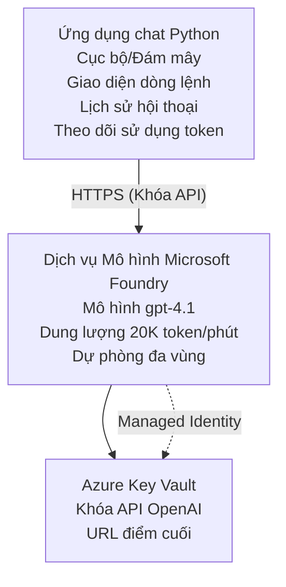

# Ứng dụng Chat Microsoft Foundry Models

**Lộ trình học:** Trung cấp ⭐⭐ | **Thời gian:** 35-45 phút | **Chi phí:** $50-200/tháng

Một ứng dụng chat Microsoft Foundry Models hoàn chỉnh được triển khai bằng Azure Developer CLI (azd). Ví dụ này minh họa việc triển khai gpt-4.1, truy cập API an toàn, và một giao diện chat đơn giản.

## 🎯 Những gì bạn sẽ học

- Triển khai Microsoft Foundry Models Service với mô hình gpt-4.1
- Bảo mật khóa OpenAI API bằng Key Vault
- Xây dựng giao diện chat đơn giản bằng Python
- Giám sát việc sử dụng token và chi phí
- Triển khai giới hạn tốc độ và xử lý lỗi

## 📦 Những gì bao gồm

✅ **Microsoft Foundry Models Service** - triển khai mô hình gpt-4.1  
✅ **Python Chat App** - Giao diện chat dòng lệnh đơn giản  
✅ **Key Vault Integration** - Lưu trữ khóa API an toàn  
✅ **ARM Templates** - Hạ tầng dưới dạng mã hoàn chỉnh  
✅ **Cost Monitoring** - Theo dõi việc sử dụng token  
✅ **Rate Limiting** - Ngăn ngừa cạn kiệt hạn mức  

## Architecture


## Prerequisites

### Required

- **Azure Developer CLI (azd)** - [Install guide](https://learn.microsoft.com/azure/developer/azure-developer-cli/install-azd)
- **Azure subscription** with OpenAI access - [Yêu cầu truy cập](https://aka.ms/oai/access)
- **Python 3.9+** - [Install Python](https://www.python.org/downloads/)

### Verify Prerequisites

```bash
# Kiểm tra phiên bản azd (cần 1.5.0 hoặc cao hơn)
azd version

# Xác minh đăng nhập Azure
azd auth login

# Kiểm tra phiên bản Python
python --version  # hoặc python3 --version

# Xác minh quyền truy cập OpenAI (kiểm tra trong Azure Portal)
az cognitiveservices account list-skus \
  --kind OpenAI \
  --location eastus
```

> **⚠️ Important:** Microsoft Foundry Models requires application approval. If you haven't applied, visit [aka.ms/oai/access](https://aka.ms/oai/access). Approval typically takes 1-2 business days.

## ⏱️ Deployment Timeline

| Phase | Duration | What Happens |
|-------|----------|--------------|
| Prerequisites check | 2-3 minutes | Verify OpenAI quota availability |
| Deploy infrastructure | 8-12 minutes | Create OpenAI, Key Vault, model deployment |
| Configure application | 2-3 minutes | Set up environment and dependencies |
| **Total** | **12-18 minutes** | Ready to chat with gpt-4.1 |

**Note:** First-time OpenAI deployment may take longer due to model provisioning.

## Quick Start

```bash
# Đi tới ví dụ
cd examples/azure-openai-chat

# Khởi tạo môi trường
azd env new myopenai

# Triển khai tất cả (cơ sở hạ tầng + cấu hình)
azd up
# Bạn sẽ được yêu cầu:
# 1. Chọn đăng ký Azure
# 2. Chọn vùng có OpenAI khả dụng (ví dụ: eastus, eastus2, westus)
# 3. Đợi 12-18 phút để triển khai

# Cài đặt các phụ thuộc Python
pip install -r requirements.txt

# Bắt đầu trò chuyện!
python chat.py
```

**Expected Output:**
```
🤖 Microsoft Foundry Models Chat Application
Connected to: gpt-4.1 (eastus)
Type your message (or 'quit' to exit)

You: Hello! Tell me about Microsoft Foundry Models.
Assistant: Microsoft Foundry Models Service provides REST API access to OpenAI's powerful language models including gpt-4.1, GPT-3.5-Turbo, and Embeddings...

[Tokens used: 145 | Estimated cost: $0.0044]
```

## ✅ Verify Deployment

### Step 1: Check Azure Resources

```bash
# Xem các tài nguyên đã triển khai
azd show

# Đầu ra mong đợi hiển thị:
# - Dịch vụ OpenAI: (tên tài nguyên)
# - Key Vault: (tên tài nguyên)
# - Triển khai: gpt-4.1
# - Vị trí: eastus (hoặc vùng bạn chọn)
```

### Step 2: Test OpenAI API

```bash
# Lấy endpoint và khóa OpenAI
OPENAI_ENDPOINT=$(azd env get-value AZURE_OPENAI_ENDPOINT)
OPENAI_KEY=$(azd env get-value AZURE_OPENAI_API_KEY)

# Thử gọi API
curl "$OPENAI_ENDPOINT/openai/deployments/gpt-4.1/chat/completions?api-version=2024-08-01-preview" \
  -H "Content-Type: application/json" \
  -H "api-key: $OPENAI_KEY" \
  -d '{
    "messages": [{"role": "user", "content": "Say hello!"}],
    "max_tokens": 50
  }'
```

**Expected Response:**
```json
{
  "choices": [
    {
      "message": {
        "role": "assistant",
        "content": "Hello! How can I assist you today?"
      }
    }
  ],
  "usage": {
    "prompt_tokens": 8,
    "completion_tokens": 9,
    "total_tokens": 17
  }
}
```

### Step 3: Verify Key Vault Access

```bash
# Liệt kê các bí mật trong Key Vault
KV_NAME=$(azd env get-value AZURE_KEY_VAULT_NAME)

az keyvault secret list \
  --vault-name $KV_NAME \
  --query "[].name" \
  --output table
```

**Expected Secrets:**
- `openai-api-key`
- `openai-endpoint`

**Success Criteria:**
- ✅ OpenAI service deployed with gpt-4.1
- ✅ API call returns valid completion
- ✅ Secrets stored in Key Vault
- ✅ Token usage tracking works

## Project Structure

```
azure-openai-chat/
├── README.md                   ✅ This guide
├── azure.yaml                  ✅ AZD configuration
├── infra/                      ✅ Infrastructure as Code
│   ├── main.bicep             ✅ Main Bicep template
│   ├── main.parameters.json   ✅ Parameters
│   └── openai.bicep           ✅ OpenAI resource definition
├── src/                        ✅ Application code
│   ├── chat.py                ✅ Chat interface
│   ├── config.py              ✅ Configuration loader
│   └── requirements.txt       ✅ Python dependencies
└── .gitignore                  ✅ Git ignore rules
```

## Application Features

### Chat Interface (`chat.py`)

Ứng dụng chat bao gồm:

- **Conversation History** - Duy trì ngữ cảnh giữa các tin nhắn
- **Token Counting** - Theo dõi việc sử dụng và ước tính chi phí
- **Error Handling** - Xử lý khéo léo giới hạn tốc độ và lỗi API
- **Cost Estimation** - Tính toán chi phí theo thời gian thực cho mỗi tin nhắn
- **Streaming Support** - Hỗ trợ phản hồi dạng streaming tùy chọn

### Commands

Khi chat, bạn có thể sử dụng:
- `quit` or `exit` - Kết thúc phiên
- `clear` - Xóa lịch sử hội thoại
- `tokens` - Hiển thị tổng số token đã dùng
- `cost` - Hiển thị ước tính tổng chi phí

### Configuration (`config.py`)

Tải cấu hình từ biến môi trường:
```python
AZURE_OPENAI_ENDPOINT  # Từ Key Vault
AZURE_OPENAI_API_KEY   # Từ Key Vault
AZURE_OPENAI_MODEL     # Mặc định: gpt-4.1
AZURE_OPENAI_MAX_TOKENS # Mặc định: 800
```

## Usage Examples

### Basic Chat

```bash
python chat.py
```

### Chat with Custom Model

```bash
export AZURE_OPENAI_MODEL=gpt-35-turbo
python chat.py
```

### Chat with Streaming

```bash
python chat.py --stream
```

### Example Conversation

```
You: Explain Microsoft Foundry Models Service in 3 sentences.
Assistant: Microsoft Foundry Models Service is Microsoft Azure's cloud platform offering 
that provides access to OpenAI's powerful language models. It enables developers 
to integrate capabilities like gpt-4.1 into their applications with enterprise-grade 
security and compliance. The service includes features for content filtering, 
abuse monitoring, and responsible AI practices.

[Tokens used: 89 | Estimated cost: $0.0027]

You: What models are available?
Assistant: Microsoft Foundry Models Service offers several model families including gpt-4.1 
(most capable), GPT-3.5-Turbo (faster and cost-effective), and Embeddings models 
for vector search. Each model has different capabilities, pricing, and token limits.

[Tokens used: 67 | Estimated cost: $0.0020]

Total session: 156 tokens | $0.0047
```

## Cost Management

### Token Pricing (gpt-4.1)

| Model | Input (per 1K tokens) | Output (per 1K tokens) |
|-------|----------------------|------------------------|
| gpt-4.1 | $0.03 | $0.06 |
| GPT-3.5-Turbo | $0.0015 | $0.002 |

### Estimated Monthly Costs

Dựa trên mô hình sử dụng:

| Usage Level | Messages/Day | Tokens/Day | Monthly Cost |
|-------------|--------------|------------|--------------|
| **Light** | 20 messages | 3,000 tokens | $3-5 |
| **Moderate** | 100 messages | 15,000 tokens | $15-25 |
| **Heavy** | 500 messages | 75,000 tokens | $75-125 |

**Base Infrastructure Cost:** $1-2/month (Key Vault + minimal compute)

### Cost Optimization Tips

```bash
# 1. Sử dụng GPT-3.5-Turbo cho các tác vụ đơn giản (rẻ hơn 20 lần)
export AZURE_OPENAI_MODEL=gpt-35-turbo

# 2. Giảm số token tối đa để có phản hồi ngắn hơn
export AZURE_OPENAI_MAX_TOKENS=400

# 3. Theo dõi việc sử dụng token
python chat.py --show-tokens

# 4. Thiết lập cảnh báo ngân sách
az consumption budget create \
  --budget-name "openai-budget" \
  --amount 50 \
  --time-grain Monthly
```

## Monitoring

### View Token Usage

```bash
# Trong Cổng Azure:
# Tài nguyên OpenAI → Số liệu → Chọn "Giao dịch token"

# Hoặc qua Azure CLI:
az monitor metrics list \
  --resource $(azd env get-value AZURE_OPENAI_RESOURCE_ID) \
  --metric "TokenTransaction" \
  --start-time $(date -u -d '1 hour ago' '+%Y-%m-%dT%H:%M:%S') \
  --interval PT1M
```

### View API Logs

```bash
# Phát trực tuyến nhật ký chẩn đoán
az monitor diagnostic-settings create \
  --resource $(azd env get-value AZURE_OPENAI_RESOURCE_ID) \
  --name openai-logs \
  --logs '[{"category": "Audit", "enabled": true}]' \
  --workspace $(azd env get-value LOG_ANALYTICS_WORKSPACE_ID)

# Nhật ký truy vấn
az monitor log-analytics query \
  --workspace $(azd env get-value LOG_ANALYTICS_WORKSPACE_ID) \
  --analytics-query "AzureDiagnostics | where Category == 'Audit' | top 10 by TimeGenerated"
```

## Troubleshooting

### Issue: "Access Denied" Error

**Symptoms:** 403 Forbidden when calling API

**Solutions:**
```bash
# 1. Xác minh quyền truy cập OpenAI đã được phê duyệt
az cognitiveservices account show \
  --name $(azd env get-value AZURE_OPENAI_NAME) \
  --resource-group $(azd env get-value AZURE_RESOURCE_GROUP)

# 2. Kiểm tra khóa API có chính xác không
azd env get-value AZURE_OPENAI_API_KEY

# 3. Xác minh định dạng URL của endpoint
azd env get-value AZURE_OPENAI_ENDPOINT
# Nên là: https://[name].openai.azure.com/
```

### Issue: "Rate Limit Exceeded"

**Symptoms:** 429 Too Many Requests

**Solutions:**
```bash
# 1. Kiểm tra hạn ngạch hiện tại
az cognitiveservices account deployment show \
  --name $(azd env get-value AZURE_OPENAI_NAME) \
  --resource-group $(azd env get-value AZURE_RESOURCE_GROUP) \
  --deployment-name gpt-4.1

# 2. Yêu cầu tăng hạn ngạch (nếu cần)
# Vào Azure Portal → Tài nguyên OpenAI → Hạn ngạch → Yêu cầu tăng

# 3. Triển khai cơ chế thử lại (đã có trong chat.py)
# Ứng dụng tự động thử lại với độ trễ tăng theo hàm mũ
```

### Issue: "Model Not Found"

**Symptoms:** 404 error for deployment

**Solutions:**
```bash
# 1. Liệt kê các bản triển khai có sẵn
az cognitiveservices account deployment list \
  --name $(azd env get-value AZURE_OPENAI_NAME) \
  --resource-group $(azd env get-value AZURE_RESOURCE_GROUP)

# 2. Xác minh tên mô hình trong môi trường
echo $AZURE_OPENAI_MODEL

# 3. Cập nhật tên bản triển khai cho đúng
export AZURE_OPENAI_MODEL=gpt-4.1  # hoặc gpt-35-turbo
```

### Issue: High Latency

**Symptoms:** Slow response times (>5 seconds)

**Solutions:**
```bash
# 1. Kiểm tra độ trễ theo vùng
# Triển khai tới vùng gần người dùng nhất

# 2. Giảm max_tokens để phản hồi nhanh hơn
export AZURE_OPENAI_MAX_TOKENS=400

# 3. Sử dụng streaming để cải thiện trải nghiệm người dùng
python chat.py --stream
```

## Security Best Practices

### 1. Protect API Keys

```bash
# Không bao giờ đưa khóa vào hệ thống quản lý mã nguồn
# Sử dụng Key Vault (đã được cấu hình)

# Thường xuyên xoay khóa
az cognitiveservices account keys regenerate \
  --name $(azd env get-value AZURE_OPENAI_NAME) \
  --resource-group $(azd env get-value AZURE_RESOURCE_GROUP) \
  --key-name key1
```

### 2. Implement Content Filtering

```python
# Microsoft Foundry Models bao gồm bộ lọc nội dung tích hợp sẵn
# Cấu hình trong Cổng thông tin Azure:
# Tài nguyên OpenAI → Bộ lọc nội dung → Tạo bộ lọc tùy chỉnh

# Các loại: Thù hận, Tình dục, Bạo lực, Tự làm hại
# Mức độ lọc: Thấp, Trung bình, Cao
```

### 3. Use Managed Identity (Production)

```bash
# Đối với triển khai sản xuất, hãy sử dụng định danh được quản lý
# thay vì khóa API (yêu cầu ứng dụng được lưu trữ trên Azure)

# Cập nhật infra/openai.bicep để bao gồm:
# identity: { type: 'SystemAssigned' }
```

## Development

### Run Locally

```bash
# Cài đặt các phụ thuộc
pip install -r src/requirements.txt

# Thiết lập biến môi trường
export AZURE_OPENAI_ENDPOINT="https://[name].openai.azure.com/"
export AZURE_OPENAI_API_KEY="your-api-key"
export AZURE_OPENAI_MODEL="gpt-4.1"

# Chạy ứng dụng
python src/chat.py
```

### Run Tests

```bash
# Cài đặt các phụ thuộc cho kiểm thử
pip install pytest pytest-cov

# Chạy kiểm thử
pytest tests/ -v

# Với báo cáo độ bao phủ mã
pytest tests/ --cov=src --cov-report=html
```

### Update Model Deployment

```bash
# Triển khai phiên bản mô hình khác
az cognitiveservices account deployment create \
  --name $(azd env get-value AZURE_OPENAI_NAME) \
  --resource-group $(azd env get-value AZURE_RESOURCE_GROUP) \
  --deployment-name gpt-35-turbo \
  --model-name gpt-35-turbo \
  --model-version "0613" \
  --model-format OpenAI \
  --sku-capacity 20 \
  --sku-name "Standard"
```

## Clean Up

```bash
# Xóa tất cả tài nguyên Azure
azd down --force --purge

# Việc này sẽ xóa:
# - Dịch vụ OpenAI
# - Key Vault (với xóa mềm 90 ngày)
# - Nhóm tài nguyên
# - Tất cả các triển khai và cấu hình
```

## Next Steps

### Expand This Example

1. **Add Web Interface** - Xây dựng frontend React/Vue
   ```bash
   # Thêm dịch vụ frontend vào azure.yaml
   # Triển khai lên Azure Static Web Apps
   ```

2. **Implement RAG** - Thêm tìm kiếm tài liệu với Azure AI Search
   ```python
   # Tích hợp Azure Cognitive Search
   # Tải lên tài liệu và tạo chỉ mục vector
   ```

3. **Add Function Calling** - Kích hoạt sử dụng công cụ (function calling)
   ```python
   # Định nghĩa các hàm trong chat.py
   # Cho phép gpt-4.1 gọi các API bên ngoài
   ```

4. **Multi-Model Support** - Triển khai nhiều mô hình
   ```bash
   # Thêm mô hình gpt-35-turbo và các mô hình embeddings
   # Triển khai logic định tuyến mô hình
   ```

### Related Examples

- **[Retail Multi-Agent](../retail-scenario.md)** - Kiến trúc đa tác nhân nâng cao
- **[Database App](../../../../examples/database-app)** - Thêm lưu trữ bền vững
- **[Container Apps](../../../../examples/container-app)** - Triển khai dưới dạng dịch vụ đóng gói

### Learning Resources

- 📚 [AZD For Beginners Course](../../README.md) - Trang chủ khóa học
- 📚 [Microsoft Foundry Models Documentation](https://learn.microsoft.com/azure/ai-services/openai/) - Tài liệu chính thức
- 📚 [OpenAI API Reference](https://platform.openai.com/docs/api-reference) - Chi tiết API
- 📚 [Responsible AI](https://www.microsoft.com/ai/responsible-ai) - Thực hành tốt nhất

## Additional Resources

### Documentation
- **[Microsoft Foundry Models Service](https://learn.microsoft.com/azure/ai-services/openai/)** - Hướng dẫn toàn diện
- **[gpt-4.1 Models](https://learn.microsoft.com/azure/ai-services/openai/concepts/models)** - Khả năng của mô hình
- **[Content Filtering](https://learn.microsoft.com/azure/ai-services/openai/concepts/content-filter)** - Tính năng an toàn
- **[Azure Developer CLI](https://learn.microsoft.com/azure/developer/azure-developer-cli/)** - Tài liệu tham khảo azd

### Tutorials
- **[OpenAI Quickstart](https://learn.microsoft.com/azure/ai-services/openai/quickstart)** - Lần triển khai đầu tiên
- **[Chat Completions](https://learn.microsoft.com/azure/ai-services/openai/how-to/chatgpt)** - Xây dựng ứng dụng chat
- **[Function Calling](https://learn.microsoft.com/azure/ai-services/openai/how-to/function-calling)** - Tính năng nâng cao

### Tools
- **[Microsoft Foundry Models Studio](https://oai.azure.com/)** - Môi trường thử nghiệm trên web
- **[Prompt Engineering Guide](https://platform.openai.com/docs/guides/prompt-engineering)** - Viết prompt tốt hơn
- **[Token Calculator](https://platform.openai.com/tokenizer)** - Ước tính việc sử dụng token

### Community
- **[Azure AI Discord](https://discord.gg/azure)** - Nhận trợ giúp từ cộng đồng
- **[GitHub Discussions](https://github.com/Azure-Samples/openai/discussions)** - Diễn đàn Hỏi & Đáp
- **[Azure Blog](https://azure.microsoft.com/blog/tag/azure-openai-service/)** - Cập nhật mới nhất

---

**🎉 Chúc mừng!** Bạn đã triển khai Microsoft Foundry Models và xây dựng một ứng dụng chat hoạt động. Bắt đầu khám phá khả năng của gpt-4.1 và thử nghiệm với các prompt và trường hợp sử dụng khác nhau.

**Có câu hỏi?** [Open an issue](https://github.com/microsoft/AZD-for-beginners/issues) hoặc xem [Câu hỏi thường gặp](../../resources/faq.md)

**Cảnh báo chi phí:** Hãy nhớ chạy `azd down` khi kết thúc việc thử nghiệm để tránh bị tính phí liên tục (~$50-100/tháng cho mức sử dụng hoạt động).

---

<!-- CO-OP TRANSLATOR DISCLAIMER START -->
**Miễn trừ trách nhiệm**:
Tài liệu này đã được dịch bằng dịch vụ dịch thuật AI [Co-op Translator](https://github.com/Azure/co-op-translator). Mặc dù chúng tôi nỗ lực để đảm bảo độ chính xác, xin lưu ý rằng các bản dịch tự động có thể chứa lỗi hoặc không chính xác. Tài liệu gốc bằng ngôn ngữ nguyên bản của nó nên được coi là nguồn có thẩm quyền. Đối với các thông tin quan trọng, nên sử dụng dịch vụ dịch thuật chuyên nghiệp do con người thực hiện. Chúng tôi không chịu trách nhiệm đối với bất kỳ sự hiểu lầm hoặc diễn giải sai nào phát sinh từ việc sử dụng bản dịch này.
<!-- CO-OP TRANSLATOR DISCLAIMER END -->