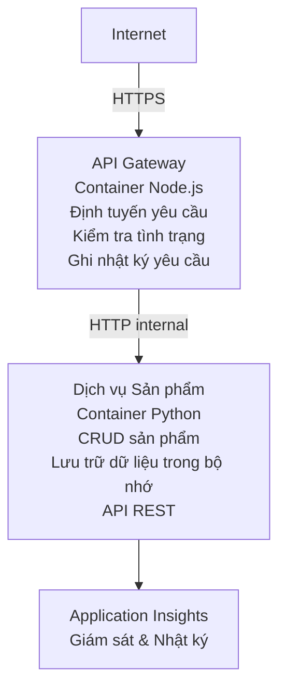

# Kiến trúc Microservices - Ví dụ Container App

⏱️ **Thời gian ước tính**: 25-35 phút | 💰 **Chi phí ước tính**: ~$50-100/tháng | ⭐ **Độ phức tạp**: Nâng cao

Một **kiến trúc microservices đơn giản nhưng chức năng** được triển khai lên Azure Container Apps sử dụng AZD CLI. Ví dụ này minh họa giao tiếp giữa các dịch vụ, điều phối container và giám sát với một cấu hình thực tế gồm 2 dịch vụ.

> **📚 Cách tiếp cận học tập**: Ví dụ này bắt đầu với kiến trúc tối thiểu 2 dịch vụ (API Gateway + Backend Service) mà bạn có thể thực sự triển khai và học hỏi. Sau khi làm chủ nền tảng này, chúng tôi cung cấp hướng dẫn để mở rộng thành hệ sinh thái microservices đầy đủ.

## Những gì bạn sẽ học

Bằng cách hoàn thành ví dụ này, bạn sẽ:
- Triển khai nhiều container lên Azure Container Apps
- Thực hiện giao tiếp dịch vụ-tới-dịch vụ với mạng nội bộ
- Cấu hình tự động mở rộng dựa trên môi trường và kiểm tra sức khỏe
- Giám sát ứng dụng phân tán với Application Insights
- Hiểu các mẫu triển khai microservices và thực hành tốt nhất
- Học cách mở rộng dần từ kiến trúc đơn giản đến phức tạp

## Kiến trúc

### Giai đoạn 1: Những gì chúng ta đang xây dựng (Bao gồm trong ví dụ này)


**Tại sao bắt đầu đơn giản?**
- ✅ Triển khai và hiểu nhanh chóng (25-35 phút)
- ✅ Học các mẫu microservices cốt lõi mà không phức tạp
- ✅ Mã hoạt động mà bạn có thể sửa đổi và thử nghiệm
- ✅ Chi phí thấp hơn để học (~$50-100/tháng so với $300-1400/tháng)
- ✅ Xây dựng sự tự tin trước khi thêm cơ sở dữ liệu và hàng đợi thông điệp

**Ẩn dụ**: Hãy nghĩ điều này giống như học lái xe. Bạn bắt đầu với bãi đậu xe trống (2 dịch vụ), làm chủ các điều cơ bản, rồi tiến tới giao thông đô thị (5+ dịch vụ với cơ sở dữ liệu).

### Giai đoạn 2: Mở rộng trong tương lai (Kiến trúc tham khảo)

Khi bạn làm chủ kiến trúc 2 dịch vụ, bạn có thể mở rộng thành:

```
Full Architecture (Not Included - For Reference)
├── API Gateway (✅ Included)
├── Product Service (✅ Included)
├── Order Service (🔜 Add next)
├── User Service (🔜 Add next)
├── Notification Service (🔜 Add last)
├── Azure Service Bus (🔜 For async communication)
├── Cosmos DB (🔜 For product persistence)
├── Azure SQL (🔜 For order management)
└── Azure Storage (🔜 For file storage)
```

Xem phần "Expansion Guide" ở cuối để có hướng dẫn từng bước.

## Tính năng được bao gồm

✅ **Khám phá dịch vụ**: Khám phá tự động dựa trên DNS giữa các container  
✅ **Cân bằng tải**: Cân bằng tải tích hợp giữa các bản sao  
✅ **Tự động mở rộng**: Tự động mở rộng độc lập cho từng dịch vụ dựa trên yêu cầu HTTP  
✅ **Giám sát sức khỏe**: Liveness và readiness probes cho cả hai dịch vụ  
✅ **Ghi nhật ký phân tán**: Ghi nhật ký tập trung với Application Insights  
✅ **Mạng nội bộ**: Giao tiếp an toàn giữa các dịch vụ  
✅ **Điều phối container**: Triển khai và mở rộng tự động  
✅ **Cập nhật không gián đoạn**: Rolling updates với quản lý revision  

## Yêu cầu trước

### Công cụ cần có

Trước khi bắt đầu, kiểm tra rằng bạn đã cài các công cụ sau:

1. **[Azure Developer CLI (azd)](https://learn.microsoft.com/azure/developer/azure-developer-cli/install-azd)** (phiên bản 1.0.0 trở lên)
   ```bash
   azd version
   # Kết quả mong đợi: azd phiên bản 1.0.0 hoặc cao hơn
   ```

2. **[Azure CLI](https://learn.microsoft.com/cli/azure/install-azure-cli)** (phiên bản 2.50.0 trở lên)
   ```bash
   az --version
   # Đầu ra mong đợi: azure-cli 2.50.0 trở lên
   ```

3. **[Docker](https://www.docker.com/get-started)** (cho phát triển/kiểm thử cục bộ - tùy chọn)
   ```bash
   docker --version
   # Đầu ra mong đợi: Docker phiên bản 20.10 trở lên
   ```

### Yêu cầu Azure

- Một **subscription Azure** đang hoạt động ([tạo tài khoản miễn phí](https://azure.microsoft.com/free/))
- Quyền tạo tài nguyên trong subscription của bạn
- Vai trò **Contributor** trên subscription hoặc resource group

### Kiến thức nền tảng

Đây là ví dụ **trình độ nâng cao**. Bạn nên:
- Đã hoàn thành ví dụ [Simple Flask API example](../../../../../examples/container-app/simple-flask-api) 
- Hiểu cơ bản về kiến trúc microservices
- Quen với REST API và HTTP
- Hiểu các khái niệm về container

**Mới với Container Apps?** Bắt đầu với ví dụ [Simple Flask API example](../../../../../examples/container-app/simple-flask-api) trước để học các kiến thức cơ bản.

## Bắt đầu nhanh (Từng bước)

### Bước 1: Clone và điều hướng

```bash
git clone https://github.com/microsoft/AZD-for-beginners.git
cd AZD-for-beginners/examples/container-app/microservices
```

**✓ Kiểm tra thành công**: Xác nhận bạn thấy `azure.yaml`:
```bash
ls
# Kỳ vọng: README.md, azure.yaml, infra/, src/
```

### Bước 2: Xác thực với Azure

```bash
azd auth login
```

Điều này mở trình duyệt của bạn để xác thực Azure. Đăng nhập bằng thông tin đăng nhập Azure của bạn.

**✓ Kiểm tra thành công**: Bạn sẽ thấy:
```
Logged in to Azure.
```

### Bước 3: Khởi tạo môi trường

```bash
azd init
```

**Các lời nhắc bạn sẽ thấy**:
- **Environment name**: Nhập một tên ngắn (ví dụ: `microservices-dev`)
- **Azure subscription**: Chọn subscription của bạn
- **Azure location**: Chọn một khu vực (ví dụ: `eastus`, `westeurope`)

**✓ Kiểm tra thành công**: Bạn sẽ thấy:
```
SUCCESS: New project initialized!
```

### Bước 4: Triển khai hạ tầng và dịch vụ

```bash
azd up
```

**Chuyện gì xảy ra** (mất 8-12 phút):
1. Tạo Container Apps environment
2. Tạo Application Insights để giám sát
3. Xây dựng container API Gateway (Node.js)
4. Xây dựng container Product Service (Python)
5. Triển khai cả hai container lên Azure
6. Cấu hình mạng và kiểm tra sức khỏe
7. Thiết lập giám sát và ghi nhật ký

**✓ Kiểm tra thành công**: Bạn sẽ thấy:
```
SUCCESS: Your application was deployed to Azure in X minutes Y seconds.
Endpoint: https://api-gateway-<unique-id>.azurecontainerapps.io
```

**⏱️ Thời gian**: 8-12 phút

### Bước 5: Kiểm thử triển khai

```bash
# Lấy điểm cuối của gateway
GATEWAY_URL=$(azd env get-values | grep API_GATEWAY_URL | cut -d '=' -f2 | tr -d '"')

# Kiểm tra tình trạng hoạt động của API Gateway
curl $GATEWAY_URL/health

# Kết quả mong đợi:
# {"status":"khỏe","service":"api-gateway","timestamp":"2025-11-19T10:30:00Z"}
```

**Kiểm thử dịch vụ product qua gateway**:
```bash
# Liệt kê sản phẩm
curl $GATEWAY_URL/api/products

# Kết quả mong đợi:
# [
#   {"id":1,"name":"Máy tính xách tay","price":999.99,"stock":50},
#   {"id":2,"name":"Chuột","price":29.99,"stock":200},
#   {"id":3,"name":"Bàn phím","price":79.99,"stock":150}
# ]
```

**✓ Kiểm tra thành công**: Cả hai endpoint trả về dữ liệu JSON không có lỗi.

---

**🎉 Xin chúc mừng!** Bạn đã triển khai một kiến trúc microservices lên Azure!

## Cấu trúc dự án

Tất cả các tệp triển khai đều được bao gồm—đây là một ví dụ đầy đủ, hoạt động:

```
microservices/
│
├── README.md                         # This file
├── azure.yaml                        # AZD configuration
├── .gitignore                        # Git ignore patterns
│
├── infra/                           # Infrastructure as Code (Bicep)
│   ├── main.bicep                   # Main orchestration
│   ├── abbreviations.json           # Naming conventions
│   ├── core/                        # Shared infrastructure
│   │   ├── container-apps-environment.bicep  # Container environment + registry
│   │   └── monitor.bicep            # Application Insights + Log Analytics
│   └── app/                         # Service definitions
│       ├── api-gateway.bicep        # API Gateway container app
│       └── product-service.bicep    # Product Service container app
│
└── src/                             # Application source code
    ├── api-gateway/                 # Node.js API Gateway
    │   ├── app.js                   # Express server with routing
    │   ├── package.json             # Node dependencies
    │   └── Dockerfile               # Container definition
    └── product-service/             # Python Product Service
        ├── main.py                  # Flask API with product data
        ├── requirements.txt         # Python dependencies
        └── Dockerfile               # Container definition
```

**Mỗi thành phần làm gì:**

**Hạ tầng (infra/)**:
- `main.bicep`: Điều phối tất cả tài nguyên Azure và phụ thuộc của chúng
- `core/container-apps-environment.bicep`: Tạo Container Apps environment và Azure Container Registry
- `core/monitor.bicep`: Thiết lập Application Insights cho ghi nhật ký phân tán
- `app/*.bicep`: Định nghĩa từng container app với cấu hình mở rộng và kiểm tra sức khỏe

**API Gateway (src/api-gateway/)**:
- Dịch vụ hướng công chúng điều hướng yêu cầu tới các dịch vụ backend
- Thực hiện ghi nhật ký, xử lý lỗi và chuyển tiếp yêu cầu
- Minh họa giao tiếp HTTP dịch vụ-tới-dịch vụ

**Product Service (src/product-service/)**:
- Dịch vụ nội bộ với danh mục sản phẩm (lưu trong bộ nhớ để đơn giản)
- REST API với kiểm tra sức khỏe
- Ví dụ về mẫu microservice backend

## Tổng quan các dịch vụ

### API Gateway (Node.js/Express)

**Port**: 8080  
**Truy cập**: Công khai (ingress ngoài)  
**Mục đích**: Định tuyến các yêu cầu đến các dịch vụ backend phù hợp  

**Endpoints**:
- `GET /` - Thông tin dịch vụ
- `GET /health` - Endpoint kiểm tra sức khỏe
- `GET /api/products` - Chuyển tiếp tới product service (liệt kê tất cả)
- `GET /api/products/:id` - Chuyển tiếp tới product service (lấy theo ID)

**Tính năng chính**:
- Định tuyến yêu cầu với axios
- Ghi nhật ký tập trung
- Xử lý lỗi và quản lý timeout
- Khám phá dịch vụ qua biến môi trường
- Tích hợp Application Insights

**Nổi bật mã** (`src/api-gateway/app.js`):
```javascript
// Giao tiếp dịch vụ nội bộ
app.get('/api/products', async (req, res) => {
  const response = await axios.get(`${PRODUCT_SERVICE_URL}/products`);
  res.json(response.data);
});
```

### Product Service (Python/Flask)

**Port**: 8000  
**Truy cập**: Chỉ nội bộ (không có ingress ngoài)  
**Mục đích**: Quản lý danh mục sản phẩm với dữ liệu trong bộ nhớ  

**Endpoints**:
- `GET /` - Thông tin dịch vụ
- `GET /health` - Endpoint kiểm tra sức khỏe
- `GET /products` - Liệt kê tất cả sản phẩm
- `GET /products/<id>` - Lấy sản phẩm theo ID

**Tính năng chính**:
- RESTful API với Flask
- Kho sản phẩm trong bộ nhớ (đơn giản, không cần cơ sở dữ liệu)
- Giám sát sức khỏe với probes
- Ghi nhật ký có cấu trúc
- Tích hợp Application Insights

**Mô hình dữ liệu**:
```python
{
  "id": 1,
  "name": "Laptop",
  "description": "High-performance laptop",
  "price": 999.99,
  "stock": 50
}
```

**Tại sao chỉ nội bộ?**
Dịch vụ product không được phơi bày công khai. Tất cả yêu cầu phải đi qua API Gateway, điều này cung cấp:
- Bảo mật: Điểm truy cập được kiểm soát
- Linh hoạt: Có thể thay đổi backend mà không ảnh hưởng tới client
- Giám sát: Ghi nhật ký yêu cầu tập trung

## Hiểu giao tiếp giữa các dịch vụ

### Dịch vụ giao tiếp với nhau như thế nào

Trong ví dụ này, API Gateway giao tiếp với Product Service sử dụng **HTTP nội bộ**:

```javascript
// Cổng API (src/api-gateway/app.js)
const PRODUCT_SERVICE_URL = process.env.PRODUCT_SERVICE_URL;

// Thực hiện yêu cầu HTTP nội bộ
const response = await axios.get(`${PRODUCT_SERVICE_URL}/products`);
```

**Điểm chính**:

1. **Khám phá dựa trên DNS**: Container Apps tự động cung cấp DNS cho các dịch vụ nội bộ
   - Product Service FQDN: `product-service.internal.<environment>.azurecontainerapps.io`
   - Đơn giản hóa thành: `http://product-service` (Container Apps sẽ phân giải)

2. **Không phơi bày công khai**: Product Service có `external: false` trong Bicep
   - Chỉ truy cập được trong Container Apps environment
   - Không thể truy cập từ Internet

3. **Biến môi trường**: URL dịch vụ được tiêm vào thời điểm triển khai
   - Bicep truyền FQDN nội bộ tới gateway
   - Không có URL cứng trong mã ứng dụng

**Ẩn dụ**: Hãy nghĩ điều này giống như các phòng trong văn phòng. API Gateway là quầy lễ tân (hướng công chúng), và Product Service là phòng làm việc (chỉ nội bộ). Khách phải qua lễ tân để tới bất kỳ phòng nào.

## Tùy chọn triển khai

### Triển khai đầy đủ (Khuyến nghị)

```bash
# Triển khai hạ tầng và cả hai dịch vụ
azd up
```

Việc này sẽ triển khai:
1. Container Apps environment
2. Application Insights
3. Container Registry
4. Container API Gateway
5. Container Product Service

**Thời gian**: 8-12 phút

### Triển khai từng dịch vụ

```bash
# Chỉ triển khai một dịch vụ (sau khi chạy azd up ban đầu)
azd deploy api-gateway

# Hoặc triển khai dịch vụ product
azd deploy product-service
```

**Trường hợp sử dụng**: Khi bạn đã cập nhật mã trong một dịch vụ và chỉ muốn triển khai lại dịch vụ đó.

### Cập nhật cấu hình

```bash
# Thay đổi các tham số tỷ lệ
azd env set GATEWAY_MAX_REPLICAS 30

# Triển khai lại với cấu hình mới
azd up
```

## Cấu hình

### Cấu hình mở rộng

Cả hai dịch vụ được cấu hình với autoscaling dựa trên HTTP trong các tệp Bicep của chúng:

**API Gateway**:
- Min replicas: 2 (luôn ít nhất 2 để đảm bảo sẵn sàng)
- Max replicas: 20
- Kích hoạt scale: 50 yêu cầu đồng thời trên mỗi replica

**Product Service**:
- Min replicas: 1 (có thể scale về zero nếu cần)
- Max replicas: 10
- Kích hoạt scale: 100 yêu cầu đồng thời trên mỗi replica

**Tùy chỉnh mở rộng** (trong `infra/app/*.bicep`):
```bicep
scale: {
  minReplicas: 1
  maxReplicas: 10
  rules: [
    {
      name: 'http-scale-rule'
      http: {
        metadata: {
          concurrentRequests: '100'  // Adjust this
        }
      }
    }
  ]
}
```

### Phân bổ tài nguyên

**API Gateway**:
- CPU: 1.0 vCPU
- Memory: 2 GiB
- Lý do: Xử lý toàn bộ lưu lượng bên ngoài

**Product Service**:
- CPU: 0.5 vCPU
- Memory: 1 GiB
- Lý do: Thao tác nhẹ trong bộ nhớ

### Kiểm tra sức khỏe

Cả hai dịch vụ bao gồm liveness và readiness probes:

```bicep
probes: [
  {
    type: 'Liveness'
    httpGet: {
      path: '/health'
      port: 8080
    }
    initialDelaySeconds: 10
    periodSeconds: 30
  }
  {
    type: 'Readiness'
    httpGet: {
      path: '/health'
      port: 8080
    }
    initialDelaySeconds: 5
    periodSeconds: 10
  }
]
```

**Điều này có nghĩa là**:
- **Liveness**: Nếu kiểm tra sức khỏe thất bại, Container Apps sẽ khởi động lại container
- **Readiness**: Nếu chưa sẵn sàng, Container Apps ngừng định tuyến lưu lượng tới replica đó


## Giám sát & Khả quan sát

### Xem nhật ký dịch vụ

```bash
# Xem nhật ký bằng azd monitor
azd monitor --logs

# Hoặc sử dụng Azure CLI cho các Container Apps cụ thể:
# Phát trực tiếp nhật ký từ API Gateway
az containerapp logs show --name api-gateway --resource-group $RG_NAME --follow

# Xem nhật ký gần đây của dịch vụ sản phẩm
az containerapp logs show --name product-service --resource-group $RG_NAME --tail 100
```

**Kết quả mong đợi**:
```
[api-gateway] API Gateway listening on port 8080
[api-gateway] Product Service URL: http://product-service
[api-gateway] GET /api/products 200 - 45ms
[product-service] Retrieved 5 products
```

### Truy vấn Application Insights

Truy cập Application Insights trong Azure Portal, sau đó chạy các truy vấn sau:

**Tìm các yêu cầu chậm**:
```kusto
requests
| where timestamp > ago(1h)
| where duration > 1000  // Requests taking >1 second
| summarize count() by name, cloud_RoleName
| order by count_ desc
```

**Theo dõi các cuộc gọi dịch vụ-tới-dịch vụ**:
```kusto
dependencies
| where timestamp > ago(1h)
| where type == "Http"
| project timestamp, name, target, duration, success
| order by timestamp desc
```

**Tỷ lệ lỗi theo dịch vụ**:
```kusto
exceptions
| where timestamp > ago(24h)
| summarize errorCount = count() by cloud_RoleName, type
| order by errorCount desc
```

**Lưu lượng yêu cầu theo thời gian**:
```kusto
requests
| where timestamp > ago(1h)
| summarize requestCount = count() by bin(timestamp, 5m), cloud_RoleName
| render timechart
```

### Truy cập bảng điều khiển giám sát

```bash
# Lấy chi tiết Application Insights
azd env get-values | grep APPLICATIONINSIGHTS

# Mở phần giám sát trên Azure Portal
az monitor app-insights component show \
  --app $(azd env get-values | grep APPLICATIONINSIGHTS_CONNECTION_STRING | cut -d '=' -f2) \
  --resource-group $(azd env get-values | grep AZURE_RESOURCE_GROUP | cut -d '=' -f2) \
  --query "appId" -o tsv
```

### Số liệu trực tiếp

1. Điều hướng tới Application Insights trong Azure Portal
2. Nhấp "Live Metrics"
3. Xem các yêu cầu, lỗi và hiệu năng theo thời gian thực
4. Kiểm thử bằng cách chạy: `curl $(azd env get-values | grep API_GATEWAY_URL | cut -d '=' -f2 | tr -d '"')/api/products`

## Bài tập thực hành

[Note: Xem đầy đủ các bài tập ở trên trong phần "Practical Exercises" để có các bài tập từng bước chi tiết bao gồm xác minh triển khai, sửa đổi dữ liệu, kiểm tra autoscaling, xử lý lỗi và thêm dịch vụ thứ ba.]

## Phân tích chi phí

### Chi phí ước tính hàng tháng (Cho ví dụ 2 dịch vụ này)

| Tài nguyên | Cấu hình | Chi phí ước tính |
|----------|--------------|----------------|
| API Gateway | 2-20 replicas, 1 vCPU, 2GB RAM | $30-150 |
| Product Service | 1-10 replicas, 0.5 vCPU, 1GB RAM | $15-75 |
| Container Registry | Basic tier | $5 |
| Application Insights | 1-2 GB/month | $5-10 |
| Log Analytics | 1 GB/month | $3 |
| **Tổng** | | **$58-243/tháng** |

**Phân tích chi phí theo mức sử dụng**:
- **Lưu lượng nhẹ** (kiểm thử/học tập): ~$60/tháng
- **Lưu lượng vừa phải** (sản xuất nhỏ): ~$120/tháng
- **Lưu lượng cao** (thời gian bận): ~$240/tháng

### Mẹo tối ưu chi phí

1. **Scale về Zero cho môi trường phát triển**:
   ```bicep
   scale: {
     minReplicas: 0  // Save $30-40/month when not in use
     maxReplicas: 10
   }
   ```

2. **Sử dụng Consumption Plan cho Cosmos DB** (khi bạn thêm nó):
   - Chỉ trả cho những gì bạn sử dụng
   - Không có phí tối thiểu

3. **Đặt sampling cho Application Insights**:
   ```javascript
   appInsights.defaultClient.config.samplingPercentage = 50; // Lấy mẫu 50% số yêu cầu
   ```

4. **Dọn dẹp khi không cần thiết**:
   ```bash
   azd down
   ```

### Các tùy chọn tầng miễn phí

Cho việc học/kiểm thử, hãy cân nhắc:
- Sử dụng tín dụng miễn phí Azure (30 ngày đầu)
- Giữ số bản sao ở mức tối thiểu
- Xóa sau khi thử nghiệm (không có chi phí liên tục)

---

## Dọn dẹp

Để tránh các khoản phí liên tục, hãy xóa tất cả tài nguyên:

```bash
azd down --force --purge
```

**Lời nhắc xác nhận**:
```
? Total resources to delete: 6, are you sure you want to continue? (y/N)
```

Gõ `y` để xác nhận.

**Những gì sẽ bị xóa**:
- Môi trường Container Apps
- Cả hai Container Apps (gateway & dịch vụ sản phẩm)
- Container Registry
- Application Insights
- Log Analytics Workspace
- Resource Group

**✓ Xác minh Dọn dẹp**:
```bash
az group list --query "[?starts_with(name,'rg-microservices')]" --output table
```

Nên trả về rỗng.

---

## Hướng dẫn mở rộng: Từ 2 lên 5+ dịch vụ

Khi bạn đã nắm vững kiến trúc 2 dịch vụ này, đây là cách mở rộng:

### Giai đoạn 1: Thêm lưu trữ cơ sở dữ liệu (Bước tiếp theo)

**Thêm Cosmos DB cho Dịch vụ Sản phẩm**:

1. Tạo `infra/core/cosmos.bicep`:
   ```bicep
   resource cosmosAccount 'Microsoft.DocumentDB/databaseAccounts@2023-04-15' = {
     name: name
     location: location
     kind: 'GlobalDocumentDB'
     properties: {
       databaseAccountOfferType: 'Standard'
       locations: [{ locationName: location, failoverPriority: 0 }]
     }
   }
   ```

2. Cập nhật dịch vụ sản phẩm để sử dụng Cosmos DB thay vì dữ liệu trong bộ nhớ

3. Chi phí ước tính bổ sung: ~$25/tháng (serverless)

### Giai đoạn 2: Thêm Dịch vụ thứ ba (Quản lý Đơn hàng)

**Tạo Dịch vụ Đơn hàng**:

1. Thư mục mới: `src/order-service/` (Python/Node.js/C#)
2. Bicep mới: `infra/app/order-service.bicep`
3. Cập nhật API Gateway để định tuyến `/api/orders`
4. Thêm Azure SQL Database để lưu trữ đơn hàng

**Kiến trúc trở thành**:
```
API Gateway → Product Service (Cosmos DB)
           → Order Service (Azure SQL)
```

### Giai đoạn 3: Thêm giao tiếp bất đồng bộ (Service Bus)

**Triển khai Kiến trúc hướng sự kiện**:

1. Thêm Azure Service Bus: `infra/core/servicebus.bicep`
2. Dịch vụ Sản phẩm phát hành sự kiện "ProductCreated"
3. Dịch vụ Đơn hàng đăng ký nhận các sự kiện sản phẩm
4. Thêm Dịch vụ Thông báo để xử lý các sự kiện

**Mô hình**: Request/Response (HTTP) + Hướng sự kiện (Service Bus)

### Giai đoạn 4: Thêm Xác thực Người dùng

**Triển khai Dịch vụ Người dùng**:

1. Tạo `src/user-service/` (Go/Node.js)
2. Thêm Azure AD B2C hoặc xác thực JWT tùy chỉnh
3. API Gateway xác thực token
4. Các dịch vụ kiểm tra quyền của người dùng

### Giai đoạn 5: Sẵn sàng cho Production

**Thêm các Thành phần sau**:
- Azure Front Door (cân bằng tải toàn cầu)
- Azure Key Vault (quản lý bí mật)
- Azure Monitor Workbooks (bảng điều khiển tùy chỉnh)
- CI/CD Pipeline (GitHub Actions)
- Triển khai Blue-Green
- Managed Identity cho tất cả dịch vụ

**Chi phí Kiến trúc Production đầy đủ**: ~$300-1,400/tháng

---

## Tìm hiểu thêm

### Tài liệu liên quan
- [Tài liệu Azure Container Apps](https://learn.microsoft.com/azure/container-apps/)
- [Hướng dẫn Kiến trúc Microservices](https://learn.microsoft.com/azure/architecture/guide/architecture-styles/microservices)
- [Application Insights cho Theo dõi phân tán](https://learn.microsoft.com/azure/azure-monitor/app/distributed-tracing)
- [Tài liệu Azure Developer CLI](https://learn.microsoft.com/azure/developer/azure-developer-cli/)

### Bước tiếp theo trong Khóa học này
- ← Trước: [API Flask Đơn giản](../../../../../examples/container-app/simple-flask-api) - Ví dụ đơn-container cho người mới
- → Tiếp theo: [Hướng dẫn tích hợp AI](../../../../../examples/docs/ai-foundry) - Thêm khả năng AI
- 🏠 [Trang chủ Khóa học](../../README.md)

### So sánh: Khi nào dùng gì

**Ứng dụng Container Đơn** (ví dụ Simple Flask API):
- ✅ Ứng dụng đơn giản
- ✅ Kiến trúc đơn khối
- ✅ Triển khai nhanh
- ❌ Khả năng mở rộng hạn chế
- **Chi phí**: ~$15-50/tháng

**Microservices** (Ví dụ này):
- ✅ Ứng dụng phức tạp
- ✅ Mở rộng độc lập cho từng dịch vụ
- ✅ Tự chủ đội ngũ (dịch vụ khác nhau, đội khác nhau)
- ❌ Phức tạp hơn để quản lý
- **Chi phí**: ~$60-250/tháng

**Kubernetes (AKS)**:
- ✅ Kiểm soát và linh hoạt tối đa
- ✅ Khả năng di động đa đám mây
- ✅ Mạng nâng cao
- ❌ Yêu cầu chuyên môn Kubernetes
- **Chi phí**: ~$150-500/tháng tối thiểu

**Đề xuất**: Bắt đầu với Container Apps (ví dụ này), chuyển sang AKS chỉ nếu bạn cần các tính năng đặc thù của Kubernetes.

---

## Các câu hỏi thường gặp

**Q: Tại sao chỉ 2 dịch vụ thay vì 5+?**  
A: Tiến trình học. Nắm vững các nguyên tắc cơ bản (giao tiếp dịch vụ, giám sát, mở rộng) bằng một ví dụ đơn giản trước khi thêm độ phức tạp. Các mô hình bạn học ở đây áp dụng cho kiến trúc 100 dịch vụ.

**Q: Tôi có thể thêm nhiều dịch vụ hơn không?**  
A: Chắc chắn! Làm theo hướng dẫn mở rộng ở trên. Mỗi dịch vụ mới theo cùng một mẫu: tạo thư mục src, tạo file Bicep, cập nhật azure.yaml, triển khai.

**Q: Điều này đã sẵn sàng cho production chưa?**  
A: Đây là một nền tảng vững chắc. Để vào production, hãy thêm: managed identity, Key Vault, cơ sở dữ liệu bền vững, pipeline CI/CD, cảnh báo giám sát, và chiến lược sao lưu.

**Q: Tại sao không dùng Dapr hoặc service mesh khác?**  
A: Giữ cho đơn giản để học. Khi bạn hiểu mạng lưới Container Apps gốc, bạn có thể thêm Dapr cho các kịch bản nâng cao.

**Q: Làm thế nào để gỡ lỗi cục bộ?**  
A: Chạy các dịch vụ cục bộ bằng Docker:
```bash
cd src/api-gateway
docker build -t local-gateway .
docker run -p 8080:8080 -e PRODUCT_SERVICE_URL=http://localhost:8000 local-gateway
```

**Q: Tôi có thể dùng các ngôn ngữ lập trình khác nhau không?**  
A: Có! Ví dụ này dùng Node.js (gateway) + Python (dịch vụ sản phẩm). Bạn có thể kết hợp bất kỳ ngôn ngữ nào chạy trong container.

**Q: Nếu tôi không có tín dụng Azure thì sao?**  
A: Sử dụng mức miễn phí của Azure (30 ngày đầu cho tài khoản mới) hoặc triển khai trong thời gian thử nghiệm ngắn và xóa ngay.

---

> **🎓 Tóm tắt Lộ trình Học tập**: Bạn đã học cách triển khai kiến trúc nhiều dịch vụ với tự động mở rộng, mạng nội bộ, giám sát tập trung và các mẫu sẵn sàng cho production. Nền tảng này chuẩn bị cho bạn các hệ thống phân tán phức tạp và kiến trúc microservices doanh nghiệp.

**📚 Điều hướng Khóa học:**
- ← Trước: [API Flask Đơn giản](../../../../../examples/container-app/simple-flask-api)
- → Tiếp theo: [Ví dụ Tích hợp Cơ sở dữ liệu](../../../../../examples/database-app)
- 🏠 [Trang chủ Khóa học](../../../README.md)
- 📖 [Các Thực hành tốt nhất cho Container Apps](../../../docs/chapter-04-infrastructure/deployment-guide.md)

---

<!-- CO-OP TRANSLATOR DISCLAIMER START -->
**Miễn trừ trách nhiệm**:
Tài liệu này đã được dịch bằng dịch vụ dịch thuật AI [Co-op Translator](https://github.com/Azure/co-op-translator). Mặc dù chúng tôi cố gắng đảm bảo tính chính xác, xin lưu ý rằng các bản dịch tự động có thể chứa lỗi hoặc không chính xác. Bản gốc của tài liệu bằng ngôn ngữ gốc nên được coi là nguồn có thẩm quyền. Đối với các thông tin quan trọng, nên sử dụng dịch vụ dịch thuật chuyên nghiệp do con người thực hiện. Chúng tôi không chịu trách nhiệm đối với bất kỳ sự hiểu lầm hoặc diễn giải sai nào phát sinh từ việc sử dụng bản dịch này.
<!-- CO-OP TRANSLATOR DISCLAIMER END -->