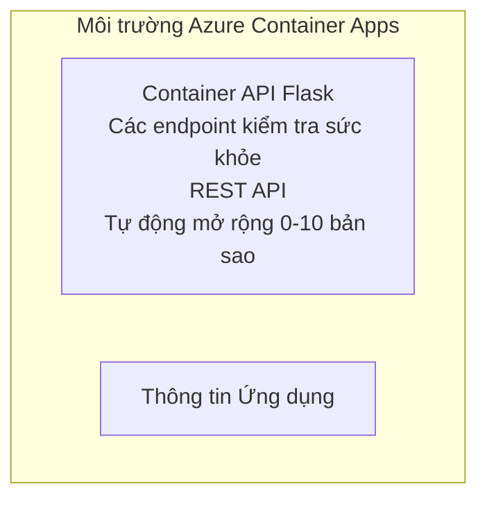

# API Flask đơn giản - Ví dụ Ứng dụng Container

**Lộ trình học:** Người mới bắt đầu ⭐ | **Thời gian:** 25-35 phút | **Chi phí:** $0-15/tháng

Một REST API Python Flask hoàn chỉnh, hoạt động được triển khai lên Azure Container Apps bằng Azure Developer CLI (azd). Ví dụ này minh họa việc triển khai container, tự động mở rộng và các khái niệm giám sát cơ bản.

## 🎯 Những gì bạn sẽ học

- Triển khai một ứng dụng Python đóng gói dưới dạng container lên Azure
- Cấu hình tự động mở rộng với khả năng scale-to-zero
- Triển khai probes kiểm tra sức khỏe và readiness
- Giám sát nhật ký và số liệu ứng dụng
- Sử dụng Azure Developer CLI để triển khai nhanh

## 📦 Những gì được bao gồm

✅ **Ứng dụng Flask** - REST API hoàn chỉnh với các thao tác CRUD (`src/app.py`)  
✅ **Dockerfile** - Cấu hình container sẵn sàng cho sản xuất  
✅ **Hạ tầng Bicep** - Môi trường Container Apps và triển khai API  
✅ **Cấu hình AZD** - Thiết lập triển khai bằng một lệnh  
✅ **Health Probes** - Đã cấu hình kiểm tra liveness và readiness  
✅ **Tự động mở rộng** - 0-10 bản sao dựa trên tải HTTP  

## Architecture



## Prerequisites

### Bắt buộc
- **Azure Developer CLI (azd)** - [Hướng dẫn cài đặt](https://learn.microsoft.com/azure/developer/azure-developer-cli/install-azd)
- **Azure subscription** - [Tài khoản miễn phí](https://azure.microsoft.com/free/)
- **Docker Desktop** - [Cài Docker](https://www.docker.com/products/docker-desktop/) (để thử nghiệm cục bộ)

### Xác minh các yêu cầu

```bash
# Kiểm tra phiên bản azd (cần 1.5.0 trở lên)
azd version

# Xác minh đăng nhập Azure
azd auth login

# Kiểm tra Docker (tùy chọn, để thử nghiệm cục bộ)
docker --version
```

## ⏱️ Dòng thời gian triển khai

| Giai đoạn | Thời lượng | Điều gì xảy ra |
|-------|----------|--------------||
| Thiết lập môi trường | 30 giây | Tạo môi trường azd |
| Xây dựng container | 2-3 phút | Docker build ứng dụng Flask |
| Cấp phát hạ tầng | 3-5 phút | Tạo Container Apps, registry và giám sát |
| Triển khai ứng dụng | 2-3 phút | Đẩy image và triển khai lên Container Apps |
| **Tổng cộng** | **8-12 phút** | Triển khai hoàn chỉnh sẵn sàng |

## Bắt đầu nhanh

```bash
# Đi tới ví dụ
cd examples/container-app/simple-flask-api

# Khởi tạo môi trường (chọn tên duy nhất)
azd env new myflaskapi

# Triển khai mọi thứ (cơ sở hạ tầng + ứng dụng)
azd up
# Bạn sẽ được yêu cầu:
# 1. Chọn đăng ký Azure
# 2. Chọn vị trí (ví dụ: eastus2)
# 3. Chờ 8-12 phút để triển khai

# Lấy điểm cuối API của bạn
azd env get-values

# Kiểm tra API
curl $(azd env get-value API_ENDPOINT)/health
```

**Kết quả mong đợi:**
```json
{
  "status": "healthy",
  "timestamp": "2025-11-19T10:30:00Z",
  "service": "simple-flask-api",
  "version": "1.0.0"
}
```

## ✅ Xác minh triển khai

### Bước 1: Kiểm tra trạng thái triển khai

```bash
# Xem các dịch vụ đã triển khai
azd show

# Đầu ra mong đợi hiển thị:
# - Dịch vụ: api
# - Điểm cuối: https://ca-api-[env].xxx.azurecontainerapps.io
# - Trạng thái: Đang chạy
```

### Bước 2: Kiểm tra các endpoint API

```bash
# Lấy endpoint API
API_URL=$(azd env get-value API_ENDPOINT)

# Kiểm tra trạng thái
curl $API_URL/health

# Kiểm tra endpoint gốc
curl $API_URL/

# Tạo một mục
curl -X POST $API_URL/api/items \
  -H "Content-Type: application/json" \
  -d '{"name": "Test Item", "description": "My first item"}'

# Lấy tất cả các mục
curl $API_URL/api/items
```

**Tiêu chí thành công:**
- ✅ Endpoint health trả về HTTP 200
- ✅ Endpoint gốc hiển thị thông tin API
- ✅ POST tạo item và trả về HTTP 201
- ✅ GET trả về các item đã tạo

### Bước 3: Xem nhật ký

```bash
# Phát trực tiếp nhật ký bằng azd monitor
azd monitor --logs

# Hoặc sử dụng Azure CLI:
az containerapp logs show --name api --resource-group $RG_NAME --follow

# Bạn sẽ thấy:
# - Thông báo khởi động của Gunicorn
# - Nhật ký yêu cầu HTTP
# - Nhật ký thông tin ứng dụng
```

## Cấu trúc dự án

```
simple-flask-api/
├── azure.yaml              # AZD configuration
├── infra/
│   ├── main.bicep         # Main infrastructure
│   ├── main.parameters.json
│   └── app/
│       ├── container-env.bicep
│       └── api.bicep
└── src/
    ├── app.py             # Flask application
    ├── requirements.txt
    └── Dockerfile
```

## Các Endpoint API

| Endpoint | Phương thức | Mô tả |
|----------|--------|-------------|
| `/health` | GET | Kiểm tra sức khỏe |
| `/api/items` | GET | Liệt kê tất cả item |
| `/api/items` | POST | Tạo item mới |
| `/api/items/{id}` | GET | Lấy item cụ thể |
| `/api/items/{id}` | PUT | Cập nhật item |
| `/api/items/{id}` | DELETE | Xóa item |

## Cấu hình

### Biến môi trường

```bash
# Đặt cấu hình tùy chỉnh
azd env set PORT 8000
azd env set LOG_LEVEL info
azd env set MAX_REPLICAS 20
```

### Cấu hình tự động mở rộng

API tự động mở rộng dựa trên lưu lượng HTTP:
- **Số bản sao tối thiểu**: 0 (mở rộng về 0 khi không hoạt động)
- **Số bản sao tối đa**: 10
- **Số yêu cầu đồng thời mỗi bản sao**: 50

## Phát triển

### Chạy cục bộ

```bash
# Cài đặt các phụ thuộc
cd src
pip install -r requirements.txt

# Chạy ứng dụng
python app.py

# Kiểm tra cục bộ
curl http://localhost:8000/health
```

### Xây dựng và kiểm thử container

```bash
# Xây dựng ảnh Docker
docker build -t flask-api:local ./src

# Chạy container cục bộ
docker run -p 8000:8000 flask-api:local

# Kiểm tra container
curl http://localhost:8000/health
```

## Triển khai

### Triển khai đầy đủ

```bash
# Triển khai hạ tầng và ứng dụng
azd up
```

### Triển khai chỉ mã nguồn

```bash
# Chỉ triển khai mã ứng dụng (cơ sở hạ tầng không thay đổi)
azd deploy api
```

### Cập nhật cấu hình

```bash
# Cập nhật biến môi trường
azd env set API_KEY "new-api-key"

# Triển khai lại với cấu hình mới
azd deploy api
```

## Giám sát

### Xem nhật ký

```bash
# Xem nhật ký trực tiếp bằng azd monitor
azd monitor --logs

# Hoặc sử dụng Azure CLI cho Container Apps:
az containerapp logs show --name api --resource-group $RG_NAME --follow

# Xem 100 dòng cuối cùng
az containerapp logs show --name api --resource-group $RG_NAME --tail 100
```

### Giám sát số liệu

```bash
# Mở bảng điều khiển Azure Monitor
azd monitor --overview

# Xem các chỉ số cụ thể
az monitor metrics list \
  --resource $(azd show --output json | jq -r '.services.api.resourceId') \
  --metric "Requests,ResponseTime"
```

## Kiểm thử

### Kiểm tra sức khỏe

```bash
curl $(azd show --output json | jq -r '.services.api.endpoint')/health
```

Phản hồi mong đợi:
```json
{
  "status": "healthy",
  "timestamp": "2025-11-19T10:30:00Z"
}
```

### Tạo Item

```bash
curl -X POST $(azd show --output json | jq -r '.services.api.endpoint')/api/items \
  -H "Content-Type: application/json" \
  -d '{"name": "Test Item", "description": "A test item"}'
```

### Lấy tất cả Item

```bash
curl $(azd show --output json | jq -r '.services.api.endpoint')/api/items
```

## Tối ưu chi phí

Bản triển khai này sử dụng chế độ scale-to-zero, nên bạn chỉ phải trả khi API đang xử lý các yêu cầu:

- **Chi phí khi nhàn rỗi**: ~$0/tháng (mở về 0)
- **Chi phí khi hoạt động**: ~$0.000024/giây cho mỗi bản sao
- **Chi phí dự kiến hàng tháng** (sử dụng nhẹ): $5-15

### Giảm chi phí hơn nữa

```bash
# Giảm số bản sao tối đa cho môi trường phát triển
azd env set MAX_REPLICAS 3

# Sử dụng thời gian chờ không hoạt động ngắn hơn
azd env set SCALE_TO_ZERO_TIMEOUT 300  # 5 phút
```

## Xử lý sự cố

### Container không khởi động được

```bash
# Kiểm tra nhật ký container bằng Azure CLI
az containerapp logs show --name api --resource-group $RG_NAME --tail 100

# Xác minh image Docker được xây dựng cục bộ
docker build -t test ./src
```

### API không truy cập được

```bash
# Xác minh ingress là bên ngoài
az containerapp show --name api --resource-group rg-simple-flask-api \
  --query properties.configuration.ingress.external
```

### Thời gian phản hồi cao

```bash
# Kiểm tra mức sử dụng CPU/bộ nhớ
az monitor metrics list \
  --resource $(azd show --output json | jq -r '.services.api.resourceId') \
  --metric "CPUPercentage,MemoryPercentage"

# Mở rộng tài nguyên nếu cần
az containerapp update --name api --resource-group rg-simple-flask-api \
  --cpu 1.0 --memory 2Gi
```

## Dọn dẹp

```bash
# Xóa tất cả tài nguyên
azd down --force --purge
```

## Bước tiếp theo

### Mở rộng ví dụ này

1. **Thêm cơ sở dữ liệu** - Tích hợp Azure Cosmos DB hoặc SQL Database
   ```bash
   # Thêm mô-đun Cosmos DB vào infra/main.bicep
   # Cập nhật app.py với kết nối cơ sở dữ liệu
   ```

2. **Thêm xác thực** - Triển khai Microsoft Entra ID hoặc API keys
   ```python
   # Thêm middleware xác thực vào app.py
   from functools import wraps
   ```

3. **Thiết lập CI/CD** - Workflow GitHub Actions
   ```yaml
   # Create .github/workflows/deploy.yml
   name: Deploy to Azure
   on: [push]
   ```

4. **Thêm Managed Identity** - Bảo mật truy cập tới các dịch vụ Azure
   ```bicep
   # Update infra/app/api.bicep
   identity: { type: 'SystemAssigned' }
   ```

### Ví dụ liên quan

- **[Ứng dụng cơ sở dữ liệu](../../../../../examples/database-app)** - Ví dụ hoàn chỉnh với SQL Database
- **[Microservices](../../../../../examples/container-app/microservices)** - Kiến trúc đa dịch vụ
- **[Hướng dẫn chính Container Apps](../README.md)** - Tất cả các mẫu container

### Tài nguyên học tập

- 📚 [Khóa học AZD cho người mới](../../../README.md) - Trang chính của khóa học
- 📚 [Mẫu Container Apps](../README.md) - Nhiều mẫu triển khai hơn
- 📚 [Thư viện mẫu AZD](https://azure.github.io/awesome-azd/) - Mẫu từ cộng đồng

## Tài nguyên bổ sung

### Tài liệu
- **[Tài liệu Flask](https://flask.palletsprojects.com/)** - Hướng dẫn framework Flask
- **[Azure Container Apps](https://learn.microsoft.com/azure/container-apps/)** - Tài liệu chính thức của Azure
- **[Azure Developer CLI](https://learn.microsoft.com/azure/developer/azure-developer-cli/)** - Tham khảo lệnh azd

### Hướng dẫn
- **[Bắt đầu nhanh Container Apps](https://learn.microsoft.com/azure/container-apps/quickstart-portal)** - Triển khai ứng dụng đầu tiên của bạn
- **[Python trên Azure](https://learn.microsoft.com/azure/developer/python/)** - Hướng dẫn phát triển Python
- **[Ngôn ngữ Bicep](https://learn.microsoft.com/azure/azure-resource-manager/bicep/)** - Hạ tầng như mã

### Công cụ
- **[Azure Portal](https://portal.azure.com)** - Quản lý tài nguyên bằng giao diện đồ họa
- **[Tiện ích mở rộng Azure cho VS Code](https://marketplace.visualstudio.com/items?itemName=ms-azuretools.vscode-azurecontainerapps)** - Tích hợp IDE

---

**🎉 Xin chúc mừng!** Bạn đã triển khai một API Flask sẵn sàng cho sản xuất lên Azure Container Apps với tự động mở rộng và giám sát.

**Có câu hỏi?** [Mở một issue](https://github.com/microsoft/AZD-for-beginners/issues) hoặc xem [Câu hỏi thường gặp](../../../resources/faq.md)

---

<!-- CO-OP TRANSLATOR DISCLAIMER START -->
**Tuyên bố miễn trừ trách nhiệm**:
Tài liệu này đã được dịch bằng dịch vụ dịch thuật AI [Co-op Translator](https://github.com/Azure/co-op-translator). Mặc dù chúng tôi cố gắng đảm bảo độ chính xác, xin lưu ý rằng bản dịch tự động có thể chứa lỗi hoặc sai sót. Tài liệu gốc bằng ngôn ngữ gốc nên được coi là nguồn tin chính thức. Đối với thông tin quan trọng, nên sử dụng dịch vụ dịch thuật chuyên nghiệp bởi con người. Chúng tôi không chịu trách nhiệm về bất kỳ hiểu lầm hoặc giải thích sai nào phát sinh từ việc sử dụng bản dịch này.
<!-- CO-OP TRANSLATOR DISCLAIMER END -->