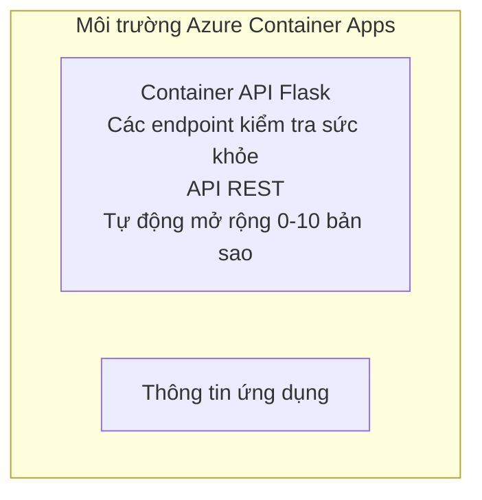

# API Flask Đơn Giản - Ví dụ Ứng dụng Container

**Lộ trình học:** Người mới ⭐ | **Thời gian:** 25-35 phút | **Chi phí:** $0-15/tháng

Một API REST Python Flask hoàn chỉnh hoạt động và được triển khai lên Azure Container Apps bằng Azure Developer CLI (azd). Ví dụ này minh họa cơ bản về triển khai container, tự động mở rộng và giám sát.

## 🎯 Những gì bạn sẽ học

- Triển khai ứng dụng Python container lên Azure
- Cấu hình tự động mở rộng với scale-to-zero
- Thực hiện probes sức khỏe và kiểm tra readiness
- Giám sát nhật ký và số liệu ứng dụng
- Sử dụng Azure Developer CLI để triển khai nhanh

## 📦 Bao gồm

✅ **Ứng dụng Flask** - API REST hoàn chỉnh với các thao tác CRUD (`src/app.py`)  
✅ **Dockerfile** - Cấu hình container sẵn sàng cho production  
✅ **Hạ tầng Bicep** - Môi trường Container Apps và triển khai API  
✅ **Cấu hình AZD** - Thiết lập triển khai một lệnh  
✅ **Health Probes** - Cấu hình liveness và readiness checks  
✅ **Tự động mở rộng** - 0-10 bản sao dựa trên tải HTTP  

## Kiến trúc


## Yêu cầu trước

### Yêu cầu
- **Azure Developer CLI (azd)** - [Hướng dẫn cài đặt](https://learn.microsoft.com/azure/developer/azure-developer-cli/install-azd)
- **Đăng ký Azure** - [Tài khoản miễn phí](https://azure.microsoft.com/free/)
- **Docker Desktop** - [Cài đặt Docker](https://www.docker.com/products/docker-desktop/) (cho kiểm thử cục bộ)

### Xác minh yêu cầu trước

```bash
# Kiểm tra phiên bản azd (cần 1.5.0 trở lên)
azd version

# Xác minh đăng nhập Azure
azd auth login

# Kiểm tra Docker (tùy chọn, cho kiểm thử cục bộ)
docker --version
```

## ⏱️ Thời gian triển khai

| Phase | Duration | What Happens |
|-------|----------|--------------||
| Environment setup | 30 seconds | Create azd environment |
| Build container | 2-3 minutes | Docker build Flask app |
| Provision infrastructure | 3-5 minutes | Create Container Apps, registry, monitoring |
| Deploy application | 2-3 minutes | Push image and deploy to Container Apps |
| **Total** | **8-12 minutes** | Complete deployment ready |

## Bắt đầu nhanh

```bash
# Đi tới ví dụ
cd examples/container-app/simple-flask-api

# Khởi tạo môi trường (chọn tên duy nhất)
azd env new myflaskapi

# Triển khai mọi thứ (cơ sở hạ tầng + ứng dụng)
azd up
# Bạn sẽ được nhắc:
# 1. Chọn đăng ký Azure
# 2. Chọn vị trí (ví dụ: eastus2)
# 3. Chờ 8-12 phút để triển khai

# Lấy điểm cuối API của bạn
azd env get-values

# Kiểm tra API
curl $(azd env get-value API_ENDPOINT)/health
```

**Kết quả mong đợi:**
```json
{
  "status": "healthy",
  "timestamp": "2025-11-19T10:30:00Z",
  "service": "simple-flask-api",
  "version": "1.0.0"
}
```

## ✅ Xác minh Triển khai

### Bước 1: Kiểm tra trạng thái triển khai

```bash
# Xem các dịch vụ đã triển khai
azd show

# Kết quả mong đợi hiển thị:
# - Dịch vụ: api
# - Điểm cuối: https://ca-api-[env].xxx.azurecontainerapps.io
# - Trạng thái: Đang chạy
```

### Bước 2: Kiểm thử các endpoint API

```bash
# Lấy endpoint API
API_URL=$(azd env get-value API_ENDPOINT)

# Kiểm tra sức khỏe
curl $API_URL/health

# Kiểm tra endpoint gốc
curl $API_URL/

# Tạo một mục
curl -X POST $API_URL/api/items \
  -H "Content-Type: application/json" \
  -d '{"name": "Test Item", "description": "My first item"}'

# Lấy tất cả các mục
curl $API_URL/api/items
```

**Tiêu chí thành công:**
- ✅ Health endpoint trả về HTTP 200
- ✅ Root endpoint hiển thị thông tin API
- ✅ POST tạo mục và trả về HTTP 201
- ✅ GET trả về các mục đã tạo

### Bước 3: Xem nhật ký

```bash
# Xem nhật ký trực tiếp bằng azd monitor
azd monitor --logs

# Hoặc sử dụng Azure CLI:
az containerapp logs show --name api --resource-group $RG_NAME --follow

# Bạn sẽ thấy:
# - Thông báo khởi động Gunicorn
# - Nhật ký yêu cầu HTTP
# - Nhật ký thông tin ứng dụng
```

## Cấu trúc dự án

```
simple-flask-api/
├── azure.yaml              # AZD configuration
├── infra/
│   ├── main.bicep         # Main infrastructure
│   ├── main.parameters.json
│   └── app/
│       ├── container-env.bicep
│       └── api.bicep
└── src/
    ├── app.py             # Flask application
    ├── requirements.txt
    └── Dockerfile
```

## Các endpoint API

| Endpoint | Method | Description |
|----------|--------|-------------|
| `/health` | GET | Kiểm tra tình trạng |
| `/api/items` | GET | Liệt kê tất cả mục |
| `/api/items` | POST | Tạo mục mới |
| `/api/items/{id}` | GET | Lấy mục cụ thể |
| `/api/items/{id}` | PUT | Cập nhật mục |
| `/api/items/{id}` | DELETE | Xóa mục |

## Cấu hình

### Biến môi trường

```bash
# Thiết lập cấu hình tùy chỉnh
azd env set PORT 8000
azd env set LOG_LEVEL info
azd env set MAX_REPLICAS 20
```

### Cấu hình mở rộng

API tự động mở rộng dựa trên lưu lượng HTTP:
- **Số bản sao tối thiểu**: 0 (thu nhỏ về 0 khi không có hoạt động)
- **Số bản sao tối đa**: 10
- **Yêu cầu đồng thời trên mỗi bản sao**: 50

## Phát triển

### Chạy cục bộ

```bash
# Cài đặt các phụ thuộc
cd src
pip install -r requirements.txt

# Chạy ứng dụng
python app.py

# Kiểm tra cục bộ
curl http://localhost:8000/health
```

### Xây dựng và kiểm thử container

```bash
# Xây dựng ảnh Docker
docker build -t flask-api:local ./src

# Chạy container cục bộ
docker run -p 8000:8000 flask-api:local

# Kiểm tra container
curl http://localhost:8000/health
```

## Triển khai

### Triển khai đầy đủ

```bash
# Triển khai cơ sở hạ tầng và ứng dụng
azd up
```

### Triển khai chỉ mã nguồn

```bash
# Chỉ triển khai mã ứng dụng (cơ sở hạ tầng không thay đổi)
azd deploy api
```

### Cập nhật cấu hình

```bash
# Cập nhật biến môi trường
azd env set API_KEY "new-api-key"

# Triển khai lại với cấu hình mới
azd deploy api
```

## Giám sát

### Xem nhật ký

```bash
# Phát trực tiếp nhật ký bằng azd monitor
azd monitor --logs

# Hoặc sử dụng Azure CLI cho Container Apps:
az containerapp logs show --name api --resource-group $RG_NAME --follow

# Xem 100 dòng cuối cùng
az containerapp logs show --name api --resource-group $RG_NAME --tail 100
```

### Giám sát số liệu

```bash
# Mở bảng điều khiển Azure Monitor
azd monitor --overview

# Xem các số liệu cụ thể
az monitor metrics list \
  --resource $(azd show --output json | jq -r '.services.api.resourceId') \
  --metric "Requests,ResponseTime"
```

## Kiểm thử

### Kiểm tra sức khỏe

```bash
curl $(azd show --output json | jq -r '.services.api.endpoint')/health
```

Phản hồi mong đợi:
```json
{
  "status": "healthy",
  "timestamp": "2025-11-19T10:30:00Z"
}
```

### Tạo mục

```bash
curl -X POST $(azd show --output json | jq -r '.services.api.endpoint')/api/items \
  -H "Content-Type: application/json" \
  -d '{"name": "Test Item", "description": "A test item"}'
```

### Lấy tất cả mục

```bash
curl $(azd show --output json | jq -r '.services.api.endpoint')/api/items
```

## Tối ưu chi phí

Bản triển khai này sử dụng scale-to-zero, vì vậy bạn chỉ trả tiền khi API đang xử lý yêu cầu:

- **Chi phí khi nhàn rỗi**: ~$0/tháng (thu nhỏ về 0)
- **Chi phí khi hoạt động**: ~$0.000024/giây trên mỗi bản sao
- **Chi phí ước tính hàng tháng** (sử dụng nhẹ): $5-15

### Giảm chi phí hơn nữa

```bash
# Giảm số bản sao tối đa cho môi trường dev
azd env set MAX_REPLICAS 3

# Sử dụng thời gian chờ không hoạt động ngắn hơn
azd env set SCALE_TO_ZERO_TIMEOUT 300  # 5 phút
```

## Khắc phục sự cố

### Container không khởi động được

```bash
# Kiểm tra nhật ký container bằng Azure CLI
az containerapp logs show --name api --resource-group $RG_NAME --tail 100

# Xác minh ảnh Docker được xây dựng cục bộ
docker build -t test ./src
```

### API không truy cập được

```bash
# Xác minh ingress là bên ngoài
az containerapp show --name api --resource-group rg-simple-flask-api \
  --query properties.configuration.ingress.external
```

### Thời gian phản hồi cao

```bash
# Kiểm tra mức sử dụng CPU và bộ nhớ
az monitor metrics list \
  --resource $(azd show --output json | jq -r '.services.api.resourceId') \
  --metric "CPUPercentage,MemoryPercentage"

# Mở rộng tài nguyên nếu cần
az containerapp update --name api --resource-group rg-simple-flask-api \
  --cpu 1.0 --memory 2Gi
```

## Dọn dẹp

```bash
# Xóa tất cả tài nguyên
azd down --force --purge
```

## Bước tiếp theo

### Mở rộng ví dụ này

1. **Thêm cơ sở dữ liệu** - Tích hợp Azure Cosmos DB hoặc SQL Database
   ```bash
   # Thêm mô-đun Cosmos DB vào infra/main.bicep
   # Cập nhật app.py với kết nối cơ sở dữ liệu
   ```

2. **Thêm xác thực** - Thực hiện Azure AD hoặc khóa API
   ```python
   # Thêm middleware xác thực vào app.py
   from functools import wraps
   ```

3. **Thiết lập CI/CD** - workflow GitHub Actions
   ```yaml
   # Create .github/workflows/deploy.yml
   name: Deploy to Azure
   on: [push]
   ```

4. **Thêm Managed Identity** - Bảo mật truy cập tới dịch vụ Azure
   ```bicep
   # Update infra/app/api.bicep
   identity: { type: 'SystemAssigned' }
   ```

### Ví dụ liên quan

- **[Ứng dụng Cơ sở dữ liệu](../../../../../examples/database-app)** - Ví dụ hoàn chỉnh với SQL Database
- **[Microservices](../../../../../examples/container-app/microservices)** - Kiến trúc đa dịch vụ
- **[Hướng dẫn tổng quan Container Apps](../README.md)** - Tất cả các mẫu container

### Tài nguyên học tập

- 📚 [Khóa AZD cho người mới](../../../README.md) - Trang chính của khoá học
- 📚 [Mẫu Container Apps](../README.md) - Thêm các mẫu triển khai
- 📚 [Thư viện mẫu AZD](https://azure.github.io/awesome-azd/) - Mẫu từ cộng đồng

## Tài nguyên bổ sung

### Tài liệu
- **[Tài liệu Flask](https://flask.palletsprojects.com/)** - Hướng dẫn framework Flask
- **[Azure Container Apps](https://learn.microsoft.com/azure/container-apps/)** - Tài liệu chính thức của Azure
- **[Azure Developer CLI](https://learn.microsoft.com/azure/developer/azure-developer-cli/)** - Tham khảo lệnh azd

### Hướng dẫn
- **[Container Apps Quickstart](https://learn.microsoft.com/azure/container-apps/quickstart-portal)** - Triển khai ứng dụng đầu tiên của bạn
- **[Python on Azure](https://learn.microsoft.com/azure/developer/python/)** - Hướng dẫn phát triển Python
- **[Ngôn ngữ Bicep](https://learn.microsoft.com/azure/azure-resource-manager/bicep/)** - Hạ tầng như mã

### Công cụ
- **[Azure Portal](https://portal.azure.com)** - Quản lý tài nguyên bằng giao diện
- **[Tiện ích mở rộng Azure cho VS Code](https://marketplace.visualstudio.com/items?itemName=ms-azuretools.vscode-azurecontainerapps)** - Tích hợp IDE

---

**🎉 Xin chúc mừng!** Bạn đã triển khai một API Flask sẵn sàng cho production lên Azure Container Apps với tự động mở rộng và giám sát.

**Câu hỏi?** [Tạo issue](https://github.com/microsoft/AZD-for-beginners/issues) hoặc xem [FAQ](../../../resources/faq.md)

---

<!-- CO-OP TRANSLATOR DISCLAIMER START -->
**Disclaimer**:
Tài liệu này đã được dịch bằng dịch vụ dịch thuật AI [Co-op Translator](https://github.com/Azure/co-op-translator). Mặc dù chúng tôi nỗ lực để đảm bảo độ chính xác, xin lưu ý rằng các bản dịch tự động có thể chứa lỗi hoặc sai sót. Văn bản gốc bằng ngôn ngữ ban đầu nên được coi là nguồn có thẩm quyền. Đối với thông tin quan trọng, nên sử dụng bản dịch chuyên nghiệp do con người thực hiện. Chúng tôi không chịu trách nhiệm đối với bất kỳ sự hiểu nhầm hoặc giải thích sai nào phát sinh từ việc sử dụng bản dịch này.
<!-- CO-OP TRANSLATOR DISCLAIMER END -->