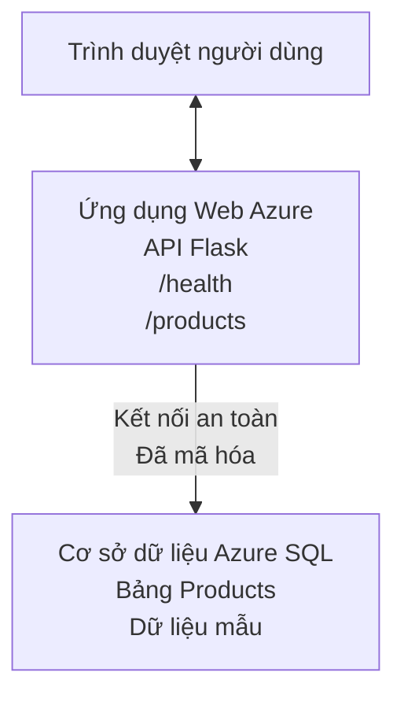

# Triển khai cơ sở dữ liệu Microsoft SQL và Ứng dụng Web bằng AZD

⏱️ **Thời gian ước tính**: 20-30 phút | 💰 **Chi phí ước tính**: ~$15-25/tháng | ⭐ **Độ phức tạp**: Trung cấp

Ví dụ **hoàn chỉnh và hoạt động** này trình bày cách sử dụng [Azure Developer CLI (azd)](https://learn.microsoft.com/azure/developer/azure-developer-cli/) để triển khai một ứng dụng web Python Flask với cơ sở dữ liệu Microsoft SQL lên Azure. Tất cả mã được bao gồm và đã được kiểm thử — không cần phụ thuộc bên ngoài.

## Những gì bạn sẽ học

Hoàn thành ví dụ này, bạn sẽ:
- Triển khai ứng dụng đa tầng (web app + database) bằng cơ sở hạ tầng dưới dạng mã
- Cấu hình kết nối cơ sở dữ liệu an toàn mà không lưu mật khẩu cố định trong mã
- Giám sát sức khỏe ứng dụng bằng Application Insights
- Quản lý tài nguyên Azure hiệu quả với CLI AZD
- Tuân theo các thực hành tốt nhất của Azure về bảo mật, tối ưu chi phí và khả năng quan sát

## Tổng quan kịch bản
- **Web App**: Python Flask REST API với kết nối cơ sở dữ liệu
- **Database**: Azure SQL Database với dữ liệu mẫu
- **Infrastructure**: Cấp phát bằng Bicep (mô-đun, có thể tái sử dụng)
- **Deployment**: Tự động hoàn toàn bằng các lệnh `azd`
- **Monitoring**: Application Insights cho logs và telemetry

## Yêu cầu trước khi bắt đầu

### Công cụ cần thiết

Trước khi bắt đầu, hãy xác nhận bạn đã cài các công cụ sau:

1. **[Azure CLI](https://learn.microsoft.com/cli/azure/install-azure-cli)** (phiên bản 2.50.0 hoặc mới hơn)
   ```sh
   az --version
   # Kết quả mong đợi: azure-cli 2.50.0 trở lên
   ```

2. **[Azure Developer CLI (azd)](https://learn.microsoft.com/azure/developer/azure-developer-cli/install-azd)** (phiên bản 1.0.0 hoặc mới hơn)
   ```sh
   azd version
   # Kết quả mong đợi: azd phiên bản 1.0.0 trở lên
   ```

3. **[Python 3.8+](https://www.python.org/downloads/)** (cho phát triển cục bộ)
   ```sh
   python --version
   # Đầu ra dự kiến: Python 3.8 hoặc cao hơn
   ```

4. **[Docker](https://www.docker.com/get-started)** (tùy chọn, cho phát triển container cục bộ)
   ```sh
   docker --version
   # Đầu ra mong đợi: Docker phiên bản 20.10 hoặc cao hơn
   ```

### Yêu cầu Azure

- Một **đăng ký Azure** đang hoạt động ([tạo tài khoản miễn phí](https://azure.microsoft.com/free/))
- Quyền để tạo tài nguyên trong đăng ký của bạn
- Vai trò **Owner** hoặc **Contributor** trên đăng ký hoặc nhóm tài nguyên

### Kiến thức cần có

Đây là ví dụ ở mức **trung cấp**. Bạn nên quen với:
- Các thao tác cơ bản trên dòng lệnh
- Khái niệm nền tảng về cloud (tài nguyên, nhóm tài nguyên)
- Hiểu biết cơ bản về ứng dụng web và cơ sở dữ liệu

**Mới với AZD?** Bắt đầu với [Hướng dẫn Bắt đầu](../../docs/chapter-01-foundation/azd-basics.md) trước.

## Kiến trúc

Ví dụ này triển khai kiến trúc hai tầng với ứng dụng web và cơ sở dữ liệu:


**Triển khai Tài nguyên:**
- **Nhóm tài nguyên**: Bộ chứa cho tất cả các tài nguyên
- **App Service Plan**: Lưu trữ dựa trên Linux (bậc B1 để tiết kiệm chi phí)
- **Web App**: Runtime Python 3.11 với ứng dụng Flask
- **SQL Server**: Máy chủ cơ sở dữ liệu được quản lý với TLS 1.2 trở lên
- **SQL Database**: Bậc Basic (2GB, phù hợp cho phát triển/kiểm thử)
- **Application Insights**: Giám sát và ghi log
- **Log Analytics Workspace**: Lưu trữ log tập trung

**Ẩn dụ**: Hãy tưởng tượng như một nhà hàng (web app) với một tủ lạnh lớn (database). Khách đặt món từ thực đơn (API endpoints), và nhà bếp (Flask app) lấy nguyên liệu (dữ liệu) từ tủ lạnh. Quản lý nhà hàng (Application Insights) theo dõi mọi thứ diễn ra.

## Cấu trúc Thư mục

Tất cả tệp đều được bao gồm trong ví dụ này — không cần phụ thuộc bên ngoài:

```
examples/database-app/
│
├── README.md                    # This file
├── azure.yaml                   # AZD configuration file
├── .env.sample                  # Sample environment variables
├── .gitignore                   # Git ignore patterns
│
├── infra/                       # Infrastructure as Code (Bicep)
│   ├── main.bicep              # Main orchestration template
│   ├── abbreviations.json      # Azure naming conventions
│   └── resources/              # Modular resource templates
│       ├── sql-server.bicep    # SQL Server configuration
│       ├── sql-database.bicep  # Database configuration
│       ├── app-service-plan.bicep  # Hosting plan
│       ├── app-insights.bicep  # Monitoring setup
│       └── web-app.bicep       # Web application
│
└── src/
    └── web/                    # Application source code
        ├── app.py              # Flask REST API
        ├── requirements.txt    # Python dependencies
        └── Dockerfile          # Container definition
```

**Mỗi Tệp Làm Gì:**
- **azure.yaml**: Cho AZD biết những gì sẽ triển khai và ở đâu
- **infra/main.bicep**: Điều phối tất cả tài nguyên Azure
- **infra/resources/*.bicep**: Định nghĩa từng tài nguyên (mô-đun để tái sử dụng)
- **src/web/app.py**: Ứng dụng Flask với logic cơ sở dữ liệu
- **requirements.txt**: Các phụ thuộc Python
- **Dockerfile**: Hướng dẫn container hóa cho việc triển khai

## Bắt đầu nhanh (Từng bước)

### Bước 1: Clone và Điều hướng

```sh
git clone https://github.com/microsoft/AZD-for-beginners.git
cd AZD-for-beginners/examples/database-app
```

**✓ Kiểm tra thành công**: Xác nhận bạn thấy `azure.yaml` và thư mục `infra/`:
```sh
ls
# Dự kiến: README.md, azure.yaml, infra/, src/
```

### Bước 2: Xác thực với Azure

```sh
azd auth login
```

Việc này sẽ mở trình duyệt của bạn để xác thực Azure. Đăng nhập bằng thông tin xác thực Azure của bạn.

**✓ Kiểm tra thành công**: Bạn sẽ thấy:
```
Logged in to Azure.
```

### Bước 3: Khởi tạo Môi trường

```sh
azd init
```

**Điều gì xảy ra**: AZD tạo cấu hình cục bộ cho việc triển khai của bạn.

**Các thông tin bạn sẽ được nhắc**:
- **Environment name**: Nhập một tên ngắn (ví dụ `dev`, `myapp`)
- **Azure subscription**: Chọn đăng ký của bạn từ danh sách
- **Azure location**: Chọn vùng (ví dụ `eastus`, `westeurope`)

**✓ Kiểm tra thành công**: Bạn sẽ thấy:
```
SUCCESS: New project initialized!
```

### Bước 4: Cấp phát Tài nguyên Azure

```sh
azd provision
```

**Điều gì xảy ra**: AZD triển khai toàn bộ hạ tầng (mất 5-8 phút):
1. Tạo nhóm tài nguyên
2. Tạo SQL Server và Database
3. Tạo App Service Plan
4. Tạo Web App
5. Tạo Application Insights
6. Cấu hình mạng và bảo mật

**Bạn sẽ được yêu cầu cung cấp**:
- **SQL admin username**: Nhập tên người dùng (ví dụ `sqladmin`)
- **SQL admin password**: Nhập mật khẩu mạnh (hãy lưu lại!)

**✓ Kiểm tra thành công**: Bạn sẽ thấy:
```
SUCCESS: Your application was provisioned in Azure in X minutes Y seconds.
You can view the resources created under the resource group rg-<env-name> in Azure Portal:
https://portal.azure.com/#@/resource/subscriptions/.../resourceGroups/rg-<env-name>
```

**⏱️ Time**: 5-8 minutes

### Bước 5: Triển khai Ứng dụng

```sh
azd deploy
```

**Điều gì xảy ra**: AZD xây dựng và triển khai ứng dụng Flask của bạn:
1. Đóng gói ứng dụng Python
2. Xây dựng container Docker
3. Đẩy lên Azure Web App
4. Khởi tạo cơ sở dữ liệu với dữ liệu mẫu
5. Khởi động ứng dụng

**✓ Kiểm tra thành công**: Bạn sẽ thấy:
```
SUCCESS: Your application was deployed to Azure in X minutes Y seconds.
You can view the resources created under the resource group rg-<env-name> in Azure Portal:
https://portal.azure.com/#@/resource/subscriptions/.../resourceGroups/rg-<env-name>
```

**⏱️ Time**: 3-5 minutes

### Bước 6: Duyệt Ứng dụng

```sh
azd browse
```

Việc này mở ứng dụng web đã triển khai của bạn trong trình duyệt tại `https://app-<unique-id>.azurewebsites.net`

**✓ Kiểm tra thành công**: Bạn sẽ thấy JSON đầu ra:
```json
{
  "message": "Welcome to the Database App API",
  "endpoints": {
    "/": "This help message",
    "/health": "Health check endpoint",
    "/products": "List all products",
    "/products/<id>": "Get product by ID"
  }
}
```

### Bước 7: Kiểm thử API Endpoints

**Health Check** (xác minh kết nối cơ sở dữ liệu):
```sh
curl https://app-<your-id>.azurewebsites.net/health
```

**Phản hồi mong đợi**:
```json
{
  "status": "healthy",
  "database": "connected"
}
```

**List Products** (dữ liệu mẫu):
```sh
curl https://app-<your-id>.azurewebsites.net/products
```

**Phản hồi mong đợi**:
```json
[
  {
    "id": 1,
    "name": "Laptop",
    "description": "High-performance laptop",
    "price": 1299.99,
    "created_at": "2025-11-19T10:30:00"
  },
  ...
]
```

**Get Single Product**:
```sh
curl https://app-<your-id>.azurewebsites.net/products/1
```

**✓ Kiểm tra thành công**: Tất cả endpoints trả về dữ liệu JSON mà không lỗi.

---

**🎉 Chúc mừng!** Bạn đã triển khai thành công một ứng dụng web có cơ sở dữ liệu lên Azure bằng AZD.

## Đi sâu vào Cấu hình

### Biến Môi trường

Bí mật được quản lý an toàn qua cấu hình Azure App Service — **không bao giờ lưu cứng trong mã nguồn**.

**Được AZD cấu hình tự động**:
- `SQL_CONNECTION_STRING`: Kết nối cơ sở dữ liệu với thông tin đăng nhập được mã hóa
- `APPLICATIONINSIGHTS_CONNECTION_STRING`: Endpoint telemetry cho giám sát
- `SCM_DO_BUILD_DURING_DEPLOYMENT`: Bật cài đặt phụ thuộc tự động trong quá trình triển khai

**Nơi lưu trữ bí mật**:
1. Trong quá trình `azd provision`, bạn cung cấp thông tin đăng nhập SQL qua các lời nhắc an toàn
2. AZD lưu chúng trong tệp cục bộ `.azure/<env-name>/.env` (được git-ignore)
3. AZD tiêm chúng vào cấu hình Azure App Service (được mã hóa khi lưu)
4. Ứng dụng đọc chúng thông qua `os.getenv()` khi chạy

### Phát triển cục bộ

Để kiểm thử cục bộ, tạo tệp `.env` từ mẫu:

```sh
cp .env.sample .env
# Chỉnh sửa .env bằng kết nối cơ sở dữ liệu cục bộ của bạn
```

**Luồng phát triển cục bộ**:
```sh
# Cài đặt các phụ thuộc
cd src/web
pip install -r requirements.txt

# Thiết lập biến môi trường
export SQL_CONNECTION_STRING="your-local-connection-string"

# Chạy ứng dụng
python app.py
```

**Kiểm thử cục bộ**:
```sh
curl http://localhost:8000/health
# Mong đợi: {"trạng thái": "khỏe", "cơ sở dữ liệu": "đã kết nối"}
```

### Hạ tầng như Mã

Tất cả tài nguyên Azure được định nghĩa trong **mẫu Bicep** (`infra/` folder):

- **Thiết kế mô-đun**: Mỗi loại tài nguyên có tệp riêng để tái sử dụng
- **Có tham số**: Tùy chỉnh SKU, vùng, quy ước đặt tên
- **Thực hành tốt nhất**: Tuân theo tiêu chuẩn đặt tên và mặc định bảo mật của Azure
- **Quản lý phiên bản**: Các thay đổi hạ tầng được theo dõi trong Git

**Ví dụ tùy chỉnh**:
Để thay đổi bậc cơ sở dữ liệu, chỉnh sửa `infra/resources/sql-database.bicep`:
```bicep
sku: {
  name: 'Standard'  // Changed from 'Basic'
  tier: 'Standard'
  capacity: 10
}
```

## Thực hành bảo mật tốt nhất

Ví dụ này tuân theo các thực hành bảo mật tốt nhất của Azure:

### 1. **Không lưu bí mật trong mã nguồn**
- ✅ Thông tin đăng nhập được lưu trong cấu hình Azure App Service (được mã hóa)
- ✅ Các tệp `.env` được loại trừ khỏi Git bằng `.gitignore`
- ✅ Bí mật được truyền qua tham số an toàn trong quá trình cấp phát

### 2. **Kết nối được mã hóa**
- ✅ TLS 1.2 trở lên cho SQL Server
- ✅ Chỉ cho phép HTTPS cho Web App
- ✅ Kết nối cơ sở dữ liệu sử dụng kênh được mã hóa

### 3. **Bảo mật Mạng**
- ✅ Firewall của SQL Server được cấu hình để chỉ cho phép dịch vụ Azure
- ✅ Truy cập mạng công khai bị hạn chế (có thể khóa thêm bằng Private Endpoints)
- ✅ FTPS bị vô hiệu hóa trên Web App

### 4. **Xác thực & Ủy quyền**
- ⚠️ **Hiện tại**: Xác thực SQL (username/password)
- ✅ **Khuyến nghị cho sản xuất**: Sử dụng Azure Managed Identity để xác thực không cần mật khẩu

**Để Nâng cấp lên Managed Identity** (cho môi trường sản xuất):
1. Bật managed identity trên Web App
2. Cấp quyền cho identity trên SQL
3. Cập nhật chuỗi kết nối để sử dụng managed identity
4. Loại bỏ xác thực dựa trên mật khẩu

### 5. **Kiểm toán & Tuân thủ**
- ✅ Application Insights ghi lại tất cả yêu cầu và lỗi
- ✅ Kiểm toán SQL Database được bật (có thể cấu hình để tuân thủ)
- ✅ Tất cả tài nguyên được gắn tag cho quản trị

**Danh sách kiểm tra bảo mật trước khi vào sản xuất**:
- [ ] Bật Azure Defender cho SQL
- [ ] Cấu hình Private Endpoints cho SQL Database
- [ ] Bật Web Application Firewall (WAF)
- [ ] Triển khai Azure Key Vault cho xoay vòng bí mật
- [ ] Cấu hình xác thực Azure AD
- [ ] Bật ghi nhật ký chẩn đoán cho tất cả tài nguyên

## Tối ưu hóa Chi phí

**Chi phí ước tính hàng tháng** (tính đến Tháng 11 năm 2025):

| Tài nguyên | SKU/Bậc | Chi phí ước tính |
|----------|----------|----------------|
| App Service Plan | B1 (Basic) | ~$13/month |
| SQL Database | Basic (2GB) | ~$5/month |
| Application Insights | Pay-as-you-go | ~$2/month (lưu lượng thấp) |
| **Tổng cộng** | | **~$20/month** |

**💡 Mẹo Tiết kiệm Chi phí**:

1. **Sử dụng bậc miễn phí để học**:
   - App Service: bậc F1 (miễn phí, giờ giới hạn)
   - SQL Database: Sử dụng Azure SQL Database serverless
   - Application Insights: 5GB/tháng miễn phí ingestion

2. **Tắt tài nguyên khi không sử dụng**:
   ```sh
   # Dừng ứng dụng web (cơ sở dữ liệu vẫn bị tính phí)
   az webapp stop --name <app-name> --resource-group <rg-name>
   
   # Khởi động lại khi cần
   az webapp start --name <app-name> --resource-group <rg-name>
   ```

3. **Xóa mọi thứ sau khi kiểm thử**:
   ```sh
   azd down
   ```
   Việc này xóa TẤT CẢ tài nguyên và dừng phát sinh chi phí.

4. **SKU Phát triển so với Sản xuất**:
   - **Phát triển**: Bậc Basic (đã dùng trong ví dụ này)
   - **Sản xuất**: Bậc Standard/Premium với khả năng dự phòng

**Giám sát chi phí**:
- Xem chi phí trong [Azure Cost Management](https://portal.azure.com/#view/Microsoft_Azure_CostManagement)
- Thiết lập cảnh báo chi phí để tránh bất ngờ
- Gắn tag tất cả tài nguyên với `azd-env-name` để theo dõi

**Lựa chọn Miễn phí Thay thế**:
Cho mục đích học tập, bạn có thể chỉnh sửa `infra/resources/app-service-plan.bicep`:
```bicep
sku: {
  name: 'F1'  // Free tier
  tier: 'Free'
}
```
**Lưu ý**: Hạng miễn phí có những giới hạn (60 min/ngày CPU, không có luôn-bật).

## Giám sát & Khả năng quan sát

### Tích hợp Application Insights

Ví dụ này bao gồm **Application Insights** cho giám sát toàn diện:

**Những gì được giám sát**:
- ✅ Các yêu cầu HTTP (độ trễ, mã trạng thái, endpoints)
- ✅ Lỗi và ngoại lệ ứng dụng
- ✅ Ghi log tùy chỉnh từ ứng dụng Flask
- ✅ Sức khỏe kết nối cơ sở dữ liệu
- ✅ Các chỉ số hiệu năng (CPU, bộ nhớ)

**Truy cập Application Insights**:
1. Mở [Azure Portal](https://portal.azure.com)
2. Điều hướng tới nhóm tài nguyên của bạn (`rg-<env-name>`)
3. Nhấp vào tài nguyên Application Insights (`appi-<unique-id>`)

**Các truy vấn hữu ích** (Application Insights → Logs):

**Xem tất cả yêu cầu**:
```kusto
requests
| where timestamp > ago(1h)
| order by timestamp desc
| project timestamp, name, url, resultCode, duration
```

**Tìm lỗi**:
```kusto
exceptions
| where timestamp > ago(24h)
| order by timestamp desc
| project timestamp, type, outerMessage, operation_Name
```

**Kiểm tra endpoint sức khỏe**:
```kusto
requests
| where name contains "health"
| summarize count() by resultCode, bin(timestamp, 1h)
```

### Kiểm toán SQL Database

**Kiểm toán SQL Database được bật** để theo dõi:
- Mô hình truy cập cơ sở dữ liệu
- Các lần đăng nhập thất bại
- Thay đổi schema
- Truy cập dữ liệu (cho mục đích tuân thủ)

**Truy cập log kiểm toán**:
1. Azure Portal → SQL Database → Auditing
2. Xem log trong Log Analytics workspace

### Giám sát theo thời gian thực

**Xem Live Metrics**:
1. Application Insights → Live Metrics
2. Xem yêu cầu, lỗi và hiệu năng theo thời gian thực

**Thiết lập cảnh báo**:
Tạo cảnh báo cho các sự kiện quan trọng:
- Lỗi HTTP 500 > 5 trong 5 phút
- Lỗi kết nối cơ sở dữ liệu
- Thời gian phản hồi cao (>2 giây)

**Ví dụ tạo cảnh báo**:
```sh
az monitor metrics alert create \
  --name "High-Response-Time" \
  --resource-group <rg-name> \
  --scopes <app-insights-resource-id> \
  --condition "avg requests/duration > 2000" \
  --description "Alert when response time exceeds 2 seconds"
```

## Gỡ lỗi
### Các Vấn Đề Thường Gặp và Giải Pháp

#### 1. `azd provision` fails with "Location not available"

**Symptom**:
```
Error: The subscription is not registered for the resource type 'components' in the location 'centralus'.
```

**Solution**:
Chọn một vùng Azure khác hoặc đăng ký resource provider:
```sh
az provider register --namespace Microsoft.Insights
```

#### 2. SQL Connection Fails During Deployment

**Symptom**:
```
pyodbc.OperationalError: ('08001', '[08001] [Microsoft][ODBC Driver 18 for SQL Server]TCP Provider...')
```

**Solution**:
- Xác nhận firewall của SQL Server cho phép dịch vụ Azure (được cấu hình tự động)
- Kiểm tra mật khẩu admin SQL đã được nhập chính xác trong `azd provision`
- Đảm bảo SQL Server đã được provision hoàn toàn (có thể mất 2-3 phút)

**Verify Connection**:
```sh
# Từ Azure Portal, vào SQL Database → Trình chỉnh sửa truy vấn
# Thử kết nối bằng thông tin đăng nhập của bạn
```

#### 3. Web App Shows "Application Error"

**Symptom**:
Trình duyệt hiển thị trang lỗi chung.

**Solution**:
Kiểm tra logs của ứng dụng:
```sh
# Xem nhật ký gần đây
az webapp log tail --name <app-name> --resource-group <rg-name>
```

**Common causes**:
- Thiếu biến môi trường (kiểm tra App Service → Configuration)
- Cài đặt package Python thất bại (kiểm tra deployment logs)
- Lỗi khởi tạo cơ sở dữ liệu (kiểm tra kết nối SQL)

#### 4. `azd deploy` Fails with "Build Error"

**Symptom**:
```
Error: Failed to build project
```

**Solution**:
- Đảm bảo `requirements.txt` không có lỗi cú pháp
- Kiểm tra rằng Python 3.11 được chỉ định trong `infra/resources/web-app.bicep`
- Xác minh Dockerfile có base image đúng

**Debug locally**:
```sh
cd src/web
docker build -t test-app .
docker run -p 8000:8000 test-app
```

#### 5. "Unauthorized" When Running AZD Commands

**Symptom**:
```
ERROR: (Unauthorized) The client '<id>' with object id '<id>' does not have authorization
```

**Solution**:
Đăng nhập lại với Azure:
```sh
azd auth login
az login
```

Xác nhận bạn có quyền thích hợp (vai trò Contributor) trên subscription.

#### 6. High Database Costs

**Symptom**:
Hóa đơn Azure bất ngờ cao.

**Solution**:
- Kiểm tra xem bạn có quên chạy `azd down` sau khi thử nghiệm không
- Xác nhận SQL Database đang dùng tier Basic (không phải Premium)
- Xem lại chi phí trong Azure Cost Management
- Thiết lập cảnh báo chi phí

### Getting Help

**View All AZD Environment Variables**:
```sh
azd env get-values
```

**Check Deployment Status**:
```sh
az webapp show --name <app-name> --resource-group <rg-name> --query state
```

**Access Application Logs**:
```sh
az webapp log download --name <app-name> --resource-group <rg-name> --log-file app-logs.zip
```

**Need More Help?**
- [AZD Troubleshooting Guide](../../docs/chapter-07-troubleshooting/common-issues.md)
- [Azure App Service Troubleshooting](https://learn.microsoft.com/azure/app-service/troubleshoot-diagnostic-logs)
- [Azure SQL Troubleshooting](https://learn.microsoft.com/azure/azure-sql/database/troubleshoot-common-errors-issues)

## Practical Exercises

### Exercise 1: Verify Your Deployment (Beginner)

**Goal**: Xác nhận tất cả tài nguyên đã được triển khai và ứng dụng hoạt động.

**Steps**:
1. Liệt kê tất cả tài nguyên trong resource group của bạn:
   ```sh
   az resource list --resource-group rg-<env-name> --output table
   ```
   **Expected**: 6-7 resources (Web App, SQL Server, SQL Database, App Service Plan, Application Insights, Log Analytics)

2. Kiểm tra tất cả các endpoint API:
   ```sh
   curl https://app-<your-id>.azurewebsites.net/
   curl https://app-<your-id>.azurewebsites.net/health
   curl https://app-<your-id>.azurewebsites.net/products
   curl https://app-<your-id>.azurewebsites.net/products/1
   ```
   **Expected**: Tất cả trả về JSON hợp lệ không có lỗi

3. Kiểm tra Application Insights:
   - Điều hướng đến Application Insights trong Azure Portal
   - Đi tới "Live Metrics"
   - Refresh trình duyệt của bạn trên web app
   **Expected**: Thấy các request xuất hiện theo thời gian thực

**Success Criteria**: Tất cả 6-7 tài nguyên tồn tại, tất cả endpoint trả về dữ liệu, Live Metrics hiển thị hoạt động.

---

### Exercise 2: Add a New API Endpoint (Intermediate)

**Goal**: Mở rộng ứng dụng Flask với một endpoint mới.

**Starter Code**: Current endpoints in `src/web/app.py`

**Steps**:
1. Chỉnh sửa `src/web/app.py` và thêm một endpoint mới sau hàm `get_product()`:
   ```python
   @app.route('/products/search/<keyword>')
   def search_products(keyword):
       """Search products by name or description."""
       try:
           conn = get_db_connection()
           cursor = conn.cursor()
           cursor.execute(
               "SELECT id, name, description, price, created_at FROM products WHERE name LIKE ? OR description LIKE ?",
               (f'%{keyword}%', f'%{keyword}%')
           )
           
           products = []
           for row in cursor.fetchall():
               products.append({
                   'id': row[0],
                   'name': row[1],
                   'description': row[2],
                   'price': float(row[3]) if row[3] else None,
                   'created_at': row[4].isoformat() if row[4] else None
               })
           
           cursor.close()
           conn.close()
           
           logger.info(f"Search for '{keyword}' returned {len(products)} results")
           return jsonify(products), 200
           
       except Exception as e:
           logger.error(f"Error searching products: {str(e)}")
           return jsonify({'error': str(e)}), 500
   ```

2. Triển khai ứng dụng đã được cập nhật:
   ```sh
   azd deploy
   ```

3. Kiểm tra endpoint mới:
   ```sh
   curl https://app-<your-id>.azurewebsites.net/products/search/laptop
   ```
   **Expected**: Trả về các sản phẩm khớp với "laptop"

**Success Criteria**: Endpoint mới hoạt động, trả về kết quả đã lọc, xuất hiện trong logs của Application Insights.

---

### Exercise 3: Add Monitoring and Alerts (Advanced)

**Goal**: Thiết lập giám sát chủ động với các cảnh báo.

**Steps**:
1. Tạo một cảnh báo cho lỗi HTTP 500:
   ```sh
   # Lấy ID tài nguyên Application Insights
   AI_ID=$(az monitor app-insights component show \
     --app appi-<your-id> \
     --resource-group rg-<env-name> \
     --query id -o tsv)
   
   # Tạo cảnh báo
   az monitor metrics alert create \
     --name "High-Error-Rate" \
     --resource-group rg-<env-name> \
     --scopes $AI_ID \
     --condition "count requests/failed > 5" \
     --window-size 5m \
     --evaluation-frequency 1m \
     --description "Alert when >5 failed requests in 5 minutes"
   ```

2. Kích hoạt cảnh báo bằng cách gây ra lỗi:
   ```sh
   # Yêu cầu một sản phẩm không tồn tại
   for i in {1..10}; do curl https://app-<your-id>.azurewebsites.net/products/999; done
   ```

3. Kiểm tra xem cảnh báo đã được kích hoạt:
   - Azure Portal → Alerts → Alert Rules
   - Kiểm tra email của bạn (nếu đã cấu hình)

**Success Criteria**: Rule cảnh báo được tạo, kích hoạt khi có lỗi, nhận được thông báo.

---

### Exercise 4: Database Schema Changes (Advanced)

**Goal**: Thêm bảng mới và chỉnh sửa ứng dụng để sử dụng nó.

**Steps**:
1. Kết nối tới SQL Database qua Azure Portal Query Editor

2. Tạo bảng mới `categories`:
   ```sql
   CREATE TABLE categories (
       id INT PRIMARY KEY IDENTITY(1,1),
       name NVARCHAR(50) NOT NULL,
       description NVARCHAR(200)
   );
   
   INSERT INTO categories (name, description) VALUES
   ('Electronics', 'Electronic devices and accessories'),
   ('Office Supplies', 'Office equipment and supplies');
   
   -- Add category to products table
   ALTER TABLE products ADD category_id INT;
   UPDATE products SET category_id = 1; -- Set all to Electronics
   ```

3. Cập nhật `src/web/app.py` để bao gồm thông tin category trong responses

4. Triển khai và kiểm tra

**Success Criteria**: Bảng mới tồn tại, sản phẩm hiển thị thông tin category, ứng dụng vẫn hoạt động.

---

### Exercise 5: Implement Caching (Expert)

**Goal**: Thêm Azure Redis Cache để cải thiện hiệu suất.

**Steps**:
1. Thêm Redis Cache vào `infra/main.bicep`
2. Cập nhật `src/web/app.py` để cache các truy vấn sản phẩm
3. Đo cải thiện hiệu suất với Application Insights
4. So sánh thời gian phản hồi trước/sau khi caching

**Success Criteria**: Redis được triển khai, caching hoạt động, thời gian phản hồi cải thiện >50%.

**Hint**: Bắt đầu với [Azure Cache for Redis documentation](https://learn.microsoft.com/azure/azure-cache-for-redis/).

---

## Cleanup

To avoid ongoing charges, delete all resources when done:

```sh
azd down
```

**Confirmation prompt**:
```
? Total resources to delete: 7, are you sure you want to continue? (y/N)
```

Type `y` to confirm.

**✓ Success Check**: 
- Tất cả tài nguyên đã bị xóa khỏi Azure Portal
- Không còn chi phí phát sinh
- Thư mục local `.azure/<env-name>` có thể bị xóa

**Alternative** (keep infrastructure, delete data):
```sh
# Chỉ xóa nhóm tài nguyên (giữ cấu hình AZD)
az group delete --name rg-<env-name> --yes
```
## Learn More

### Related Documentation
- [Azure Developer CLI Documentation](https://learn.microsoft.com/azure/developer/azure-developer-cli/)
- [Azure SQL Database Documentation](https://learn.microsoft.com/azure/azure-sql/database/)
- [Azure App Service Documentation](https://learn.microsoft.com/azure/app-service/)
- [Application Insights Documentation](https://learn.microsoft.com/azure/azure-monitor/app/app-insights-overview)
- [Bicep Language Reference](https://learn.microsoft.com/azure/azure-resource-manager/bicep/)

### Next Steps in This Course
- **[Container Apps Example](../../../../examples/container-app)**: Triển khai microservices với Azure Container Apps
- **[AI Integration Guide](../../../../docs/ai-foundry)**: Thêm khả năng AI vào ứng dụng của bạn
- **[Deployment Best Practices](../../docs/chapter-04-infrastructure/deployment-guide.md)**: Các mẫu triển khai production

### Advanced Topics
- **Managed Identity**: Loại bỏ mật khẩu và sử dụng xác thực Azure AD
- **Private Endpoints**: Bảo mật kết nối cơ sở dữ liệu trong mạng ảo
- **CI/CD Integration**: Tự động hóa triển khai với GitHub Actions hoặc Azure DevOps
- **Multi-Environment**: Thiết lập môi trường dev, staging và production
- **Database Migrations**: Sử dụng Alembic hoặc Entity Framework cho versioning schema

### Comparison to Other Approaches

**AZD vs. ARM Templates**:
- ✅ AZD: Trừu tượng mức cao hơn, các lệnh đơn giản hơn
- ⚠️ ARM: Dài dòng hơn, kiểm soát chi tiết hơn

**AZD vs. Terraform**:
- ✅ AZD: Azure-native, tích hợp với các dịch vụ Azure
- ⚠️ Terraform: Hỗ trợ đa cloud, hệ sinh thái lớn hơn

**AZD vs. Azure Portal**:
- ✅ AZD: Có thể lặp lại, quản lý version, tự động hóa
- ⚠️ Portal: Thao tác thủ công, khó tái tạo

**Think of AZD as**: Docker Compose for Azure—cấu hình đơn giản cho các triển khai phức tạp.

---

## Frequently Asked Questions

**Q: Can I use a different programming language?**  
A: Yes! Replace `src/web/` with Node.js, C#, Go, or any language. Update `azure.yaml` and Bicep accordingly.

**Q: How do I add more databases?**  
A: Add another SQL Database module in `infra/main.bicep` or use PostgreSQL/MySQL from Azure Database services.

**Q: Can I use this for production?**  
A: This is a starting point. For production, add: managed identity, private endpoints, redundancy, backup strategy, WAF, and enhanced monitoring.

**Q: What if I want to use containers instead of code deployment?**  
A: Check out the [Container Apps Example](../../../../examples/container-app) which uses Docker containers throughout.

**Q: How do I connect to the database from my local machine?**  
A: Add your IP to the SQL Server firewall:
```sh
az sql server firewall-rule create \
  --resource-group rg-<env-name> \
  --server sql-<unique-id> \
  --name AllowMyIP \
  --start-ip-address <your-ip> \
  --end-ip-address <your-ip>
```

**Q: Can I use an existing database instead of creating a new one?**  
A: Yes, modify `infra/main.bicep` to reference an existing SQL Server and update the connection string parameters.

---

> **Note:** Ví dụ này minh họa các best practices để triển khai một web app với cơ sở dữ liệu sử dụng AZD. Nó bao gồm mã hoạt động, tài liệu toàn diện, và các bài tập thực hành để củng cố việc học. Đối với triển khai production, xem xét các yêu cầu về bảo mật, scaling, compliance và chi phí cụ thể của tổ chức bạn.

**📚 Course Navigation:**
- ← Previous: [Container Apps Example](../../../../examples/container-app)
- → Next: [AI Integration Guide](../../../../docs/ai-foundry)
- 🏠 [Course Home](../../README.md)

---

<!-- CO-OP TRANSLATOR DISCLAIMER START -->
**Miễn trừ trách nhiệm**:
Tài liệu này đã được dịch bằng dịch vụ dịch thuật AI [Co-op Translator](https://github.com/Azure/co-op-translator). Mặc dù chúng tôi nỗ lực để đảm bảo độ chính xác, xin lưu ý rằng các bản dịch tự động có thể chứa lỗi hoặc không chính xác. Tài liệu gốc bằng ngôn ngữ nguyên bản nên được coi là nguồn chính thức. Đối với thông tin quan trọng, nên sử dụng dịch vụ dịch thuật chuyên nghiệp do con người thực hiện. Chúng tôi không chịu trách nhiệm đối với bất kỳ sự hiểu lầm hoặc diễn giải sai nào phát sinh từ việc sử dụng bản dịch này.
<!-- CO-OP TRANSLATOR DISCLAIMER END -->