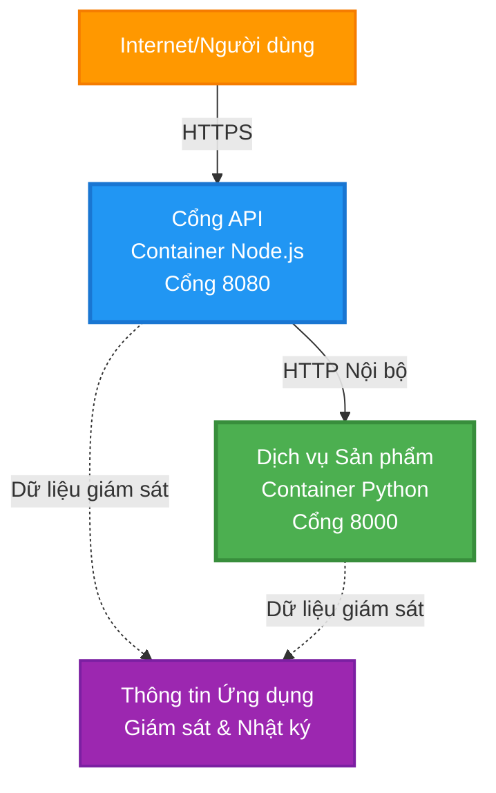
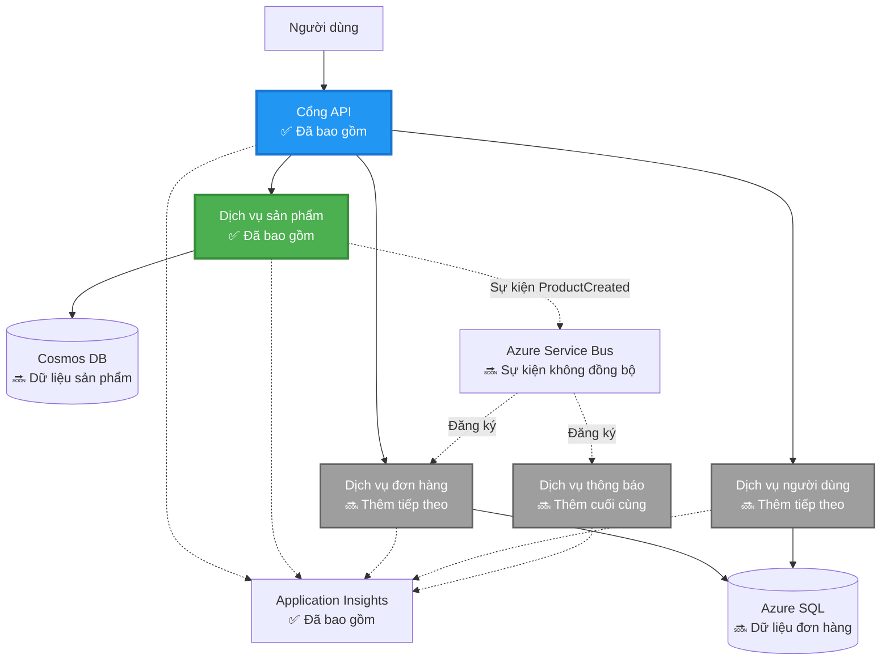
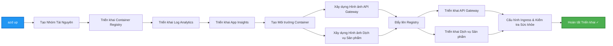
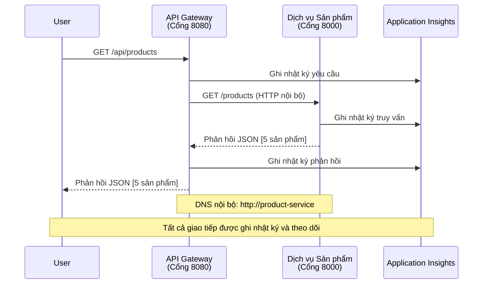

<!--
CO_OP_TRANSLATOR_METADATA:
{
  "original_hash": "eb3a4803a1e80a7f2e64f6bf63738c0f",
  "translation_date": "2025-11-22T10:58:27+00:00",
  "source_file": "examples/microservices/README.md",
  "language_code": "vi"
}
-->
# Kiến trúc Microservices - Ví dụ về Ứng dụng Container

⏱️ **Thời gian ước tính**: 25-35 phút | 💰 **Chi phí ước tính**: ~$50-100/tháng | ⭐ **Độ phức tạp**: Nâng cao

**📚 Lộ trình học tập:**
- ← Trước: [API Flask đơn giản](../../../../examples/container-app/simple-flask-api) - Cơ bản về container đơn
- 🎯 **Bạn đang ở đây**: Kiến trúc Microservices (nền tảng 2 dịch vụ)
- → Tiếp theo: [Tích hợp AI](../../../../docs/ai-foundry) - Thêm trí tuệ vào dịch vụ của bạn
- 🏠 [Trang chủ khóa học](../../README.md)

---

Một kiến trúc microservices **đơn giản nhưng hoạt động** được triển khai trên Azure Container Apps bằng AZD CLI. Ví dụ này minh họa giao tiếp giữa các dịch vụ, điều phối container, và giám sát với thiết lập 2 dịch vụ thực tế.

> **📚 Phương pháp học tập**: Ví dụ này bắt đầu với kiến trúc 2 dịch vụ tối thiểu (API Gateway + Backend Service) mà bạn có thể triển khai và học hỏi. Sau khi nắm vững nền tảng này, chúng tôi cung cấp hướng dẫn để mở rộng thành hệ sinh thái microservices đầy đủ.

## Những gì bạn sẽ học

Hoàn thành ví dụ này, bạn sẽ:
- Triển khai nhiều container lên Azure Container Apps
- Thực hiện giao tiếp giữa các dịch vụ với mạng nội bộ
- Cấu hình mở rộng dựa trên môi trường và kiểm tra sức khỏe
- Giám sát ứng dụng phân tán với Application Insights
- Hiểu các mẫu triển khai microservices và thực tiễn tốt nhất
- Học cách mở rộng từ kiến trúc đơn giản đến phức tạp

## Kiến trúc

### Giai đoạn 1: Những gì chúng ta đang xây dựng (Bao gồm trong ví dụ này)


**Chi tiết thành phần:**

| Thành phần | Mục đích | Truy cập | Tài nguyên |
|------------|----------|----------|------------|
| **API Gateway** | Định tuyến yêu cầu bên ngoài đến các dịch vụ backend | Công khai (HTTPS) | 1 vCPU, 2GB RAM, 2-20 bản sao |
| **Product Service** | Quản lý danh mục sản phẩm với dữ liệu trong bộ nhớ | Chỉ nội bộ | 0.5 vCPU, 1GB RAM, 1-10 bản sao |
| **Application Insights** | Ghi nhật ký tập trung và truy vết phân tán | Azure Portal | 1-2 GB/tháng dữ liệu nhập |

**Tại sao bắt đầu đơn giản?**
- ✅ Triển khai và hiểu nhanh chóng (25-35 phút)
- ✅ Học các mẫu microservices cốt lõi mà không phức tạp
- ✅ Mã hoạt động mà bạn có thể sửa đổi và thử nghiệm
- ✅ Chi phí học tập thấp (~$50-100/tháng so với $300-1400/tháng)
- ✅ Xây dựng sự tự tin trước khi thêm cơ sở dữ liệu và hàng đợi tin nhắn

**Ví dụ minh họa**: Hãy nghĩ về điều này như học lái xe. Bạn bắt đầu với bãi đỗ xe trống (2 dịch vụ), nắm vững các kỹ năng cơ bản, sau đó tiến đến giao thông thành phố (5+ dịch vụ với cơ sở dữ liệu).

### Giai đoạn 2: Mở rộng trong tương lai (Kiến trúc tham khảo)

Khi bạn nắm vững kiến trúc 2 dịch vụ, bạn có thể mở rộng thành:


Xem phần "Hướng dẫn mở rộng" ở cuối để biết hướng dẫn từng bước.

## Các tính năng bao gồm

✅ **Khám phá dịch vụ**: Tự động khám phá DNS giữa các container  
✅ **Cân bằng tải**: Cân bằng tải tích hợp giữa các bản sao  
✅ **Tự động mở rộng**: Mở rộng độc lập cho từng dịch vụ dựa trên yêu cầu HTTP  
✅ **Giám sát sức khỏe**: Kiểm tra liveness và readiness cho cả hai dịch vụ  
✅ **Ghi nhật ký phân tán**: Ghi nhật ký tập trung với Application Insights  
✅ **Mạng nội bộ**: Giao tiếp dịch vụ an toàn  
✅ **Điều phối container**: Triển khai và mở rộng tự động  
✅ **Cập nhật không gián đoạn**: Cập nhật cuốn chiếu với quản lý phiên bản  

## Yêu cầu

### Công cụ cần thiết

Trước khi bắt đầu, hãy xác minh bạn đã cài đặt các công cụ sau:

1. **[Azure Developer CLI (azd)](https://learn.microsoft.com/azure/developer/azure-developer-cli/install-azd)** (phiên bản 1.0.0 hoặc cao hơn)
   ```bash
   azd version
   # Kết quả mong đợi: phiên bản azd 1.0.0 hoặc cao hơn
   ```

2. **[Azure CLI](https://learn.microsoft.com/cli/azure/install-azure-cli)** (phiên bản 2.50.0 hoặc cao hơn)
   ```bash
   az --version
   # Kết quả mong đợi: azure-cli 2.50.0 hoặc cao hơn
   ```

3. **[Docker](https://www.docker.com/get-started)** (dành cho phát triển/kiểm tra cục bộ - tùy chọn)
   ```bash
   docker --version
   # Kết quả mong đợi: Phiên bản Docker 20.10 hoặc cao hơn
   ```

### Xác minh thiết lập của bạn

Chạy các lệnh sau để xác nhận bạn đã sẵn sàng:

```bash
# Kiểm tra Azure Developer CLI
azd version
# ✅ Mong đợi: azd phiên bản 1.0.0 hoặc cao hơn

# Kiểm tra Azure CLI
az --version
# ✅ Mong đợi: azure-cli 2.50.0 hoặc cao hơn

# Kiểm tra Docker (tùy chọn)
docker --version
# ✅ Mong đợi: Docker phiên bản 20.10 hoặc cao hơn
```

**Tiêu chí thành công**: Tất cả các lệnh trả về số phiên bản khớp hoặc vượt mức tối thiểu.

### Yêu cầu Azure

- Một **đăng ký Azure** đang hoạt động ([tạo tài khoản miễn phí](https://azure.microsoft.com/free/))
- Quyền tạo tài nguyên trong đăng ký của bạn
- Vai trò **Contributor** trên đăng ký hoặc nhóm tài nguyên

### Kiến thức yêu cầu

Đây là ví dụ **cấp độ nâng cao**. Bạn nên:
- Hoàn thành ví dụ [API Flask đơn giản](../../../../examples/container-app/simple-flask-api) 
- Hiểu cơ bản về kiến trúc microservices
- Quen thuộc với REST APIs và HTTP
- Hiểu các khái niệm về container

**Mới với Container Apps?** Bắt đầu với ví dụ [API Flask đơn giản](../../../../examples/container-app/simple-flask-api) trước để học các kiến thức cơ bản.

## Bắt đầu nhanh (Từng bước)

### Bước 1: Clone và điều hướng

```bash
git clone https://github.com/microsoft/AZD-for-beginners.git
cd AZD-for-beginners/examples/microservices
```

**✓ Kiểm tra thành công**: Xác minh bạn thấy `azure.yaml`:
```bash
ls
# Dự kiến: README.md, azure.yaml, infra/, src/
```

### Bước 2: Xác thực với Azure

```bash
azd auth login
```

Điều này sẽ mở trình duyệt của bạn để xác thực Azure. Đăng nhập bằng thông tin đăng nhập Azure của bạn.

**✓ Kiểm tra thành công**: Bạn sẽ thấy:
```
Logged in to Azure.
```

### Bước 3: Khởi tạo môi trường

```bash
azd init
```

**Các lời nhắc bạn sẽ thấy**:
- **Tên môi trường**: Nhập một tên ngắn (ví dụ: `microservices-dev`)
- **Đăng ký Azure**: Chọn đăng ký của bạn
- **Vị trí Azure**: Chọn một khu vực (ví dụ: `eastus`, `westeurope`)

**✓ Kiểm tra thành công**: Bạn sẽ thấy:
```
SUCCESS: New project initialized!
```

### Bước 4: Triển khai hạ tầng và dịch vụ

```bash
azd up
```

**Những gì xảy ra** (mất 8-12 phút):


**✓ Kiểm tra thành công**: Bạn sẽ thấy:
```
SUCCESS: Your application was deployed to Azure in X minutes Y seconds.
Endpoint: https://api-gateway-<unique-id>.azurecontainerapps.io
```

**⏱️ Thời gian**: 8-12 phút

### Bước 5: Kiểm tra triển khai

```bash
# Lấy điểm cuối cổng
GATEWAY_URL=$(azd env get-values | grep API_GATEWAY_URL | cut -d '=' -f2 | tr -d '"')

# Kiểm tra sức khỏe API Gateway
curl $GATEWAY_URL/health
```

**✅ Kết quả mong đợi:**
```json
{
  "status": "healthy",
  "service": "api-gateway",
  "timestamp": "2025-11-19T10:30:00Z"
}
```

**Kiểm tra dịch vụ sản phẩm qua gateway**:
```bash
# Liệt kê sản phẩm
curl $GATEWAY_URL/api/products
```

**✅ Kết quả mong đợi:**
```json
[
  {"id":1,"name":"Laptop","price":999.99,"stock":50},
  {"id":2,"name":"Mouse","price":29.99,"stock":200},
  {"id":3,"name":"Keyboard","price":79.99,"stock":150}
]
```

**✓ Kiểm tra thành công**: Cả hai endpoint trả về dữ liệu JSON mà không có lỗi.

---

**🎉 Chúc mừng!** Bạn đã triển khai kiến trúc microservices lên Azure!

## Cấu trúc dự án

Tất cả các tệp triển khai đều được bao gồm—đây là một ví dụ hoàn chỉnh và hoạt động:

```
microservices/
│
├── README.md                         # This file
├── azure.yaml                        # AZD configuration
├── .gitignore                        # Git ignore patterns
│
├── infra/                           # Infrastructure as Code (Bicep)
│   ├── main.bicep                   # Main orchestration
│   ├── abbreviations.json           # Naming conventions
│   ├── core/                        # Shared infrastructure
│   │   ├── container-apps-environment.bicep  # Container environment + registry
│   │   └── monitor.bicep            # Application Insights + Log Analytics
│   └── app/                         # Service definitions
│       ├── api-gateway.bicep        # API Gateway container app
│       └── product-service.bicep    # Product Service container app
│
└── src/                             # Application source code
    ├── api-gateway/                 # Node.js API Gateway
    │   ├── app.js                   # Express server with routing
    │   ├── package.json             # Node dependencies
    │   └── Dockerfile               # Container definition
    └── product-service/             # Python Product Service
        ├── main.py                  # Flask API with product data
        ├── requirements.txt         # Python dependencies
        └── Dockerfile               # Container definition
```

**Mỗi thành phần làm gì:**

**Hạ tầng (infra/)**:
- `main.bicep`: Điều phối tất cả các tài nguyên Azure và các phụ thuộc của chúng
- `core/container-apps-environment.bicep`: Tạo môi trường Container Apps và Azure Container Registry
- `core/monitor.bicep`: Thiết lập Application Insights để ghi nhật ký phân tán
- `app/*.bicep`: Định nghĩa ứng dụng container riêng lẻ với mở rộng và kiểm tra sức khỏe

**API Gateway (src/api-gateway/)**:
- Dịch vụ hướng công khai định tuyến yêu cầu đến các dịch vụ backend
- Triển khai ghi nhật ký, xử lý lỗi, và chuyển tiếp yêu cầu
- Minh họa giao tiếp HTTP giữa các dịch vụ

**Product Service (src/product-service/)**:
- Dịch vụ nội bộ với danh mục sản phẩm (trong bộ nhớ để đơn giản)
- REST API với kiểm tra sức khỏe
- Ví dụ về mẫu microservice backend

## Tổng quan về dịch vụ

### API Gateway (Node.js/Express)

**Cổng**: 8080  
**Truy cập**: Công khai (ingress bên ngoài)  
**Mục đích**: Định tuyến yêu cầu đến các dịch vụ backend phù hợp  

**Endpoints**:
- `GET /` - Thông tin dịch vụ
- `GET /health` - Endpoint kiểm tra sức khỏe
- `GET /api/products` - Chuyển tiếp đến dịch vụ sản phẩm (liệt kê tất cả)
- `GET /api/products/:id` - Chuyển tiếp đến dịch vụ sản phẩm (lấy theo ID)

**Các tính năng chính**:
- Định tuyến yêu cầu với axios
- Ghi nhật ký tập trung
- Xử lý lỗi và quản lý thời gian chờ
- Khám phá dịch vụ qua biến môi trường
- Tích hợp Application Insights

**Điểm nổi bật của mã** (`src/api-gateway/app.js`):
```javascript
// Giao tiếp dịch vụ nội bộ
app.get('/api/products', async (req, res) => {
  const response = await axios.get(`${PRODUCT_SERVICE_URL}/products`, {
    timeout: 5000
  });
  res.json(response.data);
});
```

### Product Service (Python/Flask)

**Cổng**: 8000  
**Truy cập**: Chỉ nội bộ (không có ingress bên ngoài)  
**Mục đích**: Quản lý danh mục sản phẩm với dữ liệu trong bộ nhớ  

**Endpoints**:
- `GET /` - Thông tin dịch vụ
- `GET /health` - Endpoint kiểm tra sức khỏe
- `GET /products` - Liệt kê tất cả sản phẩm
- `GET /products/<id>` - Lấy sản phẩm theo ID

**Các tính năng chính**:
- API RESTful với Flask
- Lưu trữ sản phẩm trong bộ nhớ (đơn giản, không cần cơ sở dữ liệu)
- Giám sát sức khỏe với probes
- Ghi nhật ký có cấu trúc
- Tích hợp Application Insights

**Mô hình dữ liệu**:
```python
{
  "id": 1,
  "name": "Laptop",
  "description": "High-performance laptop",
  "price": 999.99,
  "stock": 50
}
```

**Tại sao chỉ nội bộ?**
Dịch vụ sản phẩm không được công khai. Tất cả các yêu cầu phải đi qua API Gateway, điều này cung cấp:
- Bảo mật: Điểm truy cập được kiểm soát
- Linh hoạt: Có thể thay đổi backend mà không ảnh hưởng đến client
- Giám sát: Ghi nhật ký yêu cầu tập trung

## Hiểu giao tiếp giữa các dịch vụ

### Cách các dịch vụ giao tiếp với nhau


Trong ví dụ này, API Gateway giao tiếp với Product Service bằng **các cuộc gọi HTTP nội bộ**:

```javascript
// Cổng API (src/api-gateway/app.js)
const PRODUCT_SERVICE_URL = process.env.PRODUCT_SERVICE_URL;

// Thực hiện yêu cầu HTTP nội bộ
const response = await axios.get(`${PRODUCT_SERVICE_URL}/products`);
```

**Điểm chính**:

1. **Khám phá dựa trên DNS**: Container Apps tự động cung cấp DNS cho các dịch vụ nội bộ
   - FQDN của Product Service: `product-service.internal.<environment>.azurecontainerapps.io`
   - Đơn giản hóa thành: `http://product-service` (Container Apps sẽ giải quyết)

2. **Không công khai**: Product Service có `external: false` trong Bicep
   - Chỉ có thể truy cập trong môi trường Container Apps
   - Không thể truy cập từ internet

3. **Biến môi trường**: URL dịch vụ được chèn vào lúc triển khai
   - Bicep truyền FQDN nội bộ đến gateway
   - Không có URL hardcoded trong mã ứng dụng

**Ví dụ minh họa**: Hãy nghĩ về điều này như các phòng trong văn phòng. API Gateway là bàn lễ tân (hướng công khai), và Product Service là một phòng làm việc (chỉ nội bộ). Khách phải đi qua lễ tân để đến bất kỳ phòng nào.

## Tùy chọn triển khai

### Triển khai đầy đủ (Khuyến nghị)

```bash
# Triển khai cơ sở hạ tầng và cả hai dịch vụ
azd up
```

Điều này triển khai:
1. Môi trường Container Apps
2. Application Insights
3. Container Registry
4. Container API Gateway
5. Container Product Service

**Thời gian**: 8-12 phút

### Triển khai dịch vụ riêng lẻ

```bash
# Triển khai chỉ một dịch vụ (sau khi azd up ban đầu)
azd deploy api-gateway

# Hoặc triển khai dịch vụ sản phẩm
azd deploy product-service
```

**Trường hợp sử dụng**: Khi bạn đã cập nhật mã trong một dịch vụ và muốn triển khai lại chỉ dịch vụ đó.

### Cập nhật cấu hình

```bash
# Thay đổi các tham số tỷ lệ
azd env set GATEWAY_MAX_REPLICAS 30

# Triển khai lại với cấu hình mới
azd up
```

## Cấu hình

### Cấu hình mở rộng

Cả hai dịch vụ đều được cấu hình với tự động mở rộng dựa trên HTTP trong các tệp Bicep của chúng:

**API Gateway**:
- Bản sao tối thiểu: 2 (luôn ít nhất 2 để đảm bảo khả dụng)
- Bản sao tối đa: 20
- Kích hoạt mở rộng: 50 yêu cầu đồng thời mỗi bản sao

**Product Service**:
- Bản sao tối thiểu: 1 (có thể mở rộng xuống 0 nếu cần)
- Bản sao tối đa: 10
- Kích hoạt mở rộng: 100 yêu cầu đồng thời mỗi bản sao

**Tùy chỉnh mở rộng** (trong `infra/app/*.bicep`):
```bicep
scale: {
  minReplicas: 1
  maxReplicas: 10
  rules: [
    {
      name: 'http-scale-rule'
      http: {
        metadata: {
          concurrentRequests: '100'  // Adjust this
        }
      }
    }
  ]
}
```

### Phân bổ tài nguyên

**API Gateway**:
- CPU: 1.0 vCPU
- Bộ nhớ: 2 GiB
- Lý do: Xử lý tất cả lưu lượng bên ngoài

**Product Service**:
- CPU: 0.5 vCPU
- Bộ nhớ: 1 GiB
- Lý do: Hoạt động nhẹ trong bộ nhớ

### Kiểm tra sức khỏe

Cả hai dịch vụ đều bao gồm liveness và readiness probes:

```bicep
probes: [
  {
    type: 'Liveness'
    httpGet: {
      path: '/health'
      port: 8080
    }
    initialDelaySeconds: 10
    periodSeconds: 30
  }
  {
    type: 'Readiness'
    httpGet: {
      path: '/health'
      port: 8080
    }
    initialDelaySeconds: 5
    periodSeconds: 10
  }
]
```

**Điều này có nghĩa là**:
- **Liveness**: Nếu kiểm tra sức khỏe thất bại, Container Apps sẽ khởi động lại container
- **Readiness**: Nếu không sẵn sàng, Container Apps sẽ ngừng định tuyến lưu lượng đến bản sao đó

## Giám sát & Khả năng quan sát

### Xem nhật ký dịch vụ

```bash
# Truyền nhật ký từ API Gateway
azd logs api-gateway --follow

# Xem nhật ký dịch vụ sản phẩm gần đây
azd logs product-service --tail 100

# Xem tất cả nhật ký từ cả hai dịch vụ
azd logs --follow
```

**Kết quả mong đợi**:
```
[api-gateway] API Gateway listening on port 8080
[api-gateway] Product Service URL: http://product-service
[api-gateway] GET /api/products 200 - 45ms
[product-service] Retrieved 5 products
```

### Truy vấn Application Insights

Truy cập Application Insights trong Azure Portal, sau đó chạy các truy vấn sau:

**Tìm yêu cầu chậm**:
```kusto
requests
| where timestamp > ago(1h)
| where duration > 1000  // Requests taking >1 second
| summarize count() by name, cloud_RoleName
| order by count_ desc
```

**Theo dõi cuộc gọi giữa các dịch vụ**:
```kusto
dependencies
| where timestamp > ago(1h)
| where type == "Http"
| project timestamp, name, target, duration, success
| order by timestamp desc
```

**Tỷ lệ lỗi theo dịch vụ**:
```kusto
exceptions
| where timestamp > ago(24h)
| summarize errorCount = count() by cloud_RoleName, type
| order by errorCount desc
```

**Khối lượng yêu cầu theo thời gian**:
```kusto
requests
| where timestamp > ago(1h)
| summarize requestCount = count() by bin(timestamp, 5m), cloud_RoleName
| render timechart
```

### Truy cập bảng điều khiển giám sát

```bash
# Lấy chi tiết Application Insights
azd env get-values | grep APPLICATIONINSIGHTS

# Mở giám sát Azure Portal
az monitor app-insights component show \
  --app $(azd env get-values | grep APPLICATIONINSIGHTS_CONNECTION_STRING | cut -d '=' -f2) \
  --resource-group $(azd env get-values | grep AZURE_RESOURCE_GROUP | cut -d '=' -f2) \
  --query "appId" -o tsv
```

### Số liệu trực tiếp

1. Điều hướng đến Application Insights trong Azure Portal
2. Nhấp vào "Live Metrics"
3. Xem các yêu cầu, lỗi và hiệu suất theo thời gian thực
4. Kiểm tra bằng cách chạy: `curl $(azd env get-values | grep API_GATEWAY_URL | cut -d '=' -f2 | tr -d '"')/api/products`

## Bài tập thực hành

### Bài tập 1: Thêm một endpoint sản phẩm mới ⭐ (Dễ)

**Mục tiêu**: Thêm một endpoint POST để tạo sản phẩm mới

**Điểm bắt đầu**: `src/product-service/main.py`

**Các bước**:

1. Thêm endpoint này sau hàm `get_product` trong `main.py`:

```python
@app.route('/products', methods=['POST'])
def create_product():
    """Create a new product"""
    data = request.get_json()
    
    # Xác minh các trường bắt buộc
    if not data or 'name' not in data or 'price' not in data:
        return jsonify({'error': 'Missing required fields: name, price'}), 400
    
    new_id = max(p['id'] for p in products) + 1
    new_product = {
        'id': new_id,
        'name': data['name'],
        'description': data.get('description', ''),
        'price': float(data['price']),
        'stock': int(data.get('stock', 0))
    }
    products.append(new_product)
    logger.info(f"Created product {new_id}")
    return jsonify(new_product), 201
```

2. Thêm route POST vào API Gateway (`src/api-gateway/app.js`):

```javascript
// Thêm điều này sau tuyến GET /api/products
app.post('/api/products', async (req, res) => {
  try {
    console.log(`Forwarding POST request to ${PRODUCT_SERVICE_URL}/products`);
    const response = await axios.post(`${PRODUCT_SERVICE_URL}/products`, req.body, {
      timeout: 5000
    });
    res.status(201).json(response.data);
  } catch (error) {
    console.error('Error calling product service:', error.message);
    res.status(503).json({
      error: 'Product service unavailable',
      message: error.message
    });
  }
});
```

3. Triển khai lại cả hai dịch vụ:

```bash
azd deploy product-service
azd deploy api-gateway
```

4. Kiểm tra endpoint mới:

```bash
GATEWAY_URL=$(azd env get-values | grep API_GATEWAY_URL | cut -d '=' -f2 | tr -d '"')

# Tạo một sản phẩm mới
curl -X POST $GATEWAY_URL/api/products \
  -H "Content-Type: application/json" \
  -d '{"name":"USB Cable","price":9.99,"stock":500}'
```

**✅ Kết quả mong đợi:**
```json
{"id":6,"name":"USB Cable","description":"","price":9.99,"stock":500}
```

5. Xác minh nó xuất hiện trong danh sách:

```bash
curl $GATEWAY_URL/api/products
# Bây giờ nên hiển thị 6 sản phẩm bao gồm cả Cáp USB mới
```

**Tiêu chí thành công**:
- ✅ Yêu cầu POST trả về HTTP 201
- ✅ Sản phẩm mới xuất hiện trong danh sách GET /api/products
- ✅ Sản phẩm có ID tự động tăng

**Thời gian**: 10-15 phút

---

### Bài tập 2: Sửa đổi Quy tắc Tự động Mở rộng ⭐⭐ (Trung bình)

**Mục tiêu**: Thay đổi Product Service để mở rộng mạnh mẽ hơn

**Điểm bắt đầu**: `infra/app/product-service.bicep`

**Các bước**:

1. Mở `infra/app/product-service.bicep` và tìm khối `scale` (khoảng dòng 95)

2. Thay đổi từ:
```bicep
scale: {
  minReplicas: 1
  maxReplicas: 10
  rules: [
    {
      name: 'http-scale-rule'
      http: {
        metadata: {
          concurrentRequests: '100'  // OLD
        }
      }
    }
  ]
}
```

Thành:
```bicep
scale: {
  minReplicas: 2  // Always have 2 running
  maxReplicas: 20  // Allow more scaling
  rules: [
    {
      name: 'http-scale-rule'
      http: {
        metadata: {
          concurrentRequests: '20'  // Scale at lower threshold
        }
      }
    }
  ]
}
```

3. Triển khai lại cơ sở hạ tầng:

```bash
azd up
```

4. Xác minh cấu hình mở rộng mới:

```bash
az containerapp show \
  --name $(azd env get-values | grep PRODUCT_SERVICE | head -1 | cut -d '/' -f5) \
  --resource-group $(azd env get-values | grep AZURE_RESOURCE_GROUP | cut -d '=' -f2 | tr -d '"') \
  --query "properties.template.scale" -o json
```

**✅ Kết quả mong đợi:**
```json
{
  "minReplicas": 2,
  "maxReplicas": 20,
  "rules": [...]
}
```

5. Kiểm tra tự động mở rộng với tải:

```bash
# Tạo các yêu cầu đồng thời
for i in {1..500}; do curl $GATEWAY_URL/api/products & done

# Theo dõi quá trình mở rộng quy mô
azd logs product-service --follow
# Tìm kiếm: Các sự kiện mở rộng quy mô của Ứng dụng Container
```

**Tiêu chí thành công**:
- ✅ Product Service luôn chạy ít nhất 2 bản sao
- ✅ Dưới tải, mở rộng lên hơn 2 bản sao
- ✅ Azure Portal hiển thị các quy tắc mở rộng mới

**Thời gian**: 15-20 phút

---

### Bài tập 3: Thêm Truy vấn Giám sát Tùy chỉnh ⭐⭐ (Trung bình)

**Mục tiêu**: Tạo truy vấn Application Insights tùy chỉnh để theo dõi hiệu suất API sản phẩm

**Các bước**:

1. Điều hướng đến Application Insights trong Azure Portal:
   - Truy cập Azure Portal
   - Tìm nhóm tài nguyên của bạn (rg-microservices-*)
   - Nhấp vào tài nguyên Application Insights

2. Nhấp vào "Logs" trong menu bên trái

3. Tạo truy vấn này:

```kusto
requests
| where timestamp > ago(1h)
| where name contains "products"
| summarize 
    RequestCount = count(),
    AvgDuration = avg(duration),
    P95Duration = percentile(duration, 95),
    SuccessRate = 100.0 * countif(success == true) / count()
  by bin(timestamp, 5m)
| render timechart
```

4. Nhấp "Run" để thực thi truy vấn

5. Lưu truy vấn:
   - Nhấp "Save"
   - Tên: "Product API Performance"
   - Danh mục: "Performance"

6. Tạo lưu lượng thử nghiệm:

```bash
for i in {1..100}; do curl $GATEWAY_URL/api/products; sleep 1; done
```

7. Làm mới truy vấn để xem dữ liệu

**✅ Kết quả mong đợi:**
- Biểu đồ hiển thị số lượng yêu cầu theo thời gian
- Thời gian trung bình < 500ms
- Tỷ lệ thành công = 100%
- Khoảng thời gian 5 phút

**Tiêu chí thành công**:
- ✅ Truy vấn hiển thị hơn 100 yêu cầu
- ✅ Tỷ lệ thành công là 100%
- ✅ Thời gian trung bình < 500ms
- ✅ Biểu đồ hiển thị khoảng thời gian 5 phút

**Kết quả học tập**: Hiểu cách giám sát hiệu suất dịch vụ với các truy vấn tùy chỉnh

**Thời gian**: 10-15 phút

---

### Bài tập 4: Thực hiện Logic Thử lại ⭐⭐⭐ (Nâng cao)

**Mục tiêu**: Thêm logic thử lại vào API Gateway khi Product Service tạm thời không khả dụng

**Điểm bắt đầu**: `src/api-gateway/app.js`

**Các bước**:

1. Cài đặt thư viện thử lại:

```bash
cd src/api-gateway
npm install axios-retry --save
cd ../..
```

2. Cập nhật `src/api-gateway/app.js` (thêm sau khi import axios):

```javascript
const axiosRetry = require('axios-retry');

// Cấu hình logic thử lại
axiosRetry(axios, {
  retries: 3,
  retryDelay: (retryCount) => {
    return retryCount * 1000; // 1s, 2s, 3s
  },
  retryCondition: (error) => {
    // Thử lại khi có lỗi mạng hoặc phản hồi 5xx
    return axiosRetry.isNetworkOrIdempotentRequestError(error) ||
           (error.response && error.response.status >= 500);
  }
});

console.log('Retry logic configured: 3 retries with exponential backoff');
```

3. Triển khai lại API Gateway:

```bash
azd deploy api-gateway
```

4. Kiểm tra hành vi thử lại bằng cách mô phỏng lỗi dịch vụ:

```bash
# Thu nhỏ dịch vụ sản phẩm xuống 0 (mô phỏng lỗi)
az containerapp update \
  --name $(azd env get-values | grep PRODUCT_SERVICE | head -1 | cut -d '/' -f5) \
  --resource-group $(azd env get-values | grep AZURE_RESOURCE_GROUP | cut -d '=' -f2 | tr -d '"') \
  --min-replicas 0 \
  --max-replicas 0

# Thử truy cập sản phẩm (sẽ thử lại 3 lần)
time curl -v $GATEWAY_URL/api/products
# Quan sát: Phản hồi mất ~6 giây (1s + 2s + 3s thử lại)

# Khôi phục dịch vụ sản phẩm
az containerapp update \
  --name $(azd env get-values | grep PRODUCT_SERVICE | head -1 | cut -d '/' -f5) \
  --resource-group $(azd env get-values | grep AZURE_RESOURCE_GROUP | cut -d '=' -f2 | tr -d '"') \
  --min-replicas 1 \
  --max-replicas 10
```

5. Xem nhật ký thử lại:

```bash
azd logs api-gateway --tail 50
# Tìm kiếm: Thông báo thử lại
```

**✅ Hành vi mong đợi:**
- Yêu cầu thử lại 3 lần trước khi thất bại
- Mỗi lần thử lại chờ lâu hơn (1s, 2s, 3s)
- Yêu cầu thành công sau khi dịch vụ khởi động lại
- Nhật ký hiển thị các lần thử lại

**Tiêu chí thành công**:
- ✅ Yêu cầu thử lại 3 lần trước khi thất bại
- ✅ Mỗi lần thử lại chờ lâu hơn (backoff theo cấp số nhân)
- ✅ Yêu cầu thành công sau khi dịch vụ khởi động lại
- ✅ Nhật ký hiển thị các lần thử lại

**Kết quả học tập**: Hiểu các mẫu tăng cường độ bền trong microservices (circuit breakers, retries, timeouts)

**Thời gian**: 20-25 phút

---

## Điểm Kiểm Tra Kiến Thức

Sau khi hoàn thành ví dụ này, hãy kiểm tra hiểu biết của bạn:

### 1. Giao tiếp Dịch vụ ✓

Kiểm tra kiến thức của bạn:
- [ ] Bạn có thể giải thích cách API Gateway phát hiện Product Service không? (Khám phá dịch vụ dựa trên DNS)
- [ ] Điều gì xảy ra nếu Product Service ngừng hoạt động? (Gateway trả về lỗi 503)
- [ ] Làm thế nào để thêm một dịch vụ thứ ba? (Tạo tệp Bicep mới, thêm vào main.bicep, tạo thư mục src)

**Xác minh Thực hành**:
```bash
# Mô phỏng lỗi dịch vụ
az containerapp update --name <product-service-name> --min-replicas 0 --max-replicas 0
curl $GATEWAY_URL/api/products
# ✅ Dự kiến: 503 Dịch vụ không khả dụng

# Khôi phục dịch vụ
az containerapp update --name <product-service-name> --min-replicas 1 --max-replicas 10
```

### 2. Giám sát & Quan sát ✓

Kiểm tra kiến thức của bạn:
- [ ] Bạn xem nhật ký phân tán ở đâu? (Application Insights trong Azure Portal)
- [ ] Làm thế nào để theo dõi các yêu cầu chậm? (Truy vấn Kusto: `requests | where duration > 1000`)
- [ ] Bạn có thể xác định dịch vụ nào gây ra lỗi không? (Kiểm tra trường `cloud_RoleName` trong nhật ký)

**Xác minh Thực hành**:
```bash
# Tạo mô phỏng yêu cầu chậm
curl "$GATEWAY_URL/api/products?delay=2000"

# Truy vấn Application Insights cho các yêu cầu chậm
# Điều hướng đến Azure Portal → Application Insights → Logs
# Chạy: requests | where duration > 1000 | project timestamp, name, duration, cloud_RoleName
```

### 3. Mở rộng & Hiệu suất ✓

Kiểm tra kiến thức của bạn:
- [ ] Điều gì kích hoạt tự động mở rộng? (Quy tắc yêu cầu đồng thời HTTP: 50 cho gateway, 100 cho product)
- [ ] Hiện tại có bao nhiêu bản sao đang chạy? (Kiểm tra với `az containerapp revision list`)
- [ ] Làm thế nào để mở rộng Product Service lên 5 bản sao? (Cập nhật minReplicas trong Bicep)

**Xác minh Thực hành**:
```bash
# Tạo tải để kiểm tra tự động mở rộng
for i in {1..1000}; do curl $GATEWAY_URL/api/products & done

# Theo dõi số lượng bản sao tăng lên
azd logs api-gateway --follow
# ✅ Dự kiến: Xem các sự kiện mở rộng trong nhật ký
```

**Tiêu chí thành công**: Bạn có thể trả lời tất cả các câu hỏi và xác minh bằng các lệnh thực hành.

---

## Phân tích Chi phí

### Chi phí Ước tính Hàng tháng (Cho Ví dụ 2 Dịch vụ Này)

| Tài nguyên | Cấu hình | Chi phí Ước tính |
|------------|----------|------------------|
| API Gateway | 2-20 bản sao, 1 vCPU, 2GB RAM | $30-150 |
| Product Service | 1-10 bản sao, 0.5 vCPU, 1GB RAM | $15-75 |
| Container Registry | Basic tier | $5 |
| Application Insights | 1-2 GB/tháng | $5-10 |
| Log Analytics | 1 GB/tháng | $3 |
| **Tổng cộng** | | **$58-243/tháng** |

### Phân tích Chi phí Theo Mức Sử Dụng

**Lưu lượng nhẹ** (học tập/thử nghiệm): ~$60/tháng
- API Gateway: 2 bản sao × 24/7 = $30
- Product Service: 1 bản sao × 24/7 = $15
- Giám sát + Registry = $13

**Lưu lượng trung bình** (sản xuất nhỏ): ~$120/tháng
- API Gateway: Trung bình 5 bản sao = $75
- Product Service: Trung bình 3 bản sao = $45
- Giám sát + Registry = $13

**Lưu lượng cao** (giai đoạn bận rộn): ~$240/tháng
- API Gateway: Trung bình 15 bản sao = $225
- Product Service: Trung bình 8 bản sao = $120
- Giám sát + Registry = $13

### Mẹo Tối ưu Chi Phí

1. **Scale to Zero cho Phát triển**:
   ```bicep
   scale: {
     minReplicas: 0  // Save $30-40/month when not in use
     maxReplicas: 10
   }
   ```

2. **Sử dụng Consumption Plan cho Cosmos DB** (khi bạn thêm nó):
   - Chỉ trả tiền cho những gì bạn sử dụng
   - Không có phí tối thiểu

3. **Đặt Application Insights Sampling**:
   ```javascript
   appInsights.defaultClient.config.samplingPercentage = 50; // Lấy mẫu 50% yêu cầu
   ```

4. **Dọn dẹp Khi Không Cần Thiết**:
   ```bash
   azd down --force --purge
   ```

### Tùy chọn Miễn phí

Để học tập/thử nghiệm, hãy cân nhắc:
- ✅ Sử dụng tín dụng miễn phí Azure ($200 trong 30 ngày đầu với tài khoản mới)
- ✅ Giữ số bản sao tối thiểu (tiết kiệm ~50% chi phí)
- ✅ Xóa sau khi thử nghiệm (không có phí liên tục)
- ✅ Scale to zero giữa các phiên học

**Ví dụ**: Chạy ví dụ này trong 2 giờ/ngày × 30 ngày = ~$5/tháng thay vì $60/tháng

---

## Tham khảo Nhanh Khắc phục Sự cố

### Vấn đề: `azd up` thất bại với "Subscription not found"

**Giải pháp**:
```bash
# Đăng nhập lại với đăng ký rõ ràng
az account set --subscription <your-subscription-id>
azd env set AZURE_SUBSCRIPTION_ID <your-subscription-id>
azd up
```

### Vấn đề: API Gateway trả về 503 "Product service unavailable"

**Chẩn đoán**:
```bash
# Kiểm tra nhật ký dịch vụ sản phẩm
azd logs product-service --tail 50

# Kiểm tra trạng thái hoạt động của dịch vụ sản phẩm
az containerapp show \
  --name $(azd env get-values | grep PRODUCT_SERVICE | head -1 | cut -d '/' -f5) \
  --resource-group $(azd env get-values | grep AZURE_RESOURCE_GROUP | cut -d '=' -f2 | tr -d '"') \
  --query "properties.runningStatus"
```

**Nguyên nhân phổ biến**:
1. Product service không khởi động (kiểm tra nhật ký lỗi Python)
2. Health check thất bại (xác minh endpoint `/health` hoạt động)
3. Xây dựng hình ảnh container thất bại (kiểm tra registry cho hình ảnh)

### Vấn đề: Tự động mở rộng không hoạt động

**Chẩn đoán**:
```bash
# Kiểm tra số lượng bản sao hiện tại
az containerapp revision list \
  --name $(azd env get-values | grep API_GATEWAY | head -1 | cut -d '/' -f5) \
  --resource-group $(azd env get-values | grep AZURE_RESOURCE_GROUP | cut -d '=' -f2 | tr -d '"') \
  --query "[].properties.replicas"

# Tạo tải để kiểm tra
for i in {1..1000}; do curl $GATEWAY_URL/api/products & done

# Theo dõi các sự kiện mở rộng
azd logs api-gateway --follow | grep -i scale
```

**Nguyên nhân phổ biến**:
1. Tải không đủ cao để kích hoạt quy tắc mở rộng (cần >50 yêu cầu đồng thời)
2. Đã đạt số bản sao tối đa (kiểm tra cấu hình Bicep)
3. Quy tắc mở rộng cấu hình sai trong Bicep (xác minh giá trị concurrentRequests)

### Vấn đề: Application Insights không hiển thị nhật ký

**Chẩn đoán**:
```bash
# Xác minh chuỗi kết nối đã được thiết lập
azd env get-values | grep APPLICATIONINSIGHTS

# Kiểm tra xem các dịch vụ có đang gửi dữ liệu từ xa không
az monitor app-insights component show \
  --app $(azd env get-values | grep APPLICATIONINSIGHTS_NAME | cut -d '=' -f2 | tr -d '"') \
  --resource-group $(azd env get-values | grep AZURE_RESOURCE_GROUP | cut -d '=' -f2 | tr -d '"') \
  --query "properties.InstrumentationKey"
```

**Nguyên nhân phổ biến**:
1. Chuỗi kết nối không được truyền vào container (kiểm tra biến môi trường)
2. SDK Application Insights không được cấu hình (xác minh import trong mã)
3. Tường lửa chặn telemetry (hiếm, kiểm tra quy tắc mạng)

### Vấn đề: Docker build thất bại cục bộ

**Chẩn đoán**:
```bash
# Kiểm tra xây dựng API Gateway
cd src/api-gateway
docker build -t test-gateway .

# Kiểm tra xây dựng Dịch vụ Sản phẩm
cd ../product-service
docker build -t test-product .
```

**Nguyên nhân phổ biến**:
1. Thiếu phụ thuộc trong package.json/requirements.txt
2. Lỗi cú pháp Dockerfile
3. Vấn đề mạng khi tải xuống phụ thuộc

**Vẫn gặp khó khăn?** Xem [Hướng dẫn Vấn đề Thường gặp](../../docs/troubleshooting/common-issues.md) hoặc [Khắc phục sự cố Azure Container Apps](https://learn.microsoft.com/azure/container-apps/troubleshooting)

---

## Dọn dẹp

Để tránh phí liên tục, hãy xóa tất cả tài nguyên:

```bash
azd down --force --purge
```

**Nhắc nhở Xác nhận**:
```
? Total resources to delete: 6, are you sure you want to continue? (y/N)
```

Nhập `y` để xác nhận.

**Những gì sẽ bị xóa**:
- Môi trường Container Apps
- Cả hai Container Apps (gateway & product service)
- Container Registry
- Application Insights
- Log Analytics Workspace
- Nhóm Tài nguyên

**✓ Xác minh Dọn dẹp**:
```bash
az group list --query "[?starts_with(name,'rg-microservices')]" --output table
```

Nên trả về trống.

---

## Hướng dẫn Mở rộng: Từ 2 đến 5+ Dịch vụ

Khi bạn đã thành thạo kiến trúc 2 dịch vụ này, đây là cách mở rộng:

### Giai đoạn 1: Thêm Lưu trữ Cơ sở Dữ liệu (Bước Tiếp theo)

**Thêm Cosmos DB cho Product Service**:

1. Tạo `infra/core/cosmos.bicep`:
   ```bicep
   resource cosmosAccount 'Microsoft.DocumentDB/databaseAccounts@2023-04-15' = {
     name: name
     location: location
     kind: 'GlobalDocumentDB'
     properties: {
       databaseAccountOfferType: 'Standard'
       consistencyPolicy: { defaultConsistencyLevel: 'Session' }
       locations: [{ locationName: location, failoverPriority: 0 }]
     }
   }
   ```

2. Cập nhật product service để sử dụng Azure Cosmos DB Python SDK thay vì dữ liệu trong bộ nhớ

3. Chi phí bổ sung ước tính: ~$25/tháng (serverless)

### Giai đoạn 2: Thêm Dịch vụ Thứ ba (Quản lý Đơn hàng)

**Tạo Order Service**:

1. Thư mục mới: `src/order-service/` (Python/Node.js/C#)
2. Bicep mới: `infra/app/order-service.bicep`
3. Cập nhật API Gateway để định tuyến `/api/orders`
4. Thêm Azure SQL Database để lưu trữ đơn hàng

**Kiến trúc trở thành**:
```
API Gateway → Product Service (Cosmos DB)
           → Order Service (Azure SQL)
```

### Giai đoạn 3: Thêm Giao tiếp Không đồng bộ (Service Bus)

**Thực hiện Kiến trúc Dựa trên Sự kiện**:

1. Thêm Azure Service Bus: `infra/core/servicebus.bicep`
2. Product Service xuất bản sự kiện "ProductCreated"
3. Order Service đăng ký sự kiện sản phẩm
4. Thêm Notification Service để xử lý sự kiện

**Mẫu**: Yêu cầu/Phản hồi (HTTP) + Dựa trên Sự kiện (Service Bus)

### Giai đoạn 4: Thêm Xác thực Người dùng

**Thực hiện User Service**:

1. Tạo `src/user-service/` (Go/Node.js)
2. Thêm Azure AD B2C hoặc xác thực JWT tùy chỉnh
3. API Gateway xác thực token trước khi định tuyến
4. Các dịch vụ kiểm tra quyền người dùng

### Giai đoạn 5: Sẵn sàng Sản xuất

**Thêm Các Thành phần Này**:
- ✅ Azure Front Door (cân bằng tải toàn cầu)
- ✅ Azure Key Vault (quản lý bí mật)
- ✅ Azure Monitor Workbooks (bảng điều khiển tùy chỉnh)
- ✅ CI/CD Pipeline (GitHub Actions)
- ✅ Blue-Green Deployments
- ✅ Managed Identity cho tất cả dịch vụ

**Chi phí Kiến trúc Sản xuất Đầy đủ**: ~$300-1,400/tháng

---

## Tìm hiểu Thêm

### Tài liệu Liên quan
- [Tài liệu Azure Container Apps](https://learn.microsoft.com/azure/container-apps/)
- [Hướng dẫn Kiến trúc Microservices](https://learn.microsoft.com/azure/architecture/guide/architecture-styles/microservices)
- [Application Insights cho Truy vết Phân tán](https://learn.microsoft.com/azure/azure-monitor/app/distributed-tracing)
- [Tài liệu Azure Developer CLI](https://learn.microsoft.com/azure/developer/azure-developer-cli/)

### Bước Tiếp theo trong Khóa học Này
- ← Trước: [Simple Flask API](../../../../examples/container-app/simple-flask-api) - Ví dụ đơn giản với một container
- → Tiếp theo: [AI Integration Guide](../../../../docs/ai-foundry) - Thêm khả năng AI
- 🏠 [Trang chủ Khóa học](../../README.md)

### So sánh: Khi nào nên sử dụng gì

| Tính năng | Một Container | Microservices (Cái này) | Kubernetes (AKS) |
|-----------|---------------|-------------------------|------------------|
| **Trường hợp sử dụng** | Ứng dụng đơn giản | Ứng dụng phức tạp | Ứng dụng doanh nghiệp |
| **Khả năng mở rộng** | Một dịch vụ | Mở rộng theo từng dịch vụ | Linh hoạt tối đa |
| **Độ phức tạp** | Thấp | Trung bình | Cao |
| **Quy mô nhóm** | 1-3 nhà phát triển | 3-10 nhà phát triển | 10+ nhà phát triển |
| **Chi phí** | ~$15-50/tháng | ~$60-250/tháng | ~$150-500/tháng |
| **Thời gian triển khai** | 5-10 phút | 8-12 phút | 15-30 phút |
| **Phù hợp nhất cho** | MVPs, nguyên mẫu | Ứng dụng sản xuất | Đa đám mây, mạng nâng cao |

**Khuyến nghị**: Bắt đầu với Container Apps (ví dụ này), chuyển sang AKS chỉ khi bạn cần các tính năng cụ thể của Kubernetes.

---

## Câu hỏi thường gặp

**H: Tại sao chỉ có 2 dịch vụ thay vì 5+?**  
Đ: Tiến trình học tập. Nắm vững các nguyên tắc cơ bản (giao tiếp dịch vụ, giám sát, mở rộng) với một ví dụ đơn giản trước khi thêm sự phức tạp. Các mẫu bạn học ở đây áp dụng cho kiến trúc 100 dịch vụ.

**H: Tôi có thể tự thêm nhiều dịch vụ hơn không?**  
Đ: Chắc chắn rồi! Làm theo hướng dẫn mở rộng ở trên. Mỗi dịch vụ mới tuân theo cùng một mẫu: tạo thư mục src, tạo tệp Bicep, cập nhật azure.yaml, triển khai.

**H: Đây có sẵn sàng cho sản xuất chưa?**  
Đ: Đây là một nền tảng vững chắc. Để sẵn sàng cho sản xuất, hãy thêm: managed identity, Key Vault, cơ sở dữ liệu lưu trữ, pipeline CI/CD, cảnh báo giám sát và chiến lược sao lưu.

**H: Tại sao không sử dụng Dapr hoặc các service mesh khác?**  
Đ: Giữ mọi thứ đơn giản để học tập. Khi bạn hiểu mạng lưới Container Apps gốc, bạn có thể thêm Dapr cho các kịch bản nâng cao (quản lý trạng thái, pub/sub, bindings).

**H: Làm thế nào để gỡ lỗi cục bộ?**  
Đ: Chạy các dịch vụ cục bộ với Docker:  
```bash
cd src/api-gateway
docker build -t local-gateway .
docker run -p 8080:8080 -e PRODUCT_SERVICE_URL=http://localhost:8000 local-gateway
```
  
**H: Tôi có thể sử dụng các ngôn ngữ lập trình khác không?**  
Đ: Có! Ví dụ này sử dụng Node.js (gateway) + Python (dịch vụ sản phẩm). Bạn có thể kết hợp bất kỳ ngôn ngữ nào chạy trong container: C#, Go, Java, Ruby, PHP, v.v.

**H: Nếu tôi không có tín dụng Azure thì sao?**  
Đ: Sử dụng gói miễn phí của Azure (30 ngày đầu tiên với tài khoản mới được $200 tín dụng) hoặc triển khai trong thời gian thử nghiệm ngắn và xóa ngay lập tức. Ví dụ này tốn khoảng ~$2/ngày.

**H: Điều này khác gì so với Azure Kubernetes Service (AKS)?**  
Đ: Container Apps đơn giản hơn (không cần kiến thức về Kubernetes) nhưng ít linh hoạt hơn. AKS cung cấp cho bạn toàn quyền kiểm soát Kubernetes nhưng đòi hỏi nhiều chuyên môn hơn. Bắt đầu với Container Apps, chuyển sang AKS nếu cần.

**H: Tôi có thể sử dụng điều này với các dịch vụ Azure hiện có không?**  
Đ: Có! Bạn có thể kết nối với các cơ sở dữ liệu hiện có, tài khoản lưu trữ, Service Bus, v.v. Cập nhật các tệp Bicep để tham chiếu các tài nguyên hiện có thay vì tạo mới.

---

> **🎓 Tóm tắt lộ trình học tập**: Bạn đã học cách triển khai kiến trúc đa dịch vụ với khả năng mở rộng tự động, mạng nội bộ, giám sát tập trung và các mẫu sẵn sàng cho sản xuất. Nền tảng này chuẩn bị cho bạn các hệ thống phân tán phức tạp và kiến trúc microservices doanh nghiệp.

**📚 Điều hướng khóa học:**
- ← Trước: [Simple Flask API](../../../../examples/container-app/simple-flask-api)
- → Tiếp theo: [Ví dụ tích hợp cơ sở dữ liệu](../../../../database-app)
- 🏠 [Trang chủ khóa học](../../README.md)
- 📖 [Thực hành tốt nhất với Container Apps](../../docs/deployment/deployment-guide.md)

---

**✨ Chúc mừng!** Bạn đã hoàn thành ví dụ về microservices. Giờ đây, bạn đã hiểu cách xây dựng, triển khai và giám sát các ứng dụng phân tán trên Azure Container Apps. Sẵn sàng thêm khả năng AI? Hãy xem [Hướng dẫn tích hợp AI](../../../../docs/ai-foundry)!

---

<!-- CO-OP TRANSLATOR DISCLAIMER START -->
**Tuyên bố miễn trừ trách nhiệm**:  
Tài liệu này đã được dịch bằng dịch vụ dịch thuật AI [Co-op Translator](https://github.com/Azure/co-op-translator). Mặc dù chúng tôi cố gắng đảm bảo độ chính xác, xin lưu ý rằng các bản dịch tự động có thể chứa lỗi hoặc không chính xác. Tài liệu gốc bằng ngôn ngữ bản địa nên được coi là nguồn thông tin chính thức. Đối với thông tin quan trọng, nên sử dụng dịch vụ dịch thuật chuyên nghiệp của con người. Chúng tôi không chịu trách nhiệm cho bất kỳ sự hiểu lầm hoặc diễn giải sai nào phát sinh từ việc sử dụng bản dịch này.
<!-- CO-OP TRANSLATOR DISCLAIMER END -->