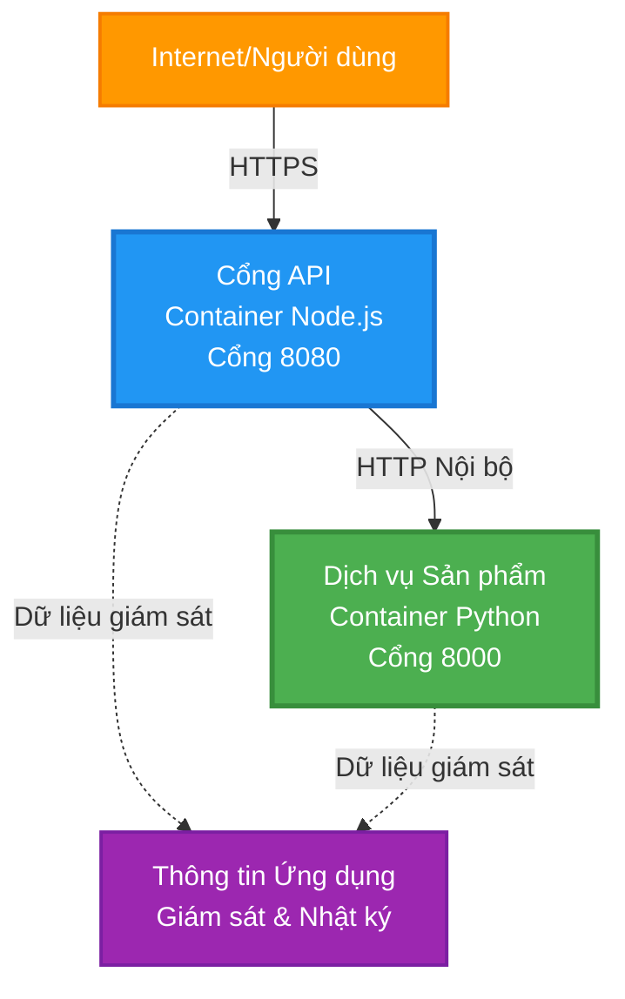
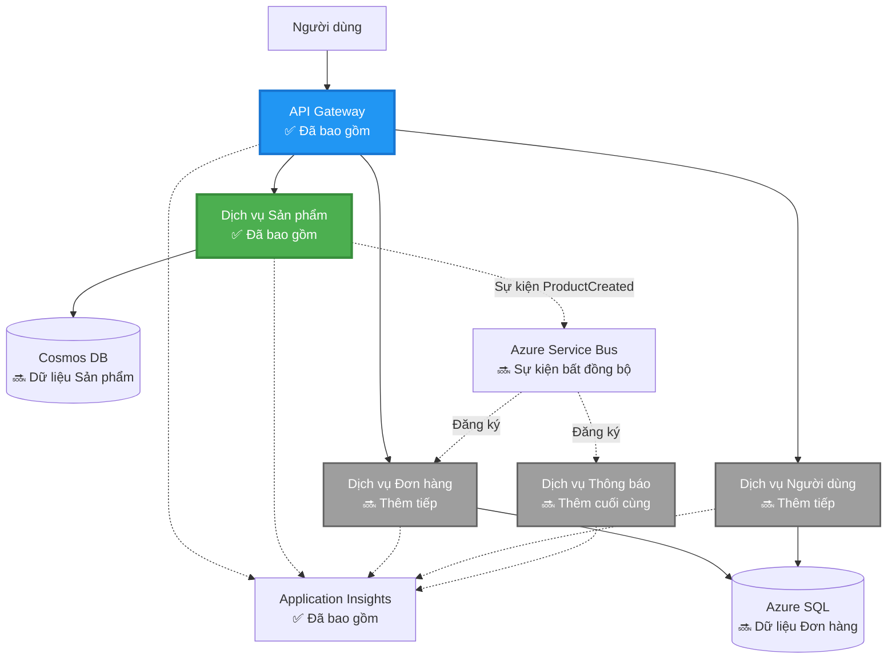
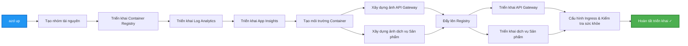
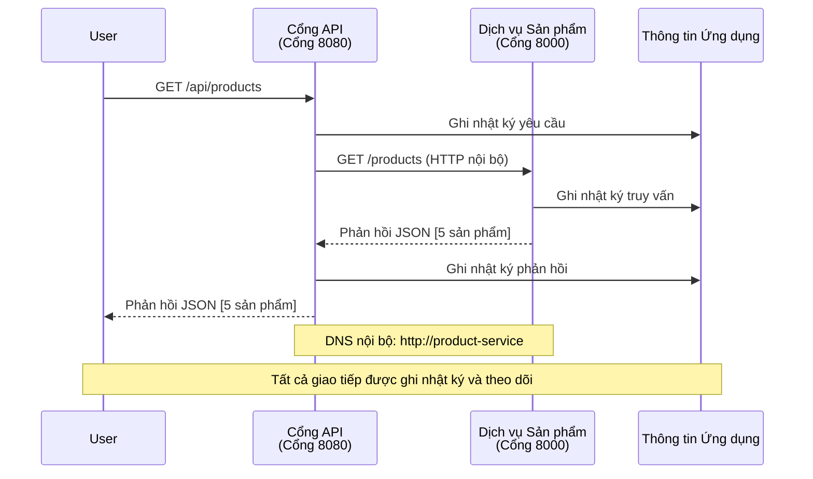

# Kiến trúc Microservices - Ví dụ Container App

⏱️ **Thời gian ước tính**: 25-35 phút | 💰 **Chi phí ước tính**: ~$50-100/tháng | ⭐ **Độ phức tạp**: Nâng cao

**📚 Lộ trình học:**
- ← Trước: [API Flask đơn giản](../../../../examples/container-app/simple-flask-api) - Cơ bản về một container
- 🎯 **Bạn đang ở đây**: Kiến trúc Microservices (nền tảng 2 dịch vụ)
- → Tiếp theo: [Tích hợp AI](../../../../docs/ai-foundry) - Thêm khả năng thông minh cho các dịch vụ của bạn
- 🏠 [Trang chính khóa học](../../README.md)

---

Một kiến trúc microservices **đơn giản nhưng có chức năng** được triển khai lên Azure Container Apps bằng AZD CLI. Ví dụ này minh họa giao tiếp giữa các dịch vụ, điều phối container và giám sát với một thiết lập thực tế gồm 2 dịch vụ.

> **📚 Phương pháp học**: Ví dụ này bắt đầu với một kiến trúc 2 dịch vụ tối giản (API Gateway + Backend Service) mà bạn có thể thực sự triển khai và học hỏi. Sau khi nắm vững nền tảng này, chúng tôi cung cấp hướng dẫn để mở rộng thành một hệ sinh thái microservices đầy đủ.

## Những gì bạn sẽ học

Bằng cách hoàn thành ví dụ này, bạn sẽ:
- Triển khai nhiều container lên Azure Container Apps
- Thực hiện giao tiếp giữa dịch vụ với dịch vụ bằng mạng nội bộ
- Cấu hình tự động mở rộng dựa trên môi trường và kiểm tra tình trạng sức khỏe
- Giám sát ứng dụng phân tán bằng Application Insights
- Hiểu các mẫu triển khai microservices và các thực hành tốt nhất
- Học cách mở rộng dần từ kiến trúc đơn giản đến phức tạp

## Kiến trúc

### Giai đoạn 1: Những gì chúng ta đang xây dựng (Bao gồm trong ví dụ này)


```mermaid
graph TB
    Internet[Internet/Người dùng]
    Gateway[Cổng API<br/>Container Node.js<br/>Cổng 8080]
    Product[Dịch vụ Sản phẩm<br/>Container Python<br/>Cổng 8000]
    AppInsights[Thông tin Ứng dụng<br/>Giám sát & Nhật ký]
    
    Internet -->|HTTPS| Gateway
    Gateway -->|HTTP Nội bộ| Product
    Gateway -.->|Dữ liệu giám sát| AppInsights
    Product -.->|Dữ liệu giám sát| AppInsights
    
    style Gateway fill:#2196F3,stroke:#1976D2,stroke-width:3px,color:#fff
    style Product fill:#4CAF50,stroke:#388E3C,stroke-width:3px,color:#fff
    style Internet fill:#FF9800,stroke:#F57C00,stroke-width:2px,color:#fff
    style AppInsights fill:#9C27B0,stroke:#7B1FA2,stroke-width:2px,color:#fff
```
**Chi tiết thành phần:**

| Thành phần | Mục đích | Truy cập | Tài nguyên |
|-----------|---------|--------|-----------|
| **API Gateway** | Chuyển hướng các yêu cầu bên ngoài tới các dịch vụ backend | Công khai (HTTPS) | 1 vCPU, 2GB RAM, 2-20 bản sao |
| **Product Service** | Quản lý danh mục sản phẩm với dữ liệu trong bộ nhớ | Chỉ nội bộ | 0.5 vCPU, 1GB RAM, 1-10 bản sao |
| **Application Insights** | Ghi nhật ký tập trung và truy vết phân tán | Azure Portal | 1-2 GB/tháng lượng dữ liệu nhập |

**Tại sao bắt đầu đơn giản?**
- ✅ Triển khai và hiểu nhanh (25-35 phút)
- ✅ Học các mẫu microservices cốt lõi mà không phức tạp
- ✅ Mã hoạt động bạn có thể chỉnh sửa và thử nghiệm
- ✅ Chi phí học thấp hơn (~$50-100/tháng so với $300-1400/tháng)
- ✅ Xây dựng tự tin trước khi thêm cơ sở dữ liệu và hàng đợi tin nhắn

**Tượng hình**: Hãy tưởng tượng như học lái xe. Bạn bắt đầu với một bãi đậu trống (2 dịch vụ), nắm vững các điều cơ bản, rồi tiến đến giao thông thành phố (5+ dịch vụ với cơ sở dữ liệu).

### Giai đoạn 2: Mở rộng trong tương lai (Kiến trúc tham khảo)

Khi bạn nắm vững kiến trúc 2 dịch vụ, bạn có thể mở rộng sang:


```mermaid
graph TB
    User[Người dùng]
    Gateway[API Gateway<br/>✅ Đã bao gồm]
    Product[Dịch vụ Sản phẩm<br/>✅ Đã bao gồm]
    Order[Dịch vụ Đơn hàng<br/>🔜 Thêm tiếp]
    UserSvc[Dịch vụ Người dùng<br/>🔜 Thêm tiếp]
    Notify[Dịch vụ Thông báo<br/>🔜 Thêm cuối cùng]
    
    CosmosDB[(Cosmos DB<br/>🔜 Dữ liệu Sản phẩm)]
    AzureSQL[(Azure SQL<br/>🔜 Dữ liệu Đơn hàng)]
    ServiceBus[Azure Service Bus<br/>🔜 Sự kiện bất đồng bộ]
    AppInsights[Application Insights<br/>✅ Đã bao gồm]
    
    User --> Gateway
    Gateway --> Product
    Gateway --> Order
    Gateway --> UserSvc
    
    Product --> CosmosDB
    Order --> AzureSQL
    UserSvc --> AzureSQL
    
    Product -.->|Sự kiện ProductCreated| ServiceBus
    ServiceBus -.->|Đăng ký| Notify
    ServiceBus -.->|Đăng ký| Order
    
    Gateway -.-> AppInsights
    Product -.-> AppInsights
    Order -.-> AppInsights
    UserSvc -.-> AppInsights
    Notify -.-> AppInsights
    
    style Product fill:#4CAF50,stroke:#388E3C,stroke-width:3px,color:#fff
    style Gateway fill:#2196F3,stroke:#1976D2,stroke-width:3px,color:#fff
    style Order fill:#9E9E9E,stroke:#616161,stroke-width:2px,color:#fff
    style UserSvc fill:#9E9E9E,stroke:#616161,stroke-width:2px,color:#fff
    style Notify fill:#9E9E9E,stroke:#616161,stroke-width:2px,color:#fff
```
Xem phần "Hướng dẫn mở rộng" ở cuối để biết hướng dẫn từng bước.

## Các tính năng bao gồm

✅ **Khám phá dịch vụ**: Khám phá dựa trên DNS tự động giữa các container  
✅ **Cân bằng tải**: Cân bằng tải tích hợp trên các bản sao  
✅ **Tự động mở rộng**: Mỗi dịch vụ tự mở rộng độc lập dựa trên yêu cầu HTTP  
✅ **Giám sát sức khỏe**: Liveness và readiness probe cho cả hai dịch vụ  
✅ **Ghi nhật ký phân tán**: Ghi nhật ký tập trung với Application Insights  
✅ **Mạng nội bộ**: Giao tiếp an toàn giữa các dịch vụ  
✅ **Điều phối container**: Triển khai và mở rộng tự động  
✅ **Cập nhật không downtime**: Cập nhật cuộn với quản lý revision  

## Yêu cầu tiên quyết

### Công cụ cần thiết

Trước khi bắt đầu, xác nhận bạn đã cài các công cụ sau:

1. **[Azure Developer CLI (azd)](https://learn.microsoft.com/azure/developer/azure-developer-cli/install-azd)** (phiên bản 1.0.0 trở lên)
   ```bash
   azd version
   # Kết quả mong đợi: azd phiên bản 1.0.0 trở lên
   ```

2. **[Azure CLI](https://learn.microsoft.com/cli/azure/install-azure-cli)** (phiên bản 2.50.0 trở lên)
   ```bash
   az --version
   # Kết quả mong đợi: azure-cli 2.50.0 hoặc cao hơn
   ```

3. **[Docker](https://www.docker.com/get-started)** (cho phát triển/kiểm thử cục bộ - tùy chọn)
   ```bash
   docker --version
   # Đầu ra mong đợi: Docker phiên bản 20.10 hoặc cao hơn
   ```

### Xác minh thiết lập của bạn

Chạy các lệnh sau để xác nhận bạn đã sẵn sàng:

```bash
# Kiểm tra Azure Developer CLI
azd version
# ✅ Mong đợi: azd phiên bản 1.0.0 hoặc cao hơn

# Kiểm tra Azure CLI
az --version
# ✅ Mong đợi: azure-cli 2.50.0 hoặc cao hơn

# Kiểm tra Docker (tùy chọn)
docker --version
# ✅ Mong đợi: Docker phiên bản 20.10 hoặc cao hơn
```

**Tiêu chí thành công**: Tất cả các lệnh trả về số phiên bản bằng hoặc lớn hơn mức tối thiểu.

### Yêu cầu về Azure

- Có một **đăng ký Azure** đang hoạt động ([tạo tài khoản miễn phí](https://azure.microsoft.com/free/))
- Quyền để tạo tài nguyên trong đăng ký của bạn
- Vai trò **Contributor** trên đăng ký hoặc nhóm tài nguyên

### Kiến thức tiên quyết

Đây là một ví dụ **trình độ nâng cao**. Bạn nên có:
- Đã hoàn thành ví dụ [API Flask đơn giản](../../../../examples/container-app/simple-flask-api) 
- Hiểu biết cơ bản về kiến trúc microservices
- Quen thuộc với REST API và HTTP
- Hiểu biết về các khái niệm container

**Mới với Container Apps?** Bắt đầu với ví dụ [API Flask đơn giản](../../../../examples/container-app/simple-flask-api) trước để học các kiến thức cơ bản.

## Khởi động nhanh (Từng bước)

### Bước 1: Clone và điều hướng

```bash
git clone https://github.com/microsoft/AZD-for-beginners.git
cd AZD-for-beginners/examples/microservices
```

**✓ Kiểm tra thành công**: Xác nhận bạn thấy `azure.yaml`:
```bash
ls
# Dự kiến: README.md, azure.yaml, infra/, src/
```

### Bước 2: Xác thực với Azure

```bash
azd auth login
```

Lệnh này mở trình duyệt để xác thực Azure. Đăng nhập bằng thông tin đăng nhập Azure của bạn.

**✓ Kiểm tra thành công**: Bạn sẽ thấy:
```
Logged in to Azure.
```

### Bước 3: Khởi tạo môi trường

```bash
azd init
```

**Các lời nhắc bạn sẽ thấy**:
- **Tên môi trường**: Nhập một tên ngắn (ví dụ, `microservices-dev`)
- **Đăng ký Azure**: Chọn đăng ký của bạn
- **Vị trí Azure**: Chọn một vùng (ví dụ, `eastus`, `westeurope`)

**✓ Kiểm tra thành công**: Bạn sẽ thấy:
```
SUCCESS: New project initialized!
```

### Bước 4: Triển khai Hạ tầng và Dịch vụ

```bash
azd up
```

**Điều xảy ra** (mất 8-12 phút):


```mermaid
graph LR
    A[azd up] --> B[Tạo nhóm tài nguyên]
    B --> C[Triển khai Container Registry]
    C --> D[Triển khai Log Analytics]
    D --> E[Triển khai App Insights]
    E --> F[Tạo môi trường Container]
    F --> G[Xây dựng ảnh API Gateway]
    F --> H[Xây dựng ảnh dịch vụ Sản phẩm]
    G --> I[Đẩy lên Registry]
    H --> I
    I --> J[Triển khai API Gateway]
    I --> K[Triển khai dịch vụ Sản phẩm]
    J --> L[Cấu hình Ingress & Kiểm tra sức khỏe]
    K --> L
    L --> M[Hoàn tất triển khai ✓]
    
    style A fill:#2196F3,stroke:#1976D2,stroke-width:3px,color:#fff
    style M fill:#4CAF50,stroke:#388E3C,stroke-width:3px,color:#fff
```
**✓ Kiểm tra thành công**: Bạn sẽ thấy:
```
SUCCESS: Your application was deployed to Azure in X minutes Y seconds.
Endpoint: https://api-gateway-<unique-id>.azurecontainerapps.io
```

**⏱️ Thời gian**: 8-12 phút

### Bước 5: Kiểm tra Triển khai

```bash
# Lấy điểm cuối của API Gateway
GATEWAY_URL=$(azd env get-values | grep API_GATEWAY_URL | cut -d '=' -f2 | tr -d '"')

# Kiểm tra trạng thái hoạt động của API Gateway
curl $GATEWAY_URL/health
```

**✅ Đầu ra mong đợi:**
```json
{
  "status": "healthy",
  "service": "api-gateway",
  "timestamp": "2025-11-19T10:30:00Z"
}
```

**Kiểm tra dịch vụ sản phẩm qua API Gateway**:
```bash
# Liệt kê sản phẩm
curl $GATEWAY_URL/api/products
```

**✅ Đầu ra mong đợi:**
```json
[
  {"id":1,"name":"Laptop","price":999.99,"stock":50},
  {"id":2,"name":"Mouse","price":29.99,"stock":200},
  {"id":3,"name":"Keyboard","price":79.99,"stock":150}
]
```

**✓ Kiểm tra thành công**: Cả hai endpoint trả về dữ liệu JSON không có lỗi.

---

**🎉 Chúc mừng!** Bạn đã triển khai một kiến trúc microservices lên Azure!

## Cấu trúc Dự án

Tất cả các tệp triển khai đều được bao gồm—đây là một ví dụ đầy đủ và hoạt động:

```
microservices/
│
├── README.md                         # This file
├── azure.yaml                        # AZD configuration
├── .gitignore                        # Git ignore patterns
│
├── infra/                           # Infrastructure as Code (Bicep)
│   ├── main.bicep                   # Main orchestration
│   ├── abbreviations.json           # Naming conventions
│   ├── core/                        # Shared infrastructure
│   │   ├── container-apps-environment.bicep  # Container environment + registry
│   │   └── monitor.bicep            # Application Insights + Log Analytics
│   └── app/                         # Service definitions
│       ├── api-gateway.bicep        # API Gateway container app
│       └── product-service.bicep    # Product Service container app
│
└── src/                             # Application source code
    ├── api-gateway/                 # Node.js API Gateway
    │   ├── app.js                   # Express server with routing
    │   ├── package.json             # Node dependencies
    │   └── Dockerfile               # Container definition
    └── product-service/             # Python Product Service
        ├── main.py                  # Flask API with product data
        ├── requirements.txt         # Python dependencies
        └── Dockerfile               # Container definition
```

**Mỗi thành phần làm gì:**

**Hạ tầng (infra/)**:
- `main.bicep`: Điều phối tất cả tài nguyên Azure và các phụ thuộc của chúng
- `core/container-apps-environment.bicep`: Tạo môi trường Container Apps và Azure Container Registry
- `core/monitor.bicep`: Thiết lập Application Insights cho ghi nhật ký phân tán
- `app/*.bicep`: Định nghĩa từng ứng dụng container với cấu hình mở rộng và kiểm tra tình trạng

**API Gateway (src/api-gateway/)**:
- Dịch vụ hướng tới công chúng chuyển hướng các yêu cầu tới dịch vụ backend
- Thực hiện ghi nhật ký, xử lý lỗi và chuyển tiếp yêu cầu
- Minh họa giao tiếp HTTP giữa các dịch vụ

**Product Service (src/product-service/)**:
- Dịch vụ nội bộ với danh mục sản phẩm (lưu trong bộ nhớ để đơn giản)
- REST API với các kiểm tra tình trạng
- Ví dụ về mẫu microservice backend

## Tổng quan Dịch vụ

### API Gateway (Node.js/Express)

**Cổng**: 8080  
**Truy cập**: Công khai (ingress bên ngoài)  
**Mục đích**: Chuyển hướng các yêu cầu đến các dịch vụ backend phù hợp  

**Endpoints**:
- `GET /` - Thông tin dịch vụ
- `GET /health` - Endpoint kiểm tra tình trạng
- `GET /api/products` - Chuyển tiếp tới dịch vụ sản phẩm (liệt kê tất cả)
- `GET /api/products/:id` - Chuyển tiếp tới dịch vụ sản phẩm (lấy theo ID)

**Các tính năng chính**:
- Chuyển hướng yêu cầu bằng axios
- Ghi nhật ký tập trung
- Xử lý lỗi và quản lý timeout
- Khám phá dịch vụ thông qua biến môi trường
- Tích hợp Application Insights

**Đoạn mã nổi bật** (`src/api-gateway/app.js`):
```javascript
// Giao tiếp nội bộ giữa các dịch vụ
app.get('/api/products', async (req, res) => {
  const response = await axios.get(`${PRODUCT_SERVICE_URL}/products`, {
    timeout: 5000
  });
  res.json(response.data);
});
```

### Dịch vụ Sản phẩm (Python/Flask)

**Cổng**: 8000  
**Truy cập**: Chỉ nội bộ (không có ingress bên ngoài)  
**Mục đích**: Quản lý danh mục sản phẩm với dữ liệu trong bộ nhớ  

**Endpoints**:
- `GET /` - Thông tin dịch vụ
- `GET /health` - Endpoint kiểm tra tình trạng
- `GET /products` - Liệt kê tất cả sản phẩm
- `GET /products/<id>` - Lấy sản phẩm theo ID

**Các tính năng chính**:
- RESTful API với Flask
- Kho sản phẩm trong bộ nhớ (đơn giản, không cần cơ sở dữ liệu)
- Giám sát sức khỏe với các probe
- Ghi nhật ký cấu trúc
- Tích hợp Application Insights

**Mô hình dữ liệu**:
```python
{
  "id": 1,
  "name": "Laptop",
  "description": "High-performance laptop",
  "price": 999.99,
  "stock": 50
}
```

**Tại sao chỉ nội bộ?**
Dịch vụ sản phẩm không được phơi bày công khai. Tất cả yêu cầu phải đi qua API Gateway, điều này cung cấp:
- Bảo mật: Điểm truy cập được kiểm soát
- Linh hoạt: Có thể thay đổi backend mà không ảnh hưởng đến client
- Giám sát: Ghi nhật ký yêu cầu tập trung

## Hiểu về Giao tiếp giữa các Dịch vụ

### Cách các dịch vụ giao tiếp với nhau


```mermaid
sequenceDiagram
    participant User
    participant Gateway as Cổng API<br/>(Cổng 8080)
    participant Product as Dịch vụ Sản phẩm<br/>(Cổng 8000)
    participant AI as Thông tin Ứng dụng
    
    User->>Gateway: GET /api/products
    Gateway->>AI: Ghi nhật ký yêu cầu
    Gateway->>Product: GET /products (HTTP nội bộ)
    Product->>AI: Ghi nhật ký truy vấn
    Product-->>Gateway: Phản hồi JSON [5 sản phẩm]
    Gateway->>AI: Ghi nhật ký phản hồi
    Gateway-->>User: Phản hồi JSON [5 sản phẩm]
    
    Note over Gateway,Product: DNS nội bộ: http://product-service
    Note over User,AI: Tất cả giao tiếp được ghi nhật ký và theo dõi
```
Trong ví dụ này, API Gateway giao tiếp với Dịch vụ Sản phẩm bằng **các cuộc gọi HTTP nội bộ**:

```javascript
// Cổng API (src/api-gateway/app.js)
const PRODUCT_SERVICE_URL = process.env.PRODUCT_SERVICE_URL;

// Thực hiện yêu cầu HTTP nội bộ
const response = await axios.get(`${PRODUCT_SERVICE_URL}/products`);
```

**Các điểm chính**:

1. **Khám phá dựa trên DNS**: Container Apps tự động cung cấp DNS cho các dịch vụ nội bộ
   - Product Service FQDN: `product-service.internal.<environment>.azurecontainerapps.io`
   - Đơn giản hóa thành: `http://product-service` (Container Apps sẽ phân giải nó)

2. **Không phơi bày công khai**: Dịch vụ Sản phẩm có `external: false` trong Bicep
   - Chỉ truy cập được trong môi trường Container Apps
   - Không thể truy cập từ internet

3. **Biến môi trường**: URL dịch vụ được truyền tại thời điểm triển khai
   - Bicep truyền FQDN nội bộ tới gateway
   - Không có URL cứng trong mã ứng dụng

**Tượng hình**: Hãy tưởng tượng như các phòng trong văn phòng. API Gateway là quầy lễ tân (hướng ra bên ngoài), và Dịch vụ Sản phẩm là một phòng làm việc (chỉ nội bộ). Khách phải đi qua lễ tân để đến bất kỳ phòng nào.

## Tùy chọn Triển khai

### Triển khai Toàn bộ (Khuyến nghị)

```bash
# Triển khai hạ tầng và cả hai dịch vụ
azd up
```

Việc này triển khai:
1. Môi trường Container Apps
2. Application Insights
3. Container Registry
4. Container API Gateway
5. Container Dịch vụ Sản phẩm

**Thời gian**: 8-12 phút

### Triển khai Dịch vụ riêng lẻ

```bash
# Chỉ triển khai một dịch vụ (sau khi thực hiện azd up ban đầu)
azd deploy api-gateway

# Hoặc triển khai dịch vụ product
azd deploy product-service
```

**Trường hợp sử dụng**: Khi bạn đã cập nhật mã trong một dịch vụ và muốn chỉ triển khai lại dịch vụ đó.

### Cập nhật Cấu hình

```bash
# Thay đổi các tham số tỷ lệ
azd env set GATEWAY_MAX_REPLICAS 30

# Triển khai lại với cấu hình mới
azd up
```

## Cấu hình

### Cấu hình Tự động mở rộng

Cả hai dịch vụ được cấu hình tự động mở rộng dựa trên HTTP trong các tệp Bicep của chúng:

**API Gateway**:
- Số bản sao tối thiểu: 2 (luôn ít nhất 2 để đảm bảo sẵn sàng)
- Số bản sao tối đa: 20
- Kích hoạt mở rộng: 50 yêu cầu đồng thời trên mỗi bản sao

**Product Service**:
- Số bản sao tối thiểu: 1 (có thể mở rộng xuống 0 nếu cần)
- Số bản sao tối đa: 10
- Kích hoạt mở rộng: 100 yêu cầu đồng thời trên mỗi bản sao

**Tùy chỉnh Mở rộng** (trong `infra/app/*.bicep`):
```bicep
scale: {
  minReplicas: 1
  maxReplicas: 10
  rules: [
    {
      name: 'http-scale-rule'
      http: {
        metadata: {
          concurrentRequests: '100'  // Adjust this
        }
      }
    }
  ]
}
```

### Phân bổ Tài nguyên

**API Gateway**:
- CPU: 1.0 vCPU
- Bộ nhớ: 2 GiB
- Lý do: Xử lý toàn bộ lưu lượng bên ngoài

**Product Service**:
- CPU: 0.5 vCPU
- Bộ nhớ: 1 GiB
- Lý do: Các thao tác nhẹ với dữ liệu trong bộ nhớ

### Kiểm tra Tình trạng

Cả hai dịch vụ bao gồm probe liveness và readiness:

```bicep
probes: [
  {
    type: 'Liveness'
    httpGet: {
      path: '/health'
      port: 8080
    }
    initialDelaySeconds: 10
    periodSeconds: 30
  }
  {
    type: 'Readiness'
    httpGet: {
      path: '/health'
      port: 8080
    }
    initialDelaySeconds: 5
    periodSeconds: 10
  }
]
```

**Điều này có nghĩa là**:
- **Liveness**: Nếu kiểm tra sức khỏe thất bại, Container Apps sẽ khởi động lại container
- **Readiness**: Nếu không sẵn sàng, Container Apps sẽ ngừng chuyển hướng lưu lượng đến bản sao đó

## Giám sát & Khả năng quan sát

### Xem Nhật ký Dịch vụ

```bash
# Xem nhật ký bằng azd monitor
azd monitor --logs

# Hoặc sử dụng Azure CLI cho các Container Apps cụ thể:
# Phát trực tiếp nhật ký từ API Gateway
az containerapp logs show --name api-gateway --resource-group $RG_NAME --follow

# Xem nhật ký gần đây của dịch vụ sản phẩm
az containerapp logs show --name product-service --resource-group $RG_NAME --tail 100
```

**Đầu ra mong đợi**:
```
[api-gateway] API Gateway listening on port 8080
[api-gateway] Product Service URL: http://product-service
[api-gateway] GET /api/products 200 - 45ms
[product-service] Retrieved 5 products
```

### Truy vấn Application Insights

Truy cập Application Insights trong Azure Portal, sau đó chạy các truy vấn sau:

**Tìm các yêu cầu chậm**:
```kusto
requests
| where timestamp > ago(1h)
| where duration > 1000  // Requests taking >1 second
| summarize count() by name, cloud_RoleName
| order by count_ desc
```

**Theo dõi các cuộc gọi dịch vụ-đến-dịch vụ**:
```kusto
dependencies
| where timestamp > ago(1h)
| where type == "Http"
| project timestamp, name, target, duration, success
| order by timestamp desc
```

**Tỷ lệ lỗi theo dịch vụ**:
```kusto
exceptions
| where timestamp > ago(24h)
| summarize errorCount = count() by cloud_RoleName, type
| order by errorCount desc
```

**Lưu lượng yêu cầu theo thời gian**:
```kusto
requests
| where timestamp > ago(1h)
| summarize requestCount = count() by bin(timestamp, 5m), cloud_RoleName
| render timechart
```

### Truy cập Bảng điều khiển Giám sát

```bash
# Lấy chi tiết Application Insights
azd env get-values | grep APPLICATIONINSIGHTS

# Mở phần giám sát trên Azure Portal
az monitor app-insights component show \
  --app $(azd env get-values | grep APPLICATIONINSIGHTS_CONNECTION_STRING | cut -d '=' -f2) \
  --resource-group $(azd env get-values | grep AZURE_RESOURCE_GROUP | cut -d '=' -f2) \
  --query "appId" -o tsv
```

### Số liệu trực tiếp

1. Điều hướng đến Application Insights trong Azure Portal
2. Nhấp vào "Live Metrics"
3. Xem các yêu cầu, lỗi và hiệu suất theo thời gian thực
4. Kiểm tra bằng cách chạy: `curl $(azd env get-values | grep API_GATEWAY_URL | cut -d '=' -f2 | tr -d '"')/api/products`

## Bài tập Thực hành

### Bài tập 1: Thêm một Endpoint sản phẩm mới ⭐ (Dễ)

**Mục tiêu**: Thêm một endpoint POST để tạo sản phẩm mới

**Điểm bắt đầu**: `src/product-service/main.py`

**Các bước**:

1. Thêm endpoint này sau hàm `get_product` trong `main.py`:

```python
@app.route('/products', methods=['POST'])
def create_product():
    """Create a new product"""
    data = request.get_json()
    
    # Xác thực các trường bắt buộc
    if not data or 'name' not in data or 'price' not in data:
        return jsonify({'error': 'Missing required fields: name, price'}), 400
    
    new_id = max(p['id'] for p in products) + 1
    new_product = {
        'id': new_id,
        'name': data['name'],
        'description': data.get('description', ''),
        'price': float(data['price']),
        'stock': int(data.get('stock', 0))
    }
    products.append(new_product)
    logger.info(f"Created product {new_id}")
    return jsonify(new_product), 201
```

2. Thêm route POST vào API Gateway (`src/api-gateway/app.js`):

```javascript
// Thêm đoạn này sau route GET /api/products
app.post('/api/products', async (req, res) => {
  try {
    console.log(`Forwarding POST request to ${PRODUCT_SERVICE_URL}/products`);
    const response = await axios.post(`${PRODUCT_SERVICE_URL}/products`, req.body, {
      timeout: 5000
    });
    res.status(201).json(response.data);
  } catch (error) {
    console.error('Error calling product service:', error.message);
    res.status(503).json({
      error: 'Product service unavailable',
      message: error.message
    });
  }
});
```

3. Triển khai lại cả hai dịch vụ:

```bash
azd deploy product-service
azd deploy api-gateway
```

4. Kiểm tra endpoint mới:

```bash
GATEWAY_URL=$(azd env get-values | grep API_GATEWAY_URL | cut -d '=' -f2 | tr -d '"')

# Tạo một sản phẩm mới
curl -X POST $GATEWAY_URL/api/products \
  -H "Content-Type: application/json" \
  -d '{"name":"USB Cable","price":9.99,"stock":500}'
```

**✅ Kết quả mong đợi:**
```json
{"id":6,"name":"USB Cable","description":"","price":9.99,"stock":500}
```

5. Xác minh nó xuất hiện trong danh sách:

```bash
curl $GATEWAY_URL/api/products
# Bây giờ nên hiển thị 6 sản phẩm bao gồm cáp USB mới
```

**Tiêu chí thành công**:
- ✅ Yêu cầu POST trả về HTTP 201
- ✅ Sản phẩm mới xuất hiện trong danh sách GET /api/products
- ✅ Sản phẩm có ID tự động tăng

**Thời gian**: 10-15 phút

---

### Bài tập 2: Chỉnh sửa quy tắc tự động mở rộng ⭐⭐ (Trung bình)

**Mục tiêu**: Thay đổi Product Service để mở rộng mạnh hơn

**Điểm bắt đầu**: `infra/app/product-service.bicep`

**Các bước**:

1. Mở `infra/app/product-service.bicep` và tìm khối `scale` (khoảng dòng 95)

2. Thay đổi từ:
```bicep
scale: {
  minReplicas: 1
  maxReplicas: 10
  rules: [
    {
      name: 'http-scale-rule'
      http: {
        metadata: {
          concurrentRequests: '100'  // OLD
        }
      }
    }
  ]
}
```

Thành:
```bicep
scale: {
  minReplicas: 2  // Always have 2 running
  maxReplicas: 20  // Allow more scaling
  rules: [
    {
      name: 'http-scale-rule'
      http: {
        metadata: {
          concurrentRequests: '20'  // Scale at lower threshold
        }
      }
    }
  ]
}
```

3. Triển khai lại hạ tầng:

```bash
azd up
```

4. Xác minh cấu hình mở rộng mới:

```bash
az containerapp show \
  --name $(azd env get-values | grep PRODUCT_SERVICE | head -1 | cut -d '/' -f5) \
  --resource-group $(azd env get-values | grep AZURE_RESOURCE_GROUP | cut -d '=' -f2 | tr -d '"') \
  --query "properties.template.scale" -o json
```

**✅ Kết quả mong đợi:**
```json
{
  "minReplicas": 2,
  "maxReplicas": 20,
  "rules": [...]
}
```

5. Kiểm tra tự động mở rộng bằng tải:

```bash
# Tạo các yêu cầu đồng thời
for i in {1..500}; do curl $GATEWAY_URL/api/products & done

# Quan sát việc điều chỉnh quy mô bằng Azure CLI
az containerapp logs show --name product-service --resource-group $RG_NAME --follow
# Tìm: các sự kiện điều chỉnh quy mô của Container Apps
```

**Tiêu chí thành công**:
- ✅ Product Service luôn chạy ít nhất 2 bản sao
- ✅ Dưới tải, mở rộng lên hơn 2 bản sao
- ✅ Azure Portal hiển thị quy tắc mở rộng mới

**Thời gian**: 15-20 phút

---

### Bài tập 3: Thêm truy vấn giám sát tùy chỉnh ⭐⭐ (Trung bình)

**Mục tiêu**: Tạo truy vấn Application Insights tùy chỉnh để theo dõi hiệu năng API sản phẩm

**Các bước**:

1. Điều hướng đến Application Insights trong Azure Portal:
   - Mở Azure Portal
   - Tìm nhóm tài nguyên của bạn (rg-microservices-*)
   - Nhấp vào tài nguyên Application Insights

2. Nhấp "Logs" trong menu bên trái

3. Tạo truy vấn này:

```kusto
requests
| where timestamp > ago(1h)
| where name contains "products"
| summarize 
    RequestCount = count(),
    AvgDuration = avg(duration),
    P95Duration = percentile(duration, 95),
    SuccessRate = 100.0 * countif(success == true) / count()
  by bin(timestamp, 5m)
| render timechart
```

4. Nhấp "Run" để thực thi truy vấn

5. Lưu truy vấn:
   - Nhấp "Save"
   - Tên: "Product API Performance"
   - Danh mục: "Performance"

6. Tạo lưu lượng thử nghiệm:

```bash
for i in {1..100}; do curl $GATEWAY_URL/api/products; sleep 1; done
```

7. Làm mới truy vấn để xem dữ liệu

**✅ Kết quả mong đợi:**
- Biểu đồ hiển thị số lượng yêu cầu theo thời gian
- Thời gian trung bình < 500ms
- Tỷ lệ thành công = 100%
- Các khoảng thời gian 5 phút

**Tiêu chí thành công**:
- ✅ Truy vấn hiển thị 100+ yêu cầu
- ✅ Tỷ lệ thành công là 100%
- ✅ Thời gian trung bình < 500ms
- ✅ Biểu đồ hiển thị khoảng thời gian 5 phút

**Kết quả học tập**: Hiểu cách giám sát hiệu năng dịch vụ bằng truy vấn tùy chỉnh

**Thời gian**: 10-15 phút

---

### Bài tập 4: Thực hiện logic thử lại ⭐⭐⭐ (Nâng cao)

**Mục tiêu**: Thêm logic thử lại vào API Gateway khi Product Service tạm thời không khả dụng

**Điểm bắt đầu**: `src/api-gateway/app.js`

**Các bước**:

1. Cài thư viện retry:

```bash
cd src/api-gateway
npm install axios-retry --save
cd ../..
```

2. Cập nhật `src/api-gateway/app.js` (thêm sau import axios):

```javascript
const axiosRetry = require('axios-retry');

// Cấu hình logic thử lại
axiosRetry(axios, {
  retries: 3,
  retryDelay: (retryCount) => {
    return retryCount * 1000; // 1 giây, 2 giây, 3 giây
  },
  retryCondition: (error) => {
    // Thử lại khi lỗi mạng hoặc phản hồi 5xx
    return axiosRetry.isNetworkOrIdempotentRequestError(error) ||
           (error.response && error.response.status >= 500);
  }
});

console.log('Retry logic configured: 3 retries with exponential backoff');
```

3. Triển khai lại API Gateway:

```bash
azd deploy api-gateway
```

4. Kiểm tra hành vi thử lại bằng cách mô phỏng sự cố dịch vụ:

```bash
# Đặt quy mô dịch vụ sản phẩm về 0 (giả lập lỗi)
az containerapp update \
  --name $(azd env get-values | grep PRODUCT_SERVICE | head -1 | cut -d '/' -f5) \
  --resource-group $(azd env get-values | grep AZURE_RESOURCE_GROUP | cut -d '=' -f2 | tr -d '"') \
  --min-replicas 0 \
  --max-replicas 0

# Thử truy cập sản phẩm (sẽ thử lại 3 lần)
time curl -v $GATEWAY_URL/api/products
# Quan sát: Phản hồi mất ~6 giây (1s + 2s + 3s cho các lần thử lại)

# Khôi phục dịch vụ sản phẩm
az containerapp update \
  --name $(azd env get-values | grep PRODUCT_SERVICE | head -1 | cut -d '/' -f5) \
  --resource-group $(azd env get-values | grep AZURE_RESOURCE_GROUP | cut -d '=' -f2 | tr -d '"') \
  --min-replicas 1 \
  --max-replicas 10
```

5. Xem nhật ký thử lại:

```bash
az containerapp logs show --name api-gateway --resource-group $RG_NAME --tail 50
# Tìm: các thông báo về lần thử lại
```

**✅ Hành vi mong đợi:**
- Các yêu cầu thử lại 3 lần trước khi thất bại
- Mỗi lần thử lại chờ lâu hơn (1s, 2s, 3s)
- Yêu cầu thành công sau khi dịch vụ khởi động lại
- Nhật ký hiển thị các lần thử lại

**Tiêu chí thành công**:
- ✅ Yêu cầu thử lại 3 lần trước khi thất bại
- ✅ Mỗi lần thử lại chờ lâu hơn (exponential backoff)
- ✅ Yêu cầu thành công sau khi dịch vụ khởi động lại
- ✅ Nhật ký hiển thị các lần thử lại

**Kết quả học tập**: Hiểu các mẫu chịu lỗi trong microservices (circuit breakers, thử lại, timeout)

**Thời gian**: 20-25 phút

---

## Điểm kiểm tra kiến thức

Sau khi hoàn thành ví dụ này, xác minh hiểu biết của bạn:

### 1. Giao tiếp dịch vụ ✓

Kiểm tra kiến thức của bạn:
- [ ] Bạn có thể giải thích API Gateway phát hiện Product Service như thế nào không? (khám phá dịch vụ dựa trên DNS)
- [ ] Điều gì xảy ra nếu Product Service ngừng hoạt động? (Gateway trả về lỗi 503)
- [ ] Bạn sẽ thêm dịch vụ thứ ba bằng cách nào? (Tạo file Bicep mới, thêm vào main.bicep, tạo thư mục src)

**Xác minh thực hành:**
```bash
# Mô phỏng lỗi dịch vụ
az containerapp update --name <product-service-name> --min-replicas 0 --max-replicas 0
curl $GATEWAY_URL/api/products
# ✅ Dự kiến: 503 Dịch vụ không khả dụng

# Khôi phục dịch vụ
az containerapp update --name <product-service-name> --min-replicas 1 --max-replicas 10
```

### 2. Giám sát & Khả năng quan sát ✓

Kiểm tra kiến thức của bạn:
- [ ] Bạn xem nhật ký phân tán ở đâu? (Application Insights trong Azure Portal)
- [ ] Bạn theo dõi các yêu cầu chậm như thế nào? (Truy vấn Kusto: `requests | where duration > 1000`)
- [ ] Bạn có thể xác định dịch vụ nào gây lỗi không? (Kiểm tra trường `cloud_RoleName` trong nhật ký)

**Xác minh thực hành:**
```bash
# Tạo mô phỏng yêu cầu chậm
curl "$GATEWAY_URL/api/products?delay=2000"

# Truy vấn Application Insights để tìm các yêu cầu chậm
# Đi tới Azure Portal → Application Insights → Nhật ký
# Chạy: requests | where duration > 1000 | project timestamp, name, duration, cloud_RoleName
```

### 3. Tự động mở rộng & Hiệu năng ✓

Kiểm tra kiến thức của bạn:
- [ ] Điều gì kích hoạt autoscaling? (quy tắc yêu cầu đồng thời HTTP: 50 cho gateway, 100 cho product)
- [ ] Hiện có bao nhiêu bản sao đang chạy? (Kiểm tra bằng `az containerapp revision list`)
- [ ] Bạn sẽ mở rộng Product Service lên 5 bản sao bằng cách nào? (Cập nhật minReplicas trong Bicep)

**Xác minh thực hành:**
```bash
# Tạo tải để kiểm tra tự động mở rộng
for i in {1..1000}; do curl $GATEWAY_URL/api/products & done

# Theo dõi số bản sao tăng lên bằng Azure CLI
az containerapp logs show --name api-gateway --resource-group $RG_NAME --follow
# ✅ Mong đợi: Thấy các sự kiện điều chỉnh quy mô trong nhật ký
```

**Tiêu chí thành công**: Bạn có thể trả lời tất cả các câu hỏi và xác minh bằng các lệnh thực hành.

---

## Phân tích chi phí

### Ước tính chi phí hàng tháng (Cho ví dụ 2 dịch vụ này)

| Resource | Configuration | Estimated Cost |
|----------|--------------|----------------|
| API Gateway | 2-20 bản sao, 1 vCPU, 2GB RAM | $30-150 |
| Product Service | 1-10 bản sao, 0.5 vCPU, 1GB RAM | $15-75 |
| Container Registry | gói Basic | $5 |
| Application Insights | 1-2 GB/tháng | $5-10 |
| Log Analytics | 1 GB/tháng | $3 |
| **Tổng cộng** | | **$58-243/tháng** |

### Phân tích chi phí theo mức sử dụng

**Lưu lượng thấp** (thử nghiệm/học tập): ~$60/tháng
- API Gateway: 2 bản sao × 24/7 = $30
- Product Service: 1 bản sao × 24/7 = $15
- Giám sát + Registry = $13

**Lưu lượng vừa** (sản xuất nhỏ): ~$120/tháng
- API Gateway: 5 bản sao trung bình = $75
- Product Service: 3 bản sao trung bình = $45
- Giám sát + Registry = $13

**Lưu lượng cao** (giai đoạn bận): ~$240/tháng
- API Gateway: 15 bản sao trung bình = $225
- Product Service: 8 bản sao trung bình = $120
- Giám sát + Registry = $13

### Mẹo tối ưu chi phí

1. **Tự động mở rộng về 0 cho môi trường phát triển**:
   ```bicep
   scale: {
     minReplicas: 0  // Save $30-40/month when not in use
     maxReplicas: 10
   }
   ```

2. **Sử dụng Consumption Plan cho Cosmos DB** (khi bạn thêm nó):
   - Chỉ trả cho những gì bạn sử dụng
   - Không có phí tối thiểu

3. **Thiết lập Sampling cho Application Insights**:
   ```javascript
   appInsights.defaultClient.config.samplingPercentage = 50; // Lấy mẫu 50% các yêu cầu
   ```

4. **Dọn dẹp khi không cần**:
   ```bash
   azd down --force --purge
   ```

### Tùy chọn miễn phí

Cho việc học/kiểm thử, hãy cân nhắc:
- ✅ Sử dụng tín dụng miễn phí của Azure ($200 cho 30 ngày đầu với tài khoản mới)
- ✅ Giữ số bản sao ở mức tối thiểu (tiết kiệm ~50% chi phí)
- ✅ Xóa sau khi thử nghiệm (không có phí liên tục)
- ✅ Tự động mở rộng về 0 giữa các buổi học

**Ví dụ**: Chạy ví dụ này 2 giờ/ngày × 30 ngày = ~ $5/tháng thay vì $60/tháng

---

## Tham khảo nhanh xử lý sự cố

### Vấn đề: `azd up` thất bại với "Subscription not found"

**Giải pháp**:
```bash
# Đăng nhập lại với đăng ký rõ ràng
az account set --subscription <your-subscription-id>
azd env set AZURE_SUBSCRIPTION_ID <your-subscription-id>
azd up
```

### Vấn đề: API Gateway trả về 503 "Product service unavailable"

**Chẩn đoán**:
```bash
# Kiểm tra các nhật ký dịch vụ sản phẩm bằng Azure CLI
az containerapp logs show --name product-service --resource-group $RG_NAME --tail 50

# Kiểm tra tình trạng dịch vụ sản phẩm
az containerapp show \
  --name $(azd env get-values | grep PRODUCT_SERVICE | head -1 | cut -d '/' -f5) \
  --resource-group $(azd env get-values | grep AZURE_RESOURCE_GROUP | cut -d '=' -f2 | tr -d '"') \
  --query "properties.runningStatus"
```

**Nguyên nhân phổ biến**:
1. Product service chưa khởi động (kiểm tra nhật ký lỗi Python)
2. Health check thất bại (xác minh endpoint `/health` hoạt động)
3. Quá trình build image container thất bại (kiểm tra registry để xem image)

### Vấn đề: Autoscaling không hoạt động

**Chẩn đoán**:
```bash
# Kiểm tra số lượng bản sao hiện tại
az containerapp revision list \
  --name $(azd env get-values | grep API_GATEWAY | head -1 | cut -d '/' -f5) \
  --resource-group $(azd env get-values | grep AZURE_RESOURCE_GROUP | cut -d '=' -f2 | tr -d '"') \
  --query "[].properties.replicas"

# Tạo tải để kiểm tra
for i in {1..1000}; do curl $GATEWAY_URL/api/products & done

# Theo dõi các sự kiện tự động mở rộng bằng Azure CLI
az containerapp logs show --name api-gateway --resource-group $RG_NAME --follow | grep -i scale
```

**Nguyên nhân phổ biến**:
1. Lưu lượng chưa đủ cao để kích hoạt quy tắc mở rộng (cần >50 yêu cầu đồng thời)
2. Đã đạt số bản sao tối đa (kiểm tra cấu hình Bicep)
3. Quy tắc mở rộng bị cấu hình sai trong Bicep (xác minh giá trị concurrentRequests)

### Vấn đề: Application Insights không hiển thị nhật ký

**Chẩn đoán**:
```bash
# Xác minh chuỗi kết nối đã được thiết lập
azd env get-values | grep APPLICATIONINSIGHTS

# Kiểm tra xem các dịch vụ có đang gửi dữ liệu telemetri không
az monitor app-insights component show \
  --app $(azd env get-values | grep APPLICATIONINSIGHTS_NAME | cut -d '=' -f2 | tr -d '"') \
  --resource-group $(azd env get-values | grep AZURE_RESOURCE_GROUP | cut -d '=' -f2 | tr -d '"') \
  --query "properties.InstrumentationKey"
```

**Nguyên nhân phổ biến**:
1. Chuỗi kết nối không được truyền vào container (kiểm tra biến môi trường)
2. SDK Application Insights chưa được cấu hình (xác minh import trong code)
3. Tường lửa chặn telemetry (hiếm, kiểm tra quy tắc mạng)

### Vấn đề: Docker build thất bại cục bộ

**Chẩn đoán**:
```bash
# Kiểm tra bản build API Gateway
cd src/api-gateway
docker build -t test-gateway .

# Kiểm tra bản build Dịch vụ Sản phẩm
cd ../product-service
docker build -t test-product .
```

**Nguyên nhân phổ biến**:
1. Thiếu phụ thuộc trong package.json/requirements.txt
2. Lỗi cú pháp Dockerfile
3. Vấn đề mạng khi tải phụ thuộc

**Vẫn gặp vấn đề?** Xem [Common Issues Guide](../../docs/chapter-07-troubleshooting/common-issues.md) hoặc [Azure Container Apps Troubleshooting](https://learn.microsoft.com/azure/container-apps/troubleshooting)

---

## Dọn dẹp

Để tránh phát sinh chi phí, xóa tất cả tài nguyên:

```bash
azd down --force --purge
```

**Lời nhắc xác nhận**:
```
? Total resources to delete: 6, are you sure you want to continue? (y/N)
```

Gõ `y` để xác nhận.

**Những gì sẽ bị xóa**:
- Môi trường Container Apps
- Cả hai Container Apps (gateway & product service)
- Container Registry
- Application Insights
- Log Analytics Workspace
- Resource Group

**✓ Xác minh dọn dẹp**:
```bash
az group list --query "[?starts_with(name,'rg-microservices')]" --output table
```

Nên trả về rỗng.

---

## Hướng dẫn mở rộng: Từ 2 lên 5+ dịch vụ

Khi bạn đã nắm vững kiến trúc 2 dịch vụ này, đây là cách mở rộng:

### Giai đoạn 1: Thêm lưu trữ cơ sở dữ liệu (Bước tiếp theo)

**Thêm Cosmos DB cho Product Service**:

1. Tạo `infra/core/cosmos.bicep`:
   ```bicep
   resource cosmosAccount 'Microsoft.DocumentDB/databaseAccounts@2023-04-15' = {
     name: name
     location: location
     kind: 'GlobalDocumentDB'
     properties: {
       databaseAccountOfferType: 'Standard'
       consistencyPolicy: { defaultConsistencyLevel: 'Session' }
       locations: [{ locationName: location, failoverPriority: 0 }]
     }
   }
   ```

2. Cập nhật product service để sử dụng Azure Cosmos DB Python SDK thay vì dữ liệu trong bộ nhớ

3. Ước tính chi phí bổ sung: ~ $25/tháng (serverless)

### Giai đoạn 2: Thêm dịch vụ thứ ba (Quản lý đơn hàng)

**Tạo Order Service**:

1. Thư mục mới: `src/order-service/` (Python/Node.js/C#)
2. File Bicep mới: `infra/app/order-service.bicep`
3. Cập nhật API Gateway để định tuyến `/api/orders`
4. Thêm Azure SQL Database cho lưu trữ đơn hàng

**Kiến trúc sẽ trở thành**:
```
API Gateway → Product Service (Cosmos DB)
           → Order Service (Azure SQL)
```

### Giai đoạn 3: Thêm giao tiếp bất đồng bộ (Service Bus)

**Thực hiện kiến trúc hướng sự kiện**:

1. Thêm Azure Service Bus: `infra/core/servicebus.bicep`
2. Product Service phát sự kiện "ProductCreated"
3. Order Service đăng ký nhận sự kiện sản phẩm
4. Thêm Notification Service để xử lý sự kiện

**Mẫu**: Request/Response (HTTP) + Event-Driven (Service Bus)

### Giai đoạn 4: Thêm xác thực người dùng

**Thực hiện User Service**:

1. Tạo `src/user-service/` (Go/Node.js)
2. Thêm Azure AD B2C hoặc xác thực JWT tuỳ chỉnh
3. API Gateway xác thực token trước khi định tuyến
4. Các dịch vụ kiểm tra quyền người dùng

### Giai đoạn 5: Sẵn sàng cho sản xuất

**Thêm các thành phần sau**:
- ✅ Azure Front Door (cân bằng tải toàn cầu)
- ✅ Azure Key Vault (quản lý bí mật)
- ✅ Azure Monitor Workbooks (bảng điều khiển tuỳ chỉnh)
- ✅ CI/CD Pipeline (GitHub Actions)
- ✅ Blue-Green Deployments
- ✅ Managed Identity cho tất cả dịch vụ

**Chi phí kiến trúc sản xuất đầy đủ**: ~ $300-1,400/tháng

---

## Tìm hiểu thêm

### Tài liệu liên quan
- [Azure Container Apps Documentation](https://learn.microsoft.com/azure/container-apps/)
- [Microservices Architecture Guide](https://learn.microsoft.com/azure/architecture/guide/architecture-styles/microservices)
- [Application Insights for Distributed Tracing](https://learn.microsoft.com/azure/azure-monitor/app/distributed-tracing)
- [Azure Developer CLI Documentation](https://learn.microsoft.com/azure/developer/azure-developer-cli/)

### Bước tiếp theo trong khóa học này
- ← Trước: [Simple Flask API](../../../../examples/container-app/simple-flask-api) - Ví dụ đơn giản một container cho người mới bắt đầu
- → Tiếp theo: [AI Integration Guide](../../../../docs/ai-foundry) - Thêm khả năng AI
- 🏠 [Course Home](../../README.md)

### So sánh: Khi nào nên dùng gì

| Feature | Single Container | Microservices (This) | Kubernetes (AKS) |
|---------|-----------------|---------------------|------------------|
| **Use Case** | Ứng dụng đơn giản | Ứng dụng phức tạp | Ứng dụng doanh nghiệp |
| **Scalability** | Một dịch vụ | Mở rộng theo dịch vụ | Linh hoạt tối đa |
| **Complexity** | Thấp | Trung bình | Cao |
| **Team Size** | 1-3 developers | 3-10 developers | 10+ developers |
| **Cost** | ~$15-50/month | ~$60-250/month | ~$150-500/month |
| **Deployment Time** | 5-10 minutes | 8-12 minutes | 15-30 minutes |
| **Phù hợp nhất cho** | MVP, nguyên mẫu | Ứng dụng sản xuất | Đa đám mây, mạng nâng cao |

**Recommendation**: Bắt đầu với Container Apps (ví dụ này), chuyển sang AKS chỉ nếu bạn cần các tính năng đặc thù của Kubernetes.

---

## Câu hỏi thường gặp

**Q: Tại sao chỉ 2 dịch vụ thay vì 5+?**  
A: Tiến trình học tập. Nắm vững các nguyên tắc cơ bản (giao tiếp dịch vụ, giám sát, tự động mở rộng) với một ví dụ đơn giản trước khi thêm độ phức tạp. Các mẫu bạn học ở đây áp dụng cho kiến trúc với 100 dịch vụ.

**Q: Tôi có thể tự thêm dịch vụ không?**  
A: Hoàn toàn có thể! Làm theo hướng dẫn mở rộng ở trên. Mỗi dịch vụ mới tuân theo cùng một mẫu: tạo thư mục src, tạo file Bicep, cập nhật azure.yaml, triển khai.

**Q: Đây có sẵn sàng cho môi trường sản xuất không?**  
A: Đây là một nền tảng vững chắc. Để đưa vào môi trường sản xuất, hãy thêm: Managed Identity, Key Vault, cơ sở dữ liệu có trạng thái (persistent), pipeline CI/CD, cảnh báo giám sát và chiến lược sao lưu.

**Q: Tại sao không dùng Dapr hoặc service mesh khác?**  
A: Giữ đơn giản để học. Khi bạn hiểu được mạng lưới gốc của Container Apps, bạn có thể thêm Dapr cho các kịch bản nâng cao (quản lý trạng thái, pub/sub, bindings).

**Q: Làm thế nào để gỡ lỗi cục bộ?**  
A: Chạy các dịch vụ cục bộ bằng Docker:  
```bash
cd src/api-gateway
docker build -t local-gateway .
docker run -p 8080:8080 -e PRODUCT_SERVICE_URL=http://localhost:8000 local-gateway
```

**Q: Tôi có thể sử dụng các ngôn ngữ lập trình khác không?**  
A: Có! Ví dụ này sử dụng Node.js (gateway) + Python (product service). Bạn có thể kết hợp bất kỳ ngôn ngữ nào chạy trong container: C#, Go, Java, Ruby, PHP, v.v.

**Q: Nếu tôi không có credit Azure thì sao?**  
A: Sử dụng gói miễn phí của Azure (30 ngày đầu với tài khoản mới nhận $200 credit) hoặc triển khai trong thời gian ngắn để thử nghiệm và xóa ngay. Ví dụ này tốn ~ $2/ngày.

**Q: Điều này khác gì so với Azure Kubernetes Service (AKS)?**  
A: Container Apps đơn giản hơn (không cần kiến thức Kubernetes) nhưng ít linh hoạt hơn. AKS cung cấp toàn quyền kiểm soát Kubernetes nhưng đòi hỏi nhiều chuyên môn hơn. Bắt đầu với Container Apps, chuyển sang AKS khi cần.

**Q: Tôi có thể sử dụng điều này với các dịch vụ Azure hiện có không?**  
A: Có! Bạn có thể kết nối đến cơ sở dữ liệu hiện có, tài khoản lưu trữ, Service Bus, v.v. Cập nhật các file Bicep để tham chiếu tài nguyên hiện có thay vì tạo mới.

---

> **🎓 Tóm tắt lộ trình học**: Bạn đã học cách triển khai kiến trúc đa dịch vụ với tự động mở rộng, mạng nội bộ, giám sát tập trung và các mẫu sẵn sàng cho môi trường sản xuất. Nền tảng này chuẩn bị bạn cho các hệ thống phân tán phức tạp và kiến trúc microservices doanh nghiệp.

**📚 Điều hướng khóa học:**
- ← Trước: [API Flask đơn giản](../../../../examples/container-app/simple-flask-api)
- → Tiếp theo: [Ví dụ tích hợp cơ sở dữ liệu](../../../../database-app)
- 🏠 [Trang chính của khóa học](../../README.md)
- 📖 [Thực tiễn tốt nhất cho Container Apps](../../docs/chapter-04-infrastructure/deployment-guide.md)

---

**✨ Chúc mừng!** Bạn đã hoàn thành ví dụ microservices. Bây giờ bạn hiểu cách xây dựng, triển khai và giám sát các ứng dụng phân tán trên Azure Container Apps. Sẵn sàng thêm các khả năng AI? Xem [Hướng dẫn tích hợp AI](../../../../docs/ai-foundry)!

---

<!-- CO-OP TRANSLATOR DISCLAIMER START -->
Miễn trừ trách nhiệm:
Tài liệu này đã được dịch bằng dịch vụ dịch thuật AI [Co-op Translator](https://github.com/Azure/co-op-translator). Mặc dù chúng tôi nỗ lực để đảm bảo độ chính xác, xin lưu ý rằng bản dịch tự động có thể chứa lỗi hoặc không chính xác. Tài liệu gốc bằng ngôn ngữ gốc của nó nên được coi là nguồn có thẩm quyền. Đối với những thông tin quan trọng, nên sử dụng dịch vụ dịch thuật chuyên nghiệp do người thực hiện. Chúng tôi không chịu trách nhiệm về bất kỳ hiểu lầm hoặc diễn giải sai nào phát sinh từ việc sử dụng bản dịch này.
<!-- CO-OP TRANSLATOR DISCLAIMER END -->