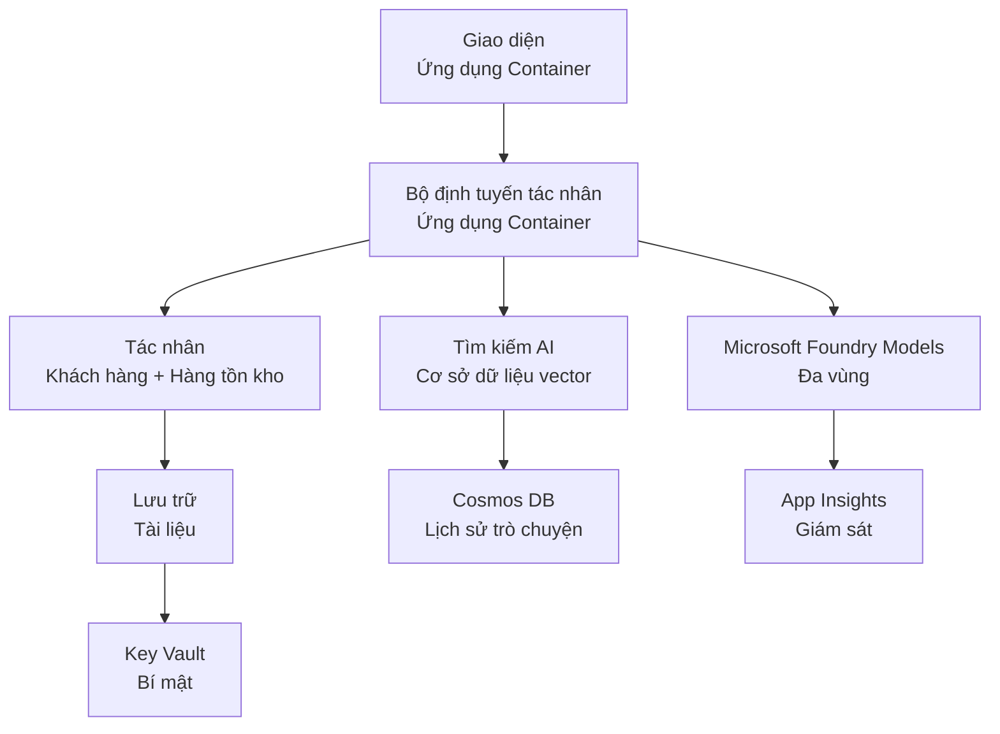

# Retail Multi-Agent Solution - Infrastructure Template

**Chapter 5: Production Deployment Package**
- **📚 Course Home**: [AZD For Beginners](../../README.md)
- **📖 Related Chapter**: [Chương 5: Giải pháp AI Đa tác nhân](../../README.md#-chapter-5-multi-agent-ai-solutions-advanced)
- **📝 Scenario Guide**: [Complete Architecture](../retail-scenario.md)
- **🎯 Quick Deploy**: [Triển khai một lần nhấp](#-quick-deployment)

> **⚠️ CHỈ LÀ MẪU HẠ TẦNG**  
> Mẫu ARM này triển khai **các tài nguyên Azure** cho một hệ thống đa tác nhân.  
>  
> **Những gì được triển khai (15-25 phút):**
> - ✅ Microsoft Foundry Models (gpt-4.1, gpt-4.1-mini, embeddings across 3 regions)
> - ✅ Dịch vụ AI Search (rỗng, sẵn sàng để tạo index)
> - ✅ Container Apps (hình ảnh giữ chỗ, sẵn sàng cho mã của bạn)
> - ✅ Storage, Cosmos DB, Key Vault, Application Insights
>  
> **Những gì KHÔNG bao gồm (cần phát triển thêm):**
> - ❌ Mã triển khai agent (Customer Agent, Inventory Agent)
> - ❌ Logic định tuyến và các endpoint API
> - ❌ Giao diện chat frontend
> - ❌ Schema index tìm kiếm và các pipelines dữ liệu
> - ❌ **Ước tính công sức phát triển: 80-120 giờ**
>  
> **Sử dụng mẫu này nếu:**
> - ✅ Bạn muốn cấp phát hạ tầng Azure cho một dự án đa tác nhân
> - ✅ Bạn dự định phát triển mã agent riêng biệt
> - ✅ Bạn cần một baseline hạ tầng sẵn sàng cho production
>  
> **Không dùng nếu:**
> - ❌ Bạn mong đợi một demo đa tác nhân hoạt động ngay lập tức
> - ❌ Bạn đang tìm ví dụ mã ứng dụng hoàn chỉnh

## Overview

Thư mục này chứa một mẫu Azure Resource Manager (ARM) toàn diện để triển khai **nền tảng hạ tầng** cho hệ thống hỗ trợ khách hàng đa tác nhân. Mẫu sẽ cấp phát tất cả dịch vụ Azure cần thiết, được cấu hình và kết nối đúng cách, sẵn sàng cho việc phát triển ứng dụng của bạn.

**Sau khi triển khai, bạn sẽ có:** Hạ tầng Azure sẵn cho production  
**Để hoàn thiện hệ thống, bạn cần:** Mã agent, UI frontend và cấu hình dữ liệu (xem [Architecture Guide](../retail-scenario.md))

## 🎯 Những gì được triển khai

### Core Infrastructure (Trạng thái sau khi triển khai)

✅ **Microsoft Foundry Models Services** (Sẵn sàng cho các cuộc gọi API)
  - Primary region: gpt-4.1 deployment (20K TPM capacity)
  - Secondary region: gpt-4.1-mini deployment (10K TPM capacity)
  - Tertiary region: Text embeddings model (30K TPM capacity)
  - Evaluation region: gpt-4.1 grader model (15K TPM capacity)
  - **Trạng thái:** Hoạt động đầy đủ - có thể gọi API ngay lập tức

✅ **Azure AI Search** (Rỗng - sẵn sàng để cấu hình)
  - Khả năng tìm kiếm vector được bật
  - Hạng mục Standard với 1 partition, 1 replica
  - **Trạng thái:** Dịch vụ đang chạy, nhưng cần tạo index
  - **Hành động cần thiết:** Tạo search index với schema của bạn

✅ **Azure Storage Account** (Rỗng - sẵn sàng để tải lên)
  - Blob containers: `documents`, `uploads`
  - Cấu hình bảo mật (chỉ HTTPS, không truy cập công khai)
  - **Trạng thái:** Sẵn sàng nhận file
  - **Hành động cần thiết:** Tải dữ liệu sản phẩm và tài liệu của bạn lên

⚠️ **Container Apps Environment** (Hình ảnh giữ chỗ đã được triển khai)
  - Agent router app (nginx default image)
  - Frontend app (nginx default image)
  - Auto-scaling được cấu hình (0-10 instances)
  - **Trạng thái:** Chạy các container giữ chỗ
  - **Hành động cần thiết:** Xây dựng và triển khai ứng dụng agent của bạn

✅ **Azure Cosmos DB** (Rỗng - sẵn sàng cho dữ liệu)
  - Database và container đã được cấu hình trước
  - Tối ưu cho thao tác độ trễ thấp
  - TTL được bật để dọn dẹp tự động
  - **Trạng thái:** Sẵn sàng lưu lịch sử chat

✅ **Azure Key Vault** (Tùy chọn - sẵn sàng cho secrets)
  - Soft delete được bật
  - RBAC được cấu hình cho managed identities
  - **Trạng thái:** Sẵn sàng lưu API keys và connection strings

✅ **Application Insights** (Tùy chọn - giám sát đang hoạt động)
  - Kết nối tới Log Analytics workspace
  - Metrics tùy chỉnh và cảnh báo đã được cấu hình
  - **Trạng thái:** Sẵn sàng nhận telemetry từ ứng dụng của bạn

✅ **Document Intelligence** (Sẵn sàng cho các cuộc gọi API)
  - Hạng mục S0 cho workloads production
  - **Trạng thái:** Sẵn sàng xử lý tài liệu đã tải lên

✅ **Bing Search API** (Sẵn sàng cho các cuộc gọi API)
  - Hạng mục S1 cho tìm kiếm real-time
  - **Trạng thái:** Sẵn sàng cho truy vấn web

### Deployment Modes

| Mode | OpenAI Capacity | Container Instances | Search Tier | Storage Redundancy | Best For |
|------|-----------------|---------------------|-------------|-------------------|----------|
| **Minimal** | 10K-20K TPM | 0-2 replicas | Basic | LRS (Local) | Dev/test, learning, proof-of-concept |
| **Standard** | 30K-60K TPM | 2-5 replicas | Standard | ZRS (Zone) | Production, moderate traffic (<10K users) |
| **Premium** | 80K-150K TPM | 5-10 replicas, zone-redundant | Premium | GRS (Geo) | Enterprise, high traffic (>10K users), 99.99% SLA |

**Tác động chi phí:**
- **Minimal → Standard:** ~tăng 4x chi phí ($100-370/tháng → $420-1,450/tháng)
- **Standard → Premium:** ~tăng 3x chi phí ($420-1,450/tháng → $1,150-3,500/tháng)
- **Chọn dựa trên:** Tải dự kiến, yêu cầu SLA, giới hạn ngân sách

**Kế hoạch công suất:**
- **TPM (Tokens Per Minute):** Tổng trên tất cả các deployment model
- **Container Instances:** Phạm vi auto-scaling (số replicas min-max)
- **Search Tier:** Ảnh hưởng đến hiệu năng truy vấn và giới hạn kích thước index

## 📋 Yêu cầu trước khi triển khai

### Công cụ cần có
1. **Azure CLI** (phiên bản 2.50.0 trở lên)
   ```bash
   az --version  # Kiểm tra phiên bản
   az login      # Xác thực
   ```

2. **Active Azure subscription** với quyền Owner hoặc Contributor
   ```bash
   az account show  # Xác minh đăng ký
   ```

### Hạn mức Azure cần thiết

Trước khi triển khai, xác minh hạn mức đủ trong các vùng mục tiêu của bạn:

```bash
# Kiểm tra khả dụng của các mô hình Microsoft Foundry trong khu vực của bạn
az cognitiveservices account list-skus \
  --kind OpenAI \
  --location eastus2

# Xác minh hạn mức OpenAI (ví dụ cho gpt-4.1)
az cognitiveservices usage list \
  --location eastus2 \
  --query "[?name.value=='OpenAI.Standard.gpt-4.1']"

# Kiểm tra hạn mức của Container Apps
az provider show \
  --namespace Microsoft.App \
  --query "resourceTypes[?resourceType=='managedEnvironments'].locations"
```

**Hạn mức tối thiểu cần thiết:**
- **Microsoft Foundry Models:** 3-4 deployment model across regions
  - gpt-4.1: 20K TPM (Tokens Per Minute)
  - gpt-4.1-mini: 10K TPM
  - text-embedding-ada-002: 30K TPM
  - **Lưu ý:** gpt-4.1 có thể có danh sách chờ ở một số vùng - kiểm tra [model availability](https://learn.microsoft.com/azure/ai-services/openai/concepts/models)
- **Container Apps:** Managed environment + 2-10 container instances
- **AI Search:** Hạng mục Standard (Basic không đủ cho vector search)
- **Cosmos DB:** Throughput provisioned Standard

**Nếu hạn mức không đủ:**
1. Truy cập Azure Portal → Quotas → Request increase
2. Hoặc dùng Azure CLI:
   ```bash
   az support tickets create \
     --ticket-name "OpenAI-Quota-Increase" \
     --severity "minimal" \
     --description "Request quota increase for Microsoft Foundry Models gpt-4.1 in eastus2"
   ```
3. Xem xét các vùng thay thế có khả năng sẵn có

## 🚀 Triển khai nhanh

### Tùy chọn 1: Sử dụng Azure CLI

```bash
# Sao chép hoặc tải xuống các tệp mẫu
git clone <repository-url>
cd examples/retail-multiagent-arm-template

# Làm cho script triển khai có thể thực thi
chmod +x deploy.sh

# Triển khai với cài đặt mặc định
./deploy.sh -g myResourceGroup

# Triển khai cho môi trường sản xuất với các tính năng cao cấp
./deploy.sh -g myProdRG -e prod -m premium -l eastus2
```

### Tùy chọn 2: Sử dụng Azure Portal

[](https://portal.azure.com/#create/Microsoft.Template/uri/https%3A%2F%2Fraw.githubusercontent.com%2Fmicrosoft%2Fazd-for-beginners%2Fmain%2Fexamples%2Fretail-multiagent-arm-template%2Fazuredeploy.json)

### Tùy chọn 3: Sử dụng Azure CLI trực tiếp

```bash
# Tạo nhóm tài nguyên
az group create --name myResourceGroup --location eastus2

# Triển khai mẫu
az deployment group create \
  --resource-group myResourceGroup \
  --template-file azuredeploy.json \
  --parameters azuredeploy.parameters.json
```

## ⏱️ Thời gian triển khai

### Những gì cần mong đợi

| Phase | Duration | What Happens |
|-------|----------|--------------||
| **Template Validation** | 30-60 seconds | Azure validates ARM template syntax and parameters |
| **Resource Group Setup** | 10-20 seconds | Creates resource group (if needed) |
| **OpenAI Provisioning** | 5-8 minutes | Creates 3-4 OpenAI accounts and deploys models |
| **Container Apps** | 3-5 minutes | Creates environment and deploys placeholder containers |
| **Search & Storage** | 2-4 minutes | Provisions AI Search service and storage accounts |
| **Cosmos DB** | 2-3 minutes | Creates database and configures containers |
| **Monitoring Setup** | 2-3 minutes | Sets up Application Insights and Log Analytics |
| **RBAC Configuration** | 1-2 minutes | Configures managed identities and permissions |
| **Total Deployment** | **15-25 minutes** | Complete infrastructure ready |

**Sau khi triển khai:**
- ✅ **Hạ tầng sẵn sàng:** Tất cả dịch vụ Azure đã được cấp phát và đang chạy
- ⏱️ **Phát triển ứng dụng:** 80-120 giờ (trách nhiệm của bạn)
- ⏱️ **Cấu hình Index:** 15-30 phút (yêu cầu schema của bạn)
- ⏱️ **Tải dữ liệu:** Tùy thuộc kích thước dataset
- ⏱️ **Kiểm thử & xác nhận:** 2-4 giờ

---

## ✅ Xác minh triển khai thành công

### Bước 1: Kiểm tra việc cấp phát tài nguyên (2 phút)

```bash
# Xác minh tất cả tài nguyên đã được triển khai thành công
az resource list \
  --resource-group myResourceGroup \
  --query "[?provisioningState!='Succeeded'].{Name:name, Status:provisioningState, Type:type}" \
  --output table
```

**Mong đợi:** Bảng rỗng (tất cả resources hiển thị trạng thái "Succeeded")

### Bước 2: Xác minh Microsoft Foundry Models Deployments (3 phút)

```bash
# Liệt kê tất cả các tài khoản OpenAI
az cognitiveservices account list \
  --resource-group myResourceGroup \
  --query "[?kind=='OpenAI'].{Name:name, Location:location, Status:properties.provisioningState}" \
  --output table

# Kiểm tra việc triển khai mô hình cho vùng chính
OPENAI_NAME=$(az cognitiveservices account list \
  --resource-group myResourceGroup \
  --query "[?kind=='OpenAI'] | [0].name" -o tsv)

az cognitiveservices account deployment list \
  --name $OPENAI_NAME \
  --resource-group myResourceGroup \
  --output table
```

**Mong đợi:** 
- 3-4 OpenAI accounts (primary, secondary, tertiary, evaluation regions)
- 1-2 model deployments cho mỗi account (gpt-4.1, gpt-4.1-mini, text-embedding-ada-002)

### Bước 3: Kiểm tra các endpoint hạ tầng (5 phút)

```bash
# Lấy các URL của Container App
az containerapp list \
  --resource-group myResourceGroup \
  --query "[].{Name:name, URL:properties.configuration.ingress.fqdn, Status:properties.runningStatus}" \
  --output table

# Kiểm tra endpoint của router (sẽ trả về hình ảnh giữ chỗ)
ROUTER_URL=$(az containerapp show \
  --name retail-router \
  --resource-group myResourceGroup \
  --query "properties.configuration.ingress.fqdn" -o tsv)

echo "Testing: https://$ROUTER_URL"
curl -I https://$ROUTER_URL || echo "Container running (placeholder image - expected)"
```

**Mong đợi:** 
- Container Apps hiển thị trạng thái "Running"
- Nginx giữ chỗ trả về HTTP 200 hoặc 404 (chưa có mã ứng dụng)

### Bước 4: Xác minh truy cập API Microsoft Foundry Models (3 phút)

```bash
# Lấy endpoint và khóa OpenAI
OPENAI_ENDPOINT=$(az cognitiveservices account show \
  --name $OPENAI_NAME \
  --resource-group myResourceGroup \
  --query "properties.endpoint" -o tsv)

OPENAI_KEY=$(az cognitiveservices account keys list \
  --name $OPENAI_NAME \
  --resource-group myResourceGroup \
  --query "key1" -o tsv)

# Kiểm tra triển khai gpt-4.1
curl "${OPENAI_ENDPOINT}openai/deployments/gpt-4.1/chat/completions?api-version=2024-08-01-preview" \
  -H "Content-Type: application/json" \
  -H "api-key: $OPENAI_KEY" \
  -d '{
    "messages": [{"role": "user", "content": "Say hello"}],
    "max_tokens": 10
  }'
```

**Mong đợi:** Phản hồi JSON với chat completion (xác nhận OpenAI hoạt động)

### Cái gì đang hoạt động vs. cái gì chưa

**✅ Hoạt động sau khi triển khai:**
- Microsoft Foundry Models đã được triển khai và chấp nhận các cuộc gọi API
- Dịch vụ AI Search đang chạy (rỗng, chưa có index)
- Container Apps đang chạy (hình ảnh nginx giữ chỗ)
- Storage accounts có thể truy cập và sẵn sàng cho upload
- Cosmos DB sẵn sàng cho thao tác dữ liệu
- Application Insights thu thập telemetry hạ tầng
- Key Vault sẵn sàng lưu secrets

**❌ Chưa hoạt động (Cần phát triển):**
- Các endpoint của agent (chưa có mã ứng dụng triển khai)
- Chức năng chat (cần frontend + backend triển khai)
- Truy vấn tìm kiếm (chưa tạo search index)
- Pipeline xử lý tài liệu (chưa có dữ liệu được tải lên)
- Telemetry tùy chỉnh (cần instrumentation trong ứng dụng)

**Bước tiếp theo:** Xem [Cấu hình sau triển khai](#-post-deployment-next-steps) để phát triển và triển khai ứng dụng của bạn

---

## ⚙️ Các tùy chọn cấu hình

### Tham số mẫu

| Parameter | Type | Default | Description |
|-----------|------|---------|-------------|
| `projectName` | string | "retail" | Prefix cho tất cả tên tài nguyên |
| `location` | string | Resource group location | Vùng triển khai chính |
| `secondaryLocation` | string | "westus2" | Vùng phụ cho triển khai đa vùng |
| `tertiaryLocation` | string | "francecentral" | Vùng cho model embeddings |
| `environmentName` | string | "dev" | Tên môi trường (dev/staging/prod) |
| `deploymentMode` | string | "standard" | Cấu hình triển khai (minimal/standard/premium) |
| `enableMultiRegion` | bool | true | Bật triển khai đa vùng |
| `enableMonitoring` | bool | true | Bật Application Insights và logging |
| `enableSecurity` | bool | true | Bật Key Vault và bảo mật nâng cao |

### Tùy chỉnh tham số

Chỉnh sửa `azuredeploy.parameters.json`:

```json
{
  "$schema": "https://schema.management.azure.com/schemas/2019-04-01/deploymentParameters.json#",
  "contentVersion": "1.0.0.0",
  "parameters": {
    "projectName": {
      "value": "mycompany"
    },
    "environmentName": {
      "value": "prod"
    },
    "deploymentMode": {
      "value": "premium"
    },
    "location": {
      "value": "eastus2"
    }
  }
}
```

## 🏗️ Tổng quan kiến trúc


## 📖 Sử dụng script triển khai

Script `deploy.sh` cung cấp trải nghiệm triển khai tương tác:

```bash
# Hiển thị trợ giúp
./deploy.sh --help

# Triển khai cơ bản
./deploy.sh -g myResourceGroup

# Triển khai nâng cao với cài đặt tùy chỉnh
./deploy.sh \
  -g myProductionRG \
  -p companyname \
  -e prod \
  -m premium \
  -l eastus2

# Triển khai phát triển không đa vùng
./deploy.sh \
  -g myDevRG \
  -e dev \
  -m minimal \
  --no-multi-region \
  --no-security
```

### Tính năng của script

- ✅ **Kiểm tra yêu cầu trước** (Azure CLI, trạng thái đăng nhập, các file template)
- ✅ **Quản lý resource group** (tạo nếu chưa tồn tại)
- ✅ **Xác thực template** trước khi triển khai
- ✅ **Theo dõi tiến trình** với đầu ra có màu
- ✅ **Hiển thị outputs của deployment**
- ✅ **Hướng dẫn sau triển khai**

## 📊 Giám sát triển khai

### Kiểm tra trạng thái triển khai

```bash
# Liệt kê các bản triển khai
az deployment group list --resource-group myResourceGroup --output table

# Lấy chi tiết bản triển khai
az deployment group show \
  --resource-group myResourceGroup \
  --name retail-deployment-YYYYMMDD-HHMMSS

# Theo dõi tiến độ triển khai
az deployment group create \
  --resource-group myResourceGroup \
  --template-file azuredeploy.json \
  --parameters azuredeploy.parameters.json \
  --verbose
```

### Outputs của triển khai

Sau khi triển khai thành công, các outputs sau có sẵn:

- **Frontend URL**: Endpoint công khai cho giao diện web
- **Router URL**: Endpoint API cho agent router
- **OpenAI Endpoints**: Endpoint dịch vụ OpenAI chính và phụ
- **Search Service**: Endpoint dịch vụ Azure AI Search
- **Storage Account**: Tên storage account cho tài liệu
- **Key Vault**: Tên Key Vault (nếu bật)
- **Application Insights**: Tên dịch vụ giám sát (nếu bật)

## 🔧 Sau triển khai: Bước tiếp theo
> **📝 Quan trọng:** Hạ tầng đã được triển khai, nhưng bạn cần phát triển và triển khai mã ứng dụng.

### Giai đoạn 1: Phát triển Ứng dụng Agent (Trách nhiệm của bạn)

Mẫu ARM tạo ra **Container Apps trống** với hình ảnh nginx giữ chỗ. Bạn phải:

**Yêu cầu Phát triển:**
1. **Triển khai Agent** (30-40 giờ)
   - Agent dịch vụ khách hàng tích hợp gpt-4.1
   - Agent quản lý tồn kho tích hợp gpt-4.1-mini
   - Logic định tuyến agent

2. **Phát triển Frontend** (20-30 giờ)
   - Giao diện chat UI (React/Vue/Angular)
   - Chức năng tải lên tệp
   - Hiển thị và định dạng phản hồi

3. **Dịch vụ Backend** (12-16 giờ)
   - FastAPI hoặc Express router
   - Middleware xác thực
   - Tích hợp telemetry

**Xem:** [Hướng dẫn Kiến trúc](../retail-scenario.md) cho các mẫu triển khai chi tiết và ví dụ mã

### Giai đoạn 2: Cấu hình Chỉ mục Tìm kiếm AI (15-30 phút)

Tạo một chỉ mục tìm kiếm phù hợp với mô hình dữ liệu của bạn:

```bash
# Lấy chi tiết dịch vụ tìm kiếm
SEARCH_NAME=$(az search service list \
  --resource-group myResourceGroup \
  --query "[0].name" -o tsv)

SEARCH_KEY=$(az search admin-key show \
  --service-name $SEARCH_NAME \
  --resource-group myResourceGroup \
  --query "primaryKey" -o tsv)

# Tạo chỉ mục với sơ đồ của bạn (ví dụ)
curl -X POST "https://${SEARCH_NAME}.search.windows.net/indexes?api-version=2023-11-01" \
  -H "Content-Type: application/json" \
  -H "api-key: ${SEARCH_KEY}" \
  -d '{
    "name": "products",
    "fields": [
      {"name": "id", "type": "Edm.String", "key": true},
      {"name": "title", "type": "Edm.String", "searchable": true},
      {"name": "content", "type": "Edm.String", "searchable": true},
      {"name": "category", "type": "Edm.String", "filterable": true},
      {"name": "content_vector", "type": "Collection(Edm.Single)", 
       "searchable": true, "dimensions": 1536, "vectorSearchProfile": "default"}
    ],
    "vectorSearch": {
      "algorithms": [{"name": "default", "kind": "hnsw"}],
      "profiles": [{"name": "default", "algorithm": "default"}]
    }
  }'
```

**Tài nguyên:**
- [Thiết kế Lược đồ Chỉ mục Tìm kiếm AI](https://learn.microsoft.com/azure/search/search-what-is-an-index)
- [Cấu hình Tìm kiếm Vector](https://learn.microsoft.com/azure/search/vector-search-how-to-create-index)

### Giai đoạn 3: Tải Dữ liệu của Bạn Lên (Thời gian thay đổi)

Khi bạn có dữ liệu sản phẩm và tài liệu:

```bash
# Lấy thông tin chi tiết tài khoản lưu trữ
STORAGE_NAME=$(az storage account list \
  --resource-group myResourceGroup \
  --query "[0].name" -o tsv)

STORAGE_KEY=$(az storage account keys list \
  --account-name $STORAGE_NAME \
  --resource-group myResourceGroup \
  --query "[0].value" -o tsv)

# Tải lên tài liệu của bạn
az storage blob upload-batch \
  --destination documents \
  --source /path/to/your/product/docs \
  --account-name $STORAGE_NAME \
  --account-key $STORAGE_KEY

# Ví dụ: Tải lên một tệp duy nhất
az storage blob upload \
  --container-name documents \
  --name "product-manual.pdf" \
  --file /path/to/product-manual.pdf \
  --account-name $STORAGE_NAME \
  --account-key $STORAGE_KEY
```

### Giai đoạn 4: Xây dựng và Triển khai Ứng dụng của Bạn (8-12 giờ)

Khi bạn đã phát triển mã agent của mình:

```bash
# 1. Tạo Azure Container Registry (nếu cần)
az acr create \
  --name myregistry \
  --resource-group myResourceGroup \
  --sku Basic

# 2. Xây dựng và đẩy image cho agent router
docker build -t myregistry.azurecr.io/agent-router:v1 /path/to/your/router/code
az acr login --name myregistry
docker push myregistry.azurecr.io/agent-router:v1

# 3. Xây dựng và đẩy image cho frontend
docker build -t myregistry.azurecr.io/frontend:v1 /path/to/your/frontend/code
docker push myregistry.azurecr.io/frontend:v1

# 4. Cập nhật Container Apps bằng các image của bạn
az containerapp update \
  --name retail-router \
  --resource-group myResourceGroup \
  --image myregistry.azurecr.io/agent-router:v1

az containerapp update \
  --name retail-frontend \
  --resource-group myResourceGroup \
  --image myregistry.azurecr.io/frontend:v1

# 5. Cấu hình biến môi trường
az containerapp update \
  --name retail-router \
  --resource-group myResourceGroup \
  --set-env-vars \
    OPENAI_ENDPOINT=secretref:openai-endpoint \
    OPENAI_KEY=secretref:openai-key \
    SEARCH_ENDPOINT=secretref:search-endpoint \
    SEARCH_KEY=secretref:search-key
```

### Giai đoạn 5: Kiểm thử Ứng dụng của Bạn (2-4 giờ)

```bash
# Lấy URL ứng dụng của bạn
ROUTER_URL=$(az containerapp show \
  --name retail-router \
  --resource-group myResourceGroup \
  --query "properties.configuration.ingress.fqdn" -o tsv)

# Kiểm tra điểm cuối của agent (sau khi mã của bạn được triển khai)
curl -X POST "https://${ROUTER_URL}/chat" \
  -H "Content-Type: application/json" \
  -d '{
    "message": "Hello, I need help with my order",
    "agent": "customer"
  }'

# Kiểm tra nhật ký ứng dụng
az containerapp logs show \
  --name retail-router \
  --resource-group myResourceGroup \
  --follow
```

### Tài nguyên Triển khai

**Kiến trúc & Thiết kế:**
- 📖 [Hướng dẫn Kiến trúc Đầy đủ](../retail-scenario.md) - Mẫu triển khai chi tiết
- 📖 [Mẫu Thiết kế Đa-Agent](https://learn.microsoft.com/azure/architecture/ai-ml/guide/multi-agent-systems)

**Ví dụ Mã:**
- 🔗 [Microsoft Foundry Models Chat Sample](https://github.com/Azure-Samples/azure-search-openai-demo) - mẫu RAG
- 🔗 [Semantic Kernel](https://github.com/microsoft/semantic-kernel) - Khung agent (C#)
- 🔗 [LangChain Azure](https://github.com/langchain-ai/langchain) - Điều phối agent (Python)
- 🔗 [AutoGen](https://github.com/microsoft/autogen) - Đàm thoại đa-agent

**Ước tính Tổng Nỗ lực:**
- Triển khai hạ tầng: 15-25 phút (✅ Hoàn thành)
- Phát triển ứng dụng: 80-120 giờ (🔨 Công việc của bạn)
- Kiểm thử và tối ưu: 15-25 giờ (🔨 Công việc của bạn)

## 🛠️ Khắc phục sự cố

### Các vấn đề thường gặp

#### 1. Microsoft Foundry Models Quota Exceeded

```bash
# Kiểm tra mức sử dụng hạn ngạch hiện tại
az cognitiveservices usage list --location eastus2

# Yêu cầu tăng hạn ngạch
az support tickets create \
  --ticket-name "OpenAI-Quota-Increase" \
  --severity "minimal" \
  --description "Request quota increase for Microsoft Foundry Models in region X"
```

#### 2. Triển khai Container Apps thất bại

```bash
# Kiểm tra nhật ký ứng dụng container
az containerapp logs show \
  --name retail-router \
  --resource-group myResourceGroup \
  --follow

# Khởi động lại ứng dụng container
az containerapp revision restart \
  --name retail-router \
  --resource-group myResourceGroup
```

#### 3. Khởi tạo Dịch vụ Tìm kiếm

```bash
# Xác minh trạng thái dịch vụ tìm kiếm
az search service show \
  --name <search-service-name> \
  --resource-group myResourceGroup

# Kiểm tra kết nối tới dịch vụ tìm kiếm
curl -X GET "https://<search-service-name>.search.windows.net/indexes?api-version=2023-11-01" \
  -H "api-key: <search-admin-key>"
```

### Xác thực Triển khai

```bash
# Xác nhận tất cả các tài nguyên đã được tạo
az resource list \
  --resource-group myResourceGroup \
  --output table

# Kiểm tra tình trạng tài nguyên
az resource list \
  --resource-group myResourceGroup \
  --query "[?provisioningState!='Succeeded'].{Name:name, Status:provisioningState, Type:type}" \
  --output table
```

## 🔐 Cân nhắc Bảo mật

### Quản lý Khóa
- Tất cả bí mật được lưu trữ trong Azure Key Vault (khi được bật)
- Container app sử dụng managed identity để xác thực
- Tài khoản lưu trữ có cấu hình mặc định an toàn (chỉ HTTPS, không truy cập blob công khai)

### Bảo mật Mạng
- Container app sử dụng mạng nội bộ khi có thể
- Dịch vụ tìm kiếm được cấu hình với tùy chọn private endpoints
- Cosmos DB được cấu hình với quyền tối thiểu cần thiết

### Cấu hình RBAC
```bash
# Gán các vai trò cần thiết cho định danh được quản lý
az role assignment create \
  --assignee <container-app-managed-identity> \
  --role "Cognitive Services OpenAI User" \
  --scope <openai-resource-id>
```

## 💰 Tối ưu Chi phí

### Ước tính Chi phí (Hàng tháng, USD)

| Mode | OpenAI | Container Apps | Search | Storage | Total Est. |
|------|--------|----------------|--------|---------|------------|
| Minimal | $50-200 | $20-50 | $25-100 | $5-20 | $100-370 |
| Standard | $200-800 | $100-300 | $100-300 | $20-50 | $420-1450 |
| Premium | $500-2000 | $300-800 | $300-600 | $50-100 | $1150-3500 |

### Giám sát Chi phí

```bash
# Thiết lập cảnh báo ngân sách
az consumption budget create \
  --account-name <subscription-id> \
  --budget-name "retail-budget" \
  --amount 500 \
  --time-grain Monthly \
  --start-date 2024-01-01 \
  --end-date 2024-12-31
```

## 🔄 Cập nhật và Bảo trì

### Cập nhật Mẫu
- Quản lý phiên bản các tệp mẫu ARM
- Kiểm tra thay đổi trong môi trường phát triển trước
- Sử dụng chế độ triển khai tăng dần cho các cập nhật

### Cập nhật Tài nguyên
```bash
# Cập nhật với các tham số mới
az deployment group create \
  --resource-group myResourceGroup \
  --template-file azuredeploy.json \
  --parameters azuredeploy.parameters.json \
  --mode Incremental
```

### Sao lưu và Khôi phục
- Sao lưu tự động Cosmos DB được bật
- Tính năng soft delete của Key Vault được bật
- Các phiên bản Container app được giữ để khôi phục

## 📞 Hỗ trợ

- **Vấn đề với Mẫu**: [GitHub Issues](https://github.com/microsoft/azd-for-beginners/issues)
- **Hỗ trợ Azure**: [Azure Support Portal](https://portal.azure.com/#blade/Microsoft_Azure_Support/HelpAndSupportBlade)
- **Cộng đồng**: [Azure AI Discord](https://discord.gg/microsoft-azure)

---

**⚡ Sẵn sàng triển khai giải pháp đa-agent của bạn?**

Bắt đầu với: `./deploy.sh -g myResourceGroup`

---

<!-- CO-OP TRANSLATOR DISCLAIMER START -->
**Miễn trừ trách nhiệm**:
Tài liệu này đã được dịch bằng dịch vụ dịch thuật AI [Co-op Translator](https://github.com/Azure/co-op-translator). Mặc dù chúng tôi nỗ lực để đạt độ chính xác, xin lưu ý rằng các bản dịch tự động có thể chứa lỗi hoặc không chính xác. Văn bản gốc bằng ngôn ngữ gốc của nó nên được coi là nguồn có thẩm quyền. Đối với thông tin quan trọng, khuyến nghị sử dụng dịch vụ dịch thuật chuyên nghiệp do con người thực hiện. Chúng tôi không chịu trách nhiệm cho bất kỳ hiểu lầm hoặc diễn giải sai nào phát sinh từ việc sử dụng bản dịch này.
<!-- CO-OP TRANSLATOR DISCLAIMER END -->