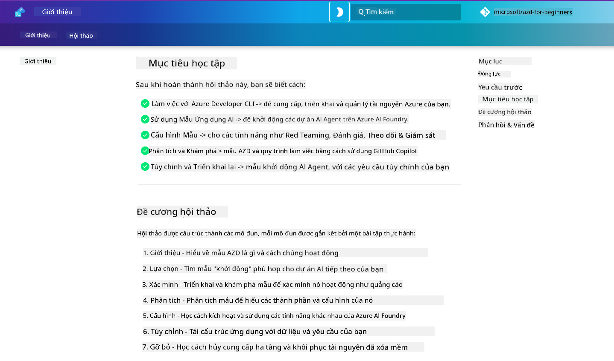

<!--
CO_OP_TRANSLATOR_METADATA:
{
  "original_hash": "9cc966416ab431c38b2ab863884b196c",
  "translation_date": "2025-09-24T23:18:06+00:00",
  "source_file": "workshop/README.md",
  "language_code": "vi"
}
-->
# AZD cho Hội thảo Nhà phát triển AI

Chào mừng bạn đến với hội thảo thực hành học Azure Developer CLI (AZD) với trọng tâm triển khai ứng dụng AI. Hội thảo này giúp bạn hiểu rõ cách sử dụng các mẫu AZD qua 3 bước:

1. **Khám phá** - tìm mẫu phù hợp với bạn.
1. **Triển khai** - triển khai và xác nhận rằng nó hoạt động.
1. **Tùy chỉnh** - chỉnh sửa và lặp lại để làm cho nó phù hợp với bạn!

Trong suốt hội thảo này, bạn cũng sẽ được giới thiệu các công cụ và quy trình làm việc cốt lõi dành cho nhà phát triển, giúp bạn tối ưu hóa hành trình phát triển từ đầu đến cuối.

<br/>

## Hướng dẫn trên trình duyệt

Các bài học trong hội thảo được viết bằng Markdown. Bạn có thể truy cập trực tiếp trên GitHub - hoặc mở bản xem trước trên trình duyệt như hình dưới đây.



Để sử dụng tùy chọn này - fork repository vào hồ sơ của bạn và mở GitHub Codespaces. Khi terminal của VS Code hoạt động, nhập lệnh sau:

```bash title="" linenums="0"
mkdocs serve > /dev/null 2>&1 &
```

Trong vài giây, bạn sẽ thấy một hộp thoại bật lên. Chọn tùy chọn `Open in browser`. Hướng dẫn trên web sẽ mở ra trong một tab trình duyệt mới. Một số lợi ích của bản xem trước này:

1. **Tìm kiếm tích hợp** - tìm từ khóa hoặc bài học nhanh chóng.
1. **Biểu tượng sao chép** - di chuột qua các khối mã để thấy tùy chọn này.
1. **Chuyển đổi chủ đề** - chuyển đổi giữa chủ đề tối và sáng.
1. **Nhận trợ giúp** - nhấp vào biểu tượng Discord ở chân trang để tham gia!

<br/>

## Tổng quan về hội thảo

**Thời lượng:** 3-4 giờ  
**Cấp độ:** Người mới bắt đầu đến trung cấp  
**Yêu cầu:** Hiểu biết cơ bản về Azure, các khái niệm AI, VS Code & công cụ dòng lệnh.

Đây là một hội thảo thực hành, nơi bạn học bằng cách làm. Sau khi hoàn thành các bài tập, chúng tôi khuyến nghị bạn xem lại chương trình AZD For Beginners để tiếp tục hành trình học tập về các thực hành tốt nhất trong bảo mật và năng suất.

| Thời gian | Module  | Mục tiêu |
|:---|:---|:---|
| 15 phút | [Giới thiệu](docs/instructions/0-Introduction.md) | Đặt nền tảng, hiểu mục tiêu |
| 30 phút | [Chọn mẫu AI](docs/instructions/1-Select-AI-Template.md) | Khám phá tùy chọn và chọn mẫu khởi đầu | 
| 30 phút | [Xác nhận mẫu AI](docs/instructions/2-Validate-AI-Template.md) | Triển khai giải pháp mặc định lên Azure |
| 30 phút | [Phân tích mẫu AI](docs/instructions/3-Deconstruct-AI-Template.md) | Khám phá cấu trúc và cấu hình |
| 30 phút | [Cấu hình mẫu AI](docs/instructions/4-Configure-AI-Template.md) | Kích hoạt và thử các tính năng có sẵn |
| 30 phút | [Tùy chỉnh mẫu AI](docs/instructions/5-Customize-AI-Template.md) | Điều chỉnh mẫu theo nhu cầu của bạn |
| 30 phút | [Gỡ bỏ hạ tầng](docs/instructions/6-Teardown-Infrastructure.md) | Dọn dẹp và giải phóng tài nguyên |
| 15 phút | [Kết thúc & Bước tiếp theo](docs/instructions/7-Wrap-up.md) | Tài nguyên học tập, thử thách hội thảo |

<br/>

## Những gì bạn sẽ học

Hãy xem mẫu AZD như một hộp cát học tập để khám phá các khả năng và công cụ khác nhau cho phát triển từ đầu đến cuối trên Azure AI Foundry. Sau hội thảo này, bạn sẽ có cảm giác trực quan về các công cụ và khái niệm trong ngữ cảnh này.

| Khái niệm  | Mục tiêu |
|:---|:---|
| **Azure Developer CLI** | Hiểu các lệnh và quy trình làm việc của công cụ |
| **Mẫu AZD**| Hiểu cấu trúc dự án và cấu hình |
| **Azure AI Agent**| Cung cấp & triển khai dự án Azure AI Foundry |
| **Azure AI Search**| Kích hoạt kỹ thuật ngữ cảnh với các agent |
| **Khả năng quan sát**| Khám phá tracing, monitoring và đánh giá |
| **Red Teaming**| Khám phá kiểm tra đối kháng và các biện pháp giảm thiểu |

<br/>

## Cấu trúc hội thảo

Hội thảo được cấu trúc để dẫn bạn từ việc khám phá mẫu, đến triển khai, phân tích và tùy chỉnh - sử dụng mẫu khởi đầu chính thức [Getting Started with AI Agents](https://github.com/Azure-Samples/get-started-with-ai-agents) làm cơ sở.

### [Module 1: Chọn mẫu AI](docs/instructions/1-Select-AI-Template.md) (30 phút)

- Mẫu AI là gì?
- Tôi có thể tìm mẫu AI ở đâu?
- Làm thế nào để bắt đầu xây dựng AI Agents?
- **Lab**: Bắt đầu nhanh với GitHub Codespaces

### [Module 2: Xác nhận mẫu AI](docs/instructions/2-Validate-AI-Template.md) (30 phút)

- Kiến trúc mẫu AI là gì?
- Quy trình phát triển AZD là gì?
- Làm thế nào để nhận trợ giúp với phát triển AZD?
- **Lab**: Triển khai & Xác nhận mẫu AI Agents

### [Module 3: Phân tích mẫu AI](docs/instructions/3-Deconstruct-AI-Template.md) (30 phút)

- Khám phá môi trường của bạn trong `.azure/` 
- Khám phá thiết lập tài nguyên của bạn trong `infra/` 
- Khám phá cấu hình AZD của bạn trong `azure.yaml`s
- **Lab**: Chỉnh sửa biến môi trường & Triển khai lại

### [Module 4: Cấu hình mẫu AI](docs/instructions/4-Configure-AI-Template.md) (30 phút)
- Khám phá: Retrieval Augmented Generation
- Khám phá: Đánh giá Agent & Red Teaming
- Khám phá: Tracing & Monitoring
- **Lab**: Khám phá AI Agent + Khả năng quan sát 

### [Module 5: Tùy chỉnh mẫu AI](docs/instructions/5-Customize-AI-Template.md) (30 phút)
- Định nghĩa: PRD với yêu cầu kịch bản
- Cấu hình: Biến môi trường cho AZD
- Triển khai: Lifecycle Hooks cho các tác vụ bổ sung
- **Lab**: Tùy chỉnh mẫu cho kịch bản của tôi

### [Module 6: Gỡ bỏ hạ tầng](docs/instructions/6-Teardown-Infrastructure.md) (30 phút)
- Tóm tắt: Mẫu AZD là gì?
- Tóm tắt: Tại sao sử dụng Azure Developer CLI?
- Bước tiếp theo: Thử một mẫu khác!
- **Lab**: Gỡ bỏ hạ tầng & dọn dẹp

<br/>

## Thử thách hội thảo

Muốn thử thách bản thân để làm nhiều hơn? Dưới đây là một số gợi ý dự án - hoặc chia sẻ ý tưởng của bạn với chúng tôi!!

| Dự án | Mô tả |
|:---|:---|
|1. **Phân tích một mẫu AI phức tạp** | Sử dụng quy trình và công cụ chúng tôi đã trình bày và xem liệu bạn có thể triển khai, xác nhận và tùy chỉnh một mẫu giải pháp AI khác. _Bạn đã học được gì?_|
|2. **Tùy chỉnh với kịch bản của bạn**  | Thử viết PRD (Product Requirements Document) cho một kịch bản khác. Sau đó sử dụng GitHub Copilot trong repo mẫu của bạn ở chế độ Agent Model - và yêu cầu nó tạo quy trình tùy chỉnh cho bạn. _Bạn đã học được gì? Làm thế nào bạn có thể cải thiện các gợi ý này?_|
| | |

## Có phản hồi?

1. Đăng một issue trên repo này - gắn thẻ `Workshop` để tiện lợi.
1. Tham gia Discord của Azure AI Foundry - kết nối với đồng nghiệp của bạn!


| | | 
|:---|:---|
| **📚 Trang chủ khóa học**| [AZD For Beginners](../README.md)|
| **📖 Tài liệu** | [Bắt đầu với mẫu AI](https://learn.microsoft.com/en-us/azure/ai-foundry/how-to/develop/ai-template-get-started)|
| **🛠️Mẫu AI** | [Azure AI Foundry Templates](https://ai.azure.com/templates) |
|**🚀 Bước tiếp theo** | [Thử thách hội thảo](../../../workshop) |
| | |

<br/>

---

**Trước:** [Hướng dẫn khắc phục sự cố AI](../docs/troubleshooting/ai-troubleshooting.md) | **Tiếp theo:** Bắt đầu với [Lab 1: AZD Basics](../../../workshop/lab-1-azd-basics)

**Sẵn sàng bắt đầu xây dựng ứng dụng AI với AZD?**

[Bắt đầu Lab 1: AZD Foundations →](./lab-1-azd-basics/README.md)

---

