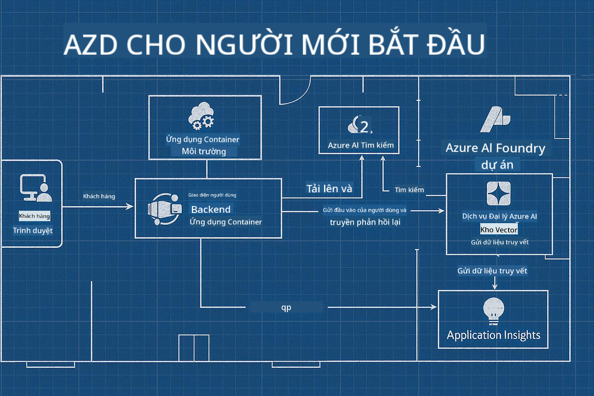

<!--
CO_OP_TRANSLATOR_METADATA:
{
  "original_hash": "245d24997bbcf2bae93bb2a503845d37",
  "translation_date": "2025-09-23T12:00:02+00:00",
  "source_file": "workshop/README.md",
  "language_code": "vi"
}
-->
# AZD cho Hội thảo Nhà Phát triển AI

## Mẫu AZD

Xây dựng một giải pháp ứng dụng AI cấp doanh nghiệp cho kịch bản cụ thể của bạn giống như việc xây dựng ngôi nhà của riêng bạn. Bạn có thể tự thiết kế, xây dựng từng viên gạch, và chịu trách nhiệm đảm bảo nó đáp ứng tất cả các hướng dẫn về quản trị và phát triển.

**HOẶC ....**

Bạn có thể làm việc với một kiến trúc sư, người có thể cung cấp cho bạn một _bản thiết kế_ cho ngôi nhà khởi đầu, sau đó làm việc với bạn để _tùy chỉnh_ nó phù hợp với nhu cầu của bạn. Điều này cho phép bạn tập trung vào những gì làm cho **ngôi nhà của bạn** đặc biệt, và để các chuyên gia lo liệu hệ thống dây điện, hệ thống nước và các phụ thuộc khác.

**Đây là cách tiếp cận của [AI App Templates](https://ai.azure.com/templates)** - một loạt các bản thiết kế để xây dựng các loại "ngôi nhà" ứng dụng AI khác nhau tùy thuộc vào nhu cầu và phụ thuộc cốt lõi của bạn.

## Tùy chỉnh Mẫu

Các mẫu được thiết kế để hoạt động với [Azure AI Foundry](https://ai.azure.com). Hãy nghĩ về nền tảng này như "nhà thầu xây dựng" của bạn với quyền truy cập vào tất cả các tài nguyên, công cụ và chuyên môn bạn cần để hoàn thành công việc!

Tất cả những gì bạn cần làm là chọn [mẫu khởi đầu của bạn](https://learn.microsoft.com/en-us/azure/ai-foundry/how-to/develop/ai-template-get-started). Ví dụ, chúng ta sẽ tập trung vào mẫu _Get Started with AI Agents_ để xây dựng cho bạn một "Ngôi nhà AI Đại lý" được trang bị các tính năng như AI Search, Red Teaming, Evaluations, Tracing, Monitoring và nhiều hơn nữa!



Tất cả những gì bạn cần là đặt lịch với kiến trúc sư để hướng dẫn bạn qua quá trình tùy chỉnh. [GitHub Copilot for Azure](https://learn.microsoft.com/en-us/azure/developer/github-copilot-azure/get-started) có thể là người hướng dẫn đó. Chỉ cần "trò chuyện với nó" để:

- Tìm hiểu về các tính năng Azure trong mẫu của bạn
- Triển khai tài nguyên Azure
- Nhận thông tin về triển khai của bạn
- Chẩn đoán và khắc phục sự cố!

Trong hội thảo này, chúng ta sẽ học cách _phân tích_ mẫu hiện có (để hiểu những gì nó cung cấp), sau đó _tùy chỉnh_ nó (để đáp ứng yêu cầu của chúng ta) - từng bước một.

Mẫu AI **giúp bạn thực hiện** - bằng cách hoàn thành hội thảo, bạn sẽ học cách **làm cho nó trở thành của bạn**

----

**Điều hướng Hội thảo**
- **📚 Trang chủ Khóa học**: [AZD Cho Người Mới Bắt Đầu](../README.md)
- **📖 Các Chương Liên Quan**: Bao gồm [Chương 1](../README.md#-chapter-1-foundation--quick-start), [Chương 2](../README.md#-chapter-2-ai-first-development-recommended-for-ai-developers), và [Chương 5](../README.md#-chapter-5-multi-agent-ai-solutions-advanced)
- **🛠️ Phòng Thực Hành**: [Phòng Thực Hành AI Workshop](../docs/ai-foundry/ai-workshop-lab.md)
- **🚀 Bước Tiếp Theo**: [Các Module Hội Thảo](../../../workshop)

Chào mừng bạn đến với hội thảo thực hành học Azure Developer CLI (AZD) với trọng tâm là triển khai ứng dụng AI. Hội thảo này được thiết kế để đưa bạn từ những kiến thức cơ bản về AZD đến triển khai các giải pháp AI sẵn sàng cho sản xuất.

## Tổng quan Hội thảo

**Thời lượng:** 2-3 giờ  
**Cấp độ:** Người mới bắt đầu đến Trung cấp  
**Yêu cầu trước:** Kiến thức cơ bản về Azure, công cụ dòng lệnh, và các khái niệm AI

### Những gì bạn sẽ học

- **Kiến thức cơ bản về AZD**: Hiểu về Hạ tầng dưới dạng Mã với AZD
- 🤖 **Tích hợp Dịch vụ AI**: Triển khai Azure OpenAI, AI Search, và các dịch vụ AI khác
- **Triển khai Container**: Sử dụng Azure Container Apps cho các ứng dụng AI
- **Thực hành Bảo mật**: Áp dụng Managed Identity và cấu hình bảo mật
- **Giám sát & Quan sát**: Thiết lập Application Insights cho khối lượng công việc AI
- **Mô hình Sản xuất**: Chiến lược triển khai sẵn sàng cho doanh nghiệp

## Cấu trúc Hội thảo

### Module 1: Nền tảng AZD (30 phút)
- Cài đặt và cấu hình AZD
- Hiểu cấu trúc dự án AZD
- Triển khai AZD đầu tiên của bạn
- **Phòng thực hành**: Triển khai một ứng dụng web đơn giản

### Module 2: Tích hợp Azure OpenAI (45 phút)
- Thiết lập tài nguyên Azure OpenAI
- Chiến lược triển khai mô hình
- Cấu hình truy cập API và xác thực
- **Phòng thực hành**: Triển khai ứng dụng chat với GPT-4

### Module 3: Ứng dụng RAG (45 phút)
- Tích hợp Azure AI Search
- Xử lý tài liệu với Azure Document Intelligence
- Vector embeddings và tìm kiếm ngữ nghĩa
- **Phòng thực hành**: Xây dựng hệ thống Q&A tài liệu

### Module 4: Triển khai Sản xuất (30 phút)
- Cấu hình Container Apps
- Tối ưu hóa hiệu suất và khả năng mở rộng
- Giám sát và ghi nhật ký
- **Phòng thực hành**: Triển khai sản xuất với khả năng quan sát

### Module 5: Mô hình Nâng cao (15 phút)
- Triển khai đa môi trường
- Tích hợp CI/CD
- Chiến lược tối ưu hóa chi phí
- **Kết thúc**: Danh sách kiểm tra sẵn sàng sản xuất

## Yêu cầu trước

### Công cụ cần thiết

Vui lòng cài đặt các công cụ này trước hội thảo:

```bash
# Azure Developer CLI
curl -fsSL https://aka.ms/install-azd.sh | bash

# Azure CLI
curl -sL https://aka.ms/InstallAzureCLIDeb | sudo bash

# Git
sudo apt-get install git

# Docker
curl -fsSL https://get.docker.com -o get-docker.sh
sudo sh get-docker.sh

# Python 3.10+
sudo apt-get install python3.10 python3.10-venv python3-pip
```

### Thiết lập Tài khoản Azure

1. **Đăng ký Azure**: [Đăng ký miễn phí](https://azure.microsoft.com/free/)
2. **Truy cập Azure OpenAI**: [Yêu cầu quyền truy cập](https://aka.ms/oai/access)
3. **Quyền cần thiết**:
   - Vai trò Contributor trên đăng ký hoặc nhóm tài nguyên
   - User Access Administrator (cho các phân quyền RBAC)

### Xác minh Yêu cầu trước

Chạy script này để xác minh thiết lập của bạn:

```bash
#!/bin/bash
echo "Verifying workshop prerequisites..."

# Check AZD installation
if command -v azd &> /dev/null; then
    echo "✅ Azure Developer CLI: $(azd --version)"
else
    echo "❌ Azure Developer CLI not found"
fi

# Check Azure CLI
if command -v az &> /dev/null; then
    echo "✅ Azure CLI: $(az --version | head -n1)"
else
    echo "❌ Azure CLI not found"
fi

# Check Docker
if command -v docker &> /dev/null; then
    echo "✅ Docker: $(docker --version)"
else
    echo "❌ Docker not found"
fi

# Check Python
if command -v python3 &> /dev/null; then
    echo "✅ Python: $(python3 --version)"
else
    echo "❌ Python 3 not found"
fi

# Check Azure login
if az account show &> /dev/null; then
    echo "✅ Azure: Logged in as $(az account show --query user.name -o tsv)"
else
    echo "❌ Azure: Not logged in (run 'az login')"
fi

echo "Setup verification complete!"
```

## Tài liệu Hội thảo

### Bài tập Thực hành

Mỗi module bao gồm các phòng thực hành với mã khởi đầu và hướng dẫn từng bước:

- **[lab-1-azd-basics/](../../../workshop/lab-1-azd-basics)** - Triển khai AZD đầu tiên của bạn
- **[lab-2-openai-chat/](../../../workshop/lab-2-openai-chat)** - Ứng dụng chat với Azure OpenAI
- **[lab-3-rag-search/](../../../workshop/lab-3-rag-search)** - Ứng dụng RAG với AI Search
- **[lab-4-production/](../../../workshop/lab-4-production)** - Mô hình triển khai sản xuất
- **[lab-5-advanced/](../../../workshop/lab-5-advanced)** - Kịch bản triển khai nâng cao

### Tài liệu Tham khảo

- **[Hướng dẫn Tích hợp AI Foundry](../docs/ai-foundry/azure-ai-foundry-integration.md)** - Mô hình tích hợp toàn diện
- **[Hướng dẫn Triển khai Mô hình AI](../docs/ai-foundry/ai-model-deployment.md)** - Thực hành triển khai mô hình tốt nhất
- **[Thực hành AI Sản xuất](../docs/ai-foundry/production-ai-practices.md)** - Mô hình triển khai cấp doanh nghiệp
- **[Hướng dẫn Khắc phục sự cố AI](../docs/troubleshooting/ai-troubleshooting.md)** - Các vấn đề thường gặp và giải pháp

### Mẫu Tham khảo

Mẫu khởi đầu nhanh cho các kịch bản AI phổ biến:

```
workshop/templates/
├── minimal-chat/          # Basic OpenAI chat app
├── rag-application/       # RAG with AI Search
├── multi-model/          # Multiple AI services
└── production-ready/     # Enterprise template
```

## Bắt đầu

### Tùy chọn 1: GitHub Codespaces (Khuyến nghị)

Cách nhanh nhất để bắt đầu hội thảo:

[](https://github.com/codespaces/new?hide_repo_select=true&ref=main&repo=YOUR_REPO_ID)

### Tùy chọn 2: Phát triển Cục bộ

1. **Clone kho lưu trữ hội thảo:**
```bash
git clone https://github.com/YOUR_ORG/AZD-for-beginners.git
cd AZD-for-beginners/workshop
```

2. **Đăng nhập vào Azure:**
```bash
az login
azd auth login
```

3. **Bắt đầu với Phòng thực hành 1:**
```bash
cd lab-1-azd-basics
cat README.md  # Follow the instructions
```

### Tùy chọn 3: Hội thảo có Hướng dẫn

Nếu bạn tham gia một buổi hướng dẫn:

- 🎥 **Ghi hình Hội thảo**: [Có sẵn theo yêu cầu](https://aka.ms/azd-ai-workshop)
- 💬 **Cộng đồng Discord**: [Tham gia để được hỗ trợ trực tiếp](https://aka.ms/foundry/discord)
- **Phản hồi Hội thảo**: [Chia sẻ trải nghiệm của bạn](https://aka.ms/azd-workshop-feedback)

## Lịch trình Hội thảo

### Học Tự Chọn (3 giờ)

```
⏰ 00:00 - 00:30  Module 1: AZD Foundations
⏰ 00:30 - 01:15  Module 2: Azure OpenAI Integration
⏰ 01:15 - 02:00  Module 3: RAG Applications
⏰ 02:00 - 02:30  Module 4: Production Deployment
⏰ 02:30 - 02:45  Module 5: Advanced Patterns
⏰ 02:45 - 03:00  Q&A and Next Steps
```

### Phiên Hướng dẫn (2.5 giờ)

```
⏰ 00:00 - 00:15  Welcome & Prerequisites Check
⏰ 00:15 - 00:40  Module 1: Live Demo + Lab
⏰ 00:40 - 01:20  Module 2: OpenAI Integration
⏰ 01:20 - 01:30  Break
⏰ 01:30 - 02:10  Module 3: RAG Applications
⏰ 02:10 - 02:30  Module 4: Production Patterns
⏰ 02:30 - 02:45  Module 5: Advanced Topics
⏰ 02:45 - 03:00  Q&A and Resources
```

## Tiêu chí Thành công

Kết thúc hội thảo, bạn sẽ có thể:

✅ **Triển khai ứng dụng AI** sử dụng mẫu AZD  
✅ **Cấu hình Azure OpenAI** với bảo mật phù hợp  
✅ **Xây dựng ứng dụng RAG** với tích hợp Azure AI Search  
✅ **Áp dụng mô hình sản xuất** cho khối lượng công việc AI cấp doanh nghiệp  
✅ **Giám sát và khắc phục sự cố** triển khai ứng dụng AI  
✅ **Áp dụng chiến lược tối ưu hóa chi phí** cho khối lượng công việc AI  

## Cộng đồng & Hỗ trợ

### Trong Hội thảo

- 🙋 **Câu hỏi**: Sử dụng chat hội thảo hoặc giơ tay
- 🐛 **Vấn đề**: Kiểm tra [hướng dẫn khắc phục sự cố](../docs/troubleshooting/ai-troubleshooting.md)
- **Mẹo**: Chia sẻ khám phá với các người tham gia khác

### Sau Hội thảo

- 💬 **Discord**: [Cộng đồng Azure AI Foundry](https://aka.ms/foundry/discord)
- **GitHub Issues**: [Báo cáo vấn đề mẫu](https://github.com/YOUR_ORG/AZD-for-beginners/issues)
- 📧 **Phản hồi**: [Biểu mẫu đánh giá hội thảo](https://aka.ms/azd-workshop-feedback)

## Bước Tiếp Theo

### Tiếp tục Học

1. **Kịch bản Nâng cao**: Khám phá [triển khai đa vùng](../docs/ai-foundry/production-ai-practices.md#multi-region-deployment)
2. **Tích hợp CI/CD**: Thiết lập [GitHub Actions workflows](../docs/deployment/github-actions.md)
3. **Mẫu Tùy chỉnh**: Tạo [mẫu AZD của riêng bạn](../docs/getting-started/custom-templates.md)

### Áp dụng vào Dự án của Bạn

1. **Đánh giá**: Sử dụng [danh sách kiểm tra sẵn sàng](./production-readiness-checklist.md)
2. **Mẫu**: Bắt đầu với [mẫu cụ thể cho AI](../../../workshop/templates)
3. **Hỗ trợ**: Tham gia [Discord Azure AI Foundry](https://aka.ms/foundry/discord)

### Chia sẻ Thành công của Bạn

- ⭐ **Gắn sao kho lưu trữ** nếu hội thảo này giúp bạn
- 🐦 **Chia sẻ trên mạng xã hội** với #AzureDeveloperCLI #AzureAI
- 📝 **Viết bài blog** về hành trình triển khai AI của bạn

---

## Phản hồi Hội thảo

Phản hồi của bạn giúp chúng tôi cải thiện trải nghiệm hội thảo:

| Khía cạnh | Đánh giá (1-5) | Bình luận |
|----------|----------------|-----------|
| Chất lượng Nội dung | ⭐⭐⭐⭐⭐ | |
| Phòng thực hành | ⭐⭐⭐⭐⭐ | |
| Tài liệu | ⭐⭐⭐⭐⭐ | |
| Mức độ Khó | ⭐⭐⭐⭐⭐ | |
| Trải nghiệm Tổng thể | ⭐⭐⭐⭐⭐ | |

**Gửi phản hồi**: [Biểu mẫu Đánh giá Hội thảo](https://aka.ms/azd-workshop-feedback)

---

**Trước:** [Hướng dẫn Khắc phục sự cố AI](../docs/troubleshooting/ai-troubleshooting.md) | **Tiếp theo:** Bắt đầu với [Phòng thực hành 1: Nền tảng AZD](../../../workshop/lab-1-azd-basics)

**Sẵn sàng bắt đầu xây dựng ứng dụng AI với AZD?**

[Bắt đầu Phòng thực hành 1: Nền tảng AZD →](./lab-1-azd-basics/README.md)

---

