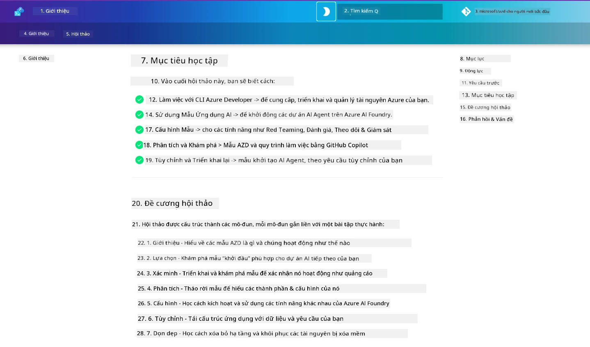

<div align="center">
  <div style="background: linear-gradient(135deg, #0078d4, #106ebe); border-radius: 10px; padding: 20px; margin: 20px 0; box-shadow: 0 4px 15px rgba(0, 120, 212, 0.3); border: 2px solid #005a9e;">
    <h2 style="color: white; margin: 0; font-size: 24px; text-shadow: 1px 1px 2px rgba(0,0,0,0.3);">
      🎯 AZD for AI Developers Workshop
    </h2>
    <p style="color: white; margin: 10px 0 0 0; font-size: 16px; text-shadow: 1px 1px 2px rgba(0,0,0,0.3);">
      <strong>Một workshop thực hành để xây dựng ứng dụng AI với Azure Developer CLI.</strong><br>
      Hoàn thành 7 mô-đun để làm chủ các mẫu AZD và quy trình triển khai AI.
    </p>
    <div style="margin-top: 15px;">
      <span style="background: rgba(255,255,255,0.2); padding: 5px 10px; border-radius: 15px; color: white; font-size: 14px;">
        📅 Cập nhật lần cuối: Tháng 2 năm 2026
      </span>
    </div>
  </div>
</div>

# AZD for AI Developers Workshop

Chào mừng đến với workshop thực hành để học Azure Developer CLI (AZD) với trọng tâm là triển khai ứng dụng AI. Workshop này giúp bạn nắm bắt kiến thức áp dụng về các mẫu AZD trong 3 bước:

1. **Khám phá** - tìm mẫu phù hợp với bạn.
1. **Triển khai** - triển khai và xác thực rằng nó hoạt động
1. **Tùy chỉnh** - sửa đổi và lặp lại để biến nó thành của bạn!

Trong suốt workshop, bạn cũng sẽ được giới thiệu về các công cụ và quy trình làm việc cốt lõi dành cho nhà phát triển, giúp bạn đơn giản hóa hành trình phát triển từ đầu đến cuối.

<br/>

## Browser-Based Guide

Các bài học của workshop ở dạng Markdown. Bạn có thể điều hướng trực tiếp trên GitHub - hoặc khởi chạy bản xem trước trên trình duyệt như trong ảnh chụp màn hình bên dưới.



Để sử dụng tùy chọn này - fork repository về profile của bạn, và khởi chạy GitHub Codespaces. Khi terminal của VS Code hoạt động, gõ lệnh sau:

```bash title="" linenums="0"
mkdocs serve > /dev/null 2>&1 &
```

Trong vài giây, bạn sẽ thấy một hộp thoại bật lên. Chọn tùy chọn `Mở trong trình duyệt`. Hướng dẫn trên web sẽ mở trong một tab trình duyệt mới. Một số lợi ích của bản xem trước này:

1. **Tìm kiếm tích hợp** - tìm từ khóa hoặc bài học nhanh chóng.
1. **Biểu tượng sao chép** - di chuột lên các khối mã để thấy tùy chọn này
1. **Chuyển đổi giao diện** - chuyển giữa chế độ tối và sáng
1. **Nhận trợ giúp** - nhấp biểu tượng Discord ở chân trang để tham gia!

<br/>

## Workshop Overview

**Thời lượng:** 3-4 giờ  
**Cấp độ:** Sơ cấp đến Trung cấp  
**Yêu cầu trước:** Hiểu biết cơ bản về Azure, khái niệm AI, VS Code & công cụ dòng lệnh.

Đây là một workshop thực hành nơi bạn học bằng cách làm. Khi hoàn thành các bài tập, chúng tôi khuyến nghị xem lại chương trình AZD For Beginners để tiếp tục hành trình học tập của bạn sang các thực hành tốt nhất về Bảo mật và Năng suất.

| Time| Module  | Objective |
|:---|:---|:---|
| 15 mins | [Introduction](docs/instructions/0-Introduction.md) | Set the stage, understand the goals |
| 30 mins | [Select AI Template](docs/instructions/1-Select-AI-Template.md) | Explore options and pick starter | 
| 30 mins | [Validate AI Template](docs/instructions/2-Validate-AI-Template.md) | Deploy default solution to Azure |
| 30 mins | [Deconstruct AI Template](docs/instructions/3-Deconstruct-AI-Template.md) | Explore structure and configuration |
| 30 mins | [Configure AI Template](docs/instructions/4-Configure-AI-Template.md) | Activate and try available features |
| 30 mins | [Customize AI Template](docs/instructions/5-Customize-AI-Template.md) | Adapt the template to your needs |
| 30 mins | [Teardown Infrastructure](docs/instructions/6-Teardown-Infrastructure.md) | Cleanup and release resources |
| 15 mins | [Wrap-Up & Next Steps](docs/instructions/7-Wrap-up.md) | Learning resources, Workshop challenge |

<br/>

## What You'll Learn

Hãy coi Mẫu AZD như một sandbox học tập để khám phá các khả năng và công cụ khác nhau cho phát triển đầu-cuối trên Microsoft Foundry. Đến cuối workshop này, bạn sẽ có cảm nhận trực quan về các công cụ và khái niệm khác nhau trong bối cảnh này.

| Concept  | Objective |
|:---|:---|
| **Azure Developer CLI** | Understand tool commands and workflows|
| **AZD Templates**| Understand project structure and config|
| **Azure AI Agent**| Provision & deploy Microsoft Foundry project  |
| **Azure AI Search**| Enable context engineering with agents |
| **Observability**| Explore tracing, monitoring and evaluations |
| **Red Teaming**| Explore adversarial testing and mitigations |

<br/>

## Workshop Structure

Workshop được cấu trúc để đưa bạn đi từ việc khám phá mẫu, đến triển khai, phân tích cấu trúc, và tùy chỉnh - sử dụng mẫu khởi tạo chính thức [Getting Started with AI Agents](https://github.com/Azure-Samples/get-started-with-ai-agents) làm cơ sở.

### [Module 1: Select AI Template](docs/instructions/1-Select-AI-Template.md) (30 mins)

- AI Templates là gì?
- Tôi có thể tìm AI Templates ở đâu?
- Làm thế nào để bắt đầu xây dựng AI Agents?
- **Lab**: Khởi động nhanh với GitHub Codespaces

### [Module 2: Validate AI Template](docs/instructions/2-Validate-AI-Template.md) (30 mins)

- Kiến trúc của AI Template là gì?
- Quy trình phát triển AZD là gì?
- Làm thế nào tôi có thể nhận trợ giúp với phát triển AZD?
- **Lab**: Triển khai & Xác thực mẫu AI Agents

### [Module 3: Deconstruct AI Template](docs/instructions/3-Deconstruct-AI-Template.md) (30 mins)

- Khám phá môi trường của bạn trong `.azure/` 
- Khám phá thiết lập tài nguyên trong `infra/` 
- Khám phá cấu hình AZD của bạn trong `azure.yaml`s
- **Lab**: Sửa biến môi trường & Triển khai lại

### [Module 4: Configure AI Template](docs/instructions/4-Configure-AI-Template.md) (30 mins)
- Khám phá: Retrieval Augmented Generation
- Khám phá: Đánh giá Agent & Red Teaming
- Khám phá: Tracing & Monitoring
- **Lab**: Khám phá AI Agent + Observability 

### [Module 5: Customize AI Template](docs/instructions/5-Customize-AI-Template.md) (30 mins)
- Xác định: PRD với Yêu cầu Kịch bản
- Cấu hình: Biến môi trường cho AZD
- Thực hiện: Hooks vòng đời cho các tác vụ bổ sung
- **Lab**: Tùy chỉnh mẫu cho kịch bản của tôi

### [Module 6: Teardown Infrastructure](docs/instructions/6-Teardown-Infrastructure.md) (30 mins)
- Tóm tắt: AZD Templates là gì?
- Tóm tắt: Tại sao sử dụng Azure Developer CLI?
- Bước tiếp theo: Thử một mẫu khác!
- **Lab**: Gỡ bỏ hạ tầng & dọn dẹp

<br/>

## Workshop Challenge

Muốn thử thách bản thân làm nhiều hơn? Dưới đây là một số gợi ý dự án - hoặc chia sẻ ý tưởng của bạn với chúng tôi!!

| Project | Description |
|:---|:---|
|1. **Deconstruct A Complex AI Template** | Sử dụng quy trình và công cụ chúng tôi đã mô tả và xem liệu bạn có thể triển khai, xác thực, và tùy chỉnh một mẫu giải pháp AI khác. _Bạn đã học được gì?_|
|2. **Customize With Your Scenario**  | Thử viết một PRD (Product Requirements Document) cho một kịch bản khác. Sau đó sử dụng GitHub Copilot trong repo mẫu của bạn ở Agent Model - và yêu cầu nó tạo một quy trình tùy chỉnh cho bạn. _Bạn đã học được gì? Bạn có thể cải thiện những gợi ý này như thế nào?_|
| | |

## Have feedback?

1. Đăng một issue trên repo này - gắn tag `Workshop` cho tiện.
1. Tham gia Microsoft Foundry Discord - kết nối với các đồng nghiệp của bạn!


| | | 
|:---|:---|
| **📚 Course Home**| [AZD For Beginners](../README.md)|
| **📖 Documentation** | [Get started with AI templates](https://learn.microsoft.com/en-us/azure/ai-foundry/how-to/develop/ai-template-get-started)|
| **🛠️AI Templates** | [Microsoft Foundry Templates](https://ai.azure.com/templates) |
|**🚀 Next Steps** | [Begin Workshop](../../../workshop) |
| | |

<br/>

---

**Navigation:** [Main Course](../README.md) | [Introduction](docs/instructions/0-Introduction.md) | [Module 1: Select Template](docs/instructions/1-Select-AI-Template.md)

**Sẵn sàng bắt đầu xây dựng ứng dụng AI với AZD?**

[Bắt đầu Workshop: Introduction →](docs/instructions/0-Introduction.md)

---

<!-- CO-OP TRANSLATOR DISCLAIMER START -->
Miễn trừ trách nhiệm:
Tài liệu này được dịch bằng dịch vụ dịch thuật AI [Co-op Translator](https://github.com/Azure/co-op-translator). Mặc dù chúng tôi cố gắng đảm bảo độ chính xác, xin lưu ý rằng bản dịch tự động có thể chứa lỗi hoặc không chính xác. Văn bản gốc bằng ngôn ngữ ban đầu nên được coi là nguồn có thẩm quyền. Đối với những thông tin quan trọng, khuyến nghị sử dụng dịch vụ dịch thuật chuyên nghiệp do con người thực hiện. Chúng tôi không chịu trách nhiệm đối với bất kỳ sự hiểu lầm hay giải thích sai nào phát sinh từ việc sử dụng bản dịch này.
<!-- CO-OP TRANSLATOR DISCLAIMER END -->