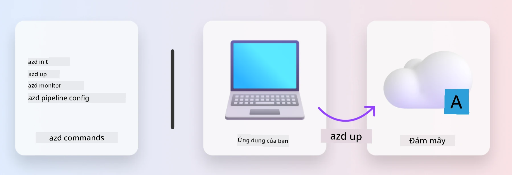
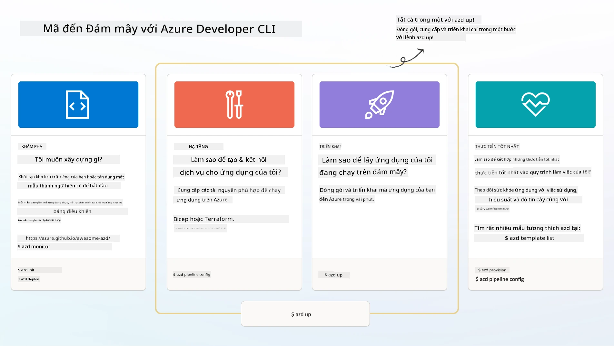

# 1. Chọn Mẫu

!!! tip "KHI HOÀN THÀNH MODULE NÀY, BẠN SẼ CÓ THỂ"

    - [ ] Mô tả AZD templates là gì
    - [ ] Tìm kiếm và sử dụng AZD templates cho AI
    - [ ] Bắt đầu với mẫu AI Agents
    - [ ] **Lab 1:** AZD Quickstart với GitHub Codespaces

---

## 1. Một Phép So Sánh Về Xây Dựng

Việc xây dựng một ứng dụng AI hiện đại, sẵn sàng cho doanh nghiệp _từ đầu_ có thể rất khó khăn. Nó giống như việc tự mình xây dựng một ngôi nhà mới, từng viên gạch một. Đúng là có thể làm được! Nhưng đó không phải là cách hiệu quả nhất để đạt được kết quả mong muốn!

Thay vào đó, chúng ta thường bắt đầu với một _bản thiết kế_ có sẵn và làm việc với một kiến trúc sư để tùy chỉnh nó theo yêu cầu cá nhân. Và đó chính là cách tiếp cận khi xây dựng các ứng dụng thông minh. Đầu tiên, tìm một kiến trúc thiết kế tốt phù hợp với lĩnh vực vấn đề của bạn. Sau đó làm việc với một kiến trúc sư giải pháp để tùy chỉnh và phát triển giải pháp cho kịch bản cụ thể của bạn.

Nhưng làm thế nào để tìm được những bản thiết kế này? Và làm thế nào để tìm được một kiến trúc sư sẵn sàng hướng dẫn bạn cách tùy chỉnh và triển khai những bản thiết kế này? Trong workshop này, chúng ta sẽ trả lời những câu hỏi đó bằng cách giới thiệu ba công nghệ:

1. [Azure Developer CLI](https://aka.ms/azd) - một công cụ mã nguồn mở giúp tăng tốc quá trình phát triển từ môi trường cục bộ (xây dựng) đến triển khai trên đám mây (giao hàng).
1. [Azure AI Foundry Templates](https://ai.azure.com/templates) - các kho mã nguồn mở tiêu chuẩn chứa mã mẫu, tệp hạ tầng và cấu hình để triển khai một kiến trúc giải pháp AI.
1. [GitHub Copilot Agent Mode](https://code.visualstudio.com/docs/copilot/chat/chat-agent-mode) - một trợ lý lập trình dựa trên kiến thức Azure, có thể hướng dẫn chúng ta điều hướng mã nguồn và thực hiện thay đổi - sử dụng ngôn ngữ tự nhiên.

Với những công cụ này, chúng ta có thể _tìm kiếm_ mẫu phù hợp, _triển khai_ để xác nhận nó hoạt động, và _tùy chỉnh_ để phù hợp với các kịch bản cụ thể. Hãy cùng khám phá cách chúng hoạt động.

---

## 2. Azure Developer CLI

[Azure Developer CLI](https://learn.microsoft.com/en-us/azure/developer/azure-developer-cli/) (hoặc `azd`) là một công cụ dòng lệnh mã nguồn mở giúp tăng tốc hành trình từ mã đến đám mây với một bộ lệnh thân thiện với nhà phát triển, hoạt động nhất quán trên cả môi trường IDE (phát triển) và CI/CD (devops).

Với `azd`, hành trình triển khai của bạn có thể đơn giản như:

- `azd init` - Khởi tạo một dự án AI mới từ một mẫu AZD có sẵn.
- `azd up` - Cung cấp hạ tầng và triển khai ứng dụng của bạn chỉ trong một bước.
- `azd monitor` - Nhận giám sát và chẩn đoán theo thời gian thực cho ứng dụng đã triển khai.
- `azd pipeline config` - Thiết lập các pipeline CI/CD để tự động triển khai lên Azure.

**🎯 | BÀI TẬP**: <br/> Khám phá công cụ dòng lệnh `azd` trong môi trường GitHub Codespaces của bạn ngay bây giờ. Bắt đầu bằng cách nhập lệnh này để xem công cụ có thể làm gì:

```bash title="" linenums="0"
azd help
```



---

## 3. Mẫu AZD

Để `azd` hoạt động, nó cần biết hạ tầng cần cung cấp, các cài đặt cấu hình cần thực thi, và ứng dụng cần triển khai. Đây là lúc [AZD templates](https://learn.microsoft.com/en-us/azure/developer/azure-developer-cli/azd-templates?tabs=csharp) xuất hiện.

AZD templates là các kho mã nguồn mở kết hợp mã mẫu với các tệp hạ tầng và cấu hình cần thiết để triển khai kiến trúc giải pháp. 
Bằng cách sử dụng cách tiếp cận _Infrastructure-as-Code_ (IaC), chúng cho phép các định nghĩa tài nguyên mẫu và cài đặt cấu hình được quản lý phiên bản (giống như mã nguồn ứng dụng) - tạo ra các quy trình làm việc có thể tái sử dụng và nhất quán giữa các người dùng của dự án đó.

Khi tạo hoặc tái sử dụng một mẫu AZD cho kịch bản của _bạn_, hãy cân nhắc các câu hỏi sau:

1. Bạn đang xây dựng gì? → Có mẫu nào có mã khởi đầu cho kịch bản đó không?
1. Giải pháp của bạn được kiến trúc như thế nào? → Có mẫu nào có các tài nguyên cần thiết không?
1. Giải pháp của bạn được triển khai như thế nào? → Nghĩ đến `azd deploy` với các hook xử lý trước/sau!
1. Làm thế nào để tối ưu hóa nó hơn nữa? → Nghĩ đến giám sát tích hợp và các pipeline tự động hóa!

**🎯 | BÀI TẬP**: <br/> 
Truy cập [Awesome AZD](https://azure.github.io/awesome-azd/) và sử dụng bộ lọc để khám phá hơn 250+ mẫu hiện có. Xem liệu bạn có thể tìm thấy mẫu nào phù hợp với yêu cầu kịch bản của _bạn_.



---

## 4. Mẫu Ứng Dụng AI

---

