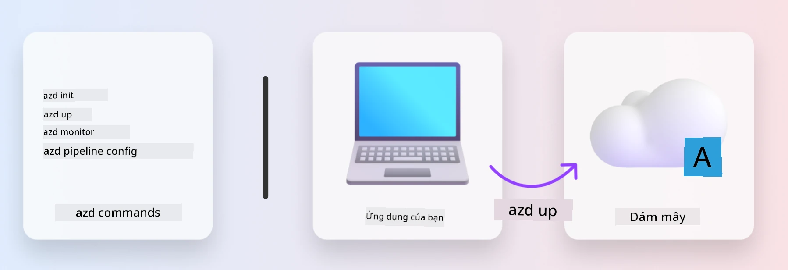
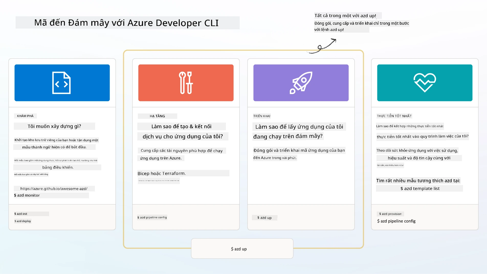

# 1. Chọn một Mẫu

!!! tip "VÀO CUỐI MODULE NÀY BẠN SẼ CÓ THỂ"

    - [ ] Mô tả các mẫu AZD là gì
    - [ ] Khám phá và sử dụng các mẫu AZD cho AI
    - [ ] Bắt đầu với mẫu AI Agents
    - [ ] **Lab 1:** AZD Khởi động nhanh trong Codespaces hoặc một dev container

---

## 1. Phép ẩn dụ của người xây dựng

Xây dựng một ứng dụng AI hiện đại sẵn sàng cho doanh nghiệp _từ đầu_ có thể là việc đáng lo ngại. Nó hơi giống như việc xây căn nhà mới của bạn một mình, từng viên gạch một. Vâng, điều đó có thể làm được! Nhưng nó không phải là cách hiệu quả nhất để đạt được kết quả cuối cùng mong muốn!

Thay vào đó, chúng ta thường bắt đầu với một _bản thiết kế_ sẵn có, và làm việc với một kiến trúc sư để tùy chỉnh nó theo yêu cầu cá nhân. Và đó chính là cách tiếp cận để xây dựng các ứng dụng thông minh. Trước tiên, tìm một kiến trúc thiết kế phù hợp với không gian vấn đề của bạn. Sau đó làm việc với một kiến trúc sư giải pháp để tùy chỉnh và phát triển giải pháp cho kịch bản cụ thể của bạn.

Nhưng chúng ta có thể tìm những bản thiết kế này ở đâu? Và làm thế nào để tìm một kiến trúc sư sẵn lòng dạy chúng ta cách tùy chỉnh và triển khai những bản thiết kế này một mình? Trong hội thảo này, chúng tôi trả lời những câu hỏi đó bằng cách giới thiệu cho bạn ba công nghệ:

1. [Azure Developer CLI](https://aka.ms/azd) - một công cụ mã nguồn mở giúp tăng tốc con đường từ phát triển cục bộ (build) đến triển khai lên đám mây (ship).
1. [Microsoft Foundry Templates](https://ai.azure.com/templates) - các kho lưu trữ mã nguồn mở tiêu chuẩn hóa chứa mã mẫu, cơ sở hạ tầng và tệp cấu hình để triển khai một kiến trúc giải pháp AI.
1. [GitHub Copilot Agent Mode](https://code.visualstudio.com/docs/copilot/chat/chat-agent-mode) - một tác nhân lập trình dựa trên kiến thức Azure, có thể hướng dẫn chúng ta duyệt mã nguồn và thực hiện thay đổi bằng ngôn ngữ tự nhiên.

Với những công cụ này trong tay, giờ đây chúng ta có thể _khám phá_ mẫu phù hợp, _triển khai_ nó để xác thực hoạt động, và _tùy chỉnh_ nó để phù hợp với các kịch bản cụ thể của chúng ta. Hãy tìm hiểu cách chúng hoạt động.

---

## 2. Azure Developer CLI

The [Azure Developer CLI](https://learn.microsoft.com/en-us/azure/developer/azure-developer-cli/) (or `azd`) là một công cụ dòng lệnh mã nguồn mở có thể đẩy nhanh hành trình mã tới đám mây của bạn với một tập hợp các lệnh thân thiện với nhà phát triển hoạt động nhất quán trên IDE (phát triển) và môi trường CI/CD (devops) của bạn.

Với `azd`, hành trình triển khai của bạn có thể đơn giản như:

- `azd init` - Khởi tạo một dự án AI mới từ một mẫu AZD hiện có.
- `azd up` - Cấp phát cơ sở hạ tầng và triển khai ứng dụng của bạn trong một bước.
- `azd monitor` - Nhận giám sát và chẩn đoán theo thời gian thực cho ứng dụng đã triển khai của bạn.
- `azd pipeline config` - Thiết lập các pipeline CI/CD để tự động hóa việc triển khai lên Azure.

**🎯 | BÀI TẬP**: <br/> Khám phá công cụ dòng lệnh `azd` trong môi trường hội thảo hiện tại của bạn ngay bây giờ. Đây có thể là GitHub Codespaces, một dev container, hoặc một bản sao cục bộ với các tiền điều kiện đã được cài đặt. Bắt đầu bằng cách gõ lệnh này để xem công cụ có thể làm gì:

```bash title="" linenums="0"
azd help
```



---

## 3. Mẫu AZD

Để `azd` thực hiện điều này, nó cần biết cơ sở hạ tầng cần cấp phát, các thiết lập cấu hình cần áp dụng, và ứng dụng cần triển khai. Đây là nơi [AZD templates](https://learn.microsoft.com/en-us/azure/developer/azure-developer-cli/azd-templates?tabs=csharp) xuất hiện.

AZD templates là các kho lưu trữ mã nguồn mở kết hợp mã mẫu với các tệp cấu hình và cơ sở hạ tầng cần thiết để triển khai kiến trúc giải pháp.
Bằng cách sử dụng phương pháp tiếp cận _Infrastructure-as-Code_ (IaC), chúng cho phép định nghĩa tài nguyên mẫu và các cài đặt cấu hình được quản lý theo phiên bản (giống như mã nguồn của ứng dụng) - tạo ra các quy trình có thể tái sử dụng và nhất quán cho người dùng của dự án đó.

Khi tạo hoặc tái sử dụng một mẫu AZD cho _kịch bản_ của _bạn_, hãy cân nhắc những câu hỏi sau:

1. Bạn đang xây dựng gì? → Có mẫu nào có mã khởi đầu cho kịch bản đó không?
1. Giải pháp của bạn được kiến trúc như thế nào? → Có mẫu nào có các tài nguyên cần thiết không?
1. Giải pháp của bạn được triển khai như thế nào? → Hãy nghĩ đến `azd deploy` với các hook tiền/hậu xử lý!
1. Làm thế nào bạn có thể tối ưu hóa nó hơn nữa? → Hãy nghĩ đến việc giám sát tích hợp sẵn và các pipeline tự động hóa!

**🎯 | BÀI TẬP**: <br/> 
Truy cập [Awesome AZD](https://azure.github.io/awesome-azd/) gallery và sử dụng bộ lọc để khám phá hơn 250 mẫu hiện có. Xem liệu bạn có thể tìm được một mẫu phù hợp với yêu cầu kịch bản _của bạn_ hay không.



---

## 4. Mẫu Ứng Dụng AI

Đối với các ứng dụng được hỗ trợ bởi AI, Microsoft cung cấp các mẫu chuyên biệt bao gồm **Microsoft Foundry** và **Foundry Agents**. Những mẫu này giúp rút ngắn con đường để xây dựng các ứng dụng thông minh, sẵn sàng cho sản xuất.

### Microsoft Foundry & Mẫu Foundry Agents

Chọn một mẫu bên dưới để triển khai. Mỗi mẫu đều có trên [Awesome AZD](https://azure.github.io/awesome-azd/) và có thể được khởi tạo bằng một lệnh duy nhất.

| Template | Description | Deploy Command |
|----------|-------------|----------------|
| **[Chat AI với RAG](https://azure.github.io/awesome-azd/?tags=ai&tags=rag)** | Ứng dụng chat với Retrieval Augmented Generation sử dụng Microsoft Foundry | `azd init -t azure-samples/azure-search-openai-demo` |
| **[Foundry Agent Service Starter](https://azure.github.io/awesome-azd/?tags=ai&tags=agents)** | Xây dựng các AI agent với Foundry Agents để thực hiện tác vụ tự chủ | `azd init -t azure-samples/foundry-agent-service-starter` |
| **[Multi-Agent Orchestration](https://azure.github.io/awesome-azd/?tags=ai&tags=agents)** | Điều phối nhiều Foundry Agents cho các luồng công việc phức tạp | `azd init -t azure-samples/multi-agent-orchestration` |
| **[AI Document Intelligence](https://azure.github.io/awesome-azd/?tags=ai&tags=document)** | Trích xuất và phân tích tài liệu với các mô hình Microsoft Foundry | `azd init -t azure-samples/ai-document-processing` |
| **[Conversational AI Bot](https://azure.github.io/awesome-azd/?tags=ai&tags=bot)** | Xây dựng chatbot thông minh với tích hợp Microsoft Foundry | `azd init -t azure-samples/ai-chat-protocol` |
| **[AI Image Generation](https://azure.github.io/awesome-azd/?tags=ai&tags=dalle)** | Tạo hình ảnh sử dụng DALL-E qua Microsoft Foundry | `azd init -t azure-samples/ai-image-generation` |
| **[Semantic Kernel Agent](https://azure.github.io/awesome-azd/?tags=ai&tags=semantic-kernel)** | Các agent AI sử dụng Semantic Kernel với Foundry Agents | `azd init -t azure-samples/semantic-kernel-agent` |
| **[AutoGen Multi-Agent](https://azure.github.io/awesome-azd/?tags=ai&tags=autogen)** | Hệ thống đa-agent sử dụng framework AutoGen | `azd init -t azure-samples/autogen-multi-agent` |

### Bắt đầu nhanh

1. **Duyệt các mẫu**: Truy cập [https://azure.github.io/awesome-azd/](https://azure.github.io/awesome-azd/) và lọc theo `AI`, `Agents`, hoặc `Microsoft Foundry`
2. **Chọn mẫu của bạn**: Chọn một mẫu phù hợp với trường hợp sử dụng của bạn
3. **Khởi tạo**: Chạy lệnh `azd init` cho mẫu bạn chọn
4. **Triển khai**: Chạy `azd up` để cấp phát và triển khai

**🎯 | BÀI TẬP**: <br/>
Chọn một trong các mẫu ở trên dựa trên kịch bản của bạn:

- **Đang xây dựng chatbot?** → Bắt đầu với **Chat AI với RAG** hoặc **Conversational AI Bot**
- **Cần các agent tự chủ?** → Thử **Foundry Agent Service Starter** hoặc **Multi-Agent Orchestration**
- **Xử lý tài liệu?** → Sử dụng **AI Document Intelligence**
- **Muốn trợ giúp lập trình bằng AI?** → Khám phá **Semantic Kernel Agent** hoặc **AutoGen Multi-Agent**

```bash title="Example: Deploy the AI Chat with RAG template" linenums="0"
azd init -t azure-samples/azure-search-openai-demo
azd up
```

!!! info "Khám phá thêm mẫu"
    The [Awesome AZD Gallery](https://azure.github.io/awesome-azd/) contains 250+ templates. Use the filters to find templates matching your specific requirements for language, framework, and Azure services.

---

<!-- CO-OP TRANSLATOR DISCLAIMER START -->
**Disclaimer**:
Tài liệu này đã được dịch bằng dịch vụ dịch máy AI [Co-op Translator](https://github.com/Azure/co-op-translator). Mặc dù chúng tôi nỗ lực để đảm bảo độ chính xác, xin lưu ý rằng các bản dịch tự động có thể chứa lỗi hoặc không chính xác. Tài liệu gốc bằng ngôn ngữ gốc nên được coi là nguồn có thẩm quyền. Đối với thông tin quan trọng, khuyến nghị sử dụng dịch vụ dịch thuật chuyên nghiệp do con người thực hiện. Chúng tôi không chịu trách nhiệm cho bất kỳ hiểu lầm hoặc diễn giải sai nào phát sinh từ việc sử dụng bản dịch này.
<!-- CO-OP TRANSLATOR DISCLAIMER END -->