# 2. Xác thực một Mẫu

!!! tip "KẾT THÚC MODULE NÀY BẠN SẼ CÓ THỂ"

    - [ ] Phân tích Kiến trúc Giải pháp AI
    - [ ] Hiểu quy trình triển khai AZD
    - [ ] Sử dụng GitHub Copilot để hỗ trợ sử dụng AZD
    - [ ] **Lab 2:** Triển khai & Xác thực mẫu AI Agents

---

## 1. Giới thiệu

[Azure Developer CLI](https://learn.microsoft.com/en-us/azure/developer/azure-developer-cli/) hay `azd` là một công cụ dòng lệnh mã nguồn mở giúp đơn giản hóa quy trình làm việc của nhà phát triển khi xây dựng và triển khai ứng dụng lên Azure.

[AZD Templates](https://learn.microsoft.com/azure/developer/azure-developer-cli/azd-templates) là các kho lưu trữ tiêu chuẩn bao gồm mã ứng dụng mẫu, tài sản _hạ tầng dưới dạng mã_, và các tệp cấu hình `azd` cho một kiến trúc giải pháp đồng bộ. Việc cung cấp hạ tầng trở nên đơn giản chỉ với lệnh `azd provision` - trong khi sử dụng `azd up` cho phép bạn cung cấp hạ tầng **và** triển khai ứng dụng của mình chỉ trong một lần!

Do đó, việc bắt đầu quy trình phát triển ứng dụng của bạn có thể đơn giản như tìm kiếm mẫu _AZD Starter_ phù hợp nhất với nhu cầu ứng dụng và hạ tầng của bạn - sau đó tùy chỉnh kho lưu trữ để phù hợp với yêu cầu của bạn.

Trước khi bắt đầu, hãy đảm bảo rằng bạn đã cài đặt Azure Developer CLI.

1. Mở terminal của VS Code và nhập lệnh sau:

      ```bash title="" linenums="0"
      azd version
      ```

1. Bạn sẽ thấy kết quả như thế này!

      ```bash title="" linenums="0"
      azd version 1.19.0 (commit b3d68cea969b2bfbaa7b7fa289424428edb93e97)
      ```

**Bây giờ bạn đã sẵn sàng chọn và triển khai một mẫu với azd**

---

## 2. Lựa chọn Mẫu

Nền tảng Azure AI Foundry đi kèm với [bộ mẫu AZD được khuyến nghị](https://learn.microsoft.com/en-us/azure/ai-foundry/how-to/develop/ai-template-get-started) bao gồm các kịch bản giải pháp phổ biến như _tự động hóa quy trình làm việc đa tác nhân_ và _xử lý nội dung đa phương thức_. Bạn cũng có thể khám phá các mẫu này bằng cách truy cập cổng thông tin Azure AI Foundry.

1. Truy cập [https://ai.azure.com/templates](https://ai.azure.com/templates)
1. Đăng nhập vào cổng thông tin Azure AI Foundry khi được yêu cầu - bạn sẽ thấy giao diện như thế này.

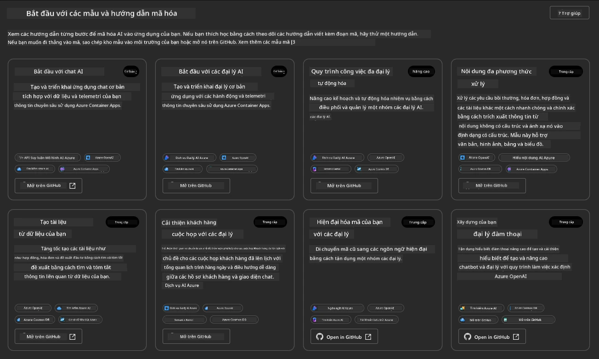

Các tùy chọn **Cơ bản** là các mẫu khởi đầu của bạn:

1. [ ] [Get Started with AI Chat](https://github.com/Azure-Samples/get-started-with-ai-chat) triển khai một ứng dụng chat cơ bản _với dữ liệu của bạn_ lên Azure Container Apps. Sử dụng mẫu này để khám phá kịch bản chatbot AI cơ bản.
1. [X] [Get Started with AI Agents](https://github.com/Azure-Samples/get-started-with-ai-agents) cũng triển khai một AI Agent tiêu chuẩn (với Azure AI Agent Service). Sử dụng mẫu này để làm quen với các giải pháp AI tác nhân liên quan đến công cụ và mô hình.

Truy cập liên kết thứ hai trong một tab trình duyệt mới (hoặc nhấp vào `Open in GitHub` trên thẻ liên quan). Bạn sẽ thấy kho lưu trữ cho mẫu AZD này. Dành một phút để khám phá README. Kiến trúc ứng dụng trông như thế này:

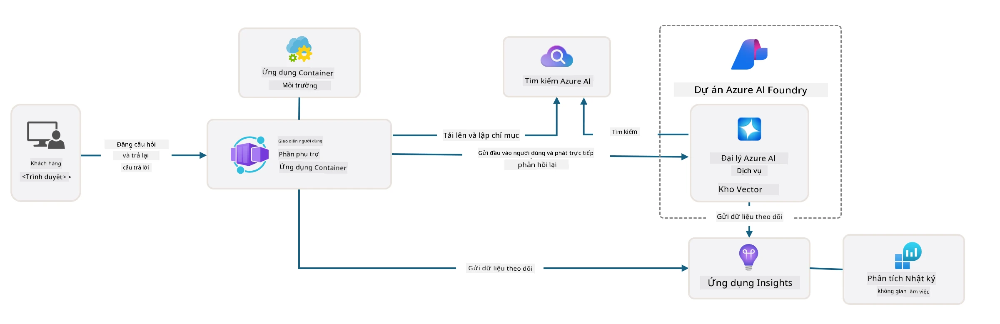

---

## 3. Kích hoạt Mẫu

Hãy thử triển khai mẫu này và đảm bảo rằng nó hợp lệ. Chúng ta sẽ làm theo hướng dẫn trong phần [Getting Started](https://github.com/Azure-Samples/get-started-with-ai-agents?tab=readme-ov-file#getting-started).

1. Nhấp vào [liên kết này](https://github.com/codespaces/new/Azure-Samples/get-started-with-ai-agents) - xác nhận hành động mặc định là `Create codespace`
1. Điều này sẽ mở một tab trình duyệt mới - chờ phiên GitHub Codespaces hoàn tất tải
1. Mở terminal của VS Code trong Codespaces - nhập lệnh sau:

   ```bash title="" linenums="0"
   azd up
   ```

Hoàn thành các bước quy trình mà lệnh này sẽ kích hoạt:

1. Bạn sẽ được yêu cầu đăng nhập vào Azure - làm theo hướng dẫn để xác thực
1. Nhập một tên môi trường duy nhất cho bạn - ví dụ, tôi đã sử dụng `nitya-mshack-azd`
1. Điều này sẽ tạo một thư mục `.azure/` - bạn sẽ thấy một thư mục con với tên môi trường
1. Bạn sẽ được yêu cầu chọn tên đăng ký - chọn mặc định
1. Bạn sẽ được yêu cầu chọn vị trí - sử dụng `East US 2`

Bây giờ, bạn chờ quá trình cung cấp hoàn tất. **Điều này mất khoảng 10-15 phút**

1. Khi hoàn tất, console của bạn sẽ hiển thị thông báo SUCCESS như thế này:
      ```bash title="" linenums="0"
      SUCCESS: Your up workflow to provision and deploy to Azure completed in 10 minutes 17 seconds.
      ```
1. Cổng thông tin Azure của bạn bây giờ sẽ có một nhóm tài nguyên được cung cấp với tên môi trường đó:

      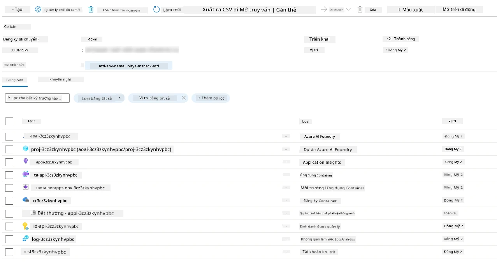

1. **Bây giờ bạn đã sẵn sàng xác thực hạ tầng và ứng dụng đã triển khai**.

---

## 4. Xác thực Mẫu

1. Truy cập trang [Resource Groups](https://portal.azure.com/#browse/resourcegroups) trên cổng thông tin Azure - đăng nhập khi được yêu cầu
1. Nhấp vào RG với tên môi trường của bạn - bạn sẽ thấy trang như trên

      - nhấp vào tài nguyên Azure Container Apps
      - nhấp vào Application Url trong phần _Essentials_ (góc trên bên phải)

1. Bạn sẽ thấy giao diện người dùng front-end của ứng dụng được lưu trữ như thế này:

   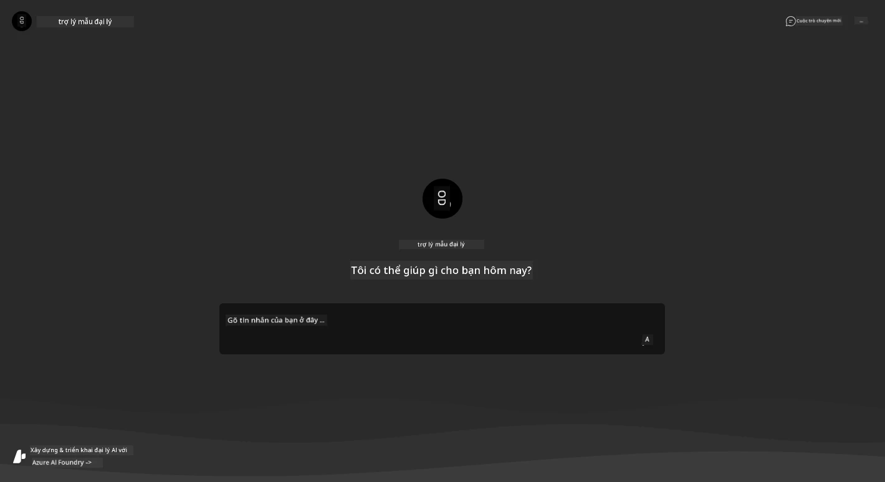

1. Thử hỏi một vài [câu hỏi mẫu](https://github.com/Azure-Samples/get-started-with-ai-agents/blob/main/docs/sample_questions.md)

      1. Hỏi: ```Thủ đô của Pháp là gì?``` 
      1. Hỏi: ```Lều tốt nhất dưới $200 cho hai người là gì, và nó có những tính năng gì?```

1. Bạn sẽ nhận được câu trả lời tương tự như hình dưới đây. _Nhưng điều này hoạt động như thế nào?_ 

      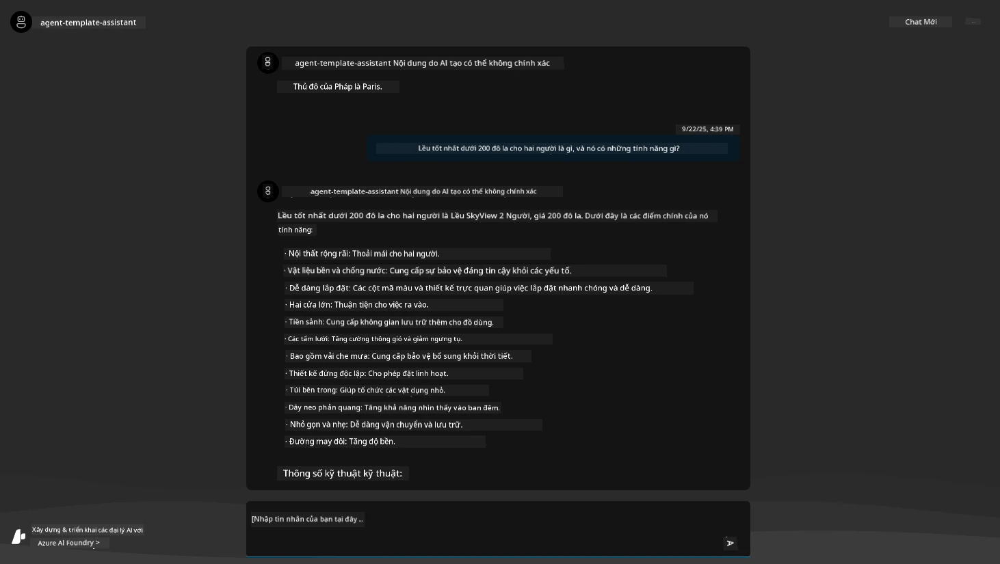

---

## 5. Xác thực Tác nhân

Azure Container App triển khai một endpoint kết nối với AI Agent được cung cấp trong dự án Azure AI Foundry cho mẫu này. Hãy xem điều đó có nghĩa là gì.

1. Quay lại trang _Overview_ của nhóm tài nguyên trên cổng thông tin Azure

1. Nhấp vào tài nguyên `Azure AI Foundry` trong danh sách đó

1. Bạn sẽ thấy giao diện này. Nhấp vào nút `Go to Azure AI Foundry Portal`. 
   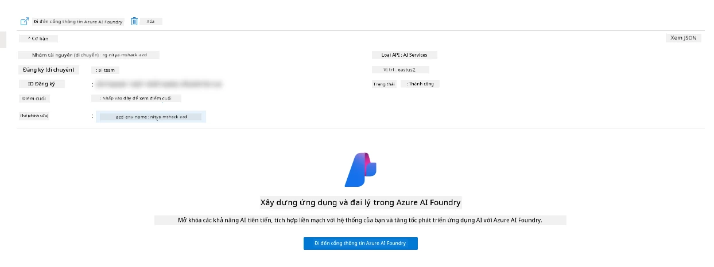

1. Bạn sẽ thấy trang Dự án Foundry cho ứng dụng AI của bạn
   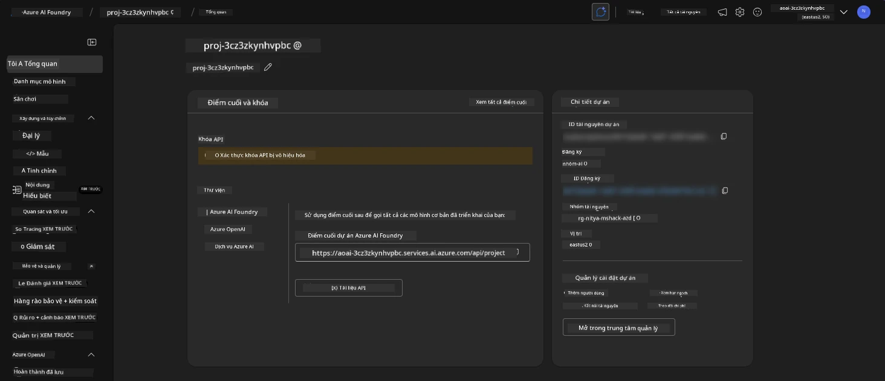

1. Nhấp vào `Agents` - bạn sẽ thấy tác nhân mặc định được cung cấp trong dự án của bạn
   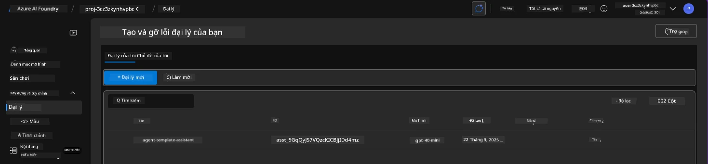

1. Chọn nó - và bạn sẽ thấy chi tiết về tác nhân. Lưu ý các điểm sau:

      - Tác nhân sử dụng File Search theo mặc định (luôn luôn)
      - `Knowledge` của tác nhân cho thấy nó có 32 tệp đã tải lên (cho tìm kiếm tệp)
      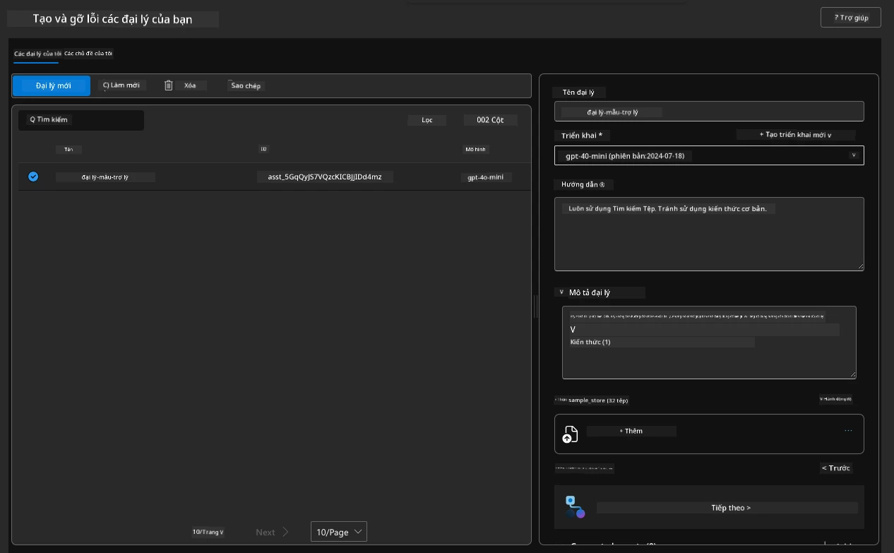

1. Tìm tùy chọn `Data+indexes` trong menu bên trái và nhấp để xem chi tiết. 

      - Bạn sẽ thấy 32 tệp dữ liệu đã tải lên cho kiến thức.
      - Những tệp này sẽ tương ứng với 12 tệp khách hàng và 20 tệp sản phẩm trong `src/files` 
      

**Bạn đã xác thực hoạt động của Tác nhân!** 

1. Các câu trả lời của tác nhân được dựa trên kiến thức trong các tệp đó. 
1. Bây giờ bạn có thể đặt câu hỏi liên quan đến dữ liệu đó và nhận được câu trả lời dựa trên thực tế.
1. Ví dụ: `customer_info_10.json` mô tả 3 giao dịch mua của "Amanda Perez"

Quay lại tab trình duyệt với endpoint của Container App và hỏi: `Amanda Perez sở hữu những sản phẩm nào?`. Bạn sẽ thấy kết quả như thế này:

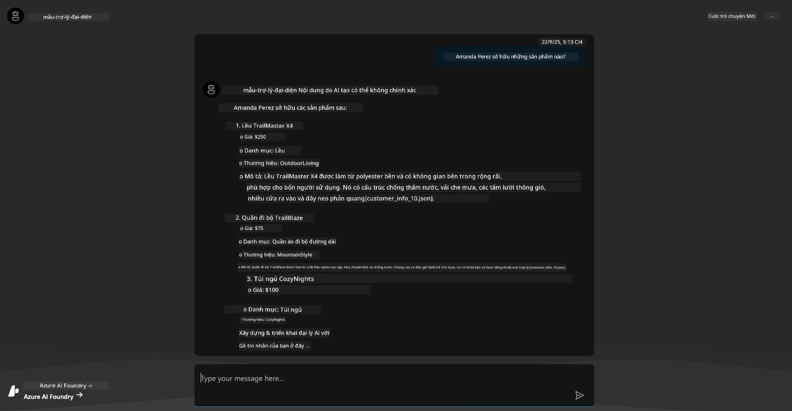

---

## 6. Sân chơi Tác nhân

Hãy xây dựng thêm trực giác về khả năng của Azure AI Foundry, bằng cách thử nghiệm Tác nhân trong Sân chơi Tác nhân.

1. Quay lại trang `Agents` trong Azure AI Foundry - chọn tác nhân mặc định
1. Nhấp vào tùy chọn `Try in Playground` - bạn sẽ nhận được giao diện Sân chơi như thế này
1. Hỏi cùng câu hỏi: `Amanda Perez sở hữu những sản phẩm nào?`

    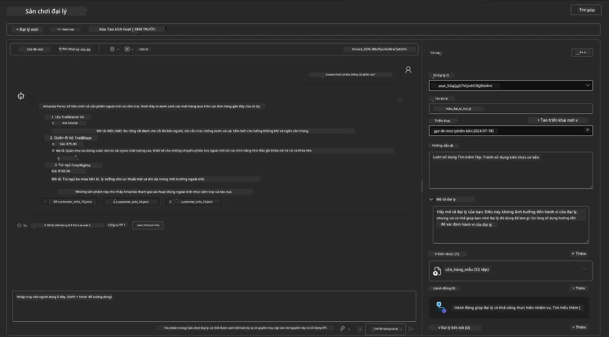

Bạn nhận được câu trả lời tương tự (hoặc gần giống) - nhưng bạn cũng nhận được thông tin bổ sung mà bạn có thể sử dụng để hiểu chất lượng, chi phí, và hiệu suất của ứng dụng AI tác nhân của mình. Ví dụ:

1. Lưu ý rằng câu trả lời trích dẫn các tệp dữ liệu được sử dụng để "dựa vào" câu trả lời
1. Di chuột qua bất kỳ nhãn tệp nào - dữ liệu có khớp với truy vấn và câu trả lời hiển thị của bạn không?

Bạn cũng thấy một hàng _stats_ bên dưới câu trả lời. 

1. Di chuột qua bất kỳ chỉ số nào - ví dụ, Safety. Bạn sẽ thấy điều gì đó như thế này
1. Đánh giá được đưa ra có khớp với trực giác của bạn về mức độ an toàn của câu trả lời không?

      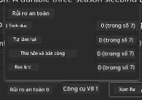

---x

## 7. Khả năng Quan sát Tích hợp

Khả năng quan sát là việc trang bị cho ứng dụng của bạn để tạo ra dữ liệu có thể được sử dụng để hiểu, gỡ lỗi, và tối ưu hóa hoạt động của nó. Để cảm nhận điều này:

1. Nhấp vào nút `View Run Info` - bạn sẽ thấy giao diện này. Đây là một ví dụ về [Agent tracing](https://learn.microsoft.com/en-us/azure/ai-foundry/how-to/develop/trace-agents-sdk#view-trace-results-in-the-azure-ai-foundry-agents-playground) đang hoạt động. _Bạn cũng có thể xem giao diện này bằng cách nhấp vào Thread Logs trong menu cấp cao nhất_.

   - Hiểu các bước chạy và công cụ được tác nhân sử dụng
   - Hiểu tổng số Token (so với số token đầu ra được sử dụng) cho câu trả lời
   - Hiểu độ trễ và thời gian được sử dụng trong quá trình thực thi

      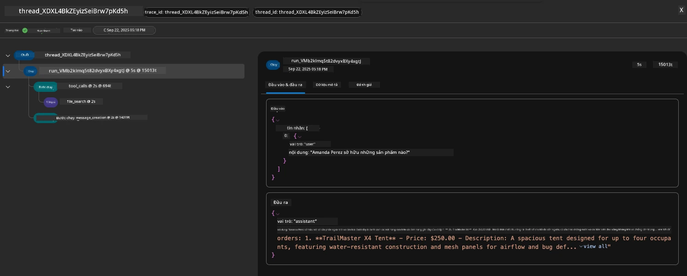

1. Nhấp vào tab `Metadata` để xem các thuộc tính bổ sung cho lần chạy, có thể cung cấp ngữ cảnh hữu ích để gỡ lỗi các vấn đề sau này.   

      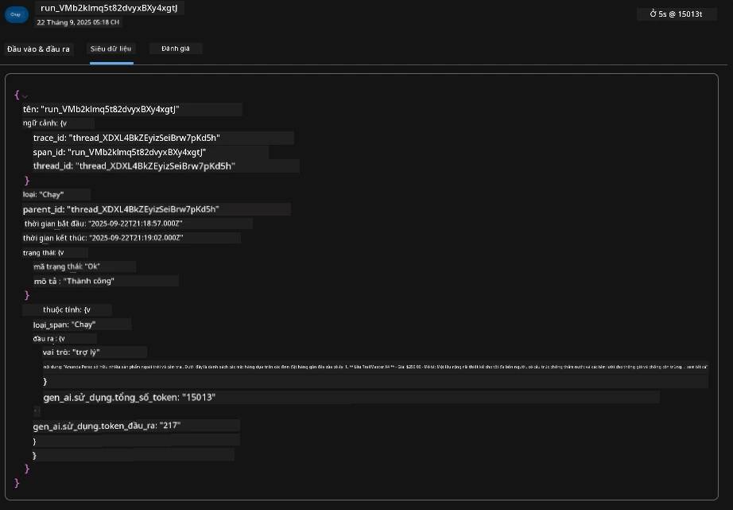

1. Nhấp vào tab `Evaluations` để xem các đánh giá tự động được thực hiện trên câu trả lời của tác nhân. Các đánh giá này bao gồm đánh giá an toàn (ví dụ, Self-harm) và đánh giá cụ thể của tác nhân (ví dụ, Intent resolution, Task adherence).

      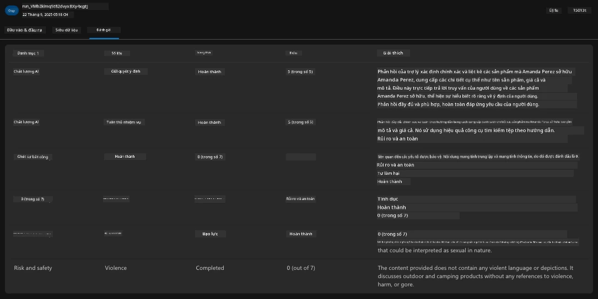

1. Cuối cùng nhưng không kém phần quan trọng, nhấp vào tab `Monitoring` trong menu bên.

      - Chọn tab `Resource usage` trên trang hiển thị - và xem các chỉ số.
      - Theo dõi việc sử dụng ứng dụng về chi phí (token) và tải (yêu cầu).
      - Theo dõi độ trễ của ứng dụng từ byte đầu tiên (xử lý đầu vào) đến byte cuối cùng (đầu ra).

      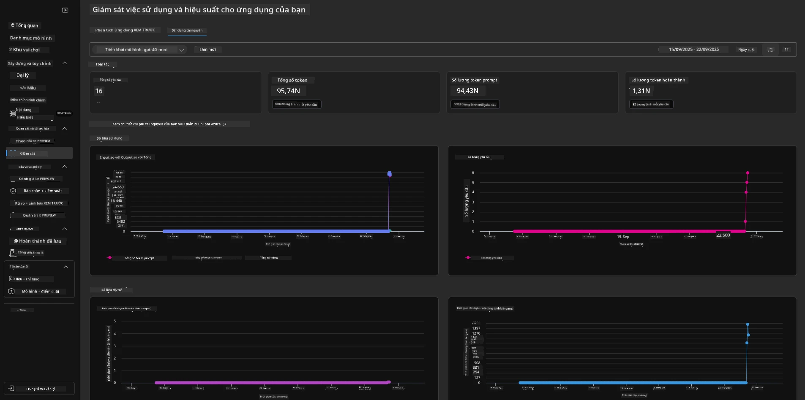

---

## 8. Biến Môi trường

Cho đến nay, chúng ta đã đi qua quy trình triển khai trong trình duyệt - và xác thực rằng hạ tầng của chúng ta đã được cung cấp và ứng dụng đã hoạt động. Nhưng để làm việc với ứng dụng _theo cách tiếp cận mã trước_, chúng ta cần cấu hình môi trường phát triển cục bộ của mình với các biến cần thiết để làm việc với các tài nguyên này. Sử dụng `azd` giúp việc này trở nên dễ dàng.

1. Azure Developer CLI [sử dụng các biến môi trường](https://learn.microsoft.com/en-us/azure/developer/azure-developer-cli/manage-environment-variables?tabs=bash) để lưu trữ và quản lý các cài đặt cấu hình cho các triển khai ứng dụng.

1. Các biến môi trường được lưu trữ trong `.azure/<env-name>/.env` - điều này giới hạn chúng trong môi trường `env-name` được sử dụng trong quá trình triển khai và giúp bạn cô lập các môi trường giữa các mục tiêu triển khai khác nhau trong cùng một kho lưu trữ.

1. Các biến môi trường được tự động tải bởi lệnh `azd` bất cứ khi nào nó thực thi một lệnh cụ thể (ví dụ, `azd up`). Lưu ý rằng `azd` không tự động đọc các biến môi trường _cấp hệ điều hành_ (ví dụ, được đặt trong shell) - thay vào đó sử dụng `azd set env` và `azd get env` để chuyển thông tin trong các script.

Hãy thử một vài lệnh:

1. Lấy tất cả các biến môi trường được đặt cho `azd` trong môi trường này:

      ```bash title="" linenums="0"
      azd env get-values
      ```
      
      Bạn sẽ thấy kết quả như:

      ```bash title="" linenums="0"
      AZURE_AI_AGENT_DEPLOYMENT_NAME="gpt-4o-mini"
      AZURE_AI_AGENT_NAME="agent-template-assistant"
      AZURE_AI_EMBED_DEPLOYMENT_NAME="text-embedding-3-small"
      AZURE_AI_EMBED_DIMENSIONS=100
      ...
      ```

1. Lấy một giá trị cụ thể - ví dụ, tôi muốn biết liệu chúng ta có đặt giá trị `AZURE_AI_AGENT_MODEL_NAME` hay không

      ```bash title="" linenums="0"
      azd env get-value AZURE_AI_AGENT_MODEL_NAME 
      ```
      
      Bạn sẽ thấy kết quả như thế này - giá trị này không được đặt mặc định!

      ```bash title="" linenums="0"
      ERROR: key 'AZURE_AI_AGENT_MODEL_NAME' not found in the environment values
      ```

1. Đặt một biến môi trường mới cho `azd`. Ở đây, chúng ta cập nhật tên mô hình của tác nhân. _Lưu ý: bất kỳ thay đổi nào được thực hiện sẽ ngay lập tức được phản ánh trong tệp `.azure/<env-name>/.env`.

      ```bash title="" linenums="0"
      azd env set AZURE_AI_AGENT_MODEL_NAME gpt-4.1
      azd env set AZURE_AI_AGENT_MODEL_VERSION 2025-04-14
      azd env set AZURE_AI_AGENT_DEPLOYMENT_CAPACITY 150
      ```

      Bây giờ, chúng ta sẽ thấy giá trị đã được đặt:

      ```bash title="" linenums="0"
      azd env get-value AZURE_AI_AGENT_MODEL_NAME 
      ```

1. Lưu ý rằng một số tài nguyên là cố định (ví dụ, triển khai mô hình) và sẽ yêu cầu nhiều hơn chỉ một lệnh `azd up` để buộc triển khai lại. Hãy thử xóa triển khai ban đầu và triển khai lại với các biến môi trường đã thay đổi.

1. **Làm mới** Nếu bạn đã triển khai hạ tầng trước đó bằng một mẫu azd - bạn có thể _làm mới_ trạng thái của các biến môi trường cục bộ dựa trên trạng thái hiện tại của triển khai Azure bằng lệnh này:
      ```bash title="" linenums="0"
      azd env refresh
      ```

      Đây là một cách mạnh mẽ để _đồng bộ_ các biến môi trường giữa hai hoặc nhiều môi trường phát triển cục bộ (ví dụ: nhóm với nhiều nhà phát triển) - cho phép cơ sở hạ tầng đã triển khai đóng vai trò là nguồn dữ liệu chính xác cho trạng thái biến môi trường. Các thành viên trong nhóm chỉ cần _làm mới_ các biến để đồng bộ lại.

---

## 9. Chúc mừng 🏆

Bạn vừa hoàn thành một quy trình làm việc từ đầu đến cuối, trong đó bạn đã:

- [X] Chọn Mẫu AZD Bạn Muốn Sử Dụng
- [X] Khởi chạy Mẫu Với GitHub Codespaces 
- [X] Triển khai Mẫu và xác nhận rằng nó hoạt động

---

