# 2. Xác thực một Mẫu

> Đã xác thực với `azd 1.23.12` vào tháng 3 năm 2026.

!!! tip "ĐẾN CUỐI MODULE NÀY BẠN SẼ CÓ THỂ"

    - [ ] Phân tích Kiến trúc Giải pháp AI
    - [ ] Hiểu Quy trình Triển khai AZD
    - [ ] Sử dụng GitHub Copilot để trợ giúp về việc sử dụng AZD
    - [ ] **Lab 2:** Triển khai & Xác thực mẫu AI Agents

---


## 1. Giới thiệu

The [Azure Developer CLI](https://learn.microsoft.com/en-us/azure/developer/azure-developer-cli/) or `azd` là một công cụ dòng lệnh mã nguồn mở giúp hợp lý hóa quy trình làm việc của nhà phát triển khi xây dựng và triển khai ứng dụng lên Azure. 

[AZD Templates](https://learn.microsoft.com/azure/developer/azure-developer-cli/azd-templates) là các kho chuẩn hóa bao gồm mã ví dụ cho ứng dụng, các tài sản _infrastructure-as-code_, và các tệp cấu hình `azd` cho một kiến trúc giải pháp đồng bộ. Việc cấp phát hạ tầng trở nên đơn giản như một lệnh `azd provision` - trong khi dùng `azd up` cho phép bạn cấp phát hạ tầng **và** triển khai ứng dụng trong một bước!

Kết quả là, khởi động nhanh quy trình phát triển ứng dụng của bạn có thể đơn giản như tìm mẫu _AZD Starter_ phù hợp nhất với nhu cầu ứng dụng và hạ tầng của bạn - sau đó tùy chỉnh kho để đáp ứng yêu cầu kịch bản của bạn.

Trước khi bắt đầu, hãy chắc chắn bạn đã cài đặt Azure Developer CLI.

1. Mở terminal trong VS Code và gõ lệnh sau:

      ```bash title="" linenums="0"
      azd version
      ```

1. Bạn sẽ thấy điều gì đó như thế này!

      ```bash title="" linenums="0"
      azd version 1.23.12 (commit <current-build>)
      ```

**Bây giờ bạn đã sẵn sàng chọn và triển khai một mẫu bằng azd**

---

## 2. Lựa chọn Mẫu

Nền tảng Microsoft Foundry đi kèm với một [bộ mẫu AZD được đề xuất](https://learn.microsoft.com/en-us/azure/ai-foundry/how-to/develop/ai-template-get-started) bao phủ các kịch bản giải pháp phổ biến như _tự động hóa luồng công việc đa-tác nhân_ và _xử lý nội dung đa chế độ_. Bạn cũng có thể khám phá các mẫu này bằng cách truy cập cổng Microsoft Foundry.

1. Visit [https://ai.azure.com/templates](https://ai.azure.com/templates)
1. Đăng nhập vào cổng Microsoft Foundry khi được yêu cầu - bạn sẽ thấy điều gì đó như thế này.

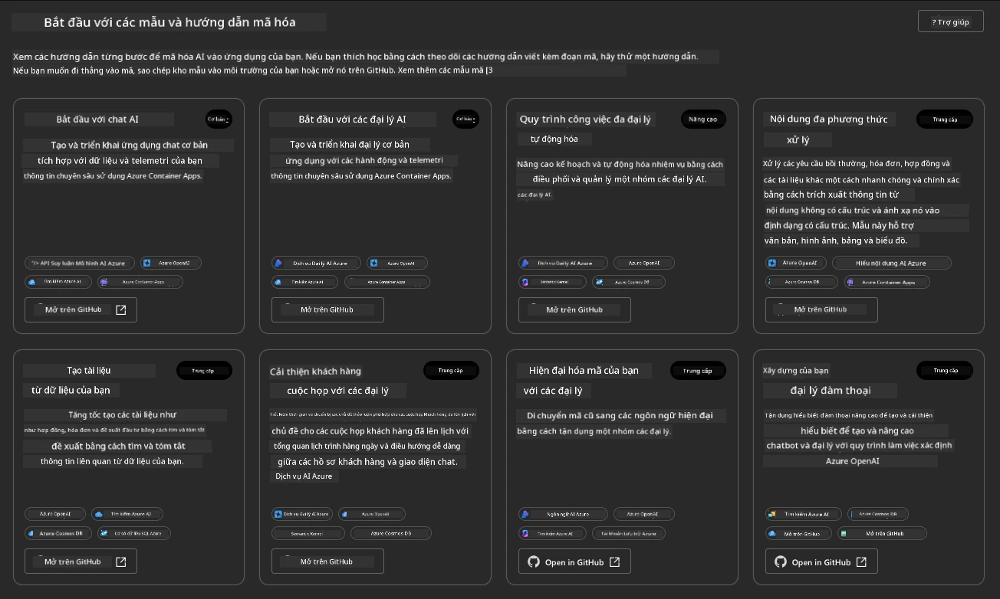


Các tùy chọn **Basic** là các mẫu khởi tạo của bạn:

1. [ ] [Bắt đầu với AI Chat](https://github.com/Azure-Samples/get-started-with-ai-chat) that deploys a basic chat application _với dữ liệu của bạn_ to Azure Container Apps. Use this to explore a basic AI chatbot scenario.
1. [X] [Bắt đầu với AI Agents](https://github.com/Azure-Samples/get-started-with-ai-agents) that also deploys a standard AI Agent (with the Foundry Agents). Use this to get familiar with agentic AI solutions involving tools and models.

Visit the second link in a new browser tab (or click `Open in GitHub` for the related card). You should see the repository for this AZD Template. Take a minute to explore the README. The application architecture looks like this:

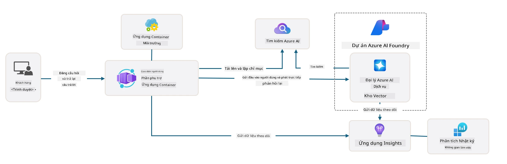

---

## 3. Kích hoạt Mẫu

Hãy thử triển khai mẫu này và đảm bảo nó hợp lệ. Chúng ta sẽ theo các hướng dẫn trong phần [Getting Started](https://github.com/Azure-Samples/get-started-with-ai-agents?tab=readme-ov-file#getting-started).

1. Chọn môi trường làm việc cho kho mẫu:

      - **GitHub Codespaces**: Click [this link](https://github.com/codespaces/new/Azure-Samples/get-started-with-ai-agents) and confirm `Create codespace`
      - **Local clone or dev container**: Clone `Azure-Samples/get-started-with-ai-agents` and open it in VS Code

1. Chờ cho tới khi terminal trong VS Code sẵn sàng, sau đó gõ lệnh sau:

   ```bash title="" linenums="0"
   azd up
   ```

Complete the workflow steps that this will trigger:

1. You will be prompted to log into Azure - follow instructions to authenticate
1. Enter a unique environment name for you - e.g., I used `nitya-mshack-azd`
1. This  will create a `.azure/` folder - you will see a subfolder with the env name
1. You will be prompted to select a subscription name - select the default
1. You will be prompted for a location - use `East US 2`

Now, you wait for the provisioning to complete. **This takes 10-15 minutes**

1. When done, your console will show a SUCCESS message like this:
      ```bash title="" linenums="0"
      SUCCESS: Your up workflow to provision and deploy to Azure completed in 10 minutes 17 seconds.
      ```
1. Your Azure Portal will now have a provisioned resource group with that env name:

      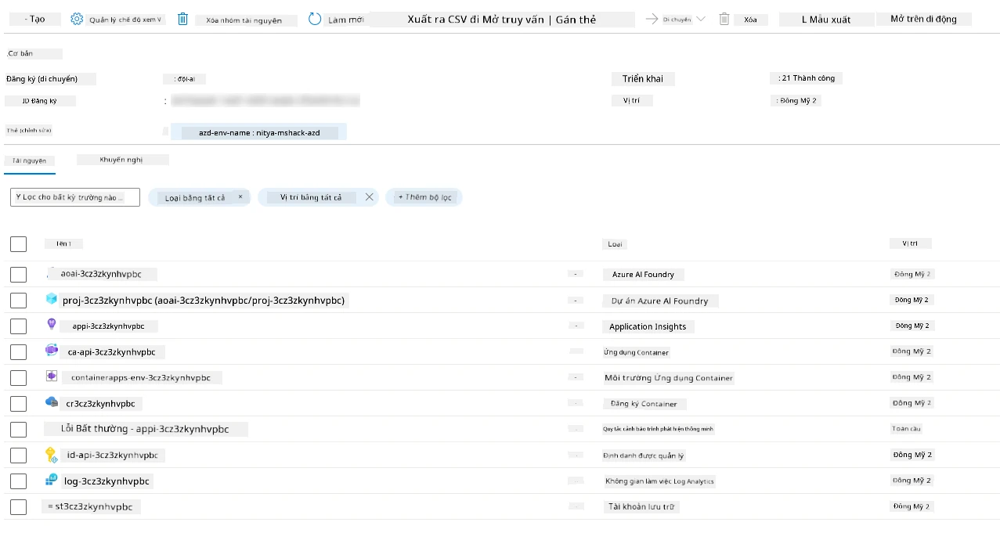

1. **Bây giờ bạn đã sẵn sàng để xác thực hạ tầng và ứng dụng được triển khai**.

---

## 4. Xác thực Mẫu

1. Visit Azure Portal [Resource Groups](https://portal.azure.com/#browse/resourcegroups) page - log in when prompted
1. Click on RG for your environment name - you see the page above

      - click on the Azure Container Apps resource
      - click on the Application Url in the _Essentials_ section (top right)

1. You should see a hosted application front-end UI like this:

   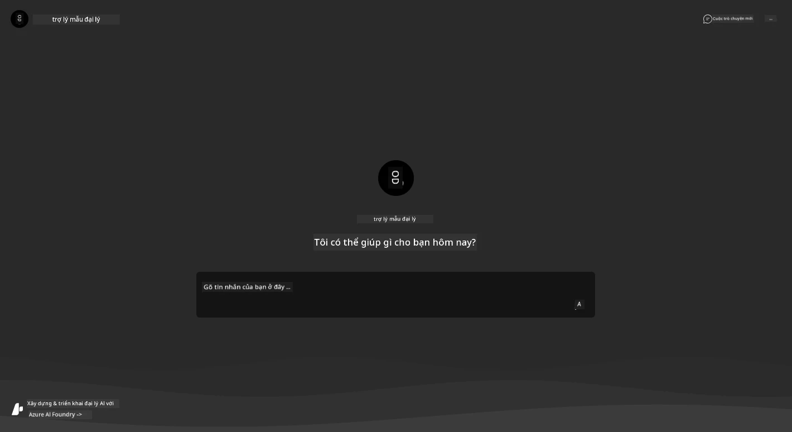

1. Try asking a couple of [sample questions](https://github.com/Azure-Samples/get-started-with-ai-agents/blob/main/docs/sample_questions.md)

      1. Ask: ```Thủ đô của Pháp là gì?``` 
      1. Ask: ```Lều tốt nhất dưới $200 cho hai người là gì, và nó bao gồm những tính năng gì?```

1. You should get answers similar to what is shown below. _But how does this work?_ 

      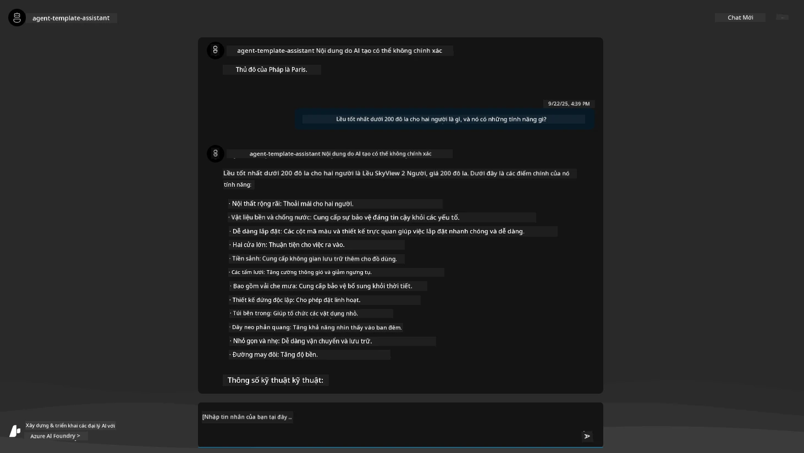

---

## 5.  Xác thực Agent

Azure Container App triển khai một endpoint kết nối tới AI Agent được cấp phát trong dự án Microsoft Foundry cho mẫu này. Hãy xem điều đó nghĩa là gì.

1. Return to the Azure Portal _Overview_ page for your resource group

1. Click on the `Microsoft Foundry` resource in that list

1. You should see this. Click the `Go to Microsoft Foundry Portal` button. 
   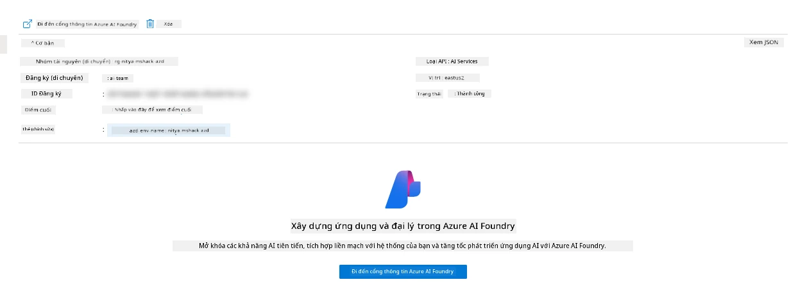

1. You should see the Foundry Project page for your AI application
   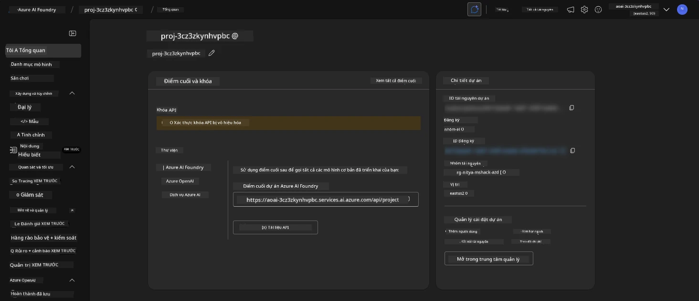

1. Click on `Agents` - you see the default Agent provisioned in your project
   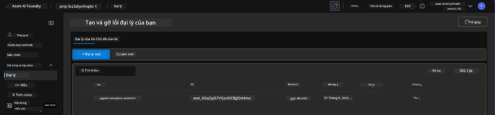

1. Select it - and you see the Agent details. Note the following:

      - The agent uses File Search by default (always)
      - The agent `Knowledge` indicates it has 32 files uploaded (for file search)
      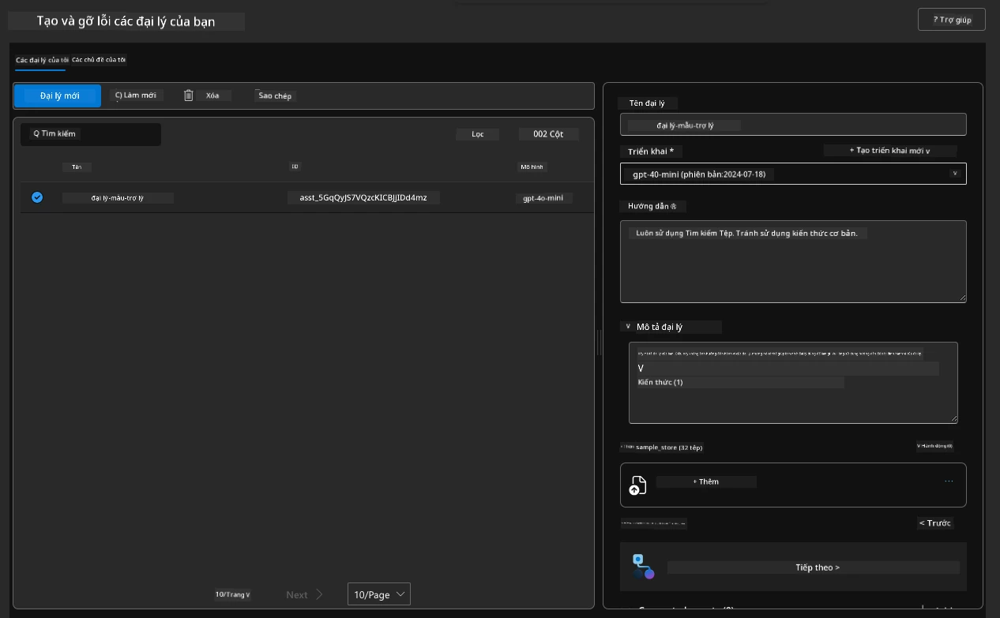

1. Look for the `Data+indexes` option in the left menu and click for details. 

      - You should see the 32 data files uploaded for knowledge.
      - These will correspond to the 12 customer files and 20 product files under `src/files` 
      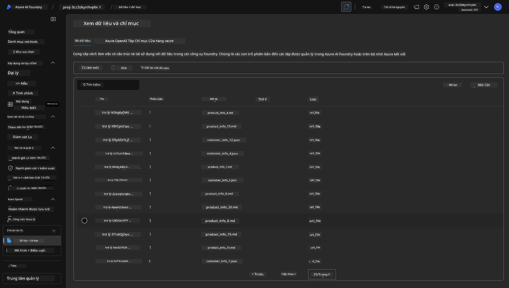

**Bạn đã xác thực hoạt động của Agent!** 

1. The agent responses are grounded in the knowledge in those files. 
1. You can now ask questions related to that data, and get grounded responses.
1. Example: `customer_info_10.json` describes the 3 purchases made by "Amanda Perez"

Revisit the browser tab with the Container App endpoint and ask: `Amanda Perez sở hữu những sản phẩm nào?`. You should see something like this:

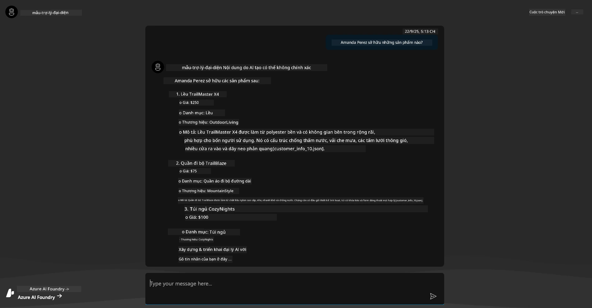

---

## 6. Agent Playground

Hãy xây dựng thêm trực giác về khả năng của Microsoft Foundry, bằng cách thử Agent trong Agents Playground. 

1. Return to the `Agents` page in Microsoft Foundry - select the default agent
1. Click the `Try in Playground` option - you should get a Playground UI like this
1. Ask the same question: `Amanda Perez sở hữu những sản phẩm nào?`

    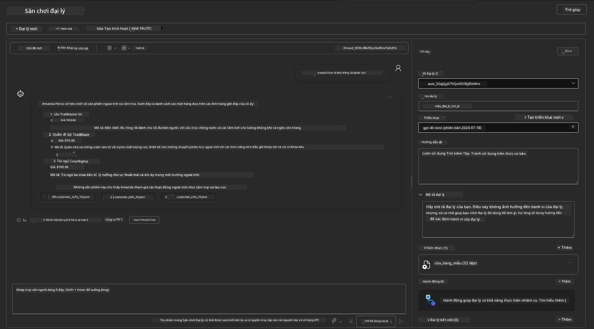

Bạn sẽ nhận được cùng (hoặc tương tự) phản hồi - nhưng bạn cũng nhận thêm thông tin có thể dùng để hiểu chất lượng, chi phí và hiệu năng của ứng dụng tác nhân của bạn. Ví dụ:

1. Lưu ý rằng phản hồi trích dẫn các tệp dữ liệu được sử dụng để "ground" phản hồi
1. Di chuột qua bất kỳ nhãn tệp nào - dữ liệu có khớp với truy vấn và phản hồi hiển thị không?

Bạn cũng thấy một hàng _stats_ phía dưới phản hồi. 

1. Di chuột qua bất kỳ chỉ số nào - ví dụ, Safety. Bạn sẽ thấy điều gì đó như thế này
1. Đánh giá được đưa ra có khớp với trực giác của bạn về mức độ an toàn của phản hồi không?

      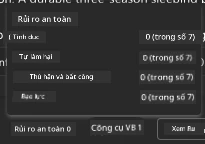

---

## 7. Built-in Observability

Observability là việc trang bị công cụ cho ứng dụng để tạo dữ liệu có thể dùng để hiểu, gỡ lỗi và tối ưu hóa hoạt động của nó. Để có cảm nhận về điều này:

1. Click the `View Run Info` button - you should see this view. This is an example of [Agent tracing](https://learn.microsoft.com/en-us/azure/ai-foundry/how-to/develop/trace-agents-sdk#view-trace-results-in-the-azure-ai-foundry-agents-playground) in action. _You can also get this view by clicking Thread Logs in the top-level menu_.

   - Get a sense for the run steps and tools engaged by the agent
   - Understand total Token count (vs. output tokens usage) for response
   - Understand the latency and where time is being spent in execution

      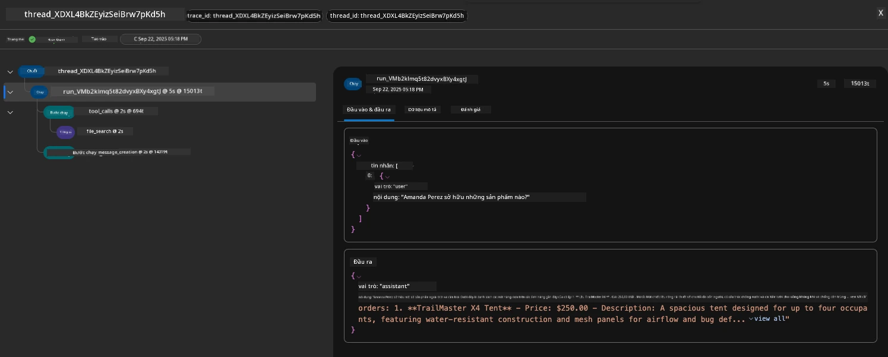

1. Click the `Metadata` tab to see additional attributes for the run, that may provide useful context for debugging issues later.   

      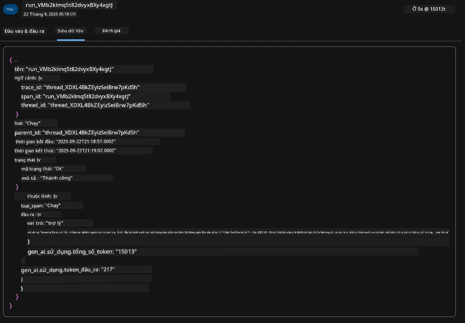


1. Click the `Evaluations` tab to see auto-assessments made on the agent response. These include safety evaluations (e.g., Self-harm) and agent-specifc evaluations (e.g., Intent resolution, Task adherence).

      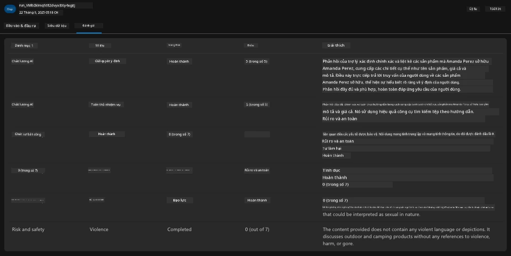

1. Last but not least, click the `Monitoring` tab in the sidebar menu.

      - Select `Resource usage` tab in the displayed page - and view the metrics.
      - Track application usage in terms of costs (tokens) and load (requests).
      - Track applicaton latency to first byte (input processing) and last byte (output).

      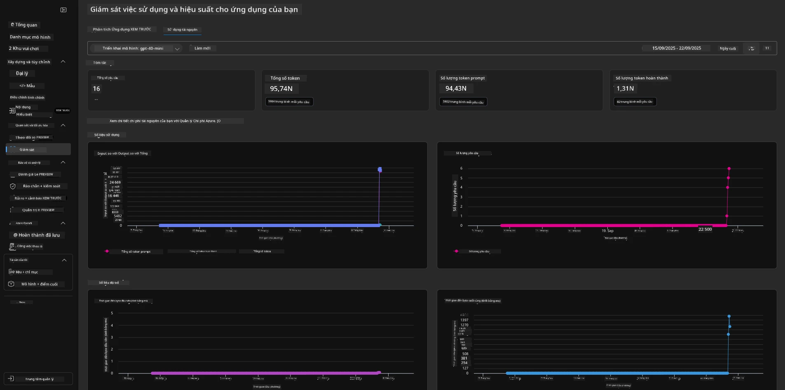

---

## 8. Environment Variables

Cho đến nay, chúng ta đã đi qua triển khai trong trình duyệt - và xác thực rằng hạ tầng được cấp phát và ứng dụng đang hoạt động. Nhưng để làm việc với mã ứng dụng theo hướng code-first, chúng ta cần cấu hình môi trường phát triển cục bộ với các biến phù hợp cần thiết để làm việc với các tài nguyên này. Sử dụng `azd` làm cho việc này trở nên dễ dàng.

1. The Azure Developer CLI [uses environment variables](https://learn.microsoft.com/en-us/azure/developer/azure-developer-cli/manage-environment-variables?tabs=bash) to store and manage configuration settings for  the application deployments.

1. Environment variables are stored in `.azure/<env-name>/.env` - this scopes them to the `env-name` environment used during deployment and helps you isolate environments between different deployment targets in the same repo.

1. Environment variables are automatically loaded by the `azd` command whenever it executes a specific command (e.g., `azd up`). Note that `azd` does not automatically read _OS-level_ environment variables (e.g., set in the shell) - instead use `azd set env` and `azd get env` to transfer information within scripts.


Let's try out a few commands:

1. Get all the environment variables set for `azd` in this environment:

      ```bash title="" linenums="0"
      azd env get-values
      ```
      
      You see something like:

      ```bash title="" linenums="0"
      AZURE_AI_AGENT_DEPLOYMENT_NAME="gpt-4.1-mini"
      AZURE_AI_AGENT_NAME="agent-template-assistant"
      AZURE_AI_EMBED_DEPLOYMENT_NAME="text-embedding-3-small"
      AZURE_AI_EMBED_DIMENSIONS=100
      ...
      ```

1. Get a specific value - e.g., I want to know if we set the `AZURE_AI_AGENT_MODEL_NAME` value

      ```bash title="" linenums="0"
      azd env get-value AZURE_AI_AGENT_MODEL_NAME 
      ```
      
      You see something like this - it was not set by default!

      ```bash title="" linenums="0"
      ERROR: key 'AZURE_AI_AGENT_MODEL_NAME' not found in the environment values
      ```

1. Set a new environment variable for `azd`. Here, we update the agent model name. _Note: any changes made will be immediately reflected in the `.azure/<env-name>/.env` file.

      ```bash title="" linenums="0"
      azd env set AZURE_AI_AGENT_MODEL_NAME gpt-4.1
      azd env set AZURE_AI_AGENT_MODEL_VERSION 2025-04-14
      azd env set AZURE_AI_AGENT_DEPLOYMENT_CAPACITY 150
      ```

      Now, we should find the value is set:

      ```bash title="" linenums="0"
      azd env get-value AZURE_AI_AGENT_MODEL_NAME 
      ```

1. Note that some resources are persistent (e.g., model deployments) and will require more than just an `azd up` to force the redeployment. Let's try tearing down the original deployment and redeploying with changed env vars.

1. **Refresh** If you had previously deployed infrastructure using an azd template - you can _refresh_ the state of your local environment variables based on the current state of your Azure deployment using this command:

      ```bash title="" linenums="0"
      azd env refresh
      ```

      Đây là một cách mạnh mẽ để _đồng bộ_ các biến môi trường giữa hai hoặc nhiều môi trường phát triển cục bộ (ví dụ: nhóm với nhiều nhà phát triển) - cho phép hạ tầng đã triển khai đóng vai trò là nguồn sự thật cho trạng thái biến môi trường. Các thành viên trong nhóm chỉ cần _làm mới_ các biến để trở lại đồng bộ.

---

## 9. Chúc mừng 🏆

Bạn vừa hoàn thành một quy trình công việc từ đầu đến cuối, trong đó bạn:

- [X] Đã chọn AZD Template mà bạn muốn sử dụng
- [X] Đã mở template trong một môi trường phát triển được hỗ trợ
- [X] Đã triển khai Template và xác nhận rằng nó hoạt động

---

<!-- CO-OP TRANSLATOR DISCLAIMER START -->
**Miễn trừ trách nhiệm**:
Tài liệu này đã được dịch bằng dịch vụ dịch thuật AI [Co-op Translator](https://github.com/Azure/co-op-translator). Mặc dù chúng tôi nỗ lực để đảm bảo độ chính xác, xin lưu ý rằng bản dịch tự động có thể chứa lỗi hoặc không chính xác. Tài liệu gốc bằng ngôn ngữ nguồn nên được coi là nguồn có thẩm quyền. Đối với thông tin quan trọng, nên sử dụng bản dịch do chuyên gia người thật thực hiện. Chúng tôi không chịu trách nhiệm cho bất kỳ hiểu lầm hoặc giải thích sai nào phát sinh từ việc sử dụng bản dịch này.
<!-- CO-OP TRANSLATOR DISCLAIMER END -->