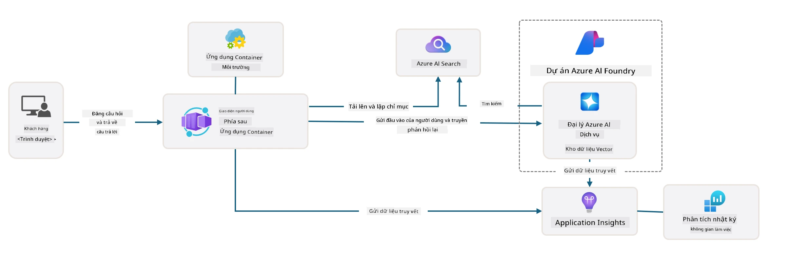

# 3. Phân tích một mẫu

!!! tip "VÀO CUỐI MODULE NÀY BẠN SẼ CÓ THỂ"

    - [ ] Kích hoạt GitHub Copilot với máy chủ MCP để hỗ trợ Azure
    - [ ] Hiểu cấu trúc thư mục mẫu AZD và các thành phần
    - [ ] Khám phá các mô hình tổ chức hạ tầng như mã (Bicep)
    - [ ] **Bài Lab 3:** Sử dụng GitHub Copilot để khám phá và hiểu kiến trúc kho lưu trữ 

---


Với các mẫu AZD và Azure Developer CLI (`azd`), chúng ta có thể nhanh chóng khởi động hành trình phát triển AI bằng các kho lưu trữ chuẩn hóa cung cấp mã mẫu, tệp hạ tầng và cấu hình - dưới dạng một _dự án khởi đầu sẵn sàng triển khai_.

**Nhưng bây giờ, chúng ta cần hiểu cấu trúc dự án và cơ sở mã - và có thể tùy chỉnh mẫu AZD - mà không cần kinh nghiệm hoặc hiểu biết trước về AZD!**

---

## 1. Kích hoạt GitHub Copilot

### 1.1 Cài đặt GitHub Copilot Chat

Đã đến lúc khám phá [GitHub Copilot with Agent Mode](https://code.visualstudio.com/docs/copilot/chat/chat-agent-mode). Bây giờ, chúng ta có thể sử dụng ngôn ngữ tự nhiên để mô tả nhiệm vụ ở mức cao, và nhận trợ giúp trong việc thực hiện. Cho bài lab này, chúng ta sẽ sử dụng [gói Copilot Free](https://github.com/github-copilot/signup) có giới hạn hàng tháng cho các lần hoàn thành và tương tác chat.

Tiện ích mở rộng có thể được cài đặt từ marketplace, và thường đã có sẵn trong Codespaces hoặc môi trường dev container. _Nhấn `Open Chat` từ trình đơn thả xuống biểu tượng Copilot - và gõ một prompt như `What can you do?`_ - bạn có thể được yêu cầu đăng nhập. **GitHub Copilot Chat đã sẵn sàng**.

### 1.2. Cài đặt MCP Servers

Để chế độ Agent hiệu quả, nó cần truy cập vào các công cụ phù hợp để giúp nó truy xuất kiến thức hoặc thực hiện hành động. Đây là nơi các máy chủ MCP có thể giúp. Chúng ta sẽ cấu hình các máy chủ sau:

1. [Azure MCP Server](../../../../../workshop/docs/instructions)
1. [Microsoft Docs MCP Server](../../../../../workshop/docs/instructions)

Để kích hoạt chúng:

1. Tạo một tệp có tên `.vscode/mcp.json` nếu nó chưa tồn tại
1. Sao chép nội dung sau vào tệp đó - và khởi động các máy chủ!
   ```json title=".vscode/mcp.json"
   {
      "servers": {
         "Azure MCP Server": {
            "command": "npx",
            "args": [
            "-y",
            "@azure/mcp@latest",
            "server",
            "start"
            ]
         },
         "microsoft.docs.mcp": {
            "type": "http",
            "url": "https://learn.microsoft.com/api/mcp"
         }
      }
   }
   ```

??? warning "Bạn có thể gặp lỗi cho biết `npx` chưa được cài đặt (nhấn để mở rộng để sửa lỗi)"

      Để khắc phục, hãy mở tệp `.devcontainer/devcontainer.json` và thêm dòng này vào phần features. Sau đó xây dựng lại container. Bạn sẽ có `npx` được cài đặt.

      ```title="" linenums="0"
         "features": {
            "ghcr.io/devcontainers/features/node:1": {},
            ...
         },
      ```

---

### 1.3. Kiểm tra GitHub Copilot Chat

**Trước tiên sử dụng `azd auth login` để xác thực với Azure từ dòng lệnh VS Code. Sử dụng `az login` chỉ khi bạn định chạy các lệnh Azure CLI trực tiếp.**

Bây giờ bạn nên có thể truy vấn trạng thái subscription Azure của mình, và hỏi về các tài nguyên đã triển khai hoặc cấu hình. Thử những prompt sau:

1. `List my Azure resource groups`
1. `#foundry list my current deployments`

Bạn cũng có thể hỏi về tài liệu Azure và nhận các phản hồi dựa trên Microsoft Docs MCP server. Thử những prompt sau:

1. `#microsoft_docs_search What is Azure Developer CLI?`
1. `#microsoft_docs_search Show me a Python tutorial to chat with deployed model`

Hoặc bạn có thể yêu cầu đoạn mã để hoàn thành một nhiệm vụ. Thử prompt này.

1. `Give me a Python code example that uses AAD for an interactive chat client`

Ở chế độ `Ask`, điều này sẽ cung cấp mã mà bạn có thể sao chép-dán và thử nghiệm. Ở chế độ `Agent`, điều này có thể tiến thêm một bước và tạo ra các tài nguyên liên quan cho bạn - bao gồm các script cài đặt và tài liệu - để giúp bạn thực hiện nhiệm vụ đó.

**Bạn giờ đã sẵn sàng để bắt đầu khám phá kho mẫu**

---

## 2. Phân tích kiến trúc

??? prompt "HỎI: Giải thích kiến trúc ứng dụng trong docs/images/architecture.png trong 1 đoạn văn"

      Ứng dụng này là một ứng dụng chat được hỗ trợ bởi AI xây dựng trên Azure, minh họa cho một kiến trúc agent hiện đại. Giải pháp tập trung xung quanh một Azure Container App lưu trữ mã ứng dụng chính, xử lý đầu vào người dùng và tạo phản hồi thông minh thông qua một agent AI.
      
      Kiến trúc tận dụng Microsoft Foundry Project làm nền tảng cho các khả năng AI, kết nối với Azure AI Services cung cấp các mô hình ngôn ngữ nền tảng (chẳng hạn như gpt-4.1-mini) và chức năng agent. Tương tác của người dùng đi qua frontend dựa trên React tới backend FastAPI, nơi giao tiếp với dịch vụ agent AI để sinh phản hồi có ngữ cảnh.
      
      Hệ thống kết hợp khả năng truy xuất kiến thức thông qua tìm kiếm tệp hoặc dịch vụ Azure AI Search, cho phép agent truy cập và trích dẫn thông tin từ các tài liệu được tải lên. Vì mục tiêu vận hành xuất sắc, kiến trúc bao gồm giám sát toàn diện thông qua Application Insights và Log Analytics Workspace để truy vết, ghi nhật ký và tối ưu hiệu năng.
      
      Azure Storage cung cấp blob storage cho dữ liệu ứng dụng và tải lên tệp, trong khi Managed Identity đảm bảo truy cập an toàn giữa các tài nguyên Azure mà không lưu trữ thông tin đăng nhập. Toàn bộ giải pháp được thiết kế để có thể mở rộng và dễ bảo trì, với ứng dụng đóng container tự động mở rộng theo nhu cầu đồng thời cung cấp bảo mật, giám sát và khả năng CI/CD tích hợp thông qua hệ sinh thái dịch vụ được quản lý của Azure.



---

## 3. Cấu trúc kho lưu trữ

!!! prompt "HỎI: Giải thích cấu trúc thư mục mẫu. Bắt đầu với sơ đồ phân cấp trực quan."

??? info "TRẢ LỜI: Sơ đồ phân cấp trực quan"

      ```bash title="" 
      get-started-with-ai-agents/
      ├── 📋 Cấu hình & Thiết lập
      │   ├── azure.yaml                    # Cấu hình Azure Developer CLI
      │   ├── docker-compose.yaml           # Container phát triển cục bộ
      │   ├── pyproject.toml                # Cấu hình dự án Python
      │   ├── requirements-dev.txt          # Phụ thuộc phát triển
      │   └── .devcontainer/                # Cấu hình dev container VS Code
      │
      ├── 🏗️ Hạ tầng (infra/)
      │   ├── main.bicep                    # Mẫu hạ tầng chính
      │   ├── api.bicep                     # Tài nguyên dành cho API
      │   ├── main.parameters.json          # Tham số hạ tầng
      │   └── core/                         # Các thành phần hạ tầng mô-đun
      │       ├── ai/                       # Cấu hình dịch vụ AI
      │       ├── host/                     # Hạ tầng hosting
      │       ├── monitor/                  # Giám sát và ghi nhật ký
      │       ├── search/                   # Thiết lập Azure AI Search
      │       ├── security/                 # Bảo mật và nhận diện
      │       └── storage/                  # Cấu hình tài khoản lưu trữ
      │
      ├── 💻 Mã nguồn ứng dụng (src/)
      │   ├── api/                          # API backend
      │   │   ├── main.py                   # Điểm vào ứng dụng FastAPI
      │   │   ├── routes.py                 # Định nghĩa route của API
      │   │   ├── search_index_manager.py   # Chức năng tìm kiếm
      │   │   ├── data/                     # Xử lý dữ liệu API
      │   │   ├── static/                   # Tài nguyên web tĩnh
      │   │   └── templates/                # Mẫu HTML
      │   ├── frontend/                     # Frontend React/TypeScript
      │   │   ├── package.json              # Phụ thuộc Node.js
      │   │   ├── vite.config.ts            # Cấu hình build Vite
      │   │   └── src/                      # Mã nguồn frontend
      │   ├── data/                         # Tệp dữ liệu mẫu
      │   │   └── embeddings.csv            # Embeddings đã được tính trước
      │   ├── files/                        # Tệp cơ sở tri thức
      │   │   ├── customer_info_*.json      # Ví dụ dữ liệu khách hàng
      │   │   └── product_info_*.md         # Tài liệu sản phẩm
      │   ├── Dockerfile                    # Cấu hình container
      │   └── requirements.txt              # Phụ thuộc Python
      │
      ├── 🔧 Tự động hóa & Script (scripts/)
      │   ├── postdeploy.sh/.ps1           # Thiết lập sau triển khai
      │   ├── setup_credential.sh/.ps1     # Cấu hình chứng thực
      │   ├── validate_env_vars.sh/.ps1    # Kiểm tra môi trường
      │   └── resolve_model_quota.sh/.ps1  # Quản lý hạn mức mô hình
      │
      ├── 🧪 Kiểm thử & Đánh giá
      │   ├── tests/                        # Kiểm thử đơn vị và tích hợp
      │   │   └── test_search_index_manager.py
      │   ├── evals/                        # Khung đánh giá agent
      │   │   ├── evaluate.py               # Trình chạy đánh giá
      │   │   ├── eval-queries.json         # Truy vấn kiểm thử
      │   │   └── eval-action-data-path.json
      │   ├── sandbox/                      # Sân chơi phát triển
      │   │   ├── 1-quickstart.py           # Ví dụ bắt đầu nhanh
      │   │   └── aad-interactive-chat.py   # Ví dụ xác thực
      │   └── airedteaming/                 # Đánh giá an toàn AI
      │       └── ai_redteaming.py          # Kiểm thử red team
      │
      ├── 📚 Tài liệu (docs/)
      │   ├── deployment.md                 # Hướng dẫn triển khai
      │   ├── local_development.md          # Hướng dẫn thiết lập cục bộ
      │   ├── troubleshooting.md            # Các vấn đề phổ biến & cách khắc phục
      │   ├── azure_account_setup.md        # Yêu cầu tiên quyết Azure
      │   └── images/                       # Tài sản tài liệu
      │
      └── 📄 Siêu dữ liệu dự án
         ├── README.md                     # Tổng quan dự án
         ├── CODE_OF_CONDUCT.md           # Nguyên tắc cộng đồng
         ├── CONTRIBUTING.md              # Hướng dẫn đóng góp
         ├── LICENSE                      # Điều khoản cấp phép
         └── next-steps.md                # Hướng dẫn sau triển khai
      ```

### 3.1. Kiến trúc ứng dụng lõi

Mẫu này tuân theo mô hình **ứng dụng web full-stack** với:

- **Backend**: REST API dựa trên Python FastAPI tích hợp Azure AI
- **Frontend**: TypeScript/React với hệ thống build Vite
- **Hạ tầng**: Mẫu Azure Bicep cho tài nguyên đám mây
- **Đóng gói container**: Docker cho triển khai nhất quán

### 3.2 Hạ tầng như mã (Bicep)

Lớp hạ tầng sử dụng các mẫu **Azure Bicep** được tổ chức theo mô-đun:

   - **`main.bicep`**: Điều phối tất cả các tài nguyên Azure
   - **`core/` modules**: Các thành phần tái sử dụng cho các dịch vụ khác nhau
      - Cấu hình dịch vụ AI (Microsoft Foundry Models, AI Search)
      - Lưu trữ container (Azure Container Apps)
      - Giám sát (Application Insights, Log Analytics)
      - Bảo mật (Key Vault, Managed Identity)

### 3.3 Mã nguồn ứng dụng (`src/`)

**Backend API (`src/api/`)**:

- REST API dựa trên FastAPI
- Tích hợp Foundry Agents
- Quản lý chỉ mục tìm kiếm cho truy xuất tri thức
- Khả năng tải lên và xử lý tệp

**Frontend (`src/frontend/`)**:

- SPA React/TypeScript hiện đại
- Vite cho phát triển nhanh và build tối ưu
- Giao diện chat cho tương tác với agent

**Cơ sở tri thức (`src/files/`)**:

- Dữ liệu mẫu về khách hàng và sản phẩm
- Minh họa truy xuất tri thức dựa trên tệp
- Ví dụ định dạng JSON và Markdown


### 3.4 DevOps & Tự động hóa

**Scripts (`scripts/`)**:

- Scripts PowerShell và Bash đa nền tảng
- Kiểm tra và thiết lập môi trường
- Cấu hình sau triển khai
- Quản lý hạn mức mô hình

**Tích hợp Azure Developer CLI**:

- Cấu hình `azure.yaml` cho quy trình `azd`
- Tự động cung cấp và triển khai
- Quản lý biến môi trường

### 3.5 Kiểm thử & Đảm bảo chất lượng

**Khung đánh giá (`evals/`)**:

- Đánh giá hiệu năng agent
- Kiểm thử chất lượng phản hồi truy vấn
- Pipeline đánh giá tự động

**An toàn AI (`airedteaming/`)**:

- Kiểm thử red team cho an toàn AI
- Quét lỗ hổng bảo mật
- Thực hành AI có trách nhiệm

---

## 4. Chúc mừng 🏆

Bạn đã sử dụng GitHub Copilot Chat với các máy chủ MCP thành công để khám phá kho lưu trữ.

- [X] Đã kích hoạt GitHub Copilot cho Azure
- [X] Đã hiểu kiến trúc ứng dụng
- [X] Đã khám phá cấu trúc mẫu AZD

Điều này giúp bạn nắm được các tài sản _infrastructure as code_ cho mẫu này. Tiếp theo, chúng ta sẽ xem tệp cấu hình cho AZD.

---

<!-- CO-OP TRANSLATOR DISCLAIMER START -->
**Miễn trừ trách nhiệm**:
Tài liệu này đã được dịch bằng dịch vụ dịch thuật AI [Co-op Translator](https://github.com/Azure/co-op-translator). Mặc dù chúng tôi nỗ lực để đảm bảo độ chính xác, xin lưu ý rằng các bản dịch tự động có thể chứa lỗi hoặc không chính xác. Tài liệu gốc bằng ngôn ngữ ban đầu nên được coi là nguồn tham khảo chính thức. Đối với thông tin quan trọng, nên sử dụng dịch vụ dịch thuật chuyên nghiệp do con người thực hiện. Chúng tôi không chịu trách nhiệm đối với bất kỳ sự hiểu lầm hoặc diễn giải sai nào phát sinh từ việc sử dụng bản dịch này.
<!-- CO-OP TRANSLATOR DISCLAIMER END -->