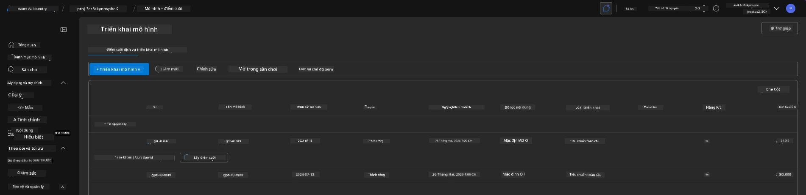
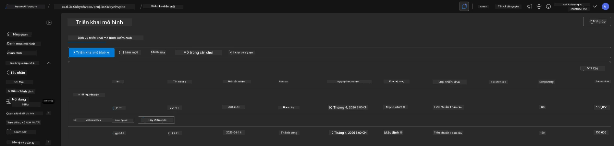

# 6. Dọn dẹp cơ sở hạ tầng

!!! tip "ĐẾN CUỐI BÀI HỌC NÀY BẠN SẼ CÓ THỂ"

    - [ ] Hiểu tầm quan trọng của việc dọn dẹp tài nguyên và quản lý chi phí
    - [ ] Sử dụng `azd down` để gỡ bỏ hạ tầng một cách an toàn
    - [ ] Khôi phục dịch vụ nhận thức bị xóa mềm nếu cần
    - [ ] **Bài Lab 6:** Dọn dẹp tài nguyên Azure và xác minh việc gỡ bỏ

---

## Bài Tập Bổ Sung

Trước khi chúng ta gỡ bỏ dự án, hãy dành vài phút để khám phá mở.

!!! info "Thử các gợi ý khám phá này"

    **Thử nghiệm với GitHub Copilot:**
    
    1. Hỏi: `Những mẫu AZD nào khác tôi có thể thử cho các kịch bản đa tác nhân?`
    2. Hỏi: `Làm thế nào để tôi tùy chỉnh hướng dẫn tác nhân cho trường hợp sử dụng chăm sóc sức khỏe?`
    3. Hỏi: `Những biến môi trường nào kiểm soát tối ưu hóa chi phí?`
    
    **Khám phá Azure Portal:**
    
    1. Xem xét các chỉ số Application Insights cho triển khai của bạn
    2. Kiểm tra phân tích chi phí cho các tài nguyên đã được cấp phát
    3. Khám phá lại khu vực thử nghiệm agent trên cổng Microsoft Foundry lần nữa

---

## Gỡ bỏ Hạ tầng

1. Tearing down infrastructure is as easy as:
      
      ```bash title="" linenums="0"
      azd down --purge
      ```
1. The `--purge` flag ensures that it also purges soft-deleted Cognitive Service resources, thereby releasing quota held by these resources. Once complete you will see something like this:
      
      ```bash title="" linenums="0"
      ? Total resources to delete: 11, are you sure you want to continue? Yes
      Deleting your resources can take some time.
      (✓) Done: Deleted resource group rg-nitya-mshack-azd
      (✓) Done: Purging Cognitive Account: aoai-3cz3zkynhvpbc

      SUCCESS: Your application was removed from Azure in 11 minutes 4 seconds.
      ```

1. (Tùy chọn) Nếu bạn chạy lại `azd up` bây giờ, bạn sẽ nhận thấy mô hình gpt-4.1 được triển khai vì biến môi trường đã bị thay đổi (và được lưu) trong thư mục cục bộ `.azure`。 

      Đây là các triển khai mô hình **trước**:

      

      Và đây là **sau**:
      

---

<!-- CO-OP TRANSLATOR DISCLAIMER START -->
**Miễn trừ trách nhiệm**:
Tài liệu này đã được dịch bằng dịch vụ dịch thuật AI [Co-op Translator](https://github.com/Azure/co-op-translator). Mặc dù chúng tôi nỗ lực đảm bảo độ chính xác, xin lưu ý rằng các bản dịch tự động có thể chứa lỗi hoặc thông tin không chính xác. Tài liệu gốc bằng ngôn ngữ gốc nên được coi là nguồn có thẩm quyền. Đối với thông tin quan trọng, nên sử dụng bản dịch chuyên nghiệp do con người thực hiện. Chúng tôi không chịu trách nhiệm cho bất kỳ hiểu lầm hoặc diễn giải sai nào phát sinh từ việc sử dụng bản dịch này.
<!-- CO-OP TRANSLATOR DISCLAIMER END -->