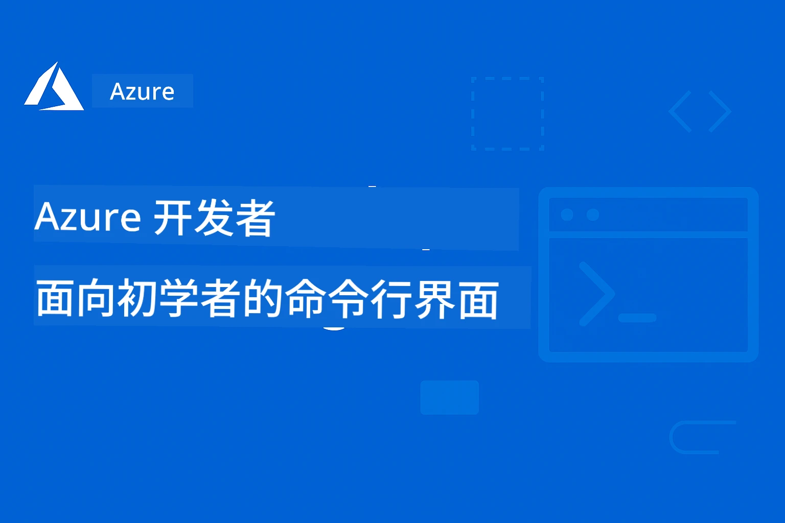

# AZD 入门：结构化学习之旅

 

[](https://GitHub.com/microsoft/azd-for-beginners/watchers/)
[](https://GitHub.com/microsoft/azd-for-beginners/network/)
[](https://GitHub.com/microsoft/azd-for-beginners/stargazers/)

[](https://discord.gg/microsoft-azure)
[](https://discord.gg/nTYy5BXMWG)

---

### 自动翻译（始终保持最新）

<!-- CO-OP TRANSLATOR LANGUAGES TABLE START -->
[Arabic](../ar/README.md) | [Bengali](../bn/README.md) | [Bulgarian](../bg/README.md) | [Burmese (Myanmar)](../my/README.md) | [Chinese (Simplified)](./README.md) | [Chinese (Traditional, Hong Kong)](../zh-HK/README.md) | [Chinese (Traditional, Macau)](../zh-MO/README.md) | [Chinese (Traditional, Taiwan)](../zh-TW/README.md) | [Croatian](../hr/README.md) | [Czech](../cs/README.md) | [Danish](../da/README.md) | [Dutch](../nl/README.md) | [Estonian](../et/README.md) | [Finnish](../fi/README.md) | [French](../fr/README.md) | [German](../de/README.md) | [Greek](../el/README.md) | [Hebrew](../he/README.md) | [Hindi](../hi/README.md) | [Hungarian](../hu/README.md) | [Indonesian](../id/README.md) | [Italian](../it/README.md) | [Japanese](../ja/README.md) | [Kannada](../kn/README.md) | [Korean](../ko/README.md) | [Lithuanian](../lt/README.md) | [Malay](../ms/README.md) | [Malayalam](../ml/README.md) | [Marathi](../mr/README.md) | [Nepali](../ne/README.md) | [Nigerian Pidgin](../pcm/README.md) | [Norwegian](../no/README.md) | [Persian (Farsi)](../fa/README.md) | [Polish](../pl/README.md) | [Portuguese (Brazil)](../pt-BR/README.md) | [Portuguese (Portugal)](../pt-PT/README.md) | [Punjabi (Gurmukhi)](../pa/README.md) | [Romanian](../ro/README.md) | [Russian](../ru/README.md) | [Serbian (Cyrillic)](../sr/README.md) | [Slovak](../sk/README.md) | [Slovenian](../sl/README.md) | [Spanish](../es/README.md) | [Swahili](../sw/README.md) | [Swedish](../sv/README.md) | [Tagalog (Filipino)](../tl/README.md) | [Tamil](../ta/README.md) | [Telugu](../te/README.md) | [Thai](../th/README.md) | [Turkish](../tr/README.md) | [Ukrainian](../uk/README.md) | [Urdu](../ur/README.md) | [Vietnamese](../vi/README.md)

> **更喜欢本地克隆？**

> 此仓库包含 50 多种语言的翻译，显著增加了下载大小。要在不下载翻译的情况下克隆，请使用 sparse checkout：
> ```bash
> git clone --filter=blob:none --sparse https://github.com/microsoft/AZD-for-beginners.git
> cd AZD-for-beginners
> git sparse-checkout set --no-cone '/*' '!translations' '!translated_images'
> ```
> 这将为您提供完成课程所需的一切，并大幅加快下载速度。
<!-- CO-OP TRANSLATOR LANGUAGES TABLE END -->

## 🚀 什么是 Azure Developer CLI (azd)？

**Azure Developer CLI (azd)** 是一个面向开发者的命令行工具，使将应用部署到 Azure 变得简单。您无需手动创建和连接数十个 Azure 资源，只需一个命令即可部署整个应用。

### `azd up` 的魔力

```bash
# 这个单一命令完成所有工作：
# ✅ 创建所有 Azure 资源
# ✅ 配置网络和安全
# ✅ 构建您的应用代码
# ✅ 部署到 Azure
# ✅ 给您一个可用的网址
azd up
```

**就是这样！** 无需点击 Azure 门户，无需先学习复杂的 ARM 模板，也无需手动配置——只需在 Azure 上获得可运行的应用。

---

## ❓ Azure Developer CLI 与 Azure CLI：有何不同？

这是初学者最常问的问题。下面给出简单回答：

| Feature | **Azure CLI (`az`)** | **Azure Developer CLI (`azd`)** |
|---------|---------------------|--------------------------------|
| **Purpose** | 管理单个 Azure 资源 | 部署完整应用 |
| **Mindset** | 以基础设施为中心 | 以应用为中心 |
| **Example** | `az webapp create --name myapp...` | `azd up` |
| **Learning Curve** | 需要了解 Azure 服务 | 只需了解您的应用 |
| **Best For** | DevOps、基础设施 | 开发者、原型验证 |

### 简单类比

- **Azure CLI** 就像拥有建房子的所有工具——锤子、锯子、钉子。您可以建造任何东西，但需要知道施工方法。
- **Azure Developer CLI** 就像雇了一个承包商——您描述想要的内容，他们负责建造。

### 何时使用哪一个

| Scenario | Use This |
|----------|----------|
| "I want to deploy my web app quickly" | `azd up` |
| "I need to create just a storage account" | `az storage account create` |
| "I'm building a full AI application" | `azd init --template azure-search-openai-demo` |
| "I need to debug a specific Azure resource" | `az resource show` |
| "I want production-ready deployment in minutes" | `azd up --environment production` |

### 它们可以一起工作！

AZD 在底层使用 Azure CLI。您可以同时使用两者：
```bash
# 使用 AZD 部署您的应用
azd up

# 然后使用 Azure CLI 微调特定资源
az webapp config set --name myapp --always-on true
```

---

## 🌟 在 Awesome AZD 中查找模板

不要从零开始！**Awesome AZD** 是社区收集的可直接部署模板：

| Resource | Description |
|----------|-------------|
| 🔗 [**Awesome AZD 画廊**](https://azure.github.io/awesome-azd/) | 浏览 200+ 模板并一键部署 |
| 🔗 [**提交模板**](https://github.com/Azure/awesome-azd/issues) | 向社区贡献您的模板 |
| 🔗 [**GitHub 仓库**](https://github.com/Azure/awesome-azd) | 点星并浏览源码 |

### 来自 Awesome AZD 的流行 AI 模板

```bash
# 使用 Azure OpenAI + AI 搜索的 RAG 聊天
azd init --template azure-search-openai-demo

# 快速 AI 聊天应用程序
azd init --template openai-chat-app-quickstart

# 使用 Foundry Agents 的 AI 代理
azd init --template get-started-with-ai-agents
```

---

## 🎯 三步入门

### 第 1 步：安装 AZD（2 分钟）

**Windows:**  
```powershell
winget install microsoft.azd
```

**macOS:**  
```bash
brew tap azure/azd && brew install azd
```

**Linux:**  
```bash
curl -fsSL https://aka.ms/install-azd.sh | bash
```

### 第 2 步：登录到 Azure

```bash
azd auth login
```

### 第 3 步：部署您的第一个应用

```bash
# 从模板初始化
azd init --template todo-nodejs-mongo

# 部署到 Azure（创建所有内容！）
azd up
```

**🎉 就这样！** 您的应用现在已在 Azure 上运行。

### 清理（别忘了！）

```bash
# Remove all resources when done experimenting
azd down --force --purge
```

---

## 📚 如何使用本课程

本课程为**渐进式学习**设计——从您熟悉的内容开始，逐步深入：

| Your Experience | Start Here |
|-----------------|------------|
| **刚接触 Azure** | [Chapter 1: Foundation](../..) |
| **了解 Azure，但刚接触 AZD** | [Chapter 1: Foundation](../..) |
| **想部署 AI 应用** | [Chapter 2: AI-First Development](../..) |
| **想要动手练习** | [🎓 Interactive Workshop](workshop/README.md) - 3-4 小时指导实验 |
| **需要生产级模式** | [Chapter 8: Production & Enterprise](../..) |

### 快速设置

1. **Fork 此仓库**: [](https://GitHub.com/microsoft/azd-for-beginners/fork)
2. **克隆仓库**: `git clone https://github.com/YOUR-USERNAME/azd-for-beginners.git`
3. **获取帮助**: [Azure Discord Community](https://discord.com/invite/ByRwuEEgH4)

> **更喜欢本地克隆？**

> 此仓库包含 50 多种语言的翻译，显著增加了下载大小。要在不下载翻译的情况下克隆，请使用 sparse checkout:
> ```bash
> git clone --filter=blob:none --sparse https://github.com/microsoft/AZD-for-beginners.git
> cd AZD-for-beginners
> git sparse-checkout set --no-cone '/*' '!translations' '!translated_images'
> ```
> 这将为您提供完成课程所需的一切，并大幅加快下载速度。


## 课程概览

通过结构化章节掌握 Azure Developer CLI (azd)。**特别关注使用 Microsoft Foundry 集成部署 AI 应用。**

### 为什么本课程对现代开发者至关重要

根据 Microsoft Foundry Discord 社区的洞察，**45% 的开发者希望将 AZD 用于 AI 工作负载**，但在以下方面遇到挑战：
- 复杂的多服务 AI 架构
- 生产级 AI 部署最佳实践
- Azure AI 服务的集成与配置
- AI 工作负载的成本优化
- 排查 AI 特定的部署问题

### 学习目标

完成本结构化课程后，您将能够：
- **掌握 AZD 基础**：核心概念、安装与配置
- **部署 AI 应用**：将 AZD 与 Microsoft Foundry 服务结合使用
- **实施基础设施即代码**：使用 Bicep 模板管理 Azure 资源
- **排查部署问题**：解决常见问题并进行调试
- **优化生产环境**：安全、扩展、监控与成本管理
- **构建多代理解决方案**：部署复杂的 AI 架构

## 🗺️ 课程地图：按章节快速导航

每章均有专门的 README，包含学习目标、快速入门和练习：

| Chapter | Topic | Lessons | Duration | Complexity |
|---------|-------|---------|----------|------------|
| **[第 1 章：基础](docs/chapter-01-foundation/README.md)** | 入门 | [AZD 基础](docs/chapter-01-foundation/azd-basics.md) &#124; [安装](docs/chapter-01-foundation/installation.md) &#124; [第一个项目](docs/chapter-01-foundation/first-project.md) | 30-45 min | ⭐ |
| **[第 2 章：AI 开发](docs/chapter-02-ai-development/README.md)** | AI 优先应用 | [Foundry 集成](docs/chapter-02-ai-development/microsoft-foundry-integration.md) &#124; [AI 代理](docs/chapter-02-ai-development/agents.md) &#124; [模型部署](docs/chapter-02-ai-development/ai-model-deployment.md) &#124; [工作坊](docs/chapter-02-ai-development/ai-workshop-lab.md) | 1-2 hrs | ⭐⭐ |
| **[第 3 章：配置](docs/chapter-03-configuration/README.md)** | 认证与安全 | [配置](docs/chapter-03-configuration/configuration.md) &#124; [认证与安全](docs/chapter-03-configuration/authsecurity.md) | 45-60 min | ⭐⭐ |
| **[第 4 章：基础设施](docs/chapter-04-infrastructure/README.md)** | IaC 与部署 | [部署指南](docs/chapter-04-infrastructure/deployment-guide.md) &#124; [预配](docs/chapter-04-infrastructure/provisioning.md) | 1-1.5 hrs | ⭐⭐⭐ |
| **[第5章：多智能体](docs/chapter-05-multi-agent/README.md)** | AI 代理解决方案 | [零售场景](examples/retail-scenario.md) &#124; [协调模式](docs/chapter-06-pre-deployment/coordination-patterns.md) | 2-3 小时 | ⭐⭐⭐⭐ |
| **[第6章：预部署](docs/chapter-06-pre-deployment/README.md)** | 规划与验证 | [预检](docs/chapter-06-pre-deployment/preflight-checks.md) &#124; [容量规划](docs/chapter-06-pre-deployment/capacity-planning.md) &#124; [SKU 选择](docs/chapter-06-pre-deployment/sku-selection.md) &#124; [Application Insights](docs/chapter-06-pre-deployment/application-insights.md) | 1 小时 | ⭐⭐ |
| **[第7章：故障排除](docs/chapter-07-troubleshooting/README.md)** | 调试与修复 | [常见问题](docs/chapter-07-troubleshooting/common-issues.md) &#124; [调试](docs/chapter-07-troubleshooting/debugging.md) &#124; [AI 问题](docs/chapter-07-troubleshooting/ai-troubleshooting.md) | 1-1.5 小时 | ⭐⭐ |
| **[第8章：生产](docs/chapter-08-production/README.md)** | 企业模式 | [生产实践](docs/chapter-08-production/production-ai-practices.md) | 2-3 小时 | ⭐⭐⭐⭐ |
| **[🎓 工作坊](workshop/README.md)** | 动手实验室 | [介绍](workshop/docs/instructions/0-Introduction.md) &#124; [选择](workshop/docs/instructions/1-Select-AI-Template.md) &#124; [验证](workshop/docs/instructions/2-Validate-AI-Template.md) &#124; [拆解](workshop/docs/instructions/3-Deconstruct-AI-Template.md) &#124; [配置](workshop/docs/instructions/4-Configure-AI-Template.md) &#124; [自定义](workshop/docs/instructions/5-Customize-AI-Template.md) &#124; [拆除基础设施](workshop/docs/instructions/6-Teardown-Infrastructure.md) &#124; [总结](workshop/docs/instructions/7-Wrap-up.md) | 3-4 小时 | ⭐⭐ |

**课程总时长：** ~10-14 小时 | **技能进阶：** 初学者 → 生产就绪

---

## 📚 学习章节

*根据经验水平和目标选择学习路径*

### 🚀 第1章：基础与快速入门
**先决条件**：Azure 订阅，基本命令行知识  
**时长**：30-45 分钟  
**复杂度**：⭐

#### 你将学到的内容
- 了解 Azure Developer CLI 基础知识
- 在你的平台上安装 AZD
- 你的第一次成功部署

#### 学习资源
- **🎯 入门**： [什么是 Azure Developer CLI？](../..)
- **📖 理论**： [AZD 基础](docs/chapter-01-foundation/azd-basics.md) - 核心概念与术语
- **⚙️ 设置**： [安装与设置](docs/chapter-01-foundation/installation.md) - 平台特定指南
- **🛠️ 动手**： [你的第一个项目](docs/chapter-01-foundation/first-project.md) - 逐步教程
- **📋 快速参考**： [命令备忘单](resources/cheat-sheet.md)

#### 实践练习
```bash
# 快速安装检查
azd version

# 部署你的第一个应用程序
azd init --template todo-nodejs-mongo
azd up
```

**💡 章节成果**：使用 AZD 成功将一个简单的 Web 应用部署到 Azure

**✅ 成功验证：**
```bash
# 完成第一章后，您应该能够：
azd version              # 显示已安装的版本
azd init --template todo-nodejs-mongo  # 初始化项目
azd up                  # 部署到 Azure
azd show                # 显示正在运行的应用的 URL
# 应用在浏览器中打开并正常工作
azd down --force --purge  # 清理资源
```

**📊 时间投入：** 30-45 分钟  
**📈 完成后技能水平：** 能够独立部署基础应用程序

**✅ 成功验证：**
```bash
# 完成第1章后，你应该能够：
azd version              # 显示已安装的版本
azd init --template todo-nodejs-mongo  # 初始化项目
azd up                  # 部署到 Azure
azd show                # 显示正在运行的应用的 URL
# 应用在浏览器中打开并正常运行
azd down --force --purge  # 清理资源
```

**📊 时间投入：** 30-45 分钟  
**📈 完成后技能水平：** 能够独立部署基础应用程序

---

### 🤖 第2章：以 AI 为先的发展（推荐给 AI 开发者）
**先决条件**：完成第1章  
**时长**：1-2 小时  
**复杂度**：⭐⭐

#### 你将学到的内容
- Microsoft Foundry 与 AZD 的集成
- 部署 AI 驱动的应用
- 理解 AI 服务配置

#### 学习资源
- **🎯 入门**： [Microsoft Foundry 集成](docs/chapter-02-ai-development/microsoft-foundry-integration.md)
- **🤖 AI 代理**： [AI 代理指南](docs/chapter-02-ai-development/agents.md) - 使用 AZD 部署智能代理
- **📖 模式**： [AI 模型部署](docs/chapter-02-ai-development/ai-model-deployment.md) - 部署和管理 AI 模型
- **🛠️ 研讨会**： [AI 研讨会实验](docs/chapter-02-ai-development/ai-workshop-lab.md) - 使你的 AI 解决方案适配 AZD
- **🎥 互动指南**： [Workshop Materials](workshop/README.md) - 基于浏览器的学习，使用 MkDocs * DevContainer 环境
- **📋 模板**： [Microsoft Foundry 模板](../..)
- **📝 示例**： [AZD 部署示例](examples/README.md)

#### 实践练习
```bash
# 部署你的第一个 AI 应用
azd init --template azure-search-openai-demo
azd up

# 尝试更多 AI 模板
azd init --template openai-chat-app-quickstart
azd init --template agent-openai-python-prompty
```

**💡 章节成果**：部署并配置一个具有 RAG 功能的 AI 聊天应用

**✅ 成功验证：**
```bash
# 在第2章之后，您应该能够：
azd init --template azure-search-openai-demo
azd up
# 测试 AI 聊天界面
# 提出问题并获得带来源的 AI 生成回答
# 验证搜索集成是否正常工作
azd monitor  # 检查 Application Insights 是否显示遥测数据
azd down --force --purge
```

**📊 时间投入：** 1-2 小时  
**📈 完成后技能水平：** 能够部署和配置生产就绪的 AI 应用  
**💰 成本认知：** 了解每月 $80-150 的开发成本，生产每月 $300-3500 的成本

#### 💰 AI 部署的成本考虑

**开发环境（估计 $80-150/月）：**
- Azure OpenAI (按使用付费)：$0-50/月（基于令牌使用量）
- AI Search（基础层）：$75/月
- Container Apps（按消费）：$0-20/月
- 存储（标准）：$1-5/月

**生产环境（估计 $300-3,500+/月）：**
- Azure OpenAI（为了稳定性能的 PTU）：$3,000+/月 OR 高负载下按使用付费
- AI Search（标准层）：$250/月
- Container Apps（专用）：$50-100/月
- Application Insights：$5-50/月
- 存储（高级）：$10-50/月

**💡 成本优化建议：**
- 使用 **Free Tier** Azure OpenAI 进行学习（包含每月 50,000 个令牌）
- 在不主动开发时运行 `azd down` 以释放资源
- 从按消费计费开始，仅在生产环境下升级到 PTU
- 使用 `azd provision --preview` 在部署前估算成本
- 启用自动伸缩：只为实际使用付费

**成本监控：**
```bash
# 检查估算的每月费用
azd provision --preview

# 在 Azure 门户中监控实际费用
az consumption budget list --resource-group <your-rg>
```

---

### ⚙️ 第3章：配置与身份验证
**先决条件**：完成第1章  
**时长**：45-60 分钟  
**复杂度**：⭐⭐

#### 你将学到的内容
- 环境配置与管理
- 身份验证与安全最佳实践
- 资源命名与组织

#### 学习资源
- **📖 配置**： [配置指南](docs/chapter-03-configuration/configuration.md) - 环境设置
- **🔐 安全**： [身份验证模式与托管身份](docs/chapter-03-configuration/authsecurity.md) - 身份验证模式
- **📝 示例**： [数据库应用示例](examples/database-app/README.md) - AZD 数据库示例

#### 实践练习
- 配置多个环境（dev、staging、prod）
- 设置托管身份认证
- 实现特定于环境的配置

**💡 章节成果**：通过适当的身份验证与安全措施管理多个环境

---

### 🏗️ 第4章：基础设施即代码与部署
**先决条件**：完成第1-3章  
**时长**：1-1.5 小时  
**复杂度**：⭐⭐⭐

#### 你将学到的内容
- 高级部署模式
- 使用 Bicep 的基础设施即代码
- 资源提供策略

#### 学习资源
- **📖 部署**： [部署指南](docs/chapter-04-infrastructure/deployment-guide.md) - 完整工作流
- **🏗️ 资源提供**： [资源提供](docs/chapter-04-infrastructure/provisioning.md) - Azure 资源管理
- **📝 示例**： [容器应用示例](../../examples/container-app) - 容器化部署

#### 实践练习
- 创建自定义 Bicep 模板
- 部署多服务应用
- 实施蓝绿部署策略

**💡 章节成果**：使用自定义基础设施模板部署复杂的多服务应用

---

### 🎯 第5章：多智能体 AI 解决方案（高级）
**先决条件**：完成第1-2章  
**时长**：2-3 小时  
**复杂度**：⭐⭐⭐⭐

#### 你将学到的内容
- 多智能体架构模式
- 代理编排与协调
- 面向生产的 AI 部署

#### 学习资源
- **🤖 特色项目**： [零售多智能体解决方案](examples/retail-scenario.md) - 完整实现
- **🛠️ ARM 模板**： [ARM 模板包](../../examples/retail-multiagent-arm-template) - 一键部署
- **📖 架构**： [多智能体协调模式](docs/chapter-06-pre-deployment/coordination-patterns.md) - 模式

#### 实践练习
```bash
# 部署完整的零售多代理解决方案
cd examples/retail-multiagent-arm-template
./deploy.sh

# 探索代理配置
az deployment group show --resource-group <rg-name> --name <deployment-name>
```

**💡 章节成果**：部署并管理具有客户代理和库存代理的生产就绪多智能体 AI 解决方案

---

### 🔍 第6章：预部署验证与规划
**先决条件**：完成第4章  
**时长**：1 小时  
**复杂度**：⭐⭐

#### 你将学到的内容
- 容量规划与资源验证
- SKU 选择策略
- 预检与自动化

#### 学习资源
- **📊 规划**： [容量规划](docs/chapter-06-pre-deployment/capacity-planning.md) - 资源验证
- **💰 选择**： [SKU 选择](docs/chapter-06-pre-deployment/sku-selection.md) - 成本有效的选择
- **✅ 验证**： [预检](docs/chapter-06-pre-deployment/preflight-checks.md) - 自动化脚本

#### 实践练习
- 运行容量验证脚本
- 为成本优化 SKU 选择
- 实施自动化预部署检查

**💡 章节成果**：在执行前验证并优化部署

---

### 🚨 第7章：故障排除与调试
**先决条件**：完成任一部署章节  
**时长**：1-1.5 小时  
**复杂度**：⭐⭐

#### 你将学到的内容
- 系统化调试方法
- 常见问题与解决方案
- AI 特定的故障排除

#### 学习资源
- **🔧 常见问题**： [常见问题](docs/chapter-07-troubleshooting/common-issues.md) - 常见问答与解决方案
- **🕵️ 调试**： [调试指南](docs/chapter-07-troubleshooting/debugging.md) - 逐步策略
- **🤖 AI 问题**： [AI 专用故障排除](docs/chapter-07-troubleshooting/ai-troubleshooting.md) - AI 服务问题

#### 实践练习
- 诊断部署失败
- 解决身份验证问题
- 调试 AI 服务连接问题

**💡 章节成果**：能够独立诊断并解决常见部署问题

---

### 🏢 第8章：生产与企业模式
**先决条件**：完成第1-4章  
**时长**：2-3 小时  
**复杂度**：⭐⭐⭐⭐

#### 你将学到的内容
- 生产部署策略
- 企业安全模式
- 监控与成本优化

#### 学习资源
- **🏭 生产**： [生产 AI 最佳实践](docs/chapter-08-production/production-ai-practices.md) - 企业模式
- **📝 示例**： [微服务示例](../../examples/microservices) - 复杂架构
- **📊 监控**： [Application Insights 集成](docs/chapter-06-pre-deployment/application-insights.md) - 监控

#### 实践练习
- 实施企业安全模式
- 设置全面监控
- 在适当的治理下部署到生产环境

**💡 章节成果**：部署具备完整生产能力的企业就绪应用

---

## 🎓 工作坊概览：动手学习体验

> **⚠️ 工作坊状态：正在开发中**  
> 工作坊材料目前正在开发和完善中。核心模块可用，但某些高级部分尚不完整。我们正在积极完成所有内容。 [跟踪进度 →](workshop/README.md)

### 互动工作坊材料
**使用基于浏览器的工具和引导练习进行全面的动手学习**
我们的研讨会材料提供结构化、互动的学习体验，与上面的基于章节的课程互为补充。该研讨会既适合自学，也适合讲师授课。

#### 🛠️ 研讨会特点
- **基于浏览器的界面**: 完整的 MkDocs 驱动研讨会，带搜索、复制和主题功能
- **GitHub Codespaces 集成**: 一键开发环境设置
- **结构化学习路径**: 8 模块指导练习（总计 3-4 小时）
- **渐进方法论**: 介绍 → 选择 → 验证 → 解构 → 配置 → 自定义 → 拆除 → 总结
- **交互式 DevContainer 环境**: 预配置工具和依赖

#### 📚 研讨会模块结构
该研讨会遵循一个**8 模块的渐进方法论**，带您从探索走向部署精通：

| 模块 | 主题 | 您将做什么 | 时长 |
|--------|-------|----------------|----------|
| **0. 介绍** | 研讨会概览 | 了解学习目标、先决条件和研讨会结构 | 15 分钟 |
| **1. 选择** | 模板发现 | 探索 AZD 模板并为您的场景选择合适的 AI 模板 | 20 分钟 |
| **2. 验证** | 部署并验证 | 使用 `azd up` 部署模板并验证基础设施是否工作正常 | 30 分钟 |
| **3. 解构** | 理解结构 | 使用 GitHub Copilot 探索模板架构、Bicep 文件和代码组织 | 30 分钟 |
| **4. 配置** | azure.yaml 深入解析 | 掌握 `azure.yaml` 配置、生命周期钩子和环境变量 | 30 分钟 |
| **5. 自定义** | 使其适合您 | 启用 AI 搜索、跟踪、评估，并针对您的场景进行自定义 | 45 分钟 |
| **6. 拆除** | 清理 | 使用 `azd down --purge` 安全地撤销资源 | 15 分钟 |
| **7. 总结** | 后续步骤 | 回顾成就、关键概念并继续您的学习之旅 | 15 分钟 |

**研讨会流程：**
```
Introduction → Selection → Validation → Deconstruction → Configuration → Customization → Teardown → Wrap-up
     ↓            ↓           ↓              ↓               ↓              ↓            ↓           ↓
  Overview    Find the     Deploy &      Explore        Master         Customize     Clean up    Review &
             right        verify        code &        azure.yaml      for your      resources   next steps
             template                   structure                     scenario
```

#### 🚀 开始研讨会
```bash
# 选项 1：GitHub Codespaces（推荐）
# 在仓库中点击 "Code" → "Create codespace on main"

# 选项 2：本地开发
git clone https://github.com/microsoft/azd-for-beginners.git
cd azd-for-beginners/workshop
# 按照 workshop/README.md 中的设置说明进行操作
```

#### 🎯 研讨会学习成果
完成研讨会后，参与者将：
- **部署生产级 AI 应用**：使用 AZD 与 Microsoft Foundry 服务
- **掌握多智能体架构**：实现协同的 AI 代理解决方案
- **实施安全最佳实践**：配置身份验证和访问控制
- **为扩展优化**：设计具有成本效益且高性能的部署
- **排查部署问题**：独立解决常见问题

#### 📖 研讨会资源
- **🎥 交互式指南**： [研讨会资料](workshop/README.md) - 基于浏览器的学习环境
- **📋 模块逐项说明**：
  - [0. 介绍](workshop/docs/instructions/0-Introduction.md) - 研讨会概览和目标
  - [1. 选择](workshop/docs/instructions/1-Select-AI-Template.md) - 查找并选择 AI 模板
  - [2. 验证](workshop/docs/instructions/2-Validate-AI-Template.md) - 部署并验证模板
  - [3. 解构](workshop/docs/instructions/3-Deconstruct-AI-Template.md) - 探索模板架构
  - [4. 配置](workshop/docs/instructions/4-Configure-AI-Template.md) - 掌握 azure.yaml
  - [5. 自定义](workshop/docs/instructions/5-Customize-AI-Template.md) - 为您的场景进行自定义
  - [6. 拆除](workshop/docs/instructions/6-Teardown-Infrastructure.md) - 清理资源
  - [7. 总结](workshop/docs/instructions/7-Wrap-up.md) - 回顾和后续步骤
- **🛠️ AI 研讨会实验室**： [AI 研讨会实验室](docs/chapter-02-ai-development/ai-workshop-lab.md) - 以 AI 为中心的练习
- **💡 快速开始**： [研讨会设置指南](workshop/README.md#quick-start) - 环境配置

**适合对象**：企业培训、大学课程、自定进度学习和开发者训练营。

---

## 📖 深入探讨：AZD 功能

除了基本功能，AZD 为生产部署提供强大功能：

- **基于模板的部署** - 使用预构建模板适用于常见应用模式
- **基础设施即代码** - 使用 Bicep 或 Terraform 管理 Azure 资源  
- **集成工作流** - 无缝地预配、部署和监控应用
- **对开发者友好** - 优化开发者生产力和体验

### **AZD + Microsoft Foundry：AI 部署的理想选择**

**为什么为 AI 解决方案选择 AZD？** AZD 解决了 AI 开发者面临的主要挑战：

- **AI 就绪模板** - 针对 Azure OpenAI、Cognitive Services 和 ML 工作负载的预配置模板
- **安全的 AI 部署** - 针对 AI 服务、API 密钥和模型端点的内置安全模式  
- **生产级 AI 模式** - 可扩展且具成本效益的 AI 应用部署最佳实践
- **端到端 AI 工作流** - 从模型开发到生产部署并配有适当监控
- **成本优化** - 针对 AI 工作负载的智能资源分配与伸缩策略
- **Microsoft Foundry 集成** - 与 Microsoft Foundry 模型目录和端点的无缝连接

---

## 🎯 模板与示例库

### 精选：Microsoft Foundry 模板
**如果您正在部署 AI 应用，请从这里开始！**

> **注意：** 这些模板演示了各种 AI 模式。部分来自外部 Azure Samples，部分为本地实现。

| 模板 | 章节 | 复杂度 | 服务 | 类型 |
|----------|---------|------------|----------|------|
| [**开始使用 AI 聊天**](https://github.com/Azure-Samples/get-started-with-ai-chat) | 第2章 | ⭐⭐ | AzureOpenAI + Azure AI Model Inference API + Azure AI Search + Azure Container Apps + Application Insights | External |
| [**开始使用 AI 代理**](https://github.com/Azure-Samples/get-started-with-ai-agents) | 第2章 | ⭐⭐ | Foundry Agents + AzureOpenAI + Azure AI Search + Azure Container Apps + Application Insights| External |
| [**Azure Search + OpenAI 演示**](https://github.com/Azure-Samples/azure-search-openai-demo) | 第2章 | ⭐⭐ | AzureOpenAI + Azure AI Search + App Service + Storage | External |
| [**OpenAI 聊天应用 快速入门**](https://github.com/Azure-Samples/openai-chat-app-quickstart) | 第2章 | ⭐ | AzureOpenAI + Container Apps + Application Insights | External |
| [**Agent OpenAI Python Prompty**](https://github.com/Azure-Samples/agent-openai-python-prompty) | 第5章 | ⭐⭐⭐ | AzureOpenAI + Azure Functions + Prompty | External |
| [**Contoso Chat RAG**](https://github.com/Azure-Samples/contoso-chat) | 第8章 | ⭐⭐⭐⭐ | AzureOpenAI + AI Search + Cosmos DB + Container Apps | External |
| [**零售多智能体解决方案**](examples/retail-scenario.md) | 第5章 | ⭐⭐⭐⭐ | AzureOpenAI + AI Search + Storage + Container Apps + Cosmos DB | **本地** |

### 精选：完整学习场景
**生产就绪的应用模板，映射到学习章节**

| 模板 | 学习章节 | 复杂度 | 主要学习点 |
|----------|------------------|------------|--------------|
| [**openai-chat-app-quickstart**](https://github.com/Azure-Samples/openai-chat-app-quickstart) | 第2章 | ⭐ | 基本 AI 部署模式 |
| [**azure-search-openai-demo**](https://github.com/Azure-Samples/azure-search-openai-demo) | 第2章 | ⭐⭐ | 使用 Azure AI Search 的 RAG 实现 |
| [**ai-document-processing**](https://github.com/Azure-Samples/ai-document-processing) | 第4章 | ⭐⭐ | 文档智能集成 |
| [**agent-openai-python-prompty**](https://github.com/Azure-Samples/agent-openai-python-prompty) | 第5章 | ⭐⭐⭐ | 代理框架与函数调用 |
| [**contoso-chat**](https://github.com/Azure-Samples/contoso-chat) | 第8章 | ⭐⭐⭐ | 企业级 AI 编排 |
| [**retail-multi-agent-solution**](examples/retail-scenario.md) | 第5章 | ⭐⭐⭐⭐ | 含客户与库存代理的多智能体架构 |

### 按示例类型学习

> **📌 本地与外部示例：**  
> **本地示例**（在本仓库中）= 可立即使用  
> **外部示例**（Azure Samples）= 从链接的仓库克隆

#### 本地示例（可立即使用）
- [**零售多智能体解决方案**](examples/retail-scenario.md) - 使用 ARM 模板的完整生产就绪实现
  - 多智能体架构（客户代理 + 库存代理）
  - 全面的监控和评估
  - 通过 ARM 模板一键部署

#### 本地示例 - 容器应用（第2-5章）
**本仓库中的完整容器部署示例：**
- [**容器应用示例**](examples/container-app/README.md) - 容器化部署完整指南
  - [简单 Flask API](../../examples/container-app/simple-flask-api) - 基本 REST API，支持 scale-to-zero
  - [微服务架构](../../examples/container-app/microservices) - 生产就绪的多服务部署
  - 快速开始、生产和高级部署模式
  - 监控、安全和成本优化指南

#### 外部示例 - 简单应用（第1-2章）
**克隆这些 Azure Samples 仓库以开始：**
- [简单 Web 应用 - Node.js + MongoDB](https://github.com/Azure-Samples/todo-nodejs-mongo) - 基本部署模式
- [静态网站 - React SPA](https://github.com/Azure-Samples/todo-csharp-sql-swa-func) - 静态内容部署
- [容器应用 - Python Flask](https://github.com/Azure-Samples/container-apps-store-api-microservice) - REST API 部署

#### 外部示例 - 数据库集成（第3-4章）  
- [数据库应用 - C# + SQL](https://github.com/Azure-Samples/todo-csharp-sql) - 数据库连接模式
- [Functions + Cosmos DB](https://github.com/Azure-Samples/todo-python-mongo-swa-func) - 无服务器数据工作流

#### 外部示例 - 高级模式（第4-8章）
- [Java 微服务](https://github.com/Azure-Samples/java-microservices-aca-lab) - 多服务架构
- [Container Apps Jobs](https://github.com/Azure-Samples/container-apps-jobs) - 后台处理  
- [企业级 ML 管道](https://github.com/Azure-Samples/mlops-v2) - 生产就绪的 ML 模式

### 外部模板集合
- [**Official AZD Template Gallery**](https://azure.github.io/awesome-azd/) - 官方与社区模板的精选集合
- [**Azure Developer CLI Templates**](https://learn.microsoft.com/en-us/azure/developer/azure-developer-cli/azd-templates) - Microsoft Learn 的模板文档
- [**Examples Directory**](examples/README.md) - 本地学习示例与详细说明

---

## 📚 学习资源与参考

### 快速参考
- [**命令备忘单**](resources/cheat-sheet.md) - 按章节组织的常用 azd 命令
- [**术语表**](resources/glossary.md) - Azure 与 azd 术语  
- [**常见问题**](resources/faq.md) - 按学习章节组织的常见问题
- [**学习指南**](resources/study-guide.md) - 综合练习题

### 实操研讨会
- [**AI 研讨会实验室**](docs/chapter-02-ai-development/ai-workshop-lab.md) - 使您的 AI 解决方案可由 AZD 部署（2-3 小时）
- [**互动研讨会**](workshop/README.md) - 使用 MkDocs 和 GitHub Codespaces 的 8 模块指导练习
  - 流程：介绍 → 选择 → 验证 → 解构 → 配置 → 自定义 → 拆除 → 总结

### 外部学习资源
- [Azure Developer CLI Documentation](https://learn.microsoft.com/en-us/azure/developer/azure-developer-cli/)
- [Azure Architecture Center](https://learn.microsoft.com/en-us/azure/architecture/)
- [Azure Pricing Calculator](https://azure.microsoft.com/pricing/calculator/)
- [Azure Status](https://status.azure.com/)

---

## 🔧 快速故障排除指南

**初学者常见问题及即时解决方案：**

<details>
<summary><strong>❌ "azd：未找到命令"</strong></summary>

```bash
# 先安装 AZD
# Windows (PowerShell):
winget install microsoft.azd

# macOS:
brew tap azure/azd && brew install azd

# Linux:
curl -fsSL https://aka.ms/install-azd.sh | bash

# 验证安装
azd version
```
</details>

<details>
<summary><strong>❌ "未找到订阅" 或 "未设置订阅"</strong></summary>

```bash
# 列出可用订阅
az account list --output table

# 设置默认订阅
az account set --subscription "<subscription-id-or-name>"

# 为 AZD 环境设置
azd env set AZURE_SUBSCRIPTION_ID "<subscription-id>"

# 验证
az account show
```
</details>

<details>
<summary><strong>❌ "配额不足" 或 "超出配额"</strong></summary>

```bash
# 尝试不同的 Azure 区域
azd env set AZURE_LOCATION "westus2"
azd up

# 或者在开发环境中使用更小的 SKU
# 编辑 infra/main.parameters.json:
{
  "sku": "B1"  // Instead of "P1V2"
}
```
</details>

<details>
<summary><strong>❌ "azd up" 在中途失败</strong></summary>
```bash
# 选项 1：清理并重试
azd down --force --purge
azd up

# 选项 2：仅修复基础设施
azd provision

# 选项 3：检查详细状态
azd show

# 选项 4：在 Azure Monitor 中查看日志
azd monitor --logs
```
</details>

<details>
<summary><strong>❌ "身份验证失败" 或 "令牌已过期"</strong></summary>

```bash
# 重新进行身份验证
az logout
az login

azd auth logout
azd auth login

# 验证身份
az account show
```
</details>

<details>
<summary><strong>❌ "资源已存在" 或 命名冲突</strong></summary>

```bash
# AZD 会生成唯一名称，但如果发生冲突：
azd down --force --purge

# 然后在全新的环境中重试
azd env new dev-v2
azd up
```
</details>

<details>
<summary><strong>❌ 模板部署耗时过长</strong></summary>

**正常等待时间：**
- 简单 Web 应用：5-10 分钟
- 带数据库的应用：10-15 分钟
- AI 应用：15-25 分钟（OpenAI 配置较慢）

```bash
# 检查进度
azd show

# 如果卡住超过30分钟，请检查 Azure 门户：
azd monitor
# 查找失败的部署
```
</details>

<details>
<summary><strong>❌ "权限被拒绝" 或 "禁止访问"</strong></summary>

```bash
# 检查你的 Azure 角色
az role assignment list --assignee $(az account show --query user.name -o tsv)

# 你至少需要“参与者”(Contributor) 角色
# 请让你的 Azure 管理员授予：
# - 参与者 (用于资源)
# - 用户访问管理员 (用于角色分配)
```
</details>

<details>
<summary><strong>❌ 无法找到已部署的应用程序 URL</strong></summary>

```bash
# 显示所有服务端点
azd show

# 或打开 Azure 门户
azd monitor

# 检查特定服务
azd env get-values
# 查找 *_URL 变量
```
</details>

### 📚 完整故障排除资源

- **常见问题指南：** [详细解决方案](docs/chapter-07-troubleshooting/common-issues.md)
- **AI 相关问题：** [AI 故障排查](docs/chapter-07-troubleshooting/ai-troubleshooting.md)
- **调试指南：** [逐步调试](docs/chapter-07-troubleshooting/debugging.md)
- **获取帮助：** [Azure Discord 社区](https://discord.gg/microsoft-azure) #azure-developer-cli

---

## 🎓 课程完成与认证

### 进度跟踪
通过每章跟踪你的学习进度：

- [ ] **第 1 章**: 基础与快速入门 ✅
- [ ] **第 2 章**: 以 AI 为先的开发 ✅  
- [ ] **第 3 章**: 配置与身份验证 ✅
- [ ] **第 4 章**: 基础设施即代码与部署 ✅
- [ ] **第 5 章**: 多智能体 AI 解决方案 ✅
- [ ] **第 6 章**: 部署前验证与规划 ✅
- [ ] **第 7 章**: 故障排除与调试 ✅
- [ ] **第 8 章**: 生产与企业模式 ✅

### 学习验证
完成每章后，通过以下方式验证你的知识：
1. **实际练习**：完成该章的动手部署
2. **知识测试**：查看该章的常见问题解答部分
3. **社区讨论**：在 Azure Discord 分享你的经验
4. **下一章**：进入下一个难度级别

### 课程完成收益
完成所有章节后，你将获得：
- **生产经验**：将真实的 AI 应用部署到 Azure
- **专业技能**：具备企业级部署能力  
- **社区认可**：成为 Azure 开发者社区的活跃成员
- **职业发展**：需求量大的 AZD 与 AI 部署专长

---

## 🤝 社区与支持

### 获取帮助与支持
- **技术问题**： [报告错误与请求新功能](https://github.com/microsoft/azd-for-beginners/issues)
- **学习问题**： [Microsoft Azure Discord 社区](https://discord.gg/microsoft-azure) 和 [](https://discord.gg/nTYy5BXMWG)
- **AI 专项帮助**：加入 [](https://discord.gg/nTYy5BXMWG)
- **文档**： [Azure 开发者 CLI 官方文档](https://learn.microsoft.com/en-us/azure/developer/azure-developer-cli/)

### 来自 Microsoft Foundry Discord 的社区见解

**来自 #Azure 频道的最新投票结果：**
- **45%** 的开发者希望将 AZD 用于 AI 工作负载
- **主要挑战**：多服务部署、凭证管理、生产准备  
- **最常被请求**：AI 专用模板、故障排除指南、最佳实践

加入我们的社区以：
- 分享你的 AZD + AI 经验并获得帮助
- 获取新 AI 模板的抢先预览
- 为 AI 部署最佳实践做出贡献
- 影响未来 AI + AZD 功能开发

### 为课程做贡献
我们欢迎贡献！请阅读我们的 [贡献指南](CONTRIBUTING.md) 了解详情：
- **内容改进**：增强现有章节和示例
- **新增示例**：添加真实场景和模板  
- **翻译**：帮助维护多语言支持
- **错误报告**：提高准确性和清晰度
- **社区标准**：遵循我们的包容性社区指南

---

## 📄 课程信息

### 许可证
本项目根据 MIT 许可证授权 - 详情请参见 [LICENSE](../../LICENSE) 文件。

### 相关 Microsoft 学习资源

我们的团队还制作了其他完整的学习课程：

<!-- CO-OP TRANSLATOR OTHER COURSES START -->
### LangChain
[](https://aka.ms/langchain4j-for-beginners)
[](https://aka.ms/langchainjs-for-beginners?WT.mc_id=m365-94501-dwahlin)
[](https://github.com/microsoft/langchain-for-beginners?WT.mc_id=m365-94501-dwahlin)
---

### Azure / Edge / MCP / Agents
[](https://github.com/microsoft/AZD-for-beginners?WT.mc_id=academic-105485-koreyst)
[](https://github.com/microsoft/edgeai-for-beginners?WT.mc_id=academic-105485-koreyst)
[](https://github.com/microsoft/mcp-for-beginners?WT.mc_id=academic-105485-koreyst)
[](https://github.com/microsoft/ai-agents-for-beginners?WT.mc_id=academic-105485-koreyst)

---
 
### Generative AI Series
[](https://github.com/microsoft/generative-ai-for-beginners?WT.mc_id=academic-105485-koreyst)
[-9333EA?style=for-the-badge&labelColor=E5E7EB&color=9333EA)](https://github.com/microsoft/Generative-AI-for-beginners-dotnet?WT.mc_id=academic-105485-koreyst)
[-C084FC?style=for-the-badge&labelColor=E5E7EB&color=C084FC)](https://github.com/microsoft/generative-ai-for-beginners-java?WT.mc_id=academic-105485-koreyst)
[-E879F9?style=for-the-badge&labelColor=E5E7EB&color=E879F9)](https://github.com/microsoft/generative-ai-with-javascript?WT.mc_id=academic-105485-koreyst)

---
 
### Core Learning
[](https://aka.ms/ml-beginners?WT.mc_id=academic-105485-koreyst)
[](https://aka.ms/datascience-beginners?WT.mc_id=academic-105485-koreyst)
[](https://aka.ms/ai-beginners?WT.mc_id=academic-105485-koreyst)
[](https://github.com/microsoft/Security-101?WT.mc_id=academic-96948-sayoung)
[](https://aka.ms/webdev-beginners?WT.mc_id=academic-105485-koreyst)
[](https://aka.ms/iot-beginners?WT.mc_id=academic-105485-koreyst)
[](https://github.com/microsoft/xr-development-for-beginners?WT.mc_id=academic-105485-koreyst)

---
 
### Copilot Series
[](https://aka.ms/GitHubCopilotAI?WT.mc_id=academic-105485-koreyst)
[](https://github.com/microsoft/mastering-github-copilot-for-dotnet-csharp-developers?WT.mc_id=academic-105485-koreyst)
[](https://github.com/microsoft/CopilotAdventures?WT.mc_id=academic-105485-koreyst)
<!-- CO-OP TRANSLATOR OTHER COURSES END -->

---

## 🗺️ 课程导航

**🚀 准备开始学习了吗？**

**初学者**: 从 [第 1 章：基础与快速入门](../..) 开始 
**AI 开发者**: 跳转到 [第 2 章：AI 优先开发](../..)  
**经验丰富的开发者**: 从 [第 3 章：配置与身份验证](../..) 开始

**下一步**: [开始第 1 章 - AZD 基础](docs/chapter-01-foundation/azd-basics.md) →

---

<!-- CO-OP TRANSLATOR DISCLAIMER START -->
免责声明：
本文件已使用 AI 翻译服务 Co‑op Translator（https://github.com/Azure/co-op-translator）进行翻译。尽管我们力求准确，但请注意自动翻译可能包含错误或不准确之处。原文应被视为权威来源。对于关键信息，建议采用专业人工翻译。我们不对因使用本翻译而产生的任何误解或曲解承担责任。
<!-- CO-OP TRANSLATOR DISCLAIMER END -->