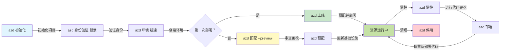
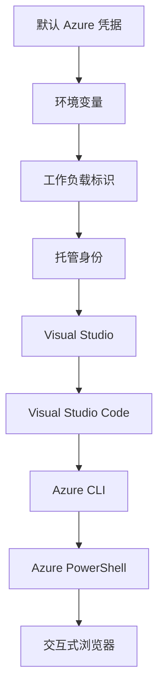

# AZD 基础 - 了解 Azure Developer CLI

# AZD 基础 - 核心概念与基础

**章节导航：**
- **📚 课程主页**: [AZD 入门](../../README.md)
- **📖 当前章节**: 第1章 - 基础与快速入门
- **⬅️ 上一章**: [课程概览](../../README.md#-chapter-1-foundation--quick-start)
- **➡️ 下一章**: [安装与设置](installation.md)
- **🚀 下一章节**: [第2章：AI 优先开发](../chapter-02-ai-development/microsoft-foundry-integration.md)

## 介绍

本课介绍 Azure Developer CLI (azd)，这是一个强大的命令行工具，可加速您从本地开发到 Azure 部署的过程。您将学习基础概念、核心功能，并了解 azd 如何简化云原生应用的部署。

## 学习目标

完成本课后，您将：
- 了解 Azure Developer CLI 是什么及其主要用途
- 学习模板、环境和服务的核心概念
- 探索包括模板驱动开发和基础设施即代码在内的关键功能
- 了解 azd 项目结构和工作流
- 为在开发环境中安装和配置 azd 做好准备

## 学习成果

完成本课后，您将能够：
- 解释 azd 在现代云开发工作流中的作用
- 识别 azd 项目结构的组成部分
- 描述模板、环境和服务如何协同工作
- 理解使用 azd 的基础设施即代码的好处
- 识别不同的 azd 命令及其用途

## 什么是 Azure Developer CLI (azd)?

Azure Developer CLI (azd) 是一个命令行工具，旨在加速您从本地开发到 Azure 部署的旅程。它简化了在 Azure 上构建、部署和管理云原生应用的过程。

### 使用 azd 可以部署什么？

azd 支持广泛的工作负载——并且列表还在不断增长。如今，您可以使用 azd 部署：

| 工作负载类型 | 示例 | 相同工作流程？ |
|---------------|----------|----------------|
| <strong>传统应用</strong> | Web 应用、REST API、静态网站 | ✅ `azd up` |
| <strong>服务与微服务</strong> | Container Apps、Function Apps、多服务后端 | ✅ `azd up` |
| **AI 驱动的应用** | 基于 Microsoft Foundry Models 的聊天应用、使用 AI Search 的 RAG 解决方案 | ✅ `azd up` |
| <strong>智能代理</strong> | 由 Foundry 托管的代理、多代理编排 | ✅ `azd up` |

关键见解是，**无论您在部署什么，azd 的生命周期保持不变**。您会初始化项目、配置基础设施、部署代码、监视应用并进行清理——无论是简单的网站还是复杂的 AI 代理。

这种连续性是设计使然。azd 将 AI 功能视为应用可以使用的另一类服务，而不是根本不同的东西。从 azd 的角度来看，由 Microsoft Foundry Models 支持的聊天端点只是另一个需要配置和部署的服务。

### 🎯 为什么使用 AZD？真实场景对比

让我们比较一下部署带数据库的简单 Web 应用：

#### ❌ 未使用 AZD：手动在 Azure 上部署（30 分钟以上）

```bash
# 第一步：创建资源组
az group create --name myapp-rg --location eastus

# 第二步：创建应用服务计划
az appservice plan create --name myapp-plan \
  --resource-group myapp-rg \
  --sku B1 --is-linux

# 第三步：创建 Web 应用
az webapp create --name myapp-web-unique123 \
  --resource-group myapp-rg \
  --plan myapp-plan \
  --runtime "NODE:18-lts"

# 第四步：创建 Cosmos DB 帐户（10-15 分钟）
az cosmosdb create --name myapp-cosmos-unique123 \
  --resource-group myapp-rg \
  --kind MongoDB

# 第五步：创建数据库
az cosmosdb mongodb database create \
  --account-name myapp-cosmos-unique123 \
  --resource-group myapp-rg \
  --name tododb

# 第六步：创建集合
az cosmosdb mongodb collection create \
  --account-name myapp-cosmos-unique123 \
  --resource-group myapp-rg \
  --database-name tododb \
  --name todos

# 第七步：获取连接字符串
CONN_STR=$(az cosmosdb keys list \
  --name myapp-cosmos-unique123 \
  --resource-group myapp-rg \
  --type connection-strings \
  --query "connectionStrings[0].connectionString" -o tsv)

# 第八步：配置应用设置
az webapp config appsettings set \
  --name myapp-web-unique123 \
  --resource-group myapp-rg \
  --settings MONGODB_URI="$CONN_STR"

# 第九步：启用日志记录
az webapp log config --name myapp-web-unique123 \
  --resource-group myapp-rg \
  --application-logging filesystem \
  --detailed-error-messages true

# 第十步：设置 Application Insights
az monitor app-insights component create \
  --app myapp-insights \
  --location eastus \
  --resource-group myapp-rg

# 第十一步：将 App Insights 关联到 Web 应用
INSTRUMENTATION_KEY=$(az monitor app-insights component show \
  --app myapp-insights \
  --resource-group myapp-rg \
  --query "instrumentationKey" -o tsv)

az webapp config appsettings set \
  --name myapp-web-unique123 \
  --resource-group myapp-rg \
  --settings APPINSIGHTS_INSTRUMENTATIONKEY="$INSTRUMENTATION_KEY"

# 第十二步：在本地构建应用程序
npm install
npm run build

# 第十三步：创建部署包
zip -r app.zip . -x "*.git*" "node_modules/*"

# 第十四步：部署应用程序
az webapp deployment source config-zip \
  --resource-group myapp-rg \
  --name myapp-web-unique123 \
  --src app.zip

# 第十五步：等待并祈祷它能正常工作 🙏
# （没有自动验证，需要手动测试）
```

**问题：**
- ❌ 需要记住并按顺序执行 15+ 条命令
- ❌ 30-45 分钟的手动工作
- ❌ 容易出错（拼写错误、参数错误）
- ❌ 连接字符串会暴露在终端历史记录中
- ❌ 若发生错误则没有自动回滚
- ❌ 团队成员难以复现
- ❌ 每次都不同（不可重现）

#### ✅ 使用 AZD：自动化部署（5 条命令，10-15 分钟）

```bash
# 第 1 步：从模板初始化
azd init --template todo-nodejs-mongo

# 第 2 步：进行身份验证
azd auth login

# 第 3 步：创建环境
azd env new dev

# 第 4 步：预览更改（可选但推荐）
azd provision --preview

# 第 5 步：部署所有内容
azd up

# ✨ 已完成！所有内容已部署、配置并受到监控
```

**优点：**
- ✅ **5 条命令** 对比 15+ 条手动步骤
- ✅ **10-15 分钟** 总时间（大部分时间在等待 Azure）
- ✅ <strong>零错误</strong> - 自动化并经过测试
- ✅ **通过 Key Vault 安全管理机密**
- ✅ <strong>失败时自动回滚</strong>
- ✅ <strong>完全可复现</strong> - 每次结果相同
- ✅ <strong>适合团队</strong> - 任何人都可以使用相同命令进行部署
- ✅ <strong>基础设施即代码</strong> - 受版本控制的 Bicep 模板
- ✅ <strong>内置监控</strong> - 自动配置 Application Insights

### 📊 时间与错误减少

| 指标 | 手动部署 | AZD 部署 | 改进 |
|:-------|:------------------|:---------------|:------------|
| <strong>命令数</strong> | 15+ | 5 | 减少 67% |
| <strong>时间</strong> | 30-45 min | 10-15 min | 快 60% |
| <strong>错误率</strong> | ~40% | <5% | 减少 88% |
| <strong>一致性</strong> | 低（手动） | 100%（自动） | 完美 |
| <strong>团队上手时间</strong> | 2-4 hours | 30 minutes | 快 75% |
| <strong>回滚时间</strong> | 30+ min (manual) | 2 min (automated) | 快 93% |

## 核心概念

### 模板
模板是 azd 的基础。它们包含：
- <strong>应用代码</strong> - 您的源代码和依赖项
- <strong>基础设施定义</strong> - 以 Bicep 或 Terraform 定义的 Azure 资源
- <strong>配置文件</strong> - 设置和环境变量
- <strong>部署脚本</strong> - 自动化部署工作流

### 环境
环境表示不同的部署目标：
- **Development** - 用于测试和开发
- **Staging** - 预生产环境
- **Production** - 线上生产环境

每个环境维护其各自的：
- Azure 资源组
- 配置设置
- 部署状态

### 服务
服务是构建应用程序的构件：
- **Frontend** - Web 应用、SPA
- **Backend** - API、微服务
- **Database** - 数据存储解决方案
- **Storage** - 文件和 Blob 存储

## 主要功能

### 1. 模板驱动开发
```bash
# 浏览可用模板
azd template list

# 从模板初始化
azd init --template <template-name>
```

### 2. 基础设施即代码
- **Bicep** - Azure 的领域特定语言
- **Terraform** - 多云基础设施工具
- **ARM Templates** - Azure Resource Manager 模板

### 3. 集成工作流
```bash
# 完整部署工作流
azd up            # 预配 + 部署：首次设置无需人工干预

# 🧪 新：在部署前预览基础设施更改（安全）
azd provision --preview    # 在不进行更改的情况下模拟基础设施部署

azd provision     # 如果更新基础设施并需要创建 Azure 资源，请使用此项
azd deploy        # 部署应用代码，或在更新后重新部署应用代码
azd down          # 清理资源
```

#### 🛡️ 使用预览进行安全的基础设施规划
命令 `azd provision --preview` 是实现安全部署的变革性工具：
- <strong>演练分析</strong> - 显示将创建、修改或删除的内容
- <strong>零风险</strong> - 不会对您的 Azure 环境做出实际更改
- <strong>团队协作</strong> - 在部署前共享预览结果
- <strong>成本估算</strong> - 在承诺之前了解资源成本

```bash
# 示例预览工作流
azd provision --preview           # 查看将要更改的内容
# 审查输出，与团队讨论
azd provision                     # 放心地应用更改
```

### 📊 可视化：AZD 开发工作流


```mermaid
graph LR
    A[azd 初始化] -->|初始化项目| B[azd 身份验证 登录]
    B -->|验证身份| C[azd 环境 新建]
    C -->|创建环境| D{第一次部署？}
    D -->|是| E[azd 上线]
    D -->|否| F[azd 预配 --preview]
    F -->|审查更改| G[azd 预配]
    E -->|预配并部署| H[资源运行中]
    G -->|更新基础设施| H
    H -->|监控| I[azd 监控]
    I -->|进行代码更改| J[azd 部署]
    J -->|仅重新部署代码| H
    H -->|清理| K[azd 停用]
    
    style A fill:#e1f5fe
    style E fill:#c8e6c9
    style F fill:#fff9c4
    style H fill:#c5e1a5
    style K fill:#ffcdd2
```
**工作流说明：**
1. **Init** - 从模板或新项目开始
2. **Auth** - 与 Azure 进行身份验证
3. **Environment** - 创建隔离的部署环境
4. **Preview** - 🆕 始终先预览基础设施更改（安全做法）
5. **Provision** - 创建/更新 Azure 资源
6. **Deploy** - 推送您的应用代码
7. **Monitor** - 观察应用性能
8. **Iterate** - 进行更改并重新部署代码
9. **Cleanup** - 完成后删除资源

### 4. 环境管理
```bash
# 创建和管理环境
azd env new <environment-name>
azd env select <environment-name>
azd env list
```

### 5. 扩展和 AI 命令

azd 使用扩展系统在核心 CLI 之外添加功能。这在 AI 工作负载中特别有用：

```bash
# 列出可用扩展
azd extension list

# 安装 Foundry agents 扩展
azd extension install azure.ai.agents

# 从清单初始化 AI 代理项目
azd ai agent init -m agent-manifest.yaml

# 启动用于 AI 辅助开发的 MCP 服务器（Alpha）
azd mcp start
```

> 扩展在 [第2章：AI 优先开发](../chapter-02-ai-development/agents.md) 和 [AZD AI CLI 命令](../chapter-08-production/production-ai-practices.md#azd-ai-cli-commands-and-extensions) 参考中有详细介绍。

## 📁 项目结构

典型的 azd 项目结构：
```
my-app/
├── .azd/                    # azd configuration
│   └── config.json
├── .azure/                  # Azure deployment artifacts
├── .devcontainer/          # Development container config
├── .github/workflows/      # GitHub Actions
├── .vscode/               # VS Code settings
├── infra/                 # Infrastructure code
│   ├── main.bicep        # Main infrastructure template
│   ├── main.parameters.json
│   └── modules/          # Reusable modules
├── src/                  # Application source code
│   ├── api/             # Backend services
│   └── web/             # Frontend application
├── azure.yaml           # azd project configuration
└── README.md
```

## 🔧 配置文件

### azure.yaml
主要的项目配置文件：
```yaml
name: my-awesome-app
metadata:
  template: my-template@1.0.0

services:
  web:
    project: ./src/web
    language: js
    host: appservice
  api:
    project: ./src/api
    language: js
    host: appservice

hooks:
  preprovision:
    shell: pwsh
    run: echo "Preparing to provision..."
```

### .azure/config.json
特定环境的配置：
```json
{
  "version": 1,
  "defaultEnvironment": "dev",
  "environments": {
    "dev": {
      "subscriptionId": "your-subscription-id",
      "location": "eastus"
    }
  }
}
```

## 🎪 常见工作流与实践练习

> **💡 学习小贴士：** 按顺序完成这些练习以逐步提升您的 AZD 技能。

### 🎯 练习 1：初始化您的第一个项目

**目标：** 创建一个 AZD 项目并探索其结构

**步骤：**
```bash
# 使用经过验证的模板
azd init --template todo-nodejs-mongo

# 浏览生成的文件
ls -la  # 查看所有文件包括隐藏文件

# 创建的关键文件：
# - azure.yaml（主配置）
# - infra/（基础设施代码）
# - src/（应用程序代码）
```

**✅ 成功：** 您将拥有 azure.yaml、infra/ 和 src/ 目录

---

### 🎯 练习 2：部署到 Azure

**目标：** 完成端到端部署

**步骤：**
```bash
# 1. 身份验证
az login && azd auth login

# 2. 创建环境
azd env new dev
azd env set AZURE_LOCATION eastus

# 3. 预览更改（推荐）
azd provision --preview

# 4. 部署所有内容
azd up

# 5. 验证部署
azd show    # 查看您的应用 URL
```

**预计时间：** 10-15 分钟  
**✅ 成功：** 应用 URL 在浏览器中打开

---

### 🎯 练习 3：多个环境

**目标：** 部署到 dev 和 staging

**步骤：**
```bash
# 已经有 dev，创建 staging
azd env new staging
azd env set AZURE_LOCATION westus2
azd up

# 在它们之间切换
azd env list
azd env select dev
```

**✅ 成功：** 在 Azure 门户中有两个独立的资源组

---

### 🛡️ 清空环境：`azd down --force --purge`

当您需要完全重置时：

```bash
azd down --force --purge
```

**它的作用：**
- `--force`：无确认提示
- `--purge`：删除所有本地状态和 Azure 资源

**使用场景：**
- 部署中途失败
- 切换项目
- 需要重新开始

---

## 🎪 原始工作流参考

### 启动新项目
```bash
# 方法 1：使用现有模板
azd init --template todo-nodejs-mongo

# 方法 2：从头开始
azd init

# 方法 3：使用当前目录
azd init .
```

### 开发周期
```bash
# 设置开发环境
azd auth login
azd env new dev
azd env select dev

# 部署所有内容
azd up

# 进行更改并重新部署
azd deploy

# 完成后清理
azd down --force --purge # Azure Developer CLI 中的该命令是对你的环境的“硬重置”——在你排查部署失败、清理孤立资源或为全新重新部署做准备时尤其有用。
```

## 理解 `azd down --force --purge`
命令 `azd down --force --purge` 是一种强力方式，可彻底拆除您的 azd 环境及所有相关资源。以下是各个标志的作用分解：
```
--force
```
- 跳过确认提示。
- 适用于自动化或脚本场景，当人工输入不可行时。
- 确保即使 CLI 检测到不一致，也能不中断地继续拆除。

```
--purge
```
删除 <strong>所有相关元数据</strong>，包括：
环境状态
本地 `.azure` 文件夹
缓存的部署信息
防止 azd 从“记住”以前的部署，这可能导致资源组不匹配或陈旧的注册表引用等问题。


### 为什么同时使用两者？
当由于残留状态或部分部署导致 `azd up` 遇到障碍时，这组组合可确保一个<strong>干净的起点</strong>。

在 Azure 门户中手动删除资源后，或在切换模板、环境或资源组命名约定时，尤其有用。


### 管理多个环境
```bash
# 创建暂存环境
azd env new staging
azd env select staging
azd up

# 切换回开发环境
azd env select dev

# 比较环境
azd env list
```

## 🔐 认证与凭据

理解认证对于成功的 azd 部署至关重要。Azure 使用多种认证方法，azd 利用与其他 Azure 工具相同的凭据链。

### Azure CLI 认证 (`az login`)

在使用 azd 之前，您需要对 Azure 进行身份验证。最常见的方法是使用 Azure CLI：

```bash
# 交互式登录（打开浏览器）
az login

# 使用特定租户登录
az login --tenant <tenant-id>

# 使用服务主体登录
az login --service-principal -u <app-id> -p <password> --tenant <tenant-id>

# 检查当前登录状态
az account show

# 列出可用订阅
az account list --output table

# 设置默认订阅
az account set --subscription <subscription-id>
```

### 认证流程
1. 交互式登录：打开默认浏览器进行身份验证
2. 设备代码流：用于无浏览器访问的环境
3. 服务主体（Service Principal）：用于自动化和 CI/CD 场景
4. 托管身份（Managed Identity）：用于部署在 Azure 上的应用

### DefaultAzureCredential 凭据链

DefaultAzureCredential 是一种凭据类型，它通过按特定顺序自动尝试多个凭据来源来简化认证体验：

#### 凭据链顺序

```mermaid
graph TD
    A[默认 Azure 凭据] --> B[环境变量]
    B --> C[工作负载标识]
    C --> D[托管身份]
    D --> E[Visual Studio]
    E --> F[Visual Studio Code]
    F --> G[Azure CLI]
    G --> H[Azure PowerShell]
    H --> I[交互式浏览器]
```
#### 1. 环境变量
```bash
# 为服务主体设置环境变量
export AZURE_CLIENT_ID="<app-id>"
export AZURE_CLIENT_SECRET="<password>"
export AZURE_TENANT_ID="<tenant-id>"
```

#### 2. 工作负载身份（Kubernetes/GitHub Actions）
自动用于：
- 使用工作负载身份的 Azure Kubernetes Service (AKS)
- 使用 OIDC 联邦的 GitHub Actions
- 其他联邦身份场景

#### 3. 托管身份
用于以下 Azure 资源：
- 虚拟机
- App Service
- Azure Functions
- 容器实例

```bash
# 检查是否在具有托管标识的 Azure 资源上运行
az account show --query "user.type" --output tsv
# 返回：如果使用托管标识，则为 "servicePrincipal"
```

#### 4. 开发工具集成
- **Visual Studio**：自动使用已登录账号
- **VS Code**：使用 Azure Account 扩展的凭据
- **Azure CLI**：使用 `az login` 的凭据（本地开发最常用）

### AZD 认证设置

```bash
# 方法 1：使用 Azure CLI（推荐用于开发）
az login
azd auth login  # 使用现有的 Azure CLI 凭据

# 方法 2：直接进行 azd 身份验证
azd auth login --use-device-code  # 用于无头环境

# 方法 3：检查身份验证状态
azd auth login --check-status

# 方法 4：登出并重新验证身份
azd auth logout
azd auth login
```

### 认证最佳实践

#### 本地开发
```bash
# 1. 使用 Azure CLI 登录
az login

# 2. 验证订阅是否正确
az account show
az account set --subscription "Your Subscription Name"

# 3. 使用现有凭据运行 azd
azd auth login
```

#### CI/CD 管道
```yaml
# GitHub Actions example
- name: Azure Login
  uses: azure/login@v1
  with:
    creds: ${{ secrets.AZURE_CREDENTIALS }}

- name: Deploy with azd
  run: |
    azd auth login --client-id ${{ secrets.AZURE_CLIENT_ID }} \
                    --client-secret ${{ secrets.AZURE_CLIENT_SECRET }} \
                    --tenant-id ${{ secrets.AZURE_TENANT_ID }}
    azd up --no-prompt
```

#### 生产环境
- 在 Azure 资源上运行时使用 **Managed Identity**
- 在自动化场景中使用 **Service Principal**
- 避免在代码或配置文件中存储凭据
- 对敏感配置使用 **Azure Key Vault**

### 常见认证问题与解决方案

#### 问题：“未找到订阅”
```bash
# 解决方案：设置默认订阅
az account list --output table
az account set --subscription "<subscription-id>"
azd env set AZURE_SUBSCRIPTION_ID "<subscription-id>"
```

#### 问题：“权限不足”
```bash
# 解决方案：检查并分配所需角色
az role assignment list --assignee $(az account show --query user.name --output tsv)

# 常见的所需角色：
# - 参与者（用于资源管理）
# - 用户访问管理员（用于角色分配）
```

#### 问题：“令牌已过期”
```bash
# 解决方案：重新验证身份
az logout
az login
azd auth logout
azd auth login
```

### 不同场景下的认证

#### 本地开发
```bash
# 个人发展账户
az login
azd auth login
```

#### 团队开发
```bash
# 为组织使用特定租户
az login --tenant contoso.onmicrosoft.com
azd auth login
```

#### 多租户场景
```bash
# 在租户之间切换
az login --tenant tenant1.onmicrosoft.com
# 部署到租户 1
azd up

az login --tenant tenant2.onmicrosoft.com  
# 部署到租户 2
azd up
```

### 安全注意事项
1. <strong>凭证存储</strong>: 切勿在源代码中存储凭证
2. <strong>范围限制</strong>: 对服务主体使用最小权限原则
3. <strong>令牌轮换</strong>: 定期轮换服务主体密钥
4. <strong>审计追踪</strong>: 监控身份验证和部署活动
5. <strong>网络安全</strong>: 在可能的情况下使用私有端点

### 故障排除：身份验证

```bash
# 调试身份验证问题
azd auth login --check-status
az account show
az account get-access-token

# 常用诊断命令
whoami                          # 当前用户上下文
az ad signed-in-user show      # Azure AD 用户详细信息
az group list                  # 测试资源访问
```

## 理解 `azd down --force --purge`

### 发现
```bash
azd template list              # 浏览模板
azd template show <template>   # 模板详情
azd init --help               # 初始化选项
```

### 项目管理
```bash
azd show                     # 项目概述
azd env show                 # 当前环境
azd config list             # 配置设置
```

### 监控
```bash
azd monitor                  # 打开 Azure 门户监控
azd monitor --logs           # 查看应用程序日志
azd monitor --live           # 查看实时指标
azd pipeline config          # 设置 CI/CD
```

## 最佳实践

### 1. 使用有意义的名称
```bash
# 好
azd env new production-east
azd init --template web-app-secure

# 避免
azd env new env1
azd init --template template1
```

### 2. 利用模板
- 从现有模板开始
- 根据需求进行自定义
- 为你的组织创建可重用模板

### 3. 环境隔离
- 为 dev/staging/prod 使用独立环境
- 切勿从本地机器直接部署到生产环境
- 使用 CI/CD 管道进行生产部署

### 4. 配置管理
- 对敏感数据使用环境变量
- 将配置保存在版本控制中
- 记录环境特定设置

## 学习进阶

### 初学者（第 1-2 周）
1. 安装 azd 并进行身份验证
2. 部署一个简单的模板
3. 理解项目结构
4. 学习基本命令（up、down、deploy）

### 中级（第 3-4 周）
1. 自定义模板
2. 管理多个环境
3. 理解基础设施代码
4. 设置 CI/CD 管道

### 高级（第 5 周及以后）
1. 创建自定义模板
2. 高级基础设施模式
3. 多区域部署
4. 企业级配置

## 下一步

**📖 继续第 1 章学习：**
- [安装与设置](installation.md) - 安装并配置 azd
- [你的第一个项目](first-project.md) - 完成实操教程
- [配置指南](configuration.md) - 高级配置选项

**🎯 准备好进入下一章了吗？**
- [第 2 章：AI 优先开发](../chapter-02-ai-development/microsoft-foundry-integration.md) - 开始构建 AI 应用

## 额外资源

- [Azure 开发者 CLI 概述](https://learn.microsoft.com/en-us/azure/developer/azure-developer-cli/)
- [模板库](https://azure.github.io/awesome-azd/)
- [社区示例](https://github.com/Azure-Samples)

---

## 🙋 常见问题

### 常规问题

**Q: AZD 和 Azure CLI 有何区别？**

A: Azure CLI (`az`) 用于管理单个 Azure 资源。AZD (`azd`) 用于管理整个应用程序：

```bash
# Azure CLI - 底层资源管理
az webapp create --name myapp --resource-group rg
az sql server create --name myserver --resource-group rg
# ...需要更多命令

# AZD - 应用级管理
azd up  # 部署整个应用及其所有资源
```

**可以这样理解：**
- `az` = 操作单个乐高积木
- `azd` = 使用完整的乐高套装进行工作

---

**Q: 使用 AZD 是否需要了解 Bicep 或 Terraform？**

A: 不需要！从模板开始：
```bash
# 使用现有模板 - 不需要 IaC 知识
azd init --template todo-nodejs-mongo
azd up
```

你可以在之后学习 Bicep 来自定义基础设施。模板提供可供学习的工作示例。

---

**Q: 运行 AZD 模板的费用是多少？**

A: 费用取决于模板。大多数开发模板的成本为 $50-150/月：

```bash
# 在部署前预览费用
azd provision --preview

# 不使用时始终清理
azd down --force --purge  # 移除所有资源
```

**专家提示：** 在可用时使用免费层：
- App Service: F1（免费）层
- Microsoft Foundry Models: Azure OpenAI 每月 50,000 令牌免费
- Cosmos DB: 1000 RU/s 免费层

---

**Q: 我可以在已有的 Azure 资源上使用 AZD 吗？**

A: 可以，但从头开始更容易。AZD 在管理完整生命周期时效果最佳。对于现有资源：

```bash
# 选项 1：导入现有资源（高级）
azd init
# 然后修改 infra/ 以引用现有资源

# 选项 2：从头开始（推荐）
azd init --template matching-your-stack
azd up  # 创建新环境
```

---

**Q: 我如何与队友共享我的项目？**

A: 将 AZD 项目提交到 Git（但不要提交 .azure 文件夹）：

```bash
# 已默认包含在 .gitignore 中
.azure/        # 包含机密信息和环境数据
*.env          # 环境变量

# 当时的团队成员：
git clone <your-repo>
azd auth login
azd env new <their-name>-dev
azd up
```

每个人都能从相同的模板获得相同的基础设施。

---

### 故障排查问题

**Q: "azd up" 在中途失败。我该怎么办？**

A: 检查错误，修复后重试：

```bash
# 查看详细日志
azd show

# 常见修复：

# 1. 如果超出配额：
azd env set AZURE_LOCATION "westus2"  # 尝试不同的区域

# 2. 如果资源名称冲突：
azd down --force --purge  # 重置为初始状态
azd up  # 重试

# 3. 如果认证已过期：
az login
azd auth login
azd up
```

**最常见的问题：** 选择了错误的 Azure 订阅
```bash
az account list --output table
az account set --subscription "<correct-subscription>"
```

---

**Q: 如何仅部署代码更改而不重新配置资源？**

A: 使用 `azd deploy` 而不是 `azd up`：

```bash
azd up          # 第一次：预配 + 部署 (慢)

# 进行代码更改...

azd deploy      # 后续：仅部署 (快)
```

速度对比：
- `azd up`: 10-15 分钟（配置基础设施）
- `azd deploy`: 2-5 分钟（仅代码）

---

**Q: 我可以自定义基础设施模板吗？**

A: 可以！编辑 `infra/` 中的 Bicep 文件：

```bash
# 在 azd init 之后
cd infra/
code main.bicep  # 在 VS Code 中编辑

# 预览更改
azd provision --preview

# 应用更改
azd provision
```

**提示：** 从小处开始 - 先更改 SKUs：
```bicep
// infra/main.bicep
sku: {
  name: 'B1'  // Change to 'P1V2' for production
}
```

---

**Q: 如何删除 AZD 创建的所有内容？**

A: 一条命令可删除所有资源：

```bash
azd down --force --purge

# 这将删除：
# - 所有 Azure 资源
# - 资源组
# - 本地环境状态
# - 缓存的部署数据
```

**在以下情况下务必运行：**
- 完成模板测试
- 切换到不同项目
- 想要重新开始

**节省成本：** 删除未使用的资源 = $0 费用

---

**Q: 如果我在 Azure 门户中意外删除了资源怎么办？**

A: AZD 的状态可能会不同步。清除状态的做法：

```bash
# 1. 删除本地状态
azd down --force --purge

# 2. 重新开始
azd up

# 替代方案：让 AZD 检测并修复
azd provision  # 将创建缺失的资源
```

---

### 高级问题

**Q: 我可以在 CI/CD 管道中使用 AZD 吗？**

A: 可以！GitHub Actions 示例：

```yaml
# .github/workflows/deploy.yml
name: Deploy with AZD

on:
  push:
    branches: [main]

jobs:
  deploy:
    runs-on: ubuntu-latest
    steps:
      - uses: actions/checkout@v2
      
      - name: Install azd
        run: curl -fsSL https://aka.ms/install-azd.sh | bash
      
      - name: Azure Login
        run: |
          azd auth login \
            --client-id ${{ secrets.AZURE_CLIENT_ID }} \
            --client-secret ${{ secrets.AZURE_CLIENT_SECRET }} \
            --tenant-id ${{ secrets.AZURE_TENANT_ID }}
      
      - name: Deploy
        run: azd up --no-prompt
```

---

**Q: 我如何处理机密和敏感数据？**

A: AZD 会自动与 Azure Key Vault 集成：

```bash
# 机密存储在 Key Vault 中，而不是在代码中
azd env set DATABASE_PASSWORD "$(openssl rand -base64 32)"

# AZD 会自动：
# 1. 创建 Key Vault
# 2. 存储机密
# 3. 通过托管标识授予应用访问权限
# 4. 在运行时注入
```

**切勿提交：**
- `.azure/` 文件夹（包含环境数据）
- `.env` 文件（本地机密）
- 连接字符串

---

**Q: 我可以部署到多个区域吗？**

A: 可以，为每个区域创建环境：

```bash
# 美国东部环境
azd env new prod-eastus
azd env set AZURE_LOCATION eastus
azd up

# 欧洲西部环境
azd env new prod-westeurope
azd env set AZURE_LOCATION westeurope
azd up

# 每个环境相互独立
azd env list
```

对于真正的多区域应用，请自定义 Bicep 模板以同时部署到多个区域。

---

**Q: 如果遇到困难，我可以在哪里寻求帮助？**

1. **AZD 文档：** https://learn.microsoft.com/azure/developer/azure-developer-cli/
2. **GitHub Issues：** https://github.com/Azure/azure-dev/issues
3. **Discord：** [Azure Discord](https://discord.gg/microsoft-azure) - #azure-developer-cli 频道
4. **Stack Overflow：** 使用标签 `azure-developer-cli`
5. **本课程：** [故障排除指南](../chapter-07-troubleshooting/common-issues.md)

**小提示：** 在提问前，运行：```bash
azd show       # 显示当前状态
azd version    # 显示你的版本
```
在提问时包含这些信息以获得更快的帮助。

---

## 🎓 接下来做什么？

你现在了解了 AZD 的基本概念。选择你的路径：

### 🎯 面向初学者：
1. **下一步：** [安装与设置](installation.md) - 在你的机器上安装 AZD
2. **然后：** [你的第一个项目](first-project.md) - 部署你的第一个应用
3. **练习：** 完成本课的全部 3 个练习

### 🚀 面向 AI 开发者：
1. **跳转到：** [第 2 章：AI 优先开发](../chapter-02-ai-development/microsoft-foundry-integration.md)
2. **部署：** 从 `azd init --template get-started-with-ai-chat` 开始
3. **学习：** 在部署的同时构建

### 🏗️ 面向有经验的开发者：
1. **复习：** [配置指南](configuration.md) - 高级设置
2. **探索：** [基础设施即代码](../chapter-04-infrastructure/provisioning.md) - Bicep 深度解析
3. **构建：** 为你的技术栈创建自定义模板

---

**章节导航：**
- **📚 课程主页**: [AZD 初学者](../../README.md)
- **📖 当前章节**: 第 1 章 - 基础与快速入门  
- **⬅️ 上一个**: [课程概览](../../README.md#-chapter-1-foundation--quick-start)
- **➡️ 下一个**: [安装与设置](installation.md)
- **🚀 下一章**: [第 2 章：AI 优先开发](../chapter-02-ai-development/microsoft-foundry-integration.md)

---

<!-- CO-OP TRANSLATOR DISCLAIMER START -->
**免责声明**:
本文件已使用 AI 翻译服务 [Co-op Translator](https://github.com/Azure/co-op-translator) 翻译。尽管我们力求准确，但请注意，自动翻译可能包含错误或不准确之处。原始文档的原文应被视为权威来源。对于重要信息，建议使用专业人工翻译。对于因使用此翻译而产生的任何误解或误释，我们概不负责。
<!-- CO-OP TRANSLATOR DISCLAIMER END -->