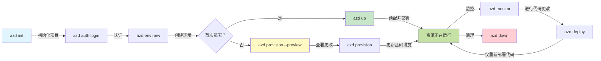
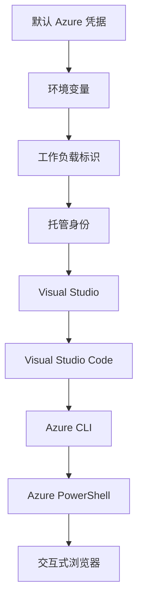

# AZD 基础 - 了解 Azure Developer CLI

# AZD 基础 - 核心概念与基础知识

**章节导航：**
- **📚 课程首页**: [AZD For Beginners](../../README.md)
- **📖 当前章节**: 第 1 章 - 基础与快速入门
- **⬅️ 上一页**: [Course Overview](../../README.md#-chapter-1-foundation--quick-start)
- **➡️ 下一页**: [Installation & Setup](installation.md)
- **🚀 下一章节**: [第 2 章：以 AI 为先的开发](../chapter-02-ai-development/microsoft-foundry-integration.md)

## 介绍

本课将向你介绍 Azure Developer CLI (azd)，这是一款强大的命令行工具，可加速你从本地开发到 Azure 部署的旅程。你将学习基础概念、核心功能，并了解 azd 如何简化云原生应用的部署。

## 学习目标

在本课结束时，你将能够：
- 了解 Azure Developer CLI 是什么以及它的主要用途
- 学习模板、环境和服务的核心概念
- 探索包括模板驱动开发和基础设施即代码在内的关键特性
- 了解 azd 项目结构和工作流
- 为在你的开发环境中安装和配置 azd 做好准备

## 学习成果

完成本课后，你将能够：
- 解释 azd 在现代云开发工作流中的作用
- 识别 azd 项目结构的组成部分
- 描述模板、环境和服务如何协同工作
- 理解使用 azd 的基础设施即代码的优势
- 识别不同的 azd 命令及其用途

## 什么是 Azure Developer CLI (azd)？

Azure Developer CLI (azd) 是一款命令行工具，旨在加速你从本地开发到 Azure 部署的旅程。它简化了在 Azure 上构建、部署和管理云原生应用的过程。

### 使用 azd 可以部署哪些内容？

azd 支持广泛的工作负载——且支持的范围还在不断扩大。今天，你可以使用 azd 来部署：

| Workload Type | Examples | Same Workflow? |
|---------------|----------|----------------|
| **Traditional applications** | Web apps, REST APIs, static sites | ✅ `azd up` |
| **Services and microservices** | Container Apps, Function Apps, multi-service backends | ✅ `azd up` |
| **AI-powered applications** | Chat apps with Microsoft Foundry Models, RAG solutions with AI Search | ✅ `azd up` |
| **Intelligent agents** | Foundry-hosted agents, multi-agent orchestrations | ✅ `azd up` |

关键见解是：无论你部署的是什么，**azd 的生命周期保持不变**。你初始化项目、配置基础设施、部署代码、监控应用并清理资源——无论是简单的网站还是复杂的 AI 代理，流程相同。

这种连续性是有意为之。azd 将 AI 能力视为你的应用可以使用的另一类服务，而不是截然不同的东西。从 azd 的角度来看，由 Microsoft Foundry Models 支持的聊天端点只是另一个需要配置和部署的服务。

### 🎯 为什么使用 AZD？一个真实世界的比较

让我们比较一下部署一个简单的带数据库的 Web 应用：

#### ❌ WITHOUT AZD: Manual Azure Deployment (30+ minutes)

```bash
# 第1步：创建资源组
az group create --name myapp-rg --location eastus

# 第2步：创建应用服务计划
az appservice plan create --name myapp-plan \
  --resource-group myapp-rg \
  --sku B1 --is-linux

# 第3步：创建 Web 应用
az webapp create --name myapp-web-unique123 \
  --resource-group myapp-rg \
  --plan myapp-plan \
  --runtime "NODE:18-lts"

# 第4步：创建 Cosmos DB 帐户（10-15分钟）
az cosmosdb create --name myapp-cosmos-unique123 \
  --resource-group myapp-rg \
  --kind MongoDB

# 第5步：创建数据库
az cosmosdb mongodb database create \
  --account-name myapp-cosmos-unique123 \
  --resource-group myapp-rg \
  --name tododb

# 第6步：创建集合
az cosmosdb mongodb collection create \
  --account-name myapp-cosmos-unique123 \
  --resource-group myapp-rg \
  --database-name tododb \
  --name todos

# 第7步：获取连接字符串
CONN_STR=$(az cosmosdb keys list \
  --name myapp-cosmos-unique123 \
  --resource-group myapp-rg \
  --type connection-strings \
  --query "connectionStrings[0].connectionString" -o tsv)

# 第8步：配置应用设置
az webapp config appsettings set \
  --name myapp-web-unique123 \
  --resource-group myapp-rg \
  --settings MONGODB_URI="$CONN_STR"

# 第9步：启用日志记录
az webapp log config --name myapp-web-unique123 \
  --resource-group myapp-rg \
  --application-logging filesystem \
  --detailed-error-messages true

# 第10步：设置 Application Insights
az monitor app-insights component create \
  --app myapp-insights \
  --location eastus \
  --resource-group myapp-rg

# 第11步：将 Application Insights 链接到 Web 应用
INSTRUMENTATION_KEY=$(az monitor app-insights component show \
  --app myapp-insights \
  --resource-group myapp-rg \
  --query "instrumentationKey" -o tsv)

az webapp config appsettings set \
  --name myapp-web-unique123 \
  --resource-group myapp-rg \
  --settings APPINSIGHTS_INSTRUMENTATIONKEY="$INSTRUMENTATION_KEY"

# 第12步：在本地构建应用程序
npm install
npm run build

# 第13步：创建部署包
zip -r app.zip . -x "*.git*" "node_modules/*"

# 第14步：部署应用程序
az webapp deployment source config-zip \
  --resource-group myapp-rg \
  --name myapp-web-unique123 \
  --src app.zip

# 第15步：等待并祈祷它能成功运行 🙏
# （没有自动化验证，需要手动测试）
```

**问题：**
- ❌ 需要记住并按顺序执行 15+ 个命令
- ❌ 30-45 分钟的手动工作
- ❌ 容易出错（拼写错误、参数错误）
- ❌ 连接字符串会暴露在终端历史记录中
- ❌ 如果出现故障没有自动回滚
- ❌ 团队成员难以复现
- ❌ 每次都不同（不可复现）

#### ✅ WITH AZD: Automated Deployment (5 commands, 10-15 minutes)

```bash
# 第1步：从模板初始化
azd init --template todo-nodejs-mongo

# 第2步：身份验证
azd auth login

# 第3步：创建环境
azd env new dev

# 第4步：预览更改（可选但推荐）
azd provision --preview

# 第5步：部署所有内容
azd up

# ✨ 完成！所有内容已部署、配置并正在监控
```

**好处：**
- ✅ **5 commands** vs. 15+ manual steps
- ✅ **10-15 minutes** 总耗时（大部分时间在等待 Azure）
- ✅ <strong>更少手动错误</strong> - 一致的、模板驱动的工作流
- ✅ <strong>安全的密钥处理</strong> - 许多模板使用 Azure 托管的密钥存储
- ✅ <strong>可重复部署</strong> - 每次相同的工作流
- ✅ <strong>完全可复现</strong> - 每次相同结果
- ✅ <strong>团队就绪</strong> - 任何人都可以使用相同命令部署
- ✅ <strong>基础设施即代码</strong> - 受版本控制的 Bicep 模板
- ✅ <strong>内置监控</strong> - 自动配置 Application Insights

### 📊 时间与错误降低

| Metric | Manual Deployment | AZD Deployment | Improvement |
|:-------|:------------------|:---------------|:------------|
| **Commands** | 15+ | 5 | 67% fewer |
| **Time** | 30-45 min | 10-15 min | 60% faster |
| **Error Rate** | ~40% | <5% | 88% reduction |
| **Consistency** | Low (manual) | 100% (automated) | Perfect |
| **Team Onboarding** | 2-4 hours | 30 minutes | 75% faster |
| **Rollback Time** | 30+ min (manual) | 2 min (automated) | 93% faster |

## 核心概念

### 模板
模板是 azd 的基础。它们包含：
- <strong>应用代码</strong> - 你的源代码和依赖项
- <strong>基础设施定义</strong> - 以 Bicep 或 Terraform 定义的 Azure 资源
- <strong>配置文件</strong> - 设置和环境变量
- <strong>部署脚本</strong> - 自动化部署工作流

### 环境
环境表示不同的部署目标：
- <strong>开发</strong> - 用于测试和开发
- <strong>预发布</strong> - 预生产环境
- <strong>生产</strong> - 线上生产环境

每个环境维护自己的：
- Azure 资源组
- 配置设置
- 部署状态

### 服务
服务是你应用的构建模块：
- <strong>前端</strong> - Web 应用、单页应用 (SPA)
- <strong>后端</strong> - API、微服务
- <strong>数据库</strong> - 数据存储解决方案
- <strong>存储</strong> - 文件和 Blob 存储

## 关键特性

### 1. 模板驱动开发
```bash
# 浏览可用的模板
azd template list

# 从模板初始化
azd init --template <template-name>
```

### 2. 基础设施即代码
- **Bicep** - Azure 的领域特定语言
- **Terraform** - 多云基础设施工具
- **ARM Templates** - Azure Resource Manager 模板

### 3. 集成工作流
```bash
# 完整的部署工作流
azd up            # 预配 + 部署：首次设置时无需人工干预

# 🧪 新：在部署前预览基础设施更改（安全）
azd provision --preview    # 在不进行更改的情况下模拟基础设施部署

azd provision     # 如果更新基础设施并需要创建 Azure 资源，请使用此项
azd deploy        # 部署应用代码，或在更新后重新部署应用代码
azd down          # 清理资源
```

#### 🛡️ 使用 Preview 进行安全的基础设施规划
`azd provision --preview` 命令对于安全部署是一个游戏改变者：
- <strong>演练运行分析</strong> - 显示将被创建、修改或删除的内容
- <strong>零风险</strong> - 不会对你的 Azure 环境做出实际更改
- <strong>团队协作</strong> - 在部署前共享预览结果
- <strong>成本估算</strong> - 在承诺之前了解资源成本

```bash
# 示例预览工作流
azd provision --preview           # 查看将要更改的内容
# 审查输出，与团队讨论
azd provision                     # 放心地应用更改
```

### 📊 可视化：AZD 开发工作流


```mermaid
graph LR
    A[azd init] -->|初始化项目| B[azd auth login]
    B -->|认证| C[azd env new]
    C -->|创建环境| D{首次部署？}
    D -->|是| E[azd up]
    D -->|否| F[azd provision --preview]
    F -->|查看更改| G[azd provision]
    E -->|预配并部署| H[资源正在运行]
    G -->|更新基础设施| H
    H -->|监控| I[azd monitor]
    I -->|进行代码更改| J[azd deploy]
    J -->|仅重新部署代码| H
    H -->|清理| K[azd down]
    
    style A fill:#e1f5fe
    style E fill:#c8e6c9
    style F fill:#fff9c4
    style H fill:#c5e1a5
    style K fill:#ffcdd2
```
**工作流说明：**
1. **Init** - 从模板或新项目开始
2. **Auth** - 使用 Azure 进行身份验证
3. **Environment** - 创建隔离的部署环境
4. **Preview** - 🆕 始终先预览基础设施更改（安全实践）
5. **Provision** - 创建/更新 Azure 资源
6. **Deploy** - 推送你的应用代码
7. **Monitor** - 观察应用性能
8. **Iterate** - 进行更改并重新部署代码
9. **Cleanup** - 完成后删除资源

### 4. 环境管理
```bash
# 创建并管理环境
azd env new <environment-name>
azd env select <environment-name>
azd env list
```

### 5. 扩展和 AI 命令

azd 使用扩展系统来为核心 CLI 添加功能。对于 AI 工作负载这尤其有用：

```bash
# 列出可用的扩展
azd extension list

# 安装 Foundry agents 扩展
azd extension install azure.ai.agents

# 从清单初始化一个 AI 代理项目
azd ai agent init -m agent-manifest.yaml

# 启动用于 AI 辅助开发的 MCP 服务器（Alpha）
azd mcp start
```

> 扩展在 [第 2 章：以 AI 为先的开发](../chapter-02-ai-development/agents.md) 和 [AZD AI CLI 命令](../chapter-08-production/production-ai-practices.md#azd-ai-cli-commands-and-extensions) 参考中有详细介绍。

## 📁 项目结构

一个典型的 azd 项目结构：
```
my-app/
├── .azd/                    # azd configuration
│   └── config.json
├── .azure/                  # Azure deployment artifacts
├── .devcontainer/          # Development container config
├── .github/workflows/      # GitHub Actions
├── .vscode/               # VS Code settings
├── infra/                 # Infrastructure code
│   ├── main.bicep        # Main infrastructure template
│   ├── main.parameters.json
│   └── modules/          # Reusable modules
├── src/                  # Application source code
│   ├── api/             # Backend services
│   └── web/             # Frontend application
├── azure.yaml           # azd project configuration
└── README.md
```

## 🔧 配置文件

### azure.yaml
主要的项目配置文件：
```yaml
name: my-awesome-app
metadata:
  template: my-template@1.0.0

services:
  web:
    project: ./src/web
    language: js
    host: appservice
  api:
    project: ./src/api
    language: js
    host: appservice

hooks:
  preprovision:
    shell: pwsh
    run: echo "Preparing to provision..."
```

### .azure/config.json
环境特定的配置：
```json
{
  "version": 1,
  "defaultEnvironment": "dev",
  "environments": {
    "dev": {
      "subscriptionId": "your-subscription-id",
      "location": "eastus"
    }
  }
}
```

## 🎪 常见工作流与实操练习

> **💡 学习提示：** 按顺序完成这些练习以逐步建立你的 AZD 技能。

### 🎯 练习 1：初始化你的第一个项目

**目标：** 创建一个 AZD 项目并探索其结构

**步骤：**
```bash
# 使用经过验证的模板
azd init --template todo-nodejs-mongo

# 查看生成的文件
ls -la  # 查看所有文件，包括隐藏文件

# 创建的关键文件：
# - azure.yaml (主配置)
# - infra/ (基础设施代码)
# - src/ (应用代码)
```

**✅ 成功标志：** 你拥有 azure.yaml、infra/ 和 src/ 目录

---

### 🎯 练习 2：部署到 Azure

**目标：** 完成端到端部署

**步骤：**
```bash
# 1. 进行身份验证
az login && azd auth login

# 2. 创建环境
azd env new dev
azd env set AZURE_LOCATION eastus

# 3. 预览更改（推荐）
azd provision --preview

# 4. 部署所有内容
azd up

# 5. 验证部署
azd show    # 查看您的应用网址
```

**预计时间：** 10-15 分钟  
**✅ 成功标志：** 应用 URL 在浏览器中打开

---

### 🎯 练习 3：多环境部署

**目标：** 部署到 dev 和 staging

**步骤：**
```bash
# 已经有 dev，创建 staging
azd env new staging
azd env set AZURE_LOCATION westus2
azd up

# 在它们之间切换
azd env list
azd env select dev
```

**✅ 成功标志：** Azure 门户中有两个独立的资源组

---

### 🛡️ 干净重置：`azd down --force --purge`

当你需要完全重置时：

```bash
azd down --force --purge
```

**它做什么：**
- `--force`: 无确认提示
- `--purge`: 删除所有本地状态和 Azure 资源

**何时使用：**
- 部署中途失败
- 切换项目
- 需要全新开始

---

## 🎪 原始工作流参考

### 启动新项目
```bash
# 方法 1：使用现有模板
azd init --template todo-nodejs-mongo

# 方法 2：从头开始
azd init

# 方法 3：使用当前目录
azd init .
```

### 开发周期
```bash
# 设置开发环境
azd auth login
azd env new dev
azd env select dev

# 部署所有内容
azd up

# 进行更改并重新部署
azd deploy

# 完成后清理
azd down --force --purge # 该命令在 Azure Developer CLI 中是对你的环境的**硬重置**——在你排查部署失败、清理孤立资源或为全新重新部署做准备时尤其有用。
```

## 了解 `azd down --force --purge`
`azd down --force --purge` 命令是完全拆除你的 azd 环境及所有关联资源的强大方式。以下是各个标志的作用说明：
```
--force
```
- 略过确认提示。
- 在需要自动化或脚本化且无法手动输入的场景中非常有用。
- 确保即使 CLI 检测到不一致性，拆除过程也不会中断。

```
--purge
```
删除 <strong>所有相关元数据</strong>，包括：
Environment state
Local `.azure` folder
Cached deployment info
Prevents azd from "remembering" previous deployments, which can cause issues like mismatched resource groups or stale registry references.

### 为什么同时使用两者？
当你因为残留状态或部分部署而在运行 `azd up` 时遇到阻碍，这个组合可以确保一个<strong>干净的起点</strong>。

在你在 Azure 门户中手动删除资源之后，或在切换模板、环境或资源组命名约定时，这尤其有用。

### 管理多个环境
```bash
# 创建预发布环境
azd env new staging
azd env select staging
azd up

# 切换回开发环境
azd env select dev

# 比较环境
azd env list
```

## 🔐 身份验证与凭据

理解身份验证对于成功的 azd 部署至关重要。Azure 使用多种身份验证方法，azd 利用与其他 Azure 工具相同的证书链。

### Azure CLI 身份验证 (`az login`)

在使用 azd 之前，你需要使用 Azure 进行身份验证。最常见的方法是使用 Azure CLI：

```bash
# 交互式登录（打开浏览器）
az login

# 使用特定租户登录
az login --tenant <tenant-id>

# 使用服务主体登录
az login --service-principal -u <app-id> -p <password> --tenant <tenant-id>

# 检查当前登录状态
az account show

# 列出可用订阅
az account list --output table

# 设置默认订阅
az account set --subscription <subscription-id>
```

### 身份验证流程
1. <strong>交互式登录</strong>：在默认浏览器中打开进行身份验证
2. <strong>设备代码流</strong>：适用于没有浏览器访问的环境
3. <strong>服务主体</strong>：用于自动化和 CI/CD 场景
4. <strong>托管身份</strong>：用于在 Azure 托管的应用中

### DefaultAzureCredential 链

`DefaultAzureCredential` 是一种凭据类型，通过按特定顺序自动尝试多种凭据来源，提供简化的身份验证体验：

#### 凭据链顺序

```mermaid
graph TD
    A[默认 Azure 凭据] --> B[环境变量]
    B --> C[工作负载标识]
    C --> D[托管身份]
    D --> E[Visual Studio]
    E --> F[Visual Studio Code]
    F --> G[Azure CLI]
    G --> H[Azure PowerShell]
    H --> I[交互式浏览器]
```
#### 1. 环境变量
```bash
# 为服务主体设置环境变量
export AZURE_CLIENT_ID="<app-id>"
export AZURE_CLIENT_SECRET="<password>"
export AZURE_TENANT_ID="<tenant-id>"
```

#### 2. 工作负载身份（Kubernetes/GitHub Actions）
在以下场景中自动使用：
- Azure Kubernetes Service (AKS) 使用工作负载身份
- GitHub Actions 使用 OIDC 联邦
- 其他联邦身份场景

#### 3. 托管身份
适用于诸如以下的 Azure 资源：
- Virtual Machines
- App Service
- Azure Functions
- Container Instances

```bash
# 检查是否在具有托管身份的 Azure 资源上运行
az account show --query "user.type" --output tsv
# 返回: 如果使用托管身份则为 "servicePrincipal"
```

#### 4. 开发者工具集成
- **Visual Studio**：自动使用已登录账户
- **VS Code**：使用 Azure Account 扩展的凭据
- **Azure CLI**：使用 `az login` 凭据（本地开发最常见）

### AZD 身份验证设置

```bash
# 方法一：使用 Azure CLI（推荐用于开发）
az login
azd auth login  # 使用现有的 Azure CLI 凭据

# 方法二：直接通过 azd 进行身份验证
azd auth login --use-device-code  # 适用于无头环境

# 方法三：检查身份验证状态
azd auth login --check-status

# 方法四：注销并重新进行身份验证
azd auth logout
azd auth login
```

### 身份验证最佳实践

#### 本地开发
```bash
# 1. 使用 Azure CLI 登录
az login

# 2. 验证订阅是否正确
az account show
az account set --subscription "Your Subscription Name"

# 3. 使用现有凭据运行 azd
azd auth login
```

#### CI/CD 管道
```yaml
# GitHub Actions example
- name: Azure Login
  uses: azure/login@v1
  with:
    creds: ${{ secrets.AZURE_CREDENTIALS }}

- name: Deploy with azd
  run: |
    azd auth login --client-id ${{ secrets.AZURE_CLIENT_ID }} \
                    --client-secret ${{ secrets.AZURE_CLIENT_SECRET }} \
                    --tenant-id ${{ secrets.AZURE_TENANT_ID }}
    azd up --no-prompt
```

#### 生产环境
- 在运行于 Azure 资源上时使用 **Managed Identity**
- 在自动化场景中使用 **Service Principal**
- 避免在代码或配置文件中存储凭据
- 对敏感配置使用 **Azure Key Vault**

### 常见身份验证问题及解决方法

#### 问题：“未找到订阅”
```bash
# 解决方案：设置默认订阅
az account list --output table
az account set --subscription "<subscription-id>"
azd env set AZURE_SUBSCRIPTION_ID "<subscription-id>"
```

#### 问题：“权限不足”
```bash
# 解决方案：检查并分配所需角色
az role assignment list --assignee $(az account show --query user.name --output tsv)

# 常见所需角色：
# - 参与者（用于资源管理）
# - 用户访问管理员（用于角色分配）
```

#### 问题：“令牌已过期”
```bash
# 解决方案：重新验证身份
az logout
az login
azd auth logout
azd auth login
```

### 不同场景下的身份验证

#### 本地开发
```bash
# 个人发展账户
az login
azd auth login
```

#### 团队开发
```bash
# 为组织使用特定租户
az login --tenant contoso.onmicrosoft.com
azd auth login
```

#### 多租户场景
```bash
# 在租户之间切换
az login --tenant tenant1.onmicrosoft.com
# 部署到租户 1
azd up

az login --tenant tenant2.onmicrosoft.com  
# 部署到租户 2
azd up
```

### 安全性注意事项
1. <strong>凭证存储</strong>: 切勿在源代码中存储凭证
2. <strong>权限范围限制</strong>: 对服务主体使用最小权限原则
3. <strong>令牌轮换</strong>: 定期轮换服务主体的密钥
4. <strong>审计日志</strong>: 监控身份验证和部署活动
5. <strong>网络安全</strong>: 尽可能使用私有终端节点

### 故障排除：身份验证

```bash
# 调试身份验证问题
azd auth login --check-status
az account show
az account get-access-token

# 常用诊断命令
whoami                          # 当前用户上下文
az ad signed-in-user show      # Azure AD 用户详细信息
az group list                  # 测试资源访问
```

## 了解 `azd down --force --purge`

### 发现
```bash
azd template list              # 浏览模板
azd template show <template>   # 模板详情
azd init --help               # 初始化选项
```

### 项目管理
```bash
azd show                     # 项目概述
azd env list                # 可用环境及所选默认环境
azd config show            # 配置设置
```

### 监控
```bash
azd monitor                  # 打开 Azure 门户监控
azd monitor --logs           # 查看应用程序日志
azd monitor --live           # 查看实时指标
azd pipeline config          # 设置 CI/CD
```

## 最佳实践

### 1. 使用有意义的名称
```bash
# 好
azd env new production-east
azd init --template web-app-secure

# 避免
azd env new env1
azd init --template template1
```

### 2. 利用模板
- 从现有模板开始
- 根据需要自定义
- 为组织创建可重用模板

### 3. 环境隔离
- 使用独立的开发/暂存/生产环境
- 切勿从本地机器直接部署到生产环境
- 对于生产部署，使用 CI/CD 管道

### 4. 配置管理
- 对敏感数据使用环境变量
- 将配置保存在版本控制中
- 记录环境特定设置

## 学习进阶

### 初学者（第1-2周）
1. Install azd and authenticate
2. Deploy a simple template
3. Understand project structure
4. Learn basic commands (up, down, deploy)

### 中级（第3-4周）
1. Customize templates
2. Manage multiple environments
3. Understand infrastructure code
4. Set up CI/CD pipelines

### 高级（第5周及以后）
1. Create custom templates
2. Advanced infrastructure patterns
3. Multi-region deployments
4. Enterprise-grade configurations

## 下一步

**📖 继续第1章学习：**
- [安装与设置](installation.md) - 获取并配置 azd
- [第一个项目](first-project.md) - 完成动手教程
- [配置指南](configuration.md) - 高级配置选项

**🎯 准备好进入下一章了吗？**
- [第2章：以 AI 为先的开发](../chapter-02-ai-development/microsoft-foundry-integration.md) - 开始构建 AI 应用

## 更多资源

- [Azure Developer CLI 概览](https://learn.microsoft.com/en-us/azure/developer/azure-developer-cli/)
- [模板库](https://azure.github.io/awesome-azd/)
- [社区示例](https://github.com/Azure-Samples)

---

## 🙋 常见问题

### 常规问题

**问：AZD 与 Azure CLI 有何不同？**

答：Azure CLI (`az`) 用于管理单个 Azure 资源。AZD (`azd`) 用于管理整个应用：

```bash
# Azure CLI - 底层资源管理
az webapp create --name myapp --resource-group rg
az sql server create --name myserver --resource-group rg
# ...需要更多命令

# AZD - 应用级别管理
azd up  # 部署整个应用及所有资源
```

**可以这样理解：**
- `az` = 操作单个乐高积木
- `azd` = 使用完整的乐高套装

---

**问：使用 AZD 是否需要了解 Bicep 或 Terraform？**

答：不需要！从模板开始：
```bash
# 使用现有模板 - 无需 IaC 知识
azd init --template todo-nodejs-mongo
azd up
```

您可以在之后学习 Bicep 来定制基础设施。模板提供可供学习的实际示例。

---

**问：运行 AZD 模板的费用是多少？**

答：费用因模板而异。大多数开发模板的费用为每月 $50-150：

```bash
# 在部署之前预览费用
azd provision --preview

# 不使用时务必清理
azd down --force --purge  # 删除所有资源
```

**小贴士：** 在可用时使用免费层：
- App Service：F1（免费）层
- Microsoft Foundry Models：Azure OpenAI 每月 50,000 令牌免费
- Cosmos DB：1000 RU/s 免费层

---

**问：可以将 AZD 与现有的 Azure 资源一起使用吗？**

答：可以，但从头开始更容易。AZD 在管理整个生命周期时效果最好。对于现有资源：

```bash
# 选项 1：导入现有资源（高级）
azd init
# 然后修改 infra/ 以引用现有资源

# 选项 2：从头开始（推荐）
azd init --template matching-your-stack
azd up  # 创建新环境
```

---

**问：如何与团队成员共享我的项目？**

答：将 AZD 项目提交到 Git（但不要提交 .azure 文件夹）：

```bash
# 默认已包含在 .gitignore 中
.azure/        # 包含机密和环境数据
*.env          # 环境变量

# 当时的团队成员：
git clone <your-repo>
azd auth login
azd env new <their-name>-dev
azd up
```

每个人都会从相同的模板获得相同的基础设施。

---

### 故障排除问题

**问：“azd up” 在中途失败。我该怎么办？**

答：检查错误，修复后重试：

```bash
# 查看详细日志
azd show

# 常见解决方法：

# 1. 如果超出配额：
azd env set AZURE_LOCATION "westus2"  # 尝试不同的区域

# 2. 如果资源名称冲突：
azd down --force --purge  # 清空
azd up  # 重试

# 3. 如果认证已过期：
az login
azd auth login
azd up
```

**最常见的问题：** 选择了错误的 Azure 订阅
```bash
az account list --output table
az account set --subscription "<correct-subscription>"
```

---

**问：如何仅部署代码更改而不重新配置资源？**

答：使用 `azd deploy` 而不是 `azd up`：

```bash
azd up          # 第一次：预配置 + 部署（慢）

# 进行代码更改...

azd deploy      # 后续：仅部署（快）
```

速度比较：
- `azd up`：10-15 分钟（配置基础设施）
- `azd deploy`：2-5 分钟（仅代码）

---

**问：我可以自定义基础设施模板吗？**

答：可以！编辑 `infra/` 中的 Bicep 文件：

```bash
# 在 azd init 之后
cd infra/
code main.bicep  # 在 VS Code 中编辑

# 预览更改
azd provision --preview

# 应用更改
azd provision
```

**提示：** 从小处着手 - 先更改 SKU：
```bicep
// infra/main.bicep
sku: {
  name: 'B1'  // Change to 'P1V2' for production
}
```

---

**问：如何删除 AZD 创建的所有内容？**

答：一条命令可删除所有资源：

```bash
azd down --force --purge

# 这会删除：
# - 所有 Azure 资源
# - 资源组
# - 本地环境状态
# - 缓存的部署数据
```

**在以下情况下务必运行此命令：**
- 完成模板测试时
- 切换到不同项目时
- 想要重新开始时

**节省成本：** 删除未使用的资源 = $0 费用

---

**问：如果我在 Azure 门户中意外删除了资源怎么办？**

答：AZD 的状态可能会不同步。可采取清理重置的方法：

```bash
# 1. 删除本地状态
azd down --force --purge

# 2. 重新开始
azd up

# 可选：让 AZD 检测并修复
azd provision  # 将创建缺失的资源
```

---

### 高级问题

**问：可以在 CI/CD 管道中使用 AZD 吗？**

答：可以！GitHub Actions 示例：

```yaml
# .github/workflows/deploy.yml
name: Deploy with AZD

on:
  push:
    branches: [main]

jobs:
  deploy:
    runs-on: ubuntu-latest
    steps:
      - uses: actions/checkout@v2
      
      - name: Install azd
        run: curl -fsSL https://aka.ms/install-azd.sh | bash
      
      - name: Azure Login
        run: |
          azd auth login \
            --client-id ${{ secrets.AZURE_CLIENT_ID }} \
            --client-secret ${{ secrets.AZURE_CLIENT_SECRET }} \
            --tenant-id ${{ secrets.AZURE_TENANT_ID }}
      
      - name: Deploy
        run: azd up --no-prompt
```

---

**问：如何处理机密和敏感数据？**

答：AZD 会自动与 Azure Key Vault 集成：

```bash
# 密钥存储在 Key Vault 中，而不是写在代码里
azd env set DATABASE_PASSWORD "$(openssl rand -base64 32)"

# AZD 会自动：
# 1. 创建 Key Vault
# 2. 存储机密
# 3. 通过托管身份授予应用访问权限
# 4. 在运行时注入
```

**切勿提交：**
- `.azure/` 文件夹（包含环境数据）
- `.env` 文件（本地机密）
- 连接字符串

---

**问：可以部署到多个区域吗？**

答：可以，为每个区域创建环境：

```bash
# 美国东部环境
azd env new prod-eastus
azd env set AZURE_LOCATION eastus
azd up

# 欧洲西部环境
azd env new prod-westeurope
azd env set AZURE_LOCATION westeurope
azd up

# 每个环境都是独立的
azd env list
```

对于真正的多区域应用，请自定义 Bicep 模板以同时部署到多个区域。

---

**问：如果遇到困难，我可以在哪里获得帮助？**

1. **AZD 文档：** https://learn.microsoft.com/azure/developer/azure-developer-cli/
2. **GitHub 问题（Issues）：** https://github.com/Azure/azure-dev/issues
3. **Discord：** [Azure Discord](https://discord.gg/microsoft-azure) - #azure-developer-cli 频道
4. **Stack Overflow：** 标签 `azure-developer-cli`
5. **本课程：** [故障排除指南](../chapter-07-troubleshooting/common-issues.md)

**小贴士：** 在提问之前，运行：
```bash
azd show       # 显示当前状态
azd version    # 显示你的版本
```
在提问时包含这些信息以获得更快的帮助。

---

## 🎓 接下来？

您现在已了解 AZD 的基础知识。选择您的路径：

### 🎯 初学者：
1. **下一步：** [安装与设置](installation.md) - 在您的机器上安装 AZD
2. **接着：** [第一个项目](first-project.md) - 部署您的第一个应用
3. **练习：** 完成本课中的所有 3 个练习

### 🚀 AI 开发者：
1. **跳到：** [第2章：以 AI 为先的开发](../chapter-02-ai-development/microsoft-foundry-integration.md)
2. **部署：** 从 `azd init --template get-started-with-ai-chat` 开始
3. **学习：** 在部署的同时进行构建

### 🏗️ 经验丰富的开发者：
1. **复习：** [配置指南](configuration.md) - 高级设置
2. **探索：** [基础设施即代码](../chapter-04-infrastructure/provisioning.md) - Bicep 深入解析
3. **构建：** 为您的技术栈创建自定义模板

---

**章节导航：**
- **📚 课程首页**： [AZD 初学者](../../README.md)
- **📖 当前章节**: 第1章 - 基础与快速开始  
- **⬅️ 上一章**： [课程概览](../../README.md#-chapter-1-foundation--quick-start)
- **➡️ 下一章**： [安装与设置](installation.md)
- **🚀 下一个章节**： [第2章：以 AI 为先的开发](../chapter-02-ai-development/microsoft-foundry-integration.md)

---

<!-- CO-OP TRANSLATOR DISCLAIMER START -->
**免责声明**:
本文档已使用 AI 翻译服务 [Co-op Translator](https://github.com/Azure/co-op-translator) 进行翻译。尽管我们力求准确，但请注意自动翻译可能包含错误或不准确之处。原始语言的文档应被视为权威来源。对于关键信息，建议使用专业人工翻译。对于因使用本翻译而产生的任何误解或曲解，我们概不负责。
<!-- CO-OP TRANSLATOR DISCLAIMER END -->