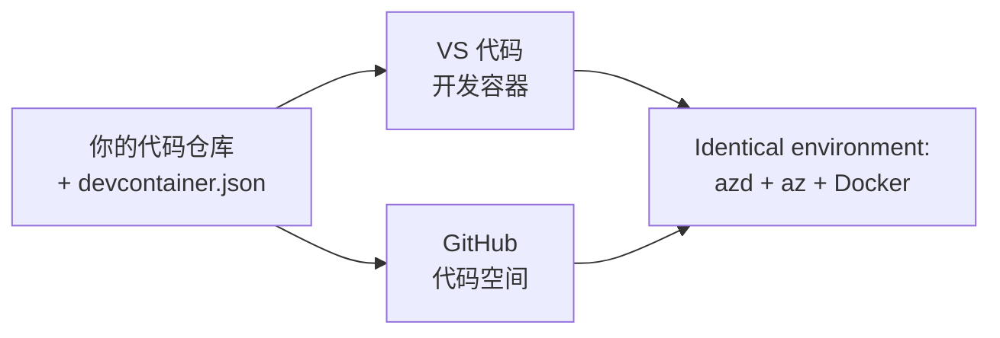

# azd 的开发容器与 GitHub Codespaces

**章节导航：**
- **📚 课程首页**：[azd 初学者指南](../../README.md)
- **📖 当前章节**：第1章 - 基础与快速入门
- **⬅️ 上一章**：[自带应用](bring-your-own-app.md)
- **🚀 下一章**：[第2章：AI优先开发](../chapter-02-ai-development/README.md)

> 验证版本为 2026年7月的 `azd 1.27.1`。

## 介绍

在每台机器上安装 azd、合适的语言运行时、Docker 和 Azure CLI 是繁琐的事情——这也是“在我机器上能运行”的教程对其他人不起作用的首要原因。<strong>开发容器</strong>通过在文件中描述整个工具链来解决这个问题。任何人在 VS Code 或 GitHub Codespaces 打开项目时，都能得到完全相同的环境，且预装了 azd。本课将向你展示如何添加一个开发容器。

## 学习目标

在本课结束时，你将能够：
- 理解什么是开发容器以及它为何有助于 azd
- 向项目添加一个最小的 `.devcontainer/devcontainer.json`
- 通过开发容器 <em>特性</em> 包含 azd、Azure CLI 和 Docker
- 在 GitHub Codespaces 或 VS Code 中打开项目

## 学习成果

完成本课后，你将能够：
- 为 azd 项目编写一个 `devcontainer.json`
- 无需手动安装即可添加 azd 和 Azure 工具
- 在容器内或 Codespace 中运行 `azd up`

---

## 什么是开发容器？

开发容器是基于 Docker 的开发环境，由仓库中的 `.devcontainer/devcontainer.json` 文件定义。当你打开项目时：

- **VS Code**（安装开发容器扩展）会构建容器并连接到它。
- **GitHub Codespaces** 在云端构建相同容器，并提供基于浏览器的编辑器。

无论哪种方式，每个贡献者得到的工具都是一致的——无需“你安装了 azd 吗？”的排错。



---

## 第1步：创建 devcontainer 文件

在项目根目录创建 `.devcontainer/devcontainer.json` 文件：

```json
{
  "name": "azd-project",
  "image": "mcr.microsoft.com/devcontainers/base:bookworm",
  "features": {
    "ghcr.io/devcontainers/features/azure-cli:1": {},
    "ghcr.io/azure/azure-dev/azd:latest": {},
    "ghcr.io/devcontainers/features/docker-in-docker:2": {},
    "ghcr.io/devcontainers/features/node:1": {}
  },
  "customizations": {
    "vscode": {
      "extensions": [
        "ms-azuretools.azure-dev",
        "ms-azuretools.vscode-bicep"
      ]
    }
  },
  "forwardPorts": [3000],
  "postCreateCommand": "azd version"
}
```

每部分的作用：

| 键 | 作用 |
|-----|---------|
| `image` | 容器的基础操作系统 |
| `features` | 预构建的安装包——这里包括 Azure CLI、**azd**、Docker 和 Node.js |
| `customizations.vscode.extensions` | 自动安装 azd 和 Bicep 的 VS Code 扩展 |
| `forwardPorts` | 将应用端口映射到浏览器 |
| `postCreateCommand` | 容器构建完成后运行一次（这里是健康检查） |

> `ghcr.io/azure/azure-dev/azd:latest` 特性是官方在容器中获取 azd 的方式。如果需要可复现性，可以固定具体版本（例如 `azd:1.27.1`）。

---

## 第2步：匹配特性到你的应用语言

用你的应用所用语言的特性替换 `node` 特性：

```jsonc
// Python project
"ghcr.io/devcontainers/features/python:1": {},

// .NET project
"ghcr.io/devcontainers/features/dotnet:2": {},

// Java project
"ghcr.io/devcontainers/features/java:1": {},

// Go project
"ghcr.io/devcontainers/features/go:1": {}
```

如果你的 `host` 是 `containerapp`、`aks` 或其他需要构建容器镜像的平台，请保留 `docker-in-docker`，因为 azd 需要 Docker 来构建和推送镜像。

---

## 第3步：打开项目

**在 VS Code 中：**
1. 安装 **开发容器 (Dev Containers)** 扩展。
2. 打开项目文件夹。
3. 弹出提示时点击 <strong>在容器中重新打开</strong>（或者运行 *Dev Containers: Reopen in Container*）。

**在 GitHub Codespaces 中：**
1. 将仓库推送到 GitHub。
2. 点击 **Code → Codespaces → Create codespace on main**。
3. 等待容器构建完成——终端中会显示 azd 准备就绪。

---

## 第4步：在容器内部署

容器内预装了 azd，因此正常流程即可运行：

```bash
azd auth login --use-device-code   # 设备代码在Codespaces中非常方便
azd up
```

> **为何使用 `--use-device-code`？** 在远程容器或 Codespace 中没有本地浏览器可跳转，因此设备代码登录是可靠的方法。你将在浏览器标签页中粘贴代码完成登录。

---

## 常见问题

| 问题 | 解决方案 |
|---------|-----|
| `azd up` 无法构建镜像 | 添加 `docker-in-docker` 特性 |
| Codespaces 中浏览器登录卡住 | 使用 `azd auth login --use-device-code` |
| 团队成员间工具版本不同 | 固定特性版本（如 `azd:1.27.1`） |
| 应用无法通过浏览器访问 | 将端口添加到 `forwardPorts` |

---

## 总结

- 开发容器使你的 azd 工具链对所有人都可复现。
- 通过开发容器 <em>特性</em> 添加 azd、Azure CLI 和 Docker。
- 匹配语言特性给你的应用，并为容器主机保留 `docker-in-docker`。
- 在 Codespaces 内运行时使用设备代码登录。

---

## 🔗 导航

| 方向 | 资源 |
|-----------|----------|
| <strong>上一章</strong> | [自带应用](bring-your-own-app.md) |
| <strong>章节首页</strong> | [第1章：基础与快速入门](README.md) |
| <strong>下一章</strong> | [第2章：AI优先开发](../chapter-02-ai-development/README.md) |

## 📖 相关资源

- [安装与设置](installation.md)
- [命令速查表](../../resources/cheat-sheet.md)
- [官方开发容器规范](https://containers.dev/)
- [azd 开发容器特性](https://github.com/Azure/azure-dev/tree/main/ext/devcontainer)

---

<!-- CO-OP TRANSLATOR DISCLAIMER START -->
**免责声明**：
本文件由 AI 翻译服务 [Co-op Translator](https://github.com/Azure/co-op-translator) 翻译完成。尽管我们力求准确，但请注意，自动翻译可能包含错误或不准确之处。原始语言版文件应视为权威来源。对于重要信息，建议使用专业人工翻译。我们对因使用本翻译而产生的任何误解或误释不承担责任。
<!-- CO-OP TRANSLATOR DISCLAIMER END -->