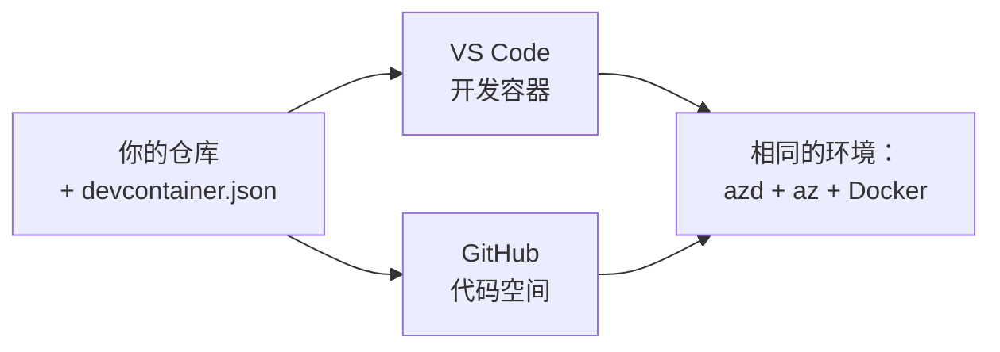

# 开发容器与 GitHub Codespaces（适用于 azd）

**Chapter Navigation:**
- **📚 Course Home**: [AZD 入门](../../README.md)
- **📖 Current Chapter**: 第 1 章 - 基础与快速入门
- **⬅️ Previous**: [自带应用](bring-your-own-app.md)
- **🚀 Next Chapter**: [第 2 章：以 AI 为先的开发](../chapter-02-ai-development/README.md)

> 已在 2026 年 6 月对 `azd 1.25.6` 进行了验证。

## 简介

在每台机器上安装 azd、相应的语言运行时、Docker 和 Azure CLI 很麻烦 —— 这也是“在我的机器上可以运行”的教程在别人机器上失败的首要原因。一个 **开发容器（dev container）** 通过在一个文件中描述你的整个工具链来解决这个问题。任何在 VS Code 或 GitHub Codespaces 中打开该项目的人都会得到完全相同的环境，并且 azd 已经安装好了。本课将向你展示如何添加一个。

## 学习目标

完成本课后，你将：
- 了解什么是开发容器（dev container）以及它为何能帮助 azd
- 向项目添加一个最小的 `.devcontainer/devcontainer.json`
- 通过 Dev Container 的 *features* 包含 azd、Azure CLI 和 Docker
- 在 GitHub Codespaces 或 VS Code 中打开该项目

## 学习成果

完成本课后，你将能够：
- 为 azd 项目编写 `devcontainer.json`
- 在无需手动安装的情况下添加 azd 和 Azure 工具
- 在容器或 Codespace 内运行 `azd up`

---

## 什么是开发容器？

开发容器是基于 Docker 的开发环境，通过仓库中的 `.devcontainer/devcontainer.json` 文件定义。打开项目时：

- **VS Code**（安装 Dev Containers 扩展）会构建该容器并附加到容器上。
- **GitHub Codespaces** 会在云端构建相同的容器，并为你提供基于浏览器的编辑器。

无论哪种方式，每位贡献者都会获得相同的工具——不用再问“你安装了 azd 吗？”来排查问题。



---

## 第 1 步：创建 devcontainer 文件

在项目根目录创建 `.devcontainer/devcontainer.json`：

```json
{
  "name": "azd-project",
  "image": "mcr.microsoft.com/devcontainers/base:bookworm",
  "features": {
    "ghcr.io/devcontainers/features/azure-cli:1": {},
    "ghcr.io/azure/azure-dev/azd:latest": {},
    "ghcr.io/devcontainers/features/docker-in-docker:2": {},
    "ghcr.io/devcontainers/features/node:1": {}
  },
  "customizations": {
    "vscode": {
      "extensions": [
        "ms-azuretools.azure-dev",
        "ms-azuretools.vscode-bicep"
      ]
    }
  },
  "forwardPorts": [3000],
  "postCreateCommand": "azd version"
}
```

What each part does:

| 键 | 用途 |
|-----|---------|
| `image` | 容器的基础操作系统 |
| `features` | 预构建的安装程序——此处包括 Azure CLI、**azd**、Docker 和 Node.js |
| `customizations.vscode.extensions` | 自动安装 azd 和 Bicep 的 VS Code 扩展 |
| `forwardPorts` | 将应用的端口暴露到你的浏览器 |
| `postCreateCommand` | 容器构建完成后运行一次（此处为一个健全性检查） |

> `ghcr.io/azure/azure-dev/azd:latest` 这个 feature 是在容器中获取 azd 的官方方式。如果需要可重现性，请固定特定版本（例如 `azd:1.25.6`）。

---

## 第 2 步：将 feature 与你应用使用的语言相匹配

将 `node` feature 替换为你的应用使用的相应项：

```jsonc
// Python project
"ghcr.io/devcontainers/features/python:1": {},

// .NET project
"ghcr.io/devcontainers/features/dotnet:2": {},

// Java project
"ghcr.io/devcontainers/features/java:1": {},

// Go project
"ghcr.io/devcontainers/features/go:1": {}
```

如果你的 `host` 是 `containerapp`、`aks`，或任何需要构建容器镜像的目标，请保留 `docker-in-docker`，因为 azd 需要 Docker 来构建和推送镜像。

---

## 第 3 步：打开它

**在 VS Code 中：**
1. 安装 **Dev Containers** 扩展。
2. 打开项目文件夹。
3. 在提示时点击 **Reopen in Container**（或运行 *Dev Containers: Reopen in Container*）。

**在 GitHub Codespaces 中：**
1. 将仓库推送到 GitHub。
2. 点击 **Code → Codespaces → Create codespace on main**。
3. 等待容器构建完成——azd 在终端中已准备就绪。

---

## 第 4 步：从容器内部部署

容器中已预装 azd，因此常规工作流程可以直接使用：

```bash
azd auth login --use-device-code   # 在 Codespaces 中，设备代码很方便。
azd up
```

> **为什么使用 `--use-device-code`？** 在远程容器或 Codespace 中没有可供重定向的本地浏览器，因此设备码登录是可靠的方式。你需要在浏览器标签页中粘贴一个代码来完成登录。

---

## 常见陷阱

| 问题 | 修复 |
|---------|-----|
| `azd up` 无法构建镜像 | 添加 `docker-in-docker` feature |
| 浏览器登录在 Codespaces 中挂起 | 使用 `azd auth login --use-device-code` |
| 团队成员之间工具不一致 | 固定 feature 版本（例如 `azd:1.25.6`） |
| 应用在浏览器中无法访问 | 将端口添加到 `forwardPorts` |

---

## 总结

- 开发容器使每个人的 azd 工具链具有可重现性。
- 通过 Dev Container 的 *features* 添加 azd、Azure CLI 和 Docker。
- 将语言相关的 feature 与应用匹配，并在容器主机上保留 `docker-in-docker`。
- 在 Codespaces 中运行时使用设备码登录。

---

## 🔗 导航

| 方向 | 资源 |
|-----------|----------|
| **Previous** | [自带应用](bring-your-own-app.md) |
| **Chapter Home** | [第 1 章：基础与快速入门](README.md) |
| **Next Chapter** | [第 2 章：以 AI 为先的开发](../chapter-02-ai-development/README.md) |

## 📖 相关资源

- [安装与设置](installation.md)
- [命令备忘单](../../resources/cheat-sheet.md)
- [官方 Dev Containers 规范](https://containers.dev/)
- [azd Dev Container feature](https://github.com/Azure/azure-dev/tree/main/ext/devcontainer)

---

<!-- CO-OP TRANSLATOR DISCLAIMER START -->
**免责声明**：
本文件由 AI 翻译服务 [Co-op Translator](https://github.com/Azure/co-op-translator) 翻译完成。尽管我们力求准确，但请注意，自动翻译可能包含错误或不准确之处。原始语言版文件应视为权威来源。对于重要信息，建议使用专业人工翻译。我们对因使用本翻译而产生的任何误解或误释不承担责任。
<!-- CO-OP TRANSLATOR DISCLAIMER END -->