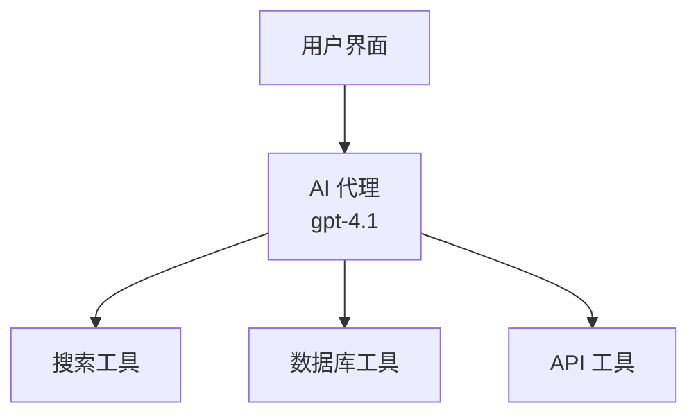
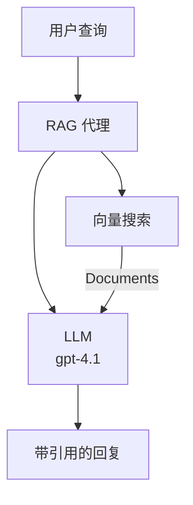
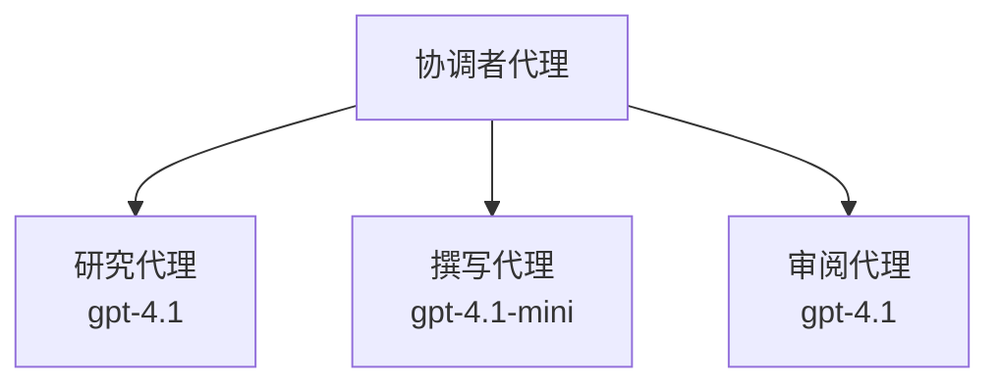

# 使用 Azure Developer CLI 的 AI 代理

**章节导航：**
- **📚 课程主页**：[AZD 入门教程](../../README.md)
- **📖 当前章节**：第 2 章 - AI 优先开发
- **⬅️ 上一章**：[Microsoft Foundry 集成](microsoft-foundry-integration.md)
- **➡️ 下一章**：[AI 模型部署](ai-model-deployment.md)
- **🚀 进阶**：[多代理解决方案](../../examples/retail-scenario.md)

---

## 介绍

AI代理是能够感知环境、做出决策并采取行动以实现特定目标的自主程序。不同于仅响应提示的简单聊天机器人，代理可以：

- <strong>使用工具</strong> - 调用 API、搜索数据库、执行代码
- <strong>规划与推理</strong> - 将复杂任务分解为步骤
- <strong>从上下文中学习</strong> - 保持记忆并适应行为
- <strong>协作</strong> - 与其他代理协同工作（多代理系统）

本指南将向您展示如何使用 Azure Developer CLI（azd）将 AI 代理部署到 Azure。

> **验证说明（2026-07-13）：** 本指南基于 `azd` `1.27.1` 和 `azure.ai.agents` `1.0.0-beta.5` 版本审核。`azd ai` 功能仍处于预览阶段，如果安装的标志不同，请查阅扩展帮助。

## 学习目标

完成本指南后，您将能够：
- 了解 AI 代理是什么以及它们与聊天机器人的区别
- 使用 AZD 部署预建的 AI 代理模板
- 配置 Foundry 代理以创建自定义代理
- 实现基本代理模式（工具使用、RAG、多代理）
- 监控和调试已部署的代理

## 学习成果

完成后，您将能够：
- 通过一条命令将 AI 代理应用部署到 Azure
- 配置代理的工具和功能
- 使用代理实现检索增强生成（RAG）
- 设计复杂工作流的多代理架构
- 解决常见代理部署问题

---

## 🤖 代理和聊天机器人的区别？

| 特性 | 聊天机器人 | AI 代理 |
|---------|---------|----------|
| <strong>行为</strong> | 响应提示 | 采取自主行动 |
| <strong>工具</strong> | 无 | 可以调用 API、搜索、执行代码 |
| <strong>记忆</strong> | 基于会话 | 跨会话持久记忆 |
| <strong>规划</strong> | 单次响应 | 多步骤推理 |
| <strong>协作</strong> | 单一实体 | 可与其他代理协作 |

### 简单比喻

- <strong>聊天机器人</strong> = 信息台上回答问题的工作人员
- **AI 代理** = 可以打电话、预订和完成任务的私人助理

---

## 🚀 快速开始：部署您的第一个代理

### 选项 1：Foundry 代理模板（推荐）

```bash
# 初始化 AI 代理模板
azd init --template get-started-with-ai-agents

# 部署到 Azure
azd up
```

**部署内容包括：**
- ✅ Foundry 代理
- ✅ Microsoft Foundry 模型 (gpt-4.1)
- ✅ Azure AI 搜索（用于 RAG）
- ✅ Azure 容器应用（Web 界面）
- ✅ 应用洞察（监控）

**时间：** 约 15-20 分钟
**费用：** 约 100-150 美元/月（开发环境）

### 选项 2：OpenAI 代理搭配 Prompty

```bash
# 初始化基于 Prompty 的代理模板
azd init --template agent-openai-python-prompty

# 部署到 Azure
azd up
```

**部署内容包括：**
- ✅ Azure Functions（无服务器代理执行）
- ✅ Microsoft Foundry 模型
- ✅ Prompty 配置文件
- ✅ 示例代理实现

**时间：** 约 10-15 分钟
**费用：** 约 50-100 美元/月（开发环境）

### 选项 3：RAG 聊天代理

```bash
# 初始化RAG聊天模板
azd init --template azure-search-openai-demo

# 部署到Azure
azd up
```

**部署内容包括：**
- ✅ Microsoft Foundry 模型
- ✅ 带有示例数据的 Azure AI 搜索
- ✅ 文档处理管道
- ✅ 带引证的聊天界面

**时间：** 约 15-25 分钟
**费用：** 约 80-150 美元/月（开发环境）

### 选项 4：AZD AI 代理初始化（基于清单或模板预览）

如果您有代理清单文件，可以使用 `azd ai` 命令直接搭建 Foundry 代理服务项目。最近的预览版本也增加了基于模板的初始化支持，所以具体的提示流程可能会因扩展版本不同略有差异。

```bash
# 安装 AI 代理扩展
azd extension install azure.ai.agents

# 可选：验证已安装的预览版本
azd extension show azure.ai.agents

# 从代理清单初始化
azd ai agent init -m agent-manifest.yaml

# 部署到 Azure
azd up

# 测试已部署的代理（显示延迟 + 首字节时间）
azd ai agent invoke
```

**何时使用 `azd ai agent init` 与 `azd init --template`：**

| 方式 | 适用情形 | 工作机制 |
|----------|----------|------|
| `azd init --template` | 基于现有示例应用起步 | 克隆完整模板仓库，包括代码和基础设施 |
| `azd ai agent init -m` | 基于您自己的代理清单构建 | 根据您的代理定义搭建项目结构 |

> **提示：** 学习时使用 `azd init --template`（上述选项 1-3）。生产环境构建自定义代理时使用 `azd ai agent init`。

使用 `azd up` 后，同一扩展会指导您完成后续代理生命周期操作：`azd ai agent invoke` 测试，`azd ai agent eval generate` 和 `azd ai agent optimize` 用于质量测评与优化，`azd ai agent delete` 用于清理。详细参考见 [AZD AI CLI 命令](../chapter-08-production/production-ai-practices.md#azd-ai-cli-commands-and-extensions)。

---

## 🏗️ 代理架构模式

### 模式 1：单代理多工具

最简单的代理模式 —— 一个代理可使用多个工具。



**适用场景：**
- 客服机器人
- 研究助理
- 数据分析代理

**AZD 模板：** `azure-search-openai-demo`

### 模式 2：RAG 代理（检索增强生成）

一种代理先检索相关文档再生成回答。



**适用场景：**
- 企业知识库
- 文档问答系统
- 合规与法律研究

**AZD 模板：** `azure-search-openai-demo`

### 模式 3：多代理系统

多个专业代理协同处理复杂任务。



**适用场景：**
- 复杂内容生成
- 多步骤工作流
- 需要不同专业知识的任务

**查看更多：** [多代理协调模式](../chapter-06-pre-deployment/coordination-patterns.md)

---

## ⚙️ 配置代理工具

代理在能使用工具时才更强大。以下是配置常用工具的方法：

### Foundry 代理的工具配置

```python
# agent_config.py
from azure.ai.projects import AIProjectClient
from azure.ai.projects.models import FunctionTool, CodeInterpreterTool

# 定义自定义工具
search_tool = FunctionTool(
    name="search_knowledge_base",
    description="Search the company knowledge base for relevant documents",
    parameters={
        "type": "object",
        "properties": {
            "query": {
                "type": "string",
                "description": "The search query"
            }
        },
        "required": ["query"]
    }
)

# 使用工具创建代理
agent = project_client.agents.create_agent(
    model="gpt-4.1",
    name="Support Agent",
    instructions="You are a helpful support agent. Use the search tool to find relevant information.",
    tools=[search_tool, CodeInterpreterTool()]
)
```

### 环境配置

```bash
# 设置特定代理的环境变量
azd env set AZURE_OPENAI_MODEL "gpt-4.1"
azd env set AGENT_INSTRUCTIONS "You are a helpful assistant..."
azd env set ENABLE_CODE_INTERPRETER "true"
azd env set ENABLE_FILE_SEARCH "true"

# 使用更新的配置进行部署
azd deploy
```

---

## 📊 代理监控

### 应用洞察集成

所有 AZD 代理模板均集成了应用洞察进行监控：

```bash
# 打开监控仪表板
azd monitor --overview

# 查看实时日志
azd monitor --logs

# 查看实时指标
azd monitor --live
```

### 关键监控指标

| 指标 | 描述 | 目标 |
|--------|-------------|--------|
| 响应延迟 | 生成响应耗时 | < 5 秒 |
| 令牌使用量 | 每次请求令牌数 | 费用监控 |
| 工具调用成功率 | 工具执行成功百分比 | > 95% |
| 错误率 | 代理请求失败率 | < 1% |
| 用户满意度 | 反馈评分 | > 4.0/5.0 |

### 自定义代理日志记录

```python
import os
from azure.monitor.opentelemetry import configure_azure_monitor
from opentelemetry import trace

# 使用 OpenTelemetry 配置 Azure Monitor
configure_azure_monitor(
    connection_string=os.environ["APPLICATIONINSIGHTS_CONNECTION_STRING"]
)

tracer = trace.get_tracer(__name__)

def log_agent_interaction(user_query, agent_response, tools_used, latency_ms):
    with tracer.start_as_current_span("agent_interaction") as span:
        span.set_attributes({
            "user_query": user_query,
            "response_length": len(agent_response),
            "tools_used": tools_used,
            "latency_ms": latency_ms
        })
```

> **注意：** 安装所需包：`pip install azure-monitor-opentelemetry opentelemetry`

---

## 💰 成本考虑

### 按模式估算的每月费用

| 模式 | 开发环境 | 生产环境 |
|---------|-----------------|------------|
| 单代理 | $50-100 | $200-500 |
| RAG 代理 | $80-150 | $300-800 |
| 多代理（2-3 个代理） | $150-300 | $500-1,500 |
| 企业多代理 | $300-500 | $1,500-5,000+ |

### 成本优化技巧

1. **对简单任务使用 gpt-4.1-mini**
   ```bash
   azd env set AZURE_OPENAI_MODEL "gpt-4.1-mini"
   ```

2. <strong>对重复查询实现缓存</strong>
   ```python
   from functools import lru_cache
   
   @lru_cache(maxsize=1000)
   def get_cached_response(query_hash):
       return agent.run(query_hash)
   ```

3. <strong>设定每次运行的令牌限制</strong>
   ```python
   # 在运行代理时设置 max_completion_tokens，而不是在创建时设置
   run = project_client.agents.create_run(
       thread_id=thread.id,
       agent_id=agent.id,
       max_completion_tokens=1000  # 限制响应长度
   )
   ```

4. <strong>闲置时缩减至零规模</strong>
   ```bash
   # 容器应用程序自动缩放到零
   azd env set MIN_REPLICAS "0"
   ```

---

## 🔧 代理故障排查

### 常见问题及解决方案

<details>
<summary><strong>❌ 代理未响应工具调用</strong></summary>

```bash
# 检查工具是否正确注册
azd show

# 验证 OpenAI 部署
az cognitiveservices account deployment list \
  --name $AZURE_OPENAI_NAME \
  --resource-group $RG_NAME

# 检查代理日志
azd monitor --logs
```

**常见原因：**
- 工具函数签名不匹配
- 缺少必要权限
- API 端点不可访问
</details>

<details>
<summary><strong>❌ 代理响应延迟高</strong></summary>

```bash
# 检查应用程序洞察中的瓶颈
azd monitor --live

# 考虑使用更快的模型
azd env set AZURE_OPENAI_MODEL "gpt-4.1-mini"
azd deploy
```

**优化建议：**
- 使用流式响应
- 实现响应缓存
- 缩减上下文窗口大小
</details>

<details>
<summary><strong>❌ 代理返回错误或幻觉信息</strong></summary>

```python
# 用更好的系统提示进行改进
instructions = """
You are a helpful assistant. IMPORTANT:
- Only answer based on provided context
- If you don't know, say "I don't know"
- Always cite your sources
- Never make up information
"""

# 添加检索以进行基础支持
agent = project_client.agents.create_agent(
    model="gpt-4.1",
    instructions=instructions,
    tools=[FileSearchTool()]  # 将回复以文档为基础
)
```
</details>

<details>
<summary><strong>❌ 超出令牌限制错误</strong></summary>

```python
# 实现上下文窗口管理
def truncate_context(messages, max_tokens=8000, model="gpt-4.1"):
    """Keep only recent messages within token limit."""
    import tiktoken
    encoding = tiktoken.encoding_for_model(model)
    total_tokens = 0
    truncated = []
    
    for msg in reversed(messages):
        msg_tokens = len(encoding.encode(msg.content))
        if total_tokens + msg_tokens > max_tokens:
            break
        truncated.insert(0, msg)
        total_tokens += msg_tokens
    
    return truncated
```
</details>

---

## 🎓 练习操作

### 练习 1：部署基础代理（20 分钟）

**目标：** 使用 AZD 部署您的第一个 AI 代理

```bash
# 第一步：初始化模板
azd init --template get-started-with-ai-agents

# 第二步：登录到 Azure
azd auth login
# 如果您跨租户工作，添加 --tenant-id <租户 ID>

# 第三步：部署
azd up

# 第四步：测试代理
# 部署后预期输出：
#   部署完成！
#   端点：https://<应用名称>.<区域>.azurecontainerapps.io
# 打开输出中显示的 URL 并尝试提问

# 第五步：查看监控
azd monitor --overview

# 第六步：清理
azd down --force --purge
```

**成功标准：**
- [ ] 代理能回答问题
- [ ] 可通过 `azd monitor` 访问监控仪表盘
- [ ] 资源成功清理

### 练习 2：添加自定义工具（30 分钟）

**目标：** 扩展代理以支持自定义工具

1. 部署代理模板：
   ```bash
   azd init --template get-started-with-ai-agents
   azd up
   ```
2. 在代理代码中创建新工具函数：
   ```python
   def get_weather(location: str) -> str:
       """Get current weather for a location."""
       # 调用天气服务的API
       return f"Weather in {location}: Sunny, 72°F"
   ```
3. 向代理注册此工具：
   ```python
   from azure.ai.projects.models import FunctionTool

   weather_tool = FunctionTool(
       name="get_weather",
       description="Get current weather for a location",
       parameters={
           "type": "object",
           "properties": {
               "location": {"type": "string", "description": "City name"}
           },
           "required": ["location"]
       }
   )

   agent = project_client.agents.create_agent(
       model="gpt-4.1",
       name="Weather Agent",
       tools=[weather_tool]
   )
   ```
4. 重新部署并测试：
   ```bash
   azd deploy
   # 问：“西雅图的天气怎么样？”
   # 预期：代理调用 get_weather("Seattle") 并返回天气信息
   ```

**成功标准：**
- [ ] 代理识别与天气相关的查询
- [ ] 工具调用正确
- [ ] 响应包含天气信息

### 练习 3：构建 RAG 代理（45 分钟）

**目标：** 创建一个基于文档回答问题的代理

```bash
# 第1步：部署RAG模板
azd init --template azure-search-openai-demo
azd up

# 第2步：上传你的文件
# 将PDF/TXT文件放入data/目录，然后运行：
python scripts/prepdocs.py

# 第3步：用特定领域的问题进行测试
# 打开azd up输出中的网页应用URL
# 询问有关你上传文件的问题
# 回答应包含如[doc.pdf]的引用参考
```

**成功标准：**
- [ ] 代理能从上传文档中回答问题
- [ ] 回答包含引用
- [ ] 不出现范围外问题幻觉

---

## 📚 后续进阶

现在您已了解 AI 代理，接下来可探索以下高级主题：

| 主题 | 描述 | 链接 |
|-------|-------------|------|
| <strong>多代理系统</strong> | 构建多个协作代理的系统 | [零售多代理示例](../../examples/retail-scenario.md) |
| <strong>协调模式</strong> | 学习编排与通信模式 | [协调模式](../chapter-06-pre-deployment/coordination-patterns.md) |
| <strong>生产部署</strong> | 企业级代理部署 | [生产 AI 实践](../chapter-08-production/production-ai-practices.md) |
| <strong>代理评测</strong> | 测试与评估代理性能 | [AI 故障排查](../chapter-07-troubleshooting/ai-troubleshooting.md) |
| **AI 研讨会实验室** | 实操：让您的 AI 解决方案支持 AZD | [AI 研讨会实验室](ai-workshop-lab.md) |

---

## 📖 附加资源

### 官方文档
- [Microsoft Foundry Agent Service](https://learn.microsoft.com/azure/ai-services/agents/)
- [Microsoft Foundry Agent Service 快速开始](https://learn.microsoft.com/azure/ai-services/agents/quickstart)
- [语义内核代理框架](https://learn.microsoft.com/semantic-kernel/)

### AI 代理的 AZD 模板
- [AI 代理入门](https://github.com/Azure-Samples/get-started-with-ai-agents)
- [Agent OpenAI Python Prompty](https://github.com/Azure-Samples/agent-openai-python-prompty)
- [Azure Search OpenAI 示例](https://github.com/Azure-Samples/azure-search-openai-demo)

### 社区资源
- [Awesome AZD - 代理模板](https://azure.github.io/awesome-azd/?tags=ai-agents)
- [Azure AI Discord](https://discord.gg/microsoft-azure)
- [Microsoft Foundry Discord](https://discord.gg/nTYy5BXMWG)

### 适用于您的编辑器的代理技能
- [**Microsoft Azure 代理技能**](https://skills.sh/microsoft/github-copilot-for-azure) - 在 GitHub Copilot、Cursor 或任何支持的代理中安装可复用的 Azure 开发 AI 代理技能。包含针对 [Azure AI](https://skills.sh/microsoft/github-copilot-for-azure/azure-ai)、[Microsoft Foundry](https://skills.sh/microsoft/github-copilot-for-azure/microsoft-foundry)、[部署](https://skills.sh/microsoft/github-copilot-for-azure/azure-deploy) 和 [诊断](https://skills.sh/microsoft/github-copilot-for-azure/azure-diagnostics) 的技能：
  ```bash
  npx skills add microsoft/github-copilot-for-azure
  ```

---

<strong>导航</strong>
- <strong>上一课</strong>：[Microsoft Foundry 集成](microsoft-foundry-integration.md)
- <strong>下一课</strong>：[AI 模型部署](ai-model-deployment.md)

---

<!-- CO-OP TRANSLATOR DISCLAIMER START -->
**免责声明**：
本文件由 AI 翻译服务 [Co-op Translator](https://github.com/Azure/co-op-translator) 翻译完成。尽管我们力求准确，但请注意，自动翻译可能包含错误或不准确之处。原始语言版文件应视为权威来源。对于重要信息，建议使用专业人工翻译。我们对因使用本翻译而产生的任何误解或误释不承担责任。
<!-- CO-OP TRANSLATOR DISCLAIMER END -->