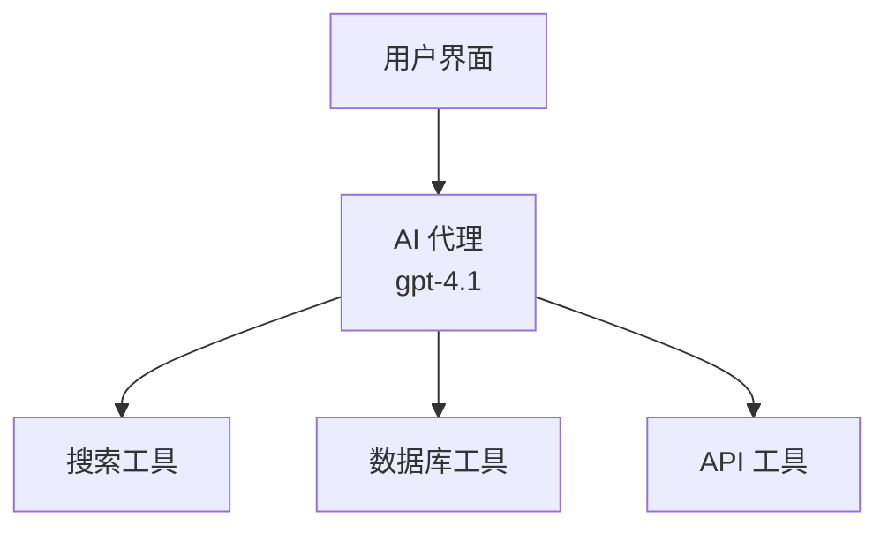
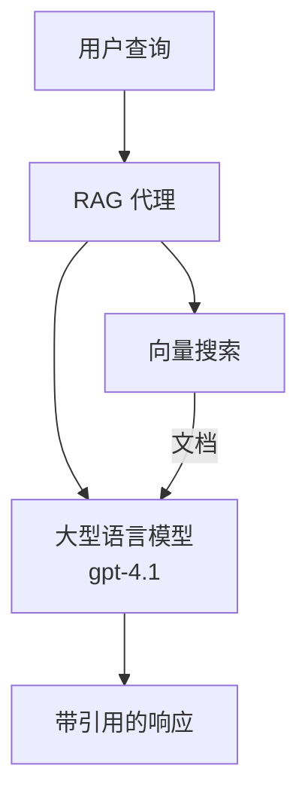

# AI Agents 使用 Azure Developer CLI

**章节导航:**
- **📚 课程首页**: [AZD 入门](../../README.md)
- **📖 当前章节**: 第 2 章 - AI 优先开发
- **⬅️ 上一章**: [Microsoft Foundry 集成](microsoft-foundry-integration.md)
- **➡️ 下一章**: [AI 模型部署](ai-model-deployment.md)
- **🚀 高级**: [多代理解决方案](../../examples/retail-scenario.md)

---

## 介绍

AI 代理是能够感知其环境、做出决策并采取行动以实现特定目标的自主程序。与仅对提示作出响应的简单聊天机器人不同，代理可以：

- <strong>使用工具</strong> - 调用 API、搜索数据库、执行代码
- <strong>规划与推理</strong> - 将复杂任务拆分为步骤
- <strong>从上下文中学习</strong> - 保持记忆并适应行为
- <strong>协作</strong> - 与其他代理协同工作（多代理系统）

本指南向您展示如何使用 Azure Developer CLI (azd) 将 AI 代理部署到 Azure。

## 学习目标

完成本指南后，您将能够：
- 了解什么是 AI 代理以及它们与聊天机器人的不同
- 使用 AZD 部署预构建的 AI 代理模板
- 为自定义代理配置 Foundry Agents
- 实现基本的代理模式（工具使用、RAG、多代理）
- 监控和调试已部署的代理

## 学习成果

完成后，您将能够：
- 使用单条命令将 AI 代理应用部署到 Azure
- 配置代理工具和功能
- 使用代理实现检索增强生成（RAG）
- 为复杂工作流设计多代理架构
- 排查常见的代理部署问题

---

## 🤖 代理与聊天机器人的区别？

| 特征 | 聊天机器人 | AI 代理 |
|---------|---------|----------|
| <strong>行为</strong> | 回答提示 | 执行自主操作 |
| <strong>工具</strong> | 无 | 可调用 API、搜索、执行代码 |
| <strong>记忆</strong> | 仅基于会话 | 跨会话的持久记忆 |
| <strong>规划</strong> | 单次响应 | 多步骤推理 |
| <strong>协作</strong> | 单一实体 | 可与其他代理协作 |

### 简易比喻

- <strong>聊天机器人</strong> = 在信息台回答问题的友好工作人员
- **AI 代理** = 能为你打电话、预约并完成任务的私人助理

---

## 🚀 快速开始：部署你的第一个代理

### 选项 1：Foundry Agents 模板（推荐）

```bash
# 初始化 AI 代理模板
azd init --template get-started-with-ai-agents

# 部署到 Azure
azd up
```

**部署内容：**
- ✅ Foundry Agents
- ✅ Microsoft Foundry 模型 (gpt-4.1)
- ✅ Azure AI Search（用于 RAG）
- ✅ Azure Container Apps（Web 界面）
- ✅ Application Insights（监控）

**时间：** ~15-20 分钟  
**费用：** ~$100-150/月（开发环境）

### 选项 2：使用 Prompty 的 OpenAI 代理

```bash
# 初始化基于 Prompty 的代理模板
azd init --template agent-openai-python-prompty

# 部署到 Azure
azd up
```

**部署内容：**
- ✅ Azure Functions（无服务器代理执行）
- ✅ Microsoft Foundry 模型
- ✅ Prompty 配置文件
- ✅ 示例代理实现

**时间：** ~10-15 分钟  
**费用：** ~$50-100/月（开发环境）

### 选项 3：RAG 聊天代理

```bash
# 初始化 RAG 聊天模板
azd init --template azure-search-openai-demo

# 部署到 Azure
azd up
```

**部署内容：**
- ✅ Microsoft Foundry 模型
- ✅ 带示例数据的 Azure AI Search
- ✅ 文档处理管道
- ✅ 带引用的聊天界面

**时间：** ~15-25 分钟  
**费用：** ~$80-150/月（开发环境）

### 选项 4：AZD AI Agent Init（基于清单）

如果您有代理清单文件，可以使用 `azd ai` 命令直接搭建 Foundry Agent Service 项目：

```bash
# 安装 AI 代理扩展
azd extension install azure.ai.agents

# 从代理清单初始化
azd ai agent init -m agent-manifest.yaml

# 部署到 Azure
azd up
```

**何时使用 `azd ai agent init` 与 `azd init --template`:**

| 方法 | 适用场景 | 工作方式 |
|----------|----------|------|
| `azd init --template` | 从可运行的示例应用开始 | 克隆包含代码 + 基础设施的完整模板仓库 |
| `azd ai agent init -m` | 基于您自己的代理清单构建 | 从您的代理定义搭建项目结构 |

> **提示：** 在学习时使用 `azd init --template`（上面的选项 1-3）。在使用您自己的清单构建生产代理时使用 `azd ai agent init`。完整参考请参见 [AZD AI CLI Commands](../chapter-08-production/production-ai-practices.md#azd-ai-cli-commands-and-extensions)。

---

## 🏗️ 代理架构模式

### 模式 1：单一代理使用多个工具

最简单的代理模式 —— 一个代理可以使用多个工具。


**适用场景：**
- 客服机器人
- 研究助手
- 数据分析代理

**AZD 模板：** `azure-search-openai-demo`

### 模式 2：RAG 代理（检索增强生成）

先检索相关文档再生成回答的代理。


**适用场景：**
- 企业知识库
- 文档问答系统
- 合规与法律研究

**AZD 模板：** `azure-search-openai-demo`

### 模式 3：多代理系统

多个专门化代理协同处理复杂任务。


**适用场景：**
- 复杂内容生成
- 多步骤工作流
- 需要不同专业知识的任务

**了解更多：** [多代理协调模式](../chapter-06-pre-deployment/coordination-patterns.md)

---

## ⚙️ 配置代理工具

当代理能够使用工具时，它们会变得更强大。以下是如何配置常见工具：

### Foundry Agents 中的工具配置

```python
# agent_config.py
from azure.ai.projects import AIProjectClient
from azure.ai.projects.models import FunctionTool, CodeInterpreterTool

# 定义自定义工具
search_tool = FunctionTool(
    name="search_knowledge_base",
    description="Search the company knowledge base for relevant documents",
    parameters={
        "type": "object",
        "properties": {
            "query": {
                "type": "string",
                "description": "The search query"
            }
        },
        "required": ["query"]
    }
)

# 使用工具创建代理
agent = project_client.agents.create_agent(
    model="gpt-4.1",
    name="Support Agent",
    instructions="You are a helpful support agent. Use the search tool to find relevant information.",
    tools=[search_tool, CodeInterpreterTool()]
)
```

### 环境配置

```bash
# 为代理设置特定的环境变量
azd env set AZURE_OPENAI_MODEL "gpt-4.1"
azd env set AGENT_INSTRUCTIONS "You are a helpful assistant..."
azd env set ENABLE_CODE_INTERPRETER "true"
azd env set ENABLE_FILE_SEARCH "true"

# 使用更新的配置进行部署
azd deploy
```

---

## 📊 监控代理

### Application Insights 集成

所有 AZD 代理模板都包含用于监控的 Application Insights：

```bash
# 打开监控仪表板
azd monitor --overview

# 查看实时日志
azd monitor --logs

# 查看实时指标
azd monitor --live
```

### 需要跟踪的关键指标

| 指标 | 描述 | 目标 |
|--------|-------------|--------|
| 响应延迟 | 生成响应所需时间 | < 5 秒 |
| 令牌使用量 | 每次请求的令牌数 | 监控以控制成本 |
| 工具调用成功率 | 工具执行成功的百分比 | > 95% |
| 错误率 | 代理请求失败率 | < 1% |
| 用户满意度 | 反馈评分 | > 4.0/5.0 |

### 代理的自定义日志记录

```python
import os
from azure.monitor.opentelemetry import configure_azure_monitor
from opentelemetry import trace

# 使用 OpenTelemetry 配置 Azure 监视器
configure_azure_monitor(
    connection_string=os.environ["APPLICATIONINSIGHTS_CONNECTION_STRING"]
)

tracer = trace.get_tracer(__name__)

def log_agent_interaction(user_query, agent_response, tools_used, latency_ms):
    with tracer.start_as_current_span("agent_interaction") as span:
        span.set_attributes({
            "user_query": user_query,
            "response_length": len(agent_response),
            "tools_used": tools_used,
            "latency_ms": latency_ms
        })
```

> **注意：** 安装所需软件包： `pip install azure-monitor-opentelemetry opentelemetry`

---

## 💰 费用考虑

### 按模式估算的月费用

| 模式 | 开发环境 | 生产 |
|---------|-----------------|------------|
| 单一代理 | $50-100 | $200-500 |
| RAG 代理 | $80-150 | $300-800 |
| 多代理（2-3 个） | $150-300 | $500-1,500 |
| 企业级多代理 | $300-500 | $1,500-5,000+ |

### 成本优化建议

1. **对简单任务使用 gpt-4.1-mini**
   ```bash
   azd env set AZURE_OPENAI_MODEL "gpt-4.1-mini"
   ```

2. <strong>为重复查询实现缓存</strong>
   ```python
   from functools import lru_cache
   
   @lru_cache(maxsize=1000)
   def get_cached_response(query_hash):
       return agent.run(query_hash)
   ```

3. <strong>为每次运行设置令牌限制</strong>
   ```python
   # 在运行代理时设置 max_completion_tokens，而不是在创建时
   run = project_client.agents.create_run(
       thread_id=thread.id,
       agent_id=agent.id,
       max_completion_tokens=1000  # 限制响应长度
   )
   ```

4. <strong>闲置时缩容到零</strong>
   ```bash
   # 容器应用会自动缩放至零
   azd env set MIN_REPLICAS "0"
   ```

---

## 🔧 排查代理问题

### 常见问题与解决方案

<details>
<summary><strong>❌ 代理未响应工具调用</strong></summary>

```bash
# 检查工具是否已正确注册
azd show

# 验证 OpenAI 部署
az cognitiveservices account deployment list \
  --name $AZURE_OPENAI_NAME \
  --resource-group $RG_NAME

# 检查代理日志
azd monitor --logs
```

**常见原因：**
- 工具函数签名不匹配
- 缺少所需权限
- API 端点不可访问
</details>

<details>
<summary><strong>❌ 代理响应延迟高</strong></summary>

```bash
# 检查 Application Insights 以查找瓶颈
azd monitor --live

# 考虑使用更快的模型
azd env set AZURE_OPENAI_MODEL "gpt-4.1-mini"
azd deploy
```

**优化建议：**
- 使用流式响应
- 实现响应缓存
- 减小上下文窗口大小
</details>

<details>
<summary><strong>❌ 代理返回不正确或产生幻觉信息</strong></summary>

```python
# 通过更好的系统提示进行改进
instructions = """
You are a helpful assistant. IMPORTANT:
- Only answer based on provided context
- If you don't know, say "I don't know"
- Always cite your sources
- Never make up information
"""

# 添加用于接地的检索
agent = project_client.agents.create_agent(
    model="gpt-4.1",
    instructions=instructions,
    tools=[FileSearchTool()]  # 在文档中为回答提供依据
)
```
</details>

<details>
<summary><strong>❌ 超出令牌限制错误</strong></summary>

```python
# 实现上下文窗口管理
def truncate_context(messages, max_tokens=8000, model="gpt-4.1"):
    """Keep only recent messages within token limit."""
    import tiktoken
    encoding = tiktoken.encoding_for_model(model)
    total_tokens = 0
    truncated = []
    
    for msg in reversed(messages):
        msg_tokens = len(encoding.encode(msg.content))
        if total_tokens + msg_tokens > max_tokens:
            break
        truncated.insert(0, msg)
        total_tokens += msg_tokens
    
    return truncated
```
</details>

---

## 🎓 实践练习

### 练习 1：部署一个基础代理（20 分钟）

**目标：** 使用 AZD 部署你的第一个 AI 代理

```bash
# 步骤 1：初始化模板
azd init --template get-started-with-ai-agents

# 步骤 2：登录到 Azure
azd auth login

# 步骤 3：部署
azd up

# 步骤 4：测试代理
# 部署后预期输出：
#   部署完成！
#   端点: https://<app-name>.<region>.azurecontainerapps.io
# 打开输出中显示的 URL 并尝试提问

# 步骤 5：查看监控
azd monitor --overview

# 步骤 6：清理
azd down --force --purge
```

**成功标准：**
- [ ] 代理能响应问题
- [ ] 可以通过 `azd monitor` 访问监控仪表板
- [ ] 资源成功清理

### 练习 2：添加自定义工具（30 分钟）

**目标：** 为代理扩展自定义工具

1. 部署代理模板：
   ```bash
   azd init --template get-started-with-ai-agents
   azd up
   ```
2. 在你的代理代码中创建一个新的工具函数：
   ```python
   def get_weather(location: str) -> str:
       """Get current weather for a location."""
       # 调用天气服务的 API
       return f"Weather in {location}: Sunny, 72°F"
   ```
3. 在代理中注册该工具：
   ```python
   from azure.ai.projects.models import FunctionTool

   weather_tool = FunctionTool(
       name="get_weather",
       description="Get current weather for a location",
       parameters={
           "type": "object",
           "properties": {
               "location": {"type": "string", "description": "City name"}
           },
           "required": ["location"]
       }
   )

   agent = project_client.agents.create_agent(
       model="gpt-4.1",
       name="Weather Agent",
       tools=[weather_tool]
   )
   ```
4. 重新部署并测试：
   ```bash
   azd deploy
   # 询问: "西雅图的天气怎么样？"
   # 预期: 代理调用 get_weather("Seattle") 并返回天气信息
   ```

**成功标准：**
- [ ] 代理能识别与天气相关的查询
- [ ] 工具被正确调用
- [ ] 响应包含天气信息

### 练习 3：构建 RAG 代理（45 分钟）

**目标：** 创建一个能从你的文档中回答问题的代理

```bash
# 步骤 1：部署 RAG 模板
azd init --template azure-search-openai-demo
azd up

# 步骤 2：上传您的文档
# 将 PDF/TXT 文件放入 data/ 目录，然后运行：
python scripts/prepdocs.py

# 步骤 3：使用特定领域的问题进行测试
# 从 azd up 的输出中打开 Web 应用的 URL
# 就您上传的文档提问
# 响应应包含像 [doc.pdf] 这样的引用
```

**成功标准：**
- [ ] 代理能基于上传的文档作答
- [ ] 响应包含引用
- [ ] 对超出范围的问题不产生幻觉

---

## 📚 下一步

现在你已经了解了 AI 代理，探索以下高级主题：

| 话题 | 描述 | 链接 |
|-------|-------------|------|
| <strong>多代理系统</strong> | 构建具有多个协作代理的系统 | [零售多代理示例](../../examples/retail-scenario.md) |
| <strong>协调模式</strong> | 学习编排与通信模式 | [协调模式](../chapter-06-pre-deployment/coordination-patterns.md) |
| <strong>生产部署</strong> | 面向企业的代理部署 | [生产 AI 实践](../chapter-08-production/production-ai-practices.md) |
| <strong>代理评估</strong> | 测试和评估代理性能 | [AI 排错](../chapter-07-troubleshooting/ai-troubleshooting.md) |
| **AI 研讨会实验室** | 实操：使你的 AI 解决方案支持 AZD | [AI Workshop Lab](ai-workshop-lab.md) |

---

## 📖 附加资源

### 官方文档
- [Azure AI 代理服务](https://learn.microsoft.com/azure/ai-services/agents/)
- [Azure AI Foundry Agent Service 快速入门](https://learn.microsoft.com/azure/ai-services/agents/quickstart)
- [Semantic Kernel 代理框架](https://learn.microsoft.com/semantic-kernel/)

### 用于代理的 AZD 模板
- [开始使用 AI 代理](https://github.com/Azure-Samples/get-started-with-ai-agents)
- [Agent OpenAI Python Prompty](https://github.com/Azure-Samples/agent-openai-python-prompty)
- [Azure Search OpenAI 示例](https://github.com/Azure-Samples/azure-search-openai-demo)

### 社区资源
- [Awesome AZD - 代理模板](https://azure.github.io/awesome-azd/?tags=ai-agents)
- [Azure AI Discord](https://discord.gg/microsoft-azure)
- [Microsoft Foundry Discord](https://discord.gg/nTYy5BXMWG)

### 适用于你的编辑器的代理技能
- [**Microsoft Azure 代理技能**](https://skills.sh/microsoft/github-copilot-for-azure) - 在 GitHub Copilot、Cursor 或任何受支持的代理中安装可重用的 Azure 开发 AI 代理技能。包含用于 [Azure AI](https://skills.sh/microsoft/github-copilot-for-azure/azure-ai)、[Microsoft Foundry](https://skills.sh/microsoft/github-copilot-for-azure/microsoft-foundry)、[部署](https://skills.sh/microsoft/github-copilot-for-azure/azure-deploy) 和 [诊断](https://skills.sh/microsoft/github-copilot-for-azure/azure-diagnostics) 的技能：
  ```bash
  npx skills add microsoft/github-copilot-for-azure
  ```

---

<strong>导航</strong>
- <strong>上一课</strong>: [Microsoft Foundry 集成](microsoft-foundry-integration.md)
- <strong>下一课</strong>: [AI 模型部署](ai-model-deployment.md)

---

<!-- CO-OP TRANSLATOR DISCLAIMER START -->
**免责声明**:
本文件使用 AI 翻译服务 [Co-op Translator](https://github.com/Azure/co-op-translator) 进行翻译。尽管我们努力确保准确性，但请注意，自动翻译可能包含错误或不准确之处。原始语言的原文应被视为具有权威性的版本。对于重要信息，建议使用专业人工翻译。我们不对因使用本翻译而引起的任何误解或曲解承担责任。
<!-- CO-OP TRANSLATOR DISCLAIMER END -->