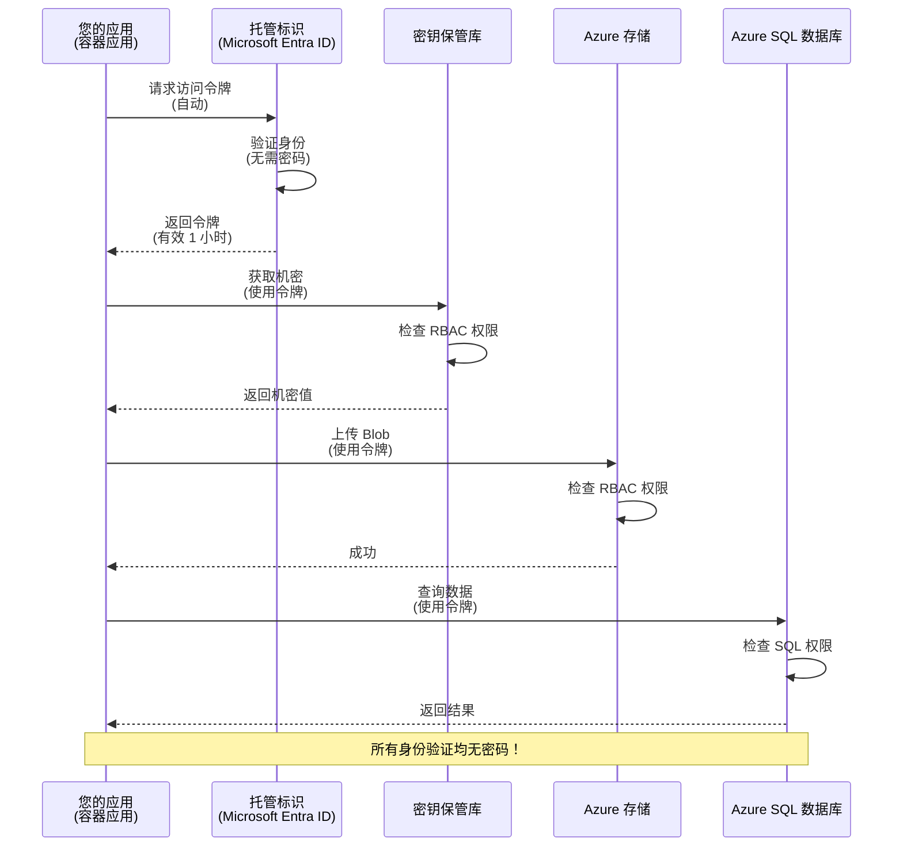
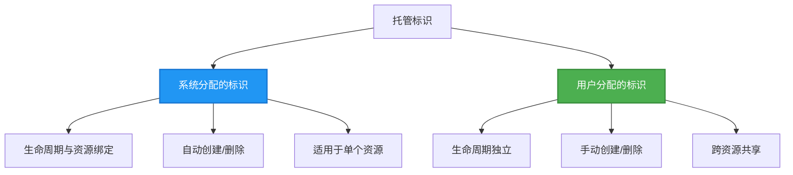

# 认证模式与托管身份

⏱️ <strong>预计时间</strong>: 45-60 分钟 | 💰 <strong>成本影响</strong>: 免费（无额外费用） | ⭐ <strong>复杂度</strong>: 中级

**📚 学习路径:**
- ← 上一节: [配置管理](configuration.md) - 管理环境变量和机密
- 🎯 <strong>当前位置</strong>: 认证与安全（托管身份、Key Vault、安全模式）
- → 下一节: [第一个项目](first-project.md) - 构建你的第一个 AZD 应用
- 🏠 [课程主页](../../README.md)

---

## 本课你将学习

完成本课后，你将能够：
- 了解 Azure 认证模式（密钥、连接字符串、托管身份）
- 实现 <strong>托管身份</strong> 以实现无密码认证
- 使用 **Azure Key Vault** 集成来保护机密
- 为 AZD 部署配置 **基于角色的访问控制 (RBAC)**
- 在 Container Apps 和 Azure 服务中应用安全最佳实践
- 将基于密钥的认证迁移到基于身份的认证

## 为什么托管身份重要

### 问题：传统认证

**在托管身份之前：**
```javascript
// ❌ 安全风险：代码中硬编码的机密
const connectionString = "Server=mydb.database.windows.net;User=admin;Password=P@ssw0rd123";
const storageKey = "xK7mN9pQ2wR5tY8uI0oP3aS6dF1gH4jK...";
const cosmosKey = "C2x7B9n4M1p8Q5w3E6r0T2y5U8i1O4p7...";
```

**存在的问题：**
- 🔴 **代码、配置文件、环境变量中暴露机密**
- 🔴 <strong>凭据轮换</strong> 需要修改代码并重新部署
- 🔴 <strong>审计难题</strong> - 谁在何时访问了什么？
- 🔴 <strong>蔓延</strong> - 机密散落在多个系统中
- 🔴 <strong>合规风险</strong> - 无法通过安全审计

### 解决方案：托管身份

**在启用托管身份之后：**
```javascript
// ✅ 安全：代码中没有机密信息
const credential = new DefaultAzureCredential();
const client = new BlobServiceClient(
  "https://mystorageaccount.blob.core.windows.net",
  credential  // Azure 会自动处理身份验证
);
```

**好处：**
- ✅ <strong>代码或配置中无任何机密</strong>
- ✅ <strong>自动轮换</strong> - 由 Azure 处理
- ✅ <strong>完整审计日志</strong> 在 Microsoft Entra ID 日志中可见
- ✅ <strong>集中化安全管理</strong> - 在 Azure 门户中管理
- ✅ <strong>满足合规要求</strong> - 符合安全标准

<strong>类比</strong>：传统认证就像携带多把不同门的实体钥匙。托管身份就像一个安全徽章，根据你的身份自动授予访问权限——无需丢失、复制或轮换钥匙。

---

## 架构概览

### 托管身份的认证流程


```mermaid
sequenceDiagram
    participant App as 您的应用<br/>(容器应用)
    participant MI as 托管标识<br/>(Microsoft Entra ID)
    participant KV as 密钥保管库
    participant Storage as Azure 存储
    participant DB as Azure SQL 数据库
    
    App->>MI: 请求访问令牌<br/>(自动)
    MI->>MI: 验证身份<br/>(无需密码)
    MI-->>App: 返回令牌<br/>(有效 1 小时)
    
    App->>KV: 获取机密<br/>(使用令牌)
    KV->>KV: 检查 RBAC 权限
    KV-->>App: 返回机密值
    
    App->>Storage: 上传 Blob<br/>(使用令牌)
    Storage->>Storage: 检查 RBAC 权限
    Storage-->>App: 成功
    
    App->>DB: 查询数据<br/>(使用令牌)
    DB->>DB: 检查 SQL 权限
    DB-->>App: 返回结果
    
    Note over App,DB: 所有身份验证均无密码！
```

### 托管身份的类型


```mermaid
graph TB
    MI[托管标识]
    SystemAssigned[系统分配的标识]
    UserAssigned[用户分配的标识]
    
    MI --> SystemAssigned
    MI --> UserAssigned
    
    SystemAssigned --> SA1[生命周期与资源绑定]
    SystemAssigned --> SA2[自动创建/删除]
    SystemAssigned --> SA3[适用于单个资源]
    
    UserAssigned --> UA1[生命周期独立]
    UserAssigned --> UA2[手动创建/删除]
    UserAssigned --> UA3[跨资源共享]
    
    style SystemAssigned fill:#2196F3,stroke:#1976D2,stroke-width:2px,color:#fff
    style UserAssigned fill:#4CAF50,stroke:#388E3C,stroke-width:2px,color:#fff
```

| 功能 | 系统分配 | 用户分配 |
|---------|----------------|---------------|
| <strong>生命周期</strong> | 与资源绑定 | 独立存在 |
| <strong>创建</strong> | 随资源自动创建 | 手动创建 |
| <strong>删除</strong> | 随资源删除 | 资源删除后保留 |
| <strong>共享</strong> | 仅限单个资源 | 可被多个资源共享 |
| <strong>使用场景</strong> | 简单场景 | 复杂的多资源场景 |
| **AZD 默认** | ✅ 推荐 | 可选 |

---

## 先决条件

### 必备工具

你应该已在之前的课程中安装了这些工具：

```bash
# 验证 Azure Developer CLI
azd version
# ✅ 预期：azd 版本 1.0.0 或更高

# 验证 Azure CLI
az --version
# ✅ 预期：azure-cli 2.50.0 或更高
```

### Azure 要求

- 有效的 Azure 订阅
- 具备以下权限：
  - 创建托管身份
  - 分配 RBAC 角色
  - 创建 Key Vault 资源
  - 部署 Container Apps

### 知识先决条件

你应该已经完成以下内容：
- [安装指南](installation.md) - AZD 安装
- [AZD 基础](azd-basics.md) - 核心概念
- [配置管理](configuration.md) - 环境变量

---

## 课程 1：理解认证模式

### 模式 1：连接字符串（传统 - 避免）

**工作原理：**
```bash
# 连接字符串包含凭据
STORAGE_CONNECTION_STRING="DefaultEndpointsProtocol=https;AccountName=myaccount;AccountKey=xK7mN9pQ2wR5..."
COSMOS_CONNECTION_STRING="AccountEndpoint=https://myaccount.documents.azure.com:443/;AccountKey=C2x7..."
SQL_CONNECTION_STRING="Server=myserver.database.windows.net;User=admin;Password=P@ssw0rd..."
```

**问题：**
- ❌ 机密在环境变量中可见
- ❌ 在部署系统中被记录
- ❌ 难以轮换
- ❌ 无访问审计记录

**使用时机：** 仅用于本地开发，绝不用于生产环境。

---

### 模式 2：Key Vault 引用（更佳）

**工作原理：**
```bicep
// Store secret in Key Vault
resource keyVault 'Microsoft.KeyVault/vaults@2023-02-01' = {
  name: 'mykv'
  properties: {
    enableRbacAuthorization: true
  }
}

// Reference in Container App
env: [
  {
    name: 'STORAGE_KEY'
    secretRef: 'storage-key'  // References Key Vault
  }
]
```

**好处：**
- ✅ 机密安全地存储在 Key Vault 中
- ✅ 集中化的机密管理
- ✅ 无需修改代码即可轮换

**局限性：**
- ⚠️ 仍然使用密钥/密码
- ⚠️ 需要管理 Key Vault 的访问权限

**使用时机：** 从连接字符串迁移到托管身份的过渡步骤。

---

### 模式 3：托管身份（最佳实践）

**工作原理：**
```bicep
// Enable managed identity
resource containerApp 'Microsoft.App/containerApps@2023-05-01' = {
  name: 'myapp'
  identity: {
    type: 'SystemAssigned'  // Automatically creates identity
  }
}

// Grant permissions
resource roleAssignment 'Microsoft.Authorization/roleAssignments@2022-04-01' = {
  scope: storageAccount
  properties: {
    roleDefinitionId: storageBlobDataContributorRole
    principalId: containerApp.identity.principalId
  }
}
```

**应用代码：**
```javascript
// 不需要秘密！
const { DefaultAzureCredential } = require('@azure/identity');
const { BlobServiceClient } = require('@azure/storage-blob');

const credential = new DefaultAzureCredential();
const blobServiceClient = new BlobServiceClient(
  'https://mystorageaccount.blob.core.windows.net',
  credential
);
```

**好处：**
- ✅ 代码/配置中无任何机密
- ✅ 自动凭据轮换
- ✅ 完整审计追踪
- ✅ 基于 RBAC 的权限控制
- ✅ 符合合规要求

**使用时机：** 在生产应用中始终使用。

---

### 模式 4：服务主体（CI/CD 与自动化）

托管身份是 *在 Azure 内运行的资源* 的黄金标准。但对于运行在 **Azure 之外** 的事物——比如在构建代理上的 CI/CD 管道，或在无法使用交互式登录的笔记本脚本——则需要使用 <strong>服务主体</strong>：一种具有自身凭据的非人类身份，自动化进程可以以该身份进行登录。

**工作原理：**

创建针对资源组范围的服务主体（最小权限）：

```bash
az ad sp create-for-rbac \
  --name "myapp-cicd" \
  --role contributor \
  --scopes /subscriptions/<sub-id>/resourceGroups/<rg-name>
```

这会打印出 client ID、client secret 和 tenant ID。azd 可以使用它们进行非交互式登录：

```bash
azd auth login \
  --client-id "<appId>" \
  --client-secret "<password>" \
  --tenant-id "<tenant>"
```

**优先使用联合凭据 (OIDC) 而不是密钥。** 与其使用长期有效的客户端密钥，不如配置联合凭据，让管道交换短期令牌——没有密钥可泄露或轮换：

```bash
azd auth login \
  --client-id "<appId>" \
  --federated-credential-provider "github" \
  --tenant-id "<tenant>"
```

> `azd pipeline config` 会为你自动设置。参见 [第 8 章](../chapter-08-production/production-ai-practices.md) 的 CI/CD 步骤指南。

**好处：**
- ✅ 可在 Azure 之外使用（构建代理、本地机房、其他云）
- ✅ 可以将权限限定到单个资源组和一个角色
- ✅ 联合（OIDC）变体不使用存储的密钥

**权衡：**
- ⚠️ 基于密钥的变体需要谨慎存储和轮换
- ⚠️ 泄露的密钥将授予服务主体的一切权限——保持作用域最小化

**使用时机：** 适用于无法使用托管身份的 CI/CD 管道和自动化场景。对于客户端密钥，始终优先使用 **联合/OIDC** 变体；当工作负载运行在 Azure 内时，优先使用托管身份。

**安全存储凭证：**
- 切勿提交密钥——使用你的管道的密钥存储（GitHub Actions secrets、Azure DevOps 变量组 / Key Vault）。
- 将服务主体的作用域限定为所需的最小角色和资源组。
- 设置过期并进行轮换，或通过 OIDC 完全消除密钥。

---

## 课程 2：在 AZD 中实现托管身份

### 逐步实现

让我们构建一个使用托管身份访问 Azure Storage 和 Key Vault 的安全 Container App。

### 项目结构

```
secure-app/
├── azure.yaml                 # AZD configuration
├── infra/
│   ├── main.bicep            # Main infrastructure
│   ├── core/
│   │   ├── identity.bicep    # Managed identity setup
│   │   ├── keyvault.bicep    # Key Vault configuration
│   │   └── storage.bicep     # Storage with RBAC
│   └── app/
│       └── container-app.bicep
└── src/
    ├── app.js                # Application code
    ├── package.json
    └── Dockerfile
```

### 1. 配置 AZD (azure.yaml)

```yaml
name: secure-app
metadata:
  template: secure-app@1.0.0

services:
  api:
    project: ./src
    language: js
    host: containerapp

# Enable managed identity (AZD handles this automatically)
```

### 2. 基础设施：启用托管身份

**文件: `infra/main.bicep`**

```bicep
targetScope = 'subscription'

param environmentName string
param location string = 'eastus'

var tags = { 'azd-env-name': environmentName }

// Resource group
resource rg 'Microsoft.Resources/resourceGroups@2021-04-01' = {
  name: 'rg-${environmentName}'
  location: location
  tags: tags
}

// Storage Account
module storage './core/storage.bicep' = {
  name: 'storage'
  scope: rg
  params: {
    name: 'st${uniqueString(rg.id)}'
    location: location
    tags: tags
  }
}

// Key Vault
module keyVault './core/keyvault.bicep' = {
  name: 'keyvault'
  scope: rg
  params: {
    name: 'kv-${uniqueString(rg.id)}'
    location: location
    tags: tags
  }
}

// Container App with Managed Identity
module containerApp './app/container-app.bicep' = {
  name: 'container-app'
  scope: rg
  params: {
    name: 'ca-${environmentName}'
    location: location
    tags: tags
    storageAccountName: storage.outputs.name
    keyVaultName: keyVault.outputs.name
  }
}

// Grant Container App access to Storage
module storageRoleAssignment './core/role-assignment.bicep' = {
  name: 'storage-role'
  scope: rg
  params: {
    principalId: containerApp.outputs.identityPrincipalId
    roleDefinitionId: 'ba92f5b4-2d11-453d-a403-e96b0029c9fe'  // Storage Blob Data Contributor
    targetResourceId: storage.outputs.id
  }
}

// Grant Container App access to Key Vault
module kvRoleAssignment './core/role-assignment.bicep' = {
  name: 'kv-role'
  scope: rg
  params: {
    principalId: containerApp.outputs.identityPrincipalId
    roleDefinitionId: '4633458b-17de-408a-b874-0445c86b69e6'  // Key Vault Secrets User
    targetResourceId: keyVault.outputs.id
  }
}

// Outputs
output AZURE_STORAGE_ACCOUNT_NAME string = storage.outputs.name
output AZURE_KEY_VAULT_NAME string = keyVault.outputs.name
output APP_URL string = containerApp.outputs.url
```

### 3. 带系统分配身份的 Container App

**文件: `infra/app/container-app.bicep`**

```bicep
param name string
param location string
param tags object = {}
param storageAccountName string
param keyVaultName string

resource containerApp 'Microsoft.App/containerApps@2023-05-01' = {
  name: name
  location: location
  tags: tags
  identity: {
    type: 'SystemAssigned'  // 🔑 Enable managed identity
  }
  properties: {
    configuration: {
      ingress: {
        external: true
        targetPort: 3000
      }
    }
    template: {
      containers: [
        {
          name: 'api'
          image: 'myregistry.azurecr.io/api:latest'
          resources: {
            cpu: json('0.5')
            memory: '1Gi'
          }
          env: [
            {
              name: 'AZURE_STORAGE_ACCOUNT_NAME'
              value: storageAccountName
            }
            {
              name: 'AZURE_KEY_VAULT_NAME'
              value: keyVaultName
            }
            // 🔑 No secrets - managed identity handles authentication!
          ]
        }
      ]
    }
  }
}

// Output the identity for RBAC assignments
output identityPrincipalId string = containerApp.identity.principalId
output id string = containerApp.id
output url string = 'https://${containerApp.properties.configuration.ingress.fqdn}'
```

### 4. RBAC 角色分配模块

**文件: `infra/core/role-assignment.bicep`**

```bicep
param principalId string
param roleDefinitionId string  // Azure built-in role ID
param targetResourceId string

resource roleAssignment 'Microsoft.Authorization/roleAssignments@2022-04-01' = {
  name: guid(principalId, roleDefinitionId, targetResourceId)
  scope: resourceId('Microsoft.Resources/resourceGroups', resourceGroup().name)
  properties: {
    roleDefinitionId: subscriptionResourceId('Microsoft.Authorization/roleDefinitions', roleDefinitionId)
    principalId: principalId
    principalType: 'ServicePrincipal'
  }
}

output id string = roleAssignment.id
```

### 5. 使用托管身份的应用代码

**文件: `src/app.js`**

```javascript
const express = require('express');
const { DefaultAzureCredential } = require('@azure/identity');
const { BlobServiceClient } = require('@azure/storage-blob');
const { SecretClient } = require('@azure/keyvault-secrets');

const app = express();
const PORT = process.env.PORT || 3000;

// 🔑 初始化凭据（使用托管标识时自动生效）
const credential = new DefaultAzureCredential();

// Azure 存储设置
const storageAccountName = process.env.AZURE_STORAGE_ACCOUNT_NAME;
const blobServiceClient = new BlobServiceClient(
  `https://${storageAccountName}.blob.core.windows.net`,
  credential  // 不需要密钥！
);

// 密钥保管库配置
const keyVaultName = process.env.AZURE_KEY_VAULT_NAME;
const secretClient = new SecretClient(
  `https://${keyVaultName}.vault.azure.net`,
  credential  // 不需要密钥！
);

// 健康检查
app.get('/health', (req, res) => {
  res.json({ status: 'healthy', authentication: 'managed-identity' });
});

// 上传文件到 Blob 存储
app.post('/upload', async (req, res) => {
  try {
    const containerClient = blobServiceClient.getContainerClient('uploads');
    await containerClient.createIfNotExists();
    
    const blobName = `file-${Date.now()}.txt`;
    const blockBlobClient = containerClient.getBlockBlobClient(blobName);
    
    await blockBlobClient.upload('Hello from managed identity!', 30);
    
    res.json({
      success: true,
      blobName: blobName,
      message: 'File uploaded using managed identity!'
    });
  } catch (error) {
    console.error('Upload error:', error);
    res.status(500).json({ error: error.message });
  }
});

// 从密钥保管库获取机密
app.get('/secret/:name', async (req, res) => {
  try {
    const secretName = req.params.name;
    const secret = await secretClient.getSecret(secretName);
    
    res.json({
      name: secretName,
      value: secret.value,
      message: 'Secret retrieved using managed identity!'
    });
  } catch (error) {
    console.error('Secret error:', error);
    res.status(500).json({ error: error.message });
  }
});

// 列出 Blob 容器（演示读取访问权限）
app.get('/containers', async (req, res) => {
  try {
    const containers = [];
    for await (const container of blobServiceClient.listContainers()) {
      containers.push(container.name);
    }
    
    res.json({
      containers: containers,
      count: containers.length,
      message: 'Containers listed using managed identity!'
    });
  } catch (error) {
    console.error('List error:', error);
    res.status(500).json({ error: error.message });
  }
});

app.listen(PORT, () => {
  console.log(`Secure API listening on port ${PORT}`);
  console.log('Authentication: Managed Identity (passwordless)');
});
```

**文件: `src/package.json`**

```json
{
  "name": "secure-app",
  "version": "1.0.0",
  "dependencies": {
    "express": "^4.18.2",
    "@azure/identity": "^4.0.0",
    "@azure/storage-blob": "^12.17.0",
    "@azure/keyvault-secrets": "^4.7.0"
  },
  "scripts": {
    "start": "node app.js"
  }
}
```

### 6. 部署与测试

```bash
# 初始化 AZD 环境
azd init

# 部署基础设施和应用程序
azd up

# 获取应用程序的 URL
APP_URL=$(azd env get-values | grep APP_URL | cut -d '=' -f2 | tr -d '"')

# 测试健康检查
curl $APP_URL/health
```

**✅ 预期输出：**
```json
{
  "status": "healthy",
  "authentication": "managed-identity"
}
```

**测试 Blob 上传：**
```bash
curl -X POST $APP_URL/upload
```

**✅ 预期输出：**
```json
{
  "success": true,
  "blobName": "file-1700404800000.txt",
  "message": "File uploaded using managed identity!"
}
```

**测试容器列举：**
```bash
curl $APP_URL/containers
```

**✅ 预期输出：**
```json
{
  "containers": ["uploads"],
  "count": 1,
  "message": "Containers listed using managed identity!"
}
```

---

## 常见的 Azure RBAC 角色

### 托管身份的内置角色 ID

| 服务 | 角色名称 | 角色 ID | 权限 |
|---------|-----------|---------|-------------|
| **Storage** | Storage Blob Data Reader | `2a2b9908-6b94-4a3d-8e5a-a7d8f8cc8a12` | 读取 Blob 和容器 |
| **Storage** | Storage Blob Data Contributor | `ba92f5b4-2d11-453d-a403-e96b0029c9fe` | 读取、写入、删除 Blob |
| **Storage** | Storage Queue Data Contributor | `974c5e8b-45b9-4653-ba55-5f855dd0fb88` | 读取、写入、删除队列消息 |
| **Key Vault** | Key Vault Secrets User | `4633458b-17de-408a-b874-0445c86b69e6` | 读取机密 |
| **Key Vault** | Key Vault Secrets Officer | `b86a8fe4-44ce-4948-aee5-eccb2c155cd7` | 读取、写入、删除机密 |
| **Cosmos DB** | Cosmos DB Built-in Data Reader | `00000000-0000-0000-0000-000000000001` | 读取 Cosmos DB 数据 |
| **Cosmos DB** | Cosmos DB Built-in Data Contributor | `00000000-0000-0000-0000-000000000002` | 读取、写入 Cosmos DB 数据 |
| **SQL Database** | SQL DB Contributor | `9b7fa17d-e63e-47b0-bb0a-15c516ac86ec` | 管理 SQL 数据库 |
| **Service Bus** | Azure Service Bus Data Owner | `090c5cfd-751d-490a-894a-3ce6f1109419` | 发送、接收、管理消息 |

### 如何查找角色 ID

```bash
# 列出所有内置角色
az role definition list --query "[].{Name:roleName, ID:name}" --output table

# 搜索特定角色
az role definition list --query "[?contains(roleName, 'Storage Blob')].{Name:roleName, ID:name}" --output table

# 获取角色详细信息
az role definition list --name "Storage Blob Data Contributor"
```

---

## 实践练习

### 练习 1：为现有应用启用托管身份 ⭐⭐（中级）

<strong>目标</strong>：为现有的 Container App 部署添加托管身份

<strong>场景</strong>：你有一个使用连接字符串的 Container App。将其转换为托管身份。

<strong>起点</strong>：具有以下配置的 Container App：

```bicep
// ❌ Current: Using connection string
env: [
  {
    name: 'STORAGE_CONNECTION_STRING'
    secretRef: 'storage-connection'
  }
]
```

<strong>步骤</strong>：

1. **在 Bicep 中启用托管身份：**

```bicep
resource containerApp 'Microsoft.App/containerApps@2023-05-01' = {
  name: 'myapp'
  identity: {
    type: 'SystemAssigned'  // Add this
  }
  // ... rest of configuration
}
```

2. **授予 Storage 访问权限：**

```bicep
// Get storage account reference
resource storageAccount 'Microsoft.Storage/storageAccounts@2023-01-01' existing = {
  name: storageAccountName
}

// Assign role
resource roleAssignment 'Microsoft.Authorization/roleAssignments@2022-04-01' = {
  name: guid(containerApp.id, 'ba92f5b4-2d11-453d-a403-e96b0029c9fe', storageAccount.id)
  scope: storageAccount
  properties: {
    roleDefinitionId: subscriptionResourceId('Microsoft.Authorization/roleDefinitions', 'ba92f5b4-2d11-453d-a403-e96b0029c9fe')
    principalId: containerApp.identity.principalId
    principalType: 'ServicePrincipal'
  }
}
```

3. **更新应用代码：**

**之前（连接字符串）：**
```javascript
const { BlobServiceClient } = require('@azure/storage-blob');

const blobServiceClient = BlobServiceClient.fromConnectionString(
  process.env.STORAGE_CONNECTION_STRING
);
```

**之后（托管身份）：**
```javascript
const { DefaultAzureCredential } = require('@azure/identity');
const { BlobServiceClient } = require('@azure/storage-blob');

const credential = new DefaultAzureCredential();
const blobServiceClient = new BlobServiceClient(
  `https://${process.env.STORAGE_ACCOUNT_NAME}.blob.core.windows.net`,
  credential
);
```

4. **更新环境变量：**

```bicep
env: [
  {
    name: 'STORAGE_ACCOUNT_NAME'
    value: storageAccountName  // Just the name, no secrets!
  }
  // Remove STORAGE_CONNECTION_STRING
]
```

5. **部署并测试：**

```bash
# 重新部署
azd up

# 测试它仍然能正常工作
curl https://myapp.azurecontainerapps.io/upload
```

**✅ 成功标准：**
- ✅ 应用部署无错误
- ✅ Storage 操作正常（上传、列举、下载）
- ✅ 环境变量中无连接字符串
- ✅ 在 Azure 门户的“Identity” 页签下可见身份

**验证：**

```bash
# 检查托管标识是否已启用
az containerapp show \
  --name myapp \
  --resource-group rg-myapp \
  --query "identity.type"
# ✅ 预期: "SystemAssigned"

# 检查角色分配
az role assignment list \
  --assignee $(az containerapp show --name myapp --resource-group rg-myapp --query "identity.principalId" -o tsv) \
  --scope /subscriptions/{sub-id}/resourceGroups/rg-myapp/providers/Microsoft.Storage/storageAccounts/mystorageaccount
# ✅ 预期: 显示 "Storage Blob Data Contributor" 角色
```

<strong>时间</strong>：20-30 分钟

---

### 练习 2：使用用户分配身份的多服务访问 ⭐⭐⭐（高级）

<strong>目标</strong>：创建一个在多个 Container App 之间共享的用户分配身份

<strong>场景</strong>：你有 3 个微服务，它们都需要访问相同的 Storage 帐户和 Key Vault。

<strong>步骤</strong>：

1. **创建用户分配身份：**

**文件: `infra/core/identity.bicep`**

```bicep
param name string
param location string
param tags object = {}

resource userAssignedIdentity 'Microsoft.ManagedIdentity/userAssignedIdentities@2023-01-31' = {
  name: name
  location: location
  tags: tags
}

output id string = userAssignedIdentity.id
output principalId string = userAssignedIdentity.properties.principalId
output clientId string = userAssignedIdentity.properties.clientId
```

2. **为用户分配身份分配角色：**

```bicep
// In main.bicep
module userIdentity './core/identity.bicep' = {
  name: 'user-identity'
  scope: rg
  params: {
    name: 'id-${environmentName}'
    location: location
    tags: tags
  }
}

// Grant Storage access
resource storageRoleAssignment 'Microsoft.Authorization/roleAssignments@2022-04-01' = {
  name: guid(userIdentity.outputs.principalId, 'storage-contributor')
  scope: storageAccount
  properties: {
    roleDefinitionId: subscriptionResourceId('Microsoft.Authorization/roleDefinitions', 'ba92f5b4-2d11-453d-a403-e96b0029c9fe')
    principalId: userIdentity.outputs.principalId
    principalType: 'ServicePrincipal'
  }
}

// Grant Key Vault access
resource kvRoleAssignment 'Microsoft.Authorization/roleAssignments@2022-04-01' = {
  name: guid(userIdentity.outputs.principalId, 'kv-secrets-user')
  scope: keyVault
  properties: {
    roleDefinitionId: subscriptionResourceId('Microsoft.Authorization/roleDefinitions', '4633458b-17de-408a-b874-0445c86b69e6')
    principalId: userIdentity.outputs.principalId
    principalType: 'ServicePrincipal'
  }
}
```

3. **将身份分配给多个 Container App：**

```bicep
resource apiGateway 'Microsoft.App/containerApps@2023-05-01' = {
  name: 'api-gateway'
  identity: {
    type: 'UserAssigned'
    userAssignedIdentities: {
      '${userIdentity.outputs.id}': {}
    }
  }
  // ... rest of config
}

resource productService 'Microsoft.App/containerApps@2023-05-01' = {
  name: 'product-service'
  identity: {
    type: 'UserAssigned'
    userAssignedIdentities: {
      '${userIdentity.outputs.id}': {}
    }
  }
  // ... rest of config
}

resource orderService 'Microsoft.App/containerApps@2023-05-01' = {
  name: 'order-service'
  identity: {
    type: 'UserAssigned'
    userAssignedIdentities: {
      '${userIdentity.outputs.id}': {}
    }
  }
  // ... rest of config
}
```

4. **应用代码（所有服务使用相同模式）：**

```javascript
const { DefaultAzureCredential, ManagedIdentityCredential } = require('@azure/identity');

// 对于用户分配的标识，请指定客户端 ID
const credential = new ManagedIdentityCredential(
  process.env.AZURE_CLIENT_ID  // 用户分配的标识客户端 ID
);

// 或使用 DefaultAzureCredential（自动检测）
const credential = new DefaultAzureCredential();

const blobServiceClient = new BlobServiceClient(
  `https://${process.env.STORAGE_ACCOUNT_NAME}.blob.core.windows.net`,
  credential
);
```

5. **部署并验证：**

```bash
azd up

# 测试所有服务是否可以访问存储
curl https://api-gateway.azurecontainerapps.io/upload
curl https://product-service.azurecontainerapps.io/upload
curl https://order-service.azurecontainerapps.io/upload
```

**✅ 成功标准：**
- ✅ 一个身份在 3 个服务间共享
- ✅ 所有服务都能访问 Storage 和 Key Vault
- ✅ 删除某个服务后身份仍然存在
- ✅ 权限集中管理

**用户分配身份的好处：**
- 管理单一身份
- 服务间权限一致
- 服务删除后身份仍然存在
- 适合复杂架构

<strong>时间</strong>：30-40 分钟

---

### 练习 3：实现 Key Vault 密钥轮换 ⭐⭐⭐（高级）

<strong>目标</strong>：将第三方 API 密钥存储在 Key Vault 中，并使用托管身份访问它们

<strong>场景</strong>：你的应用需要调用需要 API 密钥的外部 API（OpenAI、Stripe、SendGrid）。

<strong>步骤</strong>：

1. **创建带 RBAC 的 Key Vault：**

**文件: `infra/core/keyvault.bicep`**

```bicep
param name string
param location string
param tags object = {}

resource keyVault 'Microsoft.KeyVault/vaults@2023-02-01' = {
  name: name
  location: location
  tags: tags
  properties: {
    enableRbacAuthorization: true  // Use RBAC instead of access policies
    sku: {
      family: 'A'
      name: 'standard'
    }
    tenantId: subscription().tenantId
    enableSoftDelete: true
    softDeleteRetentionInDays: 90
  }
}

// Allow Container App to read secrets
output id string = keyVault.id
output name string = keyVault.name
output uri string = keyVault.properties.vaultUri
```

2. **在 Key Vault 中存储机密：**

```bash
# 获取密钥保管库名称
KV_NAME=$(azd env get-values | grep AZURE_KEY_VAULT_NAME | cut -d '=' -f2 | tr -d '"')

# 存储第三方 API 密钥
az keyvault secret set \
  --vault-name $KV_NAME \
  --name "OpenAI-ApiKey" \
  --value "sk-proj-xxxxxxxxxxxxx"

az keyvault secret set \
  --vault-name $KV_NAME \
  --name "Stripe-ApiKey" \
  --value "sk_live_xxxxxxxxxxxxx"

az keyvault secret set \
  --vault-name $KV_NAME \
  --name "SendGrid-ApiKey" \
  --value "SG.xxxxxxxxxxxxx"
```

3. **应用代码以检索机密：**

**文件: `src/config.js`**

```javascript
const { DefaultAzureCredential } = require('@azure/identity');
const { SecretClient } = require('@azure/keyvault-secrets');

class Config {
  constructor() {
    this.credential = new DefaultAzureCredential();
    this.secretClient = new SecretClient(
      `https://${process.env.AZURE_KEY_VAULT_NAME}.vault.azure.net`,
      this.credential
    );
    this.cache = {};
  }

  async getSecret(secretName) {
    // 先检查缓存
    if (this.cache[secretName]) {
      return this.cache[secretName];
    }

    try {
      const secret = await this.secretClient.getSecret(secretName);
      this.cache[secretName] = secret.value;
      console.log(`✅ Retrieved secret: ${secretName}`);
      return secret.value;
    } catch (error) {
      console.error(`❌ Failed to get secret ${secretName}:`, error.message);
      throw error;
    }
  }

  async getOpenAIKey() {
    return this.getSecret('OpenAI-ApiKey');
  }

  async getStripeKey() {
    return this.getSecret('Stripe-ApiKey');
  }

  async getSendGridKey() {
    return this.getSecret('SendGrid-ApiKey');
  }
}

module.exports = new Config();
```

4. **在应用中使用机密：**

**文件: `src/app.js`**

```javascript
const express = require('express');
const config = require('./config');
const { OpenAI } = require('openai');

const app = express();

// 使用来自密钥保管库的密钥初始化 OpenAI
let openaiClient;

async function initializeServices() {
  const openaiKey = await config.getOpenAIKey();
  openaiClient = new OpenAI({ apiKey: openaiKey });
  console.log('✅ Services initialized with secrets from Key Vault');
}

// 在启动时调用
initializeServices().catch(console.error);

app.post('/chat', async (req, res) => {
  try {
    const completion = await openaiClient.chat.completions.create({
      model: 'gpt-4.1',
      messages: [{ role: 'user', content: 'Hello!' }]
    });
    
    res.json({
      response: completion.choices[0].message.content,
      authentication: 'Key from Key Vault via Managed Identity'
    });
  } catch (error) {
    res.status(500).json({ error: error.message });
  }
});

app.listen(3000, () => {
  console.log('Secure API with Key Vault integration running');
});
```

5. **部署并测试：**

```bash
azd up

# 测试 API 密钥是否有效
curl -X POST https://myapp.azurecontainerapps.io/chat \
  -H "Content-Type: application/json" \
  -d '{"message":"Hello AI"}'
```

**✅ 成功标准：**
- ✅ 代码或环境变量中没有 API 密钥
- ✅ 应用程序从 Key Vault 检索密钥
- ✅ 第三方 API 工作正常
- ✅ 可以在不更改代码的情况下轮换密钥

**轮换一个密钥：**

```bash
# 在密钥保管库中更新机密
az keyvault secret set \
  --vault-name $KV_NAME \
  --name "OpenAI-ApiKey" \
  --value "sk-proj-NEW_KEY_HERE"

# 重启应用以获取新密钥
az containerapp revision restart \
  --name myapp \
  --resource-group rg-myapp
```

<strong>时间</strong>：25-35 分钟

---

## 知识检查点

### 1. 认证模式 ✓

测试您的理解：

- [ ] **Q1**：三种主要的认证模式是什么？ 
  - **A**：连接字符串（传统）、Key Vault 引用（过渡）、托管身份（最佳）

- [ ] **Q2**：为什么托管身份比连接字符串更好？
  - **A**：代码中没有秘密、自动轮换、完整的审计记录、基于角色的访问控制权限

- [ ] **Q3**：何时使用用户分配身份而不是系统分配身份？
  - **A**：当需要在多个资源之间共享身份或身份的生命周期独立于资源生命周期时

**动手验证：**
```bash
# 检查你的应用使用哪种类型的身份
az containerapp show \
  --name myapp \
  --resource-group rg-myapp \
  --query "identity.type"

# 列出该身份的所有角色分配
az role assignment list \
  --assignee $(az containerapp show --name myapp --resource-group rg-myapp --query "identity.principalId" -o tsv)
```

---

### 2. RBAC 和权限 ✓

测试您的理解：

- [ ] **Q1**：`Storage Blob Data Contributor` 的角色 ID 是什么？
  - **A**：`ba92f5b4-2d11-453d-a403-e96b0029c9fe`

- [ ] **Q2**：`Key Vault Secrets User` 提供了什么权限？
  - **A**：对密钥的只读访问（不能创建、更新或删除）

- [ ] **Q3**：如何授予 Container App 访问 Azure SQL 的权限？
  - **A**：分配 “SQL DB Contributor” 角色或为 SQL 配置 Microsoft Entra ID 身份验证

**动手验证：**
```bash
# 查找特定角色
az role definition list --name "Storage Blob Data Contributor"

# 检查分配给你的身份的角色
PRINCIPAL_ID=$(az containerapp show --name myapp --resource-group rg-myapp --query "identity.principalId" -o tsv)
az role assignment list --assignee $PRINCIPAL_ID --output table
```

---

### 3. Key Vault 集成 ✓

测试您的理解：

- [ ] **Q1**：如何为 Key Vault 启用 RBAC 而不是访问策略？
  - **A**：在 Bicep 中设置 `enableRbacAuthorization: true`

- [ ] **Q2**：哪个 Azure SDK 库处理托管身份认证？
  - **A**：`@azure/identity` 与 `DefaultAzureCredential` 类

- [ ] **Q3**：Key Vault 密钥在缓存中保留多久？
  - **A**：取决于应用；请实现您自己的缓存策略

**动手验证：**
```bash
# 测试对 Key Vault 的访问
az keyvault secret show \
  --vault-name $KV_NAME \
  --name "OpenAI-ApiKey" \
  --query "value"

# 检查是否启用了 RBAC
az keyvault show \
  --name $KV_NAME \
  --query "properties.enableRbacAuthorization"
# ✅ 预期：true
```

---

## 安全最佳实践

### ✅ 建议做：

1. <strong>在生产中始终使用托管身份</strong>
   ```bicep
   identity: {
     type: 'SystemAssigned'
   }
   ```

2. **使用最小权限的 RBAC 角色**
   - 尽可能使用 “Reader” 角色
   - 除非必要，避免使用 “Owner” 或 “Contributor”

3. **将第三方密钥存储在 Key Vault**
   ```javascript
   const apiKey = await secretClient.getSecret('ThirdPartyApiKey');
   ```

4. <strong>启用审计日志</strong>
   ```bicep
   diagnosticSettings: {
     logs: [{ category: 'AuditEvent', enabled: true }]
   }
   ```

5. **为 dev/staging/prod 使用不同的身份**
   ```bash
   azd env new dev
   azd env new staging
   azd env new prod
   ```

6. <strong>定期轮换密钥</strong>
   - 在 Key Vault 密钥上设置过期日期
   - 使用 Azure Functions 自动化轮换

### ❌ 禁止做：

1. <strong>切勿将密钥硬编码</strong>
   ```javascript
   // ❌ 不好
   const apiKey = "sk-proj-xxxxxxxxxxxxx";
   ```

2. <strong>生产环境不要使用连接字符串</strong>
   ```javascript
   // ❌ 不好
   BlobServiceClient.fromConnectionString(process.env.STORAGE_CONNECTION_STRING)
   ```

3. <strong>不要授予过多权限</strong>
   ```bicep
   // ❌ BAD - too much access
   roleDefinitionId: 'Owner'
   
   // ✅ GOOD - least privilege
   roleDefinitionId: 'Storage Blob Data Reader'
   ```

4. <strong>不要记录密钥</strong>
   ```javascript
   // ❌ 不好
   console.log('API Key:', apiKey);
   
   // ✅ 好
   console.log('API Key retrieved successfully');
   ```

5. <strong>不要在各环境之间共享生产身份</strong>
   ```bicep
   // ❌ BAD - same identity for dev and prod
   // ✅ GOOD - separate identities per environment
   ```

---

## 故障排除指南

### 问题：“Unauthorized” 在访问 Azure Storage 时出现

**症状：**
```
Error: Unauthorized (403)
AuthorizationPermissionMismatch: This request is not authorized to perform this operation
```

**诊断：**

```bash
# 检查托管标识是否已启用
az containerapp show \
  --name myapp \
  --resource-group rg-myapp \
  --query "identity.type"
# ✅ 预期: "SystemAssigned" 或 "UserAssigned"

# 检查角色分配
PRINCIPAL_ID=$(az containerapp show --name myapp --resource-group rg-myapp --query "identity.principalId" -o tsv)
az role assignment list --assignee $PRINCIPAL_ID

# 预期: 应看到 "Storage Blob Data Contributor" 或类似角色
```

**解决方案：**

1. **授予正确的 RBAC 角色：**
```bash
STORAGE_ID=$(az storage account show --name mystorageaccount --resource-group rg-myapp --query "id" -o tsv)
az role assignment create \
  --assignee $PRINCIPAL_ID \
  --role "Storage Blob Data Contributor" \
  --scope $STORAGE_ID
```

2. **等待传播（可能需要 5-10 分钟）：**
```bash
# 检查角色分配状态
az role assignment list --assignee $PRINCIPAL_ID --scope $STORAGE_ID
```

3. **验证应用代码使用了正确的凭证：**
```javascript
// 确保您正在使用 DefaultAzureCredential
const credential = new DefaultAzureCredential();
```

---

### 问题：Key Vault 访问被拒绝

**症状：**
```
Error: Forbidden (403)
The user, group or application does not have secrets get permission
```

**诊断：**

```bash
# 检查 Key Vault 的 RBAC 是否已启用
az keyvault show \
  --name $KV_NAME \
  --query "properties.enableRbacAuthorization"
# ✅ 预期：true

# 检查角色分配
az role assignment list \
  --assignee $PRINCIPAL_ID \
  --scope /subscriptions/{sub-id}/resourceGroups/rg-myapp/providers/Microsoft.KeyVault/vaults/$KV_NAME
```

**解决方案：**

1. **在 Key Vault 上启用 RBAC：**
```bash
az keyvault update \
  --name $KV_NAME \
  --enable-rbac-authorization true
```

2. **授予 Key Vault Secrets User 角色：**
```bash
KV_ID=$(az keyvault show --name $KV_NAME --query "id" -o tsv)
az role assignment create \
  --assignee $PRINCIPAL_ID \
  --role "Key Vault Secrets User" \
  --scope $KV_ID
```

---

### 问题：DefaultAzureCredential 在本地失败

**症状：**
```
Error: DefaultAzureCredential failed to retrieve a token
CredentialUnavailableError: No credential available
```

**诊断：**

```bash
# 检查您是否已登录
az account show

# 检查 Azure CLI 身份验证
az ad signed-in-user show
```

**解决方案：**

1. **登录 Azure CLI：**
```bash
az login
```

2. **设置 Azure 订阅：**
```bash
az account set --subscription "Your Subscription Name"
```

3. **对于本地开发，使用环境变量：**
```bash
export AZURE_TENANT_ID="your-tenant-id"
export AZURE_CLIENT_ID="your-client-id"
export AZURE_CLIENT_SECRET="your-client-secret"
```

4. **或者在本地使用不同的凭证：**
```javascript
const { DefaultAzureCredential, AzureCliCredential } = require('@azure/identity');

// 在本地开发时使用 AzureCliCredential
const credential = process.env.NODE_ENV === 'production' 
  ? new DefaultAzureCredential()
  : new AzureCliCredential();
```

---

### 问题：角色分配传播太慢

**症状：**
- 角色分配成功
- 仍然收到 403 错误
- 间歇性访问（有时可用，有时不可用）

**说明：**
Azure RBAC 更改可能需要 5-10 分钟才能在全球范围内传播。

**解决方案：**

```bash
# 等待并重试
echo "Waiting for RBAC propagation..."
sleep 300  # 等待5分钟

# 测试访问
curl https://myapp.azurecontainerapps.io/upload

# 如果仍然失败，重启应用
az containerapp revision restart \
  --name myapp \
  --resource-group rg-myapp
```

---

## 成本考虑

### 托管身份成本

| 资源 | 成本 |
|----------|------|
| **Managed Identity** | 🆓 <strong>免费</strong> - 不收费 |
| **RBAC Role Assignments** | 🆓 <strong>免费</strong> - 不收费 |
| **Microsoft Entra ID Token Requests** | 🆓 <strong>免费</strong> - 已包含 |
| **Key Vault Operations** | $0.03 每 10,000 次操作 |
| **Key Vault Storage** | $0.024 每个密钥每月 |

**托管身份节省成本方式：**
- ✅ 消除用于服务到服务认证的 Key Vault 操作
- ✅ 减少安全事件（没有泄露的凭证）
- ✅ 降低运维开销（无需手动轮换）

**示例成本比较（每月）：**

| 场景 | 连接字符串 | 托管身份 | 节省 |
|----------|-------------------|-----------------|---------|
| 小型应用（1M 请求） | ~$50（Key Vault + 操作） | ~$0 | $50/月 |
| 中型应用（10M 请求） | ~$200 | ~$0 | $200/月 |
| 大型应用（100M 请求） | ~$1,500 | ~$0 | $1,500/月 |

---

## 了解更多

### 官方文档
- [Azure Managed Identity](https://learn.microsoft.com/entra/identity/managed-identities-azure-resources/overview)
- [Azure RBAC](https://learn.microsoft.com/azure/role-based-access-control/overview)
- [Azure Key Vault](https://learn.microsoft.com/azure/key-vault/general/overview)
- [DefaultAzureCredential](https://learn.microsoft.com/dotnet/api/azure.identity.defaultazurecredential)

### SDK 文档
- [@azure/identity (Node.js)](https://www.npmjs.com/package/@azure/identity)
- [Azure.Identity (C#)](https://www.nuget.org/packages/Azure.Identity/)
- [azure-identity (Python)](https://pypi.org/project/azure-identity/)

### 本课程的下一步
- ← 上一节： [配置管理](configuration.md)
- → 下一节： [第一个项目](first-project.md)
- 🏠 [课程主页](../../README.md)

### 相关示例
- [Microsoft Foundry Models Chat Example](../../../../examples/azure-openai-chat) - 使用托管身份用于 Microsoft Foundry Models
- [Microservices Example](../../../../examples/microservices) - 多服务认证模式

---

## 总结

**您已经学到：**
- ✅ 三种认证模式（连接字符串、Key Vault、托管身份）
- ✅ 如何在 AZD 中启用和配置托管身份
- ✅ Azure 服务的 RBAC 角色分配
- ✅ 第三方密钥的 Key Vault 集成
- ✅ 用户分配与系统分配身份的区别
- ✅ 安全最佳实践和故障排除

**关键要点：**
1. <strong>在生产中始终使用托管身份</strong> - 零秘密，自动轮换
2. **使用最小权限的 RBAC 角色** - 仅授予必要权限
3. **将第三方密钥存储在 Key Vault** - 集中化的秘密管理
4. <strong>按环境分离身份</strong> - 开发、预发布、生产隔离
5. <strong>启用审计日志</strong> - 跟踪谁访问了什么

**下一步：**
1. 完成上面的实践练习
2. 将现有应用从连接字符串迁移到托管身份
3. 从一开始就在您的第一个 AZD 项目中构建安全性：[第一个项目](first-project.md)

---

<!-- CO-OP TRANSLATOR DISCLAIMER START -->
**免责声明**：
本文件由 AI 翻译服务 [Co-op Translator](https://github.com/Azure/co-op-translator) 翻译完成。尽管我们力求准确，但请注意，自动翻译可能包含错误或不准确之处。原始语言版文件应视为权威来源。对于重要信息，建议使用专业人工翻译。我们对因使用本翻译而产生的任何误解或误释不承担责任。
<!-- CO-OP TRANSLATOR DISCLAIMER END -->