# 身份验证模式与托管身份

⏱️ **预计时间**：45-60 分钟 | 💰 **费用影响**：免费（无额外费用） | ⭐ **复杂度**：中级

**📚 学习路径：**
- ← 上一节： [Configuration Management](configuration.md) - 管理环境变量和机密
- 🎯 **当前位置**：身份验证与安全（托管身份、Key Vault、安全模式）
- → 下一节： [First Project](first-project.md) - 构建你的第一个 AZD 应用
- 🏠 [课程首页](../../README.md)

---

## 本课你将学到的内容

完成本课后，你将能够：
- 了解 Azure 身份验证模式（密钥、连接字符串、托管身份）
- 实现 **托管身份** 以实现无密码身份验证
- 使用 **Azure Key Vault** 集成来保护机密
- 为 AZD 部署配置 **基于角色的访问控制 (RBAC)**
- 在 Container Apps 和 Azure 服务中应用安全最佳实践
- 将基于密钥的身份验证迁移到基于身份的身份验证

## 为什么托管身份很重要

### 问题：传统身份验证

**在使用托管身份之前：**
```javascript
// ❌ 安全风险：代码中存在硬编码的敏感信息
const connectionString = "Server=mydb.database.windows.net;User=admin;Password=P@ssw0rd123";
const storageKey = "xK7mN9pQ2wR5tY8uI0oP3aS6dF1gH4jK...";
const cosmosKey = "C2x7B9n4M1p8Q5w3E6r0T2y5U8i1O4p7...";
```

**问题：**
- 🔴 **机密暴露** 在代码、配置文件、环境变量中
- 🔴 **凭据轮换** 需要更改代码并重新部署
- 🔴 **审计噩梦** - 谁在什么时候访问了什么？
- 🔴 **扩散** - 机密分散在多个系统中
- 🔴 **合规风险** - 无法通过安全审计

### 解决方案：托管身份

**使用托管身份之后：**
```javascript
// ✅ 安全：代码中没有机密信息
const credential = new DefaultAzureCredential();
const client = new BlobServiceClient(
  "https://mystorageaccount.blob.core.windows.net",
  credential  // Azure 会自动处理身份验证
);
```

**好处：**
- ✅ **代码或配置中无机密**
- ✅ **自动轮换** - 由 Azure 处理
- ✅ **完整审计记录** 在 Azure AD 日志中
- ✅ **集中化安全** - 在 Azure 门户中进行管理
- ✅ **合规就绪** - 符合安全标准

**比喻**：传统身份验证就像为不同的门携带多把实物钥匙。托管身份就像拥有一张安全徽章，根据你的身份自动授予访问权限——无需丢失、复制或轮换钥匙。

---

## 架构概览

### 使用托管身份的身份验证流程

```mermaid
sequenceDiagram
    participant App as 您的应用程序<br/>(容器应用)
    participant MI as 托管标识<br/>(Azure AD)
    participant KV as 密钥保管库
    participant Storage as Azure 存储
    participant DB as Azure SQL
    
    App->>MI: 请求访问令牌<br/>(自动)
    MI->>MI: 验证身份<br/>(无需密码)
    MI-->>App: 返回令牌<br/>(有效 1 小时)
    
    App->>KV: 获取机密<br/>(使用令牌)
    KV->>KV: 检查 RBAC 权限
    KV-->>App: 返回机密值
    
    App->>Storage: 上传 Blob<br/>(使用令牌)
    Storage->>Storage: 检查 RBAC 权限
    Storage-->>App: 成功
    
    App->>DB: 查询数据<br/>(使用令牌)
    DB->>DB: 检查 SQL 权限
    DB-->>App: 返回结果
    
    Note over App,DB: 所有身份验证均无密码！
```


### 托管身份的类型

```mermaid
graph TB
    MI[托管标识]
    SystemAssigned[系统分配的标识]
    UserAssigned[用户分配的标识]
    
    MI --> SystemAssigned
    MI --> UserAssigned
    
    SystemAssigned --> SA1[生命周期与资源绑定]
    SystemAssigned --> SA2[自动创建/删除]
    SystemAssigned --> SA3[适用于单个资源]
    
    UserAssigned --> UA1[生命周期独立]
    UserAssigned --> UA2[手动创建/删除]
    UserAssigned --> UA3[可在资源间共享]
    
    style SystemAssigned fill:#2196F3,stroke:#1976D2,stroke-width:2px,color:#fff
    style UserAssigned fill:#4CAF50,stroke:#388E3C,stroke-width:2px,color:#fff
```


| 功能 | 系统分配 | 用户分配 |
|---------|----------------|---------------|
| **生命周期** | 与资源绑定 | 独立 |
| **创建** | 随资源自动创建 | 手动创建 |
| **删除** | 随资源删除 | 在资源删除后仍然存在 |
| **共享** | 仅限一个资源 | 多个资源 |
| **使用场景** | 简单场景 | 复杂的多资源场景 |
| **AZD 默认** | ✅ 推荐 | 可选 |

---

## 先决条件

### 所需工具

你应已从之前的课程中安装以下工具：

```bash
# 验证 Azure 开发者 CLI
azd version
# ✅ 预期：azd 版本 1.0.0 或更高

# 验证 Azure CLI
az --version
# ✅ 预期：azure-cli 2.50.0 或更高
```

### Azure 要求

- 有效的 Azure 订阅
- 拥有以下权限：
  - 创建托管身份
  - 分配 RBAC 角色
  - 创建 Key Vault 资源
  - 部署 Container Apps

### 知识要求

你应该已完成：
- [Installation Guide](installation.md) - AZD 设置
- [AZD Basics](azd-basics.md) - 核心概念
- [Configuration Management](configuration.md) - 环境变量

---

## 第1课：理解身份验证模式

### 模式1：连接字符串（旧方式 - 避免）

**工作原理：**
```bash
# 连接字符串包含凭据
STORAGE_CONNECTION_STRING="DefaultEndpointsProtocol=https;AccountName=myaccount;AccountKey=xK7mN9pQ2wR5..."
COSMOS_CONNECTION_STRING="AccountEndpoint=https://myaccount.documents.azure.com:443/;AccountKey=C2x7..."
SQL_CONNECTION_STRING="Server=myserver.database.windows.net;User=admin;Password=P@ssw0rd..."
```

**问题：**
- ❌ 机密在环境变量中可见
- ❌ 在部署系统中被记录
- ❌ 难以轮换
- ❌ 没有访问审计记录

**何时使用：** 仅用于本地开发，切勿用于生产环境。

---

### 模式2：Key Vault 引用（更好）

**工作原理：**
```bicep
// Store secret in Key Vault
resource keyVault 'Microsoft.KeyVault/vaults@2023-02-01' = {
  name: 'mykv'
  properties: {
    enableRbacAuthorization: true
  }
}

// Reference in Container App
env: [
  {
    name: 'STORAGE_KEY'
    secretRef: 'storage-key'  // References Key Vault
  }
]
```

**优点：**
- ✅ 机密安全地存储在 Key Vault 中
- ✅ 集中式机密管理
- ✅ 无需修改代码即可轮换

**限制：**
- ⚠️ 仍然使用密钥/密码
- ⚠️ 需要管理 Key Vault 访问权限

**何时使用：** 作为从连接字符串迁移到托管身份的过渡步骤。

---

### 模式3：托管身份（最佳实践）

**工作原理：**
```bicep
// Enable managed identity
resource containerApp 'Microsoft.App/containerApps@2023-05-01' = {
  name: 'myapp'
  identity: {
    type: 'SystemAssigned'  // Automatically creates identity
  }
}

// Grant permissions
resource roleAssignment 'Microsoft.Authorization/roleAssignments@2022-04-01' = {
  scope: storageAccount
  properties: {
    roleDefinitionId: storageBlobDataContributorRole
    principalId: containerApp.identity.principalId
  }
}
```

**应用程序代码：**
```javascript
// 不需要任何秘密！
const { DefaultAzureCredential } = require('@azure/identity');
const { BlobServiceClient } = require('@azure/storage-blob');

const credential = new DefaultAzureCredential();
const blobServiceClient = new BlobServiceClient(
  'https://mystorageaccount.blob.core.windows.net',
  credential
);
```

**好处：**
- ✅ 代码/配置中无机密
- ✅ 自动凭据轮换
- ✅ 完整审计记录
- ✅ 基于 RBAC 的权限控制
- ✅ 合规就绪

**何时使用：** 始终使用，适用于生产应用。

---

## 第2课：在 AZD 中实现托管身份

### 逐步实现

让我们构建一个安全的 Container App，使用托管身份访问 Azure Storage 和 Key Vault。

### 项目结构

```
secure-app/
├── azure.yaml                 # AZD configuration
├── infra/
│   ├── main.bicep            # Main infrastructure
│   ├── core/
│   │   ├── identity.bicep    # Managed identity setup
│   │   ├── keyvault.bicep    # Key Vault configuration
│   │   └── storage.bicep     # Storage with RBAC
│   └── app/
│       └── container-app.bicep
└── src/
    ├── app.js                # Application code
    ├── package.json
    └── Dockerfile
```

### 1. 配置 AZD (azure.yaml)

```yaml
name: secure-app
metadata:
  template: secure-app@1.0.0

services:
  api:
    project: ./src
    language: js
    host: containerapp

# Enable managed identity (AZD handles this automatically)
```

### 2. 基础设施：启用托管身份

**文件： `infra/main.bicep`**

```bicep
targetScope = 'subscription'

param environmentName string
param location string = 'eastus'

var tags = { 'azd-env-name': environmentName }

// Resource group
resource rg 'Microsoft.Resources/resourceGroups@2021-04-01' = {
  name: 'rg-${environmentName}'
  location: location
  tags: tags
}

// Storage Account
module storage './core/storage.bicep' = {
  name: 'storage'
  scope: rg
  params: {
    name: 'st${uniqueString(rg.id)}'
    location: location
    tags: tags
  }
}

// Key Vault
module keyVault './core/keyvault.bicep' = {
  name: 'keyvault'
  scope: rg
  params: {
    name: 'kv-${uniqueString(rg.id)}'
    location: location
    tags: tags
  }
}

// Container App with Managed Identity
module containerApp './app/container-app.bicep' = {
  name: 'container-app'
  scope: rg
  params: {
    name: 'ca-${environmentName}'
    location: location
    tags: tags
    storageAccountName: storage.outputs.name
    keyVaultName: keyVault.outputs.name
  }
}

// Grant Container App access to Storage
module storageRoleAssignment './core/role-assignment.bicep' = {
  name: 'storage-role'
  scope: rg
  params: {
    principalId: containerApp.outputs.identityPrincipalId
    roleDefinitionId: 'ba92f5b4-2d11-453d-a403-e96b0029c9fe'  // Storage Blob Data Contributor
    targetResourceId: storage.outputs.id
  }
}

// Grant Container App access to Key Vault
module kvRoleAssignment './core/role-assignment.bicep' = {
  name: 'kv-role'
  scope: rg
  params: {
    principalId: containerApp.outputs.identityPrincipalId
    roleDefinitionId: '4633458b-17de-408a-b874-0445c86b69e6'  // Key Vault Secrets User
    targetResourceId: keyVault.outputs.id
  }
}

// Outputs
output AZURE_STORAGE_ACCOUNT_NAME string = storage.outputs.name
output AZURE_KEY_VAULT_NAME string = keyVault.outputs.name
output APP_URL string = containerApp.outputs.url
```

### 3. 使用系统分配身份的容器应用

**文件： `infra/app/container-app.bicep`**

```bicep
param name string
param location string
param tags object = {}
param storageAccountName string
param keyVaultName string

resource containerApp 'Microsoft.App/containerApps@2023-05-01' = {
  name: name
  location: location
  tags: tags
  identity: {
    type: 'SystemAssigned'  // 🔑 Enable managed identity
  }
  properties: {
    configuration: {
      ingress: {
        external: true
        targetPort: 3000
      }
    }
    template: {
      containers: [
        {
          name: 'api'
          image: 'myregistry.azurecr.io/api:latest'
          resources: {
            cpu: json('0.5')
            memory: '1Gi'
          }
          env: [
            {
              name: 'AZURE_STORAGE_ACCOUNT_NAME'
              value: storageAccountName
            }
            {
              name: 'AZURE_KEY_VAULT_NAME'
              value: keyVaultName
            }
            // 🔑 No secrets - managed identity handles authentication!
          ]
        }
      ]
    }
  }
}

// Output the identity for RBAC assignments
output identityPrincipalId string = containerApp.identity.principalId
output id string = containerApp.id
output url string = 'https://${containerApp.properties.configuration.ingress.fqdn}'
```

### 4. RBAC 角色分配模块

**文件： `infra/core/role-assignment.bicep`**

```bicep
param principalId string
param roleDefinitionId string  // Azure built-in role ID
param targetResourceId string

resource roleAssignment 'Microsoft.Authorization/roleAssignments@2022-04-01' = {
  name: guid(principalId, roleDefinitionId, targetResourceId)
  scope: resourceId('Microsoft.Resources/resourceGroups', resourceGroup().name)
  properties: {
    roleDefinitionId: subscriptionResourceId('Microsoft.Authorization/roleDefinitions', roleDefinitionId)
    principalId: principalId
    principalType: 'ServicePrincipal'
  }
}

output id string = roleAssignment.id
```

### 5. 使用托管身份的应用程序代码

**文件： `src/app.js`**

```javascript
const express = require('express');
const { DefaultAzureCredential } = require('@azure/identity');
const { BlobServiceClient } = require('@azure/storage-blob');
const { SecretClient } = require('@azure/keyvault-secrets');

const app = express();
const PORT = process.env.PORT || 3000;

// 🔑 初始化凭证（在使用托管标识时自动生效）
const credential = new DefaultAzureCredential();

// Azure 存储配置
const storageAccountName = process.env.AZURE_STORAGE_ACCOUNT_NAME;
const blobServiceClient = new BlobServiceClient(
  `https://${storageAccountName}.blob.core.windows.net`,
  credential  // 不需要密钥！
);

// Key Vault 配置
const keyVaultName = process.env.AZURE_KEY_VAULT_NAME;
const secretClient = new SecretClient(
  `https://${keyVaultName}.vault.azure.net`,
  credential  // 不需要密钥！
);

// 健康检查
app.get('/health', (req, res) => {
  res.json({ status: 'healthy', authentication: 'managed-identity' });
});

// 将文件上传到 Blob 存储
app.post('/upload', async (req, res) => {
  try {
    const containerClient = blobServiceClient.getContainerClient('uploads');
    await containerClient.createIfNotExists();
    
    const blobName = `file-${Date.now()}.txt`;
    const blockBlobClient = containerClient.getBlockBlobClient(blobName);
    
    await blockBlobClient.upload('Hello from managed identity!', 30);
    
    res.json({
      success: true,
      blobName: blobName,
      message: 'File uploaded using managed identity!'
    });
  } catch (error) {
    console.error('Upload error:', error);
    res.status(500).json({ error: error.message });
  }
});

// 从 Key Vault 获取机密
app.get('/secret/:name', async (req, res) => {
  try {
    const secretName = req.params.name;
    const secret = await secretClient.getSecret(secretName);
    
    res.json({
      name: secretName,
      value: secret.value,
      message: 'Secret retrieved using managed identity!'
    });
  } catch (error) {
    console.error('Secret error:', error);
    res.status(500).json({ error: error.message });
  }
});

// 列出 Blob 容器（演示读取访问权限）
app.get('/containers', async (req, res) => {
  try {
    const containers = [];
    for await (const container of blobServiceClient.listContainers()) {
      containers.push(container.name);
    }
    
    res.json({
      containers: containers,
      count: containers.length,
      message: 'Containers listed using managed identity!'
    });
  } catch (error) {
    console.error('List error:', error);
    res.status(500).json({ error: error.message });
  }
});

app.listen(PORT, () => {
  console.log(`Secure API listening on port ${PORT}`);
  console.log('Authentication: Managed Identity (passwordless)');
});
```

**文件： `src/package.json`**

```json
{
  "name": "secure-app",
  "version": "1.0.0",
  "dependencies": {
    "express": "^4.18.2",
    "@azure/identity": "^4.0.0",
    "@azure/storage-blob": "^12.17.0",
    "@azure/keyvault-secrets": "^4.7.0"
  },
  "scripts": {
    "start": "node app.js"
  }
}
```

### 6. 部署与测试

```bash
# 初始化 AZD 环境
azd init

# 部署基础设施和应用程序
azd up

# 获取应用的 URL
APP_URL=$(azd env get-values | grep APP_URL | cut -d '=' -f2 | tr -d '"')

# 测试健康检查
curl $APP_URL/health
```

**✅ 预期输出：**
```json
{
  "status": "healthy",
  "authentication": "managed-identity"
}
```

**测试 Blob 上传：**
```bash
curl -X POST $APP_URL/upload
```

**✅ 预期输出：**
```json
{
  "success": true,
  "blobName": "file-1700404800000.txt",
  "message": "File uploaded using managed identity!"
}
```

**测试容器列出：**
```bash
curl $APP_URL/containers
```

**✅ 预期输出：**
```json
{
  "containers": ["uploads"],
  "count": 1,
  "message": "Containers listed using managed identity!"
}
```

---

## 常见的 Azure RBAC 角色

### 托管身份的内置角色 ID

| 服务 | 角色名称 | 角色 ID | 权限 |
|---------|-----------|---------|-------------|
| **Storage** | Storage Blob Data Reader | `2a2b9908-6b94-4a3d-8e5a-a7d8f8cc8a12` | 读取 Blob 和容器 |
| **Storage** | Storage Blob Data Contributor | `ba92f5b4-2d11-453d-a403-e96b0029c9fe` | 读取、写入、删除 Blob |
| **Storage** | Storage Queue Data Contributor | `974c5e8b-45b9-4653-ba55-5f855dd0fb88` | 读取、写入、删除队列消息 |
| **Key Vault** | Key Vault Secrets User | `4633458b-17de-408a-b874-0445c86b69e6` | 读取机密 |
| **Key Vault** | Key Vault Secrets Officer | `b86a8fe4-44ce-4948-aee5-eccb2c155cd7` | 读取、写入、删除机密 |
| **Cosmos DB** | Cosmos DB Built-in Data Reader | `00000000-0000-0000-0000-000000000001` | 读取 Cosmos DB 数据 |
| **Cosmos DB** | Cosmos DB Built-in Data Contributor | `00000000-0000-0000-0000-000000000002` | 读取、写入 Cosmos DB 数据 |
| **SQL Database** | SQL DB Contributor | `9b7fa17d-e63e-47b0-bb0a-15c516ac86ec` | 管理 SQL 数据库 |
| **Service Bus** | Azure Service Bus Data Owner | `090c5cfd-751d-490a-894a-3ce6f1109419` | 发送、接收、管理消息 |

### 如何查找角色 ID

```bash
# 列出所有内置角色
az role definition list --query "[].{Name:roleName, ID:name}" --output table

# 搜索特定角色
az role definition list --query "[?contains(roleName, 'Storage Blob')].{Name:roleName, ID:name}" --output table

# 获取角色详细信息
az role definition list --name "Storage Blob Data Contributor"
```

---

## 实践练习

### 练习 1：为现有应用启用托管身份 ⭐⭐（中等）

**目标**：为现有的 Container App 部署添加托管身份

**场景**：你有一个使用连接字符串的 Container App。将其转换为托管身份。

**起点**：具有此配置的 Container App：

```bicep
// ❌ Current: Using connection string
env: [
  {
    name: 'STORAGE_CONNECTION_STRING'
    secretRef: 'storage-connection'
  }
]
```

**步骤**：

1. **在 Bicep 中启用托管身份：**

```bicep
resource containerApp 'Microsoft.App/containerApps@2023-05-01' = {
  name: 'myapp'
  identity: {
    type: 'SystemAssigned'  // Add this
  }
  // ... rest of configuration
}
```

2. **授予存储访问权限：**

```bicep
// Get storage account reference
resource storageAccount 'Microsoft.Storage/storageAccounts@2023-01-01' existing = {
  name: storageAccountName
}

// Assign role
resource roleAssignment 'Microsoft.Authorization/roleAssignments@2022-04-01' = {
  name: guid(containerApp.id, 'ba92f5b4-2d11-453d-a403-e96b0029c9fe', storageAccount.id)
  scope: storageAccount
  properties: {
    roleDefinitionId: subscriptionResourceId('Microsoft.Authorization/roleDefinitions', 'ba92f5b4-2d11-453d-a403-e96b0029c9fe')
    principalId: containerApp.identity.principalId
    principalType: 'ServicePrincipal'
  }
}
```

3. **更新应用程序代码：**

**之前（连接字符串）：**
```javascript
const { BlobServiceClient } = require('@azure/storage-blob');

const blobServiceClient = BlobServiceClient.fromConnectionString(
  process.env.STORAGE_CONNECTION_STRING
);
```

**之后（托管身份）：**
```javascript
const { DefaultAzureCredential } = require('@azure/identity');
const { BlobServiceClient } = require('@azure/storage-blob');

const credential = new DefaultAzureCredential();
const blobServiceClient = new BlobServiceClient(
  `https://${process.env.STORAGE_ACCOUNT_NAME}.blob.core.windows.net`,
  credential
);
```

4. **更新环境变量：**

```bicep
env: [
  {
    name: 'STORAGE_ACCOUNT_NAME'
    value: storageAccountName  // Just the name, no secrets!
  }
  // Remove STORAGE_CONNECTION_STRING
]
```

5. **部署并测试：**

```bash
# 重新部署
azd up

# 测试它仍然能正常工作
curl https://myapp.azurecontainerapps.io/upload
```

**✅ 成功标准：**
- ✅ 应用部署无错误
- ✅ 存储操作正常（上传、列出、下载）
- ✅ 环境变量中没有连接字符串
- ✅ 在 Azure 门户的 “Identity” 面板下可见身份

**验证：**

```bash
# 检查托管标识已启用
az containerapp show \
  --name myapp \
  --resource-group rg-myapp \
  --query "identity.type"
# ✅ 预期: "SystemAssigned"

# 检查角色分配
az role assignment list \
  --assignee $(az containerapp show --name myapp --resource-group rg-myapp --query "identity.principalId" -o tsv) \
  --scope /subscriptions/{sub-id}/resourceGroups/rg-myapp/providers/Microsoft.Storage/storageAccounts/mystorageaccount
# ✅ 预期: 显示 "Storage Blob Data Contributor" 角色
```

**时间**：20-30 分钟

---

### 练习 2：使用用户分配身份进行多服务访问 ⭐⭐⭐（高级）

**目标**：创建一个在多个 Container Apps 之间共享的用户分配身份

**场景**：你有 3 个微服务，它们都需要访问相同的 Storage 帐户和 Key Vault。

**步骤**：

1. **创建用户分配身份：**

**文件： `infra/core/identity.bicep`**

```bicep
param name string
param location string
param tags object = {}

resource userAssignedIdentity 'Microsoft.ManagedIdentity/userAssignedIdentities@2023-01-31' = {
  name: name
  location: location
  tags: tags
}

output id string = userAssignedIdentity.id
output principalId string = userAssignedIdentity.properties.principalId
output clientId string = userAssignedIdentity.properties.clientId
```

2. **为用户分配身份分配角色：**

```bicep
// In main.bicep
module userIdentity './core/identity.bicep' = {
  name: 'user-identity'
  scope: rg
  params: {
    name: 'id-${environmentName}'
    location: location
    tags: tags
  }
}

// Grant Storage access
resource storageRoleAssignment 'Microsoft.Authorization/roleAssignments@2022-04-01' = {
  name: guid(userIdentity.outputs.principalId, 'storage-contributor')
  scope: storageAccount
  properties: {
    roleDefinitionId: subscriptionResourceId('Microsoft.Authorization/roleDefinitions', 'ba92f5b4-2d11-453d-a403-e96b0029c9fe')
    principalId: userIdentity.outputs.principalId
    principalType: 'ServicePrincipal'
  }
}

// Grant Key Vault access
resource kvRoleAssignment 'Microsoft.Authorization/roleAssignments@2022-04-01' = {
  name: guid(userIdentity.outputs.principalId, 'kv-secrets-user')
  scope: keyVault
  properties: {
    roleDefinitionId: subscriptionResourceId('Microsoft.Authorization/roleDefinitions', '4633458b-17de-408a-b874-0445c86b69e6')
    principalId: userIdentity.outputs.principalId
    principalType: 'ServicePrincipal'
  }
}
```

3. **将身份分配给多个 Container Apps：**

```bicep
resource apiGateway 'Microsoft.App/containerApps@2023-05-01' = {
  name: 'api-gateway'
  identity: {
    type: 'UserAssigned'
    userAssignedIdentities: {
      '${userIdentity.outputs.id}': {}
    }
  }
  // ... rest of config
}

resource productService 'Microsoft.App/containerApps@2023-05-01' = {
  name: 'product-service'
  identity: {
    type: 'UserAssigned'
    userAssignedIdentities: {
      '${userIdentity.outputs.id}': {}
    }
  }
  // ... rest of config
}

resource orderService 'Microsoft.App/containerApps@2023-05-01' = {
  name: 'order-service'
  identity: {
    type: 'UserAssigned'
    userAssignedIdentities: {
      '${userIdentity.outputs.id}': {}
    }
  }
  // ... rest of config
}
```

4. **应用程序代码（所有服务使用相同模式）：**

```javascript
const { DefaultAzureCredential, ManagedIdentityCredential } = require('@azure/identity');

// 对于用户分配的身份，请指定客户端 ID
const credential = new ManagedIdentityCredential(
  process.env.AZURE_CLIENT_ID  // 用户分配的身份的客户端 ID
);

// 或使用 DefaultAzureCredential（自动检测）
const credential = new DefaultAzureCredential();

const blobServiceClient = new BlobServiceClient(
  `https://${process.env.STORAGE_ACCOUNT_NAME}.blob.core.windows.net`,
  credential
);
```

5. **部署并验证：**

```bash
azd up

# 测试所有服务是否能够访问存储
curl https://api-gateway.azurecontainerapps.io/upload
curl https://product-service.azurecontainerapps.io/upload
curl https://order-service.azurecontainerapps.io/upload
```

**✅ 成功标准：**
- ✅ 一个身份被 3 个服务共享
- ✅ 所有服务都能访问 Storage 和 Key Vault
- ✅ 如果删除某个服务，身份仍然存在
- ✅ 权限管理集中化

**用户分配身份的优点：**
- 单个身份便于管理
- 各服务权限一致
- 服务删除时身份仍然保留
- 更适合复杂架构

**时间**：30-40 分钟

---

### 练习 3：实现 Key Vault 机密轮换 ⭐⭐⭐（高级）

**目标**：将第三方 API 密钥存储在 Key Vault 中，并使用托管身份访问这些密钥

**场景**：你的应用需要调用需要 API 密钥的外部 API（OpenAI、Stripe、SendGrid）。

**步骤**：

1. **使用 RBAC 创建 Key Vault：**

**文件： `infra/core/keyvault.bicep`**

```bicep
param name string
param location string
param tags object = {}

resource keyVault 'Microsoft.KeyVault/vaults@2023-02-01' = {
  name: name
  location: location
  tags: tags
  properties: {
    enableRbacAuthorization: true  // Use RBAC instead of access policies
    sku: {
      family: 'A'
      name: 'standard'
    }
    tenantId: subscription().tenantId
    enableSoftDelete: true
    softDeleteRetentionInDays: 90
  }
}

// Allow Container App to read secrets
output id string = keyVault.id
output name string = keyVault.name
output uri string = keyVault.properties.vaultUri
```

2. **在 Key Vault 中存储机密：**

```bash
# 获取 Key Vault 名称
KV_NAME=$(azd env get-values | grep AZURE_KEY_VAULT_NAME | cut -d '=' -f2 | tr -d '"')

# 存储第三方 API 密钥
az keyvault secret set \
  --vault-name $KV_NAME \
  --name "OpenAI-ApiKey" \
  --value "sk-proj-xxxxxxxxxxxxx"

az keyvault secret set \
  --vault-name $KV_NAME \
  --name "Stripe-ApiKey" \
  --value "sk_live_xxxxxxxxxxxxx"

az keyvault secret set \
  --vault-name $KV_NAME \
  --name "SendGrid-ApiKey" \
  --value "SG.xxxxxxxxxxxxx"
```

3. **获取机密的应用程序代码：**

**文件： `src/config.js`**

```javascript
const { DefaultAzureCredential } = require('@azure/identity');
const { SecretClient } = require('@azure/keyvault-secrets');

class Config {
  constructor() {
    this.credential = new DefaultAzureCredential();
    this.secretClient = new SecretClient(
      `https://${process.env.AZURE_KEY_VAULT_NAME}.vault.azure.net`,
      this.credential
    );
    this.cache = {};
  }

  async getSecret(secretName) {
    // 先检查缓存
    if (this.cache[secretName]) {
      return this.cache[secretName];
    }

    try {
      const secret = await this.secretClient.getSecret(secretName);
      this.cache[secretName] = secret.value;
      console.log(`✅ Retrieved secret: ${secretName}`);
      return secret.value;
    } catch (error) {
      console.error(`❌ Failed to get secret ${secretName}:`, error.message);
      throw error;
    }
  }

  async getOpenAIKey() {
    return this.getSecret('OpenAI-ApiKey');
  }

  async getStripeKey() {
    return this.getSecret('Stripe-ApiKey');
  }

  async getSendGridKey() {
    return this.getSecret('SendGrid-ApiKey');
  }
}

module.exports = new Config();
```

4. **在应用中使用机密：**

**文件： `src/app.js`**

```javascript
const express = require('express');
const config = require('./config');
const { OpenAI } = require('openai');

const app = express();

// 使用来自密钥保管库的密钥初始化 OpenAI
let openaiClient;

async function initializeServices() {
  const openaiKey = await config.getOpenAIKey();
  openaiClient = new OpenAI({ apiKey: openaiKey });
  console.log('✅ Services initialized with secrets from Key Vault');
}

// 在启动时调用
initializeServices().catch(console.error);

app.post('/chat', async (req, res) => {
  try {
    const completion = await openaiClient.chat.completions.create({
      model: 'gpt-4',
      messages: [{ role: 'user', content: 'Hello!' }]
    });
    
    res.json({
      response: completion.choices[0].message.content,
      authentication: 'Key from Key Vault via Managed Identity'
    });
  } catch (error) {
    res.status(500).json({ error: error.message });
  }
});

app.listen(3000, () => {
  console.log('Secure API with Key Vault integration running');
});
```

5. **部署并测试：**

```bash
azd up

# 测试 API 密钥是否有效
curl -X POST https://myapp.azurecontainerapps.io/chat \
  -H "Content-Type: application/json" \
  -d '{"message":"Hello AI"}'
```

**✅ 成功标准：**
- ✅ 代码或环境变量中没有 API 密钥
- ✅ 应用能从 Key Vault 检索密钥
- ✅ 第三方 API 工作正常
- ✅ 可以在不修改代码的情况下轮换密钥

**轮换机密：**

```bash
# 在 Key Vault 中更新机密
az keyvault secret set \
  --vault-name $KV_NAME \
  --name "OpenAI-ApiKey" \
  --value "sk-proj-NEW_KEY_HERE"

# 重启应用以使用新的密钥
az containerapp revision restart \
  --name myapp \
  --resource-group rg-myapp
```

**时间**：25-35 分钟

---

## 知识检查点

### 1. 身份验证模式 ✓

测试你的理解：

- [ ] **Q1**：三种主要的身份验证模式是什么？ 
  - **A**：连接字符串（旧方式）、Key Vault 引用（过渡）、托管身份（最佳）
- [ ] **Q2**：为什么托管身份比连接字符串更好？
  - **A**：代码中无机密、自动轮换、完整审计记录、基于 RBAC 的权限
- [ ] **Q3**：什么时候应使用用户分配身份而不是系统分配？
  - **A**：当在多个资源之间共享身份或希望身份生命周期独立于资源生命周期时

**动手验证：**
```bash
# 检查你的应用使用的身份类型
az containerapp show \
  --name myapp \
  --resource-group rg-myapp \
  --query "identity.type"

# 列出该身份的所有角色分配
az role assignment list \
  --assignee $(az containerapp show --name myapp --resource-group rg-myapp --query "identity.principalId" -o tsv)
```

---

### 2. RBAC 与权限 ✓

测试你的理解：

- [ ] **Q1**： “Storage Blob Data Contributor” 的角色 ID 是什么？
  - **A**：`ba92f5b4-2d11-453d-a403-e96b0029c9fe`
- [ ] **Q2**： “Key Vault Secrets User” 提供什么权限？
  - **A**：对机密的只读访问（不能创建、更新或删除）
- [ ] **Q3**：如何授予 Container App 访问 Azure SQL？
  - **A**：分配 “SQL DB Contributor” 角色或为 SQL 配置 Azure AD 身份验证

**动手验证：**
```bash
# 查找特定角色
az role definition list --name "Storage Blob Data Contributor"

# 检查分配给你的身份的角色
PRINCIPAL_ID=$(az containerapp show --name myapp --resource-group rg-myapp --query "identity.principalId" -o tsv)
az role assignment list --assignee $PRINCIPAL_ID --output table
```

---

### 3. Key Vault 集成 ✓
- [ ] **Q1**: 如何启用 Key Vault 的 RBAC，而不是访问策略？
  - **A**: 在 Bicep 中设置 `enableRbacAuthorization: true`

- [ ] **Q2**: 哪个 Azure SDK 库负责托管身份验证？
  - **A**: 使用 `@azure/identity` 的 `DefaultAzureCredential` 类

- [ ] **Q3**: Key Vault 的机密在缓存中会保留多长时间？
  - **A**: 取决于应用；请实现您自己的缓存策略

**动手验证：**
```bash
# 测试 Key Vault 访问
az keyvault secret show \
  --vault-name $KV_NAME \
  --name "OpenAI-ApiKey" \
  --query "value"

# 检查是否启用了 RBAC
az keyvault show \
  --name $KV_NAME \
  --query "properties.enableRbacAuthorization"
# ✅ 预期: true
```

---

## 安全最佳实践

### ✅ 要做：

1. **在生产环境中始终使用托管身份**
   ```bicep
   identity: {
     type: 'SystemAssigned'
   }
   ```

2. **使用最小权限 RBAC 角色**
   - 在可能时使用 "Reader" 角色
   - 除非必要，避免使用 "Owner" 或 "Contributor"

3. **将第三方密钥存储在 Key Vault 中**
   ```javascript
   const apiKey = await secretClient.getSecret('ThirdPartyApiKey');
   ```

4. **启用审计日志**
   ```bicep
   diagnosticSettings: {
     logs: [{ category: 'AuditEvent', enabled: true }]
   }
   ```

5. **为开发/预发布/生产使用不同的身份**
   ```bash
   azd env new dev
   azd env new staging
   azd env new prod
   ```

6. **定期轮换机密**
   - 为 Key Vault 机密设置到期日期
   - 使用 Azure Functions 自动化轮换

### ❌ 不要：

1. **切勿将机密硬编码**
   ```javascript
   // ❌ 不好
   const apiKey = "sk-proj-xxxxxxxxxxxxx";
   ```

2. **不要在生产环境中使用连接字符串**
   ```javascript
   // ❌ 不好
   BlobServiceClient.fromConnectionString(process.env.STORAGE_CONNECTION_STRING)
   ```

3. **不要授予过多权限**
   ```bicep
   // ❌ BAD - too much access
   roleDefinitionId: 'Owner'
   
   // ✅ GOOD - least privilege
   roleDefinitionId: 'Storage Blob Data Reader'
   ```

4. **不要记录机密**
   ```javascript
   // ❌ 错误
   console.log('API Key:', apiKey);
   
   // ✅ 正确
   console.log('API Key retrieved successfully');
   ```

5. **不要在环境之间共享生产身份**
   ```bicep
   // ❌ BAD - same identity for dev and prod
   // ✅ GOOD - separate identities per environment
   ```

---

## 故障排除指南

### 问题：访问 Azure Storage 时出现“Unauthorized”

**症状：**
```
Error: Unauthorized (403)
AuthorizationPermissionMismatch: This request is not authorized to perform this operation
```

**诊断：**

```bash
# 检查托管标识是否已启用
az containerapp show \
  --name myapp \
  --resource-group rg-myapp \
  --query "identity.type"
# ✅ 预期: "SystemAssigned" 或 "UserAssigned"

# 检查角色分配
PRINCIPAL_ID=$(az containerapp show --name myapp --resource-group rg-myapp --query "identity.principalId" -o tsv)
az role assignment list --assignee $PRINCIPAL_ID

# 预期: 应看到 "Storage Blob Data Contributor" 或类似角色
```

**解决方案：**

1. **授予正确的 RBAC 角色：**
```bash
STORAGE_ID=$(az storage account show --name mystorageaccount --resource-group rg-myapp --query "id" -o tsv)
az role assignment create \
  --assignee $PRINCIPAL_ID \
  --role "Storage Blob Data Contributor" \
  --scope $STORAGE_ID
```

2. **等待传播（可能需要 5-10 分钟）：**
```bash
# 检查角色分配状态
az role assignment list --assignee $PRINCIPAL_ID --scope $STORAGE_ID
```

3. **验证应用代码使用正确的凭据：**
```javascript
// 请确保您正在使用 DefaultAzureCredential
const credential = new DefaultAzureCredential();
```

---

### 问题：Key Vault 访问被拒绝

**症状：**
```
Error: Forbidden (403)
The user, group or application does not have secrets get permission
```

**诊断：**

```bash
# 检查 Key Vault 的 RBAC 是否已启用
az keyvault show \
  --name $KV_NAME \
  --query "properties.enableRbacAuthorization"
# ✅ 预期：true

# 检查角色分配
az role assignment list \
  --assignee $PRINCIPAL_ID \
  --scope /subscriptions/{sub-id}/resourceGroups/rg-myapp/providers/Microsoft.KeyVault/vaults/$KV_NAME
```

**解决方案：**

1. **在 Key Vault 上启用 RBAC：**
```bash
az keyvault update \
  --name $KV_NAME \
  --enable-rbac-authorization true
```

2. **授予 Key Vault Secrets User 角色：**
```bash
KV_ID=$(az keyvault show --name $KV_NAME --query "id" -o tsv)
az role assignment create \
  --assignee $PRINCIPAL_ID \
  --role "Key Vault Secrets User" \
  --scope $KV_ID
```

---

### 问题：DefaultAzureCredential 在本地失败

**症状：**
```
Error: DefaultAzureCredential failed to retrieve a token
CredentialUnavailableError: No credential available
```

**诊断：**

```bash
# 检查你是否已登录
az account show

# 检查 Azure CLI 的身份验证
az ad signed-in-user show
```

**解决方案：**

1. **登录到 Azure CLI：**
```bash
az login
```

2. **设置 Azure 订阅：**
```bash
az account set --subscription "Your Subscription Name"
```

3. **对于本地开发，使用环境变量：**
```bash
export AZURE_TENANT_ID="your-tenant-id"
export AZURE_CLIENT_ID="your-client-id"
export AZURE_CLIENT_SECRET="your-client-secret"
```

4. **或在本地使用不同的凭据：**
```javascript
const { DefaultAzureCredential, AzureCliCredential } = require('@azure/identity');

// 在本地开发时使用 AzureCliCredential
const credential = process.env.NODE_ENV === 'production' 
  ? new DefaultAzureCredential()
  : new AzureCliCredential();
```

---

### 问题：角色分配传播需要太长时间

**症状：**
- 角色已成功分配
- 仍然收到 403 错误
- 间歇性访问（有时有效，有时无效）

**解释：**
Azure RBAC 更改可能需要 5-10 分钟才能在全球传播。

**解决方案：**

```bash
# 等待并重试
echo "Waiting for RBAC propagation..."
sleep 300  # 等待5分钟

# 测试访问
curl https://myapp.azurecontainerapps.io/upload

# 如果仍然失败，请重启应用
az containerapp revision restart \
  --name myapp \
  --resource-group rg-myapp
```

---

## 成本考量

### 托管身份成本

| 资源 | 成本 |
|----------|------|
| **托管身份** | 🆓 **免费** - 无费用 |
| **RBAC 角色分配** | 🆓 **免费** - 无费用 |
| **Azure AD 令牌请求** | 🆓 **免费** - 包含在内 |
| **Key Vault 操作** | $0.03 每 10,000 次操作 |
| **Key Vault 存储** | $0.024 每个机密每月 |

**托管身份节省成本方式：**
- ✅ 消除服务间认证所需的 Key Vault 操作
- ✅ 降低安全事件（没有凭据泄露）
- ✅ 降低运营开销（无需手动轮换）

**示例成本比较（每月）：**

| 场景 | 连接字符串 | 托管身份 | 节省 |
|----------|-------------------|-----------------|---------|
| 小型应用（1M 请求） | ~\$50（Key Vault + 操作） | ~\$0 | \$50/月 |
| 中型应用（10M 请求） | ~\$200 | ~\$0 | \$200/月 |
| 大型应用（100M 请求） | ~\$1,500 | ~\$0 | \$1,500/月 |

---

## 了解更多

### 官方文档
- [Azure 托管身份](https://learn.microsoft.com/entra/identity/managed-identities-azure-resources/overview)
- [Azure RBAC（基于角色的访问控制）](https://learn.microsoft.com/azure/role-based-access-control/overview)
- [Azure Key Vault](https://learn.microsoft.com/azure/key-vault/general/overview)
- [DefaultAzureCredential](https://learn.microsoft.com/dotnet/api/azure.identity.defaultazurecredential)

### SDK 文档
- [@azure/identity (Node.js)](https://www.npmjs.com/package/@azure/identity)
- [Azure.Identity (C#)](https://www.nuget.org/packages/Azure.Identity/)
- [azure-identity (Python)](https://pypi.org/project/azure-identity/)

### 本课程的下一步
- ← 上一节: [配置管理](configuration.md)
- → 下一节: [第一个项目](first-project.md)
- 🏠 [课程首页](../../README.md)

### 相关示例
- [Azure OpenAI 聊天示例](../../../../examples/azure-openai-chat) - 为 Azure OpenAI 使用托管身份
- [微服务示例](../../../../examples/microservices) - 多服务认证模式

---

## 总结

**你已学到：**
- ✅ 三种身份验证模式（连接字符串、Key Vault、托管身份）
- ✅ 如何在 AZD 中启用和配置托管身份
- ✅ Azure 服务的 RBAC 角色分配
- ✅ 将第三方机密集成到 Key Vault
- ✅ 用户分配与系统分配的身份
- ✅ 安全最佳实践和故障排除

**关键要点：**
1. **在生产环境中始终使用托管身份** - 无需明文凭据，自动轮换
2. **使用最小权限的 RBAC 角色** - 只授予必要的权限
3. **将第三方密钥存储在 Key Vault 中** - 集中化的机密管理
4. **为不同环境分离身份** - 开发、预发布、生产隔离
5. **启用审计日志** - 追踪谁访问了什么

**后续步骤：**
1. 完成上面的实践练习
2. 将现有应用从连接字符串迁移到托管身份
3. 从第一天就注重安全地构建您的第一个 AZD 项目： [第一个项目](first-project.md)

---

<!-- CO-OP TRANSLATOR DISCLAIMER START -->
免责声明：
本文件使用 AI 翻译服务 Co‑op Translator (https://github.com/Azure/co-op-translator) 进行翻译。尽管我们力求准确，但请注意，自动翻译可能包含错误或不准确之处。原始文档的原文应被视为具有权威性的版本。对于关键信息，建议使用专业人工翻译。因使用本翻译而产生的任何误解或曲解，我们不承担任何责任。
<!-- CO-OP TRANSLATOR DISCLAIMER END -->