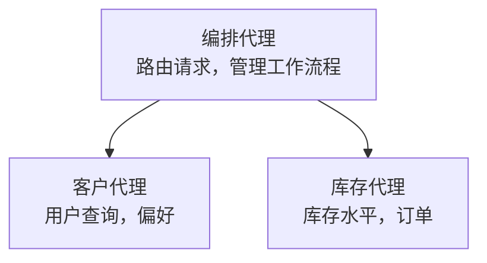

# 第5章：多代理 AI 解决方案

**📚 课程**: [AZD For Beginners](../../README.md) | **⏱️ 时长**: 2-3 小时 | **⭐ 难度**: 高级

---

## 概述

本章涵盖高级多代理架构模式、代理编排以及用于复杂场景的生产就绪 AI 部署。

> 已在 2026 年 3 月使用 `azd 1.23.12` 验证。

## 学习目标

完成本章后，您将：
- 了解多代理架构模式
- 部署协调的 AI 代理系统
- 实现代理间通信
- 构建可用于生产环境的多代理解决方案

---

## 📚 课程内容

| # | 课程 | 描述 | 时间 |
|---|--------|-------------|------|
| 1 | [零售多代理解决方案](../../examples/retail-scenario.md) | 完整实现演练 | 90 分钟 |
| 2 | [协调模式](../chapter-06-pre-deployment/coordination-patterns.md) | 代理编排策略 | 30 分钟 |
| 3 | [ARM 模板部署](../../examples/retail-multiagent-arm-template/README.md) | 一键部署 | 30 分钟 |

---

## 🚀 快速开始

```bash
# 选项 1：从模板部署
azd init --template agent-openai-python-prompty
azd up

# 选项 2：从代理清单部署（需要 azure.ai.agents 扩展）
azd extension install azure.ai.agents
azd ai agent init -m agent-manifest.yaml
azd up
```

> **哪种方法？** 使用 `azd init --template` 从一个可用示例开始。 当您有自己的代理清单时，使用 `azd ai agent init`。 有关完整细节，请参阅 [AZD AI CLI 参考](../chapter-08-production/production-ai-practices.md#azd-ai-cli-commands-and-extensions)。

---

## 🤖 多代理架构


---

## 🎯 精选方案：零售多代理

该 [零售多代理解决方案](../../examples/retail-scenario.md) 演示：

- <strong>客户代理</strong>: 处理用户交互和偏好
- <strong>库存代理</strong>: 管理库存和订单处理
- <strong>编排器</strong>: 协调代理之间的工作
- <strong>共享内存</strong>: 跨代理上下文管理

### 使用的服务

| 服务 | 用途 |
|---------|---------|
| Microsoft Foundry Models | 语言理解 |
| Azure AI Search | 产品目录 |
| Cosmos DB | 代理状态和内存 |
| Container Apps | 代理托管 |
| Application Insights | 监控 |

---

## 🔗 导航

| 方向 | 章节 |
|-----------|---------|
| <strong>上一章</strong> | [第4章：基础设施](../chapter-04-infrastructure/README.md) |
| <strong>下一章</strong> | [第6章：预部署](../chapter-06-pre-deployment/README.md) |

---

## 📖 相关资源

- [AI 代理指南](../chapter-02-ai-development/agents.md)
- [生产 AI 实践](../chapter-08-production/production-ai-practices.md)
- [AI 故障排除](../chapter-07-troubleshooting/ai-troubleshooting.md)

---

<!-- CO-OP TRANSLATOR DISCLAIMER START -->
**免责声明**:
本文件已使用 AI 翻译服务 [Co-op Translator](https://github.com/Azure/co-op-translator) 进行翻译。尽管我们力求准确，但请注意，自动翻译可能包含错误或不准确之处。原始文件的原语言版本应被视为权威来源。对于重要信息，建议使用专业人工翻译。对于因使用本翻译而产生的任何误解或曲解，我们不承担责任。
<!-- CO-OP TRANSLATOR DISCLAIMER END -->