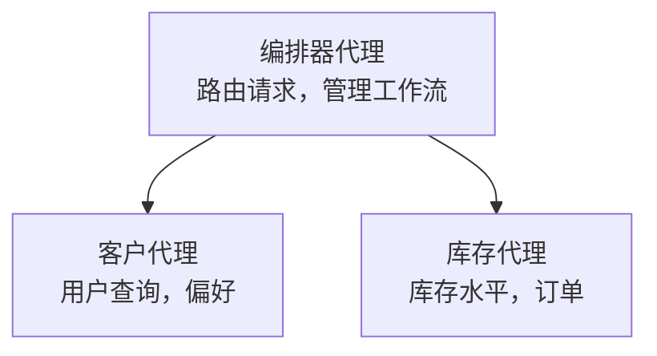

# 第5章：多智能体 AI 解决方案

**📚 Course**: [AZD 入门](../../README.md) | **⏱️ Duration**: 2-3 hours | **⭐ Complexity**: 高级

---

## 概述

本章介绍高级多智能体架构模式、代理编排以及面向复杂场景的生产就绪 AI 部署。

## 学习目标

完成本章后，你将能够：
- 了解多智能体架构模式
- 部署协调的 AI 代理系统
- 实现代理之间的通信
- 构建面向生产的多智能体解决方案

---

## 📚 Lessons

| # | Lesson | Description | Time |
|---|--------|-------------|------|
| 1 | [零售多智能体解决方案](../../examples/retail-scenario.md) | 完整实现演练 | 90 min |
| 2 | [协调模式](../chapter-06-pre-deployment/coordination-patterns.md) | 代理编排策略 | 30 min |
| 3 | [ARM 模板部署](../../examples/retail-multiagent-arm-template/README.md) | 一键部署 | 30 min |

---

## 🚀 Quick Start

```bash
# 选项 1：从模板部署
azd init --template agent-openai-python-prompty
azd up

# 选项 2：从代理清单部署 (需要 azure.ai.agents 扩展)
azd extension install azure.ai.agents
azd ai agent init -m agent-manifest.yaml
azd up
```

> **选择哪种方法？** 使用 `azd init --template` 从可用示例开始。使用 `azd ai agent init` 当你有自己的 agent 清单时。参见 [AZD AI CLI 参考](../chapter-08-production/production-ai-practices.md#azd-ai-cli-commands-and-extensions) 以获取完整说明。

---

## 🤖 多智能体架构


---

## 🎯 精选解决方案：零售多智能体

[零售多智能体解决方案](../../examples/retail-scenario.md) 展示了：

- <strong>客户代理</strong>：处理用户交互和偏好
- <strong>库存代理</strong>：管理库存和订单处理
- <strong>协调器</strong>：在代理之间进行协调
- <strong>共享内存</strong>：跨代理的上下文管理

### 使用的服务

| Service | Purpose |
|---------|---------|
| Microsoft Foundry Models | 语言理解 |
| Azure AI Search | 产品目录 |
| Cosmos DB | 代理状态和内存 |
| Container Apps | 代理托管 |
| Application Insights | 监控 |

---

## 🔗 Navigation

| Direction | Chapter |
|-----------|---------|
| **Previous** | [第4章：基础设施](../chapter-04-infrastructure/README.md) |
| **Next** | [第6章：预部署](../chapter-06-pre-deployment/README.md) |

---

## 📖 Related Resources

- [AI 代理指南](../chapter-02-ai-development/agents.md)
- [生产环境 AI 实践](../chapter-08-production/production-ai-practices.md)
- [AI 故障排除](../chapter-07-troubleshooting/ai-troubleshooting.md)

---

<!-- CO-OP TRANSLATOR DISCLAIMER START -->
**免责声明**:
本文档已使用 AI 翻译服务 [Co-op Translator](https://github.com/Azure/co-op-translator) 进行翻译。虽然我们努力确保准确性，但请注意，自动翻译可能包含错误或不准确之处。原始母语文档应被视为具有权威性的来源。对于关键信息，建议采用专业人工翻译。对于因使用本翻译而产生的任何误解或误释，我们不承担任何责任。
<!-- CO-OP TRANSLATOR DISCLAIMER END -->